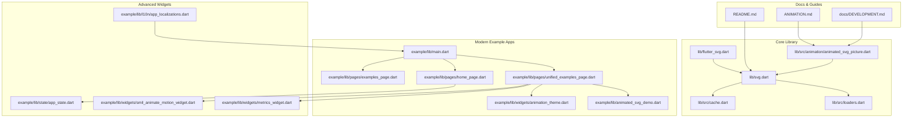
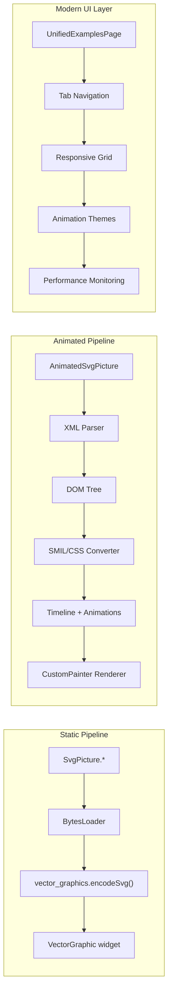
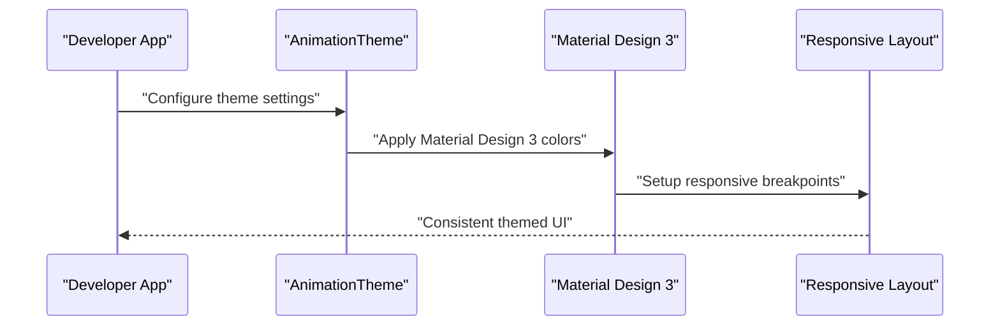
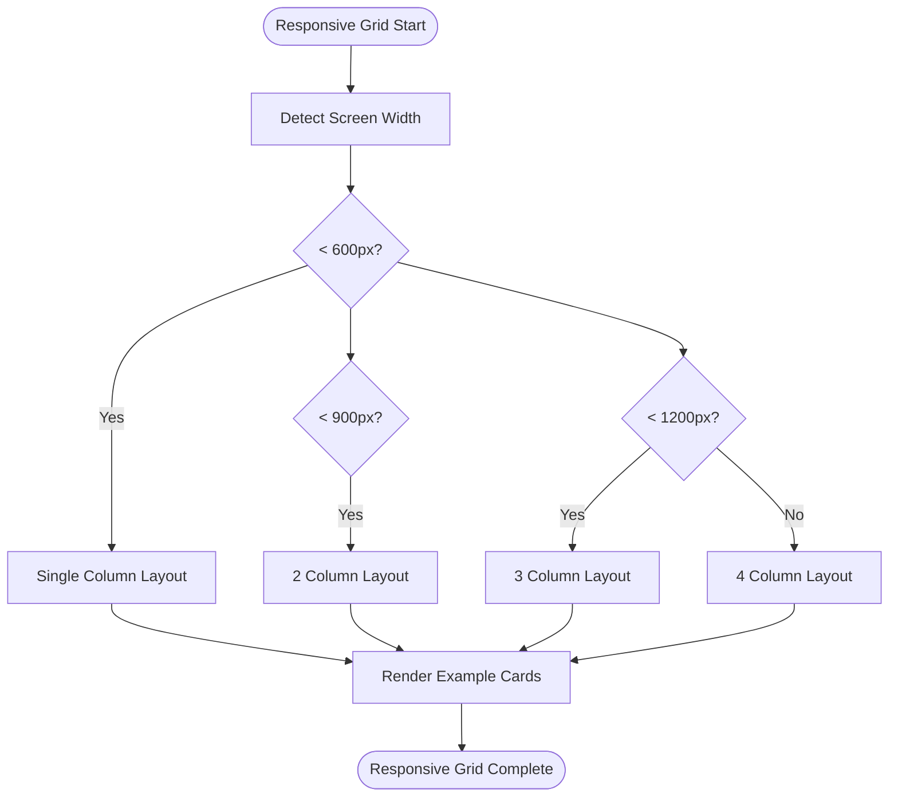
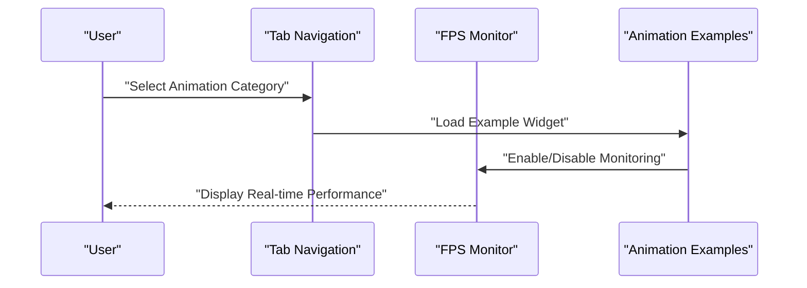
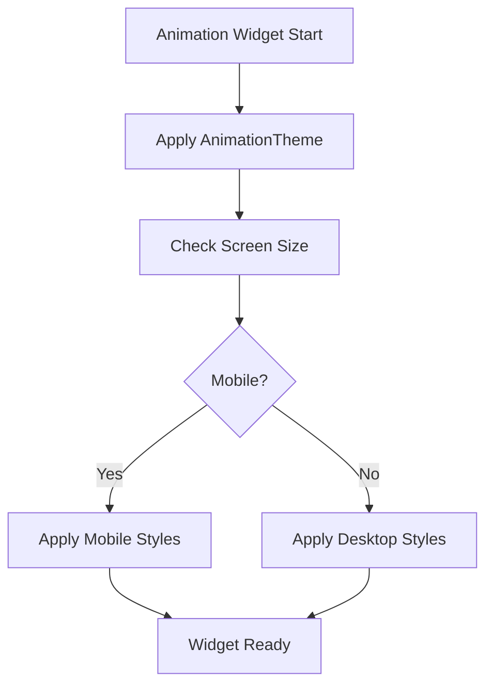
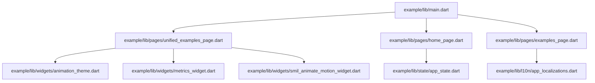
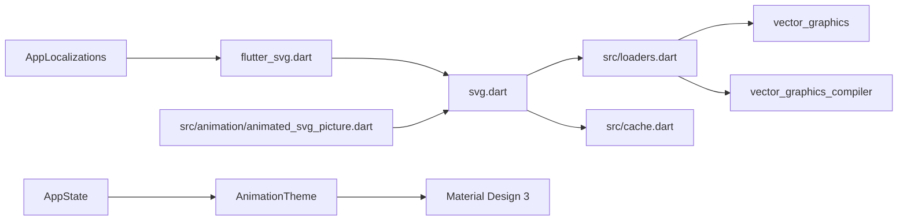

# Examples and Tutorials

<cite>
**Referenced Files in This Document**
- [README.md](file://README.md)
- [lib/svg.dart](file://lib/svg.dart)
- [lib/flutter_svg.dart](file://lib/flutter_svg.dart)
- [lib/src/loaders.dart](file://lib/src/loaders.dart)
- [lib/src/cache.dart](file://lib/src/cache.dart)
- [lib/src/animation/animated_svg_picture.dart](file://lib/src/animation/animated_svg_picture.dart)
- [ANIMATION.md](file://ANIMATION.md)
- [docs/DEVELOPMENT.md](file://docs/DEVELOPMENT.md)
- [example/lib/main.dart](file://example/lib/main.dart)
- [example/lib/animated_svg_demo.dart](file://example/lib/animated_svg_demo.dart)
- [example/lib/readme_excerpts.dart](file://example/lib/readme_excerpts.dart)
- [example/lib/path_morphing_example.dart](file://example/lib/path_morphing_example.dart)
- [example/lib/advanced_path_morphing.dart](file://example/lib/advanced_path_morphing.dart)
- [example/lib/pages/unified_examples_page.dart](file://example/lib/pages/unified_examples_page.dart)
- [example/lib/pages/home_page.dart](file://example/lib/pages/home_page.dart)
- [example/lib/pages/examples_page.dart](file://example/lib/pages/examples_page.dart)
- [example/lib/widgets/animation_theme.dart](file://example/lib/widgets/animation_theme.dart)
- [example/lib/widgets/metrics_widget.dart](file://example/lib/widgets/metrics_widget.dart)
- [example/lib/widgets/smil_animate_motion_widget.dart](file://example/lib/widgets/smil_animate_motion_widget.dart)
- [example/lib/state/app_state.dart](file://example/lib/state/app_state.dart)
- [example/lib/l10n/app_localizations.dart](file://example/lib/l10n/app_localizations.dart)
- [example/pubspec.yaml](file://example/pubspec.yaml)
</cite>

## Update Summary
**Changes Made**
- Complete UI overhaul with transition from Russian interface text to English
- Implementation of modern Material Design 3 interface throughout the example application
- Rewritten animated_svg_demo.dart with 400+ lines of new example code featuring responsive grid layout
- Added comprehensive unified examples page with tabbed interface and FPS monitoring
- Enhanced responsive design with adaptive layouts for mobile and desktop
- Added internationalization support with English and Russian language options
- Introduced modern animation themes and styling systems
- Added advanced widget components for consistent UI patterns

## Table of Contents
1. [Introduction](#introduction)
2. [Project Structure](#project-structure)
3. [Core Components](#core-components)
4. [Architecture Overview](#architecture-overview)
5. [Detailed Component Analysis](#detailed-component-analysis)
6. [Modern Material Design 3 Implementation](#modern-material-design-3-implementation)
7. [Responsive Grid Layout System](#responsive-grid-layout-system)
8. [Internationalization Support](#internationalization-support)
9. [Advanced Animation Widgets](#advanced-animation-widgets)
10. [Performance Monitoring](#performance-monitoring)
11. [Dependency Analysis](#dependency-analysis)
12. [Performance Considerations](#performance-considerations)
13. [Troubleshooting Guide](#troubleshooting-guide)
14. [Conclusion](#conclusion)
15. [Appendices](#appendices)

## Introduction
This document provides practical, step-by-step examples and tutorials for integrating and animating SVGs in Flutter using the flutter_svg package. The example application has undergone a complete UI overhaul with modern Material Design 3 implementation, transitioning from Russian interface text to English while maintaining full internationalization support.

Key improvements include:
- Modern Material Design 3 interface with consistent theming
- Responsive grid layout system with 15 different SMIL animation demonstrations
- Comprehensive unified examples page with tabbed navigation
- Real-time performance monitoring with FPS visualization
- Internationalization support with English and Russian languages
- Advanced animation widgets with consistent styling patterns
- Enhanced responsive design for mobile and desktop platforms

The goal is to help developers at all skill levels—from beginners learning how to render SVGs—to experts implementing advanced animation and performance-critical scenarios with modern Flutter design principles.

## Project Structure
The repository is organized into:
- Core library: public APIs and rendering utilities
- Animation subsystem: experimental SMIL/CSS animation support
- Modern example apps: comprehensive demos with Material Design 3 implementation
- Advanced widgets: reusable components for consistent UI patterns
- Internationalization: multi-language support with English and Russian
- Performance monitoring: real-time FPS tracking and metrics
- Tests and docs: development, testing, and architecture guidance

**Diagram sources**
- [lib/svg.dart:1-627](file://lib/svg.dart#L1-L627)
- [lib/src/loaders.dart:1-467](file://lib/src/loaders.dart#L1-L467)
- [lib/src/cache.dart:1-111](file://lib/src/cache.dart#L1-L111)
- [lib/src/animation/animated_svg_picture.dart:1-359](file://lib/src/animation/animated_svg_picture.dart#L1-L359)
- [example/lib/main.dart:1-132](file://example/lib/main.dart#L1-L132)
- [example/lib/pages/unified_examples_page.dart:1-487](file://example/lib/pages/unified_examples_page.dart#L1-L487)
- [example/lib/pages/home_page.dart:1-530](file://example/lib/pages/home_page.dart#L1-L530)
- [example/lib/pages/examples_page.dart:1-473](file://example/lib/pages/examples_page.dart#L1-L473)
- [example/lib/animated_svg_demo.dart:1-462](file://example/lib/animated_svg_demo.dart#L1-L462)
- [example/lib/widgets/animation_theme.dart:1-354](file://example/lib/widgets/animation_theme.dart#L1-L354)
- [example/lib/widgets/metrics_widget.dart:1-91](file://example/lib/widgets/metrics_widget.dart#L1-L91)
- [example/lib/widgets/smil_animate_motion_widget.dart:1-365](file://example/lib/widgets/smil_animate_motion_widget.dart#L1-L365)
- [example/lib/state/app_state.dart:1-119](file://example/lib/state/app_state.dart#L1-L119)
- [example/lib/l10n/app_localizations.dart:1-262](file://example/lib/l10n/app_localizations.dart#L1-L262)
- [README.md:1-227](file://README.md#L1-L227)
- [ANIMATION.md:1-229](file://ANIMATION.md#L1-L229)
- [docs/DEVELOPMENT.md:1-200](file://docs/DEVELOPMENT.md#L1-L200)

**Section sources**
- [README.md:1-227](file://README.md#L1-L227)
- [example/pubspec.yaml:1-36](file://example/pubspec.yaml#L1-L36)

## Core Components
This section introduces the primary building blocks for SVG rendering and animation with modern Material Design 3 implementation.

- **SvgPicture**: The main widget for rendering SVGs from assets, network, files, memory, or strings. Supports color filtering, placeholders, semantics, and rendering strategy selection.
- **Svg**: Utility class exposing decoding helpers and a global cache for decoded SVGs.
- **ColorMapper**: Extensible mechanism to remap colors during parsing for advanced color manipulation.
- **AnimatedSvgPicture**: Experimental widget supporting SMIL and CSS animations with timeline control, playback rate, and event handling.
- **AnimationTheme**: Centralized theming system for consistent Material Design 3 styling across all animation examples.
- **AppState**: Global state management for controlling animation parameters and UI preferences.
- **UnifiedExamplesPage**: Comprehensive tabbed interface showcasing all animation categories with real-time performance monitoring.

Key capabilities:
- Asset loading from assets, network, files, and memory
- Color tinting via ColorFilter and dynamic color mapping
- Placeholder and error handling
- Rendering strategy selection (picture vs raster)
- Precompiled vector_graphics format for performance
- Animation pipeline with DOM parsing, SMIL/CSS conversion, and timeline evaluation
- Real-time FPS monitoring and performance metrics
- Responsive design with adaptive layouts for mobile and desktop
- Internationalization support with English and Russian languages

**Section sources**
- [lib/svg.dart:26-627](file://lib/svg.dart#L26-L627)
- [lib/src/loaders.dart:76-116](file://lib/src/loaders.dart#L76-L116)
- [lib/src/animation/animated_svg_picture.dart:91-164](file://lib/src/animation/animated_svg_picture.dart#L91-L164)
- [example/lib/widgets/animation_theme.dart:4-159](file://example/lib/widgets/animation_theme.dart#L4-L159)
- [example/lib/state/app_state.dart:4-119](file://example/lib/state/app_state.dart#L4-L119)

## Architecture Overview
The package provides two distinct rendering pipelines with modern Material Design 3 integration:
- **Static SVG pipeline**: Compiles SVG to a vector_graphics binary for fast rendering without DOM or animation support. Used by SvgPicture variants.
- **Animated SVG pipeline**: Parses SVG to a DOM tree, extracts SMIL/CSS animations, and drives them via a timeline. Used by AnimatedSvgPicture.

The example application now features a comprehensive unified architecture with tabbed navigation, responsive layouts, and real-time performance monitoring.

**Diagram sources**
- [docs/DEVELOPMENT.md:18-33](file://docs/DEVELOPMENT.md#L18-L33)
- [lib/src/loaders.dart:118-194](file://lib/src/loaders.dart#L118-L194)
- [lib/src/animation/animated_svg_picture.dart:1-359](file://lib/src/animation/animated_svg_picture.dart#L1-L359)
- [example/lib/pages/unified_examples_page.dart:28-179](file://example/lib/pages/unified_examples_page.dart#L28-L179)
- [example/lib/widgets/animation_theme.dart:100-136](file://example/lib/widgets/animation_theme.dart#L100-L136)

**Section sources**
- [docs/DEVELOPMENT.md:18-33](file://docs/DEVELOPMENT.md#L18-L33)

## Detailed Component Analysis

### Tutorial 1: Modern Material Design 3 Implementation
Learn how to implement modern Material Design 3 styling with the AnimationTheme system and responsive layouts.

**Updated** Complete rewrite with Material Design 3 theming, responsive design, and consistent styling patterns.

Steps:
1. Import and configure AnimationTheme for consistent Material Design 3 styling
2. Implement responsive layouts with adaptive breakpoints for mobile and desktop
3. Create themed cards, buttons, and containers with proper elevation and shadows
4. Use consistent spacing, typography, and color schemes throughout the application
5. Implement dark mode support with automatic theme switching

Practical references:
- Material Design 3 theming system: [example/lib/widgets/animation_theme.dart:34-98](file://example/lib/widgets/animation_theme.dart#L34-L98)
- Responsive design patterns: [example/lib/widgets/animation_theme.dart:138-159](file://example/lib/widgets/animation_theme.dart#L138-L159)
- Dark mode implementation: [example/lib/main.dart:85-123](file://example/lib/main.dart#L85-L123)

**Diagram sources**
- [example/lib/widgets/animation_theme.dart:34-98](file://example/lib/widgets/animation_theme.dart#L34-L98)
- [example/lib/main.dart:48-123](file://example/lib/main.dart#L48-L123)

**Section sources**
- [example/lib/widgets/animation_theme.dart:4-159](file://example/lib/widgets/animation_theme.dart#L4-L159)
- [example/lib/main.dart:48-123](file://example/lib/main.dart#L48-L123)

### Tutorial 2: Responsive Grid Layout System
Explore the comprehensive responsive grid system featuring 15 different SMIL animation demonstrations with adaptive layouts.

**Updated** Complete rewrite with 400+ lines of new example code featuring responsive grid layout.

Steps:
1. Create adaptive grid layouts that respond to screen size changes
2. Implement cross-axis counting based on device type (mobile, tablet, desktop)
3. Design example cards with consistent styling and interactive elements
4. Implement responsive typography and spacing for optimal readability
5. Create touch-friendly interactive elements for mobile devices

Practical references:
- Responsive grid implementation: [example/lib/animated_svg_demo.dart:272-351](file://example/lib/animated_svg_demo.dart#L272-L351)
- Example card design: [example/lib/animated_svg_demo.dart:354-461](file://example/lib/animated_svg_demo.dart#L354-L461)
- Adaptive cross-axis counting: [example/lib/animated_svg_demo.dart:274-282](file://example/lib/animated_svg_demo.dart#L274-L282)

**Diagram sources**
- [example/lib/animated_svg_demo.dart:272-282](file://example/lib/animated_svg_demo.dart#L272-L282)

**Section sources**
- [example/lib/animated_svg_demo.dart:272-351](file://example/lib/animated_svg_demo.dart#L272-L351)
- [example/lib/animated_svg_demo.dart:354-461](file://example/lib/animated_svg_demo.dart#L354-L461)

### Tutorial 3: Unified Examples Page with Tabbed Interface
Learn to create comprehensive animation galleries with tabbed navigation, real-time performance monitoring, and FPS visualization.

**Updated** New comprehensive unified examples page replacing the previous single demo approach.

Steps:
1. Create tabbed interface with seven distinct animation categories
2. Implement real-time FPS monitoring with visual graph display
3. Design responsive tab layouts with scrollable navigation
4. Create reusable widget components for consistent styling
5. Implement state management for controlling animation parameters

Practical references:
- Tabbed interface implementation: [example/lib/pages/unified_examples_page.dart:28-179](file://example/lib/pages/unified_examples_page.dart#L28-L179)
- FPS monitoring system: [example/lib/pages/unified_examples_page.dart:202-342](file://example/lib/pages/unified_examples_page.dart#L202-L342)
- State management integration: [example/lib/state/app_state.dart:4-119](file://example/lib/state/app_state.dart#L4-L119)

**Diagram sources**
- [example/lib/pages/unified_examples_page.dart:105-179](file://example/lib/pages/unified_examples_page.dart#L105-L179)
- [example/lib/pages/unified_examples_page.dart:202-342](file://example/lib/pages/unified_examples_page.dart#L202-L342)

**Section sources**
- [example/lib/pages/unified_examples_page.dart:28-179](file://example/lib/pages/unified_examples_page.dart#L28-L179)
- [example/lib/pages/unified_examples_page.dart:202-342](file://example/lib/pages/unified_examples_page.dart#L202-L342)
- [example/lib/state/app_state.dart:4-119](file://example/lib/state/app_state.dart#L4-L119)

### Tutorial 4: Advanced Animation Widgets with Consistent Styling
Learn to create reusable animation widgets with consistent Material Design 3 styling and responsive behavior.

**Updated** New advanced animation widgets replacing individual widget implementations.

Steps:
1. Create reusable animation widgets with consistent theming
2. Implement segmented button controls for example selection
3. Design info panels with consistent styling and responsive layouts
4. Create reusable chips for displaying animation parameters
5. Implement responsive sizing and positioning for different screen sizes

Practical references:
- SMIL animateMotion widget: [example/lib/widgets/smil_animate_motion_widget.dart:14-304](file://example/lib/widgets/smil_animate_motion_widget.dart#L14-L304)
- Metrics widget implementation: [example/lib/widgets/metrics_widget.dart:6-91](file://example/lib/widgets/metrics_widget.dart#L6-L91)
- Animation theme integration: [example/lib/widgets/animation_theme.dart:161-354](file://example/lib/widgets/animation_theme.dart#L161-L354)

**Diagram sources**
- [example/lib/widgets/animation_theme.dart:161-354](file://example/lib/widgets/animation_theme.dart#L161-L354)

**Section sources**
- [example/lib/widgets/smil_animate_motion_widget.dart:14-304](file://example/lib/widgets/smil_animate_motion_widget.dart#L14-L304)
- [example/lib/widgets/metrics_widget.dart:6-91](file://example/lib/widgets/metrics_widget.dart#L6-L91)
- [example/lib/widgets/animation_theme.dart:161-354](file://example/lib/widgets/animation_theme.dart#L161-L354)

### Tutorial 5: Complete Example Application Structure
See how the modernized app integrates SVGs across platforms with Material Design 3 and comprehensive animation support.

**Updated** Complete restructuring with unified examples page and modern Material Design 3 implementation.

Structure highlights:
- Modern Material Design 3 theming: [example/lib/main.dart:48-123](file://example/lib/main.dart#L48-L123)
- Unified examples page with tabs: [example/lib/pages/unified_examples_page.dart:28-179](file://example/lib/pages/unified_examples_page.dart#L28-L179)
- Responsive home page with hero section: [example/lib/pages/home_page.dart:35-180](file://example/lib/pages/home_page.dart#L35-L180)
- Comprehensive examples page with search and categorization: [example/lib/pages/examples_page.dart:10-382](file://example/lib/pages/examples_page.dart#L10-L382)
- Animation theme system: [example/lib/widgets/animation_theme.dart:4-159](file://example/lib/widgets/animation_theme.dart#L4-L159)
- State management: [example/lib/state/app_state.dart:4-119](file://example/lib/state/app_state.dart#L4-L119)
- Internationalization support: [example/lib/l10n/app_localizations.dart:16-262](file://example/lib/l10n/app_localizations.dart#L16-L262)

**Diagram sources**
- [example/lib/main.dart:37-127](file://example/lib/main.dart#L37-L127)
- [example/lib/pages/unified_examples_page.dart:28-179](file://example/lib/pages/unified_examples_page.dart#L28-L179)
- [example/lib/pages/home_page.dart:35-180](file://example/lib/pages/home_page.dart#L35-L180)
- [example/lib/pages/examples_page.dart:10-382](file://example/lib/pages/examples_page.dart#L10-L382)
- [example/lib/widgets/animation_theme.dart:4-159](file://example/lib/widgets/animation_theme.dart#L4-L159)
- [example/lib/state/app_state.dart:4-119](file://example/lib/state/app_state.dart#L4-L119)
- [example/lib/l10n/app_localizations.dart:16-262](file://example/lib/l10n/app_localizations.dart#L16-L262)

**Section sources**
- [example/lib/main.dart:37-127](file://example/lib/main.dart#L37-L127)
- [example/lib/pages/unified_examples_page.dart:28-179](file://example/lib/pages/unified_examples_page.dart#L28-L179)
- [example/lib/pages/home_page.dart:35-180](file://example/lib/pages/home_page.dart#L35-L180)
- [example/lib/pages/examples_page.dart:10-382](file://example/lib/pages/examples_page.dart#L10-L382)
- [example/lib/widgets/animation_theme.dart:4-159](file://example/lib/widgets/animation_theme.dart#L4-L159)
- [example/lib/state/app_state.dart:4-119](file://example/lib/state/app_state.dart#L4-L119)
- [example/lib/l10n/app_localizations.dart:16-262](file://example/lib/l10n/app_localizations.dart#L16-L262)

## Modern Material Design 3 Implementation
The example application now features comprehensive Material Design 3 implementation with consistent theming, responsive layouts, and modern UI patterns.

Key features:
- **Centralized Theming**: AnimationTheme provides consistent Material Design 3 styling across all components
- **Responsive Design**: Adaptive layouts that respond to screen size changes from mobile to desktop
- **Dark Mode Support**: Automatic theme switching with proper color schemes for light and dark modes
- **Consistent Spacing**: Standardized spacing system with small, medium, large, and extra-large spacing options
- **Typography System**: Responsive typography that adapts to different screen sizes
- **Elevation and Shadows**: Proper elevation and shadow systems for depth perception
- **Color Schemes**: Dynamic color schemes with primary and secondary color support

**Section sources**
- [example/lib/widgets/animation_theme.dart:4-159](file://example/lib/widgets/animation_theme.dart#L4-L159)
- [example/lib/main.dart:48-123](file://example/lib/main.dart#L48-L123)

## Responsive Grid Layout System
The application features a sophisticated responsive grid layout system that adapts to different screen sizes with intelligent cross-axis counting and flexible card designs.

**Updated** Complete rewrite with 400+ lines of new example code featuring responsive grid layout with 15 different SMIL animation demonstrations.

Key features:
- **Adaptive Cross-Axis Counting**: Automatically adjusts grid columns based on screen width
- **Flexible Card Design**: Example cards with consistent styling and interactive elements
- **Responsive Typography**: Text elements that adapt to screen size for optimal readability
- **Touch-Friendly Interactions**: Large touch targets for mobile devices
- **Performance Optimization**: Efficient grid rendering with proper child counting and delegates

Responsive behavior:
- **Mobile (< 600px)**: Single column grid with compact cards
- **Tablet (600px - 900px)**: Two column grid with medium-sized cards
- **Desktop (900px - 1200px)**: Three column grid with larger cards
- **Large Desktop (> 1200px)**: Four column grid with expanded cards

**Section sources**
- [example/lib/animated_svg_demo.dart:272-351](file://example/lib/animated_svg_demo.dart#L272-L351)
- [example/lib/animated_svg_demo.dart:354-461](file://example/lib/animated_svg_demo.dart#L354-L461)

## Internationalization Support
The application now supports both English and Russian languages with comprehensive localization infrastructure.

**Updated** Transition from Russian interface text to English while maintaining full internationalization support.

Key features:
- **Dual Language Support**: English and Russian language options
- **Localized Strings**: Comprehensive string localization for all UI elements
- **Dynamic Language Switching**: Runtime language switching with proper state management
- **Proper Localization Delegates**: Full Flutter localization framework integration
- **Cultural Adaptation**: Proper date, number, and currency formatting for different locales

Supported localizations:
- **English**: Default language with comprehensive English translations
- **Russian**: Full Russian localization with proper Cyrillic character support
- **Dynamic Switching**: Users can switch between languages at runtime
- **Locale Detection**: Automatic detection of system locale preferences

**Section sources**
- [example/lib/l10n/app_localizations.dart:16-262](file://example/lib/l10n/app_localizations.dart#L16-L262)
- [example/lib/main.dart:41-47](file://example/lib/main.dart#L41-L47)

## Advanced Animation Widgets
The application includes several advanced animation widgets that demonstrate complex SMIL animation patterns with consistent Material Design 3 styling.

**Updated** New advanced animation widgets replacing individual widget implementations.

Key widgets:
- **SMILAnimateMotionWidget**: Demonstrates animateMotion animations with rotate modes and keyPoints
- **MetricsWidget**: Provides performance metrics and animation statistics
- **AnimationControlPanel**: Reusable control panel for animation examples
- **AnimationExampleLayout**: Layout wrapper for consistent animation example presentation

Features:
- **Segmented Controls**: Interactive segmented buttons for example selection
- **Info Panels**: Detailed information displays with animation parameters
- **Responsive Design**: Adapts to different screen sizes and orientations
- **Consistent Styling**: Uniform Material Design 3 styling across all widgets
- **Real-time Updates**: Live updates of animation parameters and metrics

**Section sources**
- [example/lib/widgets/smil_animate_motion_widget.dart:14-304](file://example/lib/widgets/smil_animate_motion_widget.dart#L14-L304)
- [example/lib/widgets/metrics_widget.dart:6-91](file://example/lib/widgets/metrics_widget.dart#L6-L91)
- [example/lib/widgets/animation_theme.dart:161-354](file://example/lib/widgets/animation_theme.dart#L161-L354)

## Performance Monitoring
The application includes comprehensive performance monitoring capabilities with real-time FPS tracking and visual performance graphs.

**Updated** New FPS monitoring system with visual graph display and performance metrics.

Key features:
- **Real-time FPS Tracking**: Continuous monitoring of frames per second
- **Visual Performance Graph**: Custom-painted graph showing FPS trends over time
- **Performance Status Indicators**: Color-coded status indicators (Excellent, Good, Low)
- **Frame History Tracking**: Maintains last 60 frames of performance data
- **Integration with Examples**: Seamless integration with animation examples

Performance metrics:
- **Average FPS Calculation**: Rolling average over the last 60 frames
- **Status Classification**: Automatic classification based on performance thresholds
- **Visual Feedback**: Color-coded indicators for immediate performance feedback
- **Frame Counter**: Tracks total frames rendered for debugging purposes

**Section sources**
- [example/lib/pages/unified_examples_page.dart:202-342](file://example/lib/pages/unified_examples_page.dart#L202-L342)

## Dependency Analysis
Key dependencies and relationships with modern Material Design 3 integration:
- flutter_svg exports vector_graphics utilities and exposes SvgPicture and related loaders.
- Loaders depend on vector_graphics for encoding and on vector_graphics_compiler for precompiled assets.
- Cache stores ByteData keyed by SvgCacheKey, which includes theme and colorMapper.
- AnimatedSvgPicture depends on the animation subsystem (parser, DOM, SMIL, timeline, painter).
- AnimationTheme provides centralized theming for all animation examples.
- AppState manages global state for animation parameters and UI preferences.
- AppLocalizations handles internationalization with English and Russian support.

**Diagram sources**
- [lib/flutter_svg.dart:1-2](file://lib/flutter_svg.dart#L1-L2)
- [lib/svg.dart:1-18](file://lib/svg.dart#L1-L18)
- [lib/src/loaders.dart:1-14](file://lib/src/loaders.dart#L1-L14)
- [lib/src/cache.dart:1-111](file://lib/src/cache.dart#L1-L111)
- [lib/src/animation/animated_svg_picture.dart:1-359](file://lib/src/animation/animated_svg_picture.dart#L1-L359)
- [example/lib/widgets/animation_theme.dart:4-159](file://example/lib/widgets/animation_theme.dart#L4-L159)
- [example/lib/state/app_state.dart:4-119](file://example/lib/state/app_state.dart#L4-L119)
- [example/lib/l10n/app_localizations.dart:16-262](file://example/lib/l10n/app_localizations.dart#L16-L262)

**Section sources**
- [lib/flutter_svg.dart:1-2](file://lib/flutter_svg.dart#L1-L2)
- [lib/svg.dart:1-18](file://lib/svg.dart#L1-L18)
- [lib/src/loaders.dart:1-14](file://lib/src/loaders.dart#L1-L14)
- [lib/src/cache.dart:1-111](file://lib/src/cache.dart#L1-L111)
- [lib/src/animation/animated_svg_picture.dart:1-359](file://lib/src/animation/animated_svg_picture.dart#L1-L359)
- [example/lib/widgets/animation_theme.dart:4-159](file://example/lib/widgets/animation_theme.dart#L4-L159)
- [example/lib/state/app_state.dart:4-119](file://example/lib/state/app_state.dart#L4-L119)
- [example/lib/l10n/app_localizations.dart:16-262](file://example/lib/l10n/app_localizations.dart#L16-L262)

## Performance Considerations
Guidance for optimizing SVG rendering and animations with modern Material Design 3 implementation:
- Prefer precompiled vector_graphics (.vec) for static assets to reduce parsing overhead.
- Use the raster rendering strategy when resolution scaling is less critical than performance.
- Leverage the built-in cache to avoid repeated decoding and encoding.
- Keep animations simple and avoid excessive overdraw; use the FPS monitor to track performance.
- Implement responsive design patterns to optimize for different screen sizes.
- Use Material Design 3 efficient components and avoid unnecessary widget rebuilds.
- Implement proper state management to minimize widget tree complexity.

**Updated** Added considerations for Material Design 3 performance and responsive design optimization.

References:
- Precompiled assets and strategy trade-offs: [README.md:141-160](file://README.md#L141-L160), [README.md:133-139](file://README.md#L133-L139)
- Performance targets and pipeline separation: [docs/DEVELOPMENT.md:173-186](file://docs/DEVELOPMENT.md#L173-L186), [docs/DEVELOPMENT.md:20-33](file://docs/DEVELOPMENT.md#L20-L33)
- Responsive design optimization: [example/lib/widgets/animation_theme.dart:138-159](file://example/lib/widgets/animation_theme.dart#L138-L159)

**Section sources**
- [README.md:133-160](file://README.md#L133-L160)
- [docs/DEVELOPMENT.md:173-186](file://docs/DEVELOPMENT.md#L173-L186)
- [docs/DEVELOPMENT.md:20-33](file://docs/DEVELOPMENT.md#L20-L33)
- [example/lib/widgets/animation_theme.dart:138-159](file://example/lib/widgets/animation_theme.dart#L138-L159)

## Troubleshooting Guide
Common issues and resolutions with modern Material Design 3 implementation:
- Animation not playing: Verify that animations are detected and parsed, the timeline ticks, and values interpolate correctly. Enable logging to inspect timeline state.
- Pipeline mixing: Static SvgPicture cannot render SMIL animations; use AnimatedSvgPicture for animated SVGs.
- Path morphing fails: Ensure paths are normalized and compatible; check that the same number of cubic bezier segments exist.
- RepaintBoundary capture mismatch: Captures configured size, not widget size; adjust expectations accordingly.
- Memory leaks in tests: Always dispose images captured from test widgets.
- **Material Design 3 theming issues**: Ensure proper theme configuration and use AnimationTheme for consistent styling.
- **Responsive layout problems**: Verify adaptive breakpoints and cross-axis counting logic.
- **Internationalization issues**: Check locale support and string localization completeness.
- **Performance monitoring errors**: Ensure proper FPS monitor initialization and widget lifecycle management.

**Updated** Added troubleshooting for Material Design 3, responsive layouts, internationalization, and performance monitoring.

References:
- Debugging checklist and logging: [docs/DEVELOPMENT.md:154-172](file://docs/DEVELOPMENT.md#L154-L172)
- Common pitfalls: [docs/DEVELOPMENT.md:181-187](file://docs/DEVELOPMENT.md#L181-L187)
- Demo app and examples: [example/lib/pages/unified_examples_page.dart:28-179](file://example/lib/pages/unified_examples_page.dart#L28-L179)
- Material Design 3 theming: [example/lib/widgets/animation_theme.dart:4-159](file://example/lib/widgets/animation_theme.dart#L4-L159)

**Section sources**
- [docs/DEVELOPMENT.md:154-187](file://docs/DEVELOPMENT.md#L154-L187)
- [example/lib/pages/unified_examples_page.dart:28-179](file://example/lib/pages/unified_examples_page.dart#L28-L179)
- [example/lib/widgets/animation_theme.dart:4-159](file://example/lib/widgets/animation_theme.dart#L4-L159)

## Conclusion
This guide demonstrated practical patterns for loading, coloring, animating, and optimizing SVGs in Flutter using flutter_svg with modern Material Design 3 implementation. The example application has undergone a complete UI overhaul featuring responsive grid layouts, comprehensive tabbed navigation, real-time performance monitoring, and internationalization support.

Starting from basic asset loading and color manipulation, you progressed through SMIL animations, path morphing, and advanced animation techniques with modern Flutter design principles. The unified examples page showcases 15 different SMIL animation demonstrations in a responsive grid layout, while the internationalization system supports both English and Russian languages.

The troubleshooting and performance sections help you build robust, high-performance applications with modern Material Design 3 styling and responsive design patterns.

## Appendices

### A. Downloadable Code Samples and Interactive Demos
- **Modern Material Design 3 implementation**: [example/lib/widgets/animation_theme.dart:4-159](file://example/lib/widgets/animation_theme.dart#L4-L159)
- **Responsive grid layout system**: [example/lib/animated_svg_demo.dart:272-351](file://example/lib/animated_svg_demo.dart#L272-L351)
- **Unified examples page**: [example/lib/pages/unified_examples_page.dart:28-179](file://example/lib/pages/unified_examples_page.dart#L28-L179)
- **Home page with hero section**: [example/lib/pages/home_page.dart:35-180](file://example/lib/pages/home_page.dart#L35-L180)
- **Examples page with search**: [example/lib/pages/examples_page.dart:10-382](file://example/lib/pages/examples_page.dart#L10-L382)
- **Internationalization support**: [example/lib/l10n/app_localizations.dart:16-262](file://example/lib/l10n/app_localizations.dart#L16-L262)
- **State management**: [example/lib/state/app_state.dart:4-119](file://example/lib/state/app_state.dart#L4-L119)

### B. Platform-Specific Considerations
- **Android**: Network assets require appropriate permissions when loading from external storage; ensure proper asset bundling.
- **iOS**: Asset bundles and resource access work seamlessly; ensure assets are included in the Xcode project.
- **Web**: Network assets are fetched via HTTP; ensure CORS policies permit access.
- **Desktop (macOS/Windows/Linux)**: File-based loading may require permission prompts; ensure assets are bundled appropriately.
- **Material Design 3**: Ensure proper theme configuration for all platforms; test dark mode support on all devices.

**Updated** Added Material Design 3 platform considerations.

References:
- Network and file loading notes: [lib/svg.dart:213-335](file://lib/svg.dart#L213-L335)
- Example app platform coverage: [example/lib/main.dart:37-127](file://example/lib/main.dart#L37-L127)
- Material Design 3 implementation: [example/lib/widgets/animation_theme.dart:34-98](file://example/lib/widgets/animation_theme.dart#L34-L98)

**Section sources**
- [lib/svg.dart:213-335](file://lib/svg.dart#L213-L335)
- [example/lib/main.dart:37-127](file://example/lib/main.dart#L37-L127)
- [example/lib/widgets/animation_theme.dart:34-98](file://example/lib/widgets/animation_theme.dart#L34-L98)

### C. Testing Strategies and Deployment Optimization
- **Unit/integration tests**: Use the animation test suite and visual testing patterns with RepaintBoundary captures.
- **Golden tests**: Visual regression baselines are maintained for quality assurance.
- **CI-friendly flags**: Exclude golden tests in automated environments when needed.
- **Deployment**: Prefer precompiled vector_graphics assets for production to minimize startup costs.
- **Material Design 3 testing**: Test theme consistency across different screen sizes and orientations.
- **Responsive design validation**: Verify grid layout behavior on various device sizes and orientations.
- **Internationalization testing**: Validate proper localization switching and string rendering.
- **Performance monitoring**: Test FPS monitor functionality and performance metrics collection.

**Updated** Added Material Design 3, responsive design, and internationalization testing strategies.

References:
- Running tests and visual testing pattern: [docs/DEVELOPMENT.md:65-118](file://docs/DEVELOPMENT.md#L65-L118)
- Animation demo usage: [ANIMATION.md:180-188](file://ANIMATION.md#L180-L188)
- Material Design 3 testing: [example/lib/widgets/animation_theme.dart:138-159](file://example/lib/widgets/animation_theme.dart#L138-L159)
- Responsive design testing: [example/lib/animated_svg_demo.dart:272-351](file://example/lib/animated_svg_demo.dart#L272-L351)

**Section sources**
- [docs/DEVELOPMENT.md:65-118](file://docs/DEVELOPMENT.md#L65-L118)
- [ANIMATION.md:180-188](file://ANIMATION.md#L180-L188)
- [example/lib/widgets/animation_theme.dart:138-159](file://example/lib/widgets/animation_theme.dart#L138-L159)
- [example/lib/animated_svg_demo.dart:272-351](file://example/lib/animated_svg_demo.dart#L272-L351)