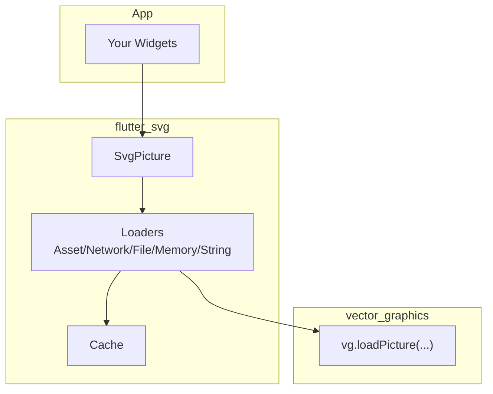
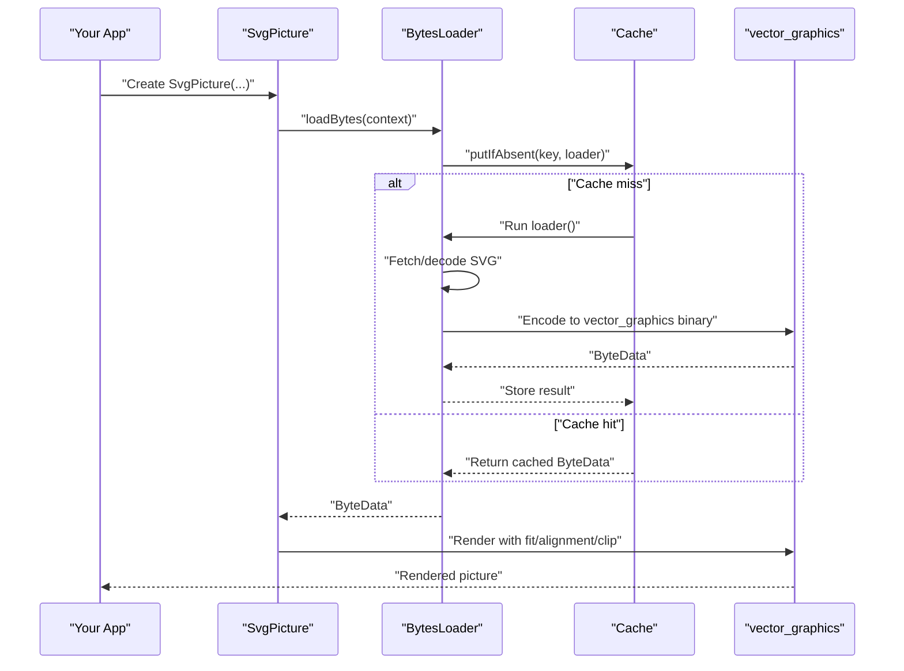
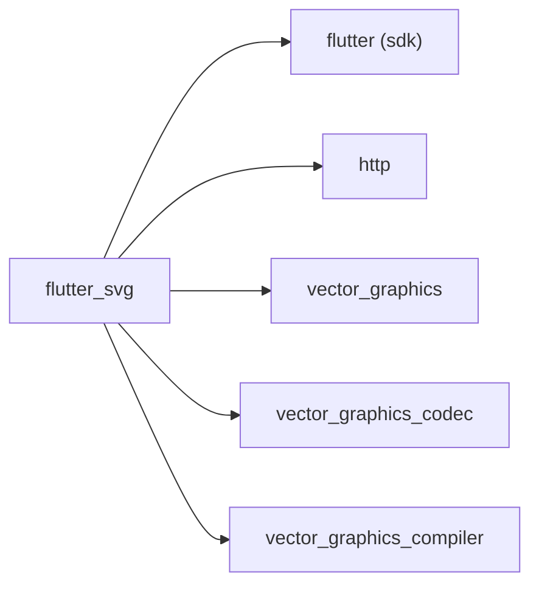

# Getting Started

<cite>
**Referenced Files in This Document**
- [pubspec.yaml](file://pubspec.yaml)
- [README.md](file://README.md)
- [svg.dart](file://lib/svg.dart)
- [loaders.dart](file://lib/src/loaders.dart)
- [cache.dart](file://lib/src/cache.dart)
- [widget_svg_test.dart](file://test/widget_svg_test.dart)
- [battery_charging.xml](file://example/assets/android_vd/battery_charging.xml)
- [main.dart](file://example/lib/main.dart)
</cite>

## Table of Contents
1. [Introduction](#introduction)
2. [Project Structure](#project-structure)
3. [Core Components](#core-components)
4. [Architecture Overview](#architecture-overview)
5. [Detailed Component Analysis](#detailed-component-analysis)
6. [Dependency Analysis](#dependency-analysis)
7. [Performance Considerations](#performance-considerations)
8. [Troubleshooting Guide](#troubleshooting-guide)
9. [Conclusion](#conclusion)
10. [Appendices](#appendices)

## Introduction
This guide helps you quickly install and use the flutter_svg package to render SVGs in Flutter apps. You will learn how to add the package, import it, and render SVGs from assets, the network, and raw data. You will also explore basic configuration like sizing, alignment, color tinting, and semantics, along with common pitfalls and how to troubleshoot them.

## Project Structure
At a high level, the package exposes a single widget, SvgPicture, which supports multiple input sources (asset, network, file, memory, string). Internally, it uses specialized loaders and a cache to efficiently decode and render vector graphics.

**Diagram sources**
- [svg.dart:57-627](file://lib/svg.dart#L57-L627)
- [loaders.dart:118-467](file://lib/src/loaders.dart#L118-L467)
- [cache.dart:1-111](file://lib/src/cache.dart#L1-L111)

**Section sources**
- [svg.dart:1-627](file://lib/svg.dart#L1-L627)
- [loaders.dart:1-467](file://lib/src/loaders.dart#L1-L467)
- [cache.dart:1-111](file://lib/src/cache.dart#L1-L111)

## Core Components
- SvgPicture: The primary widget to render SVGs from multiple sources. It accepts width, height, fit, alignment, colorFilter, semantics, placeholders, and rendering strategy.
- Loaders: Internal classes that fetch and decode SVG data from different sources (asset, network, file, memory, string) and prepare vector_graphics binary data.
- Cache: A global cache for decoded SVGs keyed by loader and theme to avoid repeated work.

Key highlights:
- SvgPicture.asset(): Render an SVG from your app’s assets.
- SvgPicture.network(): Fetch and render an SVG from a URL.
- Basic color tinting: Use colorFilter to apply a ColorFilter to the rendered SVG.
- Semantics: Provide accessibility labels and control semantics visibility.

**Section sources**
- [svg.dart:57-627](file://lib/svg.dart#L57-L627)
- [loaders.dart:118-467](file://lib/src/loaders.dart#L118-L467)
- [cache.dart:1-111](file://lib/src/cache.dart#L1-L111)

## Architecture Overview
SvgPicture delegates loading and decoding to a BytesLoader subclass, which prepares vector_graphics binary data via a compute-isolate pipeline. The data is cached and later rendered by the vector_graphics engine.

**Diagram sources**
- [svg.dart:543-560](file://lib/svg.dart#L543-L560)
- [loaders.dart:156-187](file://lib/src/loaders.dart#L156-L187)
- [cache.dart:65-93](file://lib/src/cache.dart#L65-L93)

## Detailed Component Analysis

### Installation and Setup
- Add the package to your pubspec.yaml dependencies.
- Import the package in your Dart files.
- Ensure your SVG assets are included in your app’s assets configuration.

What to do:
- Add flutter_svg to your pubspec.yaml dependencies.
- Run your platform-specific package retrieval command.
- Confirm your assets are listed in pubspec.yaml if you plan to load from assets.

**Section sources**
- [pubspec.yaml:12-19](file://pubspec.yaml#L12-L19)
- [README.md:11-13](file://README.md#L11-L13)

### Basic Import and First Widget
- Import the package in your Dart file.
- Create a widget using SvgPicture.asset() with a valid asset path and optional semantics.

Step-by-step:
- Import the package.
- Reference an existing SVG asset in your app.
- Wrap it with SvgPicture.asset() and optionally set semanticsLabel.
- Place it in your widget tree.

**Section sources**
- [README.md:13-19](file://README.md#L13-L19)
- [svg.dart:180-211](file://lib/svg.dart#L180-L211)

### Asset Loading (Local SVGs)
- Use SvgPicture.asset() to render an SVG from your app’s assets.
- Provide width and/or height to avoid layout shifts during load.
- Optionally set semanticsLabel for accessibility.

Common options:
- width, height, fit, alignment, semanticsLabel, excludeFromSemantics, clipBehavior.

**Section sources**
- [svg.dart:180-211](file://lib/svg.dart#L180-L211)
- [widget_svg_test.dart:345-379](file://test/widget_svg_test.dart#L345-L379)

### Network Loading (Remote SVGs)
- Use SvgPicture.network() to fetch and render an SVG from a URL.
- Optionally pass headers and a custom http.Client.
- Provide width and/or height to stabilize layout.
- Consider placeholderBuilder for long loads.

**Section sources**
- [svg.dart:245-276](file://lib/svg.dart#L245-L276)
- [loaders.dart:417-466](file://lib/src/loaders.dart#L417-L466)
- [widget_svg_test.dart:481-554](file://test/widget_svg_test.dart#L481-L554)

### Basic Color Tinting
- Apply a ColorFilter via colorFilter to tint the entire SVG.
- Works with all SvgPicture constructors.

Tip:
- Use ColorFilter.mode(Color, BlendMode) for simple tinting.

**Section sources**
- [svg.dart:449-452](file://lib/svg.dart#L449-L452)
- [widget_svg_test.dart:639-660](file://test/widget_svg_test.dart#L639-L660)

### Creating Your First SVG Rendering Widget
Follow this minimal workflow:
- Choose a source: asset, network, or raw data.
- Instantiate SvgPicture with appropriate parameters (width/height, fit, alignment).
- Optionally set semanticsLabel for accessibility.
- Place the widget in your UI.

Examples in this repository demonstrate:
- Asset-based rendering with semantics.
- Network-based rendering with placeholderBuilder.
- Color tinting via colorFilter.

**Section sources**
- [README.md:13-31](file://README.md#L13-L31)
- [widget_svg_test.dart:345-379](file://test/widget_svg_test.dart#L345-L379)
- [widget_svg_test.dart:481-554](file://test/widget_svg_test.dart#L481-L554)
- [widget_svg_test.dart:639-660](file://test/widget_svg_test.dart#L639-L660)

### Advanced: Color Mapping with ColorMapper
- Use colorMapper to dynamically remap colors during parsing.
- Implement a custom ColorMapper and override substitute.

Use cases:
- Theming or dynamic color overrides based on element or attribute.

**Section sources**
- [README.md:33-78](file://README.md#L33-L78)
- [loaders.dart:76-94](file://lib/src/loaders.dart#L76-L94)
- [widget_svg_test.dart:44-69](file://test/widget_svg_test.dart#L44-L69)

### Example Assets
- The example includes a small Android vector drawable as an SVG-like XML asset.
- Use it to practice asset loading and rendering.

**Section sources**
- [battery_charging.xml:1-22](file://example/assets/android_vd/battery_charging.xml#L1-L22)

## Dependency Analysis
flutter_svg depends on:
- Flutter SDK and Material widgets
- http for network loading
- vector_graphics for rendering
- vector_graphics_codec and vector_graphics_compiler for encoding and optional precompilation

**Diagram sources**
- [pubspec.yaml:12-19](file://pubspec.yaml#L12-L19)

**Section sources**
- [pubspec.yaml:12-19](file://pubspec.yaml#L12-L19)

## Performance Considerations
- Prefer specifying width and height to avoid layout thrashing during load.
- Consider the renderingStrategy:
  - picture: higher fidelity, scalable.
  - raster: potentially faster for specific use cases, less flexible scaling.
- Use placeholders for network loads to improve perceived performance.
- Leverage caching: the package caches decoded vector_graphics binaries by default.

**Section sources**
- [svg.dart:57-627](file://lib/svg.dart#L57-L627)
- [README.md:133-139](file://README.md#L133-L139)
- [cache.dart:1-111](file://lib/src/cache.dart#L1-L111)

## Troubleshooting Guide
Common issues and resolutions:
- Layout shifts during load:
  - Always specify width and/or height on SvgPicture.
- Missing assets:
  - Ensure the asset path exists and is declared in pubspec.yaml.
  - For package assets, use the package parameter.
- Network failures:
  - Provide placeholderBuilder for long loads.
  - Verify URL and headers; consider providing a custom http.Client.
- Accessibility:
  - Set semanticsLabel for meaningful labels; use excludeFromSemantics to suppress if needed.
- Color tinting not applied:
  - Ensure colorFilter is provided; note that color is deprecated in favor of colorFilter.

**Section sources**
- [svg.dart:57-627](file://lib/svg.dart#L57-L627)
- [README.md:80-106](file://README.md#L80-L106)
- [widget_svg_test.dart:571-581](file://test/widget_svg_test.dart#L571-L581)
- [widget_svg_test.dart:583-637](file://test/widget_svg_test.dart#L583-L637)

## Conclusion
You now have the essentials to install flutter_svg, render SVGs from assets and the network, apply basic color tinting, and configure accessibility and layout. As you grow comfortable, explore advanced topics like ColorMapper, rendering strategies, and precompiled vector graphics for improved performance.

## Appendices

### Quick Reference: Constructors and Options
- SvgPicture.asset(assetName, {bundle, package, width, height, fit, alignment, semanticsLabel, excludeFromSemantics, clipBehavior, colorFilter, theme, colorMapper, renderingStrategy})
- SvgPicture.network(url, {headers, width, height, fit, alignment, semanticsLabel, excludeFromSemantics, clipBehavior, colorFilter, theme, colorMapper, httpClient, renderingStrategy})
- Additional constructors: file, memory, string.

**Section sources**
- [svg.dart:180-211](file://lib/svg.dart#L180-L211)
- [svg.dart:245-276](file://lib/svg.dart#L245-L276)
- [svg.dart:308-335](file://lib/svg.dart#L308-L335)
- [svg.dart:364-391](file://lib/svg.dart#L364-L391)
- [svg.dart:420-447](file://lib/svg.dart#L420-L447)

### Example App Entry Point
- The example app demonstrates how to structure a Flutter app; use it as a template for integrating SvgPicture.

**Section sources**
- [main.dart:1-56](file://example/lib/main.dart#L1-L56)