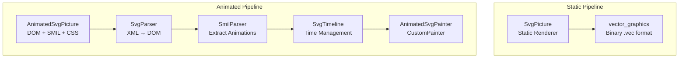
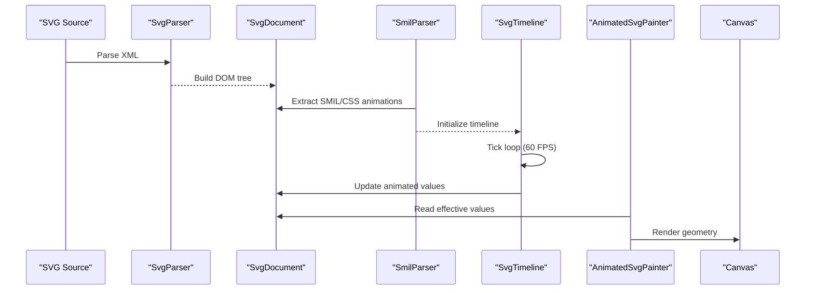
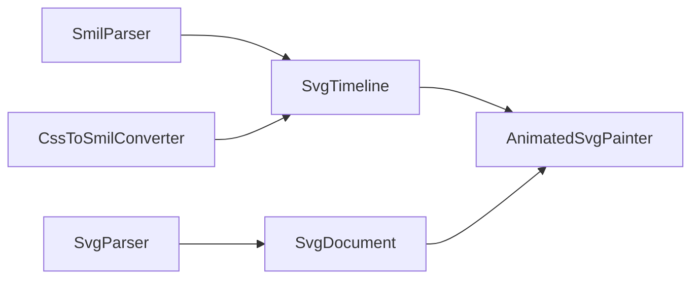

# NEXT STEPS.md

<cite>
**Referenced Files in This Document**
- [NEXT_STEPS.md](file://NEXT_STEPS.md)
- [ROADMAP.md](file://ROADMAP.md)
- [CURRENT_STATUS.md](file://CURRENT_STATUS.md)
- [TODO.md](file://TODO.md)
- [README.md](file://README.md)
- [ARCHITECTURE.md](file://ARCHITECTURE.md)
- [lib/svg.dart](file://lib/svg.dart)
- [lib/src/animation/animated_svg_picture.dart](file://lib/src/animation/animated_svg_picture.dart)
- [lib/src/animation/css_to_smil_converter.dart](file://lib/src/animation/css_to_smil_converter.dart)
- [lib/src/animation/smil/smil_animation.dart](file://lib/src/animation/smil/smil_animation.dart)
- [lib/src/animation/svg_filters_primitives.dart](file://lib/src/animation/svg_filters_primitives.dart)
</cite>

## Table of Contents
1. [Introduction](#introduction)
2. [Project Structure](#project-structure)
3. [Core Components](#core-components)
4. [Architecture Overview](#architecture-overview)
5. [Detailed Component Analysis](#detailed-component-analysis)
6. [Dependency Analysis](#dependency-analysis)
7. [Performance Considerations](#performance-considerations)
8. [Troubleshooting Guide](#troubleshooting-guide)
9. [Conclusion](#conclusion)

## Introduction
This document synthesizes the current development roadmap and next steps for the Flutter SVG support project. It consolidates the authoritative status, active priorities, validation criteria, and execution order established in the repository's primary planning documents. The goal is to provide a clear, actionable blueprint for contributors and maintainers to understand what needs to be accomplished, why it matters, and how to validate completion.

## Project Structure
The project maintains a dual-pipeline architecture:
- Static pipeline using vector_graphics for production-grade rendering
- Animated pipeline preserving DOM for SMIL/CSS animation, hit-testing, and accessibility

**Diagram sources**
- [ARCHITECTURE.md](file://ARCHITECTURE.md)
- [lib/svg.dart](file://lib/svg.dart)
- [lib/src/animation/animated_svg_picture.dart](file://lib/src/animation/animated_svg_picture.dart)

**Section sources**
- [ARCHITECTURE.md](file://ARCHITECTURE.md)
- [lib/svg.dart](file://lib/svg.dart)

## Core Components
- AnimatedSvgPicture: Widget orchestrating DOM parsing, SMIL/CSS animation extraction, timeline management, and rendering via AnimatedSvgPainter
- SmilAnimation: Core SMIL animation model supporting animate, animateTransform, animateMotion, set, and animateColor with advanced timing semantics
- CssToSmilConverter: Bridges CSS animations/keyframes into SMIL for unified runtime
- SvgFiltersPrimitives: Filter graph primitives and baseline semantics for animated pipeline

**Section sources**
- [lib/src/animation/animated_svg_picture.dart](file://lib/src/animation/animated_svg_picture.dart)
- [lib/src/animation/smil/smil_animation.dart](file://lib/src/animation/smil/smil_animation.dart)
- [lib/src/animation/css_to_smil_converter.dart](file://lib/src/animation/css_to_smil_converter.dart)
- [lib/src/animation/svg_filters_primitives.dart](file://lib/src/animation/svg_filters_primitives.dart)

## Architecture Overview
The animated pipeline follows a structured flow from SVG source to Canvas rendering, with SMIL/CSS interoperability and robust animation semantics.

**Diagram sources**
- [ARCHITECTURE.md](file://ARCHITECTURE.md)
- [lib/src/animation/animated_svg_picture.dart](file://lib/src/animation/animated_svg_picture.dart)

**Section sources**
- [ARCHITECTURE.md](file://ARCHITECTURE.md)

## Detailed Component Analysis

### Next Steps Execution Order
The immediate execution priorities are:
1. Improve CSS/SMIL edge-case parity (timing precision, shorthand resolution)
2. Expand external content parity (advanced image transforms, nested foreignObject)
3. Continue modular refactor of remaining large files for dev velocity with API stability and full regression checks
4. Add targeted regression fixtures for CSS/SMIL edge cases

Priority targets for modularization include:
- svg_filters_primitives.dart
- animated_svg_painter_shapes.dart
- animated_svg_picture.dart
- animated_svg_picture_utils.dart

**Section sources**
- [NEXT_STEPS.md](file://NEXT_STEPS.md)

### Active Feature Items (P0 Priorities)
- CSS/SMIL edge-case parity: Complex shorthand resolution, unit handling, timing precision
- External content edge cases: Advanced image transformations, nested foreignObject (60% → 75%)
- Code modularization: Splitting large files for developer velocity

**Section sources**
- [NEXT_STEPS.md](file://NEXT_STEPS.md)

### Validation Gates
Tasks are considered complete only when:
- Behavior is covered by focused tests
- Example/playground demonstrates the feature if UI-visible
- CURRENT_STATUS.md is updated if factual state changed
- docs/RESOLVED_ISSUES.md is updated for closed bug classes

Validation commands:
- dart analyze lib/ test/
- flutter test

**Section sources**
- [NEXT_STEPS.md](file://NEXT_STEPS.md)

### Current Status Snapshot
As of the latest snapshot:
- ~82% Blink SVG parity
- ~95% Filter parity
- ~95% SMIL parity
- 3,563+ tests passing
- 0 analyzer warnings
- 123+ source modules

**Section sources**
- [README.md](file://README.md)
- [CURRENT_STATUS.md](file://CURRENT_STATUS.md)

### Roadmap Alignment
The roadmap reflects current priorities and closed milestones, with validation gates ensuring quality and completeness.

**Section sources**
- [ROADMAP.md](file://ROADMAP.md)

### Work Queue (TODO)
The TODO list captures actionable items and recent completions, including advanced animateMotion semantics, advanced filter graph, advanced clipping/masking, use/symbol inheritance, light sources, and component transfer.

**Section sources**
- [TODO.md](file://TODO.md)

## Dependency Analysis
The animated pipeline components depend on each other in a well-defined order, with clear separation of concerns.

**Diagram sources**
- [lib/src/animation/animated_svg_picture.dart](file://lib/src/animation/animated_svg_picture.dart)
- [lib/src/animation/css_to_smil_converter.dart](file://lib/src/animation/css_to_smil_converter.dart)
- [lib/src/animation/smil/smil_animation.dart](file://lib/src/animation/smil/smil_animation.dart)

**Section sources**
- [lib/src/animation/animated_svg_picture.dart](file://lib/src/animation/animated_svg_picture.dart)
- [lib/src/animation/css_to_smil_converter.dart](file://lib/src/animation/css_to_smil_converter.dart)
- [lib/src/animation/smil/smil_animation.dart](file://lib/src/animation/smil/smil_animation.dart)

## Performance Considerations
- Static subtree caching: Reuse cached Picture objects when no animations are present
- Dirty tracking: Mark nodes dirty when animations change values; only re-render dirty subtrees
- Path optimization: Normalize paths once during parsing; reuse Path objects; use Path.reset() instead of creating new instances
- Future optimizations: Layer caching for independent animations, GPU-accelerated path morphing, reduced allocations in hot paths

**Section sources**
- [ARCHITECTURE.md](file://ARCHITECTURE.md)

## Troubleshooting Guide
- Use structured trace API in AnimatedSvgPicture for runtime diagnostics
- Enable per-frame tick tracing for detailed frame-by-frame analysis
- Leverage playground viewer for importing/exporting JSON reports, filtering, grouping, and widget-test coverage
- Ensure full regression suite passes after every milestone

**Section sources**
- [CURRENT_STATUS.md](file://CURRENT_STATUS.md)
- [TODO.md](file://TODO.md)

## Conclusion
The project is progressing toward comprehensive Blink SVG parity with a strong focus on CSS/SMIL edge cases, external content semantics, and code modularization. The defined validation gates and execution order provide a clear path forward, ensuring quality, stability, and maintainability as new features are delivered.