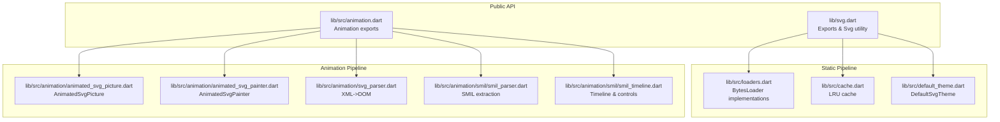
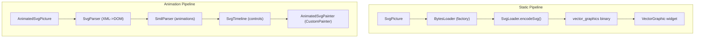
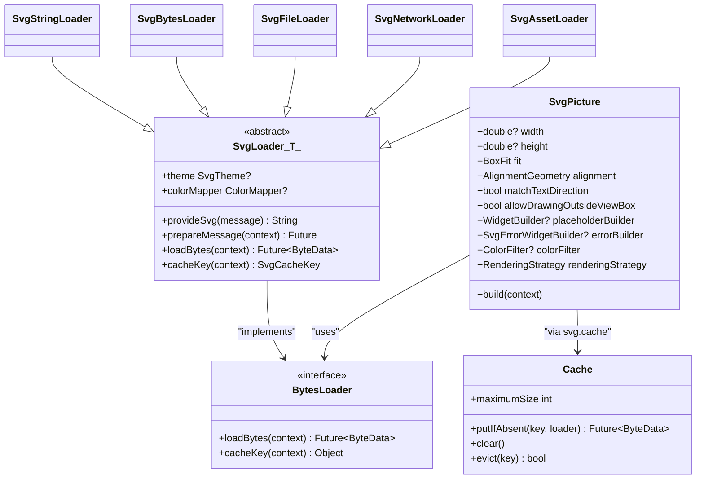
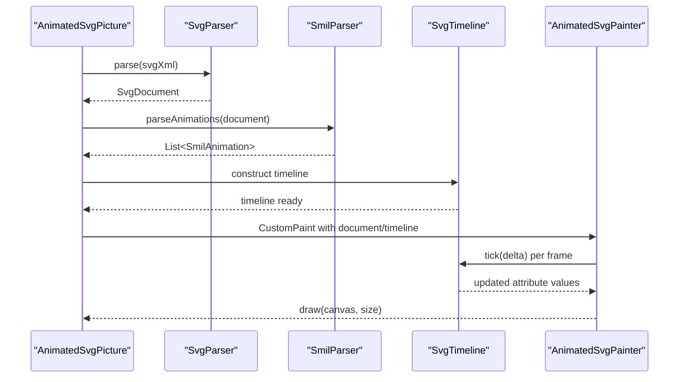
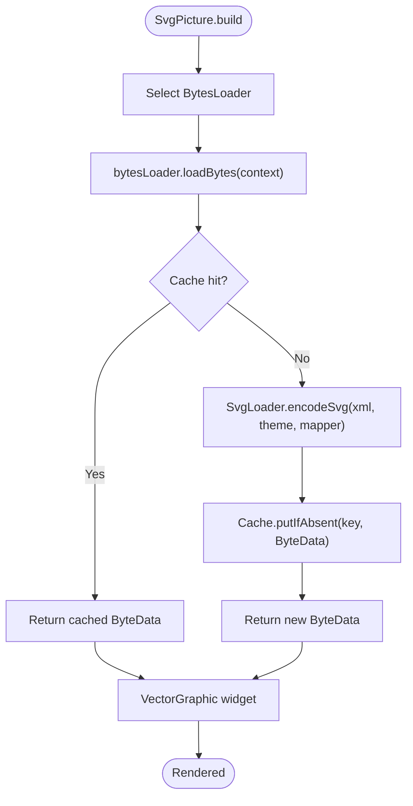
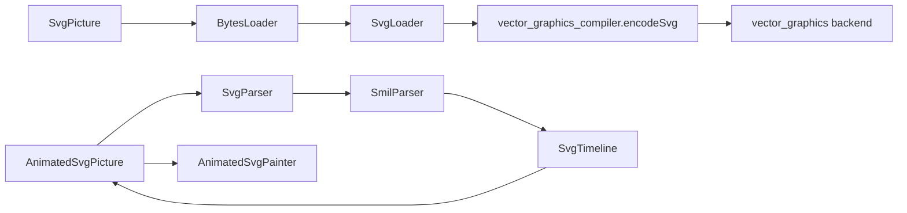

# Architecture Overview

<cite>
**Referenced Files in This Document**
- [svg.dart](file://lib/svg.dart)
- [loaders.dart](file://lib/src/loaders.dart)
- [cache.dart](file://lib/src/cache.dart)
- [default_theme.dart](file://lib/src/default_theme.dart)
- [animation.dart](file://lib/src/animation.dart)
- [ARCHITECTURE.md](file://ARCHITECTURE.md)
- [ANIMATION.md](file://ANIMATION.md)
- [animated_svg_picture.dart](file://lib/src/animation/animated_svg_picture.dart)
- [animated_svg_controller.dart](file://lib/src/animation/animated_svg_controller.dart)
- [animated_svg_painter.dart](file://lib/src/animation/animated_svg_painter.dart)
- [svg_parser.dart](file://lib/src/animation/svg_parser.dart)
- [smil_parser.dart](file://lib/src/animation/smil/smil_parser.dart)
- [smil_timeline.dart](file://lib/src/animation/smil/smil_timeline.dart)
</cite>

## Table of Contents
1. [Introduction](#introduction)
2. [Project Structure](#project-structure)
3. [Core Components](#core-components)
4. [Architecture Overview](#architecture-overview)
5. [Detailed Component Analysis](#detailed-component-analysis)
6. [Dependency Analysis](#dependency-analysis)
7. [Performance Considerations](#performance-considerations)
8. [Troubleshooting Guide](#troubleshooting-guide)
9. [Conclusion](#conclusion)

## Introduction
This document describes the flutter_svg package architecture with a focus on the dual-pipeline design and layered rendering system. The package supports two distinct rendering pipelines:
- Static vector graphics pipeline using vector_graphics for fast, production-ready rendering without animations.
- Experimental animated SVG pipeline using DOM parsing, SMIL animation extraction, and CustomPainter-based rendering for full DOM preservation and SMIL/CSS animation support.

The architecture is organized into three main layers:
- Loading layer: Multiple BytesLoader strategies for assets, network, files, and in-memory data.
- Parsing layer: XML/SVG parsing and SMIL/CSS animation extraction.
- Rendering layer: Vector graphics backend integration and animated CustomPainter rendering.

Design patterns implemented include:
- Factory pattern for BytesLoader creation via SvgPicture constructors.
- Template method pattern in the abstract SvgLoader base class.
- Observer pattern for animation controllers and timelines.

## Project Structure
The repository is organized around a core library with animation extensions:
- Core API exports and public widgets live under lib/.
- Static pipeline loaders and caching are in lib/src/.
- Animation pipeline components are under lib/src/animation/ and lib/src/animation/smil/.

**Diagram sources**
- [svg.dart:1-20](file://lib/svg.dart#L1-L20)
- [animation.dart:1-31](file://lib/src/animation.dart#L1-L31)
- [loaders.dart:1-120](file://lib/src/loaders.dart#L1-L120)
- [cache.dart:1-111](file://lib/src/cache.dart#L1-L111)
- [default_theme.dart:1-36](file://lib/src/default_theme.dart#L1-L36)
- [animated_svg_picture.dart:108-164](file://lib/src/animation/animated_svg_picture.dart#L108-L164)
- [animated_svg_painter.dart](file://lib/src/animation/animated_svg_painter.dart)
- [svg_parser.dart:22-65](file://lib/src/animation/svg_parser.dart#L22-L65)
- [smil_parser.dart:12-39](file://lib/src/animation/smil/smil_parser.dart#L12-L39)
- [smil_timeline.dart:13-50](file://lib/src/animation/smil/smil_timeline.dart#L13-L50)

**Section sources**
- [svg.dart:1-627](file://lib/svg.dart#L1-L627)
- [animation.dart:1-31](file://lib/src/animation.dart#L1-L31)
- [ARCHITECTURE.md:1-297](file://ARCHITECTURE.md#L1-L297)

## Core Components
- SvgPicture: The primary widget for static rendering. It delegates loading to a BytesLoader and uses vector_graphics for optimized rendering.
- BytesLoader implementations: SvgAssetLoader, SvgNetworkLoader, SvgFileLoader, SvgBytesLoader, SvgStringLoader. They encapsulate source-specific loading and provide a unified interface to the static pipeline.
- Cache: LRU cache keyed by SvgCacheKey to avoid repeated encoding and network fetches.
- DefaultSvgTheme: Provides inherited theme values for currentColor and font sizing used during parsing.
- AnimatedSvgPicture: Widget for experimental animated rendering. It builds a DOM, extracts SMIL/CSS animations, manages timelines, and drives CustomPainter rendering.
- AnimatedSvgController: Observer-style controller for programmatic animation control (play, pause, seek, reverse).
- SvgParser: XML-to-DOM converter preserving element structure and IDs.
- SmilParser: Extracts SMIL animations and converts CSS animations to SMIL equivalents.
- SvgTimeline: Manages time, playback rate, event-driven triggers, and animation activation.

**Section sources**
- [svg.dart:56-627](file://lib/svg.dart#L56-L627)
- [loaders.dart:118-467](file://lib/src/loaders.dart#L118-L467)
- [cache.dart:4-111](file://lib/src/cache.dart#L4-L111)
- [default_theme.dart:5-36](file://lib/src/default_theme.dart#L5-L36)
- [animated_svg_picture.dart:108-359](file://lib/src/animation/animated_svg_picture.dart#L108-L359)
- [animated_svg_controller.dart](file://lib/src/animation/animated_svg_controller.dart)
- [svg_parser.dart:22-65](file://lib/src/animation/svg_parser.dart#L22-L65)
- [smil_parser.dart:12-39](file://lib/src/animation/smil/smil_parser.dart#L12-L39)
- [smil_timeline.dart:13-50](file://lib/src/animation/smil/smil_timeline.dart#L13-L50)

## Architecture Overview
The dual-pipeline architecture balances performance and flexibility:
- Static pipeline: Encodes SVG to vector_graphics binary in an isolate, caches results, and renders via vector_graphics widgets. Fast and production-ready but no animation support.
- Animated pipeline: Parses XML to DOM, extracts SMIL/CSS animations, runs a timeline, and renders via CustomPainter. Preserves DOM and supports SMIL/CSS animations but is slower.

**Diagram sources**
- [ARCHITECTURE.md:6-74](file://ARCHITECTURE.md#L6-L74)
- [svg.dart:542-560](file://lib/svg.dart#L542-L560)
- [animated_svg_picture.dart:236-269](file://lib/src/animation/animated_svg_picture.dart#L236-L269)
- [svg_parser.dart:22-65](file://lib/src/animation/svg_parser.dart#L22-L65)
- [smil_parser.dart:12-39](file://lib/src/animation/smil/smil_parser.dart#L12-L39)
- [smil_timeline.dart:13-50](file://lib/src/animation/smil/smil_timeline.dart#L13-L50)
- [animated_svg_painter.dart](file://lib/src/animation/animated_svg_painter.dart)

## Detailed Component Analysis

### Static Pipeline: Loading, Parsing, and Rendering
- Factory pattern: SvgPicture constructors delegate to specific BytesLoader implementations (asset, network, file, memory, string), enabling a clean factory for loading strategies.
- Template method: SvgLoader defines the shared pipeline (prepareMessage, encodeSvg, cacheKey) while subclasses implement provideSvg and prepareMessage specifics.
- Caching: Cache stores ByteData keyed by SvgCacheKey, which includes theme and optional colorMapper to ensure correctness across dynamic themes.

**Diagram sources**
- [svg.dart:56-627](file://lib/svg.dart#L56-L627)
- [loaders.dart:118-467](file://lib/src/loaders.dart#L118-L467)
- [cache.dart:4-111](file://lib/src/cache.dart#L4-L111)

**Section sources**
- [svg.dart:56-627](file://lib/svg.dart#L56-L627)
- [loaders.dart:118-194](file://lib/src/loaders.dart#L118-L194)
- [cache.dart:65-93](file://lib/src/cache.dart#L65-L93)

### Animation Pipeline: DOM, SMIL, Timeline, and Rendering
- DOM model: SvgDocument holds root node, viewBox, width, height, filters, and CSS artifacts. SvgNode captures tag, id, attributes, children, and animations.
- SMIL engine: SmilParser extracts SMIL and CSS animations, building SmilAnimation instances consumed by SvgTimeline. Timeline manages time, playback rate, event-driven activation, and syncbase dependencies.
- Rendering: AnimatedSvgPicture builds a CustomPaint widget backed by AnimatedSvgPainter, which traverses the DOM, applies effective attribute values, and draws geometry recursively.

**Diagram sources**
- [animated_svg_picture.dart:108-164](file://lib/src/animation/animated_svg_picture.dart#L108-L164)
- [svg_parser.dart:22-65](file://lib/src/animation/svg_parser.dart#L22-L65)
- [smil_parser.dart:12-39](file://lib/src/animation/smil/smil_parser.dart#L12-L39)
- [smil_timeline.dart:13-50](file://lib/src/animation/smil/smil_timeline.dart#L13-L50)
- [animated_svg_painter.dart](file://lib/src/animation/animated_svg_painter.dart)

**Section sources**
- [animated_svg_picture.dart:108-359](file://lib/src/animation/animated_svg_picture.dart#L108-L359)
- [svg_parser.dart:22-65](file://lib/src/animation/svg_parser.dart#L22-L65)
- [smil_parser.dart:12-39](file://lib/src/animation/smil/smil_parser.dart#L12-L39)
- [smil_timeline.dart:13-256](file://lib/src/animation/smil/smil_timeline.dart#L13-L256)

### Component Interactions: SvgPicture, BytesLoader, Cache, and vector_graphics Backend
- SvgPicture delegates to a BytesLoader instance chosen by constructor (asset/network/file/memory/string).
- BytesLoader implementations use SvgLoader’s template method to prepare messages, encode SVG via vector_graphics compiler, and cache ByteData.
- Cache keys incorporate theme and optional colorMapper to ensure correctness across dynamic contexts.

**Diagram sources**
- [svg.dart:542-560](file://lib/svg.dart#L542-L560)
- [loaders.dart:156-187](file://lib/src/loaders.dart#L156-L187)
- [cache.dart:65-93](file://lib/src/cache.dart#L65-L93)

**Section sources**
- [svg.dart:542-560](file://lib/svg.dart#L542-L560)
- [loaders.dart:156-194](file://lib/src/loaders.dart#L156-L194)
- [cache.dart:65-93](file://lib/src/cache.dart#L65-L93)

### Design Patterns
- Factory pattern: SvgPicture constructors act as factories selecting appropriate BytesLoader implementations.
- Template method: SvgLoader defines the shared pipeline with protected hooks for subclass customization.
- Observer pattern: AnimatedSvgPicture listens to AnimatedSvgController updates and timeline ticks to drive repaints.

**Section sources**
- [svg.dart:180-447](file://lib/svg.dart#L180-L447)
- [loaders.dart:118-194](file://lib/src/loaders.dart#L118-L194)
- [animated_svg_picture.dart:166-220](file://lib/src/animation/animated_svg_picture.dart#L166-L220)

## Dependency Analysis
The static pipeline depends on vector_graphics and vector_graphics_compiler for encoding. The animation pipeline depends on the xml package for parsing and integrates tightly with Flutter’s CustomPainter and AnimationController.

**Diagram sources**
- [svg.dart:542-560](file://lib/svg.dart#L542-L560)
- [loaders.dart:159-178](file://lib/src/loaders.dart#L159-L178)
- [animation.dart:21-31](file://lib/src/animation.dart#L21-L31)
- [svg_parser.dart:22-65](file://lib/src/animation/svg_parser.dart#L22-L65)
- [smil_parser.dart:12-39](file://lib/src/animation/smil/smil_parser.dart#L12-L39)
- [smil_timeline.dart:13-50](file://lib/src/animation/smil/smil_timeline.dart#L13-L50)
- [animated_svg_painter.dart](file://lib/src/animation/animated_svg_painter.dart)

**Section sources**
- [svg.dart:1-20](file://lib/svg.dart#L1-L20)
- [loaders.dart:1-14](file://lib/src/loaders.dart#L1-L14)
- [animation.dart:1-31](file://lib/src/animation.dart#L1-L31)

## Performance Considerations
- Static pipeline optimizations:
  - Isolate-based encoding reduces UI thread work.
  - LRU caching avoids redundant encoding and network fetches.
  - Theme-aware cache keys prevent incorrect reuse across theme changes.
- Animation pipeline considerations:
  - DOM preservation enables full SMIL support but adds parsing and traversal costs.
  - Timeline-driven dirty tracking and subtree caching can reduce redraw cost.
  - Path normalization and reuse minimize allocation overhead in hot paths.
- Trade-offs:
  - Static pipeline prioritizes speed and memory efficiency.
  - Animation pipeline prioritizes fidelity and runtime control.

**Section sources**
- [ARCHITECTURE.md:174-235](file://ARCHITECTURE.md#L174-L235)
- [cache.dart:65-111](file://lib/src/cache.dart#L65-L111)
- [loaders.dart:156-194](file://lib/src/loaders.dart#L156-L194)

## Troubleshooting Guide
Common issues and guidance:
- Network loading failures: Ensure proper URL and headers; check errorBuilder usage in SvgPicture.
- Asset resolution: Verify asset path and package name; DefaultAssetBundle selection affects cache keys.
- Theme mismatches: DefaultSvgTheme influences currentColor and font sizing; ensure consistent theme usage across widgets.
- Animation not playing: Confirm SVG contains SMIL/CSS animations; verify autoPlay and controller state.
- Memory pressure: Adjust Cache.maximumSize; clear cache when asset bundles change.

**Section sources**
- [svg.dart:278-447](file://lib/svg.dart#L278-L447)
- [default_theme.dart:15-36](file://lib/src/default_theme.dart#L15-L36)
- [cache.dart:13-44](file://lib/src/cache.dart#L13-L44)
- [animated_svg_picture.dart:178-220](file://lib/src/animation/animated_svg_picture.dart#L178-L220)

## Conclusion
The flutter_svg package implements a robust dual-pipeline architecture:
- The static pipeline delivers high-performance vector rendering suitable for production apps.
- The animation pipeline preserves DOM structure and supports SMIL/CSS animations for interactive experiences.
The layered design, combined with factory, template method, and observer patterns, provides clear separation of concerns, extensibility for custom loaders, and maintainable animation controls. Extensibility points include implementing new BytesLoader subclasses, adding custom ColorMapper transformations, and extending the animation pipeline with additional SMIL features.