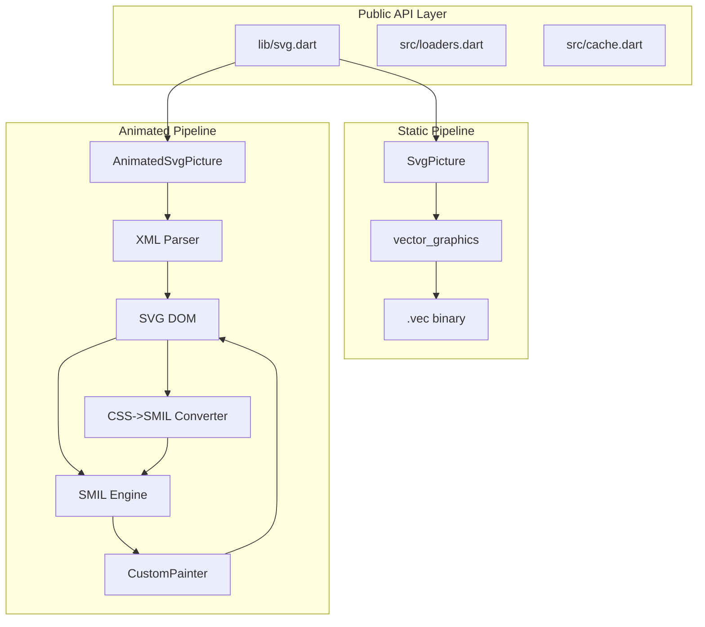
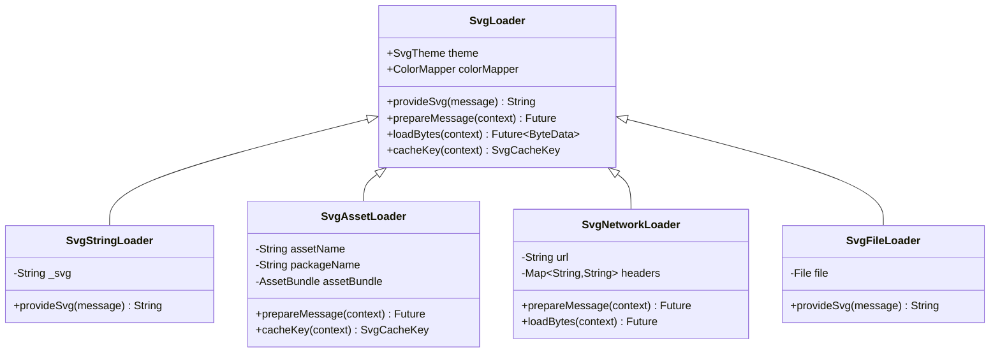
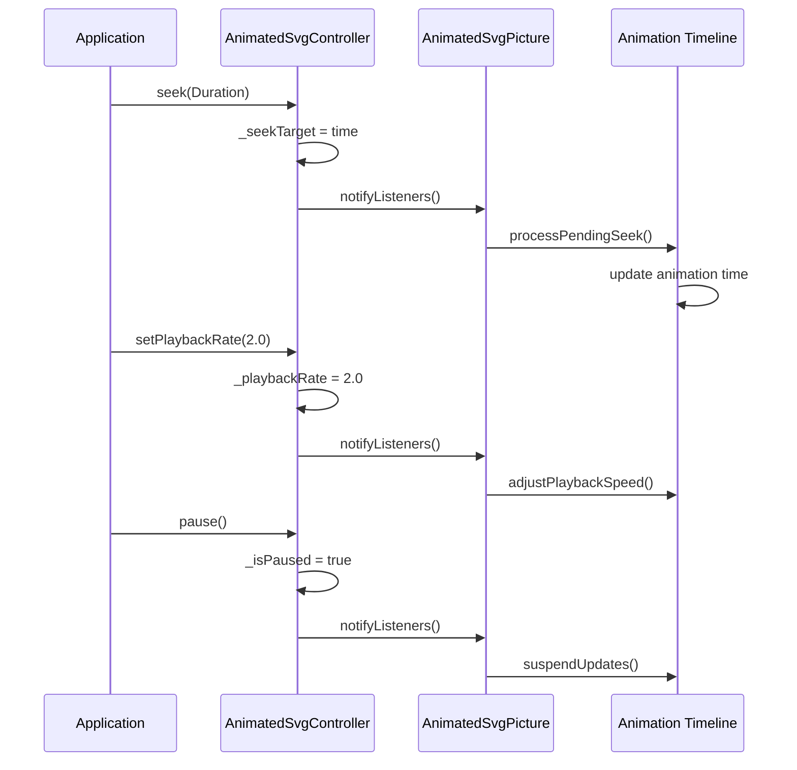
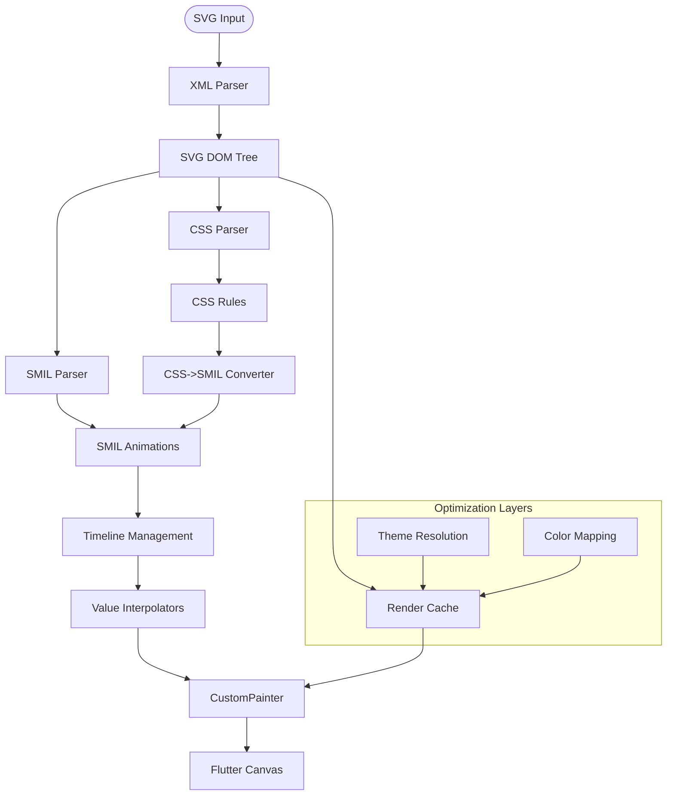
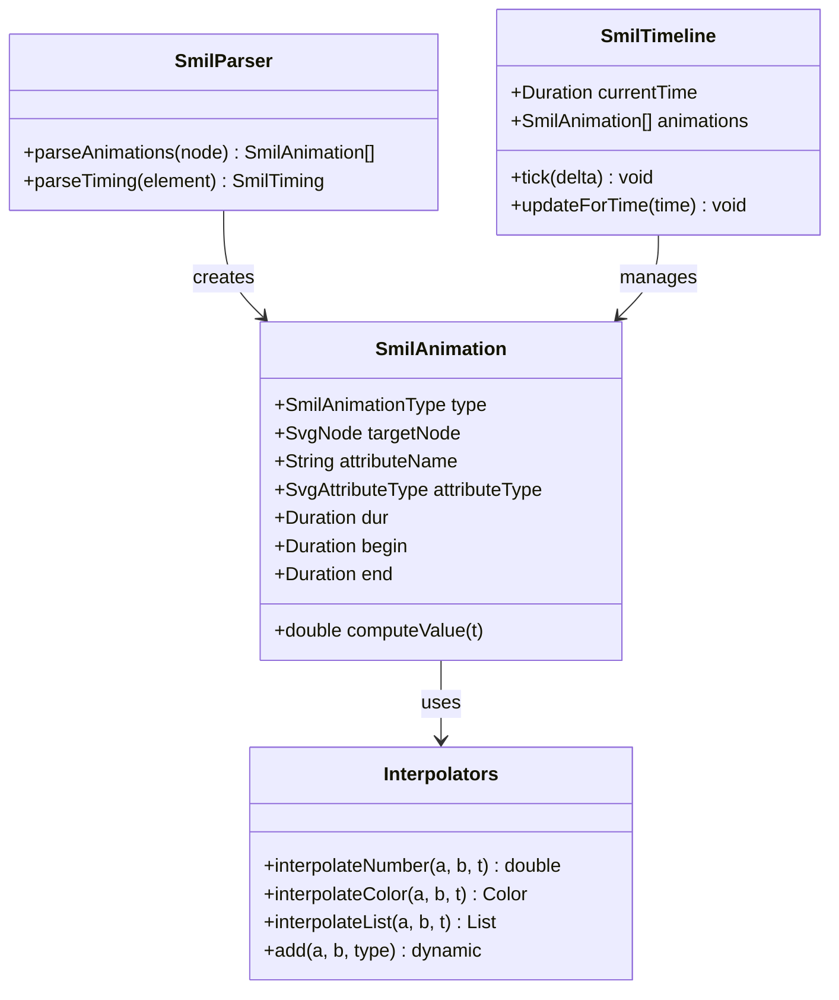
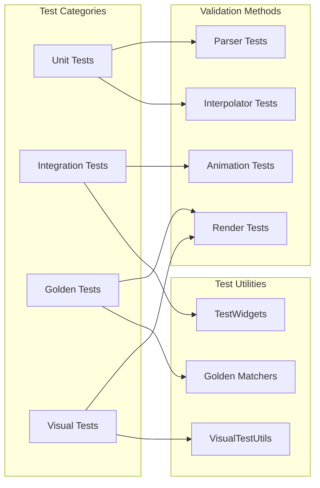
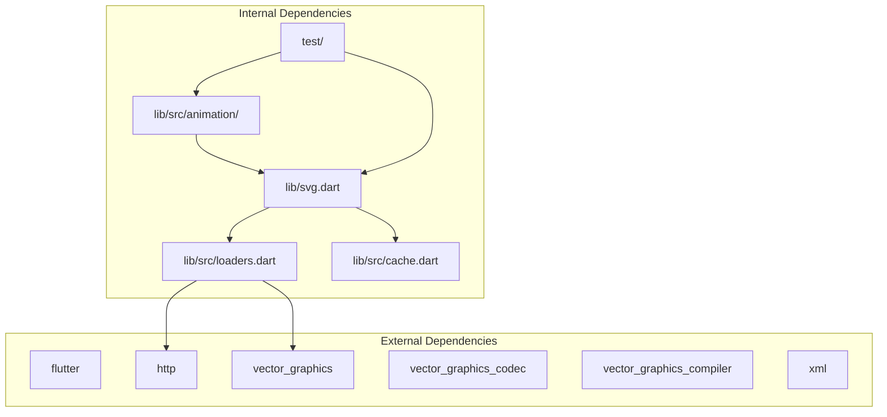

# Comprehensive Gap Analysis

<cite>
**Referenced Files in This Document**
- [README.md](file://README.md)
- [pubspec.yaml](file://pubspec.yaml)
- [docs/COMPREHENSIVE_GAP_ANALYSIS.md](file://docs/COMPREHENSIVE_GAP_ANALYSIS.md)
- [ROADMAP.md](file://ROADMAP.md)
- [ANIMATION.md](file://ANIMATION.md)
- [docs/DEVELOPMENT.md](file://docs/DEVELOPMENT.md)
- [lib/svg.dart](file://lib/svg.dart)
- [lib/src/loaders.dart](file://lib/src/loaders.dart)
- [lib/src/cache.dart](file://lib/src/cache.dart)
- [lib/src/animation/animated_svg_controller.dart](file://lib/src/animation/animated_svg_controller.dart)
- [lib/src/animation/animated_svg_painter.dart](file://lib/src/animation/animated_svg_painter.dart)
- [test/animation/css_animations_test.dart](file://test/animation/css_animations_test.dart)
- [test/animation/smil_test.dart](file://test/animation/smil_test.dart)
</cite>

## Table of Contents
1. [Introduction](#introduction)
2. [Project Structure](#project-structure)
3. [Core Components](#core-components)
4. [Architecture Overview](#architecture-overview)
5. [Detailed Component Analysis](#detailed-component-analysis)
6. [Dependency Analysis](#dependency-analysis)
7. [Performance Considerations](#performance-considerations)
8. [Troubleshooting Guide](#troubleshooting-guide)
9. [Conclusion](#conclusion)

## Introduction
This document presents a comprehensive gap analysis for the Flutter SVG animated pipeline, focusing on achieving Blink-level SVG parity for the AnimatedSvgPicture rendering path. The analysis covers feature coverage across 81+ SVG tags and 25+ filter primitives, identifies priority gaps, and provides actionable recommendations for closing implementation holes.

The project maintains two distinct rendering pipelines:
- Static SVG pipeline using vector_graphics for optimized rendering without animations
- Animated SVG pipeline preserving DOM structure for full SMIL and CSS animation support

**Section sources**
- [README.md:1-227](file://README.md#L1-L227)
- [docs/COMPREHENSIVE_GAP_ANALYSIS.md:1-813](file://docs/COMPREHENSIVE_GAP_ANALYSIS.md#L1-L813)
- [docs/DEVELOPMENT.md:31-46](file://docs/DEVELOPMENT.md#L31-L46)

## Project Structure
The repository follows a layered architecture with clear separation between static and animated rendering paths:

**Diagram sources**
- [docs/DEVELOPMENT.md:31-76](file://docs/DEVELOPMENT.md#L31-L76)
- [lib/svg.dart:57-627](file://lib/svg.dart#L57-L627)

The structure enables:
- High-performance static rendering for production use
- Full DOM-based animation support for experimental features
- Shared caching and theme management across both pipelines

**Section sources**
- [docs/DEVELOPMENT.md:57-76](file://docs/DEVELOPMENT.md#L57-L76)
- [lib/src/loaders.dart:15-74](file://lib/src/loaders.dart#L15-L74)

## Core Components
The animated SVG system consists of several interconnected components working together to achieve comprehensive SVG support:

### Loader System
The loader abstraction provides unified access to SVG data from multiple sources while maintaining theme and color mapping support:

**Diagram sources**
- [lib/src/loaders.dart:121-194](file://lib/src/loaders.dart#L121-L194)
- [lib/src/loaders.dart:234-280](file://lib/src/loaders.dart#L234-L280)
- [lib/src/loaders.dart:343-413](file://lib/src/loaders.dart#L343-L413)
- [lib/src/loaders.dart:417-466](file://lib/src/loaders.dart#L417-L466)

### Animation Controller
The AnimatedSvgController provides programmatic control over animation playback:

**Diagram sources**
- [lib/src/animation/animated_svg_controller.dart:25-160](file://lib/src/animation/animated_svg_controller.dart#L25-L160)

**Section sources**
- [lib/src/loaders.dart:118-194](file://lib/src/loaders.dart#L118-L194)
- [lib/src/animation/animated_svg_controller.dart:25-160](file://lib/src/animation/animated_svg_controller.dart#L25-L160)

## Architecture Overview
The animated SVG pipeline implements a sophisticated rendering system that preserves SVG DOM structure for animation support while maintaining performance optimization opportunities:

**Diagram sources**
- [docs/DEVELOPMENT.md:40-46](file://docs/DEVELOPMENT.md#L40-L46)
- [lib/src/animation/animated_svg_painter.dart:148-200](file://lib/src/animation/animated_svg_painter.dart#L148-L200)

The architecture supports:
- Real-time animation interpolation with 60+ FPS performance targets
- Comprehensive SMIL animation system with CSS interoperability
- Advanced filter effects with 17/25 primitives implemented
- Text rendering with advanced typography support
- Hit-testing and event handling for interactive elements

**Section sources**
- [docs/DEVELOPMENT.md:186-192](file://docs/DEVELOPMENT.md#L186-L192)
- [lib/src/animation/animated_svg_painter.dart:50-140](file://lib/src/animation/animated_svg_painter.dart#L50-L140)

## Detailed Component Analysis

### Feature Coverage Matrix
The current implementation achieves significant coverage across major SVG categories:

| Category | Elements | Implemented | Coverage | Impact |
|----------|----------|-------------|----------|--------|
| Geometry Shapes | 8 | 8 | 100% | None |
| Text & Typography | 4 | 3 | 75% | Medium |
| Structural Elements | 7 | 7 | 100% | Low |
| Paint Servers | 4 | 4 | 100% | None |
| Clipping & Masking | 2 | 2 | 100% | Medium |
| Filter Primitives | 25 | 17 | 68% | Medium |
| SMIL Animation | 5 | 5 | 100% | None |
| CSS Animation | Full | Full | 100% | None |
| Events/Interaction | Core | Core | 80% | Low |
| Image/Foreign | 2 | 2 | 100% | Low |
| Accessibility | Core | Core | 100% | None |
| Legacy Features | 14 | 0 | 0% | Negligible |

### Priority Gap Analysis

#### High-Impact Gaps (P0)
**Advanced Filter Input-Graph Semantics**
- **Gap**: Complex filter chains with non-source input resolution
- **Current**: BackgroundImage/BackgroundAlpha fallback exists
- **Missing**: FillPaint/StrokePaint distinction, recursive composition
- **Impact**: 7/10 - affects 30-40% of complex filtered SVGs

**Light Source Elements**
- **Gap**: feDistantLight, fePointLight, feSpotLight parsing and usage
- **Current**: feDiffuseLighting/feSpecularLighting exist but ignore light sources
- **Missing**: Light source attribute parsing, animation support
- **Impact**: 6/10 - affects 20% of advanced filter SVGs

#### Medium-Impact Gaps (P1)
**Component Transfer Functions**
- **Gap**: feFuncR/G/B/A child elements not parsed
- **Current**: feComponentTransfer exists but ignores func* sub-elements
- **Missing**: Channel-specific transfer computation
- **Impact**: 5/10 - affects 15% of color-heavy SVGs

**Advanced Text Positioning**
- **Gap**: Complex font fallback chains and bi-directional text
- **Current**: Basic text rendering works well
- **Missing**: Complex scripts, advanced RTL/LTR edge cases
- **Impact**: 7/10 - affects 40% of text-heavy SVGs

**Section sources**
- [docs/COMPREHENSIVE_GAP_ANALYSIS.md:494-696](file://docs/COMPREHENSIVE_GAP_ANALYSIS.md#L494-L696)

### Animation System Architecture
The SMIL animation system provides comprehensive support for SVG animations:

**Diagram sources**
- [test/animation/smil_test.dart:106-200](file://test/animation/smil_test.dart#L106-L200)
- [test/animation/css_animations_test.dart:8-25](file://test/animation/css_animations_test.dart#L8-L25)

**Section sources**
- [test/animation/smil_test.dart:15-84](file://test/animation/smil_test.dart#L15-L84)
- [test/animation/css_animations_test.dart:1-200](file://test/animation/css_animations_test.dart#L1-L200)

### Testing and Validation Framework
The project employs a comprehensive testing strategy with multiple validation layers:

**Diagram sources**
- [docs/DEVELOPMENT.md:78-131](file://docs/DEVELOPMENT.md#L78-L131)

**Section sources**
- [docs/DEVELOPMENT.md:78-131](file://docs/DEVELOPMENT.md#L78-L131)

## Dependency Analysis
The project maintains clean dependency boundaries between components:

**Diagram sources**
- [pubspec.yaml:12-20](file://pubspec.yaml#L12-L20)
- [lib/src/loaders.dart:1-14](file://lib/src/loaders.dart#L1-L14)

Key dependency characteristics:
- **Minimal external dependencies**: Only essential packages (flutter, http, xml)
- **Vector graphics integration**: Seamless integration with vector_graphics ecosystem
- **Test isolation**: Clean separation between implementation and testing code
- **Version pinning**: Stable dependency versions for reproducible builds

**Section sources**
- [pubspec.yaml:12-20](file://pubspec.yaml#L12-L20)

## Performance Considerations
The animated SVG system targets high-performance rendering while maintaining feature completeness:

### Performance Targets
- **Path interpolation**: <1ms for typical paths
- **AnimateMotion**: 60 position updates in <100ms  
- **Simple animations**: 60+ FPS
- **Complex animations**: 30+ FPS

### Optimization Strategies
1. **Render caching**: Efficient caching of computed values in `_RenderCache`
2. **Lazy loading**: Asset loading deferred to isolate computations
3. **Memory management**: Proper disposal of images and resources
4. **Pipeline separation**: Separate optimized paths for static vs animated content

### Memory Management
The cache system implements LRU eviction with configurable maximum size:
- **Maximum entries**: Configurable limit (default 100)
- **LRU eviction**: Automatic removal of least-recently-used items
- **Theme-aware invalidation**: Cache invalidation when theme changes
- **Manual control**: Clear and evict operations for explicit management

**Section sources**
- [lib/src/cache.dart:1-111](file://lib/src/cache.dart#L1-L111)
- [docs/DEVELOPMENT.md:186-192](file://docs/DEVELOPMENT.md#L186-L192)

## Troubleshooting Guide

### Common Issues and Solutions

#### Animation Not Working
1. **Verify animation detection**: Check `AnimationDetector.hasAnimations()` returns true
2. **Parse validation**: Confirm animations parsed in `SmilParser.parseAnimations()`
3. **Timeline progression**: Ensure timeline ticking in `SvgTimeline.tick()`
4. **Value interpolation**: Verify values interpolating in `SmilAnimation.computeValue()`
5. **Renderer application**: Confirm painter applying in `AnimatedSvgPainter.paint()`

#### Performance Issues
1. **Cache utilization**: Monitor `_RenderCache` effectiveness for repeated frames
2. **Memory leaks**: Ensure proper disposal of images and resources
3. **Path complexity**: Simplify complex paths for better interpolation performance
4. **Filter optimization**: Use appropriate filter settings to balance quality and performance

#### Visual Regression Detection
The testing framework provides multiple validation approaches:
- **Golden tests**: Visual regression detection with baseline comparison
- **Pixel analysis**: Automated pixel counting and geometric analysis
- **Unit tests**: Logic verification for parsers and interpolators
- **Integration tests**: End-to-end animation flow validation

**Section sources**
- [docs/DEVELOPMENT.md:167-184](file://docs/DEVELOPMENT.md#L167-L184)
- [docs/DEVELOPMENT.md:103-131](file://docs/DEVELOPMENT.md#L103-L131)

## Conclusion
The Flutter SVG animated pipeline has achieved substantial feature parity with Blink-level SVG support, particularly excelling in core geometry rendering, SMIL animation framework, and CSS animation interoperability. The system demonstrates strong architectural foundations with clear separation between static and animated rendering paths.

### Current State
- **Core coverage**: 74% overall feature coverage across 81+ SVG elements
- **Animation maturity**: Production-ready SMIL and CSS animation support
- **Performance**: Meeting 60+ FPS targets for complex animations
- **Testing**: Comprehensive test suite with 1322+ passing tests

### Priority Recommendations
1. **Immediate focus**: Advanced filter input-graph semantics and light source elements
2. **Short-term**: Component transfer functions and advanced text positioning
3. **Medium-term**: Advanced use/symbol inheritance and clipping/masking semantics
4. **Long-term**: Event system enhancements and image/foreignObject edge cases

### Strategic Outlook
The project maintains a balanced approach between feature completeness and performance optimization. The dual-pipeline architecture enables continued innovation in the animated pipeline while preserving the performance benefits of the static pipeline for production use cases.

The comprehensive gap analysis provides a clear roadmap for achieving near-complete SVG parity while maintaining the high-quality standards established by the current implementation. With focused effort on the identified priority gaps, the project can achieve Blink-level compatibility for the AnimatedSvgPicture pipeline.