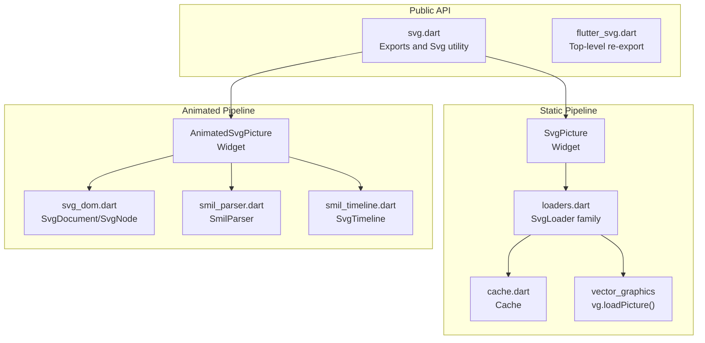
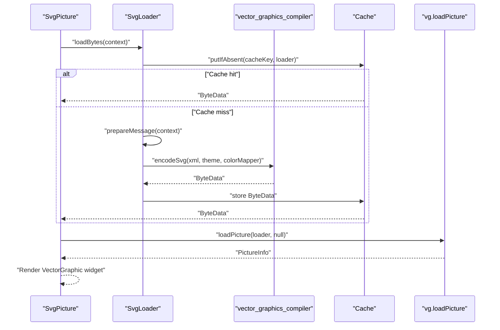
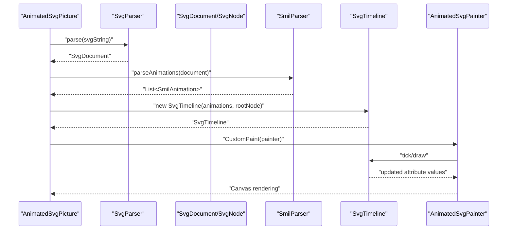
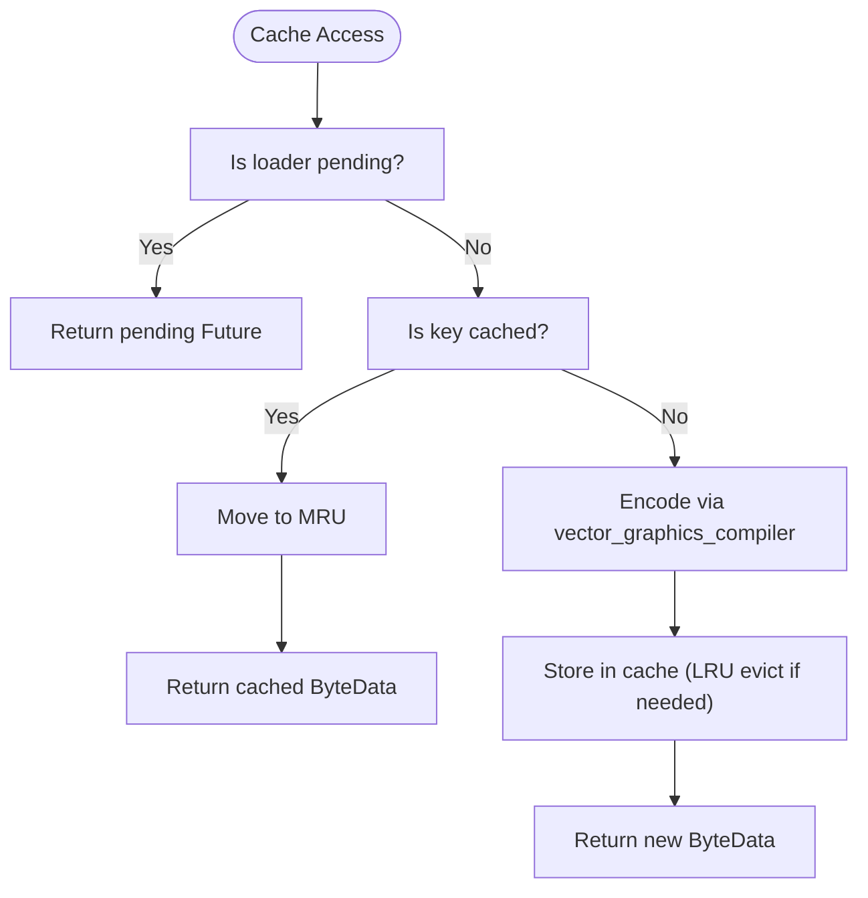
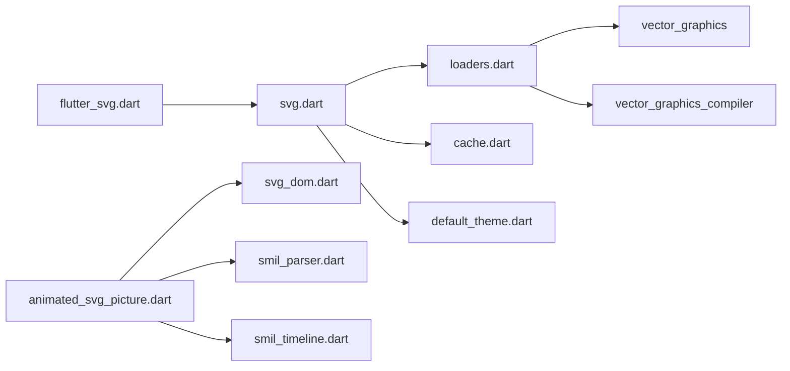

# Core Concepts

<cite>
**Referenced Files in This Document**
- [svg.dart](file://lib/svg.dart)
- [flutter_svg.dart](file://lib/flutter_svg.dart)
- [ARCHITECTURE.md](file://ARCHITECTURE.md)
- [ANIMATION.md](file://ANIMATION.md)
- [README.md](file://README.md)
- [cache.dart](file://lib/src/cache.dart)
- [loaders.dart](file://lib/src/loaders.dart)
- [default_theme.dart](file://lib/src/default_theme.dart)
- [animated_svg_picture.dart](file://lib/src/animation/animated_svg_picture.dart)
- [svg_dom.dart](file://lib/src/animation/svg_dom.dart)
- [smil_timeline.dart](file://lib/src/animation/smil/smil_timeline.dart)
- [smil_parser.dart](file://lib/src/animation/smil/smil_parser.dart)
- [_file_io.dart](file://lib/src/utilities/_file_io.dart)
</cite>

## Table of Contents
1. [Introduction](#introduction)
2. [Project Structure](#project-structure)
3. [Core Components](#core-components)
4. [Architecture Overview](#architecture-overview)
5. [Detailed Component Analysis](#detailed-component-analysis)
6. [Dependency Analysis](#dependency-analysis)
7. [Performance Considerations](#performance-considerations)
8. [Troubleshooting Guide](#troubleshooting-guide)
9. [Conclusion](#conclusion)
10. [Appendices](#appendices)

## Introduction
This document explains the core concepts behind flutter_svg with a focus on fundamental SVG rendering principles and Flutter integration patterns. It covers:
- SVG coordinate systems and viewBox behavior
- The dual-pipeline architecture separating static vector rendering from animated SMIL support
- How Flutter widgets integrate with vector graphics via vector_graphics
- Caching and memory management strategies
- Backend differences between vector_graphics (vector) and raster image rendering
- Data flow from SVG source through loaders to final widget rendering
- Common misconceptions about scaling, color handling, and animation support

## Project Structure
At a high level, flutter_svg exposes a public API centered around SvgPicture and related utilities, while internally delegating to vector_graphics for fast static rendering and to a separate animation pipeline for SMIL-enabled animated rendering.

**Diagram sources**
- [svg.dart:1-627](file://lib/svg.dart#L1-L627)
- [flutter_svg.dart:1-2](file://lib/flutter_svg.dart#L1-L2)
- [loaders.dart:1-467](file://lib/src/loaders.dart#L1-L467)
- [cache.dart:1-111](file://lib/src/cache.dart#L1-L111)
- [animated_svg_picture.dart:1-359](file://lib/src/animation/animated_svg_picture.dart#L1-L359)
- [svg_dom.dart:1-318](file://lib/src/animation/svg_dom.dart#L1-L318)
- [smil_timeline.dart:1-256](file://lib/src/animation/smil/smil_timeline.dart#L1-L256)

**Section sources**
- [svg.dart:1-627](file://lib/svg.dart#L1-L627)
- [flutter_svg.dart:1-2](file://lib/flutter_svg.dart#L1-L2)
- [README.md:1-227](file://README.md#L1-L227)

## Core Components
- SvgPicture: The primary widget for rendering SVGs in Flutter. It supports multiple sources (asset, network, file, memory, string) and integrates with vector_graphics for fast rendering.
- Svg utility and cache: Provides a global Svg instance with a Cache for decoded SVGs, keyed by loader/theme/colorMapper.
- Loaders: A family of BytesLoader implementations (SvgAssetLoader, SvgNetworkLoader, SvgFileLoader, SvgBytesLoader, SvgStringLoader) that prepare SVG data and encode it to vector_graphics binary format in isolates.
- DefaultSvgTheme: Supplies inherited theme defaults (currentColor, fontSize, xHeight) to loaders.
- AnimatedSvgPicture: Widget for animated SVGs using a DOM-like model and SMIL engine.
- DOM and SMIL: SvgDocument/SvgNode represent parsed SVG structure; SmilParser and SvgTimeline manage SMIL animations.

**Section sources**
- [svg.dart:28-627](file://lib/svg.dart#L28-L627)
- [loaders.dart:15-467](file://lib/src/loaders.dart#L15-L467)
- [default_theme.dart:1-36](file://lib/src/default_theme.dart#L1-L36)
- [animated_svg_picture.dart:108-359](file://lib/src/animation/animated_svg_picture.dart#L108-L359)
- [svg_dom.dart:123-318](file://lib/src/animation/svg_dom.dart#L123-L318)
- [smil_timeline.dart:20-256](file://lib/src/animation/smil/smil_timeline.dart#L20-L256)

## Architecture Overview
flutter_svg implements a dual-pipeline architecture:
- Static vector pipeline: Converts SVG to vector_graphics binary (.vec) via vector_graphics_compiler, caches the result, and renders efficiently using vg.loadPicture.
- Animated SMIL pipeline: Parses SVG/XML to a DOM-like structure, extracts SMIL/CSS animations, manages timelines, and renders via CustomPainter.

```mermaid
graph TB
subgraph "Static Pipeline"
S1["SVG Source"]
S2["vector_graphics_compiler.encodeSvg()"]
S3[".vec Binary"]
S4["vg.loadPicture()"]
S5["VectorGraphic widget"]
S6["Optimized rendering"]
end
subgraph "Animated Pipeline"
A1["SVG Source"]
A2["SvgParser (XML → DOM)"]
A3["SvgDocument/SvgNode"]
A4["SmilParser (extract animations)"]
A5["SvgTimeline (time management)"]
A6["AnimatedSvgPainter (CustomPainter)"]
A7["Canvas rendering"]
end
S1 --> S2 --> S3 --> S4 --> S5 --> S6
A1 --> A2 --> A3 --> A4 --> A5 --> A6 --> A7
```

**Diagram sources**
- [ARCHITECTURE.md:6-58](file://ARCHITECTURE.md#L6-L58)
- [README.md:141-170](file://README.md#L141-L170)

**Section sources**
- [ARCHITECTURE.md:6-58](file://ARCHITECTURE.md#L6-L58)
- [ANIMATION.md:195-206](file://ANIMATION.md#L195-L206)

## Detailed Component Analysis

### Static Vector Rendering Pipeline
- Data flow:
  - SvgPicture constructs a BytesLoader appropriate for the source (asset/network/file/memory/string).
  - SvgLoader delegates to vector_graphics_compiler.encodeSvg in an isolate, producing a ByteData buffer.
  - Svg.cache stores the encoded bytes keyed by a composite key (loader, theme, colorMapper).
  - The vector_graphics backend loads the PictureInfo and renders via VectorGraphic widgets.

**Diagram sources**
- [svg.dart:542-560](file://lib/svg.dart#L542-L560)
- [loaders.dart:156-194](file://lib/src/loaders.dart#L156-L194)
- [cache.dart:65-93](file://lib/src/cache.dart#L65-L93)

**Section sources**
- [svg.dart:542-560](file://lib/svg.dart#L542-L560)
- [loaders.dart:118-194](file://lib/src/loaders.dart#L118-L194)
- [cache.dart:1-111](file://lib/src/cache.dart#L1-L111)

### Animated SMIL Pipeline
- Data flow:
  - AnimatedSvgPicture parses the SVG string into an SvgDocument with SvgNode hierarchy.
  - SmilParser extracts SMIL/CSS animations and builds SmilAnimation instances.
  - SvgTimeline manages timing, playback rate, and event-driven activation.
  - AnimatedSvgPainter traverses the DOM, applies effective attribute values, and draws via Canvas.

**Diagram sources**
- [animated_svg_picture.dart:166-295](file://lib/src/animation/animated_svg_picture.dart#L166-L295)
- [svg_dom.dart:123-318](file://lib/src/animation/svg_dom.dart#L123-L318)
- [smil_parser.dart:12-39](file://lib/src/animation/smil/smil_parser.dart#L12-L39)
- [smil_timeline.dart:20-256](file://lib/src/animation/smil/smil_timeline.dart#L20-L256)

**Section sources**
- [animated_svg_picture.dart:108-359](file://lib/src/animation/animated_svg_picture.dart#L108-L359)
- [svg_dom.dart:123-318](file://lib/src/animation/svg_dom.dart#L123-L318)
- [smil_parser.dart:12-39](file://lib/src/animation/smil/smil_parser.dart#L12-L39)
- [smil_timeline.dart:20-256](file://lib/src/animation/smil/smil_timeline.dart#L20-L256)

### SVG Coordinate Systems and viewBox
- ViewBox and fit/alignment:
  - SvgPicture uses BoxFit and Alignment to map the SVG’s viewBox to the widget’s layout bounds.
  - The static pipeline relies on vector_graphics to render at the requested size; AnimatedSvgPicture similarly respects sizing and alignment.
- Units and theme:
  - SvgTheme defines currentColor and font-size metrics used to interpret em/ex units in SVG attributes.
  - DefaultSvgTheme supplies inherited theme values to loaders.

**Section sources**
- [svg.dart:57-102](file://lib/svg.dart#L57-L102)
- [loaders.dart:15-74](file://lib/src/loaders.dart#L15-L74)
- [default_theme.dart:5-36](file://lib/src/default_theme.dart#L5-L36)

### Relationship Between SVG Elements and Flutter Widget Hierarchy
- Static pipeline:
  - The DOM-like structure is discarded; vector_graphics produces optimized drawing commands. The widget hierarchy remains a simple SvgPicture or VectorGraphic widget.
- Animated pipeline:
  - SvgDocument mirrors the SVG DOM with SvgNode and attributes. AnimatedSvgPicture wraps a CustomPaint whose painter traverses the DOM to draw.
  - Event handling (gesture, hover) is layered on top of the CustomPaint for interactivity.

**Section sources**
- [ARCHITECTURE.md:75-144](file://ARCHITECTURE.md#L75-L144)
- [animated_svg_picture.dart:236-269](file://lib/src/animation/animated_svg_picture.dart#L236-L269)

### Caching Mechanisms and Memory Management
- Cache:
  - Cache stores ByteData keyed by a composite key including the loader, theme, and colorMapper. It supports LRU eviction and clearing.
  - SvgLoader.loadBytes uses Cache.putIfAbsent to deduplicate work and reuse encoded binaries.
- Memory:
  - Animated pipeline caches Picture objects for static subtrees and disposes them when animations are introduced.
  - Disposing SvgDocument and nodes releases Picture resources.

**Diagram sources**
- [cache.dart:65-106](file://lib/src/cache.dart#L65-L106)
- [loaders.dart:185-194](file://lib/src/loaders.dart#L185-L194)

**Section sources**
- [cache.dart:1-111](file://lib/src/cache.dart#L1-L111)
- [loaders.dart:185-194](file://lib/src/loaders.dart#L185-L194)
- [svg_dom.dart:250-259](file://lib/src/animation/svg_dom.dart#L250-L259)

### Vector Graphics Backend vs. Raster Image Rendering
- vector_graphics backend:
  - Produces a compact binary (.vec) and renders via VectorGraphic widgets for optimal performance.
  - Supports precompilation and optimization passes.
- Raster image rendering:
  - Not the default for flutter_svg; the package focuses on vector rendering. Converting to raster is possible via Picture.toImage, but it is not the primary path.

**Section sources**
- [README.md:141-170](file://README.md#L141-L170)
- [svg.dart:12-17](file://lib/svg.dart#L12-L17)

### Data Flow Through Loaders to Final Rendering
- Static:
  - Source -> BytesLoader -> vector_graphics_encoder -> Cache -> vg.loadPicture -> VectorGraphic widget.
- Animated:
  - Source -> SvgParser -> SvgDocument -> SmilParser -> SvgTimeline -> AnimatedSvgPainter -> Canvas.

**Section sources**
- [loaders.dart:118-194](file://lib/src/loaders.dart#L118-L194)
- [animated_svg_picture.dart:166-295](file://lib/src/animation/animated_svg_picture.dart#L166-L295)

## Dependency Analysis
- Public exports:
  - flutter_svg.dart re-exports svg.dart.
  - svg.dart exports vector_graphics utilities and re-exports cache/loaders.
- Internal dependencies:
  - SvgPicture depends on loaders and cache.
  - AnimatedSvgPicture depends on svg_dom and smil modules.
  - Loaders depend on vector_graphics and vector_graphics_compiler.

**Diagram sources**
- [flutter_svg.dart:1-2](file://lib/flutter_svg.dart#L1-L2)
- [svg.dart:12-17](file://lib/svg.dart#L12-L17)
- [loaders.dart:1-14](file://lib/src/loaders.dart#L1-L14)
- [animated_svg_picture.dart:1-36](file://lib/src/animation/animated_svg_picture.dart#L1-L36)

**Section sources**
- [flutter_svg.dart:1-2](file://lib/flutter_svg.dart#L1-L2)
- [svg.dart:12-17](file://lib/svg.dart#L12-L17)
- [loaders.dart:1-14](file://lib/src/loaders.dart#L1-L14)
- [animated_svg_picture.dart:1-36](file://lib/src/animation/animated_svg_picture.dart#L1-L36)

## Performance Considerations
- Static pipeline:
  - Precompiled .vec binaries minimize parsing overhead.
  - Cache reduces repeated encoding and IO.
- Animated pipeline:
  - DOM preservation enables SMIL but adds runtime cost.
  - Strategies include static subtree caching, dirty tracking, and path normalization to reduce allocations.
- Rendering strategy:
  - SvgPicture supports a rendering strategy that can switch to raster-based drawImage for specific use cases.

**Section sources**
- [ARCHITECTURE.md:174-193](file://ARCHITECTURE.md#L174-L193)
- [README.md:133-140](file://README.md#L133-L140)

## Troubleshooting Guide
- Layout shifts during load:
  - Specify width/height or tight layout constraints to avoid layout thrashing while images load.
- Network assets:
  - Use placeholderBuilder for long fetches; errors are logged in debug mode.
- File permissions:
  - Reading files may require platform-specific permissions.
- Theme and color:
  - Use DefaultSvgTheme and ColorMapper to control currentColor and color substitutions.
- Animated playback:
  - Control via AnimatedSvgPicture controller or playbackRate; ensure proper lifecycle management.

**Section sources**
- [svg.dart:57-102](file://lib/svg.dart#L57-L102)
- [README.md:80-106](file://README.md#L80-L106)
- [loaders.dart:15-74](file://lib/src/loaders.dart#L15-L74)
- [animated_svg_picture.dart:272-295](file://lib/src/animation/animated_svg_picture.dart#L272-L295)

## Conclusion
flutter_svg separates concerns between a high-performance static vector pipeline and a flexible animated SMIL pipeline. Understanding the dual-pipeline design, viewBox mapping, caching, and the vector_graphics backend enables developers to choose the right rendering path for their needs, optimize performance, and avoid common pitfalls around scaling, color handling, and animation support.

## Appendices

### Common Misconceptions
- SVG scaling:
  - Fit and alignment determine how the viewBox maps to the widget; not specifying sizes can cause layout shifts during load.
- Color handling:
  - currentColor and CSS color inheritance are resolved via SvgTheme; ColorMapper allows dynamic substitution.
- Animation support:
  - Static pipeline discards DOM and animations; use AnimatedSvgPicture for SMIL/CSS animations.

**Section sources**
- [svg.dart:57-102](file://lib/svg.dart#L57-L102)
- [loaders.dart:15-74](file://lib/src/loaders.dart#L15-L74)
- [ANIMATION.md:1-229](file://ANIMATION.md#L1-L229)