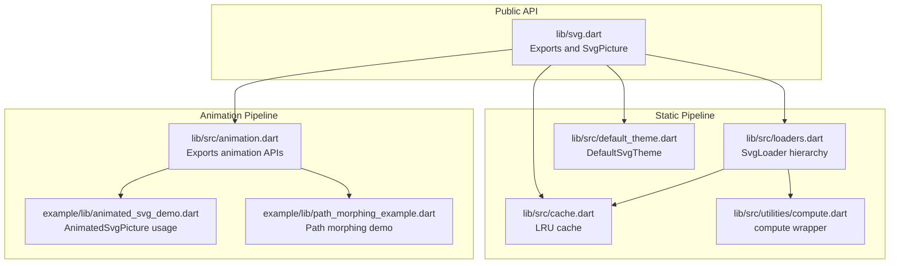
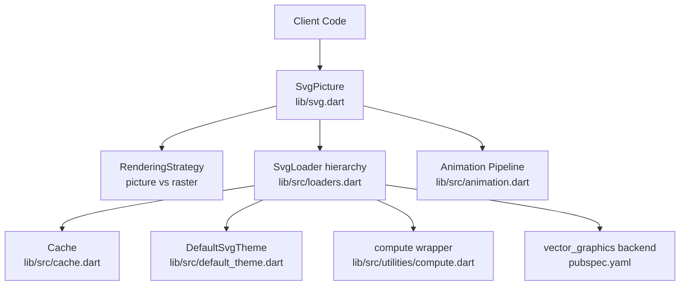
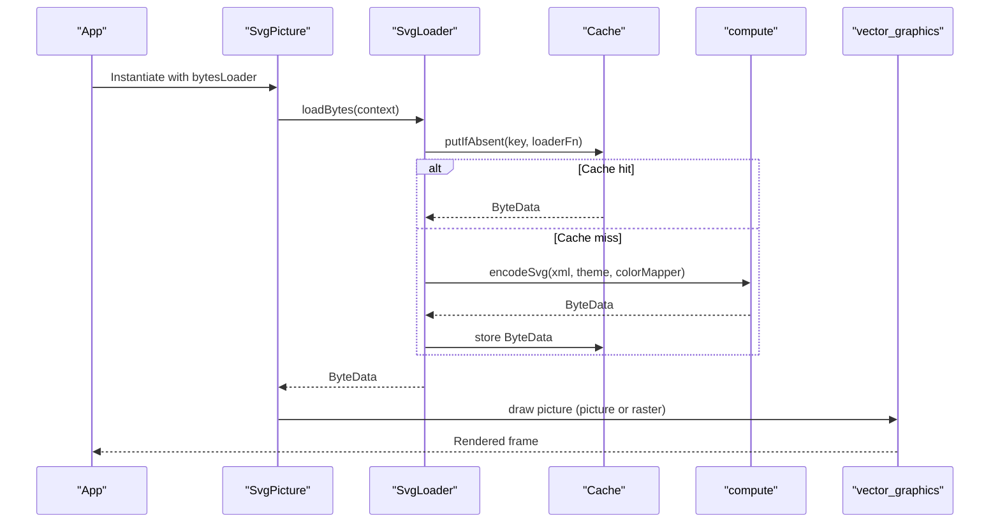
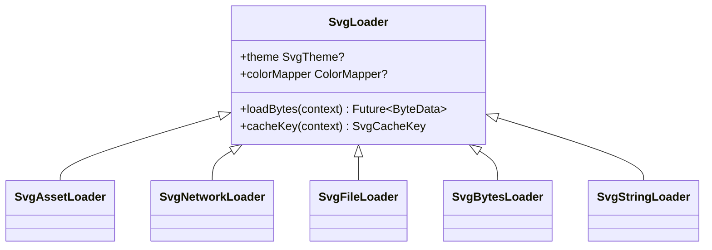
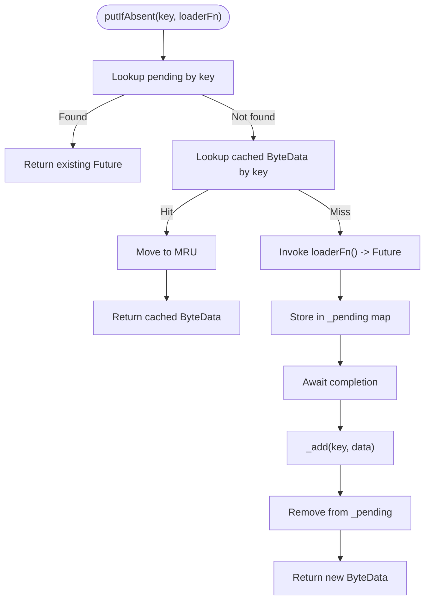
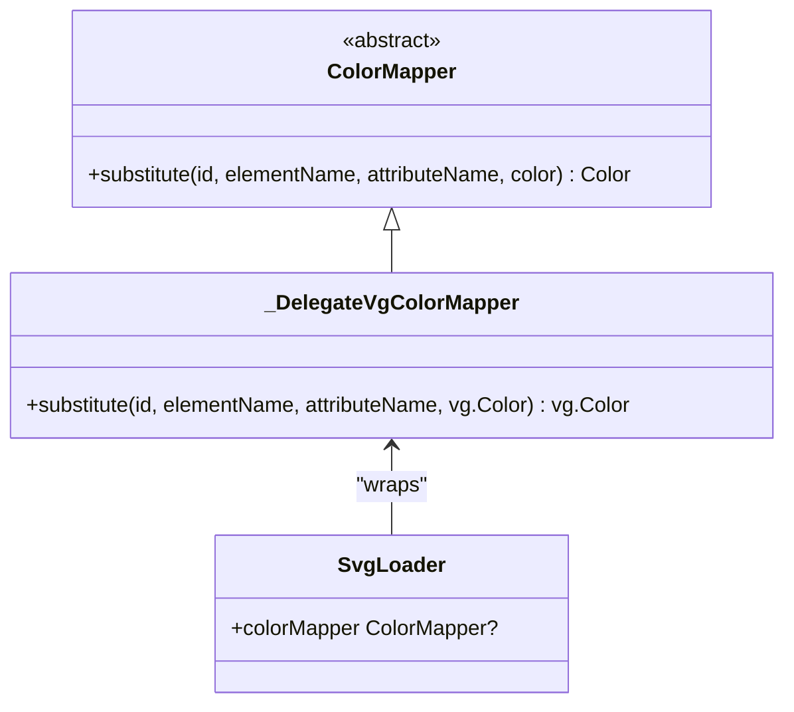
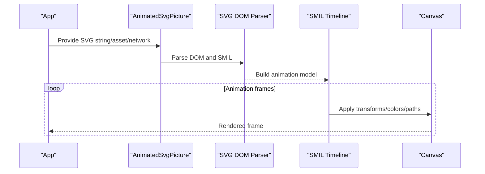
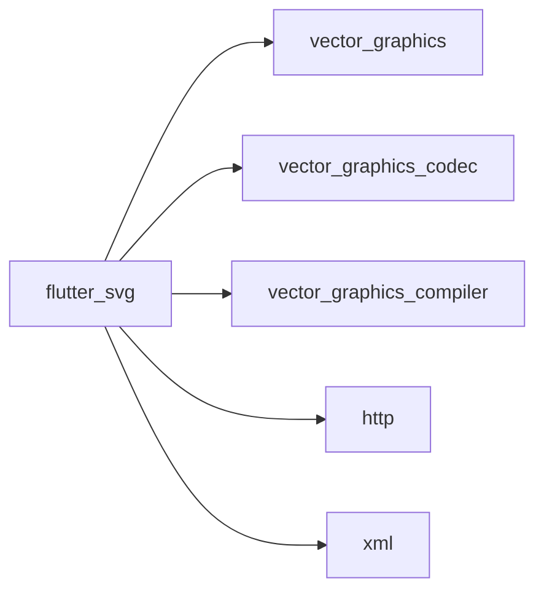

# Feature Highlights

<cite>
**Referenced Files in This Document**
- [README.md](file://README.md)
- [ANIMATION.md](file://ANIMATION.md)
- [pubspec.yaml](file://pubspec.yaml)
- [lib/svg.dart](file://lib/svg.dart)
- [lib/src/cache.dart](file://lib/src/cache.dart)
- [lib/src/loaders.dart](file://lib/src/loaders.dart)
- [lib/src/default_theme.dart](file://lib/src/default_theme.dart)
- [lib/src/utilities/compute.dart](file://lib/src/utilities/compute.dart)
- [lib/src/animation.dart](file://lib/src/animation.dart)
- [example/lib/animated_svg_demo.dart](file://example/lib/animated_svg_demo.dart)
- [example/lib/path_morphing_example.dart](file://example/lib/path_morphing_example.dart)
</cite>

## Table of Contents
1. [Introduction](#introduction)
2. [Project Structure](#project-structure)
3. [Core Components](#core-components)
4. [Architecture Overview](#architecture-overview)
5. [Detailed Component Analysis](#detailed-component-analysis)
6. [Dependency Analysis](#dependency-analysis)
7. [Performance Considerations](#performance-considerations)
8. [Troubleshooting Guide](#troubleshooting-guide)
9. [Conclusion](#conclusion)
10. [Appendices](#appendices)

## Introduction
This document highlights the key capabilities and unique value propositions of the flutter_svg package. It focuses on the dual-pipeline rendering system that supports both static vector graphics and experimental SMIL animations, advanced color mapping, precompiled SVG optimization, multiple loading strategies, a comprehensive caching system, and flexible render strategy selection. It also explains the experimental nature of animation support, current limitations, performance optimizations, memory management strategies, and Flutter integration benefits compared to alternative SVG solutions.

## Project Structure
The package centers around a small public API surface with a powerful internal architecture:
- Public API exports and the primary widget live in the main library file.
- Rendering pipelines are implemented via loaders and a cache.
- Animation support is provided as an opt-in module with its own pipeline.
- Utilities encapsulate platform-specific compute behavior and file access.

**Diagram sources**
- [lib/svg.dart:1-627](file://lib/svg.dart#L1-L627)
- [lib/src/loaders.dart:1-467](file://lib/src/loaders.dart#L1-L467)
- [lib/src/cache.dart:1-111](file://lib/src/cache.dart#L1-L111)
- [lib/src/default_theme.dart:1-36](file://lib/src/default_theme.dart#L1-L36)
- [lib/src/utilities/compute.dart:1-26](file://lib/src/utilities/compute.dart#L1-L26)
- [lib/src/animation.dart:1-31](file://lib/src/animation.dart#L1-L31)
- [example/lib/animated_svg_demo.dart:1-294](file://example/lib/animated_svg_demo.dart#L1-L294)
- [example/lib/path_morphing_example.dart:1-198](file://example/lib/path_morphing_example.dart#L1-L198)

**Section sources**
- [lib/svg.dart:1-627](file://lib/svg.dart#L1-L627)
- [lib/src/loaders.dart:1-467](file://lib/src/loaders.dart#L1-L467)
- [lib/src/cache.dart:1-111](file://lib/src/cache.dart#L1-L111)
- [lib/src/default_theme.dart:1-36](file://lib/src/default_theme.dart#L1-L36)
- [lib/src/utilities/compute.dart:1-26](file://lib/src/utilities/compute.dart#L1-L26)
- [lib/src/animation.dart:1-31](file://lib/src/animation.dart#L1-L31)
- [example/lib/animated_svg_demo.dart:1-294](file://example/lib/animated_svg_demo.dart#L1-L294)
- [example/lib/path_morphing_example.dart:1-198](file://example/lib/path_morphing_example.dart#L1-L198)

## Core Components
- Dual-pipeline rendering:
  - Static pipeline: optimized binary vector_graphics format for fast rendering without animations.
  - Animation pipeline: DOM-based SMIL/CSS animation support with a separate rendering path.
- Multiple loading strategies: asset, network, file, memory (bytes), and string sources.
- Comprehensive caching: LRU cache keyed by loader, theme, and optional color mapper.
- Render strategy selection: picture (default, flexible scaling) versus raster (image-based drawing).
- Advanced color mapping: ColorMapper interface for per-parse color substitution.
- Precompiled SVG optimization: vector_graphics_compiler integration for faster parsing and reduced clipping/masking/overdraw.
- Flutter integration: seamless widget embedding, semantics, placeholders, and error handling.

**Section sources**
- [lib/svg.dart:56-627](file://lib/svg.dart#L56-L627)
- [lib/src/loaders.dart:15-467](file://lib/src/loaders.dart#L15-L467)
- [lib/src/cache.dart:1-111](file://lib/src/cache.dart#L1-L111)
- [README.md:133-161](file://README.md#L133-L161)
- [ANIMATION.md:197-206](file://ANIMATION.md#L197-L206)

## Architecture Overview
The package implements two distinct rendering pipelines to balance performance and capability:
- Static pipeline: Uses vector_graphics binary format produced by the compiler. It leverages a cache keyed by theme and color mapper, and runs decoding in isolates for responsiveness.
- Animation pipeline: Parses SVG DOM and applies SMIL/CSS animations. It is opt-in and marked experimental.

**Diagram sources**
- [lib/svg.dart:56-627](file://lib/svg.dart#L56-L627)
- [lib/src/loaders.dart:15-467](file://lib/src/loaders.dart#L15-L467)
- [lib/src/cache.dart:1-111](file://lib/src/cache.dart#L1-L111)
- [lib/src/default_theme.dart:1-36](file://lib/src/default_theme.dart#L1-L36)
- [lib/src/utilities/compute.dart:1-26](file://lib/src/utilities/compute.dart#L1-L26)
- [pubspec.yaml:12-18](file://pubspec.yaml#L12-L18)
- [lib/src/animation.dart:1-31](file://lib/src/animation.dart#L1-L31)

## Detailed Component Analysis

### Dual-Pipeline Rendering System
- Static pipeline:
  - Converts SVG to vector_graphics binary via the compiler.
  - Uses an LRU cache keyed by loader identity, theme, and color mapper.
  - Decoding runs in isolates to keep UI responsive.
- Animation pipeline:
  - DOM-based parser and SMIL/CSS animation engine.
  - Opt-in via AnimatedSvgPicture; not enabled by default.
  - Experimental status with known limitations documented.

**Diagram sources**
- [lib/svg.dart:543-560](file://lib/svg.dart#L543-L560)
- [lib/src/loaders.dart:156-187](file://lib/src/loaders.dart#L156-L187)
- [lib/src/cache.dart:65-93](file://lib/src/cache.dart#L65-L93)
- [lib/src/utilities/compute.dart:21-26](file://lib/src/utilities/compute.dart#L21-L26)

**Section sources**
- [lib/svg.dart:543-560](file://lib/svg.dart#L543-L560)
- [lib/src/loaders.dart:156-187](file://lib/src/loaders.dart#L156-L187)
- [lib/src/cache.dart:65-93](file://lib/src/cache.dart#L65-L93)
- [ANIMATION.md:197-206](file://ANIMATION.md#L197-L206)

### Multiple Loading Strategies
- Asset: SvgAssetLoader resolves AssetBundle and decodes UTF-8 bytes.
- Network: SvgNetworkLoader fetches via http.Client with optional headers.
- File: SvgFileLoader reads from a File handle.
- Memory: SvgBytesLoader decodes Uint8List bytes.
- String: SvgStringLoader decodes a UTF-8 string.

**Diagram sources**
- [lib/src/loaders.dart:121-194](file://lib/src/loaders.dart#L121-L194)
- [lib/src/loaders.dart:343-413](file://lib/src/loaders.dart#L343-L413)
- [lib/src/loaders.dart:417-466](file://lib/src/loaders.dart#L417-L466)
- [lib/src/loaders.dart:284-307](file://lib/src/loaders.dart#L284-L307)
- [lib/src/loaders.dart:260-280](file://lib/src/loaders.dart#L260-L280)
- [lib/src/loaders.dart:234-255](file://lib/src/loaders.dart#L234-L255)

**Section sources**
- [lib/src/loaders.dart:343-413](file://lib/src/loaders.dart#L343-L413)
- [lib/src/loaders.dart:417-466](file://lib/src/loaders.dart#L417-L466)
- [lib/src/loaders.dart:284-307](file://lib/src/loaders.dart#L284-L307)
- [lib/src/loaders.dart:260-280](file://lib/src/loaders.dart#L260-L280)
- [lib/src/loaders.dart:234-255](file://lib/src/loaders.dart#L234-L255)

### Comprehensive Caching System
- LRU cache keyed by SvgCacheKey (includes theme and optional color mapper).
- Supports dynamic resizing, eviction, and clearing.
- Pending loads deduplicated to avoid redundant work.

**Diagram sources**
- [lib/src/cache.dart:65-93](file://lib/src/cache.dart#L65-L93)
- [lib/src/cache.dart:95-106](file://lib/src/cache.dart#L95-L106)

**Section sources**
- [lib/src/cache.dart:1-111](file://lib/src/cache.dart#L1-L111)

### Render Strategy Selection
- RenderingStrategy.picture (default): preserves flexibility for scaling and transformations.
- RenderingStrategy.raster: renders to Image then draws via drawImage, trading some scaling flexibility for potential performance gains in specific scenarios.

**Section sources**
- [lib/svg.dart:534-540](file://lib/svg.dart#L534-L540)
- [README.md:133-139](file://README.md#L133-L139)

### Color Mapping with ColorMapper
- ColorMapper interface enables per-parse color substitution based on element and attribute context.
- Immutable mappers are suitable for caching; delegates to vector_graphics ColorMapper internally.

**Diagram sources**
- [lib/src/loaders.dart:81-94](file://lib/src/loaders.dart#L81-L94)
- [lib/src/loaders.dart:96-116](file://lib/src/loaders.dart#L96-L116)
- [lib/src/loaders.dart:121-130](file://lib/src/loaders.dart#L121-L130)

**Section sources**
- [lib/src/loaders.dart:81-94](file://lib/src/loaders.dart#L81-L94)
- [lib/src/loaders.dart:96-116](file://lib/src/loaders.dart#L96-L116)
- [README.md:33-78](file://README.md#L33-L78)

### Precompiled SVG Optimization
- vector_graphics_compiler produces a binary format that is faster to parse and can optimize masks, clips, and overdraw.
- Use vector_graphics_decoder to load compiled assets directly.

**Section sources**
- [README.md:141-161](file://README.md#L141-L161)
- [pubspec.yaml:16-18](file://pubspec.yaml#L16-L18)

### Experimental Animation Support
- AnimatedSvgPicture provides SMIL/CSS animation support with a dedicated pipeline.
- Fully supported features include animate, animateTransform, animateMotion, numeric/color/transform/path attributes, timing, interpolation, and motion path controls.
- CSS animation parsing converts to SMIL objects for unified timing.
- Known limitations include path morphing requiring compatible structures and ongoing parity work for advanced edge cases.

**Diagram sources**
- [lib/src/animation.dart:1-31](file://lib/src/animation.dart#L1-L31)
- [ANIMATION.md:1-229](file://ANIMATION.md#L1-L229)
- [example/lib/animated_svg_demo.dart:1-294](file://example/lib/animated_svg_demo.dart#L1-L294)

**Section sources**
- [lib/src/animation.dart:1-31](file://lib/src/animation.dart#L1-L31)
- [ANIMATION.md:1-229](file://ANIMATION.md#L1-L229)
- [example/lib/animated_svg_demo.dart:1-294](file://example/lib/animated_svg_demo.dart#L1-L294)

### Path Morphing Example
- Demonstrates path parsing, normalization, and interpolation between shapes.
- Shows how to integrate morphing with Flutter AnimationController and CustomPainter.

**Section sources**
- [example/lib/path_morphing_example.dart:1-198](file://example/lib/path_morphing_example.dart#L1-L198)

## Dependency Analysis
External dependencies and their roles:
- vector_graphics: Provides the picture-based rendering backend and decoder.
- vector_graphics_codec: Encoding/decoding utilities for vector graphics.
- vector_graphics_compiler: Produces optimized binary SVGs.
- http: Network loading for remote SVGs.
- xml: Parsing of SVG/XML content.

**Diagram sources**
- [pubspec.yaml:12-19](file://pubspec.yaml#L12-L19)

**Section sources**
- [pubspec.yaml:12-19](file://pubspec.yaml#L12-L19)

## Performance Considerations
- Isolate-based decoding: Offloads parsing to isolates to prevent UI jank.
- LRU caching: Reduces repeated decoding and network/file IO.
- Precompiled assets: Faster parsing and reduced runtime overhead.
- Render strategy trade-offs: picture mode prioritizes flexibility; raster mode may improve throughput in specific scenarios.
- Memory management: Proper disposal of Picture objects and avoiding excessive cache sizes.

[No sources needed since this section provides general guidance]

## Troubleshooting Guide
- Network loading: Ensure proper headers and client lifecycle; the network loader manages its own client unless provided externally.
- Asset bundles: When using package assets, pass the package name; otherwise, rely on DefaultAssetBundle.
- Color mapping: Use immutable ColorMapper instances to benefit from caching.
- Animation issues: Verify SMIL/CSS syntax and ensure the animation pipeline is used intentionally.

**Section sources**
- [lib/src/loaders.dart:417-466](file://lib/src/loaders.dart#L417-L466)
- [lib/src/loaders.dart:343-413](file://lib/src/loaders.dart#L343-L413)
- [lib/src/loaders.dart:81-94](file://lib/src/loaders.dart#L81-L94)

## Conclusion
flutter_svg delivers a robust, Flutter-native solution for SVG rendering with a dual-pipeline architecture. The static pipeline ensures high performance and broad compatibility, while the experimental animation pipeline brings SMIL/CSS animation support to Flutter. Advanced features like color mapping, precompiled optimization, comprehensive caching, and flexible render strategies make it a versatile choice for apps requiring scalable vector graphics across platforms.

[No sources needed since this section summarizes without analyzing specific files]

## Appendices

### Quick Reference: Supported SVG Features (Status)
- Static pipeline (optimized binary):
  - Vector graphics primitives, fills, strokes, gradients, masks, clipping, transforms.
  - Theme-aware sizing via currentColor and font metrics.
- Animation pipeline (experimental):
  - animate, animateTransform, animateMotion.
  - Numeric, color, transform, and path attribute interpolation.
  - Timing: dur, begin, end, repeatCount, fill.
  - Interpolation: from/to/by, values/keyTimes, calcMode, keySplines.
  - Motion: path, rotate, keyPoints.
  - CSS animations: @keyframes and animation-* properties converted to SMIL.

**Section sources**
- [ANIMATION.md:21-66](file://ANIMATION.md#L21-L66)
- [ANIMATION.md:197-206](file://ANIMATION.md#L197-L206)

### Comparison with Alternative SVG Solutions
- flutter_svg integrates deeply with Flutter’s widget system, semantics, and rendering pipeline, offering native performance and predictable behavior.
- Its dual-pipeline architecture balances flexibility (picture mode) and performance (raster mode) while supporting advanced features like color mapping and precompiled assets.
- Animation support is specialized and experimental, focusing on SMIL/CSS interoperability with a dedicated pipeline.

[No sources needed since this section provides general guidance]