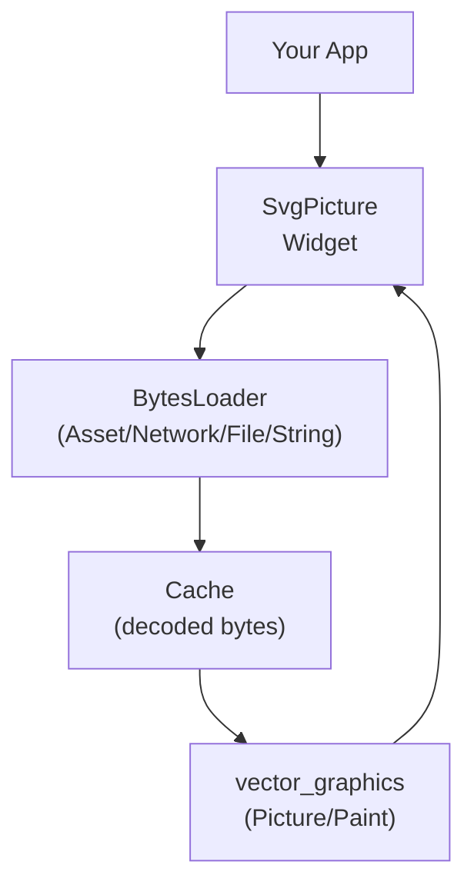
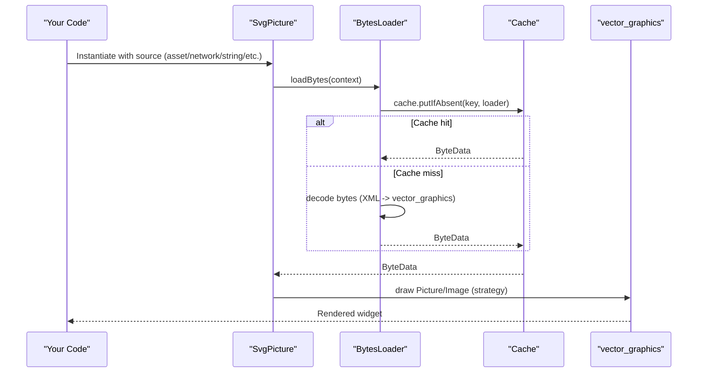
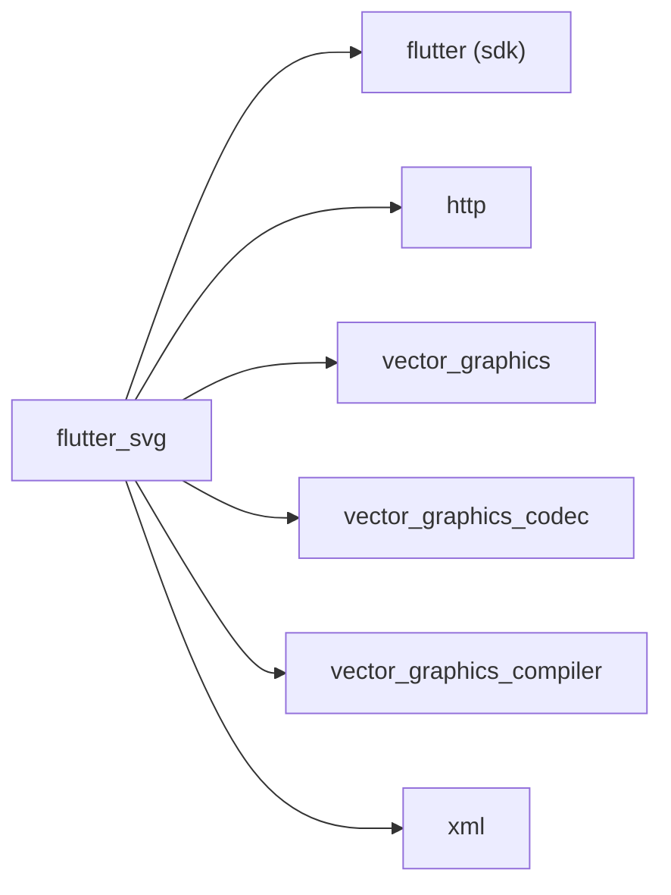

# Getting Started

<cite>
**Referenced Files in This Document**
- [pubspec.yaml](file://pubspec.yaml)
- [svg.dart](file://lib/svg.dart)
- [loaders.dart](file://lib/src/loaders.dart)
- [cache.dart](file://lib/src/cache.dart)
- [README.md](file://README.md)
- [example/lib/main.dart](file://example/lib/main.dart)
- [example/lib/pages/home_page.dart](file://example/lib/pages/home_page.dart)
- [example/pubspec.yaml](file://example/pubspec.yaml)
</cite>

## Table of Contents
1. [Introduction](#introduction)
2. [Project Structure](#project-structure)
3. [Core Components](#core-components)
4. [Architecture Overview](#architecture-overview)
5. [Detailed Component Analysis](#detailed-component-analysis)
6. [Dependency Analysis](#dependency-analysis)
7. [Performance Considerations](#performance-considerations)
8. [Troubleshooting Guide](#troubleshooting-guide)
9. [Conclusion](#conclusion)

## Introduction
This guide helps you quickly install and use the flutter_svg package to render SVGs in Flutter apps. You will learn how to:
- Add the package to your project
- Import the library
- Load SVGs from assets, networks, and strings
- Apply basic styling and accessibility options
- Choose between picture and raster rendering strategies
- Troubleshoot common setup issues

## Project Structure
At a high level, flutter_svg exposes a single widget, SvgPicture, which supports multiple input sources (asset, network, file, memory, string). Internally, it uses loaders and a cache backed by vector_graphics to decode and render SVGs efficiently.

**Diagram sources**
- [svg.dart:57-627](file://lib/svg.dart#L57-L627)
- [loaders.dart:118-467](file://lib/src/loaders.dart#L118-L467)
- [cache.dart:1-111](file://lib/src/cache.dart#L1-L111)

**Section sources**
- [pubspec.yaml:12-19](file://pubspec.yaml#L12-L19)
- [svg.dart:12-18](file://lib/svg.dart#L12-L18)

## Core Components
- SvgPicture: The primary widget to render SVGs from multiple sources. It accepts sizing, alignment, fit, semantics, clipping, placeholders, error handling, color filters, and rendering strategy.
- BytesLoader family: Encapsulate how to obtain raw bytes for an SVG (asset, network, file, memory, string).
- Cache: Stores decoded vector_graphics bytes to avoid repeated parsing and improve performance.
- vector_graphics: Backend used to decode and paint the SVG.

Key capabilities for beginners:
- Load from assets, network, file, memory, or string
- Control size and fit
- Provide semantics for accessibility
- Apply color filters or dynamic color mapping
- Choose rendering strategy for performance vs. flexibility

**Section sources**
- [svg.dart:57-102](file://lib/svg.dart#L57-L102)
- [svg.dart:180-211](file://lib/svg.dart#L180-L211)
- [svg.dart:245-276](file://lib/svg.dart#L245-L276)
- [svg.dart:308-335](file://lib/svg.dart#L308-L335)
- [svg.dart:364-391](file://lib/svg.dart#L364-L391)
- [svg.dart:420-447](file://lib/svg.dart#L420-L447)
- [loaders.dart:118-194](file://lib/src/loaders.dart#L118-L194)
- [cache.dart:4-111](file://lib/src/cache.dart#L4-L111)

## Architecture Overview
The rendering pipeline is designed to be flexible and efficient. SvgPicture delegates to a BytesLoader to fetch bytes, caches the decoded vector_graphics representation, and then draws using vector_graphics.

**Diagram sources**
- [svg.dart:543-560](file://lib/svg.dart#L543-L560)
- [loaders.dart:156-187](file://lib/src/loaders.dart#L156-L187)
- [cache.dart:65-93](file://lib/src/cache.dart#L65-L93)

## Detailed Component Analysis

### Installation and Setup
- Add the package to your app’s pubspec.yaml dependencies.
- Run your package manager to fetch dependencies.
- Import the library in your Dart files.

Practical steps:
- Add flutter_svg to your app’s dependencies.
- Ensure your app’s pubspec declares Flutter SDK and http dependencies.
- Confirm assets are included in your app’s assets list if loading from assets.

**Section sources**
- [pubspec.yaml:12-19](file://pubspec.yaml#L12-L19)
- [example/pubspec.yaml:10-36](file://example/pubspec.yaml#L10-L36)

### Basic Import Statements
- Import the library in your Dart files to access SvgPicture and related APIs.

**Section sources**
- [example/lib/pages/home_page.dart:1-10](file://example/lib/pages/home_page.dart#L1-L10)

### Loading SVGs from Assets
- Use SvgPicture.asset() to load an SVG from your app’s assets.
- Provide width and height to avoid layout shifts during load.
- Optionally set semanticsLabel for accessibility.

Common parameters:
- assetName: Path to the SVG asset
- bundle/package: For package assets
- width/height: Fixed size to prevent layout thrashing
- semanticsLabel/excludeFromSemantics: Accessibility labeling
- fit/alignment/clipBehavior: Layout and clipping behavior
- colorFilter: Tint or colorize the SVG
- renderingStrategy: picture or raster

**Section sources**
- [svg.dart:180-211](file://lib/svg.dart#L180-L211)
- [svg.dart:534-540](file://lib/svg.dart#L534-L540)
- [README.md:13-31](file://README.md#L13-L31)

### Loading SVGs from Network
- Use SvgPicture.network() to load an SVG from a URL.
- Provide width and height to avoid layout shifts.
- Optionally supply headers or a custom http.Client.
- Use placeholderBuilder for long loads.

Common parameters:
- url: Target URL
- headers: Optional HTTP headers
- httpClient: Optional custom client
- width/height/fit/alignment/clipBehavior
- semanticsLabel/excludeFromSemantics
- colorFilter
- renderingStrategy

**Section sources**
- [svg.dart:245-276](file://lib/svg.dart#L245-L276)
- [README.md:86-106](file://README.md#L86-L106)

### Loading SVGs from Strings
- Use SvgPicture.string() to render an SVG provided as a String.
- Provide width and height to avoid layout shifts.
- Good for inline SVGs or dynamically constructed content.

Common parameters:
- string: SVG XML as a String
- width/height/fit/alignment/clipBehavior
- semanticsLabel/excludeFromSemantics
- colorFilter
- renderingStrategy

**Section sources**
- [svg.dart:420-447](file://lib/svg.dart#L420-L447)
- [example/lib/pages/home_page.dart:55-60](file://example/lib/pages/home_page.dart#L55-L60)

### Essential Parameters and Styling
- width/height: Fixed size prevents layout jitter
- fit: BoxFit to control aspect ratio inside the widget
- alignment: Alignment of the SVG within the widget bounds
- semanticsLabel/excludeFromSemantics: Accessibility labeling
- clipBehavior: Clipping behavior for overflow
- colorFilter: Applies a ColorFilter to the entire SVG
- renderingStrategy: picture (default, scalable) vs raster (image-based, faster in some cases)

**Section sources**
- [svg.dart:459-540](file://lib/svg.dart#L459-L540)
- [README.md:133-139](file://README.md#L133-L139)

### Difference Between Picture and Raster Rendering Strategies
- picture: Renders a vector Picture; preserves scalability and fidelity; default choice
- raster: Renders to an Image and draws via drawImage; can improve performance in specific scenarios but may reduce scaling flexibility

**Section sources**
- [README.md:133-139](file://README.md#L133-L139)
- [svg.dart:534-540](file://lib/svg.dart#L534-L540)

### Practical Usage Patterns
- Asset-based SVG with semantics and tinting
- Network SVG with placeholder and headers
- String-based SVG with fixed size

These patterns are demonstrated in the example app and README.

**Section sources**
- [README.md:13-31](file://README.md#L13-L31)
- [README.md:86-106](file://README.md#L86-L106)
- [example/lib/pages/home_page.dart:55-60](file://example/lib/pages/home_page.dart#L55-L60)

## Dependency Analysis
flutter_svg depends on:
- Flutter SDK and http for networking
- vector_graphics and vector_graphics_codec for decoding/painting
- vector_graphics_compiler for optional precompilation
- xml for parsing

These dependencies are declared in the package pubspec.

**Diagram sources**
- [pubspec.yaml:12-19](file://pubspec.yaml#L12-L19)

**Section sources**
- [pubspec.yaml:12-19](file://pubspec.yaml#L12-L19)

## Performance Considerations
- Use fixed width/height to avoid layout shifts during load
- Prefer raster rendering strategy when you need faster rendering and can accept reduced scaling flexibility
- Leverage caching: the package caches decoded vector_graphics bytes to avoid re-decoding
- Consider precompiling SVGs with vector_graphics_compiler to speed up parsing and reduce clipping/masking/overdraw

**Section sources**
- [svg.dart:59-62](file://lib/svg.dart#L59-L62)
- [README.md:133-139](file://README.md#L133-L139)
- [cache.dart:4-111](file://lib/src/cache.dart#L4-L111)
- [README.md:141-150](file://README.md#L141-L150)

## Troubleshooting Guide
- Missing assets: Ensure the asset path exists and is included in your app’s assets list. The example app demonstrates how assets are declared.
- Layout shifts: Always specify width and height when loading from assets or network to avoid layout thrashing.
- Network timeouts or errors: Provide a placeholderBuilder for network loads and check headers and URLs.
- Accessibility: Set semanticsLabel or excludeFromSemantics appropriately.
- Color tinting: Use colorFilter for simple tints; use colorMapper for advanced color substitution during parsing.
- Precompiled assets: If using precompiled .vec files, load them with the default SvgPicture constructor.

**Section sources**
- [example/pubspec.yaml:29-36](file://example/pubspec.yaml#L29-L36)
- [svg.dart:59-62](file://lib/svg.dart#L59-L62)
- [README.md:80-106](file://README.md#L80-L106)
- [README.md:155-160](file://README.md#L155-L160)

## Conclusion
You now have the essentials to install flutter_svg, import it, and render SVGs from assets, networks, and strings. Use width/height to stabilize layouts, semanticsLabel for accessibility, and colorFilter or colorMapper for styling. Choose the rendering strategy that fits your needs, and leverage caching and precompilation for performance.