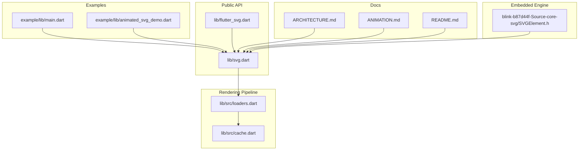
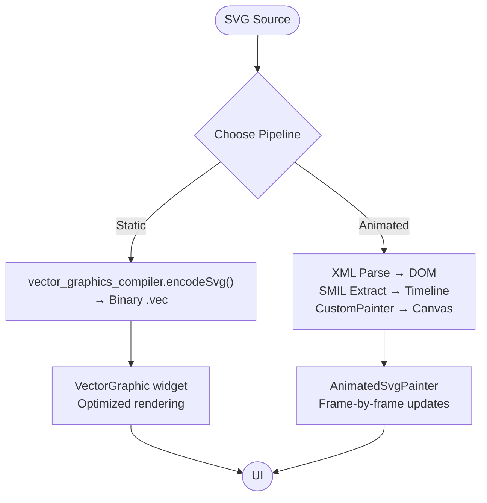
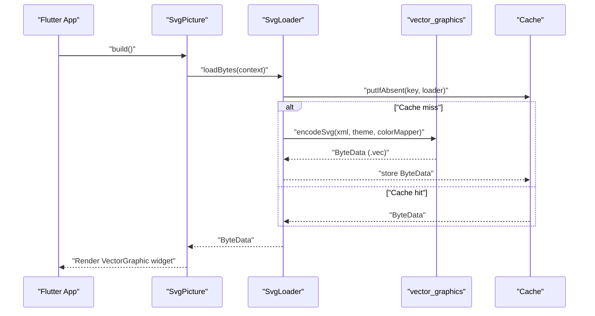
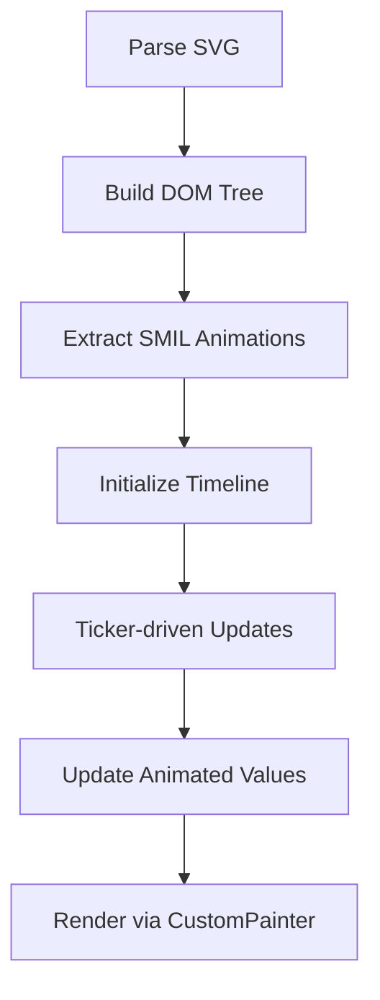
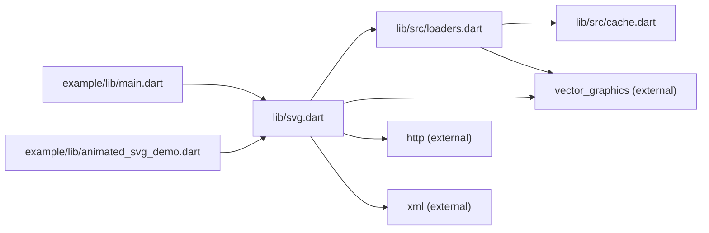

# Project Overview

<cite>
**Referenced Files in This Document**
- [README.md](file://README.md)
- [ARCHITECTURE.md](file://ARCHITECTURE.md)
- [ANIMATION.md](file://ANIMATION.md)
- [pubspec.yaml](file://pubspec.yaml)
- [lib/svg.dart](file://lib/svg.dart)
- [lib/src/loaders.dart](file://lib/src/loaders.dart)
- [lib/src/cache.dart](file://lib/src/cache.dart)
- [example/lib/main.dart](file://example/lib/main.dart)
- [example/lib/animated_svg_demo.dart](file://example/lib/animated_svg_demo.dart)
- [blink-b87d44f-Source-core-svg/SVGElement.h](file://blink-b87d44f-Source-core-svg/SVGElement.h)
</cite>

## Table of Contents
1. [Introduction](#introduction)
2. [Project Structure](#project-structure)
3. [Core Components](#core-components)
4. [Architecture Overview](#architecture-overview)
5. [Detailed Component Analysis](#detailed-component-analysis)
6. [Dependency Analysis](#dependency-analysis)
7. [Performance Considerations](#performance-considerations)
8. [Troubleshooting Guide](#troubleshooting-guide)
9. [Conclusion](#conclusion)

## Introduction
flutter_svg is a comprehensive SVG rendering and widget library for Flutter that delivers high-performance vector graphics with both static and animated capabilities. It integrates tightly with the Flutter ecosystem to provide:
- Static rendering via vector_graphics for production-grade performance
- Experimental SMIL animation support for dynamic, animated SVGs
- A dual-pipeline architecture that balances speed and flexibility
- Rich widget APIs for assets, network, files, and strings
- Advanced features like color mapping, theming, and precompiled vector graphics

The project’s core value proposition is enabling apps to render crisp, scalable graphics at any resolution while supporting modern animation workflows where needed.

## Project Structure
At a high level, the project is organized into:
- Public API surface in lib/svg.dart and lib/flutter_svg.dart
- Rendering pipeline implementations in lib/src/loaders.dart and lib/src/cache.dart
- Example application demonstrating usage in example/lib
- Animation subsystem documentation and examples in docs and example assets
- Embedded Blink-based SVG engine components (headers) for reference

**Diagram sources**
- [lib/svg.dart:1-627](file://lib/svg.dart#L1-L627)
- [lib/src/loaders.dart:1-467](file://lib/src/loaders.dart#L1-L467)
- [lib/src/cache.dart:1-111](file://lib/src/cache.dart#L1-L111)
- [example/lib/main.dart:1-56](file://example/lib/main.dart#L1-L56)
- [example/lib/animated_svg_demo.dart:1-294](file://example/lib/animated_svg_demo.dart#L1-L294)
- [ARCHITECTURE.md:1-297](file://ARCHITECTURE.md#L1-L297)
- [ANIMATION.md:1-229](file://ANIMATION.md#L1-L229)
- [README.md:1-227](file://README.md#L1-L227)
- [blink-b87d44f-Source-core-svg/SVGElement.h:1-200](file://blink-b87d44f-Source-core-svg/SVGElement.h#L1-L200)

**Section sources**
- [pubspec.yaml:1-28](file://pubspec.yaml#L1-L28)
- [lib/svg.dart:1-627](file://lib/svg.dart#L1-L627)
- [lib/src/loaders.dart:1-467](file://lib/src/loaders.dart#L1-L467)
- [lib/src/cache.dart:1-111](file://lib/src/cache.dart#L1-L111)
- [example/lib/main.dart:1-56](file://example/lib/main.dart#L1-L56)
- [example/lib/animated_svg_demo.dart:1-294](file://example/lib/animated_svg_demo.dart#L1-L294)
- [ARCHITECTURE.md:1-297](file://ARCHITECTURE.md#L1-L297)
- [ANIMATION.md:1-229](file://ANIMATION.md#L1-L229)
- [README.md:1-227](file://README.md#L1-L227)
- [blink-b87d44f-Source-core-svg/SVGElement.h:1-200](file://blink-b87d44f-Source-core-svg/SVGElement.h#L1-L200)

## Core Components
- SvgPicture: The primary widget for rendering SVGs from assets, network, files, or strings. It supports layout constraints, semantics, color filtering, placeholders, and a rendering strategy toggle between picture and raster modes.
- BytesLoader family: Pluggable loaders that fetch and prepare SVG data, including asset, network, file, and string variants. They integrate with vector_graphics for fast static rendering.
- Cache: A keyed cache for decoded SVG byte streams, with LRU eviction and theme-aware keys.
- Svg: Utility singleton exposing a global cache and helper methods for decoding SVG data to DrawableRoot or PictureInfo.
- Animation subsystem: Experimental SMIL animation support with DOM-like parsing, timeline management, and CustomPainter-based rendering.

Practical usage examples:
- Rendering an asset SVG with semantics and tinting
- Using a placeholder during network loading
- Precompiling SVGs with vector_graphics_compiler for optimal performance
- Building a custom ColorMapper to transform colors during parsing

**Section sources**
- [lib/svg.dart:56-627](file://lib/svg.dart#L56-L627)
- [lib/src/loaders.dart:118-467](file://lib/src/loaders.dart#L118-L467)
- [lib/src/cache.dart:4-111](file://lib/src/cache.dart#L4-L111)
- [README.md:13-128](file://README.md#L13-L128)
- [README.md:141-161](file://README.md#L141-L161)

## Architecture Overview
flutter_svg employs a dual-pipeline rendering system:
- Static pipeline (production): Converts SVG to a compact binary format using vector_graphics, caches it, and renders efficiently without DOM or animation overhead.
- Animated pipeline (experimental): Parses SVG into a DOM-like structure, extracts SMIL animations, manages timelines, and renders via CustomPainter for runtime control and fidelity.

**Diagram sources**
- [ARCHITECTURE.md:6-58](file://ARCHITECTURE.md#L6-L58)
- [lib/src/loaders.dart:156-187](file://lib/src/loaders.dart#L156-L187)
- [lib/svg.dart:542-560](file://lib/svg.dart#L542-L560)

**Section sources**
- [ARCHITECTURE.md:6-58](file://ARCHITECTURE.md#L6-L58)
- [ANIMATION.md:195-206](file://ANIMATION.md#L195-L206)

## Detailed Component Analysis

### Static Pipeline: vector_graphics Integration
The static pipeline leverages vector_graphics to compile SVGs into a binary format, enabling:
- Fast decoding and rendering
- Reduced memory footprint
- Precomputed transforms and optimized drawing commands

Key implementation aspects:
- Loader classes encapsulate source retrieval and delegate to vector_graphics encoder in an isolates
- Cache keys include theme and color mapper to ensure correctness across contexts
- Rendering strategy selection allows switching between picture and raster modes depending on app needs

**Diagram sources**
- [lib/src/loaders.dart:156-187](file://lib/src/loaders.dart#L156-L187)
- [lib/src/cache.dart:65-93](file://lib/src/cache.dart#L65-L93)
- [lib/svg.dart:542-560](file://lib/svg.dart#L542-L560)

**Section sources**
- [lib/src/loaders.dart:118-194](file://lib/src/loaders.dart#L118-L194)
- [lib/src/cache.dart:4-111](file://lib/src/cache.dart#L4-L111)
- [README.md:133-139](file://README.md#L133-L139)

### Animated Pipeline: SMIL and DOM
The experimental animated pipeline preserves DOM structure and supports SMIL animations:
- XML parsing constructs a DOM-like model
- SMIL parser extracts animations and builds a timeline
- AnimatedSvgPainter traverses nodes, applies effective values, and draws to Canvas
- Interpolation system handles numbers, colors, transforms, and paths

**Diagram sources**
- [ARCHITECTURE.md:146-154](file://ARCHITECTURE.md#L146-L154)
- [ANIMATION.md:67-148](file://ANIMATION.md#L67-L148)

**Section sources**
- [ARCHITECTURE.md:75-144](file://ARCHITECTURE.md#L75-L144)
- [ANIMATION.md:1-66](file://ANIMATION.md#L1-L66)

### Practical Examples in Flutter Applications
Beginner-friendly examples:
- Basic asset rendering with semantics labeling
- Color tinting via ColorFilter
- Placeholder during network loading
- Precompiled vector graphics for performance

Advanced examples:
- Custom ColorMapper for dynamic color substitution
- Rendering to a Canvas or exporting to Image
- Switching rendering strategies for performance tuning

These examples demonstrate how flutter_svg fits into typical Flutter workflows while enabling both static and animated graphics.

**Section sources**
- [README.md:13-128](file://README.md#L13-L128)
- [README.md:141-161](file://README.md#L141-L161)
- [example/lib/main.dart:30-51](file://example/lib/main.dart#L30-L51)
- [example/lib/animated_svg_demo.dart:280-286](file://example/lib/animated_svg_demo.dart#L280-L286)

### Relationship to Flutter Ecosystem
flutter_svg integrates with Flutter through:
- Widgets for declarative UI composition
- Platform-specific rendering via vector_graphics
- HTTP client for network assets
- Isolate-based computation for decoding and encoding
- Theming and color mapping aligned with Flutter’s design system

Dependencies:
- flutter: core framework
- http: network requests
- vector_graphics, vector_graphics_codec, vector_graphics_compiler: high-performance vector rendering and compilation
- xml: lightweight XML parsing for the animated pipeline

**Section sources**
- [pubspec.yaml:12-20](file://pubspec.yaml#L12-L20)
- [lib/src/loaders.dart:1-14](file://lib/src/loaders.dart#L1-L14)

### Embedded Blink SVG Engine Components
The repository includes Blink-based SVG engine headers (e.g., SVGElement.h) for reference and parity work. These headers illustrate:
- Element lifecycle and attribute synchronization
- Animated property handling
- Coordinate spaces and presentation attributes

While the static pipeline relies on vector_graphics, these headers inform the design of the animated pipeline and highlight areas for continued parity.

**Section sources**
- [blink-b87d44f-Source-core-svg/SVGElement.h:49-190](file://blink-b87d44f-Source-core-svg/SVGElement.h#L49-L190)

## Dependency Analysis
The project’s dependency graph emphasizes a clean separation between static and animated rendering paths, with shared utilities and loaders.

**Diagram sources**
- [lib/svg.dart:1-26](file://lib/svg.dart#L1-L26)
- [lib/src/loaders.dart:1-14](file://lib/src/loaders.dart#L1-L14)
- [lib/src/cache.dart:1-4](file://lib/src/cache.dart#L1-L4)
- [pubspec.yaml:12-20](file://pubspec.yaml#L12-L20)
- [example/lib/main.dart:1-6](file://example/lib/main.dart#L1-L6)
- [example/lib/animated_svg_demo.dart:1-3](file://example/lib/animated_svg_demo.dart#L1-L3)

**Section sources**
- [pubspec.yaml:12-20](file://pubspec.yaml#L12-L20)
- [lib/svg.dart:1-26](file://lib/svg.dart#L1-L26)
- [lib/src/loaders.dart:1-14](file://lib/src/loaders.dart#L1-L14)
- [lib/src/cache.dart:1-4](file://lib/src/cache.dart#L1-L4)

## Performance Considerations
- Static pipeline benefits:
  - Binary .vec format reduces parsing overhead
  - Precomputed transforms and optimized drawing commands
  - Isolate-based encoding minimizes UI thread stalls
- Animated pipeline trade-offs:
  - DOM preservation and runtime animation introduce overhead
  - Interpolation and CustomPainter updates occur per frame
- Practical tips:
  - Prefer the static pipeline for production UI where animations are not required
  - Use precompiled vector graphics to accelerate decoding
  - Tune rendering strategy based on scaling and performance needs
  - Leverage caching to avoid repeated decoding and encoding

**Section sources**
- [ARCHITECTURE.md:174-193](file://ARCHITECTURE.md#L174-L193)
- [README.md:133-139](file://README.md#L133-L139)
- [README.md:141-161](file://README.md#L141-L161)

## Troubleshooting Guide
Common issues and resolutions:
- Layout shifts during loading: Specify explicit width and height or use SizedBoxes to stabilize layout while assets decode.
- Network timeouts or missing assets: Provide a placeholderBuilder and handle errors gracefully; check HTTP headers and URLs.
- Color mismatches: Use ColorMapper to adjust colors during parsing; verify theme settings for currentColor and font-size units.
- Performance regressions: Switch to the raster rendering strategy when resolution scaling is less critical; precompile SVGs with vector_graphics_compiler.

**Section sources**
- [lib/svg.dart:542-560](file://lib/svg.dart#L542-L560)
- [lib/src/loaders.dart:156-187](file://lib/src/loaders.dart#L156-L187)
- [README.md:80-106](file://README.md#L80-L106)

## Conclusion
flutter_svg provides a robust, dual-pipeline solution for Flutter apps needing scalable vector graphics:
- The static pipeline ensures fast, reliable rendering for production UI
- The experimental animated pipeline enables SMIL-based animations with DOM fidelity
- Strong integration with Flutter’s widget system, theming, and platform rendering
- Clear extension points for advanced use cases like custom color mapping and precompiled assets

This architecture positions flutter_svg as a versatile choice for both simple iconography and complex animated experiences within Flutter applications.