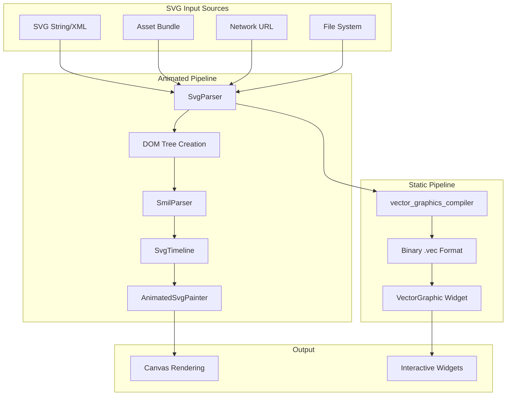
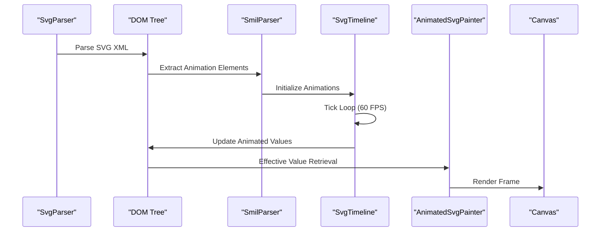

# Flutter SVG Roadmap

<cite>
**Referenced Files in This Document**
- [ROADMAP.md](file://ROADMAP.md)
- [NEXT_STEPS.md](file://NEXT_STEPS.md)
- [CURRENT_STATUS.md](file://CURRENT_STATUS.md)
- [README.md](file://README.md)
- [ARCHITECTURE.md](file://ARCHITECTURE.md)
- [TODO.md](file://TODO.md)
- [docs/BLINK_PARITY_AUDIT.md](file://docs/BLINK_PARITY_AUDIT.md)
- [docs/COMPREHENSIVE_GAP_ANALYSIS.md](file://docs/COMPREHENSIVE_GAP_ANALYSIS.md)
- [lib/svg.dart](file://lib/svg.dart)
- [lib/flutter_svg.dart](file://lib/flutter_svg.dart)
- [lib/src/animation/animated_svg_picture.dart](file://lib/src/animation/animated_svg_picture.dart)
- [lib/src/animation/svg_parser.dart](file://lib/src/animation/svg_parser.dart)
- [lib/src/animation/smil/smil_animation.dart](file://lib/src/animation/smil/smil_animation.dart)
- [lib/src/animation/css_to_smil_converter.dart](file://lib/src/animation/css_to_smil_converter.dart)
- [lib/src/animation/svg_filters.dart](file://lib/src/animation/svg_filters.dart)
- [lib/src/animation/svg_filters_registry_pipeline.dart](file://lib/src/animation/svg_filters_registry_pipeline.dart)
- [pubspec.yaml](file://pubspec.yaml)
</cite>

## Table of Contents
1. [Introduction](#introduction)
2. [Project Overview](#project-overview)
3. [Current Status Snapshot](#current-status-snapshot)
4. [Roadmap Structure](#roadmap-structure)
5. [Priority Categories](#priority-categories)
6. [Implementation Architecture](#implementation-architecture)
7. [Validation Framework](#validation-framework)
8. [Development Workflow](#development-workflow)
9. [Quality Assurance](#quality-assurance)
10. [Future Roadmap](#future-roadmap)

## Introduction

The Flutter SVG Roadmap documents the comprehensive journey toward achieving full Blink SVG engine parity in the flutter_svg package. This living document serves as the authoritative source for current development status, upcoming priorities, and completion criteria for SVG rendering capabilities in Flutter applications.

The flutter_svg package provides two distinct rendering pipelines: a production-ready static renderer using vector_graphics for optimal performance, and an experimental animated renderer with full DOM preservation, SMIL animation support, CSS interoperability, and advanced SVG feature coverage. This dual-pipeline architecture enables developers to choose between performance (static) and feature completeness (animated) based on their specific needs.

## Project Overview

### Package Architecture

The flutter_svg package maintains a sophisticated dual-pipeline architecture designed to serve different use cases:

**Static SVG Pipeline (Production)**
- Vector graphics compilation for optimal performance
- Binary .vec format for fast rendering
- DOM structure and animation removal for speed
- Production-ready widget integration

**Animated SVG Pipeline (Experimental)**
- Full DOM preservation with element hierarchy
- SMIL animation engine with timing control
- CSS animation interoperability
- Runtime control and interactive features
- Advanced filter effects and hit-testing

### Core Dependencies

The package leverages several key dependencies for robust SVG processing:

- **vector_graphics**: High-performance vector graphics backend
- **xml**: XML parsing for SVG document structure
- **http**: Network SVG loading capabilities
- **flutter/material**: Flutter widget integration

**Section sources**
- [pubspec.yaml:12-19](file://pubspec.yaml#L12-L19)
- [ARCHITECTURE.md:6-59](file://ARCHITECTURE.md#L6-L59)

## Current Status Snapshot

### Achievement Metrics

As of the latest update, the project has achieved remarkable progress across multiple SVG feature categories:

**Overall Parity Status**: ~82% Blink SVG parity with ~95% filter parity and ~95% SMIL parity

**Test Coverage**: 3,563+ tests passing with zero analyzer warnings

**Codebase Scale**: 123+ source modules with comprehensive feature implementation

### Feature Coverage Matrix

| Category | Coverage | Key Details |
|----------|----------|-------------|
| Geometry Rendering | ~95% | All 8 shapes + markers + patterns + gradients |
| Text & Typography | **~99%** | Full positioning, textPath, writing-mode, decorations, bidi, emphasis, shadow, font-variant, paint-order stroke, hanging punctuation, deep baseline alignment, ligature shaping |
| SMIL Animation | ~95% | 5 elements, full timing/interpolation, paced/spline/event-based, advanced animateMotion |
| CSS Animation Interop | ~85% | Selectors, cascade, variables, calc(), 3D transforms, @media |
| Interaction & Events | ~80% | Hit-testing (12 element types), pointer-events, `<a>`, `<view>` |
| Accessibility | ~80% | title/desc, ARIA attributes, Flutter Semantics integration |
| Structural Elements | ~80% | use/symbol/defs/view/a/switch/foreignObject |
| Clipping & Masking | ~70% | Baseline clip-path/mask with hit-testing gates |
| Filter Effects | ~68% | 17/25 Blink FE primitives with actual math (lighting, convolution) |
| External Content | ~60% | image (data/network/bundle), foreignObject viewport |

**Section sources**
- [README.md:13-27](file://README.md#L13-L27)
- [CURRENT_STATUS.md:12](file://CURRENT_STATUS.md#L12)

## Roadmap Structure

### Milestone Classification

The roadmap employs a hierarchical milestone system organized into four priority tiers:

**Closed Milestones (Do Not Reopen)**
- Successfully completed features with comprehensive test coverage
- Authoritative reference for project history and achievements
- Examples include advanced animateMotion semantics, filter graph implementation, and text typography parity

**Active Priorities (Current Focus)**
- **P0 - Parity Foundations**: Critical features blocking broader SVG compatibility
- **P1 - Core Feature Expansion**: Previously identified gaps now being addressed
- **P2 - CSS/Timing Fidelity**: Enhanced compatibility with CSS animation specifications
- **P3 - Quality and Stability**: Maintenance and improvement tasks

### Priority Determination Criteria

Features are prioritized based on:
- Impact on real-world SVG compatibility
- Complexity of implementation
- Developer demand and use cases
- Technical feasibility and resource requirements

**Section sources**
- [ROADMAP.md:15-41](file://ROADMAP.md#L15-L41)
- [ROADMAP.md:42-67](file://ROADMAP.md#L42-L67)

## Priority Categories

### P0 - Parity Foundations (Currently Active)

The highest priority category focuses on fundamental SVG compatibility gaps:

**1. Advanced animateMotion Semantics**
- SMIL 88% → 95% parity achievement
- Complex path timing precision improvements
- KeyPoints precision enhancements
- Rotate attribute edge case handling
- Zero-length segment processing

**2. CSS/SMIL Edge-Case Parity**
- Complex shorthand property resolution
- Unit handling precision improvements
- Timing precision enhancements
- Cross-platform compatibility verification

**3. External Content Edge Cases**
- Advanced image transformation support
- Nested foreignObject implementation (60% → 75% progress)
- Complex viewport handling scenarios
- Interactive content within foreignObject

**4. Code Modularization**
- Large file splitting for development velocity
- API stability preservation during refactoring
- Comprehensive regression testing after splits

**Section sources**
- [ROADMAP.md:44-49](file://ROADMAP.md#L44-L49)
- [NEXT_STEPS.md:16-28](file://NEXT_STEPS.md#L16-L28)

### P1 - Core Feature Expansion

Previously identified gaps that have been successfully addressed:

**Completed Features:**
- Advanced text typography/positioning parity (~99% coverage)
- ForeignObject and image semantics beyond baseline
- animateMotion parity beyond current baseline behavior

**Section sources**
- [ROADMAP.md:51-56](file://ROADMAP.md#L51-L56)
- [NEXT_STEPS.md:30-39](file://NEXT_STEPS.md#L30-L39)

### P2 - CSS/Timing Fidelity

Enhanced compatibility with CSS animation specifications:

**Focus Areas:**
- CSS transform and timing edge-case parity
- Expanded regression fixture coverage for CSS→SMIL conversion
- Advanced shorthand property resolution
- Unit handling precision improvements

**Section sources**
- [ROADMAP.md:57-61](file://ROADMAP.md#L57-L61)
- [NEXT_STEPS.md:18-28](file://NEXT_STEPS.md#L18-L28)

### P3 - Quality and Stability

Maintenance and improvement initiatives:

**Quality Goals:**
- Maintain full regression suite health after milestones
- Reduce analyzer info-level deprecations systematically
- Keep documentation synchronized with completed tasks
- Continuous performance optimization

**Section sources**
- [ROADMAP.md:62-67](file://ROADMAP.md#L62-L67)

## Implementation Architecture

### Dual Pipeline Design

The architecture employs a parallel pipeline approach to balance performance and feature completeness:

**Static Pipeline Benefits:**
- Fast rendering through vector graphics compilation
- Binary .vec format optimization
- Production-ready performance characteristics
- DOM structure removal for speed gains

**Animated Pipeline Capabilities:**
- Full DOM preservation with element hierarchy
- SMIL animation engine with precise timing control
- CSS animation interoperability
- Runtime control and interactive features
- Advanced filter effects and hit-testing

### Core Component Relationships



**Diagram sources**
- [ARCHITECTURE.md:12-48](file://ARCHITECTURE.md#L12-L48)

### Animation System Flow

The animated pipeline follows a structured animation processing flow:



**Diagram sources**
- [ARCHITECTURE.md:147-155](file://ARCHITECTURE.md#L147-L155)

**Section sources**
- [ARCHITECTURE.md:6-59](file://ARCHITECTURE.md#L6-L59)
- [ARCHITECTURE.md:147-155](file://ARCHITECTURE.md#L147-L155)

## Validation Framework

### Completion Criteria

Each roadmap item follows a comprehensive validation process:

**Required Completion Steps:**
1. **Behavior Implementation**: Feature functionality meets specification requirements
2. **Focused Testing**: Dedicated test coverage for the specific feature
3. **Regression Validation**: Full test suite passes on current main branch
4. **Documentation Update**: CURRENT_STATUS.md, TODO.md, and RESOLVED_ISSUES.md synchronization

### Quality Assurance Commands

**Validation Scripts:**
```bash
.fvm/versions/3.38.1/bin/flutter analyze
.fvm/versions/3.38.1/bin/flutter test
```

**Section sources**
- [ROADMAP.md:70-82](file://ROADMAP.md#L70-L82)

### Testing Infrastructure

The project maintains extensive test coverage across multiple domains:

**Test Categories:**
- **Animation Tests**: 152+ focused test files for animation functionality
- **Feature Tests**: Comprehensive coverage for individual SVG features
- **Integration Tests**: End-to-end validation of complete workflows
- **Regression Tests**: Ongoing validation of previously working features

**Section sources**
- [docs/COMPREHENSIVE_GAP_ANALYSIS.md:721-724](file://docs/COMPREHENSIVE_GAP_ANALYSIS.md#L721-L724)

## Development Workflow

### Current Sprint Focus

The active development sprint emphasizes three critical areas:

**Immediate Priorities:**
1. **CSS/SMIL Edge-Case Parity**: Enhancing timing precision and shorthand resolution
2. **External Content Parity**: Advancing image transformations and nested foreignObject support
3. **Code Modularization**: Splitting large files to improve development velocity

**Target Files for Refactoring:**
- `svg_filters_primitives.dart`
- `animated_svg_painter_shapes.dart`
- `animated_svg_picture.dart`
- `animated_svg_picture_utils.dart`

### Execution Strategy

**Parallel Development Approach:**
- Multiple teams can work on different priority categories simultaneously
- API stability preserved during modularization efforts
- Comprehensive regression testing after each refactoring milestone

**Section sources**
- [NEXT_STEPS.md:22-28](file://NEXT_STEPS.md#L22-L28)
- [TODO.md:12-18](file://TODO.md#L12-L18)

### Documentation Management

**Information Architecture:**
- `CURRENT_STATUS.md`: Single source of truth for project state
- `NEXT_STEPS.md`: Active feature items with execution order
- `TODO.md`: Work queue with priority classification
- `docs/RESOLVED_ISSUES.md`: Historical record of completed milestones

**Section sources**
- [CURRENT_STATUS.md:350-356](file://CURRENT_STATUS.md#L350-L356)
- [NEXT_STEPS.md:7-14](file://NEXT_STEPS.md#L7-L14)

## Quality Assurance

### Performance Optimization

The project implements comprehensive performance optimization strategies:

**Render-Time Caching:**
- Gradient shader caching with proper cache key generation
- Pattern image caching to avoid repeated toImageSync() calls
- Text paragraph caching for efficient text rendering
- Hit-test path geometry caching for faster pointer event handling
- Smart cache invalidation when animation time changes

**Memory Management:**
- Efficient object pooling for frequently used elements
- Lazy evaluation of expensive computations
- Proper cleanup of unused resources

### Analyzer Compliance

**Code Quality Standards:**
- Zero analyzer warnings across the entire codebase
- Regular analyzer runs during development
- Deprecation management and migration planning
- Code style consistency enforcement

**Section sources**
- [CURRENT_STATUS.md:160-167](file://CURRENT_STATUS.md#L160-L167)
- [CURRENT_STATUS.md:21-26](file://CURRENT_STATUS.md#L21-L26)

## Future Roadmap

### Next Phase Priorities

Based on current achievements and remaining gaps, the future roadmap focuses on:

**High-Impact Targets:**
1. **Advanced Filter Graph Semantics**: Completing complex input-graph composition
2. **Light Source Implementation**: Adding feDistantLight, fePointLight, feSpotLight support
3. **Enhanced Text Typography**: Advanced positioning and complex script support
4. **Improved Use/Symbol Inheritance**: Advanced cascade and inheritance edge cases

### Long-term Vision

**Strategic Goals:**
- Achieve comprehensive Blink SVG parity across all major feature categories
- Expand filter effect coverage to include remaining primitives
- Enhance text rendering capabilities for complex internationalization scenarios
- Improve performance optimization for large and complex SVG documents

### Community Engagement

**Contribution Opportunities:**
- Testing and validation of new features
- Documentation improvements and examples
- Bug reporting and feature requests
- Code contributions in priority areas

**Section sources**
- [docs/COMPREHENSIVE_GAP_ANALYSIS.md:494-511](file://docs/COMPREHENSIVE_GAP_ANALYSIS.md#L494-L511)
- [docs/COMPREHENSIVE_GAP_ANALYSIS.md:761-789](file://docs/COMPREHENSIVE_GAP_ANALYSIS.md#L761-L789)

## Conclusion

The Flutter SVG Roadmap represents a comprehensive and ambitious effort to achieve full SVG compatibility in Flutter applications. Through the dual-pipeline architecture, extensive testing infrastructure, and systematic approach to feature implementation, the project continues to make significant progress toward Blink SVG parity.

The current ~82% parity status with ~95% filter and SMIL compatibility demonstrates substantial achievement, while the ongoing work in CSS/SMIL edge cases, external content handling, and code modularization ensures continued improvement. The structured validation framework and quality assurance processes provide confidence in maintaining stability while expanding capabilities.

Developers can leverage the static pipeline for production applications requiring optimal performance, while the animated pipeline offers comprehensive SVG feature support for applications needing advanced SVG capabilities. The roadmap's clear priorities and completion criteria provide transparency into the project's direction and enable community contribution to specific areas of focus.