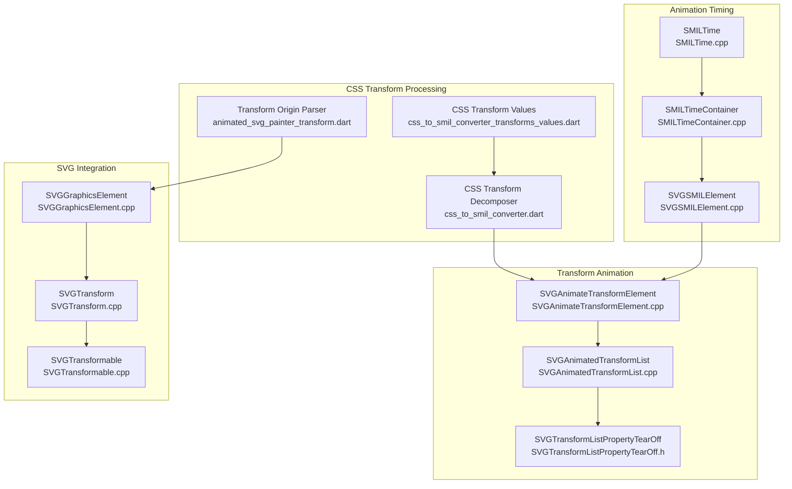
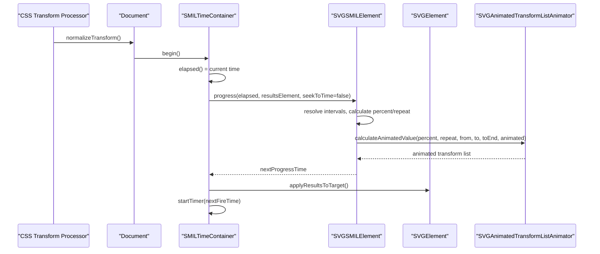
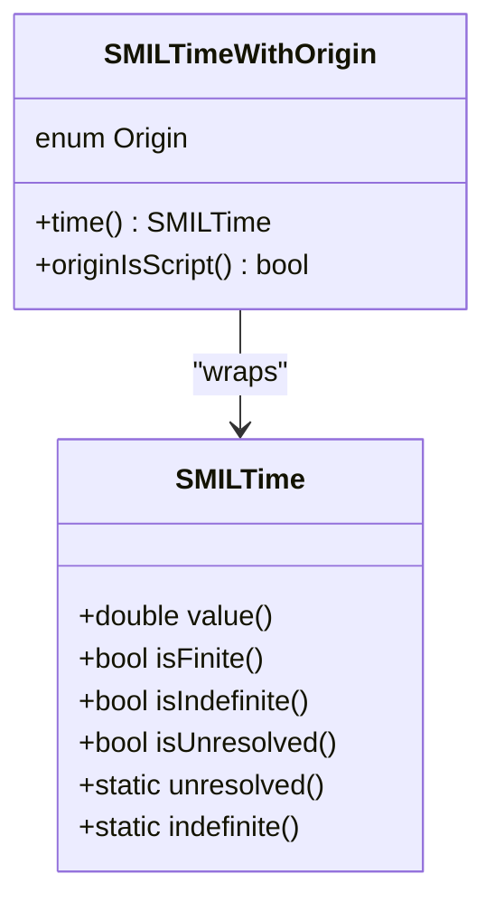
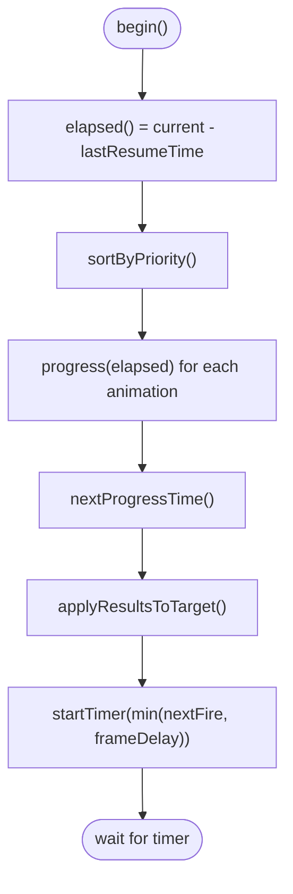
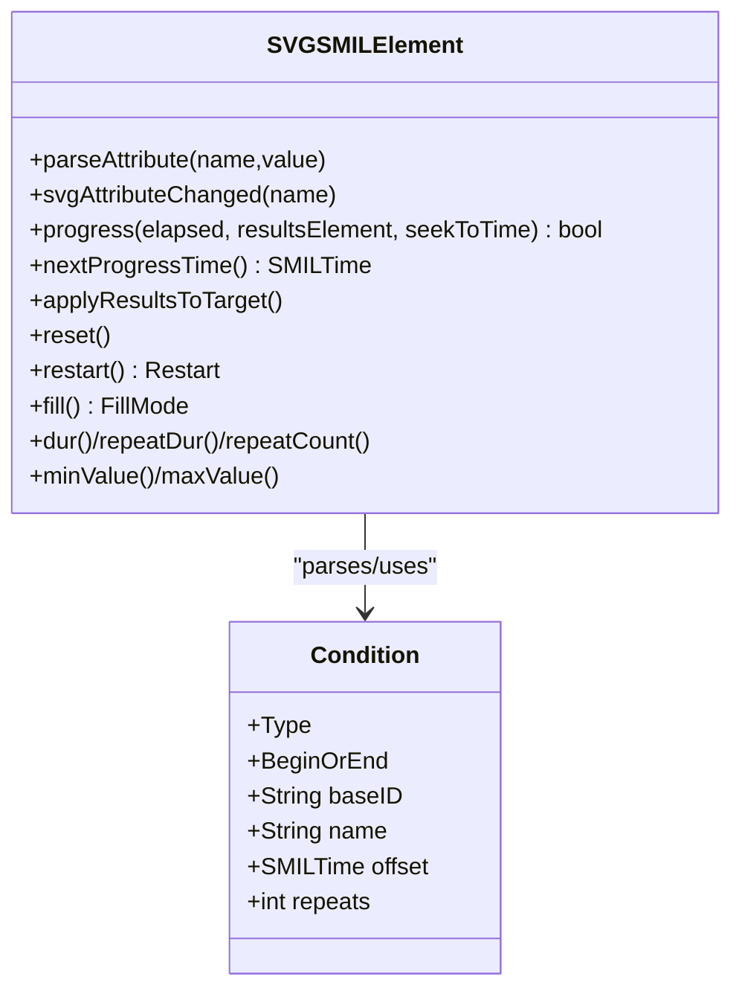
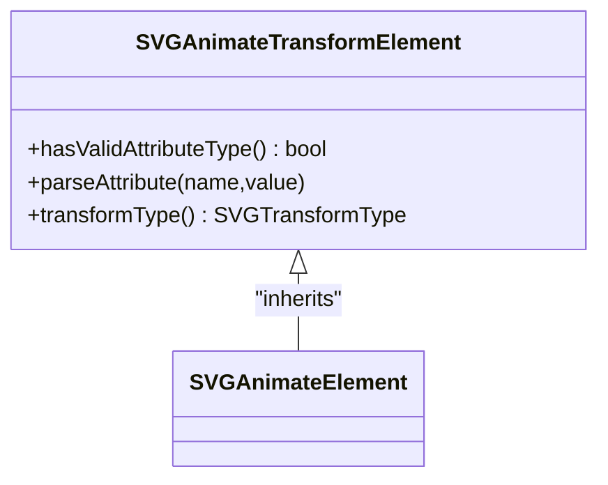
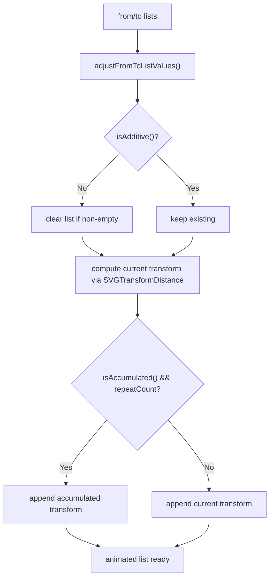
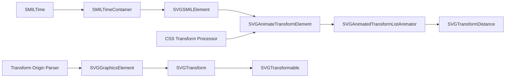

# Smil Transforms

<cite>
**Referenced Files in This Document**
- [SVGSMILElement.h](file://blink-b87d44f-Source-core-svg/animation/SVGSMILElement.h)
- [SVGSMILElement.cpp](file://blink-b87d44f-Source-core-svg/animation/SVGSMILElement.cpp)
- [SMILTime.h](file://blink-b87d44f-Source-core-svg/animation/SMILTime.h)
- [SMILTime.cpp](file://blink-b87d44f-Source-core-svg/animation/SMILTime.cpp)
- [SMILTimeContainer.h](file://blink-b87d44f-Source-core-svg/animation/SMILTimeContainer.h)
- [SMILTimeContainer.cpp](file://blink-b87d44f-Source-core-svg/animation/SMILTimeContainer.cpp)
- [SVGAnimateTransformElement.h](file://blink-b87d44f-Source-core-svg/SVGAnimateTransformElement.h)
- [SVGAnimateTransformElement.cpp](file://blink-b87d44f-Source-core-svg/SVGAnimateTransformElement.cpp)
- [SVGAnimatedTransformList.h](file://blink-b87d44f-Source-core-svg/SVGAnimatedTransformList.h)
- [SVGAnimatedTransformList.cpp](file://blink-b87d44f-Source-core-svg/SVGAnimatedTransformList.cpp)
- [SVGTransformListPropertyTearOff.h](file://blink-b87d44f-Source-core-svg/properties/SVGTransformListPropertyTearOff.h)
- [SVGGraphicsElement.cpp](file://blink-b87d44f-Source-core-svg/SVGGraphicsElement.cpp)
- [SVGTransform.cpp](file://blink-b87d44f-Source-core-svg/SVGTransform.cpp)
- [SVGTransformable.cpp](file://blink-b87d44f-Source-core-svg/SVGTransformable.cpp)
- [css_to_smil_converter_transforms_values.dart](file://lib/src/animation/css_to_smil_converter_transforms_values.dart)
- [animated_svg_painter_transform.dart](file://lib/src/animation/animated_svg_painter_transform.dart)
- [css_transform_calc_test.dart](file://test/animation/css_transform_calc_test.dart)
- [stroke_dash_stop_color_test.dart](file://test/animation/stroke_dash_stop_color_test.dart)
- [CURRENT_STATUS.md](file://CURRENT_STATUS.md)
</cite>

## Update Summary
**Changes Made**
- Added comprehensive CSS transform processing capabilities section
- Updated transform-origin parsing with enhanced keyword and unit support
- Added transform reference box calculations with transform-box property support
- Enhanced CSS transform normalization with calc() expression support
- Updated SMIL transform pipeline to handle CSS transform precedence
- Added 3D transform support with advanced parsing capabilities

## Table of Contents
1. [Introduction](#introduction)
2. [Project Structure](#project-structure)
3. [Core Components](#core-components)
4. [Architecture Overview](#architecture-overview)
5. [Advanced CSS Transform Processing](#advanced-css-transform-processing)
6. [Detailed Component Analysis](#detailed-component-analysis)
7. [Dependency Analysis](#dependency-analysis)
8. [Performance Considerations](#performance-considerations)
9. [Troubleshooting Guide](#troubleshooting-guide)
10. [Conclusion](#conclusion)

## Introduction
This document explains the SMIL (Synchronized Multimedia Integration Language) transforms implementation in the Blink-based SVG engine, with enhanced CSS transform processing capabilities. The system now supports advanced CSS transform processing with precedence rules where CSS transforms take precedence over SVG transform attributes, comprehensive transform-origin parsing supporting keywords, percentages, absolute values, and three-value syntax for 3D transforms, and sophisticated transform reference box calculations based on transform-box property values.

## Project Structure
The SMIL transforms feature spans several modules with enhanced CSS integration:
- Animation timing and scheduling: SMILTime, SMILTimeContainer, and SVGSMILElement
- Transform-specific animation: SVGAnimateTransformElement and SVGAnimatedTransformList
- Property-level transform list handling: SVGTransformListPropertyTearOff
- CSS transform processing: Advanced CSS transform normalization and parsing
- Transform origin and reference box calculations: Enhanced transform-origin support

**Diagram sources**
- [SMILTime.cpp:1-66](file://blink-b87d44f-Source-core-svg/animation/SMILTime.cpp#L1-L66)
- [SMILTimeContainer.cpp:1-332](file://blink-b87d44f-Source-core-svg/animation/SMILTimeContainer.cpp#L1-L332)
- [SVGSMILElement.cpp:1-800](file://blink-b87d44f-Source-core-svg/animation/SVGSMILElement.cpp#L1-L800)
- [SVGAnimateTransformElement.cpp:1-80](file://blink-b87d44f-Source-core-svg/SVGAnimateTransformElement.cpp#L1-L80)
- [SVGAnimatedTransformList.cpp:1-153](file://blink-b87d44f-Source-core-svg/SVGAnimatedTransformList.cpp#L1-L153)
- [SVGTransformListPropertyTearOff.h:1-83](file://blink-b87d44f-Source-core-svg/properties/SVGTransformListPropertyTearOff.h#L1-L83)
- [css_to_smil_converter_transforms_values.dart:1-389](file://lib/src/animation/css_to_smil_converter_transforms_values.dart#L1-L389)
- [animated_svg_painter_transform.dart:370-578](file://lib/src/animation/animated_svg_painter_transform.dart#L370-L578)
- [SVGGraphicsElement.cpp:68-101](file://blink-b87d44f-Source-core-svg/SVGGraphicsElement.cpp#L68-L101)
- [SVGTransform.cpp:126-163](file://blink-b87d44f-Source-core-svg/SVGTransform.cpp#L126-L163)
- [SVGTransformable.cpp:94-103](file://blink-b87d44f-Source-core-svg/SVGTransformable.cpp#L94-L103)

**Section sources**
- [SVGSMILElement.h:1-247](file://blink-b87d44f-Source-core-svg/animation/SVGSMILElement.h#L1-L247)
- [SVGSMILElement.cpp:1-800](file://blink-b87d44f-Source-core-svg/animation/SVGSMILElement.cpp#L1-L800)
- [SMILTime.h:1-100](file://blink-b87d44f-Source-core-svg/animation/SMILTime.h#L1-L100)
- [SMILTime.cpp:1-66](file://blink-b87d44f-Source-core-svg/animation/SMILTime.cpp#L1-L66)
- [SMILTimeContainer.h:1-102](file://blink-b87d44f-Source-core-svg/animation/SMILTimeContainer.h#L1-L102)
- [SMILTimeContainer.cpp:1-332](file://blink-b87d44f-Source-core-svg/animation/SMILTimeContainer.cpp#L1-L332)
- [SVGAnimateTransformElement.h:1-53](file://blink-b87d44f-Source-core-svg/SVGAnimateTransformElement.h#L1-L53)
- [SVGAnimateTransformElement.cpp:1-80](file://blink-b87d44f-Source-core-svg/SVGAnimateTransformElement.cpp#L1-L80)
- [SVGAnimatedTransformList.h:1-62](file://blink-b87d44f-Source-core-svg/SVGAnimatedTransformList.h#L1-L62)
- [SVGAnimatedTransformList.cpp:1-153](file://blink-b87d44f-Source-core-svg/SVGAnimatedTransformList.cpp#L1-L153)
- [SVGTransformListPropertyTearOff.h:1-83](file://blink-b87d44f-Source-core-svg/properties/SVGTransformListPropertyTearOff.h#L1-L83)

## Core Components
- SMILTime: Encapsulates time values with special semantics for unresolved, finite, and indefinite durations.
- SMILTimeContainer: Central scheduler that advances time, sorts animations by priority, and applies results.
- SVGSMILElement: Base class for SMIL animation elements implementing timing parsing, begin/end conditions, interval resolution, and progress application.
- SVGAnimateTransformElement: Specialized animation element for transform-type animations, validating target compatibility and parsing transform type.
- SVGAnimatedTransformListAnimator: Animator responsible for computing intermediate transform lists, additive accumulation, and distance calculation for paced interpolation.
- CSS Transform Processor: Advanced CSS transform normalization with calc() expression support and comprehensive unit parsing.
- Transform Origin Parser: Enhanced transform-origin parsing supporting keywords, percentages, absolute values, and three-value syntax for 3D transforms.
- Transform Reference Box Calculator: Calculates reference boxes based on transform-box property values with view-box support.

**Section sources**
- [SMILTime.h:34-55](file://blink-b87d44f-Source-core-svg/animation/SMILTime.h#L34-L55)
- [SMILTime.cpp:34-66](file://blink-b87d44f-Source-core-svg/animation/SMILTime.cpp#L34-L66)
- [SMILTimeContainer.h:45-98](file://blink-b87d44f-Source-core-svg/animation/SMILTimeContainer.h#L45-L98)
- [SMILTimeContainer.cpp:62-332](file://blink-b87d44f-Source-core-svg/animation/SMILTimeContainer.cpp#L62-L332)
- [SVGSMILElement.h:39-246](file://blink-b87d44f-Source-core-svg/animation/SVGSMILElement.h#L39-L246)
- [SVGSMILElement.cpp:109-800](file://blink-b87d44f-Source-core-svg/animation/SVGSMILElement.cpp#L109-L800)
- [SVGAnimateTransformElement.h:33-48](file://blink-b87d44f-Source-core-svg/SVGAnimateTransformElement.h#L33-L48)
- [SVGAnimateTransformElement.cpp:45-80](file://blink-b87d44f-Source-core-svg/SVGAnimateTransformElement.cpp#L45-L80)
- [SVGAnimatedTransformList.h:39-57](file://blink-b87d44f-Source-core-svg/SVGAnimatedTransformList.h#L39-L57)
- [SVGAnimatedTransformList.cpp:35-153](file://blink-b87d44f-Source-core-svg/SVGAnimatedTransformList.cpp#L35-L153)
- [css_to_smil_converter_transforms_values.dart:64-168](file://lib/src/animation/css_to_smil_converter_transforms_values.dart#L64-L168)
- [animated_svg_painter_transform.dart:373-435](file://lib/src/animation/animated_svg_painter_transform.dart#L373-L435)

## Architecture Overview
The SMIL transforms pipeline integrates timing, scheduling, transform-specific animation, and advanced CSS transform processing:

**Diagram sources**
- [SMILTimeContainer.cpp:133-332](file://blink-b87d44f-Source-core-svg/animation/SMILTimeContainer.cpp#L133-L332)
- [SVGSMILElement.cpp:109-800](file://blink-b87d44f-Source-core-svg/animation/SVGSMILElement.cpp#L109-L800)
- [SVGAnimatedTransformList.cpp:95-153](file://blink-b87d44f-Source-core-svg/SVGAnimatedTransformList.cpp#L95-L153)
- [css_to_smil_converter_transforms_values.dart:64-168](file://lib/src/animation/css_to_smil_converter_transforms_values.dart#L64-L168)

## Advanced CSS Transform Processing

### CSS Transform Normalization
The system now includes comprehensive CSS transform processing with advanced normalization capabilities:

- **Function Parsing**: Handles all CSS transform functions including 3D transforms (translate3d, rotate3d, scale3d, matrix3d)
- **Calc Expression Support**: Processes calc() expressions with arithmetic operations and unit conversions
- **Unit Conversion**: Supports px, em, rem, %, vw, vh, vmin, vmax, cm, mm, in, pt, pc, and bare numbers
- **Angle Unit Support**: Handles deg, rad, turn, grad units with automatic conversion
- **Nested Function Support**: Properly handles nested transform functions and complex expressions

### Transform Origin Enhancement
Enhanced transform-origin parsing supports:

- **Keyword Support**: left, center, right, top, bottom keywords
- **Percentage Values**: Percentage-based positioning with viewport-relative calculations
- **Absolute Units**: Pixel, em, rem, vw, vh, and other CSS units
- **Three-Value Syntax**: X Y Z syntax for 3D transforms (Z value ignored for 2D rendering)
- **Keyword Swapping**: Handles "top left" and "left top" equivalency

### Transform Reference Box Calculation
Transform reference boxes are calculated based on transform-box property values:

- **fill-box**: Default for SVG, uses object bounding box
- **view-box**: Uses nearest ancestor viewBox or root viewBox
- **content-box**: Uses element's content box
- **border-box**: Uses element's border box
- **ViewBox Detection**: Automatically detects nearest ancestor viewBox for view-box reference

**Section sources**
- [css_to_smil_converter_transforms_values.dart:64-389](file://lib/src/animation/css_to_smil_converter_transforms_values.dart#L64-L389)
- [animated_svg_painter_transform.dart:373-578](file://lib/src/animation/animated_svg_painter_transform.dart#L373-L578)
- [css_transform_calc_test.dart:1-200](file://test/animation/css_transform_calc_test.dart#L1-L200)

## Detailed Component Analysis

### SMIL Timing Model (SMILTime)
- Purpose: Represent time values with three states: unresolved, finite, and indefinite.
- Operators: Addition, subtraction, and multiplication are defined with special handling for unresolved/indefinite semantics.
- Usage: Used pervasively in timing computations for durations, offsets, and comparisons.

**Diagram sources**
- [SMILTime.h:34-81](file://blink-b87d44f-Source-core-svg/animation/SMILTime.h#L34-L81)
- [SMILTime.cpp:34-66](file://blink-b87d44f-Source-core-svg/animation/SMILTime.cpp#L34-L66)

**Section sources**
- [SMILTime.h:34-55](file://blink-b87d44f-Source-core-svg/animation/SMILTime.h#L34-L55)
- [SMILTime.cpp:34-66](file://blink-b87d44f-Source-core-svg/animation/SMILTime.cpp#L34-L66)

### Time Container and Scheduling (SMILTimeContainer)
- Purpose: Advance simulation time, sort animations by priority, and apply results atomically per element/attribute pair.
- Key behaviors:
  - begin/pause/resume/setElapsed control the global timeline.
  - schedule/unschedule groups animations by target element and attribute.
  - updateAnimations computes next fire times and triggers applyResultsToTarget.

**Diagram sources**
- [SMILTimeContainer.cpp:133-332](file://blink-b87d44f-Source-core-svg/animation/SMILTimeContainer.cpp#L133-L332)

**Section sources**
- [SMILTimeContainer.h:45-98](file://blink-b87d44f-Source-core-svg/animation/SMILTimeContainer.h#L45-L98)
- [SMILTimeContainer.cpp:62-332](file://blink-b87d44f-Source-core-svg/animation/SMILTimeContainer.cpp#L62-L332)

### SMIL Element Base (SVGSMILElement)
- Purpose: Parse and manage SMIL timing attributes (begin, end, dur, repeatDur, repeatCount, min, max), resolve conditions, and compute progress.
- Responsibilities:
  - Attribute parsing and caching of parsed durations.
  - Interval computation and active state transitions (Inactive/Active/Frozen).
  - Seeking to intervals and calculating next progress time.
  - Managing target element and attribute name binding to the time container.

**Diagram sources**
- [SVGSMILElement.h:39-246](file://blink-b87d44f-Source-core-svg/animation/SVGSMILElement.h#L39-L246)
- [SVGSMILElement.cpp:456-800](file://blink-b87d44f-Source-core-svg/animation/SVGSMILElement.cpp#L456-L800)

**Section sources**
- [SVGSMILElement.h:39-246](file://blink-b87d44f-Source-core-svg/animation/SVGSMILElement.h#L39-L246)
- [SVGSMILElement.cpp:109-800](file://blink-b87d44f-Source-core-svg/animation/SVGSMILElement.cpp#L109-L800)

### Animate Transform Element (SVGAnimateTransformElement)
- Purpose: Validates and configures transform-type animations for a target element.
- Key points:
  - Ensures the animated property type is AnimatedTransformList.
  - Parses the transform type attribute and restricts to supported transform kinds.

**Diagram sources**
- [SVGAnimateTransformElement.h:33-48](file://blink-b87d44f-Source-core-svg/SVGAnimateTransformElement.h#L33-L48)
- [SVGAnimateTransformElement.cpp:45-80](file://blink-b87d44f-Source-core-svg/SVGAnimateTransformElement.cpp#L45-L80)

**Section sources**
- [SVGAnimateTransformElement.h:33-48](file://blink-b87d44f-Source-core-svg/SVGAnimateTransformElement.h#L33-L48)
- [SVGAnimateTransformElement.cpp:45-80](file://blink-b87d44f-Source-core-svg/SVGAnimateTransformElement.cpp#L45-L80)

### Transform List Animator (SVGAnimatedTransformListAnimator)
- Purpose: Computes animated transform lists, handles additive accumulation, and calculates distances for paced interpolation.
- Key behaviors:
  - constructFromString parses a single-transform string into a transform list.
  - calculateAnimatedValue interpolates between from/to transforms, optionally accumulating repeated transforms.
  - calculateDistance uses SVGTransformDistance for scalar-like distance metrics.

**Diagram sources**
- [SVGAnimatedTransformList.cpp:95-153](file://blink-b87d44f-Source-core-svg/SVGAnimatedTransformList.cpp#L95-L153)

**Section sources**
- [SVGAnimatedTransformList.h:39-57](file://blink-b87d44f-Source-core-svg/SVGAnimatedTransformList.h#L39-L57)
- [SVGAnimatedTransformList.cpp:35-153](file://blink-b87d44f-Source-core-svg/SVGAnimatedTransformList.cpp#L35-L153)

### Transform List Property Tear-Off
- Purpose: Exposes transform list manipulation to bindings, including consolidating transforms and creating transforms from matrices.
- Notable methods: createSVGTransformFromMatrix, consolidate.

**Section sources**
- [SVGTransformListPropertyTearOff.h:31-77](file://blink-b87d44f-Source-core-svg/properties/SVGTransformListPropertyTearOff.h#L31-L77)

### CSS Transform Integration
- Purpose: Integrates CSS transform processing with SMIL animation pipeline.
- Key behaviors:
  - CSS transform normalization with calc() expression support.
  - Transform-origin parsing with enhanced keyword and unit support.
  - Transform reference box calculations based on transform-box property.
  - CSS transform precedence over SVG transform attributes.

**Section sources**
- [css_to_smil_converter_transforms_values.dart:64-389](file://lib/src/animation/css_to_smil_converter_transforms_values.dart#L64-L389)
- [animated_svg_painter_transform.dart:373-578](file://lib/src/animation/animated_svg_painter_transform.dart#L373-L578)
- [SVGGraphicsElement.cpp:68-101](file://blink-b87d44f-Source-core-svg/SVGGraphicsElement.cpp#L68-L101)

## Dependency Analysis
- SVGSMILElement depends on SMILTime and SMILTimeContainer for timing and scheduling.
- SVGAnimateTransformElement depends on SVGAnimateElement and SVGTransformable for transform type validation.
- SVGAnimatedTransformListAnimator depends on SVGTransformDistance and SVGAnimateTransformElement for transform parsing and interpolation.
- SMILTimeContainer groups animations by element and attribute, ensuring atomic application of results.
- CSS Transform Processor integrates with SMIL pipeline for advanced CSS transform support.
- Transform Origin Parser provides enhanced transform-origin calculations for 3D transforms.

**Diagram sources**
- [SMILTime.cpp:34-66](file://blink-b87d44f-Source-core-svg/animation/SMILTime.cpp#L34-L66)
- [SMILTimeContainer.cpp:62-332](file://blink-b87d44f-Source-core-svg/animation/SMILTimeContainer.cpp#L62-L332)
- [SVGSMILElement.cpp:109-800](file://blink-b87d44f-Source-core-svg/animation/SVGSMILElement.cpp#L109-L800)
- [SVGAnimateTransformElement.cpp:45-80](file://blink-b87d44f-Source-core-svg/SVGAnimateTransformElement.cpp#L45-L80)
- [SVGAnimatedTransformList.cpp:35-153](file://blink-b87d44f-Source-core-svg/SVGAnimatedTransformList.cpp#L35-L153)
- [css_to_smil_converter_transforms_values.dart:64-168](file://lib/src/animation/css_to_smil_converter_transforms_values.dart#L64-L168)
- [animated_svg_painter_transform.dart:373-435](file://lib/src/animation/animated_svg_painter_transform.dart#L373-L435)
- [SVGGraphicsElement.cpp:68-101](file://blink-b87d44f-Source-core-svg/SVGGraphicsElement.cpp#L68-L101)

**Section sources**
- [SVGSMILElement.cpp:109-800](file://blink-b87d44f-Source-core-svg/animation/SVGSMILElement.cpp#L109-L800)
- [SVGAnimateTransformElement.cpp:45-80](file://blink-b87d44f-Source-core-svg/SVGAnimateTransformElement.cpp#L45-L80)
- [SVGAnimatedTransformList.cpp:35-153](file://blink-b87d44f-Source-core-svg/SVGAnimatedTransformList.cpp#L35-L153)
- [css_to_smil_converter_transforms_values.dart:64-168](file://lib/src/animation/css_to_smil_converter_transforms_values.dart#L64-L168)
- [animated_svg_painter_transform.dart:373-435](file://lib/src/animation/animated_svg_painter_transform.dart#L373-L435)

## Performance Considerations
- Priority sorting: Animations are sorted by begin time and document order, with special handling for frozen intervals. This ensures predictable updates and minimal churn.
- Batch application: Results are accumulated to a single results element per element/attribute pair before applying, reducing redundant writes.
- Timers: The scheduler uses a minimum frame delay to avoid excessive wake-ups while maintaining smooth animation playback.
- Transform distance: Distance calculations for paced interpolation rely on SVGTransformDistance, which simplifies complex transform spaces into scalar-like metrics.
- CSS transform optimization: Advanced CSS transform normalization reduces parsing overhead and improves performance for complex transform expressions.
- Transform origin caching: Transform reference box calculations are cached to avoid repeated expensive computations.

## Troubleshooting Guide
Common issues and diagnostics:
- Unresolved durations: If dur, repeatDur, or repeatCount parse incorrectly, SMILTime resolves to unresolved, preventing progress. Verify attribute values and units.
- Conditions not firing: Event-based begin/end conditions require valid target elements and event names. Ensure conditions are connected after insertion and disconnected on removal.
- Matrix vs. transform type: animateTransform restricts supported transform types; specifying matrix will be rejected. Confirm transform type matches supported kinds.
- Accumulation anomalies: Additive and accumulated modes combine transforms differently. Validate isAdditive and isAccumulated flags to match expected behavior.
- CSS transform precedence: CSS transform properties now take precedence over SVG transform attributes. Verify CSS specificity and cascade order.
- Transform-origin parsing errors: Ensure transform-origin values use supported keywords, units, or percentages. Check for proper keyword swapping ("top left" vs "left top").
- ViewBox reference issues: For transform-box: view-box, ensure ancestor elements have valid viewBox attributes or use default object bounding box.

**Section sources**
- [SVGSMILElement.cpp:456-800](file://blink-b87d44f-Source-core-svg/animation/SVGSMILElement.cpp#L456-L800)
- [SVGAnimateTransformElement.cpp:62-80](file://blink-b87d44f-Source-core-svg/SVGAnimateTransformElement.cpp#L62-L80)
- [SVGAnimatedTransformList.cpp:95-153](file://blink-b87d44f-Source-core-svg/SVGAnimatedTransformList.cpp#L95-L153)
- [css_to_smil_converter_transforms_values.dart:213-269](file://lib/src/animation/css_to_smil_converter_transforms_values.dart#L213-L269)
- [animated_svg_painter_transform.dart:373-435](file://lib/src/animation/animated_svg_painter_transform.dart#L373-L435)

## Conclusion
The SMIL transforms implementation now combines a robust timing model with advanced CSS transform processing capabilities. The enhanced system supports CSS transform precedence over SVG transform attributes, comprehensive transform-origin parsing with keywords and units, transform reference box calculations based on transform-box property values, and sophisticated CSS transform normalization with calc() expression support. SMILTime and SMILTimeContainer provide precise scheduling and progression, while SVGAnimateTransformElement and SVGAnimatedTransformListAnimator deliver accurate transform interpolation and accumulation. The CSS transform processor and enhanced transform origin parser enable high-fidelity CSS-based transform animations in SVG with full compatibility for modern web standards.