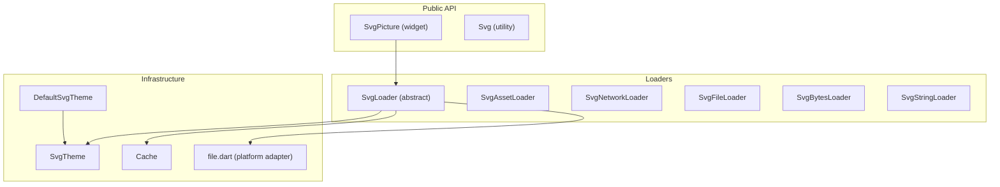
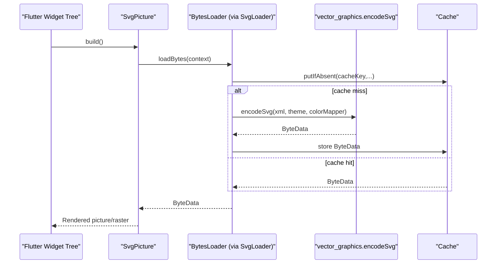
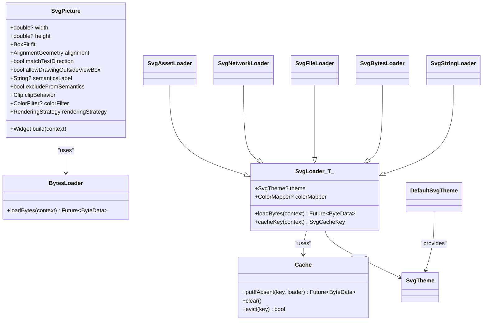

# Basic Usage

<cite>
**Referenced Files in This Document**
- [svg.dart](file://lib/svg.dart)
- [loaders.dart](file://lib/src/loaders.dart)
- [cache.dart](file://lib/src/cache.dart)
- [default_theme.dart](file://lib/src/default_theme.dart)
- [file.dart](file://lib/src/utilities/file.dart)
- [readme_excerpts.dart](file://example/lib/readme_excerpts.dart)
- [home_page.dart](file://example/lib/pages/home_page.dart)
- [widget_svg_test.dart](file://test/widget_svg_test.dart)
</cite>

## Table of Contents
1. [Introduction](#introduction)
2. [Project Structure](#project-structure)
3. [Core Components](#core-components)
4. [Architecture Overview](#architecture-overview)
5. [Detailed Component Analysis](#detailed-component-analysis)
6. [Dependency Analysis](#dependency-analysis)
7. [Performance Considerations](#performance-considerations)
8. [Troubleshooting Guide](#troubleshooting-guide)
9. [Conclusion](#conclusion)
10. [Appendices](#appendices)

## Introduction
This guide explains how to use the SvgPicture widget to render SVGs in Flutter using the factory constructors for asset, network, file, memory, and string sources. It covers constructor parameters, layout and sizing, configuration options (fit, alignment, semantics, placeholders, color filters), and the underlying loading pipeline. It also introduces beginner-friendly concepts such as SVG coordinate systems, viewBox handling, and Flutter widget integration, with practical examples and troubleshooting tips.

## Project Structure
The library exposes a single SvgPicture widget and a small set of loader classes that encapsulate how SVG data is fetched, parsed, and rendered. The loaders are designed around a shared BytesLoader abstraction and a caching layer to optimize repeated loads.

**Diagram sources**
- [svg.dart:56-627](file://lib/svg.dart#L56-L627)
- [loaders.dart:118-467](file://lib/src/loaders.dart#L118-L467)
- [cache.dart:1-111](file://lib/src/cache.dart#L1-L111)
- [default_theme.dart:1-36](file://lib/src/default_theme.dart#L1-L36)
- [file.dart:1-2](file://lib/src/utilities/file.dart#L1-L2)

**Section sources**
- [svg.dart:1-627](file://lib/svg.dart#L1-L627)
- [loaders.dart:1-467](file://lib/src/loaders.dart#L1-L467)
- [cache.dart:1-111](file://lib/src/cache.dart#L1-L111)
- [default_theme.dart:1-36](file://lib/src/default_theme.dart#L1-L36)
- [file.dart:1-2](file://lib/src/utilities/file.dart#L1-L2)

## Core Components
- SvgPicture: The primary widget for rendering SVGs from various sources. It accepts a BytesLoader and numerous configuration options for sizing, alignment, semantics, clipping, and rendering strategy.
- Loader family: Specialized loaders for asset, network, file, memory (Uint8List), and string sources. They extend a common base that performs parsing in an isolates and caches the resulting vector graphics data.
- SvgTheme and DefaultSvgTheme: Control how SVG units (like em/ex) are resolved and provide a subtree-wide default theme.
- Cache: A shared cache keyed by loader identity, theme, and optional color mapper to avoid redundant work.

Key constructor families:
- SvgPicture.asset(...)
- SvgPicture.network(...)
- SvgPicture.file(...)
- SvgPicture.memory(...)
- SvgPicture.string(...)

Common parameters:
- width, height: Fixed size or rely on parent constraints.
- fit: BoxFit to control scaling.
- alignment: Alignment or AlignmentDirectional to control placement.
- semanticsLabel, excludeFromSemantics: Accessibility labeling.
- placeholderBuilder: Widget shown while loading.
- errorBuilder: Widget shown on load errors.
- colorFilter: Applies a ColorFilter to the entire drawing.
- matchTextDirection: Flip horizontally in RTL contexts.
- allowDrawingOutsideViewBox: Toggle viewBox clipping.
- clipBehavior: Clipping behavior for the widget’s bounds.
- renderingStrategy: Choose between picture and raster rendering strategies.

**Section sources**
- [svg.dart:56-627](file://lib/svg.dart#L56-L627)
- [loaders.dart:118-467](file://lib/src/loaders.dart#L118-L467)
- [default_theme.dart:1-36](file://lib/src/default_theme.dart#L1-L36)

## Architecture Overview
SvgPicture delegates rendering to a compatibility layer that consumes a BytesLoader. The loader resolves the source, decodes the SVG, and produces a vector-graphics buffer. The pipeline uses an isolate to parse and encode the SVG, then caches the result keyed by the loader plus theme and color mapper.

**Diagram sources**
- [svg.dart:542-560](file://lib/svg.dart#L542-L560)
- [loaders.dart:156-187](file://lib/src/loaders.dart#L156-L187)
- [cache.dart:65-93](file://lib/src/cache.dart#L65-L93)

## Detailed Component Analysis

### SvgPicture Constructors and Factory Patterns
SvgPicture uses a factory-like pattern via named constructors to create a BytesLoader appropriate for each source and pass it to the main constructor. Each factory sets up the corresponding loader with optional theme, color mapper, and other parameters.

- Asset factory: Creates an SvgAssetLoader with assetName, optional bundle/package, and theme/colorMapper.
- Network factory: Creates an SvgNetworkLoader with URL, optional headers, and theme/colorMapper.
- File factory: Creates an SvgFileLoader with a File handle and theme/colorMapper.
- Memory factory: Creates an SvgBytesLoader with Uint8List and theme/colorMapper.
- String factory: Creates an SvgStringLoader with a String and theme/colorMapper.

Parameters differ by source:
- Asset: supports bundle/package selection and DefaultAssetBundle resolution.
- Network: supports custom HTTP headers and optional httpClient.
- File: platform-specific IO; may require permissions on Android.
- Memory/String: immediate in-memory sources.

Configuration options are identical across factories:
- width, height, fit, alignment, semanticsLabel, excludeFromSemantics, placeholderBuilder, errorBuilder, colorFilter, matchTextDirection, allowDrawingOutsideViewBox, clipBehavior, renderingStrategy.

Layout and constraints:
- Specify width/height or rely on tight layout constraints to avoid layout shifts during load.

Accessibility:
- semanticsLabel and excludeFromSemantics control semantics exposure.

Rendering strategy:
- Choose between picture and raster rendering strategies depending on performance needs.

**Section sources**
- [svg.dart:104-447](file://lib/svg.dart#L104-L447)

### Loader Implementation Patterns
The loaders share a common base that:
- Resolves a theme (explicit, from DefaultSvgTheme, or default).
- Optionally applies a ColorMapper.
- Computes a cache key including theme and color mapper.
- Performs decoding and encoding in an isolate.
- Uses the shared Cache to deduplicate work.

SvgLoader<T>:
- ProvidesSvg theme resolution and compute-based encoding.
- Exposes prepareMessage for loaders needing context-dependent inputs (e.g., asset bundle).
- Implements loadBytes via Cache and compute.

Concrete loaders:
- SvgAssetLoader: resolves AssetBundle (explicit or DefaultAssetBundle), loads bytes, decodes UTF-8.
- SvgNetworkLoader: fetches via http.Client, supports custom headers and optional httpClient.
- SvgFileLoader: reads File synchronously and decodes UTF-8.
- SvgBytesLoader: decodes provided Uint8List.
- SvgStringLoader: uses provided String directly.

Cache key nuances:
- Asset loader uses a composite key including asset name, package, and resolved AssetBundle to avoid cross-bundle collisions.
- Other loaders use loader identity plus theme and color mapper.

**Section sources**
- [loaders.dart:118-194](file://lib/src/loaders.dart#L118-L194)
- [loaders.dart:343-413](file://lib/src/loaders.dart#L343-L413)
- [loaders.dart:417-466](file://lib/src/loaders.dart#L417-L466)
- [loaders.dart:284-307](file://lib/src/loaders.dart#L284-L307)
- [loaders.dart:260-280](file://lib/src/loaders.dart#L260-L280)
- [loaders.dart:234-255](file://lib/src/loaders.dart#L234-L255)

### Theme and Units
SvgTheme controls how em/ex units are computed:
- currentColor influences elements inheriting color.
- fontSize drives em calculations.
- xHeight defaults to fontSize / 2 and influences ex calculations.

DefaultSvgTheme allows setting a subtree-wide theme. Loaders consult the theme in the current BuildContext if provided.

Practical impact:
- When sizing text or shapes using em/ex, adjust SvgTheme to match your design system.

**Section sources**
- [loaders.dart:17-74](file://lib/src/loaders.dart#L17-L74)
- [default_theme.dart:1-36](file://lib/src/default_theme.dart#L1-L36)

### Widget Lifecycle, Layout Constraints, and Initialization
- Initialization: SvgPicture stores the BytesLoader and configuration options; build delegates to a compatibility renderer.
- Layout: Specify width/height or ensure tight layout constraints to prevent layout shifts while the image loads.
- Semantics: Add semanticsLabel or excludeFromSemantics to control accessibility.
- Placeholder/error: Use placeholderBuilder for long-running loads (e.g., network) and errorBuilder for error scenarios.
- Color filtering: Apply colorFilter to tint or recolor the entire drawing.
- Directionality: matchTextDirection flips the image in RTL contexts.

**Section sources**
- [svg.dart:542-560](file://lib/svg.dart#L542-L560)
- [svg.dart:454-541](file://lib/svg.dart#L454-L541)

### Practical Examples

- Simple asset loading
  - Use SvgPicture.asset with an asset path and optional semanticsLabel.
  - Reference: [readme_excerpts.dart:20-26](file://example/lib/readme_excerpts.dart#L20-L26)

- Network SVG display
  - Use SvgPicture.network with a URL and optional placeholderBuilder for long loads.
  - Reference: [readme_excerpts.dart:56-68](file://example/lib/readme_excerpts.dart#L56-L68)

- Basic configuration
  - Fit, alignment, semantics, colorFilter, placeholderBuilder, errorBuilder, renderingStrategy.
  - References:
    - [svg.dart:467-541](file://lib/svg.dart#L467-L541)
    - [readme_excerpts.dart:29-39](file://example/lib/readme_excerpts.dart#L29-L39)

- Home page hero example
  - Demonstrates SvgPicture.string with sizing and Hero.
  - Reference: [home_page.dart:53-60](file://example/lib/pages/home_page.dart#L53-L60)

- Color mapping
  - Use ColorMapper to transform colors during parsing.
  - Reference: [readme_excerpts.dart:127-141](file://example/lib/readme_excerpts.dart#L127-L141)

- Placeholder and error handling
  - placeholderBuilder for network loading delays.
  - errorBuilder for error scenarios.
  - Reference: [svg.dart:498-529](file://lib/svg.dart#L498-L529)

### Beginner-Friendly Concepts

- SVG coordinate systems and viewBox
  - SVGs define a coordinate system and a viewBox rectangle. The widget scales and aligns the drawing to its layout bounds using fit and alignment.
  - allowDrawingOutsideViewBox toggles whether the internal canvas clips to the viewBox.

- Flutter widget integration
  - SvgPicture integrates seamlessly with Flutter layout. Provide fixed width/height or rely on tight constraints to avoid layout thrashing during load.

- Units and themes
  - em/ex units depend on SvgTheme.fontSize and xHeight. Adjust the theme to match your typography baseline.

**Section sources**
- [svg.dart:68-71](file://lib/svg.dart#L68-L71)
- [loaders.dart:17-74](file://lib/src/loaders.dart#L17-L74)

## Dependency Analysis
The following diagram shows the main dependencies among core components.

**Diagram sources**
- [svg.dart:56-627](file://lib/svg.dart#L56-L627)
- [loaders.dart:118-194](file://lib/src/loaders.dart#L118-L194)
- [cache.dart:1-111](file://lib/src/cache.dart#L1-L111)
- [default_theme.dart:1-36](file://lib/src/default_theme.dart#L1-L36)

**Section sources**
- [svg.dart:56-627](file://lib/svg.dart#L56-L627)
- [loaders.dart:118-194](file://lib/src/loaders.dart#L118-L194)
- [cache.dart:1-111](file://lib/src/cache.dart#L1-L111)
- [default_theme.dart:1-36](file://lib/src/default_theme.dart#L1-L36)

## Performance Considerations
- Prefer fixed width/height or tight layout constraints to avoid layout shifts during load.
- Use placeholderBuilder for network or large assets to improve perceived performance.
- Leverage the shared Cache to avoid repeated parsing and encoding.
- Consider renderingStrategy to balance fidelity and performance.
- Avoid allowDrawingOutsideViewBox unless necessary to prevent unintended overdraw.

[No sources needed since this section provides general guidance]

## Troubleshooting Guide
- Layout shifts during load
  - Cause: Missing width/height and changing intrinsic size while loading.
  - Fix: Set width/height or constrain the parent tightly.

- Network failures
  - Symptom: Errors thrown on HTTP exceptions.
  - Fix: Provide errorBuilder and handle exceptions gracefully.

- Asset not found
  - Symptom: Console logs and load failure.
  - Fix: Verify asset path and ensure it is included in pubspec.yaml.

- Color tint not applied
  - Symptom: No visible tint.
  - Fix: Ensure colorFilter is provided; note that color is deprecated in favor of colorFilter.

- RTL mirroring unexpected
  - Symptom: Image mirrored in RTL.
  - Fix: Set matchTextDirection appropriately.

- Accessibility labeling
  - Symptom: Screen reader does not announce content.
  - Fix: Provide semanticsLabel or disable semantics with excludeFromSemantics.

**Section sources**
- [svg.dart:60-67](file://lib/svg.dart#L60-L67)
- [svg.dart:528-530](file://lib/svg.dart#L528-L530)
- [widget_svg_test.dart:571-581](file://test/widget_svg_test.dart#L571-L581)
- [widget_svg_test.dart:583-637](file://test/widget_svg_test.dart#L583-L637)

## Conclusion
SvgPicture offers a concise, powerful API to render SVGs from multiple sources with consistent configuration. By understanding the factory constructors, the loader pipeline, caching, and Flutter layout integration, you can efficiently display scalable vector graphics with proper semantics, placeholders, and performance characteristics.

[No sources needed since this section summarizes without analyzing specific files]

## Appendices

### Quick Reference: Constructor Families and Use Cases
- SvgPicture.asset(assetName, ...): Local assets, including package assets.
- SvgPicture.network(url, ...): Remote SVGs with optional headers and custom client.
- SvgPicture.file(File, ...): Local file-based SVGs.
- SvgPicture.memory(Uint8List, ...): In-memory SVG bytes.
- SvgPicture.string(String, ...): Inline SVG string.

Common options: width, height, fit, alignment, semanticsLabel, excludeFromSemantics, placeholderBuilder, errorBuilder, colorFilter, matchTextDirection, allowDrawingOutsideViewBox, clipBehavior, renderingStrategy.

**Section sources**
- [svg.dart:104-447](file://lib/svg.dart#L104-L447)

### Example References
- Asset loading: [readme_excerpts.dart:20-26](file://example/lib/readme_excerpts.dart#L20-L26)
- Colorized asset: [readme_excerpts.dart:29-39](file://example/lib/readme_excerpts.dart#L29-L39)
- Network with placeholder: [readme_excerpts.dart:56-68](file://example/lib/readme_excerpts.dart#L56-L68)
- Color mapping: [readme_excerpts.dart:127-141](file://example/lib/readme_excerpts.dart#L127-L141)
- Home page hero: [home_page.dart:53-60](file://example/lib/pages/home_page.dart#L53-L60)