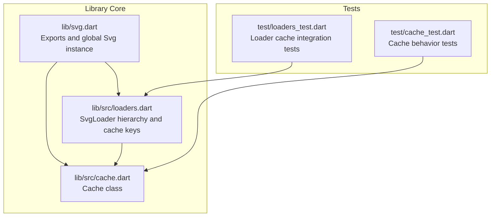
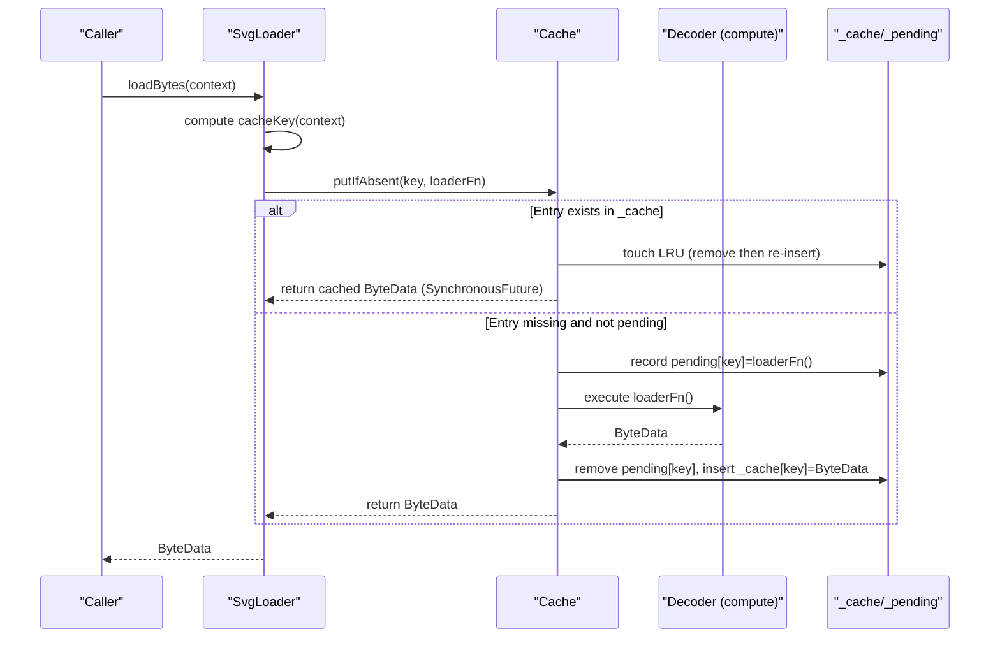
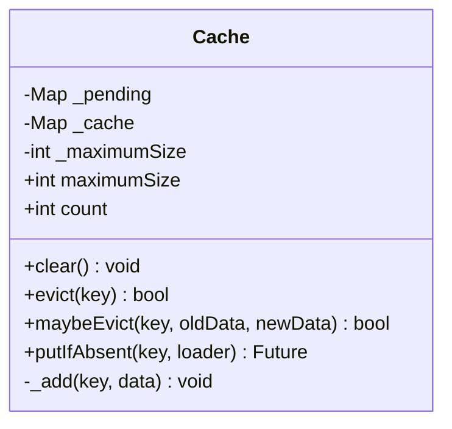
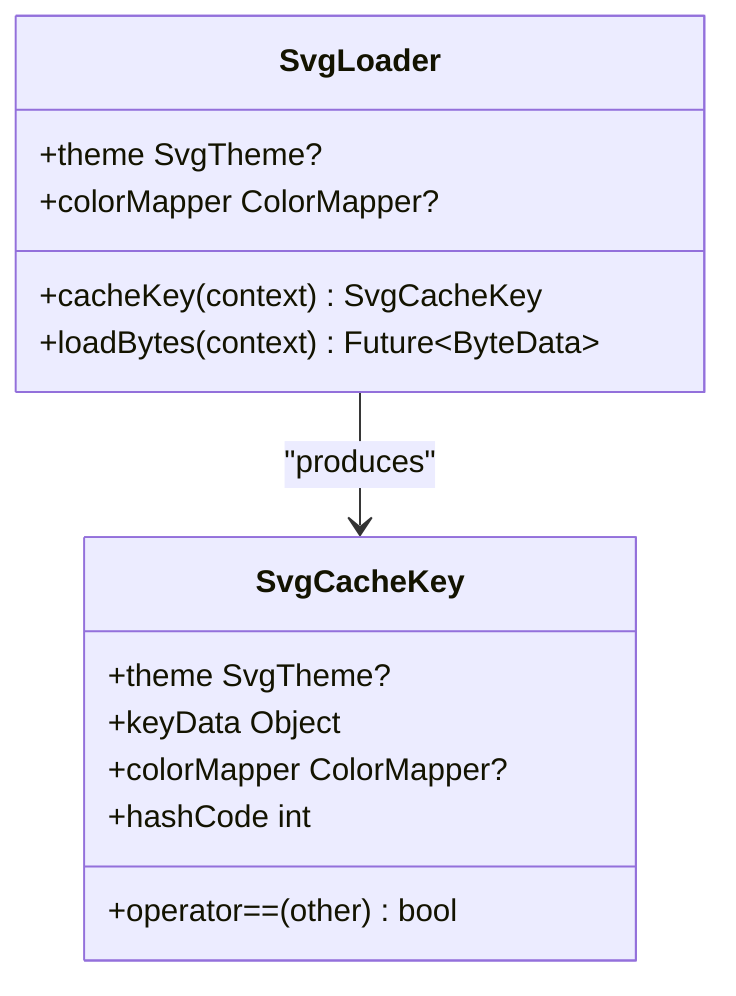
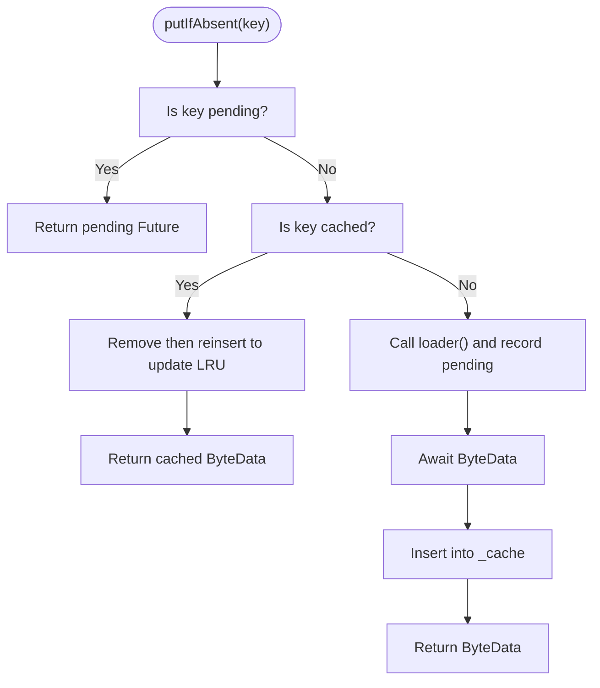
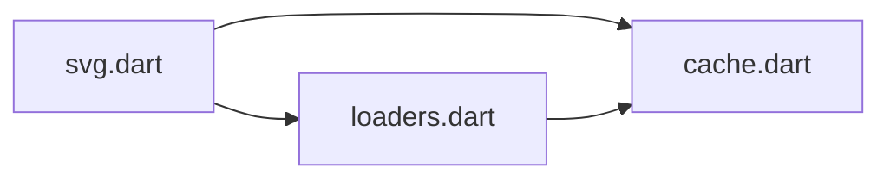

# Caching System

<cite>
**Referenced Files in This Document**
- [cache.dart](file://lib/src/cache.dart)
- [loaders.dart](file://lib/src/loaders.dart)
- [svg.dart](file://lib/svg.dart)
- [cache_test.dart](file://test/cache_test.dart)
- [loaders_test.dart](file://test/loaders_test.dart)
</cite>

## Table of Contents
1. [Introduction](#introduction)
2. [Project Structure](#project-structure)
3. [Core Components](#core-components)
4. [Architecture Overview](#architecture-overview)
5. [Detailed Component Analysis](#detailed-component-analysis)
6. [Dependency Analysis](#dependency-analysis)
7. [Performance Considerations](#performance-considerations)
8. [Troubleshooting Guide](#troubleshooting-guide)
9. [Conclusion](#conclusion)
10. [Appendices](#appendices)

## Introduction
This document explains the SVG caching system with a focus on the Cache class and its Least Recently Used (LRU) eviction strategy. It covers thread-safety characteristics, cache key generation, memory management policies, configuration options, and integration with various loading strategies. It also provides practical guidance on customization, manual cache management, monitoring, optimization, and debugging.

## Project Structure
The caching system lives in the library’s core module and integrates with the loader hierarchy. The key files are:
- Cache implementation and public API surface
- Loader classes that generate cache keys and use the cache
- Global Svg singleton exposing the cache instance
- Tests validating cache behavior and eviction

**Diagram sources**
- [svg.dart:26-45](file://lib/svg.dart#L26-L45)
- [cache.dart:4-111](file://lib/src/cache.dart#L4-L111)
- [loaders.dart:121-194](file://lib/src/loaders.dart#L121-L194)
- [cache_test.dart:1-133](file://test/cache_test.dart#L1-L133)
- [loaders_test.dart:46-79](file://test/loaders_test.dart#L46-L79)

**Section sources**
- [svg.dart:26-45](file://lib/svg.dart#L26-L45)
- [cache.dart:4-111](file://lib/src/cache.dart#L4-L111)
- [loaders.dart:121-194](file://lib/src/loaders.dart#L121-L194)
- [cache_test.dart:1-133](file://test/cache_test.dart#L1-L133)
- [loaders_test.dart:46-79](file://test/loaders_test.dart#L46-L79)

## Core Components
- Cache: Thread-safe in-memory cache for decoded SVG ByteData keyed by SvgCacheKey. Implements LRU eviction and supports dynamic size limits.
- SvgLoader: Base class for all loaders; generates SvgCacheKey from loader state, theme, and optional color mapper, and delegates to Cache via putIfAbsent.
- Svg: Global singleton exposing the shared Cache instance and re-exporting cache-related APIs.

Key responsibilities:
- Cache: enforce maximumSize, track pending loads, evict least recently used entries, expose count.
- SvgLoader: compute cache key per load, call Cache.putIfAbsent to deduplicate work and reuse results.
- Svg: provide a single global cache instance for the entire app.

**Section sources**
- [cache.dart:4-111](file://lib/src/cache.dart#L4-L111)
- [loaders.dart:121-194](file://lib/src/loaders.dart#L121-L194)
- [svg.dart:26-45](file://lib/svg.dart#L26-L45)

## Architecture Overview
The cache sits between loaders and the decoding pipeline. Loaders compute a cache key and ask the cache to return a previously computed ByteData or trigger a new decode. Pending loads are tracked to avoid redundant work.

**Diagram sources**
- [loaders.dart:182-187](file://lib/src/loaders.dart#L182-L187)
- [cache.dart:65-93](file://lib/src/cache.dart#L65-L93)
- [cache.dart:95-106](file://lib/src/cache.dart#L95-L106)

## Detailed Component Analysis

### Cache Class
The Cache class maintains two internal maps:
- _pending: tracks ongoing loads for a given key to avoid duplicate work.
- _cache: stores decoded ByteData with LRU ordering.

Configuration and behavior:
- maximumSize: controls capacity; setting to 0 clears the cache immediately; reducing below current size triggers immediate eviction of oldest entries.
- clear(): empties the cache.
- evict(key): removes a specific entry.
- maybeEvict(key, oldData, newData): hook for theme/color changes; currently delegates to evict.
- putIfAbsent(key, loader): returns cached result if present; otherwise starts loader, records pending, and inserts into cache upon completion.
- _add(key, data): updates LRU and enforces capacity.

Thread-safety and concurrency:
- The cache is not guarded by locks. It relies on Dart Futures and single-threaded microtask execution semantics to serialize access to internal state. Pending entries prevent concurrent duplicate work for the same key.

Memory management:
- Capacity is enforced by removing the first key in the internal order when capacity is reached.
- Setting maximumSize to 0 effectively disables caching by clearing on set.

Cache key awareness:
- The cache does not construct keys; it treats keys as opaque Objects. Keys are produced by loaders and must be immutable to ensure correctness.

**Section sources**
- [cache.dart:4-111](file://lib/src/cache.dart#L4-L111)

#### Class Diagram

**Diagram sources**
- [cache.dart:4-111](file://lib/src/cache.dart#L4-L111)

### Cache Key Generation and Integration
SvgLoader produces a cache key that includes:
- keyData: typically the loader instance itself
- theme: SvgTheme (includes currentColor, fontSize, xHeight)
- colorMapper: optional ColorMapper (must be immutable)

SvgCacheKey is immutable and equality/hash-aware, ensuring that different themes or color mappers produce distinct cache entries.

Integration points:
- SvgLoader.cacheKey(context) constructs SvgCacheKey using the effective theme resolved from the loader or context.
- SvgLoader.loadBytes(context) calls svg.cache.putIfAbsent with that key, ensuring deduplication and reuse.

**Diagram sources**
- [loaders.dart:121-194](file://lib/src/loaders.dart#L121-L194)
- [loaders.dart:201-230](file://lib/src/loaders.dart#L201-L230)

**Section sources**
- [loaders.dart:121-194](file://lib/src/loaders.dart#L121-L194)
- [loaders.dart:201-230](file://lib/src/loaders.dart#L201-L230)

### LRU Eviction Strategy
The cache enforces LRU by updating the insertion order when an existing entry is accessed. When inserting a new entry:
- If the key already exists, it is removed and reinserted to mark it as most recently used.
- If capacity is reached, the first key in the internal order is evicted.

Tests demonstrate:
- Eviction order follows LRU.
- Synchronous futures and concurrent completions are handled correctly.
- Clearing the cache via maximumSize=0 works as expected.

**Diagram sources**
- [cache.dart:65-93](file://lib/src/cache.dart#L65-L93)
- [cache.dart:95-106](file://lib/src/cache.dart#L95-L106)

**Section sources**
- [cache_test.dart:32-72](file://test/cache_test.dart#L32-L72)
- [cache_test.dart:74-103](file://test/cache_test.dart#L74-L103)
- [cache_test.dart:105-131](file://test/cache_test.dart#L105-L131)

### Integration with Loading Strategies
All SvgLoader subclasses integrate with the cache:
- SvgAssetLoader: resolves asset bundle dynamically and includes it in the cache key.
- SvgNetworkLoader: fetches bytes over HTTP and includes URL/headers/theme/colorMapper in the key.
- SvgStringLoader, SvgBytesLoader, SvgFileLoader: include relevant state in the key.
- SvgPicture.* constructors internally create the appropriate SvgLoader variant.

The cache ensures that:
- Network assets are cached regardless of HTTP headers.
- Asset bundles are respected in the key to avoid cross-bundle collisions.
- Theme and color mapper changes invalidate entries appropriately.

**Section sources**
- [loaders.dart:343-413](file://lib/src/loaders.dart#L343-L413)
- [loaders.dart:417-466](file://lib/src/loaders.dart#L417-L466)
- [loaders.dart:182-187](file://lib/src/loaders.dart#L182-L187)
- [loaders_test.dart:46-53](file://test/loaders_test.dart#L46-L53)

## Dependency Analysis
High-level dependencies:
- svg.dart exports and exposes the global Cache instance.
- loaders.dart depends on svg.dart to access the cache and defines cache key computation.
- cache.dart is a standalone utility with no external dependencies except Flutter foundation and vector graphics compiler.

**Diagram sources**
- [svg.dart:8-17](file://lib/svg.dart#L8-L17)
- [loaders.dart](file://lib/src/loaders.dart#L10)
- [cache.dart:1-2](file://lib/src/cache.dart#L1-L2)

**Section sources**
- [svg.dart:8-17](file://lib/svg.dart#L8-L17)
- [loaders.dart](file://lib/src/loaders.dart#L10)
- [cache.dart:1-2](file://lib/src/cache.dart#L1-L2)

## Performance Considerations
- Cache hit rate: High when the same assets are reused frequently (e.g., repeated list items, navigation, or theme switches).
- Overhead: putIfAbsent adds minimal overhead; pending tracking prevents duplicate work.
- Memory footprint: Controlled by maximumSize; set conservatively for memory-constrained environments.
- Concurrency: Pending entries ensure only one decode occurs per key; LRU keeps hot entries resident.
- Warm-up: Preloading commonly used assets increases hit rate and reduces perceived latency.

[No sources needed since this section provides general guidance]

## Troubleshooting Guide
Common issues and remedies:
- Cache not applying: Verify maximumSize is greater than 0 and that the same SvgLoader instance or equivalent key is used across requests.
- Stale content after asset updates: Call cache.clear() or set maximumSize to 0 then back to desired value to force reload.
- Unexpected evictions: Confirm that theme or color mapper changes produce different cache keys; use maybeEvict to selectively drop incompatible entries.
- Monitoring cache state: Use cache.count to observe occupancy; compare against maximumSize to estimate utilization.

Relevant tests:
- Sanity checks for pending and eviction behavior.
- LRU eviction under capacity limits.
- Synchronous futures and concurrent completions.
- Empty cache behavior when maximumSize is set to 0.

**Section sources**
- [cache_test.dart:8-30](file://test/cache_test.dart#L8-L30)
- [cache_test.dart:32-72](file://test/cache_test.dart#L32-L72)
- [cache_test.dart:74-103](file://test/cache_test.dart#L74-L103)
- [cache_test.dart:105-131](file://test/cache_test.dart#L105-L131)
- [loaders_test.dart:46-53](file://test/loaders_test.dart#L46-L53)

## Conclusion
The caching system provides a lightweight, efficient mechanism for reusing decoded SVG ByteData across the app. Its LRU eviction, explicit capacity control, and key-aware design integrate cleanly with the loader hierarchy. Proper configuration and usage yield significant performance gains with predictable memory behavior.

[No sources needed since this section summarizes without analyzing specific files]

## Appendices

### Cache Configuration Options
- maximumSize: integer limit; setting to 0 clears the cache immediately.
- clear(): evicts all entries.
- evict(key): evicts a single entry.
- maybeEvict(key, oldData, newData): hook for theme/color changes; currently delegates to evict.
- count: number of cached entries.

**Section sources**
- [cache.dart:13-44](file://lib/src/cache.dart#L13-L44)
- [cache.dart:46-58](file://lib/src/cache.dart#L46-L58)
- [cache.dart:108-110](file://lib/src/cache.dart#L108-L110)

### Cache Key Construction
- SvgCacheKey includes theme, keyData (loader), and colorMapper.
- Immutable design ensures stable hashing and equality.
- SvgLoader.cacheKey(context) derives the effective theme from loader or context.

**Section sources**
- [loaders.dart:196-230](file://lib/src/loaders.dart#L196-L230)
- [loaders.dart:189-193](file://lib/src/loaders.dart#L189-L193)

### Manual Cache Management
- Access the global cache via svg.cache.
- Adjust maximumSize dynamically to scale memory usage.
- Use evict or clear to invalidate entries when assets or themes change.

**Section sources**
- [svg.dart:26-45](file://lib/svg.dart#L26-L45)
- [cache.dart:13-44](file://lib/src/cache.dart#L13-L44)
- [cache.dart:42-48](file://lib/src/cache.dart#L42-L48)

### Cache Monitoring
- Observe cache.count to track occupancy.
- Compare against maximumSize to estimate hit rate trends.
- Validate behavior with unit tests mirroring real-world usage.

**Section sources**
- [cache_test.dart:8-30](file://test/cache_test.dart#L8-L30)
- [cache_test.dart:32-72](file://test/cache_test.dart#L32-L72)

### Cache Warming Strategies
- Preload frequently used assets during startup or idle periods.
- Use the same SvgLoader instances or keys to maximize reuse.
- Warm network assets to reduce first-load latency.

[No sources needed since this section provides general guidance]

### Handling Cache Invalidation
- Use maybeEvict to drop entries affected by theme or color mapper changes.
- Call clear() or set maximumSize to 0 then restore to refresh all entries.
- For asset bundle updates, clear the cache to ensure fresh assets are loaded.

**Section sources**
- [cache.dart:51-58](file://lib/src/cache.dart#L51-L58)
- [loaders_test.dart:46-53](file://test/loaders_test.dart#L46-L53)

### Debugging Cache Performance
- Measure cache.count and maximumSize to infer hit rate.
- Validate LRU behavior with tests similar to cache_test.dart.
- Confirm that theme/color changes produce separate cache entries to avoid stale content.

**Section sources**
- [cache_test.dart:32-72](file://test/cache_test.dart#L32-L72)
- [loaders.dart:196-230](file://lib/src/loaders.dart#L196-L230)