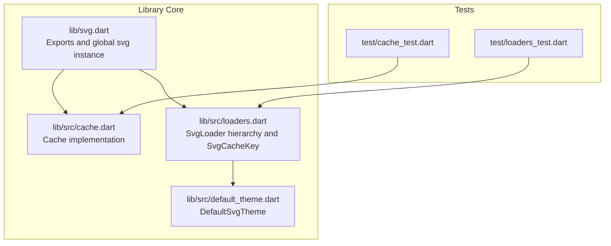
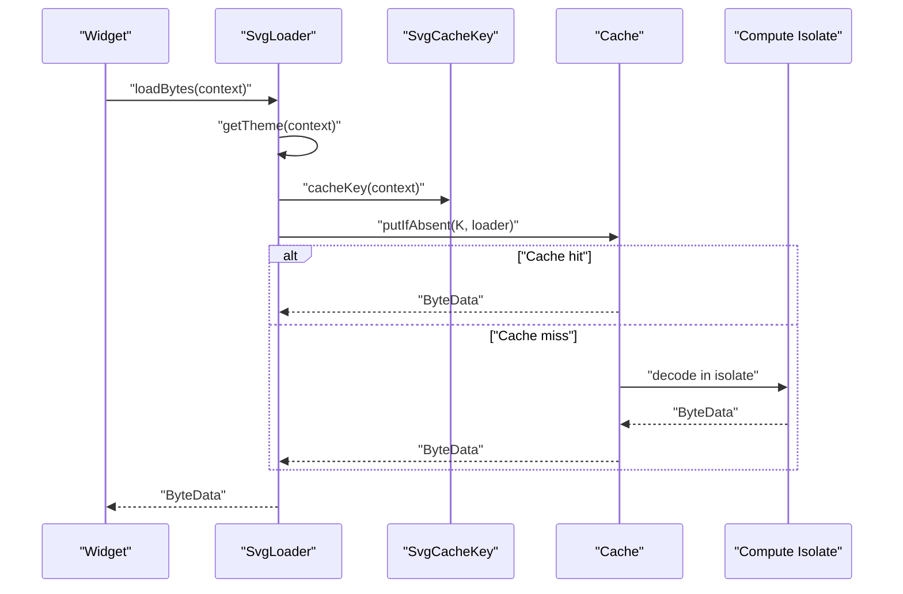
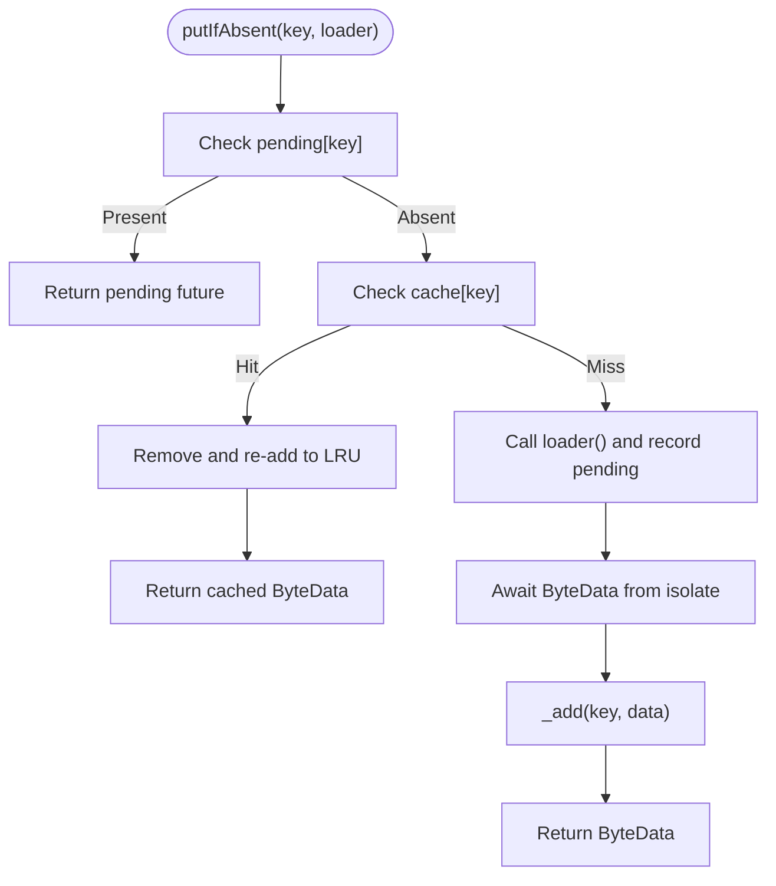
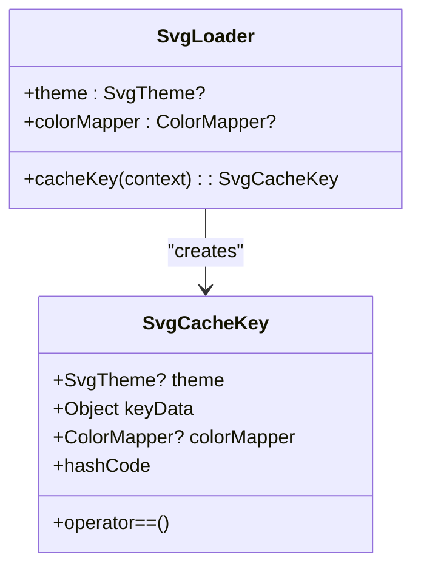
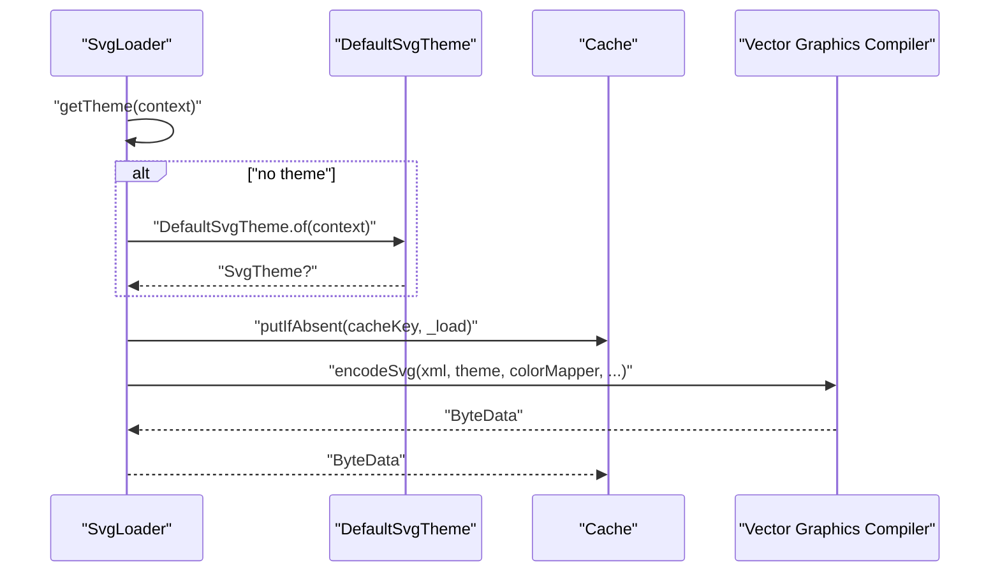
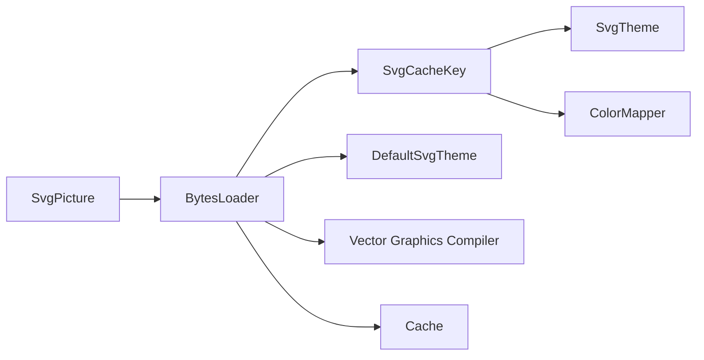

# Cache Integration

<cite>
**Referenced Files in This Document**
- [cache.dart](file://lib/src/cache.dart)
- [loaders.dart](file://lib/src/loaders.dart)
- [svg.dart](file://lib/svg.dart)
- [default_theme.dart](file://lib/src/default_theme.dart)
- [cache_test.dart](file://test/cache_test.dart)
- [loaders_test.dart](file://test/loaders_test.dart)
</cite>

## Table of Contents
1. [Introduction](#introduction)
2. [Project Structure](#project-structure)
3. [Core Components](#core-components)
4. [Architecture Overview](#architecture-overview)
5. [Detailed Component Analysis](#detailed-component-analysis)
6. [Dependency Analysis](#dependency-analysis)
7. [Performance Considerations](#performance-considerations)
8. [Troubleshooting Guide](#troubleshooting-guide)
9. [Conclusion](#conclusion)
10. [Appendices](#appendices)

## Introduction
This document explains the caching system integration with loading strategies in the SVG rendering pipeline. It focuses on how cache keys are constructed to incorporate theme, color mapper, and loader-specific data, how the LRU cache behaves, and how to configure, monitor, and tune cache behavior for optimal performance. It also covers invalidation scenarios, memory pressure handling, and debugging techniques.

## Project Structure
The caching and loading logic resides in the core library module:
- Cache implementation and public API surface
- Loader abstractions and cache key generation
- Global SVG utility exposing the cache instance
- Default theme mechanism influencing cache keys
- Tests validating cache behavior and loader keying

**Diagram sources**
- [svg.dart:26-45](file://lib/svg.dart#L26-L45)
- [cache.dart:5-110](file://lib/src/cache.dart#L5-L110)
- [loaders.dart:121-230](file://lib/src/loaders.dart#L121-L230)
- [default_theme.dart:7-35](file://lib/src/default_theme.dart#L7-L35)
- [cache_test.dart:1-133](file://test/cache_test.dart#L1-L133)
- [loaders_test.dart:10-185](file://test/loaders_test.dart#L10-L185)

**Section sources**
- [svg.dart:26-45](file://lib/svg.dart#L26-L45)
- [cache.dart:5-110](file://lib/src/cache.dart#L5-L110)
- [loaders.dart:121-230](file://lib/src/loaders.dart#L121-L230)
- [default_theme.dart:7-35](file://lib/src/default_theme.dart#L7-L35)
- [cache_test.dart:1-133](file://test/cache_test.dart#L1-L133)
- [loaders_test.dart:10-185](file://test/loaders_test.dart#L10-L185)

## Core Components
- Cache: Thread-safe LRU cache keyed by SvgCacheKey, supporting maximum size, eviction, and clearing.
- SvgCacheKey: Immutable composite key including theme, color mapper, and loader-specific data.
- SvgLoader: Base loader abstraction that computes cache keys and delegates decoding to isolates.
- DefaultSvgTheme: Supplies default theme values used by loaders when none is explicitly provided.

Key responsibilities:
- Cache ensures only one in-flight load per key via a pending map and maintains LRU order by reinsertion.
- SvgCacheKey equality and hashing include theme and color mapper, ensuring separate cache entries for different visual configurations.
- SvgLoader integrates with Cache via cacheKey and loadBytes, invoking compute for decoding.

**Section sources**
- [cache.dart:5-110](file://lib/src/cache.dart#L5-L110)
- [loaders.dart:121-230](file://lib/src/loaders.dart#L121-L230)
- [loaders.dart:182-194](file://lib/src/loaders.dart#L182-L194)
- [default_theme.dart:7-35](file://lib/src/default_theme.dart#L7-L35)

## Architecture Overview
The cache sits between widgets and loaders. Widgets request decoded bytes via BytesLoader.loadBytes, which delegates to the global svg.cache. The cache resolves a key from SvgLoader.cacheKey and either returns a cached ByteData or triggers a loader that performs decoding in an isolate.

**Diagram sources**
- [loaders.dart:182-194](file://lib/src/loaders.dart#L182-L194)
- [loaders.dart:190-193](file://lib/src/loaders.dart#L190-L193)
- [cache.dart:65-93](file://lib/src/cache.dart#L65-L93)
- [svg.dart:44](file://lib/svg.dart#L44)

## Detailed Component Analysis

### Cache: LRU, Pending Loads, and Evictions
- Data structures:
  - Pending map tracks in-flight loads per key to deduplicate work.
  - Cache map holds decoded ByteData keyed by SvgCacheKey.
- Behavior:
  - putIfAbsent returns existing cached ByteData synchronously if present, updating LRU position.
  - If absent, starts a loader, records it in pending, and upon completion adds to cache respecting maximum size.
  - Eviction removes the least-recently-used entry when capacity is exceeded.
- Thread-safety:
  - The implementation uses Dart Futures and synchronous returns to avoid shared mutable state races during cache insertion.
  - Pending map prevents concurrent duplicate loads for the same key.
- Exposed controls:
  - maximumSize getter/setter adjusts capacity and prunes immediately if reduced.
  - clear removes all entries.
  - evict removes a specific key.
  - maybeEvict allows theme-based invalidation hooks.

**Diagram sources**
- [cache.dart:65-93](file://lib/src/cache.dart#L65-L93)
- [cache.dart:95-106](file://lib/src/cache.dart#L95-L106)

**Section sources**
- [cache.dart:5-110](file://lib/src/cache.dart#L5-L110)
- [cache_test.dart:32-72](file://test/cache_test.dart#L32-L72)
- [cache_test.dart:74-103](file://test/cache_test.dart#L74-L103)
- [cache_test.dart:105-131](file://test/cache_test.dart#L105-L131)

### SvgCacheKey: Theme, Color Mapper, and Loader-Specific Data
- Composition:
  - theme: SvgTheme influences currentColor and font metrics; included in key to prevent cross-contamination.
  - colorMapper: ColorMapper defines color substitutions; included to ensure distinct caches for different mappers.
  - keyData: Typically the loader instance itself, capturing loader-specific parameters (e.g., asset name, file path, URL).
- Equality and hashing:
  - Uses Object.hash on theme, keyData, and colorMapper to ensure consistent identity.
- Asset loader special case:
  - For asset loaders, keyData includes resolved bundle and package info to differentiate assets from different bundles.

**Diagram sources**
- [loaders.dart:201-230](file://lib/src/loaders.dart#L201-L230)
- [loaders.dart:190-193](file://lib/src/loaders.dart#L190-L193)

**Section sources**
- [loaders.dart:201-230](file://lib/src/loaders.dart#L201-L230)
- [loaders.dart:383-395](file://lib/src/loaders.dart#L383-L395)
- [loaders_test.dart:138-156](file://test/loaders_test.dart#L138-L156)

### SvgLoader: Integration with Cache and Isolate Decoding
- Provides:
  - getTheme(context) resolves SvgTheme from explicit theme, DefaultSvgTheme, or default.
  - cacheKey(context) constructs SvgCacheKey using theme, colorMapper, and loader-specific data.
  - loadBytes(context) delegates to svg.cache.putIfAbsent with a loader that decodes in an isolate.
- ColorMapper delegation:
  - Wraps user-defined ColorMapper into a delegate compatible with vector graphics compiler.

**Diagram sources**
- [loaders.dart:143-154](file://lib/src/loaders.dart#L143-L154)
- [loaders.dart:182-194](file://lib/src/loaders.dart#L182-L194)
- [loaders.dart:156-180](file://lib/src/loaders.dart#L156-L180)
- [default_theme.dart:22-29](file://lib/src/default_theme.dart#L22-L29)

**Section sources**
- [loaders.dart:143-154](file://lib/src/loaders.dart#L143-L154)
- [loaders.dart:182-194](file://lib/src/loaders.dart#L182-L194)
- [loaders.dart:156-180](file://lib/src/loaders.dart#L156-L180)
- [default_theme.dart:22-29](file://lib/src/default_theme.dart#L22-L29)

### DefaultSvgTheme: Influence on Cache Keys
- DefaultSvgTheme supplies a default SvgTheme to descendant SvgPicture widgets.
- Since SvgCacheKey includes theme, changing the default theme changes the cache key and thus invalidates or requires eviction of existing entries.

**Section sources**
- [default_theme.dart:7-35](file://lib/src/default_theme.dart#L7-L35)
- [loaders.dart:190-193](file://lib/src/loaders.dart#L190-L193)

## Dependency Analysis
- SvgPicture depends on BytesLoader implementations (e.g., SvgAssetLoader, SvgNetworkLoader).
- BytesLoader instances depend on SvgCacheKey and SvgTheme.
- SvgCacheKey depends on SvgTheme and ColorMapper.
- Cache depends on SvgCacheKey for identity and eviction decisions.

**Diagram sources**
- [svg.dart:57-627](file://lib/svg.dart#L57-L627)
- [loaders.dart:121-230](file://lib/src/loaders.dart#L121-L230)
- [loaders.dart:190-193](file://lib/src/loaders.dart#L190-L193)
- [cache.dart:65-93](file://lib/src/cache.dart#L65-L93)

**Section sources**
- [svg.dart:57-627](file://lib/svg.dart#L57-L627)
- [loaders.dart:121-230](file://lib/src/loaders.dart#L121-L230)
- [cache.dart:65-93](file://lib/src/cache.dart#L65-L93)

## Performance Considerations
- Cache sizing:
  - Tune maximumSize to balance memory usage and hit rate. Larger sizes reduce misses but increase memory footprint.
  - Use cache_test patterns to measure hit rates under realistic workloads.
- Loader concurrency:
  - putIfAbsent avoids awaiting unnecessarily, reducing event loop churn and enabling efficient batching of loads.
- Isolate decoding:
  - Decoding runs in isolates to keep UI responsive; ensure loaders reuse the same theme and color mapper to maximize cache hits.
- LRU behavior:
  - Frequent re-access promotes items to MRU; infrequent items are evicted first.

[No sources needed since this section provides general guidance]

## Troubleshooting Guide
Common issues and resolutions:
- Unexpected cache misses after theme changes:
  - Cause: SvgCacheKey includes theme; different themes produce different keys.
  - Resolution: Accept that entries are separated by theme; consider resetting cache or using maybeEvict when appropriate.
- Duplicate loads for the same asset:
  - Cause: Missing pending map usage or incorrect key construction.
  - Resolution: Ensure loaders call loadBytes via svg.cache.putIfAbsent and construct cacheKey consistently.
- Memory growth over time:
  - Cause: Cache maximumSize not tuned or frequent asset bundle updates.
  - Resolution: Lower maximumSize, periodically clear cache, or evict selectively with evict.
- Debugging cache effectiveness:
  - Use cache.count to monitor current size and correlate with perceived performance.
  - Observe behavior under cache_test patterns to validate LRU and eviction.

**Section sources**
- [cache_test.dart:32-72](file://test/cache_test.dart#L32-L72)
- [cache_test.dart:105-131](file://test/cache_test.dart#L105-L131)
- [loaders_test.dart:16-36](file://test/loaders_test.dart#L16-L36)

## Conclusion
The caching system integrates tightly with loading strategies by constructing cache keys that encode theme, color mapper, and loader-specific data. The LRU Cache ensures efficient memory usage while minimizing redundant decoding. By tuning maximumSize, leveraging maybeEvict for theme changes, and monitoring cache.count, developers can achieve predictable performance and memory behavior across diverse usage patterns.

[No sources needed since this section summarizes without analyzing specific files]

## Appendices

### Cache Configuration Examples
- Set maximum cache size:
  - Access the global cache via the exported svg instance and adjust maximumSize.
- Clear cache:
  - Call clear to drop all entries; useful after asset bundle updates.
- Evict specific keys:
  - Use evict(key) to remove a single entry.
- Theme-based invalidation:
  - Use maybeEvict(key, oldTheme, newTheme) to remove incompatible entries.

**Section sources**
- [svg.dart:44](file://lib/svg.dart#L44)
- [cache.dart:13-36](file://lib/src/cache.dart#L13-L36)
- [cache.dart:42-49](file://lib/src/cache.dart#L42-L49)
- [cache.dart:56-58](file://lib/src/cache.dart#L56-L58)

### Manual Cache Control Patterns
- Pre-warming:
  - Trigger loadBytes for frequently used assets to populate cache before user interaction.
- Conditional eviction:
  - Evict entries when switching themes or color schemes to ensure correctness.
- Monitoring:
  - Track cache.count and observe hit/miss characteristics under representative workloads.

**Section sources**
- [cache_test.dart:8-30](file://test/cache_test.dart#L8-L30)
- [loaders_test.dart:38-44](file://test/loaders_test.dart#L38-L44)

### Performance Optimization Techniques
- Keep theme and color mapper constant across repeated loads to maximize cache hits.
- Prefer asset loaders with deterministic keyData to avoid unnecessary cache fragmentation.
- Reduce maximumSize for constrained environments; increase for high-throughput scenarios.

**Section sources**
- [loaders.dart:190-193](file://lib/src/loaders.dart#L190-L193)
- [loaders.dart:383-395](file://lib/src/loaders.dart#L383-L395)

### Cache Invalidation Scenarios
- Theme changes:
  - maybeEvict(key, oldTheme, newTheme) removes incompatible entries.
- Asset bundle updates:
  - clear() to force reloading of all assets.
- Color mapper changes:
  - Different ColorMapper produces different keys; loaders_test demonstrates separate cache entries.

**Section sources**
- [cache.dart:56-58](file://lib/src/cache.dart#L56-L58)
- [cache_test.dart:20-29](file://test/cache_test.dart#L20-L29)
- [loaders_test.dart:16-36](file://test/loaders_test.dart#L16-L36)

### Memory Pressure Handling
- Reduce maximumSize dynamically when memory pressure is detected.
- Periodically clear cache to reclaim memory.
- Monitor cache.count and tune based on device capabilities and workload.

**Section sources**
- [cache.dart:13-36](file://lib/src/cache.dart#L13-L36)
- [cache_test.dart:20-29](file://test/cache_test.dart#L20-L29)

### Debugging Cache-Related Issues
- Validate LRU behavior using cache_test patterns for synchronous and asynchronous futures.
- Confirm cache key composition by asserting different themes and color mappers yield separate entries.
- Inspect cache.count to verify expected occupancy and eviction behavior.

**Section sources**
- [cache_test.dart:32-72](file://test/cache_test.dart#L32-L72)
- [cache_test.dart:74-103](file://test/cache_test.dart#L74-L103)
- [loaders_test.dart:16-36](file://test/loaders_test.dart#L16-L36)