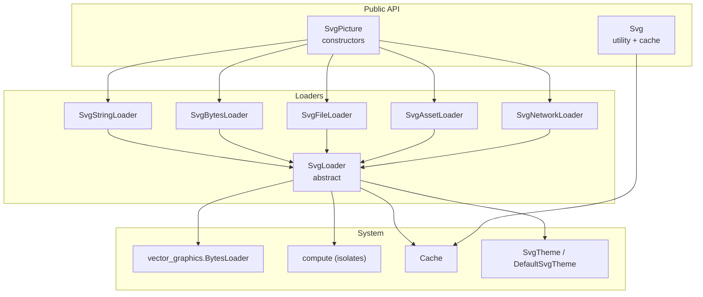
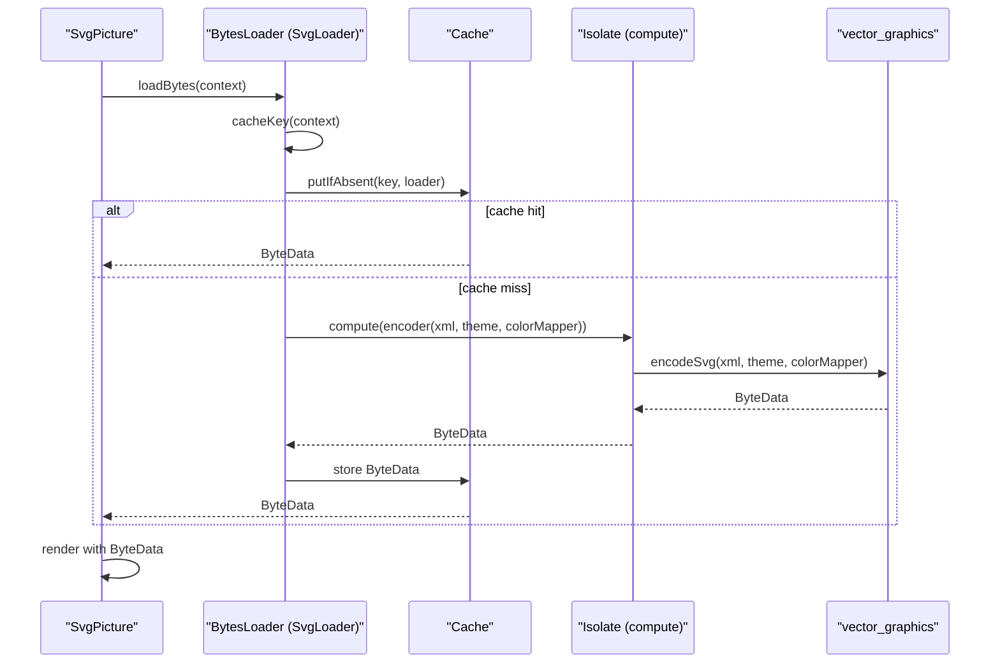
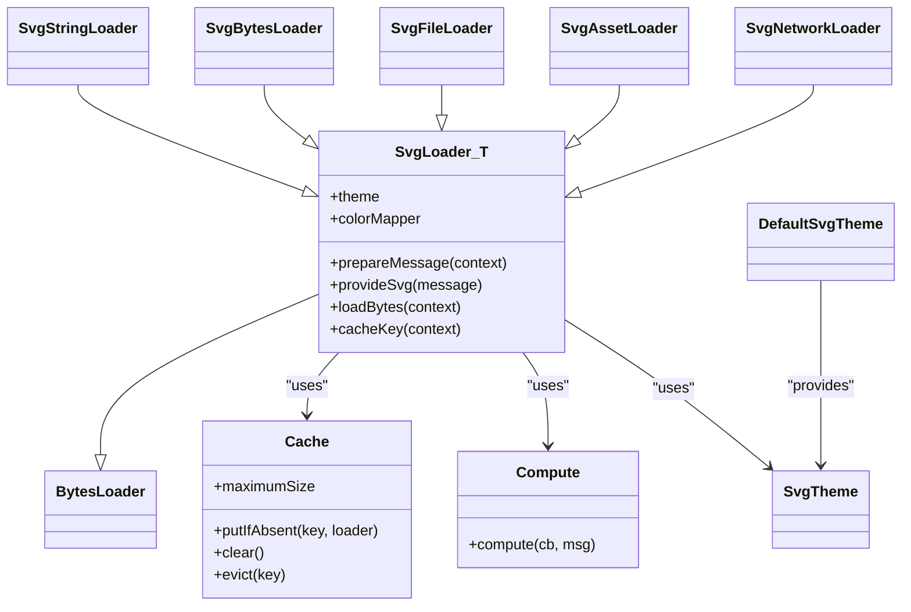

# Custom Loader Implementation

<cite>
**Referenced Files in This Document**
- [svg.dart](file://lib/svg.dart)
- [loaders.dart](file://lib/src/loaders.dart)
- [cache.dart](file://lib/src/cache.dart)
- [compute.dart](file://lib/src/utilities/compute.dart)
- [file.dart](file://lib/src/utilities/file.dart)
- [_file_io.dart](file://lib/src/utilities/_file_io.dart)
- [_file_none.dart](file://lib/src/utilities/_file_none.dart)
- [default_theme.dart](file://lib/src/default_theme.dart)
- [loaders_test.dart](file://test/loaders_test.dart)
</cite>

## Table of Contents
1. [Introduction](#introduction)
2. [Project Structure](#project-structure)
3. [Core Components](#core-components)
4. [Architecture Overview](#architecture-overview)
5. [Detailed Component Analysis](#detailed-component-analysis)
6. [Dependency Analysis](#dependency-analysis)
7. [Performance Considerations](#performance-considerations)
8. [Troubleshooting Guide](#troubleshooting-guide)
9. [Conclusion](#conclusion)
10. [Appendices](#appendices)

## Introduction
This document explains how to implement custom SVG loaders by extending the BytesLoader hierarchy. It covers the abstract base classes, required methods, factory-like constructor patterns used in SvgPicture, registration approaches, and integration with the caching system. It also provides step-by-step examples for creating loaders backed by different data sources, robust error handling, performance and memory considerations, thread-safety requirements, testing strategies, and best practices.

## Project Structure
The loader system centers around the vector_graphics BytesLoader contract and a set of concrete loaders that convert various data sources into a vector_graphics binary representation. The SvgPicture widget composes loaders via dedicated constructors, and the Cache service provides keyed caching of decoded ByteData.

**Diagram sources**
- [svg.dart:57-447](file://lib/svg.dart#L57-L447)
- [loaders.dart:121-466](file://lib/src/loaders.dart#L121-L466)
- [cache.dart:5-111](file://lib/src/cache.dart#L5-L111)
- [compute.dart:22-25](file://lib/src/utilities/compute.dart#L22-L25)
- [default_theme.dart:7-35](file://lib/src/default_theme.dart#L7-L35)

**Section sources**
- [svg.dart:57-447](file://lib/svg.dart#L57-L447)
- [loaders.dart:121-466](file://lib/src/loaders.dart#L121-L466)
- [cache.dart:5-111](file://lib/src/cache.dart#L5-L111)
- [compute.dart:22-25](file://lib/src/utilities/compute.dart#L22-L25)
- [default_theme.dart:7-35](file://lib/src/default_theme.dart#L7-L35)

## Core Components
- BytesLoader contract: The vector_graphics BytesLoader defines the loadBytes(context) method that returns a Future<ByteData>.
- SvgLoader<T>: An abstract extension of BytesLoader that orchestrates work in an isolate, applies SvgTheme and optional ColorMapper, and integrates with the Cache.
- Concrete loaders:
  - SvgStringLoader: loads from a String.
  - SvgBytesLoader: loads from UTF-8 Uint8List.
  - SvgFileLoader: loads from a File.
  - SvgAssetLoader: resolves an AssetBundle and loads from ByteData.
  - SvgNetworkLoader: fetches via http.Client and decodes bodyBytes.
- Cache: Provides keyed caching of ByteData with LRU eviction and pending-key de-duplication.
- Compute: A wrapper that uses compute in production and a test-friendly synchronous path in tests.

Key responsibilities:
- Data acquisition: prepareMessage(context) for loaders that need to fetch data asynchronously (e.g., assets, network).
- Data conversion: provideSvg(...) converts the acquired data into an XML string for the vector_graphics encoder.
- Caching: cacheKey(context) produces a key that includes theme and optional colorMapper to prevent incorrect sharing.
- Isolation: compute(...) runs the heavy work off the UI thread.

**Section sources**
- [loaders.dart:121-194](file://lib/src/loaders.dart#L121-L194)
- [loaders.dart:234-280](file://lib/src/loaders.dart#L234-L280)
- [loaders.dart:284-307](file://lib/src/loaders.dart#L284-L307)
- [loaders.dart:343-413](file://lib/src/loaders.dart#L343-L413)
- [loaders.dart:417-466](file://lib/src/loaders.dart#L417-L466)
- [cache.dart:5-111](file://lib/src/cache.dart#L5-L111)
- [compute.dart:22-25](file://lib/src/utilities/compute.dart#L22-L25)

## Architecture Overview
The SvgPicture widget delegates loading to a BytesLoader. The loader’s loadBytes method is invoked, which:
- Computes a cache key from the loader plus theme and optional colorMapper.
- Delegates to Cache.putIfAbsent to deduplicate concurrent loads and cache results.
- Uses compute(...) to run the vector_graphics encoder in an isolate.
- Returns ByteData to SvgPicture, which renders via vector_graphics.

**Diagram sources**
- [svg.dart:543-560](file://lib/svg.dart#L543-L560)
- [loaders.dart:185-194](file://lib/src/loaders.dart#L185-L194)
- [cache.dart:65-93](file://lib/src/cache.dart#L65-L93)
- [compute.dart:22-25](file://lib/src/utilities/compute.dart#L22-L25)
- [loaders.dart:156-180](file://lib/src/loaders.dart#L156-L180)

## Detailed Component Analysis

### Abstract Base: SvgLoader<T>
SvgLoader<T> extends BytesLoader and adds:
- Theme resolution via getTheme(context) with fallback to DefaultSvgTheme and a default SvgTheme.
- Optional ColorMapper delegation to vector_graphics.
- prepareMessage(context): default no-op; override for loaders needing async data acquisition.
- provideSvg(message): abstract; converts the prepared message to an XML string for encoding.
- loadBytes(context): integrates with Cache.putIfAbsent and compute.
- cacheKey(context): produces SvgCacheKey including theme and optional colorMapper.

Important behaviors:
- compute(...) is used to run the encoder in an isolate.
- The cache key includes theme and colorMapper to avoid cross-theme sharing.
- getTheme(context) falls back to DefaultSvgTheme.of(context) and finally a constant default.

Implementation pattern:
- Override prepareMessage(context) when data must be fetched asynchronously (e.g., asset or network).
- Override provideSvg(...) to convert the prepared data to a UTF-8 string.
- Override cacheKey(context) when the default keying is insufficient (e.g., asset bundle identity).

**Section sources**
- [loaders.dart:121-194](file://lib/src/loaders.dart#L121-L194)
- [loaders.dart:143-154](file://lib/src/loaders.dart#L143-L154)
- [loaders.dart:156-180](file://lib/src/loaders.dart#L156-L180)
- [loaders.dart:185-194](file://lib/src/loaders.dart#L185-L194)

### Concrete Loaders

#### SvgStringLoader
- Data source: String.
- No prepareMessage override; provideSvg returns the stored string.
- Equality and hashing include the string and theme/colorMapper.

Usage pattern:
- Suitable for pre-fetched or embedded SVG strings.

**Section sources**
- [loaders.dart:234-255](file://lib/src/loaders.dart#L234-L255)

#### SvgBytesLoader
- Data source: UTF-8 encoded Uint8List.
- Decodes bytes to string in provideSvg.
- Equality and hashing include bytes and theme/colorMapper.

Usage pattern:
- Ideal for in-memory buffers or decoded network bodies.

**Section sources**
- [loaders.dart:260-280](file://lib/src/loaders.dart#L260-L280)

#### SvgFileLoader
- Data source: File.
- Reads bytes synchronously and decodes to string in provideSvg.
- Equality and hashing include the file and theme/colorMapper.

Notes:
- On the web, a File abstraction is provided; on native platforms, a real File implementation is used.

**Section sources**
- [loaders.dart:284-307](file://lib/src/loaders.dart#L284-L307)
- [file.dart:1](file://lib/src/utilities/file.dart#L1)
- [_file_io.dart](file://lib/src/utilities/_file_io.dart)
- [_file_none.dart](file://lib/src/utilities/_file_none.dart)

#### SvgAssetLoader
- Data source: AssetBundle.
- prepareMessage(context) resolves the correct AssetBundle and loads ByteData.
- cacheKey(context) includes asset name, package, and resolved AssetBundle to handle package scoping.
- provideSvg decodes the ByteData to string.

Integration note:
- Uses DefaultAssetBundle.of(context) when none is provided, ensuring correct package scoping.

**Section sources**
- [loaders.dart:343-413](file://lib/src/loaders.dart#L343-L413)

#### SvgNetworkLoader
- Data source: HTTP GET via http.Client.
- prepareMessage(context) performs the request and returns bodyBytes; closes internal clients.
- provideSvg decodes bodyBytes to string.
- Equality and hashing include URL, headers, theme, and colorMapper.

Thread-safety note:
- Internal client is closed after use; passed clients are not closed by the loader.

**Section sources**
- [loaders.dart:417-466](file://lib/src/loaders.dart#L417-L466)
- [loaders_test.dart:93-124](file://test/loaders_test.dart#L93-L124)

### Factory Pattern in SvgPicture Constructors
SvgPicture exposes convenience constructors that instantiate specific BytesLoader implementations:
- asset -> SvgAssetLoader
- network -> SvgNetworkLoader
- file -> SvgFileLoader
- memory -> SvgBytesLoader
- string -> SvgStringLoader

These constructors pass theme, colorMapper, and other parameters to the respective loader.

Guidance:
- To register a custom loader, construct it directly and pass it to SvgPicture constructor.
- There is no central registry; you compose loaders manually.

**Section sources**
- [svg.dart:180-447](file://lib/svg.dart#L180-L447)

### Creating a Custom Loader: Step-by-Step

1. Choose a base:
   - Extend SvgLoader<T> if you want theme/colorMapper support and caching integration.
   - Extend BytesLoader directly if you need full control over caching and threading.

2. Define the data source:
   - If data needs to be fetched asynchronously, override prepareMessage(context) to return the data needed by provideSvg(...).
   - If data is ready, keep prepareMessage as default and implement provideSvg to convert it to a UTF-8 string.

3. Implement provideSvg:
   - Convert your data to a UTF-8 string representing the SVG XML.

4. Integrate with caching:
   - Keep the default cacheKey(context) unless you need a more specific key.
   - If you override cacheKey(context), include all factors that would change the resulting ByteData (e.g., source identity, theme, colorMapper).

5. Handle threading:
   - Use compute(...) for expensive work (already handled by SvgLoader<T>).
   - Avoid blocking the UI thread; return Futures where appropriate.

6. Register and use:
   - Construct your loader and pass it to SvgPicture constructor.

Example references:
- A minimal custom loader example is demonstrated in tests with a custom SvgLoader subclass and a custom AssetBundle.

**Section sources**
- [loaders_test.dart:138-156](file://test/loaders_test.dart#L138-L156)
- [loaders_test.dart:127-136](file://test/loaders_test.dart#L127-L136)

### Error Handling Patterns
- Network loader closes internal clients and avoids closing externally provided clients.
- Asset loader handles package scoping and buffer offsets correctly.
- For custom loaders, propagate errors from asynchronous sources and ensure cleanup of external resources.

Verification references:
- Network client lifecycle tests.

**Section sources**
- [loaders_test.dart:93-124](file://test/loaders_test.dart#L93-L124)

### Integration with the Caching System
- Cache keys include theme and optional colorMapper to prevent incorrect sharing.
- Cache.putIfAbsent deduplicates concurrent loads and stores ByteData with LRU eviction.
- Empty cache size disables caching for subsequent loads.

Verification references:
- Cache behavior tests including theme and color mapper invalidation.

**Section sources**
- [loaders_test.dart:16-36](file://test/loaders_test.dart#L16-L36)
- [loaders_test.dart:46-53](file://test/loaders_test.dart#L46-L53)
- [cache.dart:65-110](file://lib/src/cache.dart#L65-L110)

## Dependency Analysis

**Diagram sources**
- [loaders.dart:121-466](file://lib/src/loaders.dart#L121-L466)
- [cache.dart:5-111](file://lib/src/cache.dart#L5-L111)
- [compute.dart:22-25](file://lib/src/utilities/compute.dart#L22-L25)
- [default_theme.dart:7-35](file://lib/src/default_theme.dart#L7-L35)

**Section sources**
- [loaders.dart:121-466](file://lib/src/loaders.dart#L121-L466)
- [cache.dart:5-111](file://lib/src/cache.dart#L5-L111)
- [compute.dart:22-25](file://lib/src/utilities/compute.dart#L22-L25)
- [default_theme.dart:7-35](file://lib/src/default_theme.dart#L7-L35)

## Performance Considerations
- Off-main-thread work: compute(...) runs the vector_graphics encoder in an isolate; keep UI thread free.
- Caching: Cache.putIfAbsent prevents duplicate work and reduces memory churn; tune maximumSize appropriately.
- Memory: Prefer streaming or minimal intermediate copies; avoid retaining large ByteBuffers unnecessarily.
- Threading: Ensure thread-safe access to shared resources; avoid mutating shared state inside compute callbacks.
- LRU eviction: When maximumSize is exceeded, the oldest entry is evicted; consider increasing size for frequently reused assets.

[No sources needed since this section provides general guidance]

## Troubleshooting Guide
Common issues and resolutions:
- Incorrect cache hits due to missing theme or colorMapper in cache key:
  - Ensure cacheKey(context) includes theme and colorMapper when they influence output.
- Network loader not closing internal client:
  - Internal clients are closed; if using a custom http.Client, ensure it is managed by the caller.
- Asset bundle package scoping:
  - Use packageName with assetName; SvgAssetLoader resolves the correct bundle.
- Buffer slicing:
  - When working with ByteData slices, verify offsetInBytes and lengthInBytes are correct.

Verification references:
- Tests covering theme and color mapper cache invalidation, asset package scoping, buffer slicing, and network client lifecycle.

**Section sources**
- [loaders_test.dart:16-36](file://test/loaders_test.dart#L16-L36)
- [loaders_test.dart:55-91](file://test/loaders_test.dart#L55-L91)
- [loaders_test.dart:93-124](file://test/loaders_test.dart#L93-L124)

## Conclusion
To implement a custom SVG loader:
- Extend SvgLoader<T> for automatic theme/colorMapper support, caching, and isolate-based encoding.
- Implement prepareMessage(context) and provideSvg(...) to acquire and convert your data source.
- Respect cache keying semantics by including all factors that affect output.
- Follow thread-safety and resource-cleanup best practices, especially for network and file sources.
- Test with realistic scenarios, including cache invalidation, package scoping, and resource lifecycle.

[No sources needed since this section summarizes without analyzing specific files]

## Appendices

### A. Required Methods and Responsibilities
- loadBytes(context): integrate with Cache and return ByteData.
- cacheKey(context): produce a key that uniquely identifies the decoded result.
- prepareMessage(context) [optional]: fetch data asynchronously when needed.
- provideSvg(message): convert prepared data to UTF-8 XML string.

**Section sources**
- [loaders.dart:185-194](file://lib/src/loaders.dart#L185-L194)
- [loaders.dart:137-138](file://lib/src/loaders.dart#L137-L138)
- [loaders.dart:133](file://lib/src/loaders.dart#L133)

### B. Example References
- Minimal custom loader in tests demonstrates a custom SvgLoader subclass and a custom AssetBundle.

**Section sources**
- [loaders_test.dart:138-156](file://test/loaders_test.dart#L138-L156)
- [loaders_test.dart:127-136](file://test/loaders_test.dart#L127-L136)