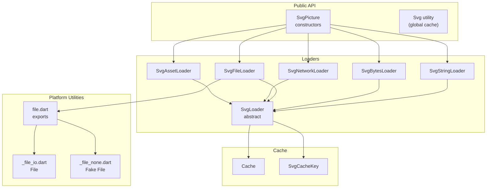
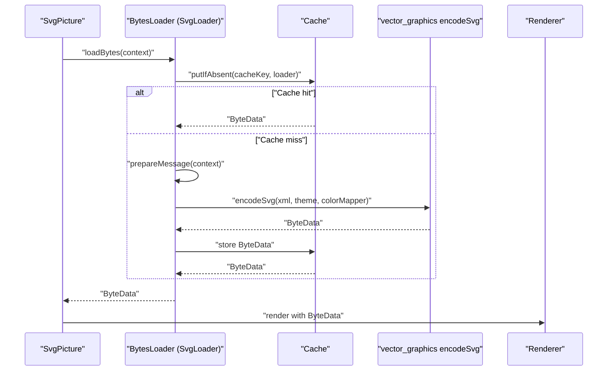
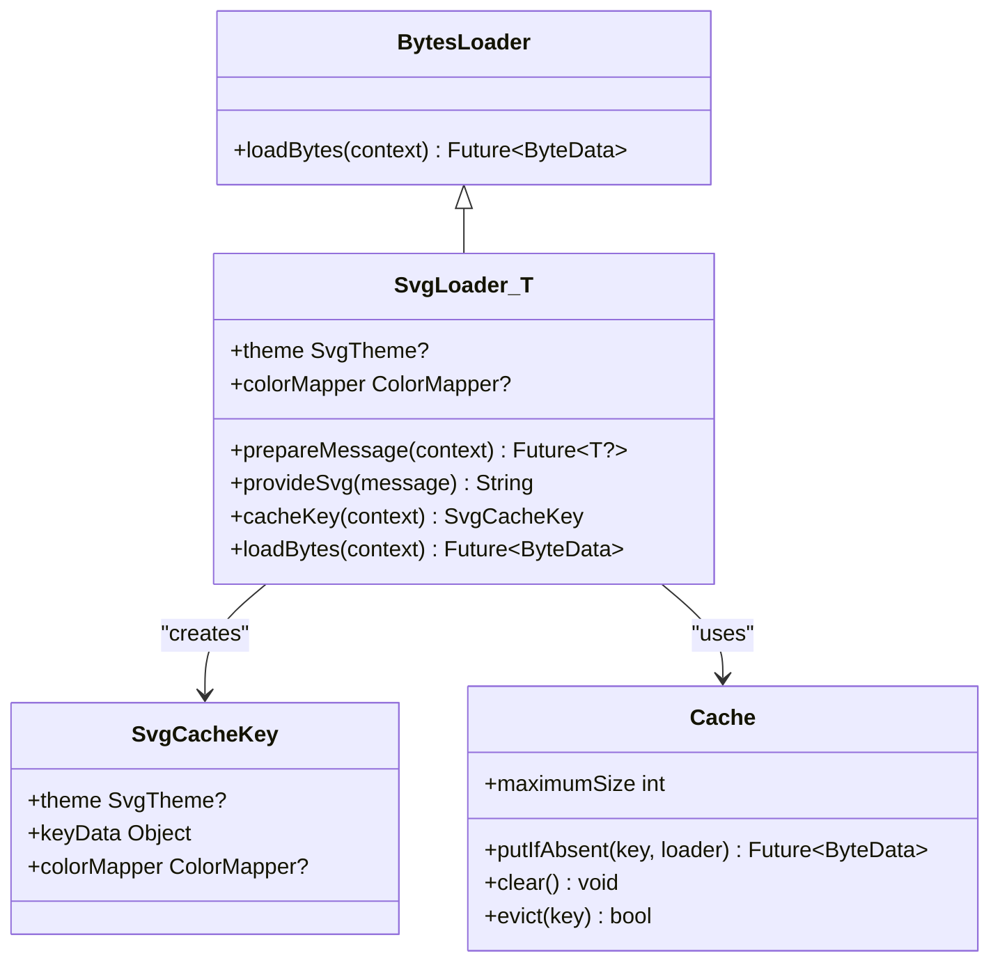
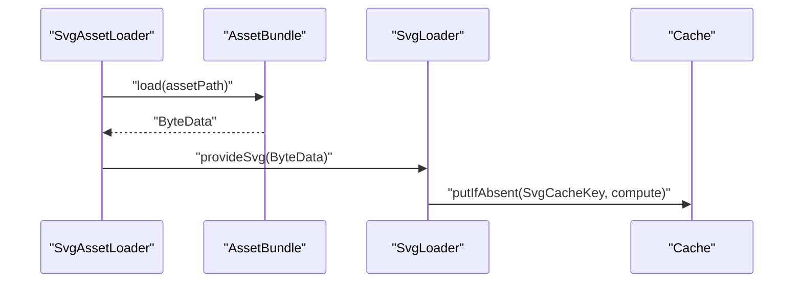
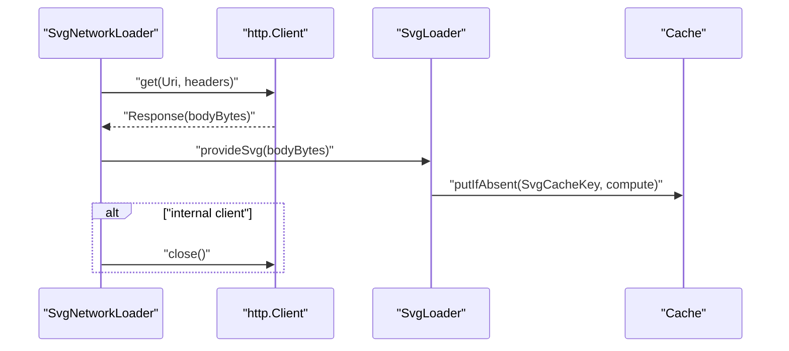
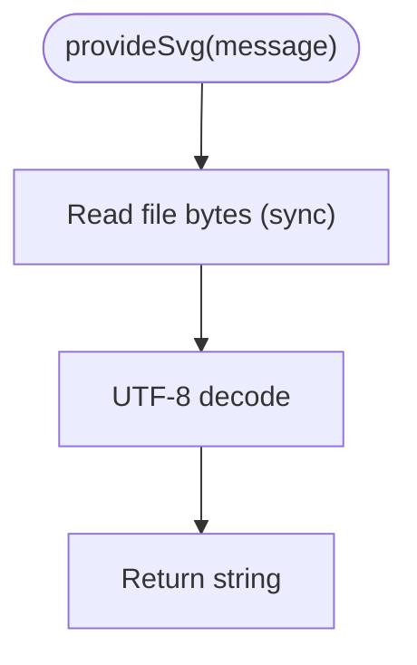
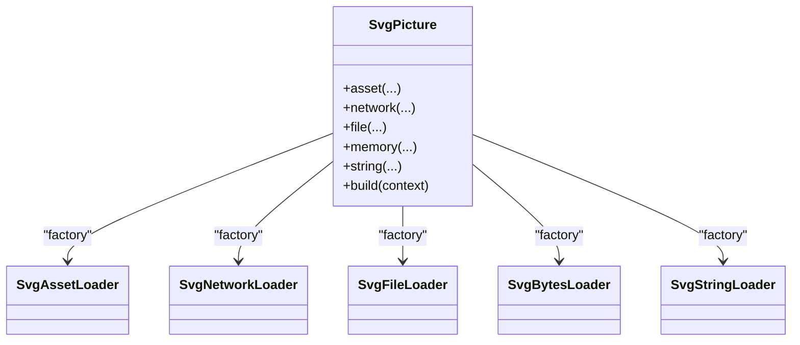
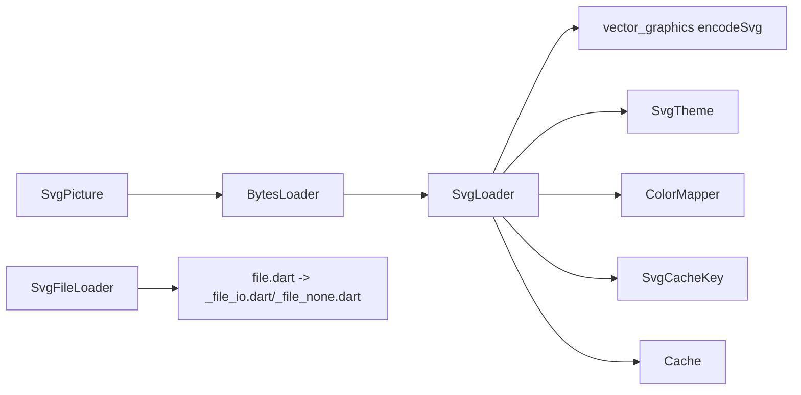

# Loading Strategies

<cite>
**Referenced Files in This Document**
- [svg.dart](file://lib/svg.dart)
- [loaders.dart](file://lib/src/loaders.dart)
- [cache.dart](file://lib/src/cache.dart)
- [file.dart](file://lib/src/utilities/file.dart)
- [_file_io.dart](file://lib/src/utilities/_file_io.dart)
- [_file_none.dart](file://lib/src/utilities/_file_none.dart)
- [loaders_test.dart](file://test/loaders_test.dart)
</cite>

## Table of Contents
1. [Introduction](#introduction)
2. [Project Structure](#project-structure)
3. [Core Components](#core-components)
4. [Architecture Overview](#architecture-overview)
5. [Detailed Component Analysis](#detailed-component-analysis)
6. [Dependency Analysis](#dependency-analysis)
7. [Performance Considerations](#performance-considerations)
8. [Troubleshooting Guide](#troubleshooting-guide)
9. [Conclusion](#conclusion)
10. [Appendices](#appendices)

## Introduction
This document explains the SVG loading strategies implemented via the BytesLoader hierarchy and its concrete loaders. It covers how SvgPicture constructs loaders using a factory-like pattern, how each loader resolves its data source, and how the decoding pipeline works from raw bytes to a vector-graphics binary representation. It also documents caching integration, including cache keys, eviction policies, and memory management, along with performance considerations, platform-specific requirements, and practical examples for extending the system.

## Project Structure
The loading strategy lives primarily in the library’s public API and the internal loader and cache implementations:
- Public API and widget: [svg.dart](file://lib/svg.dart)
- Loader hierarchy and concrete implementations: [loaders.dart](file://lib/src/loaders.dart)
- Cache implementation: [cache.dart](file://lib/src/cache.dart)
- Platform file abstraction: [file.dart](file://lib/src/utilities/file.dart), [_file_io.dart](file://lib/src/utilities/_file_io.dart), [_file_none.dart](file://lib/src/utilities/_file_none.dart)
- Tests validating loader behavior and caching: [loaders_test.dart](file://test/loaders_test.dart)

**Diagram sources**
- [svg.dart:57-447](file://lib/svg.dart#L57-L447)
- [loaders.dart:121-194](file://lib/src/loaders.dart#L121-L194)
- [cache.dart:5-110](file://lib/src/cache.dart#L5-L110)
- [file.dart:1-2](file://lib/src/utilities/file.dart#L1-L2)
- [_file_io.dart:1-2](file://lib/src/utilities/_file_io.dart#L1-L2)
- [_file_none.dart:1-17](file://lib/src/utilities/_file_none.dart#L1-L17)

**Section sources**
- [svg.dart:57-447](file://lib/svg.dart#L57-L447)
- [loaders.dart:121-194](file://lib/src/loaders.dart#L121-L194)
- [cache.dart:5-110](file://lib/src/cache.dart#L5-L110)
- [file.dart:1-2](file://lib/src/utilities/file.dart#L1-L2)
- [_file_io.dart:1-2](file://lib/src/utilities/_file_io.dart#L1-L2)
- [_file_none.dart:1-17](file://lib/src/utilities/_file_none.dart#L1-L17)

## Core Components
- BytesLoader: The base interface for resolving SVG bytes asynchronously. The framework uses this contract to fetch and decode SVG data.
- SvgLoader<T>: An abstract BytesLoader that orchestrates decoding in an isolates and caches the resulting vector-graphics binary data. It integrates with SvgTheme and ColorMapper for consistent rendering.
- Concrete loaders:
  - SvgAssetLoader: Loads from AssetBundle, supports package scoping and asset bundle selection.
  - SvgNetworkLoader: Fetches via HTTP, optionally using a provided http.Client.
  - SvgFileLoader: Reads from a File on disk (platform-aware).
  - SvgBytesLoader: Decodes pre-fetched Uint8List bytes.
  - SvgStringLoader: Parses a raw String SVG.
- Cache: A per-widget global cache keyed by SvgCacheKey, supporting LRU eviction and concurrent requests deduplication.

Key responsibilities:
- Factory pattern in SvgPicture constructors selects the appropriate BytesLoader based on the provided source.
- Each loader prepares a message payload (when applicable), decodes in an isolate, and returns ByteData for downstream rendering.
- Caching ensures repeated loads reuse decoded binaries, with cache keys incorporating theme and color mapper.

**Section sources**
- [svg.dart:57-447](file://lib/svg.dart#L57-L447)
- [loaders.dart:121-194](file://lib/src/loaders.dart#L121-L194)
- [loaders.dart:234-466](file://lib/src/loaders.dart#L234-L466)
- [cache.dart:5-110](file://lib/src/cache.dart#L5-L110)

## Architecture Overview
The loading pipeline follows a consistent flow across all loaders:
1. SvgPicture passes a BytesLoader to the rendering engine.
2. The loader computes a cache key (including theme and optional color mapper).
3. Cache lookup returns a pending or cached ByteData.
4. If absent, the loader prepares a message (e.g., fetching bytes), decodes in an isolate, and stores the result.
5. The rendering engine consumes the ByteData to render the vector graphic.

**Diagram sources**
- [svg.dart:543-560](file://lib/svg.dart#L543-L560)
- [loaders.dart:156-187](file://lib/src/loaders.dart#L156-L187)
- [cache.dart:65-93](file://lib/src/cache.dart#L65-L93)

## Detailed Component Analysis

### Abstract Base: SvgLoader<T>
SvgLoader<T> extends BytesLoader and encapsulates:
- Theme resolution: defaults to a constant theme, with overrides from context and SvgTheme.
- ColorMapper delegation to vector_graphics’ internal mapper.
- Isolate-based decoding via compute, passing a prepared message payload.
- Cache integration via SvgCacheKey and Cache.putIfAbsent.

**Diagram sources**
- [loaders.dart:121-194](file://lib/src/loaders.dart#L121-L194)
- [cache.dart:5-110](file://lib/src/cache.dart#L5-L110)

**Section sources**
- [loaders.dart:121-194](file://lib/src/loaders.dart#L121-L194)

### Concrete Loaders

#### SvgAssetLoader
- Resolves AssetBundle (explicit, DefaultAssetBundle, or rootBundle).
- Loads ByteData for the asset path (supports package scoping).
- Decodes UTF-8 bytes to string for isolate decoding.
- Uses a composite cache key that includes asset name, package, and resolved bundle.

**Diagram sources**
- [loaders.dart:343-413](file://lib/src/loaders.dart#L343-L413)
- [loaders.dart:372-381](file://lib/src/loaders.dart#L372-L381)
- [loaders.dart:384-395](file://lib/src/loaders.dart#L384-L395)

**Section sources**
- [loaders.dart:343-413](file://lib/src/loaders.dart#L343-L413)
- [loaders.dart:372-395](file://lib/src/loaders.dart#L372-L395)

#### SvgNetworkLoader
- Fetches via http.Client (creates its own client unless provided).
- Decodes response body bytes to string for isolate decoding.
- Closes internal clients after use; leaves provided clients open.

**Diagram sources**
- [loaders.dart:417-466](file://lib/src/loaders.dart#L417-L466)
- [loaders_test.dart:93-124](file://test/loaders_test.dart#L93-L124)

**Section sources**
- [loaders.dart:417-466](file://lib/src/loaders.dart#L417-L466)
- [loaders_test.dart:93-124](file://test/loaders_test.dart#L93-L124)

#### SvgFileLoader
- Reads File bytes synchronously in the isolate.
- Decodes to string for vector-graphics encoding.

**Diagram sources**
- [loaders.dart:284-307](file://lib/src/loaders.dart#L284-L307)
- [loaders.dart:292-295](file://lib/src/loaders.dart#L292-L295)
- [file.dart:1-2](file://lib/src/utilities/file.dart#L1-L2)
- [_file_io.dart:1-2](file://lib/src/utilities/_file_io.dart#L1-L2)
- [_file_none.dart:1-17](file://lib/src/utilities/_file_none.dart#L1-L17)

**Section sources**
- [loaders.dart:284-307](file://lib/src/loaders.dart#L284-L307)
- [file.dart:1-2](file://lib/src/utilities/file.dart#L1-L2)
- [_file_io.dart:1-2](file://lib/src/utilities/_file_io.dart#L1-L2)
- [_file_none.dart:1-17](file://lib/src/utilities/_file_none.dart#L1-L17)

#### SvgBytesLoader
- Decodes pre-fetched Uint8List bytes to string for isolate decoding.

**Section sources**
- [loaders.dart:260-280](file://lib/src/loaders.dart#L260-L280)

#### SvgStringLoader
- Passes a raw String SVG to the isolate decoder.

**Section sources**
- [loaders.dart:234-255](file://lib/src/loaders.dart#L234-L255)

### Factory Pattern in SvgPicture Constructors
SvgPicture exposes convenience constructors that construct the appropriate BytesLoader:
- asset → SvgAssetLoader
- network → SvgNetworkLoader
- file → SvgFileLoader
- memory → SvgBytesLoader
- string → SvgStringLoader

These constructors also set up theme, color mapping, and deprecation handling for legacy parameters.

**Diagram sources**
- [svg.dart:180-447](file://lib/svg.dart#L180-L447)

**Section sources**
- [svg.dart:180-447](file://lib/svg.dart#L180-L447)

## Dependency Analysis
- SvgPicture depends on BytesLoader and delegates rendering to a compatibility renderer.
- SvgLoader<T> depends on:
  - vector_graphics encoder for isolate-based decoding.
  - SvgTheme and ColorMapper for consistent rendering.
  - Cache for deduplication and LRU eviction.
- Platform file access is abstracted behind a conditional export, ensuring File availability on native platforms and a compatible interface on the web.

**Diagram sources**
- [svg.dart:543-560](file://lib/svg.dart#L543-L560)
- [loaders.dart:121-194](file://lib/src/loaders.dart#L121-L194)
- [cache.dart:5-110](file://lib/src/cache.dart#L5-L110)
- [file.dart:1-2](file://lib/src/utilities/file.dart#L1-L2)
- [_file_io.dart:1-2](file://lib/src/utilities/_file_io.dart#L1-L2)
- [_file_none.dart:1-17](file://lib/src/utilities/_file_none.dart#L1-L17)

**Section sources**
- [svg.dart:543-560](file://lib/svg.dart#L543-L560)
- [loaders.dart:121-194](file://lib/src/loaders.dart#L121-L194)
- [cache.dart:5-110](file://lib/src/cache.dart#L5-L110)
- [file.dart:1-2](file://lib/src/utilities/file.dart#L1-L2)

## Performance Considerations
- Isolate decoding: All loaders delegate decoding to an isolate via compute, preventing UI jank and enabling parallelism.
- Caching:
  - Cache.putIfAbsent deduplicates concurrent requests and stores ByteData for reuse.
  - LRU eviction policy maintains a bounded maximumSize; clearing or resizing triggers immediate eviction.
  - Cache keys incorporate theme and color mapper to prevent cross-rendering artifacts.
- Network optimization:
  - Internal http.Client is closed after use; provided clients are not closed.
  - Headers support allows efficient caching proxies and CDN usage.
- Memory management:
  - ByteData is stored in-memory; adjust maximumSize to control footprint.
  - Clearing the cache evicts all entries, useful after asset bundle updates.

Practical tips:
- Prefer asset loading for bundled assets to leverage caching and avoid network overhead.
- Use SvgTheme and ColorMapper consistently to maximize cache hits.
- Tune Cache.maximumSize based on device capabilities and usage patterns.

**Section sources**
- [loaders.dart:156-187](file://lib/src/loaders.dart#L156-L187)
- [cache.dart:65-110](file://lib/src/cache.dart#L65-L110)
- [loaders_test.dart:93-124](file://test/loaders_test.dart#L93-L124)

## Troubleshooting Guide
Common issues and resolutions:
- Empty cache: Setting maximumSize to zero disables caching; reset to a positive value to re-enable.
  - Evidence: [loaders_test.dart:46-53](file://test/loaders_test.dart#L46-L53)
- Asset package scoping: Ensure correct package name and asset path; tests verify different packages yield different ByteData lengths.
  - Evidence: [loaders_test.dart:55-68](file://test/loaders_test.dart#L55-L68)
- Buffer slicing correctness: AssetBundle ByteData slices must be handled correctly; tests validate offsets and lengths.
  - Evidence: [loaders_test.dart:70-91](file://test/loaders_test.dart#L70-L91)
- Network client lifecycle: Internal clients are closed; provided clients are not. Verify client ownership expectations.
  - Evidence: [loaders_test.dart:93-124](file://test/loaders_test.dart#L93-L124)
- Theme and color mapper changes: Different SvgTheme or ColorMapper values produce separate cache entries; confirm expected cache counts.
  - Evidence: [loaders_test.dart:16-36](file://test/loaders_test.dart#L16-L36)

**Section sources**
- [loaders_test.dart:46-124](file://test/loaders_test.dart#L46-L124)

## Conclusion
The BytesLoader hierarchy provides a robust, extensible foundation for SVG loading across diverse sources. By centralizing decoding in isolates and integrating a keyed cache, the system achieves strong performance and reliability. The factory pattern in SvgPicture simplifies usage, while platform abstractions ensure portability. Proper configuration of themes, color mappers, and cache sizes yields predictable behavior and optimal resource utilization.

## Appendices

### Practical Examples

- Custom loader implementation outline
  - Extend SvgLoader<T> and implement:
    - prepareMessage(context) to fetch or resolve the payload.
    - provideSvg(message) to convert the payload to a UTF-8 string.
    - cacheKey(context) to define a stable key including theme and color mapper.
  - Reference skeleton implementations:
    - [SvgLoader<T>:121-194](file://lib/src/loaders.dart#L121-L194)
    - [SvgAssetLoader:343-413](file://lib/src/loaders.dart#L343-L413)
    - [SvgNetworkLoader:417-466](file://lib/src/loaders.dart#L417-L466)
    - [SvgFileLoader:284-307](file://lib/src/loaders.dart#L284-L307)
    - [SvgBytesLoader:260-280](file://lib/src/loaders.dart#L260-L280)
    - [SvgStringLoader:234-255](file://lib/src/loaders.dart#L234-L255)

- Advanced caching configuration
  - Adjust Cache.maximumSize to control memory usage.
  - Clear Cache to invalidate stale assets after bundle updates.
  - Evict specific keys when theme or color mapper changes require regeneration.
  - References:
    - [Cache:5-110](file://lib/src/cache.dart#L5-L110)

- Platform-specific requirements
  - File access requires platform-specific implementations; the library exports a platform File abstraction.
  - References:
    - [file.dart:1-2](file://lib/src/utilities/file.dart#L1-L2)
    - [_file_io.dart:1-2](file://lib/src/utilities/_file_io.dart#L1-L2)
    - [_file_none.dart:1-17](file://lib/src/utilities/_file_none.dart#L1-L17)