# Performance Optimization

<cite>
**Referenced Files in This Document**
- [svg.dart](file://lib/svg.dart)
- [cache.dart](file://lib/src/cache.dart)
- [loaders.dart](file://lib/src/loaders.dart)
- [compute.dart](file://lib/src/utilities/compute.dart)
- [default_theme.dart](file://lib/src/default_theme.dart)
- [animated_svg_picture.dart](file://lib/src/animation/animated_svg_picture.dart)
- [animated_svg_painter.dart](file://lib/src/animation/animated_svg_painter.dart)
- [animated_svg_painter_paints.dart](file://lib/src/animation/animated_svg_painter_paints.dart)
- [animated_svg_painter_cache.dart](file://lib/src/animation/animated_svg_painter_cache.dart)
- [animated_svg_painter_types.dart](file://lib/src/animation/animated_svg_painter_types.dart)
- [animated_svg_picture_diagnostics.dart](file://lib/src/animation/animated_svg_picture_diagnostics.dart)
- [svg_parser.dart](file://lib/src/animation/svg_parser.dart)
- [ARCHITECTURE.md](file://ARCHITECTURE.md)
- [ANIMATION_ARCHITECTURE.md](file://docs/archive/ANIMATION_ARCHITECTURE.md)
</cite>

## Update Summary
**Changes Made**
- Enhanced documentation to reflect modular animation architecture with specialized paint passes for FillPaint and StrokePaint distinctions
- Updated cache system documentation to include the new _RenderCache with computed value optimization
- Added comprehensive coverage of the new diagnostics system with SvgTraceEvent and performance metrics
- Improved lifecycle management documentation with optimized resource cleanup strategies
- Enhanced pattern rendering performance section with new cache invalidation strategies
- Updated troubleshooting guide with new diagnostic capabilities

## Table of Contents
1. [Introduction](#introduction)
2. [Project Structure](#project-structure)
3. [Core Components](#core-components)
4. [Architecture Overview](#architecture-overview)
5. [Detailed Component Analysis](#detailed-component-analysis)
6. [Dependency Analysis](#dependency-analysis)
7. [Performance Considerations](#performance-considerations)
8. [Troubleshooting Guide](#troubleshooting-guide)
9. [Conclusion](#conclusion)

## Introduction
This document focuses on performance optimization for SVG rendering in Flutter, with emphasis on memory management, rendering efficiency, and resource utilization. It explains caching strategies, memory allocation patterns, and garbage collection optimization. It documents precompilation techniques, binary format optimization, and vector graphics integration benefits. Practical guidance is provided for performance profiling, memory usage analysis, and optimization techniques for large SVG files. Threading considerations, asynchronous loading patterns, and resource cleanup strategies are covered, along with strategies to identify performance bottlenecks and optimize rendering pipelines across device capabilities.

**Updated** The system now features a modular animation architecture with specialized paint passes for FillPaint and StrokePaint, an enhanced cache system for computed values, and comprehensive diagnostics capabilities for performance monitoring.

## Project Structure
The performance-critical parts of the codebase are organized around:
- Public API and widget integration via the main module exports
- A dedicated cache for decoded vector graphics with detailed statistics
- Loader abstractions that offload parsing to isolates and produce compact binary formats
- Utilities for compute isolation behavior
- Animation pipeline with modular paint passes and specialized rendering
- Advanced diagnostics system for performance monitoring and troubleshooting

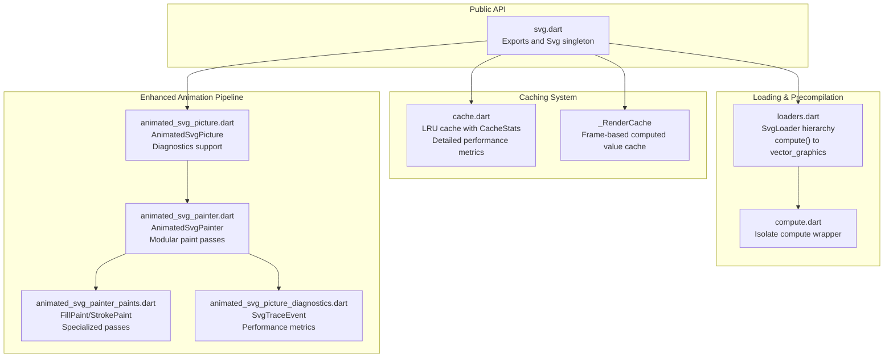

**Diagram sources**
- [svg.dart:1-627](file://lib/svg.dart#L1-L627)
- [cache.dart:1-213](file://lib/src/cache.dart#L1-L213)
- [animated_svg_painter_cache.dart:1-132](file://lib/src/animation/animated_svg_painter_cache.dart#L1-L132)
- [loaders.dart:1-467](file://lib/src/loaders.dart#L1-L467)
- [compute.dart:1-26](file://lib/src/utilities/compute.dart#L1-L26)
- [animated_svg_picture.dart:1-195](file://lib/src/animation/animated_svg_picture.dart#L1-L195)
- [animated_svg_painter.dart:1-191](file://lib/src/animation/animated_svg_painter.dart#L1-L191)
- [animated_svg_painter_paints.dart:1-298](file://lib/src/animation/animated_svg_painter_paints.dart#L1-L298)
- [animated_svg_picture_diagnostics.dart:1-56](file://lib/src/animation/animated_svg_picture_diagnostics.dart#L1-L56)

**Section sources**
- [svg.dart:1-627](file://lib/svg.dart#L1-L627)
- [cache.dart:1-213](file://lib/src/cache.dart#L1-L213)
- [animated_svg_painter_cache.dart:1-132](file://lib/src/animation/animated_svg_painter_cache.dart#L1-L132)
- [loaders.dart:1-467](file://lib/src/loaders.dart#L1-L467)
- [compute.dart:1-26](file://lib/src/utilities/compute.dart#L1-L26)
- [animated_svg_picture.dart:1-195](file://lib/src/animation/animated_svg_picture.dart#L1-L195)
- [animated_svg_painter.dart:1-191](file://lib/src/animation/animated_svg_painter.dart#L1-L191)
- [animated_svg_painter_paints.dart:1-298](file://lib/src/animation/animated_svg_painter_paints.dart#L1-L298)
- [animated_svg_picture_diagnostics.dart:1-56](file://lib/src/animation/animated_svg_picture_diagnostics.dart#L1-L56)

## Core Components
- Global cache for decoded vector graphics: maintains a bounded LRU cache of ByteData with detailed statistics and performance metrics.
- Frame-based render cache: specialized cache for computed render values with automatic invalidation based on animation time.
- Modular paint system: separate paint passes for FillPaint and StrokePaint with optimized shader and image caching.
- Enhanced loader hierarchy: encapsulates data acquisition and delegates heavy work to isolates for parsing and encoding to vector_graphics binary format.
- Compute wrapper: adapts compute behavior for tests and web, ensuring deterministic behavior in automated environments.
- Advanced diagnostics: comprehensive tracing system with structured events and performance metrics for troubleshooting.
- Animation pipeline: preserves DOM and timelines for SMIL/CSS animations, enabling dynamic attribute updates and targeted repainting.

**Section sources**
- [cache.dart:1-213](file://lib/src/cache.dart#L1-L213)
- [animated_svg_painter_cache.dart:1-132](file://lib/src/animation/animated_svg_painter_cache.dart#L1-L132)
- [animated_svg_painter_paints.dart:1-298](file://lib/src/animation/animated_svg_painter_paints.dart#L1-L298)
- [animated_svg_picture_diagnostics.dart:1-56](file://lib/src/animation/animated_svg_picture_diagnostics.dart#L1-L56)
- [loaders.dart:118-194](file://lib/src/loaders.dart#L118-L194)
- [compute.dart:1-26](file://lib/src/utilities/compute.dart#L1-L26)
- [animated_svg_picture.dart:108-164](file://lib/src/animation/animated_svg_picture.dart#L108-L164)
- [animated_svg_painter.dart:42-126](file://lib/src/animation/animated_svg_painter.dart#L42-L126)
- [svg_parser.dart:22-65](file://lib/src/animation/svg_parser.dart#L22-L65)

## Architecture Overview
The system separates concerns between fast-path static rendering and a separate pipeline for animated SVGs. Static SVGs are parsed and compiled to a compact binary format in isolates, cached as ByteData, and rendered efficiently. Animated SVGs are parsed into a DOM tree, timelines are computed, and painting is performed via a CustomPainter with modular paint passes and frame-based cache invalidation.

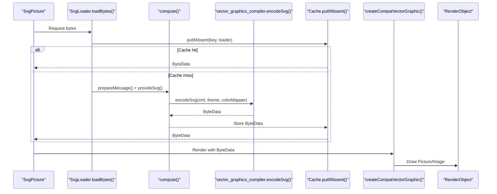

**Diagram sources**
- [loaders.dart:156-187](file://lib/src/loaders.dart#L156-L187)
- [cache.dart:65-93](file://lib/src/cache.dart#L65-L93)
- [svg.dart:542-560](file://lib/svg.dart#L542-L560)

**Section sources**
- [loaders.dart:118-194](file://lib/src/loaders.dart#L118-L194)
- [cache.dart:1-213](file://lib/src/cache.dart#L1-L213)
- [svg.dart:542-560](file://lib/svg.dart#L542-L560)

## Detailed Component Analysis

### Enhanced Caching Strategy and Memory Management
- LRU eviction policy: bounded by maximumSize; least-recently-used entries are evicted when capacity is exceeded.
- Detailed statistics tracking: comprehensive CacheStats with hits, misses, evictions, and pending hits for performance monitoring.
- Pending entries: prevents redundant work when multiple requests target the same key concurrently.
- Theme-aware keys: cache keys include theme and optional color mapper to prevent incorrect reuse across different themes.
- Immediate eviction on theme changes: ensures correctness when theme-dependent color or sizing changes occur.

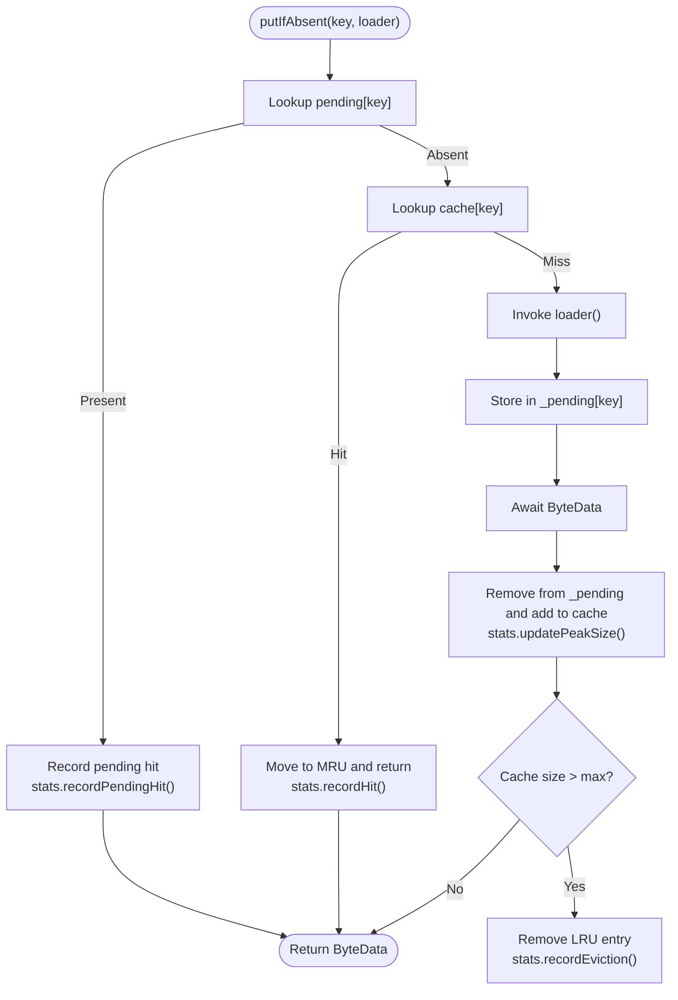

**Diagram sources**
- [cache.dart:156-188](file://lib/src/cache.dart#L156-L188)

**Section sources**
- [cache.dart:1-213](file://lib/src/cache.dart#L1-L213)
- [loaders.dart:196-230](file://lib/src/loaders.dart#L196-L230)

### Frame-Based Render Cache and Computed Value Optimization
**Updated** The system now includes a sophisticated _RenderCache that optimizes computed values across frames:

- Gradient shader caching: stores expensive-to-create shaders keyed by gradient ID, bounds, and attribute hashes
- Pattern image caching: caches rendered pattern images with bounds and tile dimension keys
- Text paragraph caching: optimizes text layout computation with content and style hashing
- Hit-test path caching: reuses computed hit-test geometries for interactive elements
- Mask bounds caching: avoids recomputing mask regions every frame
- Animation-aware invalidation: clears caches that depend on animated values when animation time changes

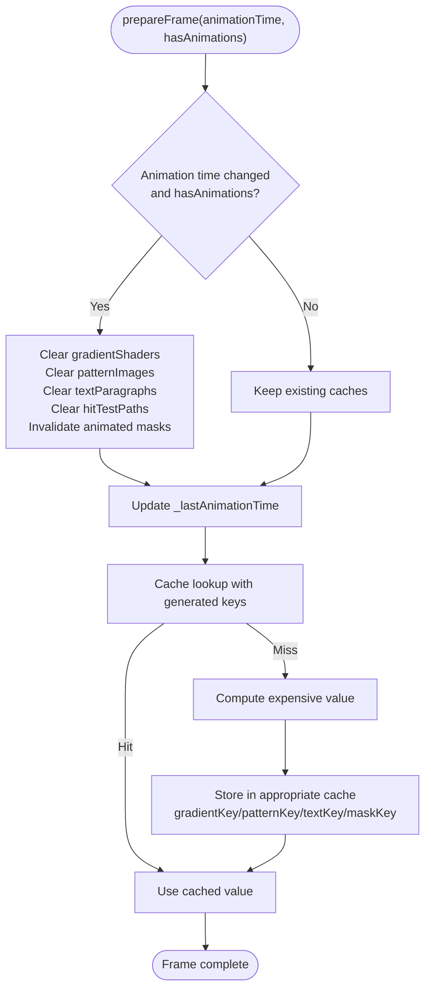

**Diagram sources**
- [animated_svg_painter_cache.dart:32-66](file://lib/src/animation/animated_svg_painter_cache.dart#L32-L66)

**Section sources**
- [animated_svg_painter_cache.dart:1-132](file://lib/src/animation/animated_svg_painter_cache.dart#L1-L132)

### Modular Paint Pass Architecture
**Updated** The animation system now features a modular paint pass architecture with specialized handling for FillPaint and StrokePaint:

- Separate paint creation methods: `_createFillPaint()` and `_createStrokePaint()` for distinct rendering paths
- Pass control flags: `_currentPassPaintFill` and `_currentPassPaintStroke` allow selective rendering passes
- Optimized paint creation: fills and strokes are created independently to minimize unnecessary computations
- Shader and color optimization: gradients and patterns are resolved separately for each pass
- Blend mode inheritance: supports mix-blend-mode CSS property for advanced compositing

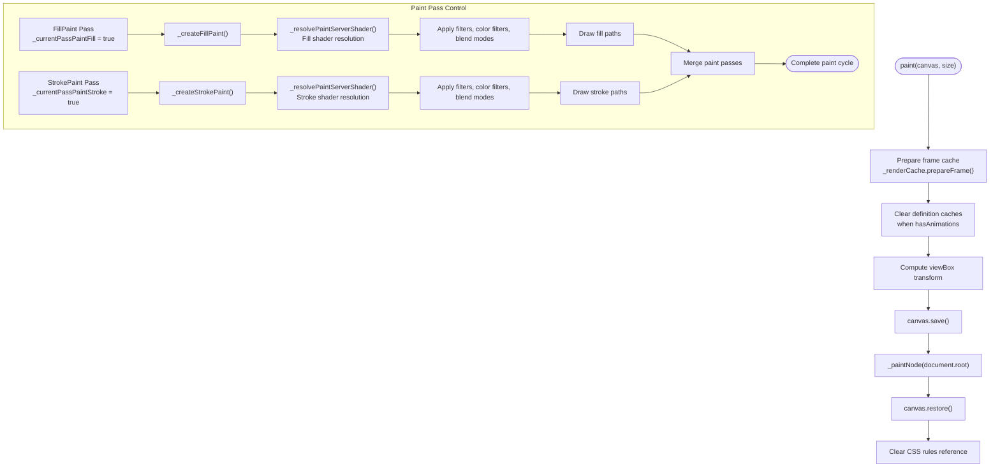

**Diagram sources**
- [animated_svg_painter.dart:110-147](file://lib/src/animation/animated_svg_painter.dart#L110-L147)
- [animated_svg_painter_paints.dart:3-153](file://lib/src/animation/animated_svg_painter_paints.dart#L3-L153)

**Section sources**
- [animated_svg_painter_paints.dart:1-298](file://lib/src/animation/animated_svg_painter_paints.dart#L1-L298)
- [animated_svg_painter.dart:107-121](file://lib/src/animation/animated_svg_painter.dart#L107-L121)

### Precompilation and Binary Format Optimization
- Offloading parsing to isolates: heavy XML parsing and semantic resolution are executed in isolates via compute, keeping the UI thread responsive.
- vector_graphics binary: compiled ByteData reduces memory footprint and accelerates rendering compared to retaining DOM and raw XML.
- Compiler flags: clipping, masking, and overdraw optimizers are disabled in the loader to preserve semantic fidelity for animated content; static pipelines can enable these for performance.

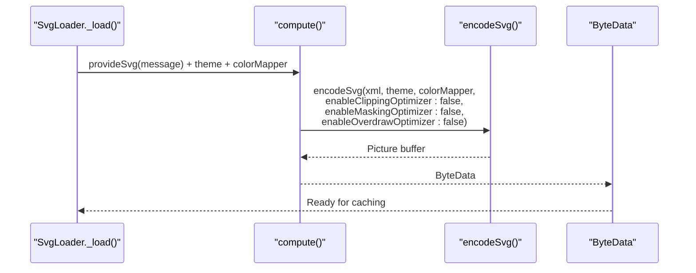

**Diagram sources**
- [loaders.dart:156-180](file://lib/src/loaders.dart#L156-L180)

**Section sources**
- [loaders.dart:118-194](file://lib/src/loaders.dart#L118-L194)

### Threading and Asynchronous Loading Patterns
- Isolate compute: parsing and encoding are delegated to isolates to avoid blocking the UI thread.
- Test/web adaptation: compute wrapper switches to synchronous execution in tests and on web to simplify testing and avoid isolate limitations.
- Network loader lifecycle: manages HTTP client ownership to ensure proper closure and avoid leaks.

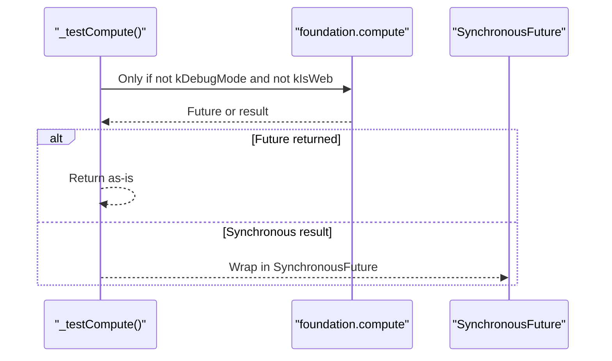

**Diagram sources**
- [compute.dart:5-25](file://lib/src/utilities/compute.dart#L5-L25)

**Section sources**
- [compute.dart:1-26](file://lib/src/utilities/compute.dart#L1-L26)
- [loaders.dart:435-446](file://lib/src/loaders.dart#L435-L446)

### Enhanced Diagnostics and Performance Monitoring
**New** The system now includes comprehensive diagnostics capabilities:

- Structured trace events: SvgTraceEvent with severity levels (debug, info, warning, error)
- Runtime callback system: SvgTraceCallback for real-time performance monitoring
- Category-based logging: events categorized by subsystem (init, event, tick, etc.)
- Error tracking: optional error objects and stack traces for debugging
- Performance metrics: detailed statistics for cache hit rates, eviction counts, and peak sizes

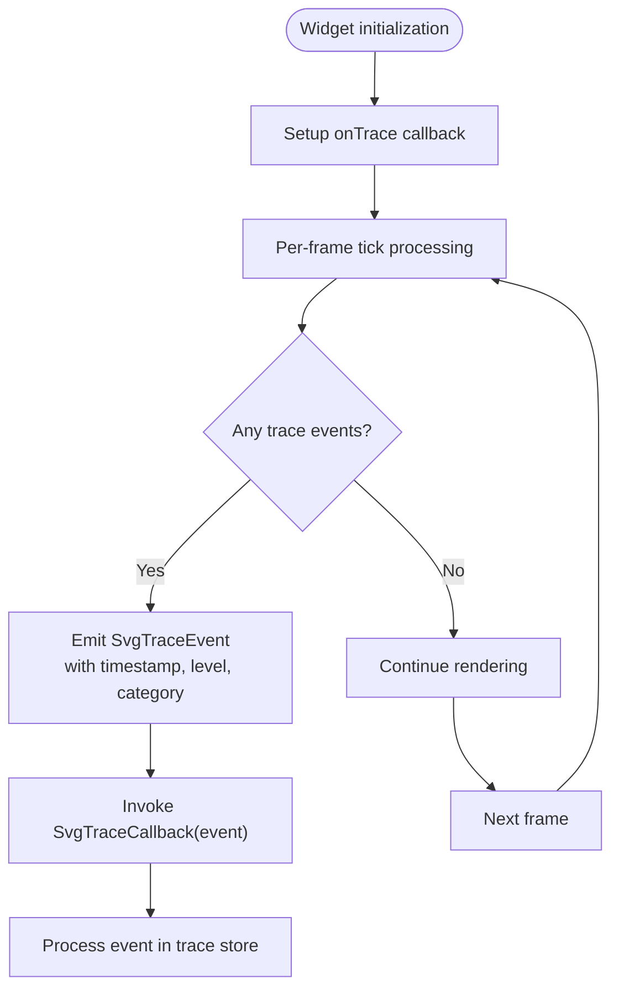

**Diagram sources**
- [animated_svg_picture_diagnostics.dart:18-56](file://lib/src/animation/animated_svg_picture_diagnostics.dart#L18-L56)

**Section sources**
- [animated_svg_picture_diagnostics.dart:1-56](file://lib/src/animation/animated_svg_picture_diagnostics.dart#L1-L56)
- [animated_svg_picture.dart:114-118](file://lib/src/animation/animated_svg_picture.dart#L114-L118)

### Resource Cleanup Strategies
- Animated widget lifecycle: initializes and disposes controllers and listeners appropriately to avoid retained closures and dangling references.
- Image cache management: animated painter maintains a map of images keyed by href; ensure to clear or prune when appropriate to avoid memory growth.
- Cache eviction: leverage evict and maybeEvict to invalidate entries when theme or color mapper changes occur.
- Frame-based cache invalidation: _RenderCache automatically clears caches that depend on animated values when animation time changes.

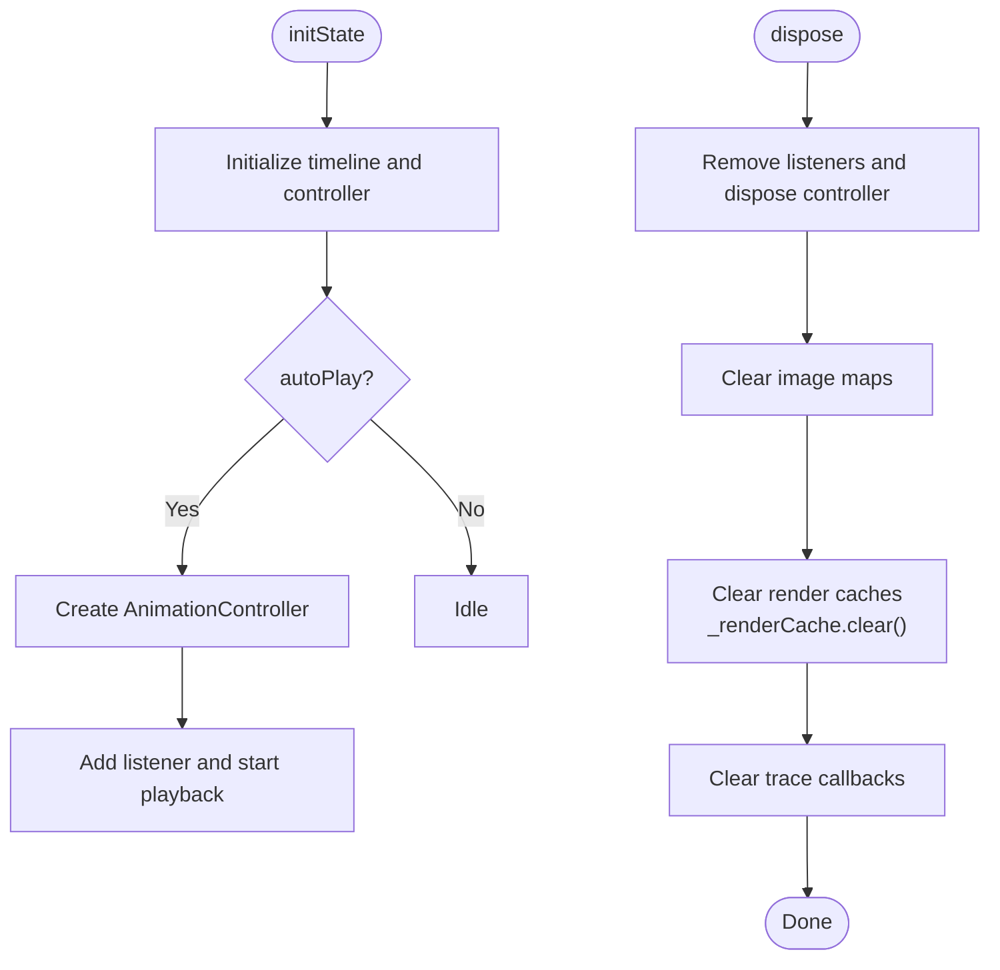

**Diagram sources**
- [animated_svg_picture.dart:178-226](file://lib/src/animation/animated_svg_picture.dart#L178-L226)
- [animated_svg_painter_cache.dart:57-66](file://lib/src/animation/animated_svg_painter_cache.dart#L57-L66)

**Section sources**
- [animated_svg_picture.dart:108-164](file://lib/src/animation/animated_svg_picture.dart#L108-L164)
- [animated_svg_picture.dart:178-226](file://lib/src/animation/animated_svg_picture.dart#L178-L226)
- [animated_svg_painter_cache.dart:57-66](file://lib/src/animation/animated_svg_painter_cache.dart#L57-L66)

### Vector Graphics Integration Benefits
- Compact binary format: reduces memory usage and speeds up rendering compared to retaining DOM and raw XML.
- Platform-optimized rendering: leverages vector_graphics rendering pipeline for efficient GPU/CPU utilization.
- Backward compatibility: public API remains stable while internal pipeline integrates with vector_graphics.

**Section sources**
- [svg.dart:12-18](file://lib/svg.dart#L12-L18)
- [loaders.dart:156-180](file://lib/src/loaders.dart#L156-L180)

### Animation Pipeline and DOM Preservation
- DOM preservation: parser retains element identities, IDs, and hierarchical structure required for SMIL and CSS animations.
- Timeline computation: tracks element lifecycles and priorities for synchronized animation playback.
- Painter-driven updates: CustomPainter repaints only when animation state changes, minimizing overdraw.

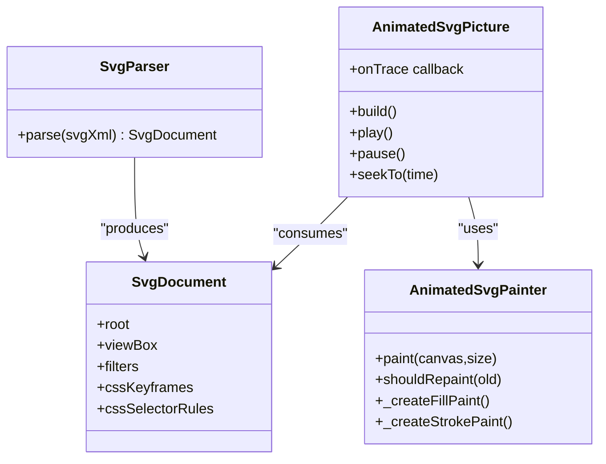

**Diagram sources**
- [svg_parser.dart:22-65](file://lib/src/animation/svg_parser.dart#L22-L65)
- [animated_svg_picture.dart:108-164](file://lib/src/animation/animated_svg_picture.dart#L108-L164)
- [animated_svg_painter.dart:42-126](file://lib/src/animation/animated_svg_painter.dart#L42-L126)

**Section sources**
- [svg_parser.dart:22-65](file://lib/src/animation/svg_parser.dart#L22-L65)
- [animated_svg_picture.dart:108-164](file://lib/src/animation/animated_svg_picture.dart#L108-L164)
- [animated_svg_painter.dart:42-126](file://lib/src/animation/animated_svg_painter.dart#L42-L126)

### Pattern Rendering Performance Optimization

**Updated** The pattern rendering system has been enhanced with improved caching and invalidation strategies:

#### Enhanced Pattern Caching Implementation
The AnimatedSvgPainter now implements an optimized pattern caching mechanism:

- **Render Cache Integration**: Pattern images are cached in `_RenderCache.patternImages` with bounds and tile dimension keys
- **Frame-based Invalidation**: Pattern caches are cleared when animation time changes, ensuring animated patterns are re-rendered
- **Direct Image Caching**: Pattern content is rendered directly to images and cached for subsequent use
- **Bounds-based Keys**: Pattern cache keys include target bounds to prevent reuse across different sizes

#### Pattern Shader Creation Process
The `_createPatternShader` method handles pattern rendering with enhanced caching:

1. **Cache Lookup**: Checks `_RenderCache.patternImages` for existing pattern image
2. **Pattern Resolution**: Retrieves pattern definition from `_patternCache` or resolves new pattern
3. **Tile Calculation**: Computes tile dimensions based on pattern units and target bounds
4. **Content Rendering**: Renders pattern content to a Picture using a PictureRecorder
5. **Image Generation**: Converts Picture to Image using `toImageSync()` with clamped dimensions
6. **Cache Storage**: Stores generated image in `_RenderCache.patternImages` for reuse
7. **Shader Creation**: Creates ImageShader with repeated tiling mode

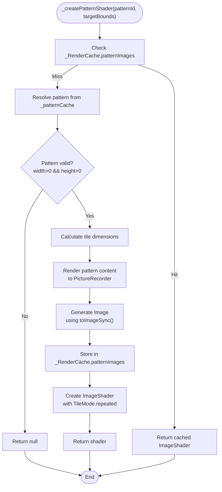

**Diagram sources**
- [animated_svg_painter_paints.dart:105-182](file://lib/src/animation/animated_svg_painter_paints.dart#L105-L182)
- [animated_svg_painter_cache.dart:85-98](file://lib/src/animation/animated_svg_painter_cache.dart#L85-L98)

#### Performance Improvements
The enhanced pattern system provides several performance benefits:

- **Reduced Image Generation**: Cached pattern images eliminate repeated synchronous image generation
- **Bounds-aware Caching**: Prevents pattern reuse across different sizes, ensuring quality while avoiding cache pollution
- **Frame-based Invalidation**: Animated patterns are properly invalidated when animation time changes
- **Memory Efficiency**: Better cache key generation reduces memory fragmentation

**Section sources**
- [animated_svg_painter.dart:63-68](file://lib/src/animation/animated_svg_painter.dart#L63-L68)
- [animated_svg_painter_paints.dart:1-184](file://lib/src/animation/animated_svg_painter_paints.dart#L1-L184)
- [animated_svg_painter_cache.dart:12-13](file://lib/src/animation/animated_svg_painter_cache.dart#L12-L13)

## Dependency Analysis
- Public API depends on cache and loaders for decoding and rendering.
- Loaders depend on vector_graphics compiler and compute utilities.
- Animation pipeline depends on parser, timeline, and painter with modular paint passes.
- Theme propagation influences cache keys and color mapping.
- Diagnostics system integrates with animation pipeline for performance monitoring.

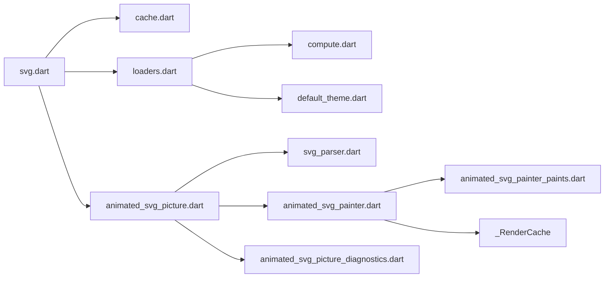

**Diagram sources**
- [svg.dart:1-627](file://lib/svg.dart#L1-L627)
- [cache.dart:1-213](file://lib/src/cache.dart#L1-L213)
- [loaders.dart:1-467](file://lib/src/loaders.dart#L1-L467)
- [compute.dart:1-26](file://lib/src/utilities/compute.dart#L1-L26)
- [default_theme.dart:1-36](file://lib/src/default_theme.dart#L1-L36)
- [animated_svg_picture.dart:1-195](file://lib/src/animation/animated_svg_picture.dart#L1-L195)
- [animated_svg_painter.dart:1-191](file://lib/src/animation/animated_svg_painter.dart#L1-L191)
- [animated_svg_painter_paints.dart:1-298](file://lib/src/animation/animated_svg_painter_paints.dart#L1-L298)
- [animated_svg_painter_cache.dart:1-132](file://lib/src/animation/animated_svg_painter_cache.dart#L1-L132)
- [animated_svg_picture_diagnostics.dart:1-56](file://lib/src/animation/animated_svg_picture_diagnostics.dart#L1-L56)
- [svg_parser.dart:1-65](file://lib/src/animation/svg_parser.dart#L1-L65)

**Section sources**
- [svg.dart:1-627](file://lib/svg.dart#L1-L627)
- [loaders.dart:1-467](file://lib/src/loaders.dart#L1-L467)
- [cache.dart:1-213](file://lib/src/cache.dart#L1-L213)
- [compute.dart:1-26](file://lib/src/utilities/compute.dart#L1-L26)
- [default_theme.dart:1-36](file://lib/src/default_theme.dart#L1-L36)
- [animated_svg_picture.dart:1-195](file://lib/src/animation/animated_svg_picture.dart#L1-L195)
- [animated_svg_painter.dart:1-191](file://lib/src/animation/animated_svg_painter.dart#L1-L191)
- [animated_svg_painter_paints.dart:1-298](file://lib/src/animation/animated_svg_painter_paints.dart#L1-L298)
- [animated_svg_painter_cache.dart:1-132](file://lib/src/animation/animated_svg_painter_cache.dart#L1-L132)
- [animated_svg_picture_diagnostics.dart:1-56](file://lib/src/animation/animated_svg_picture_diagnostics.dart#L1-L56)
- [svg_parser.dart:1-65](file://lib/src/animation/svg_parser.dart#L1-L65)

## Performance Considerations
- Prefer static rendering for non-animated SVGs to leverage the compact binary format and reduce overhead.
- Tune cache size based on memory budgets and typical concurrent assets; use evict and maybeEvict when theme or color mapper changes.
- Use compute for heavy parsing; avoid unnecessary event loop turns by deferring awaits where possible.
- For large SVGs, consider reducing complexity (paths, gradients, filters) and disabling expensive optimizer flags in static pipelines.
- In animations, minimize overdraw by leveraging shouldRepaint and targeted invalidations; avoid excessive nested groups.
- On constrained devices, prefer lower-resolution assets or fewer simultaneous animations; adjust playback rate and disable non-essential effects.
- **Updated** Utilize the new _RenderCache for computed value optimization across frames.
- **Updated** Enable diagnostics with onTrace callback for performance monitoring and troubleshooting.
- **Updated** Leverage modular paint passes to optimize FillPaint and StrokePaint rendering separately.

**Updated** Enhanced performance considerations with new modular architecture:

- **Modular Paint Passes**: Use separate FillPaint and StrokePaint passes to minimize unnecessary computations
- **Frame-based Cache Invalidation**: Take advantage of automatic cache invalidation for animated values
- **Structured Diagnostics**: Implement SvgTraceCallback for real-time performance monitoring
- **Enhanced Pattern Caching**: Benefit from improved pattern image caching with bounds awareness

[No sources needed since this section provides general guidance]

## Troubleshooting Guide
- Symptom: UI stalls during SVG load
  - Cause: Heavy parsing on the UI thread
  - Fix: Ensure loaders use compute; verify compute wrapper behavior in tests and web
  - Related references:
    - [compute.dart:1-26](file://lib/src/utilities/compute.dart#L1-L26)
    - [loaders.dart:156-180](file://lib/src/loaders.dart#L156-L180)

- Symptom: Memory growth with animated SVGs
  - Cause: Retained images or lack of cleanup
  - Fix: Dispose controllers and clear image maps; prune unused gradients
  - Related references:
    - [animated_svg_picture.dart:178-226](file://lib/src/animation/animated_svg_picture.dart#L178-L226)
    - [animated_svg_painter.dart:59-62](file://lib/src/animation/animated_svg_painter.dart#L59-L62)

- Symptom: Incorrect colors after theme changes
  - Cause: Cache reuse across themes
  - Fix: Use maybeEvict or increase cache size to allow separate theme entries
  - Related references:
    - [cache.dart:56-58](file://lib/src/cache.dart#L56-L58)
    - [loaders.dart:196-230](file://lib/src/loaders.dart#L196-L230)
    - [default_theme.dart:1-36](file://lib/src/default_theme.dart#L1-L36)

- Symptom: Large memory footprint for static SVGs
  - Cause: Retaining DOM or raw XML
  - Fix: Use vector_graphics binary pipeline; avoid DOM-preserving parser for static content
  - Related references:
    - [ANIMATION_ARCHITECTURE.md:32-44](file://docs/archive/ANIMATION_ARCHITECTURE.md#L32-L44)
    - [ARCHITECTURE.md:224-234](file://ARCHITECTURE.md#L224-L234)

- Symptom: Slow pattern rendering performance
  - Cause: Complex patterns with high-resolution tiles
  - Fix: Simplify pattern geometry, reduce tile sizes, or consider alternative rendering approaches
  - Related references:
    - [animated_svg_painter_paints.dart:105-182](file://lib/src/animation/animated_svg_painter_paints.dart#L105-L182)

- **Updated** Symptom: Performance monitoring needed
  - Cause: Need for detailed performance metrics and diagnostics
  - Fix: Implement SvgTraceCallback and use SvgTraceEvent for comprehensive monitoring
  - Related references:
    - [animated_svg_picture_diagnostics.dart:18-56](file://lib/src/animation/animated_svg_picture_diagnostics.dart#L18-L56)
    - [animated_svg_picture.dart:114-118](file://lib/src/animation/animated_svg_picture.dart#L114-L118)

- **Updated** Symptom: Inefficient paint pass performance
  - Cause: Both FillPaint and StrokePaint passes running unnecessarily
  - Fix: Use modular paint passes with selective pass control flags
  - Related references:
    - [animated_svg_painter_paints.dart:3-153](file://lib/src/animation/animated_svg_painter_paints.dart#L3-L153)
    - [animated_svg_painter.dart:107-121](file://lib/src/animation/animated_svg_painter.dart#L107-L121)

**Section sources**
- [compute.dart:1-26](file://lib/src/utilities/compute.dart#L1-L26)
- [loaders.dart:156-180](file://lib/src/loaders.dart#L156-L180)
- [animated_svg_picture.dart:178-226](file://lib/src/animation/animated_svg_picture.dart#L178-L226)
- [animated_svg_painter.dart:59-62](file://lib/src/animation/animated_svg_painter.dart#L59-L62)
- [cache.dart:56-58](file://lib/src/cache.dart#L56-L58)
- [default_theme.dart:1-36](file://lib/src/default_theme.dart#L1-L36)
- [ANIMATION_ARCHITECTURE.md:32-44](file://docs/archive/ANIMATION_ARCHITECTURE.md#L32-L44)
- [ARCHITECTURE.md:224-234](file://ARCHITECTURE.md#L224-L234)
- [animated_svg_painter_paints.dart:105-182](file://lib/src/animation/animated_svg_painter_paints.dart#L105-L182)
- [animated_svg_picture_diagnostics.dart:18-56](file://lib/src/animation/animated_svg_picture_diagnostics.dart#L18-L56)
- [animated_svg_picture.dart:114-118](file://lib/src/animation/animated_svg_picture.dart#L114-L118)

## Conclusion
The codebase achieves strong performance by separating static and animated rendering paths, caching decoded binaries, and delegating heavy work to isolates. The enhanced modular animation architecture with specialized paint passes, improved cache system for computed values, and comprehensive diagnostics capabilities provides significant performance improvements. For large or animated SVGs, careful tuning of cache sizes, compute usage, and rendering strategies yields substantial improvements. Preserve DOM only when necessary for animations; otherwise, leverage the vector_graphics binary pipeline for memory and speed. Apply targeted cleanup and lifecycle management to prevent leaks and maintain responsiveness across diverse device capabilities.

**Updated** The enhanced system now features modular paint passes for FillPaint and StrokePaint, sophisticated frame-based cache invalidation, comprehensive diagnostics with structured trace events, and optimized pattern rendering with improved caching strategies. These improvements provide better performance monitoring, more efficient rendering pipelines, and enhanced resource management for complex SVG animations.

[No sources needed since this section summarizes without analyzing specific files]