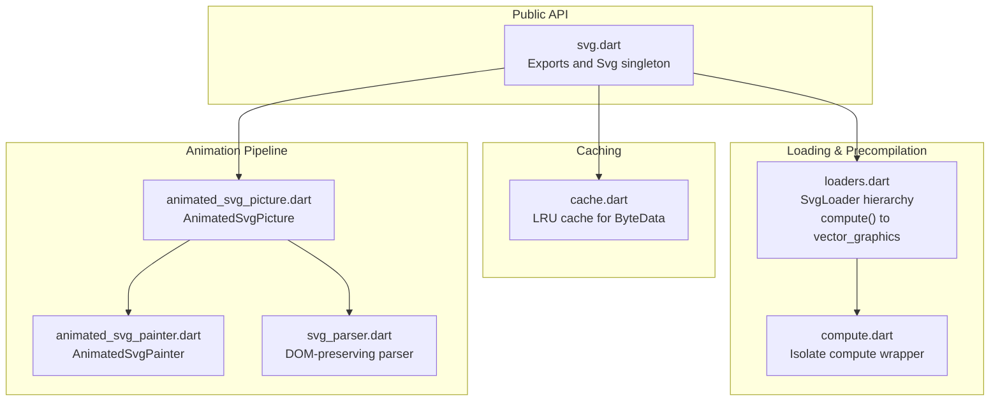
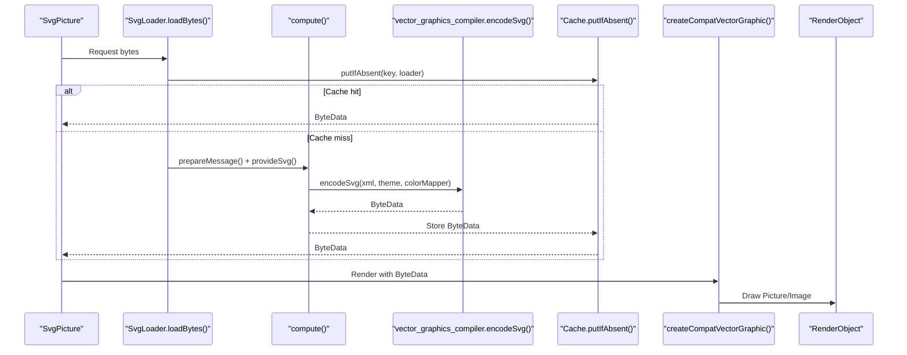
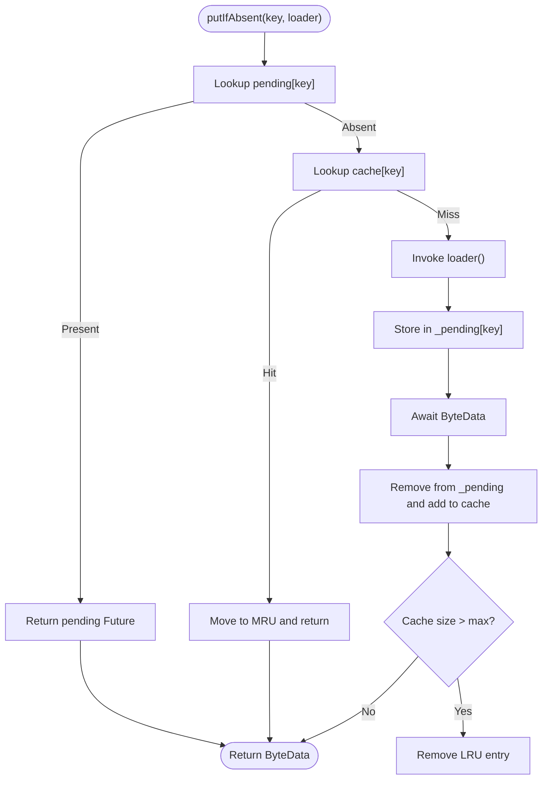
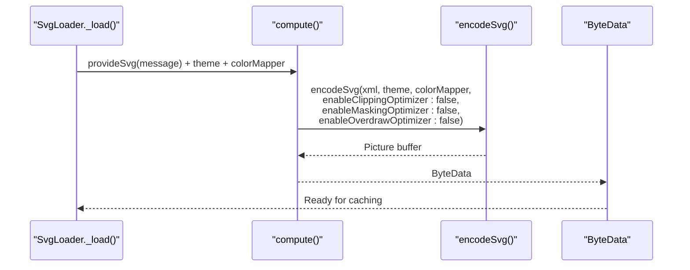
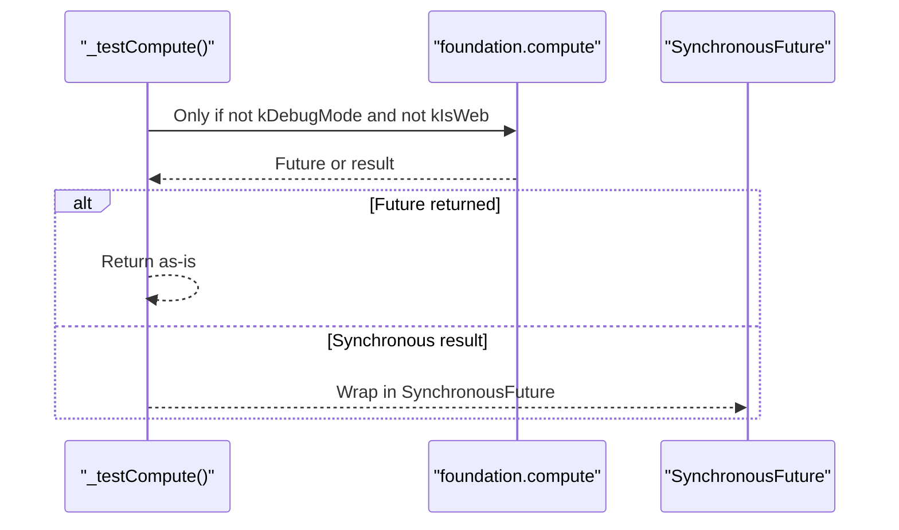
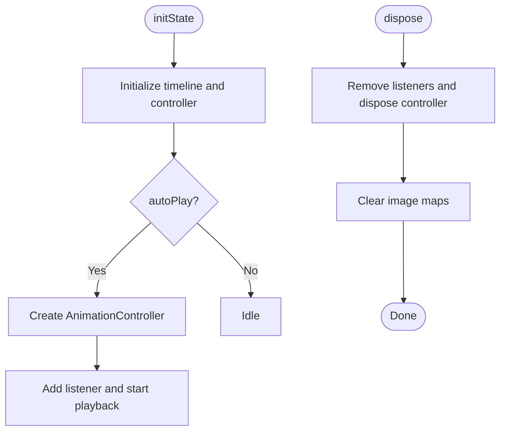
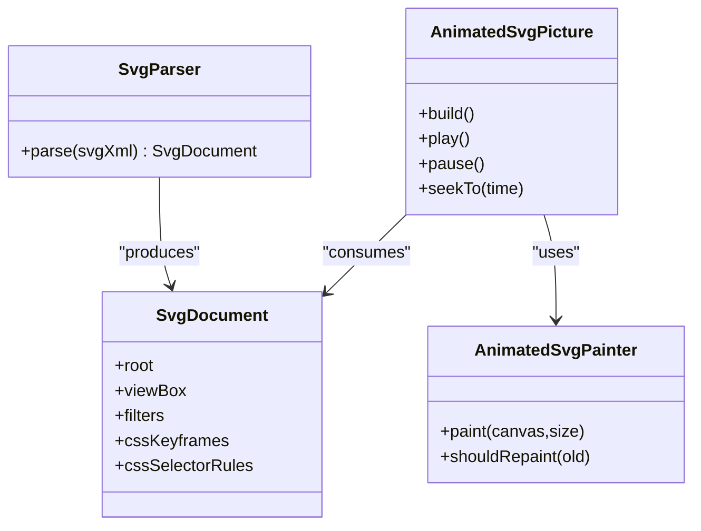
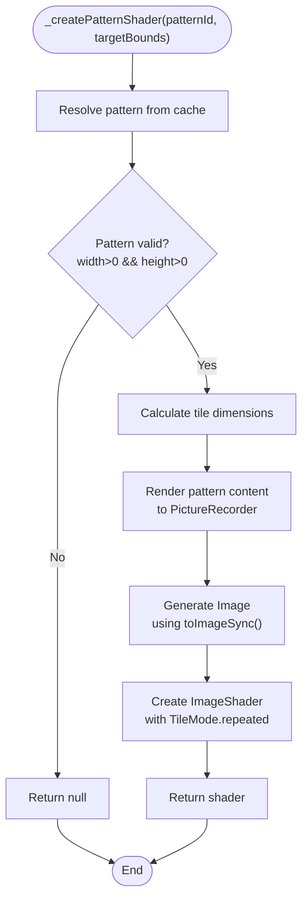
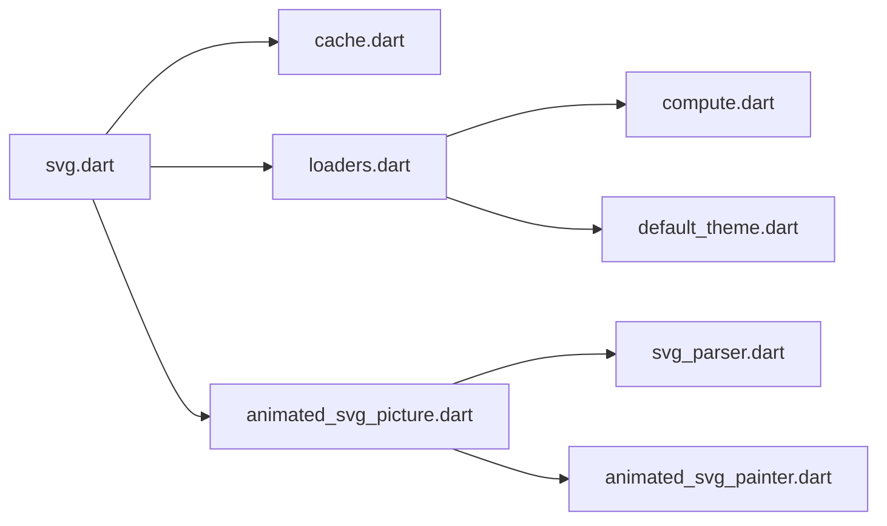

# Performance Optimization

<cite>
**Referenced Files in This Document**
- [svg.dart](file://lib/svg.dart)
- [cache.dart](file://lib/src/cache.dart)
- [loaders.dart](file://lib/src/loaders.dart)
- [compute.dart](file://lib/src/utilities/compute.dart)
- [default_theme.dart](file://lib/src/default_theme.dart)
- [animated_svg_picture.dart](file://lib/src/animation/animated_svg_picture.dart)
- [animated_svg_painter.dart](file://lib/src/animation/animated_svg_painter.dart)
- [animated_svg_painter_patterns.dart](file://lib/src/animation/animated_svg_painter_patterns.dart)
- [svg_parser.dart](file://lib/src/animation/svg_parser.dart)
- [ARCHITECTURE.md](file://ARCHITECTURE.md)
- [ANIMATION_ARCHITECTURE.md](file://docs/archive/ANIMATION_ARCHITECTURE.md)
</cite>

## Update Summary
**Changes Made**
- Added documentation for the removed pattern tile caching optimization
- Updated pattern rendering performance section to reflect current implementation
- Added troubleshooting guidance for pattern performance issues
- Enhanced performance considerations section with pattern-specific recommendations

## Table of Contents
1. [Introduction](#introduction)
2. [Project Structure](#project-structure)
3. [Core Components](#core-components)
4. [Architecture Overview](#architecture-overview)
5. [Detailed Component Analysis](#detailed-component-analysis)
6. [Dependency Analysis](#dependency-analysis)
7. [Performance Considerations](#performance-considerations)
8. [Troubleshooting Guide](#troubleshooting-guide)
9. [Conclusion](#conclusion)

## Introduction
This document focuses on performance optimization for SVG rendering in Flutter, with emphasis on memory management, rendering efficiency, and resource utilization. It explains caching strategies, memory allocation patterns, and garbage collection optimization. It documents precompilation techniques, binary format optimization, and vector graphics integration benefits. Practical guidance is provided for performance profiling, memory usage analysis, and optimization techniques for large SVG files. Threading considerations, asynchronous loading patterns, and resource cleanup strategies are covered, along with strategies to identify performance bottlenecks and optimize rendering pipelines across device capabilities.

## Project Structure
The performance-critical parts of the codebase are organized around:
- Public API and widget integration via the main module exports
- A dedicated cache for decoded vector graphics
- Loader abstractions that offload parsing to isolates and produce compact binary formats
- Utilities for compute isolation behavior
- Animation pipeline that preserves DOM for SMIL/CSS animations
- Parser and painter implementations for animated SVGs

**Diagram sources**
- [svg.dart:1-627](file://lib/svg.dart#L1-L627)
- [cache.dart:1-111](file://lib/src/cache.dart#L1-L111)
- [loaders.dart:1-467](file://lib/src/loaders.dart#L1-L467)
- [compute.dart:1-26](file://lib/src/utilities/compute.dart#L1-L26)
- [animated_svg_picture.dart:1-359](file://lib/src/animation/animated_svg_picture.dart#L1-L359)
- [animated_svg_painter.dart:1-227](file://lib/src/animation/animated_svg_painter.dart#L1-L227)
- [svg_parser.dart:1-65](file://lib/src/animation/svg_parser.dart#L1-L65)

**Section sources**
- [svg.dart:1-627](file://lib/svg.dart#L1-L627)
- [cache.dart:1-111](file://lib/src/cache.dart#L1-L111)
- [loaders.dart:1-467](file://lib/src/loaders.dart#L1-L467)
- [compute.dart:1-26](file://lib/src/utilities/compute.dart#L1-L26)
- [animated_svg_picture.dart:1-359](file://lib/src/animation/animated_svg_picture.dart#L1-L359)
- [animated_svg_painter.dart:1-227](file://lib/src/animation/animated_svg_painter.dart#L1-L227)
- [svg_parser.dart:1-65](file://lib/src/animation/svg_parser.dart#L1-L65)

## Core Components
- Global cache for decoded vector graphics: maintains a bounded LRU cache of ByteData to avoid repeated decoding and compilation.
- Loader hierarchy: encapsulates data acquisition and delegates heavy work to isolates for parsing and encoding to vector_graphics binary format.
- Compute wrapper: adapts compute behavior for tests and web, ensuring deterministic behavior in automated environments.
- Animation pipeline: preserves DOM and timelines for SMIL/CSS animations, enabling dynamic attribute updates and targeted repainting.
- Parser and painter: DOM-preserving parser and painter for animated content, with gradient caches and transform computations.

**Section sources**
- [cache.dart:1-111](file://lib/src/cache.dart#L1-L111)
- [loaders.dart:118-194](file://lib/src/loaders.dart#L118-L194)
- [compute.dart:1-26](file://lib/src/utilities/compute.dart#L1-L26)
- [animated_svg_picture.dart:108-164](file://lib/src/animation/animated_svg_picture.dart#L108-L164)
- [animated_svg_painter.dart:42-126](file://lib/src/animation/animated_svg_painter.dart#L42-L126)
- [svg_parser.dart:22-65](file://lib/src/animation/svg_parser.dart#L22-L65)

## Architecture Overview
The system separates concerns between fast-path static rendering and a separate pipeline for animated SVGs. Static SVGs are parsed and compiled to a compact binary format in isolates, cached as ByteData, and rendered efficiently. Animated SVGs are parsed into a DOM tree, timelines are computed, and painting is performed via a CustomPainter with targeted invalidations.

**Diagram sources**
- [loaders.dart:156-187](file://lib/src/loaders.dart#L156-L187)
- [cache.dart:65-93](file://lib/src/cache.dart#L65-L93)
- [svg.dart:542-560](file://lib/svg.dart#L542-L560)

**Section sources**
- [loaders.dart:118-194](file://lib/src/loaders.dart#L118-L194)
- [cache.dart:1-111](file://lib/src/cache.dart#L1-L111)
- [svg.dart:542-560](file://lib/svg.dart#L542-L560)

## Detailed Component Analysis

### Caching Strategy and Memory Management
- LRU eviction policy: bounded by maximumSize; least-recently-used entries are evicted when capacity is exceeded.
- Pending entries: prevents redundant work when multiple requests target the same key concurrently.
- Theme-aware keys: cache keys include theme and optional color mapper to prevent incorrect reuse across different themes.
- Immediate eviction on theme changes: ensures correctness when theme-dependent color or sizing changes occur.

**Diagram sources**
- [cache.dart:65-106](file://lib/src/cache.dart#L65-L106)

**Section sources**
- [cache.dart:1-111](file://lib/src/cache.dart#L1-L111)
- [loaders.dart:196-230](file://lib/src/loaders.dart#L196-L230)

### Precompilation and Binary Format Optimization
- Offloading parsing to isolates: heavy XML parsing and semantic resolution are executed in isolates via compute, keeping the UI thread responsive.
- vector_graphics binary: compiled ByteData reduces memory footprint and accelerates rendering compared to retaining DOM and raw XML.
- Compiler flags: clipping, masking, and overdraw optimizers are disabled in the loader to preserve semantic fidelity for animated content; static pipelines can enable these for performance.

**Diagram sources**
- [loaders.dart:156-180](file://lib/src/loaders.dart#L156-L180)

**Section sources**
- [loaders.dart:118-194](file://lib/src/loaders.dart#L118-L194)

### Threading and Asynchronous Loading Patterns
- Isolate compute: parsing and encoding are delegated to isolates to avoid blocking the UI thread.
- Test/web adaptation: compute wrapper switches to synchronous execution in tests and on web to simplify testing and avoid isolate limitations.
- Network loader lifecycle: manages HTTP client ownership to ensure proper closure and avoid leaks.

**Diagram sources**
- [compute.dart:5-25](file://lib/src/utilities/compute.dart#L5-L25)

**Section sources**
- [compute.dart:1-26](file://lib/src/utilities/compute.dart#L1-L26)
- [loaders.dart:435-446](file://lib/src/loaders.dart#L435-L446)

### Resource Cleanup Strategies
- Animated widget lifecycle: initializes and disposes controllers and listeners appropriately to avoid retained closures and dangling references.
- Image cache management: animated painter maintains a map of images keyed by href; ensure to clear or prune when appropriate to avoid memory growth.
- Cache eviction: leverage evict and maybeEvict to invalidate entries when theme or color mapper changes occur.

**Diagram sources**
- [animated_svg_picture.dart:178-226](file://lib/src/animation/animated_svg_picture.dart#L178-L226)

**Section sources**
- [animated_svg_picture.dart:108-164](file://lib/src/animation/animated_svg_picture.dart#L108-L164)
- [animated_svg_picture.dart:178-226](file://lib/src/animation/animated_svg_picture.dart#L178-L226)

### Vector Graphics Integration Benefits
- Compact binary format: reduces memory usage and speeds up rendering compared to retaining DOM and raw XML.
- Platform-optimized rendering: leverages vector_graphics rendering pipeline for efficient GPU/CPU utilization.
- Backward compatibility: public API remains stable while internal pipeline integrates with vector_graphics.

**Section sources**
- [svg.dart:12-18](file://lib/svg.dart#L12-L18)
- [loaders.dart:156-180](file://lib/src/loaders.dart#L156-L180)

### Animation Pipeline and DOM Preservation
- DOM preservation: parser retains element identities, IDs, and hierarchical structure required for SMIL and CSS animations.
- Timeline computation: tracks element lifecycles and priorities for synchronized animation playback.
- Painter-driven updates: CustomPainter repaints only when animation state changes, minimizing overdraw.

**Diagram sources**
- [svg_parser.dart:22-65](file://lib/src/animation/svg_parser.dart#L22-L65)
- [animated_svg_picture.dart:108-164](file://lib/src/animation/animated_svg_picture.dart#L108-L164)
- [animated_svg_painter.dart:42-126](file://lib/src/animation/animated_svg_painter.dart#L42-L126)

**Section sources**
- [svg_parser.dart:22-65](file://lib/src/animation/svg_parser.dart#L22-L65)
- [animated_svg_picture.dart:108-164](file://lib/src/animation/animated_svg_picture.dart#L108-L164)
- [animated_svg_painter.dart:42-126](file://lib/src/animation/animated_svg_painter.dart#L42-L126)

### Pattern Rendering Performance Optimization

**Updated** The pattern tile caching optimization has been removed from the AnimatedSvgPainter class. The current implementation uses a simpler pattern caching strategy that only caches resolved pattern definitions without intermediate tile images.

#### Current Pattern Caching Implementation
The AnimatedSvgPainter now implements a straightforward pattern caching mechanism:

- **Pattern Definition Cache**: `_patternCache` stores resolved `_ResolvedPatternDefinition` objects keyed by pattern ID
- **Simple Resolution**: Pattern definitions are resolved once per paint operation and cached for subsequent use
- **Direct Rendering**: Pattern content is rendered directly to images during shader creation

#### Pattern Shader Creation Process
The `_createPatternShader` method handles pattern rendering:

1. **Pattern Resolution**: Retrieves pattern definition from cache or resolves new pattern
2. **Tile Calculation**: Computes tile dimensions based on pattern units and target bounds
3. **Content Rendering**: Renders pattern content to a Picture using a PictureRecorder
4. **Image Generation**: Converts Picture to Image using `toImageSync()` with clamped dimensions
5. **Shader Creation**: Creates ImageShader with repeated tiling mode

**Diagram sources**
- [animated_svg_painter_patterns.dart:105-182](file://lib/src/animation/animated_svg_painter_patterns.dart#L105-L182)

#### Performance Implications of Removed Optimization
The removal of pattern tile caching introduces several performance considerations:

- **Memory Usage**: Each pattern render creates a new Image, potentially increasing memory consumption for complex patterns
- **CPU Overhead**: Synchronous image generation (`toImageSync`) blocks the UI thread for complex patterns
- **Resolution Limits**: Images are clamped to maximum 2048x2048 pixels, which may affect quality for large patterns
- **Re-render Frequency**: Patterns are re-rendered each time they're used, rather than reusing cached tile images

#### Optimization Recommendations
For applications with complex patterns:

1. **Reduce Pattern Complexity**: Simplify pattern geometry and reduce tile sizes
2. **Limit Pattern Usage**: Reuse patterns across multiple shapes to maximize cache effectiveness
3. **Consider Alternative Approaches**: For frequently used patterns, consider pre-rendering to textures
4. **Monitor Memory Usage**: Track memory consumption when using complex patterns extensively

**Section sources**
- [animated_svg_painter.dart:63-68](file://lib/src/animation/animated_svg_painter.dart#L63-L68)
- [animated_svg_painter_patterns.dart:1-184](file://lib/src/animation/animated_svg_painter_patterns.dart#L1-L184)

## Dependency Analysis
- Public API depends on cache and loaders for decoding and rendering.
- Loaders depend on vector_graphics compiler and compute utilities.
- Animation pipeline depends on parser, timeline, and painter.
- Theme propagation influences cache keys and color mapping.

**Diagram sources**
- [svg.dart:1-627](file://lib/svg.dart#L1-L627)
- [cache.dart:1-111](file://lib/src/cache.dart#L1-L111)
- [loaders.dart:1-467](file://lib/src/loaders.dart#L1-L467)
- [compute.dart:1-26](file://lib/src/utilities/compute.dart#L1-L26)
- [default_theme.dart:1-36](file://lib/src/default_theme.dart#L1-L36)
- [animated_svg_picture.dart:1-359](file://lib/src/animation/animated_svg_picture.dart#L1-L359)
- [animated_svg_painter.dart:1-227](file://lib/src/animation/animated_svg_painter.dart#L1-L227)
- [svg_parser.dart:1-65](file://lib/src/animation/svg_parser.dart#L1-L65)

**Section sources**
- [svg.dart:1-627](file://lib/svg.dart#L1-L627)
- [loaders.dart:1-467](file://lib/src/loaders.dart#L1-L467)
- [cache.dart:1-111](file://lib/src/cache.dart#L1-L111)
- [compute.dart:1-26](file://lib/src/utilities/compute.dart#L1-L26)
- [default_theme.dart:1-36](file://lib/src/default_theme.dart#L1-L36)
- [animated_svg_picture.dart:1-359](file://lib/src/animation/animated_svg_picture.dart#L1-L359)
- [animated_svg_painter.dart:1-227](file://lib/src/animation/animated_svg_painter.dart#L1-L227)
- [svg_parser.dart:1-65](file://lib/src/animation/svg_parser.dart#L1-L65)

## Performance Considerations
- Prefer static rendering for non-animated SVGs to leverage the compact binary format and reduce overhead.
- Tune cache size based on memory budgets and typical concurrent assets; use evict and maybeEvict when theme or color mapper changes.
- Use compute for heavy parsing; avoid unnecessary event loop turns by deferring awaits where possible.
- For large SVGs, consider reducing complexity (paths, gradients, filters) and disabling expensive optimizer flags in static pipelines.
- In animations, minimize overdraw by leveraging shouldRepaint and targeted invalidations; avoid excessive nested groups.
- On constrained devices, prefer lower-resolution assets or fewer simultaneous animations; adjust playback rate and disable non-essential effects.

**Updated** Pattern rendering performance considerations:
- Complex patterns with high-resolution tiles consume significant memory and CPU resources
- The synchronous `toImageSync` operation can block the UI thread for complex patterns
- Consider simplifying pattern geometry and reducing tile sizes to improve performance
- Monitor memory usage when using multiple complex patterns simultaneously

[No sources needed since this section provides general guidance]

## Troubleshooting Guide
- Symptom: UI stalls during SVG load
  - Cause: Heavy parsing on the UI thread
  - Fix: Ensure loaders use compute; verify compute wrapper behavior in tests and web
  - Related references:
    - [compute.dart:1-26](file://lib/src/utilities/compute.dart#L1-L26)
    - [loaders.dart:156-180](file://lib/src/loaders.dart#L156-L180)

- Symptom: Memory growth with animated SVGs
  - Cause: Retained images or lack of cleanup
  - Fix: Dispose controllers and clear image maps; prune unused gradients
  - Related references:
    - [animated_svg_picture.dart:178-226](file://lib/src/animation/animated_svg_picture.dart#L178-L226)
    - [animated_svg_painter.dart:59-62](file://lib/src/animation/animated_svg_painter.dart#L59-L62)

- Symptom: Incorrect colors after theme changes
  - Cause: Cache reuse across themes
  - Fix: Use maybeEvict or increase cache size to allow separate theme entries
  - Related references:
    - [cache.dart:56-58](file://lib/src/cache.dart#L56-L58)
    - [loaders.dart:196-230](file://lib/src/loaders.dart#L196-L230)
    - [default_theme.dart:1-36](file://lib/src/default_theme.dart#L1-L36)

- Symptom: Large memory footprint for static SVGs
  - Cause: Retaining DOM or raw XML
  - Fix: Use vector_graphics binary pipeline; avoid DOM-preserving parser for static content
  - Related references:
    - [ANIMATION_ARCHITECTURE.md:32-44](file://docs/archive/ANIMATION_ARCHITECTURE.md#L32-L44)
    - [ARCHITECTURE.md:224-234](file://ARCHITECTURE.md#L224-L234)

- Symptom: Slow pattern rendering performance
  - Cause: Complex patterns with high-resolution tiles
  - Fix: Simplify pattern geometry, reduce tile sizes, or consider alternative rendering approaches
  - Related references:
    - [animated_svg_painter_patterns.dart:105-182](file://lib/src/animation/animated_svg_painter_patterns.dart#L105-L182)

**Section sources**
- [compute.dart:1-26](file://lib/src/utilities/compute.dart#L1-L26)
- [loaders.dart:156-180](file://lib/src/loaders.dart#L156-L180)
- [animated_svg_picture.dart:178-226](file://lib/src/animation/animated_svg_picture.dart#L178-L226)
- [animated_svg_painter.dart:59-62](file://lib/src/animation/animated_svg_painter.dart#L59-L62)
- [cache.dart:56-58](file://lib/src/cache.dart#L56-L58)
- [default_theme.dart:1-36](file://lib/src/default_theme.dart#L1-L36)
- [ANIMATION_ARCHITECTURE.md:32-44](file://docs/archive/ANIMATION_ARCHITECTURE.md#L32-L44)
- [ARCHITECTURE.md:224-234](file://ARCHITECTURE.md#L224-L234)
- [animated_svg_painter_patterns.dart:105-182](file://lib/src/animation/animated_svg_painter_patterns.dart#L105-L182)

## Conclusion
The codebase achieves strong performance by separating static and animated rendering paths, caching decoded binaries, and delegating heavy work to isolates. For large or animated SVGs, careful tuning of cache sizes, compute usage, and rendering strategies yields significant improvements. Preserve DOM only when necessary for animations; otherwise, leverage the vector_graphics binary pipeline for memory and speed. Apply targeted cleanup and lifecycle management to prevent leaks and maintain responsiveness across diverse device capabilities.

**Updated** The removal of pattern tile caching optimization simplifies the pattern rendering pipeline but requires careful consideration of performance implications for complex patterns. Developers should monitor memory usage and consider pattern optimization strategies when working with intricate SVG patterns.

[No sources needed since this section summarizes without analyzing specific files]