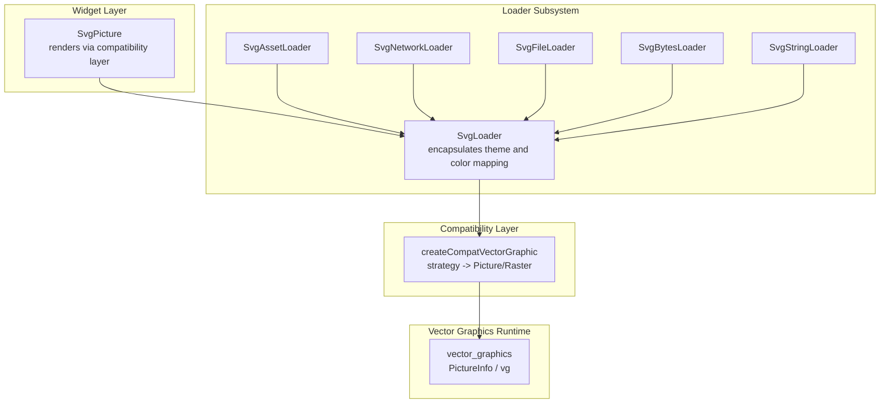
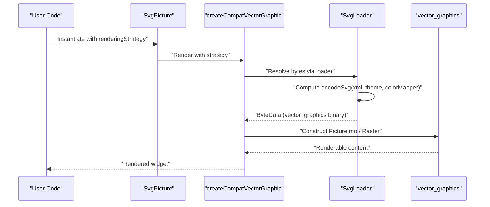
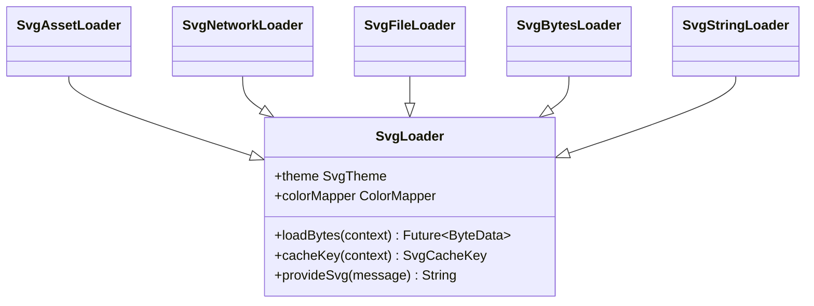
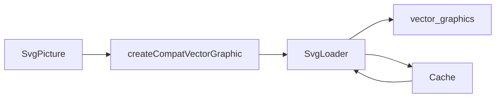

# Rendering Strategies

<cite>
**Referenced Files in This Document**
- [svg.dart](file://lib/svg.dart)
- [loaders.dart](file://lib/src/loaders.dart)
- [cache.dart](file://lib/src/cache.dart)
- [animated_svg_painter.dart](file://lib/src/animation/animated_svg_painter.dart)
- [animated_svg_painter_tree.dart](file://lib/src/animation/animated_svg_painter_tree.dart)
- [animated_svg_painter_shapes.dart](file://lib/src/animation/animated_svg_painter_shapes.dart)
- [animated_svg_painter_shapes_paths.dart](file://lib/src/animation/animated_svg_painter_shapes_paths.dart)
- [animated_svg_painter_clip_mask_geometry.dart](file://lib/src/animation/animated_svg_painter_clip_mask_geometry.dart)
- [animated_svg_picture_images.dart](file://lib/src/animation/animated_svg_picture_images.dart)
- [SVGRenderingIntent.h](file://blink-b87d44f-Source-core-svg/SVGRenderingIntent.h)
- [SVGRenderingIntent.idl](file://blink-b87d44f-Source-core-svg/SVGRenderingIntent.idl)
</cite>

## Table of Contents
1. [Introduction](#introduction)
2. [Project Structure](#project-structure)
3. [Core Components](#core-components)
4. [Architecture Overview](#architecture-overview)
5. [Detailed Component Analysis](#detailed-component-analysis)
6. [Dependency Analysis](#dependency-analysis)
7. [Performance Considerations](#performance-considerations)
8. [Troubleshooting Guide](#troubleshooting-guide)
9. [Conclusion](#conclusion)
10. [Appendices](#appendices)

## Introduction
This document explains the rendering strategies used by the SVG rendering pipeline, focusing on the RenderingStrategy enum and how it influences performance and memory usage. It compares picture-based and raster-based rendering approaches, documents the compatibility layer with vector_graphics, and provides guidance for choosing strategies based on use cases, platform specifics, and optimization techniques.

## Project Structure
The rendering pipeline centers around a widget that delegates to a compatibility layer for vector graphics rendering. The loader subsystem converts SVG XML into a vector_graphics binary representation, which is then consumed by the rendering strategy.

**Diagram sources**
- [svg.dart:542-560](file://lib/svg.dart#L542-L560)
- [loaders.dart:121-194](file://lib/src/loaders.dart#L121-L194)
- [loaders.dart:234-466](file://lib/src/loaders.dart#L234-L466)

**Section sources**
- [svg.dart:542-560](file://lib/svg.dart#L542-L560)
- [loaders.dart:121-194](file://lib/src/loaders.dart#L121-L194)

## Core Components
- RenderingStrategy enum: Controls whether the compatibility layer renders via Picture (vector) or Raster (decoded images). The enum is referenced by SvgPicture and passed to the compatibility renderer.
- SvgPicture: Exposes the renderingStrategy parameter and forwards it to the compatibility renderer.
- Loader subsystem: Converts SVG XML to vector_graphics binary via compute isolates, applying theme and optional color mapping.
- Compatibility layer: Receives the strategy and dispatches to Picture or Raster rendering paths.
- Vector graphics runtime: Provides PictureInfo and the vg namespace used by loaders.

Key implementation references:
- SvgPicture declares and forwards renderingStrategy to the compatibility renderer.
- SvgLoader performs encoding in an isolate and returns ByteData for consumption by the renderer.

**Section sources**
- [svg.dart:534-540](file://lib/svg.dart#L534-L540)
- [svg.dart:542-560](file://lib/svg.dart#L542-L560)
- [loaders.dart:156-187](file://lib/src/loaders.dart#L156-L187)
- [loaders.dart:161-174](file://lib/src/loaders.dart#L161-L174)

## Architecture Overview
The rendering pipeline transforms SVG XML into a vector_graphics binary and then renders it using the chosen strategy. Picture mode leverages vector PictureInfo for scalable rendering; Raster mode decodes images and draws them onto a Canvas.

**Diagram sources**
- [svg.dart:542-560](file://lib/svg.dart#L542-L560)
- [loaders.dart:156-187](file://lib/src/loaders.dart#L156-L187)
- [loaders.dart:161-174](file://lib/src/loaders.dart#L161-L174)

## Detailed Component Analysis

### RenderingStrategy enum and strategy selection
- SvgPicture exposes renderingStrategy and passes it to the compatibility renderer.
- The enum is referenced in documentation comments and defaults to picture mode.
- Strategy selection affects whether Picture or Raster rendering is used downstream.

Practical guidance:
- Prefer picture for scalability, crisp edges, and lower memory usage for repeated scaling.
- Consider raster when heavy filters or platform-specific rasterization benefits outweigh vector costs.

**Section sources**
- [svg.dart:534-540](file://lib/svg.dart#L534-L540)
- [svg.dart:542-560](file://lib/svg.dart#L542-L560)

### Loader subsystem and vector_graphics compatibility
- SvgLoader orchestrates encoding SVG XML into vector_graphics binary using compute isolates.
- Theme and optional ColorMapper are applied during encoding.
- The resulting ByteData is cached and reused across renders.

**Diagram sources**
- [loaders.dart:121-194](file://lib/src/loaders.dart#L121-L194)
- [loaders.dart:234-466](file://lib/src/loaders.dart#L234-L466)

**Section sources**
- [loaders.dart:121-194](file://lib/src/loaders.dart#L121-L194)
- [loaders.dart:156-187](file://lib/src/loaders.dart#L156-L187)
- [loaders.dart:161-174](file://lib/src/loaders.dart#L161-L174)

### Picture vs Raster rendering approaches
- Picture rendering:
  - Uses vector PictureInfo produced by vector_graphics.
  - Benefits: scalable, low memory footprint for repeated scaling, preserves crispness.
  - Trade-offs: CPU cost for vector evaluation per frame; complex filters may increase cost.
- Raster rendering:
  - Decodes images and draws them onto a Canvas.
  - Benefits: potential GPU-friendly raster paths on platforms with strong raster acceleration.
  - Trade-offs: higher memory usage proportional to resolution, quality loss when scaling up.

Note: The compatibility layer receives the strategy and selects the appropriate rendering path. The exact internal implementation of picture vs raster is encapsulated by the compatibility renderer.

**Section sources**
- [svg.dart:534-540](file://lib/svg.dart#L534-L540)
- [svg.dart:542-560](file://lib/svg.dart#L542-L560)

### Compatibility layer with vector_graphics
- The loader encodes SVG XML to vector_graphics binary using compute isolates.
- The compatibility renderer consumes the binary and applies the selected strategy.
- The vector_graphics package is re-exported for convenience.

Key references:
- Export of vector_graphics APIs.
- Encoding call site inside compute.

**Section sources**
- [svg.dart:12-17](file://lib/svg.dart#L12-L17)
- [loaders.dart:156-187](file://lib/src/loaders.dart#L156-L187)
- [loaders.dart:161-174](file://lib/src/loaders.dart#L161-L174)

### Rendering performance and memory usage patterns
- Picture mode:
  - Memory usage scales with scene complexity (paths, gradients, filters) rather than pixel count.
  - Scaling is efficient; recomposition cost depends on vector complexity.
- Raster mode:
  - Memory usage scales with output resolution; larger canvases consume more memory.
  - Quality remains constant at the chosen resolution.

Recommendations:
- Prefer picture for small to medium scenes with moderate complexity.
- Consider raster for very large fixed-size renders or when platform rasterization yields measurable gains.

**Section sources**
- [svg.dart:534-540](file://lib/svg.dart#L534-L540)

### Platform-specific optimizations and fallbacks
- Platform differences:
  - Some platforms may favor raster paths for specific filters or effects.
  - GPU acceleration may improve raster throughput on supported devices.
- Fallbacks:
  - If a requested strategy fails or is unsupported, the compatibility layer may fall back to a safe default (implementation-specific).
  - Ensure to test on target platforms and adjust strategy accordingly.

[No sources needed since this section provides general guidance]

### Choosing appropriate rendering strategies
- Use picture when:
  - Scalability is important (responsive layouts, zooming).
  - Memory efficiency matters (multiple sizes).
  - Crisp edges are required (line art, icons).
- Use raster when:
  - Fixed-size, high-resolution output is required.
  - Platform raster acceleration provides significant benefit.
  - Heavy filters or blending effects dominate performance.

[No sources needed since this section provides general guidance]

### Performance benchmarking and strategy switching
- Benchmark both strategies on representative workloads and devices.
- Switch strategies dynamically based on device capabilities or scene complexity.
- Monitor memory usage and frame times; adjust strategy if thresholds are exceeded.

[No sources needed since this section provides general guidance]

### Rendering performance tuning
- Reduce vector complexity (paths, gradients, filters).
- Minimize overdraw and clipping regions.
- Use caching (the loader and cache subsystem handle caching of ByteData).
- Apply color filters judiciously; they can increase rasterization cost.

**Section sources**
- [cache.dart:65-93](file://lib/src/cache.dart#L65-L93)

### Memory usage optimization
- Prefer picture for repeated scaling to avoid per-scale decoding.
- Limit scene complexity and avoid excessive gradients or filters.
- Dispose of images promptly when switching assets or navigating away.

**Section sources**
- [animated_svg_picture_images.dart:49-85](file://lib/src/animation/animated_svg_picture_images.dart#L49-L85)

### Examples of strategy selection
- Icons and UI graphics: picture mode.
- Backgrounds and large fixed-size images: raster mode.
- Dynamic scaling with frequent resizes: picture mode.
- Print-quality exports: raster mode.

[No sources needed since this section provides general guidance]

## Dependency Analysis
The rendering pipeline exhibits clear separation of concerns:
- SvgPicture depends on the compatibility renderer and passes strategy.
- The loader subsystem depends on vector_graphics encoding and compute.
- The cache subsystem depends on loader keys and ByteData storage.

**Diagram sources**
- [svg.dart:542-560](file://lib/svg.dart#L542-L560)
- [loaders.dart:156-187](file://lib/src/loaders.dart#L156-L187)
- [cache.dart:65-93](file://lib/src/cache.dart#L65-L93)

**Section sources**
- [svg.dart:542-560](file://lib/svg.dart#L542-L560)
- [loaders.dart:156-187](file://lib/src/loaders.dart#L156-L187)
- [cache.dart:65-93](file://lib/src/cache.dart#L65-L93)

## Performance Considerations
- Picture mode:
  - Lower memory usage for repeated scaling.
  - Higher CPU cost for vector evaluation; optimize path complexity.
- Raster mode:
  - Higher memory usage proportional to resolution.
  - Can leverage GPU acceleration on capable devices.
- Filters and gradients:
  - Both modes can be affected; measure and tune accordingly.
- Caching:
  - ByteData caching reduces repeated encoding overhead.

[No sources needed since this section provides general guidance]

## Troubleshooting Guide
- Strategy-related issues:
  - Verify that the chosen strategy is supported by the compatibility layer.
  - Test on target platforms; fallbacks may vary.
- Memory spikes:
  - Switch to picture mode for scalable assets.
  - Dispose of images and clear caches when appropriate.
- Performance regressions:
  - Benchmark both strategies.
  - Simplify vector complexity or switch strategies.

**Section sources**
- [cache.dart:65-93](file://lib/src/cache.dart#L65-L93)
- [animated_svg_picture_images.dart:49-85](file://lib/src/animation/animated_svg_picture_images.dart#L49-L85)

## Conclusion
The RenderingStrategy enum enables balancing flexibility and performance in SVG rendering. Picture mode favors scalability and memory efficiency, while raster mode targets fixed-size, high-resolution output and may benefit from platform raster acceleration. The loader subsystem and vector_graphics compatibility layer provide a robust foundation for both strategies, with caching and platform-specific optimizations supporting real-world performance needs.

[No sources needed since this section summarizes without analyzing specific files]

## Appendices

### Rendering intent constants (context)
While not directly used by the rendering strategy, the SVG rendering intent constants define colorimetric behavior that may influence rasterization outcomes.

**Section sources**
- [SVGRenderingIntent.h:29-36](file://blink-b87d44f-Source-core-svg/SVGRenderingIntent.h#L29-L36)
- [SVGRenderingIntent.idl:30-36](file://blink-b87d44f-Source-core-svg/SVGRenderingIntent.idl#L30-L36)