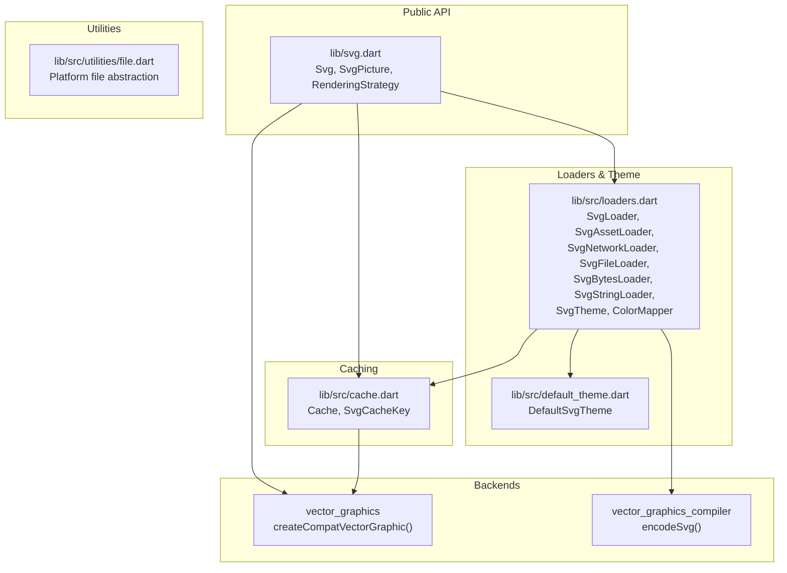
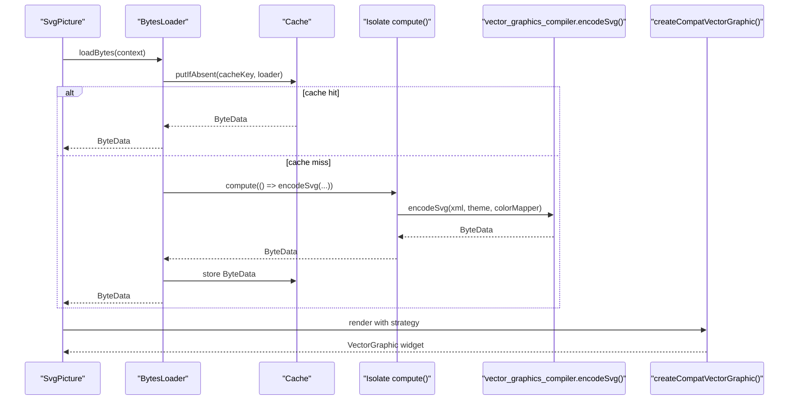
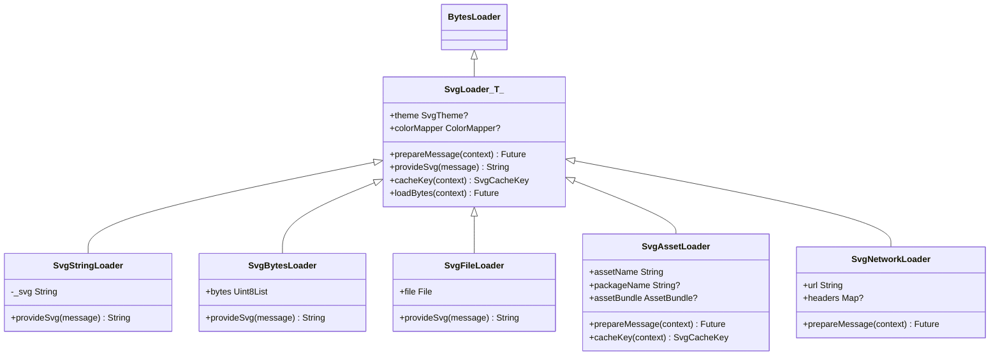
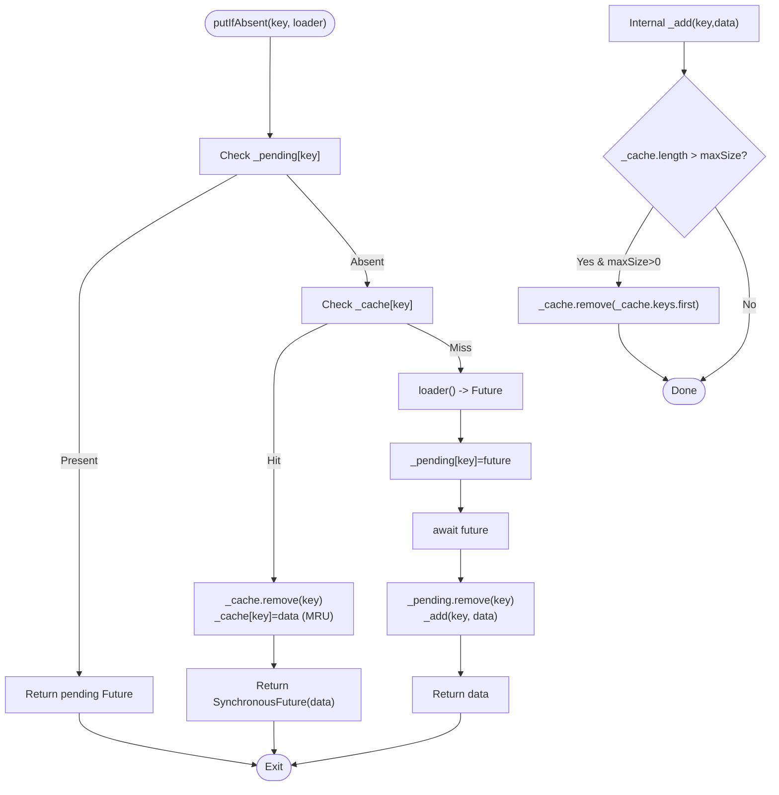
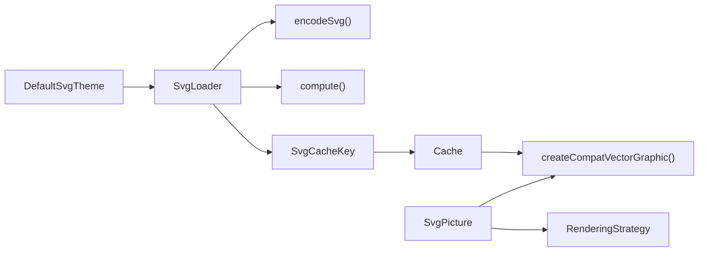

# Static SVG Rendering

<cite>
**Referenced Files in This Document**
- [svg.dart](file://lib/svg.dart)
- [loaders.dart](file://lib/src/loaders.dart)
- [cache.dart](file://lib/src/cache.dart)
- [default_theme.dart](file://lib/src/default_theme.dart)
- [file.dart](file://lib/src/utilities/file.dart)
- [README.md](file://README.md)
- [ARCHITECTURE.md](file://ARCHITECTURE.md)
- [.github/copilot-instructions.md](file://.github/copilot-instructions.md)
</cite>

## Table of Contents
1. [Introduction](#introduction)
2. [Project Structure](#project-structure)
3. [Core Components](#core-components)
4. [Architecture Overview](#architecture-overview)
5. [Detailed Component Analysis](#detailed-component-analysis)
6. [Dependency Analysis](#dependency-analysis)
7. [Performance Considerations](#performance-considerations)
8. [Troubleshooting Guide](#troubleshooting-guide)
9. [Conclusion](#conclusion)
10. [Appendices](#appendices)

## Introduction
This document explains the static SVG rendering pipeline powered by the vector_graphics backend. It covers how SVG sources are transformed into a Flutter-compatible vector graphic, the loading strategies supported (asset, network, file, memory, string), the caching mechanism with LRU eviction, and performance optimization techniques. It also documents the BytesLoader hierarchy, the Cache class (including thread safety via isolates), and the render strategy options (picture vs raster). Practical examples demonstrate different loading approaches, caching configuration, and performance tuning, along with public interfaces, parameters, and return values for all static rendering components.

## Project Structure
The static pipeline lives primarily under lib/ and lib/src/, integrating with vector_graphics and vector_graphics_compiler. Key files:
- Public API and widget: lib/svg.dart
- Loader hierarchy and theme/color mapping: lib/src/loaders.dart
- Global cache and LRU eviction: lib/src/cache.dart
- Default theme propagation: lib/src/default_theme.dart
- Platform-specific file utilities: lib/src/utilities/file.dart

**Diagram sources**
- [svg.dart:1-627](file://lib/svg.dart#L1-L627)
- [loaders.dart:1-467](file://lib/src/loaders.dart#L1-L467)
- [cache.dart:1-111](file://lib/src/cache.dart#L1-L111)
- [default_theme.dart:1-36](file://lib/src/default_theme.dart#L1-L36)
- [file.dart:1-2](file://lib/src/utilities/file.dart#L1-L2)

**Section sources**
- [svg.dart:1-627](file://lib/svg.dart#L1-L627)
- [loaders.dart:1-467](file://lib/src/loaders.dart#L1-L467)
- [cache.dart:1-111](file://lib/src/cache.dart#L1-L111)
- [default_theme.dart:1-36](file://lib/src/default_theme.dart#L1-L36)
- [file.dart:1-2](file://lib/src/utilities/file.dart#L1-L2)
- [ARCHITECTURE.md:1-73](file://ARCHITECTURE.md#L1-L73)
- [.github/copilot-instructions.md:1-28](file://.github/copilot-instructions.md#L1-L28)

## Core Components
- SvgPicture: The primary widget for static rendering. It accepts a BytesLoader and a RenderingStrategy, then delegates to createCompatVectorGraphic.
- BytesLoader hierarchy: Specialized loaders for asset, network, file, memory, and string sources. They all extend a common SvgLoader base that performs encoding in an isolate and integrates with the cache.
- Cache: A global LRU cache keyed by SvgCacheKey, ensuring that theme and color-mapping variants are cached separately.
- SvgTheme and DefaultSvgTheme: Provide currentColor, fontSize, and xHeight defaults, propagated down the widget tree.
- ColorMapper: Immutable color substitution hook used during encoding.

Key public interfaces and parameters:
- SvgPicture constructors accept width, height, fit, alignment, colorFilter, semantics, clipping, placeholders, error builders, and renderingStrategy.
- BytesLoader.loadBytes returns a Future<ByteData>.
- Cache exposes maximumSize, clear, evict, maybeEvict, and putIfAbsent.
- SvgLoader provides cacheKey and integrates with vector_graphics_compiler.encodeSvg.

**Section sources**
- [svg.dart:56-627](file://lib/svg.dart#L56-L627)
- [loaders.dart:118-194](file://lib/src/loaders.dart#L118-L194)
- [cache.dart:4-111](file://lib/src/cache.dart#L4-L111)
- [default_theme.dart:5-36](file://lib/src/default_theme.dart#L5-L36)

## Architecture Overview
The static pipeline compiles SVG to a compact binary format (.vec) and renders via vector_graphics. The process:
1. Source selection: asset, network, file, memory, or string.
2. Loader prepares raw bytes/message in prepareMessage.
3. Isolate computation: vector_graphics_compiler.encodeSvg(xml, theme, colorMapper) produces ByteData.
4. Cache storage: ByteData stored under SvgCacheKey (includes theme and colorMapper).
5. Rendering: createCompatVectorGraphic renders the ByteData using the selected strategy (picture or raster).

**Diagram sources**
- [svg.dart:542-560](file://lib/svg.dart#L542-L560)
- [loaders.dart:156-187](file://lib/src/loaders.dart#L156-L187)
- [cache.dart:65-93](file://lib/src/cache.dart#L65-L93)

**Section sources**
- [ARCHITECTURE.md:10-22](file://ARCHITECTURE.md#L10-L22)
- [.github/copilot-instructions.md:5-10](file://.github/copilot-instructions.md#L5-L10)
- [svg.dart:542-560](file://lib/svg.dart#L542-L560)
- [loaders.dart:156-187](file://lib/src/loaders.dart#L156-L187)
- [cache.dart:65-93](file://lib/src/cache.dart#L65-L93)

## Detailed Component Analysis

### BytesLoader Hierarchy
The hierarchy encapsulates source-specific preparation and encoding:
- SvgLoader<T>: Abstract base with theme/colorMapper support, isolate compute, and cache integration.
- SvgStringLoader: Encodes a raw String.
- SvgBytesLoader: Decodes UTF-8 Uint8List to String.
- SvgFileLoader: Reads file synchronously and decodes to String.
- SvgAssetLoader: Resolves AssetBundle, loads ByteData, decodes to String, and customizes cache key for bundles/packages.
- SvgNetworkLoader: Performs HTTP GET, decodes response body to String, and manages client lifecycle.

**Diagram sources**
- [loaders.dart:118-194](file://lib/src/loaders.dart#L118-L194)
- [loaders.dart:232-280](file://lib/src/loaders.dart#L232-L280)
- [loaders.dart:282-307](file://lib/src/loaders.dart#L282-L307)
- [loaders.dart:341-413](file://lib/src/loaders.dart#L341-L413)
- [loaders.dart:415-466](file://lib/src/loaders.dart#L415-L466)

Key behaviors:
- All loaders derive cache keys from theme and colorMapper to prevent cross-theme collisions.
- AssetLoader’s cache key includes the resolved AssetBundle and package context.
- NetworkLoader closes internally created clients; passed clients are not closed by the loader.

**Section sources**
- [loaders.dart:118-194](file://lib/src/loaders.dart#L118-L194)
- [loaders.dart:232-280](file://lib/src/loaders.dart#L232-L280)
- [loaders.dart:282-307](file://lib/src/loaders.dart#L282-L307)
- [loaders.dart:341-413](file://lib/src/loaders.dart#L341-L413)
- [loaders.dart:415-466](file://lib/src/loaders.dart#L415-L466)

### Cache Class and LRU Eviction
Cache stores ByteData keyed by SvgCacheKey and supports:
- maximumSize: upper bound for entries; zero clears the cache.
- putIfAbsent(key, loader): returns cached ByteData if present; otherwise computes asynchronously and stores.
- clear(): empties the cache.
- evict(key)/maybeEvict(key, oldTheme, newTheme): removes entries.
- count: current number of entries.

LRU behavior:
- On cache hit, the key is moved to the “most recently used” position.
- On overflow, the least-recently-used entry is evicted.

Thread safety:
- Encoding occurs inside compute() in an isolate; the cache is accessed on the main isolate. There is no explicit lock in Cache; however, the isolate boundary ensures serialized access to the cache during insertions.

**Diagram sources**
- [cache.dart:65-106](file://lib/src/cache.dart#L65-L106)

**Section sources**
- [cache.dart:4-111](file://lib/src/cache.dart#L4-L111)

### Rendering Strategy Options (Picture vs Raster)
SvgPicture exposes a renderingStrategy parameter:
- Picture: Renders via vector_graphics Picture.
- Raster: Renders via vector_graphics raster path.

The widget forwards strategy to createCompatVectorGraphic, enabling performance tuning per use case.

Practical guidance:
- Prefer picture for crisp scaling and reduced memory usage.
- Switch to raster when encountering platform-specific Picture limitations or when rasterization is required for downstream effects.

**Section sources**
- [svg.dart:534-540](file://lib/svg.dart#L534-L540)
- [svg.dart:542-560](file://lib/svg.dart#L542-L560)

### Loading Strategies and Examples
Below are practical examples demonstrating different loading approaches. Replace placeholders with your actual resources.

- Asset loading
  - Use SvgPicture.asset with assetName, optional package, and optional AssetBundle.
  - Example path: [SvgPicture.asset constructor:180-211](file://lib/svg.dart#L180-L211)

- Network loading
  - Use SvgPicture.network with url, optional headers, and optional http.Client.
  - Example path: [SvgPicture.network constructor:245-276](file://lib/svg.dart#L245-L276)

- File loading
  - Use SvgPicture.file with File, optionally theme and colorMapper.
  - Example path: [SvgPicture.file constructor:308-335](file://lib/svg.dart#L308-L335)

- Memory (Uint8List)
  - Use SvgPicture.memory with Uint8List, optionally theme and colorMapper.
  - Example path: [SvgPicture.memory constructor:364-391](file://lib/svg.dart#L364-L391)

- String
  - Use SvgPicture.string with String, optionally theme and colorMapper.
  - Example path: [SvgPicture.string constructor:420-447](file://lib/svg.dart#L420-L447)

- Using BytesLoader directly
  - Construct a loader (e.g., SvgAssetLoader, SvgNetworkLoader, SvgFileLoader, SvgBytesLoader, SvgStringLoader) and pass it to SvgPicture.
  - Example path: [SvgAssetLoader:341-413](file://lib/src/loaders.dart#L341-L413), [SvgNetworkLoader:415-466](file://lib/src/loaders.dart#L415-L466), [SvgFileLoader:282-307](file://lib/src/loaders.dart#L282-L307), [SvgBytesLoader:257-280](file://lib/src/loaders.dart#L257-L280), [SvgStringLoader:232-255](file://lib/src/loaders.dart#L232-L255)

- Caching configuration
  - Adjust cache size: svg.cache.maximumSize = N.
  - Clear cache: svg.cache.clear().
  - Evict a key: svg.cache.evict(key).
  - Example path: [Cache API:9-44](file://lib/src/cache.dart#L9-L44)

- Performance tuning
  - Choose picture strategy for scalable rendering.
  - Use appropriate fit and fixed width/height to avoid layout shifts.
  - Provide colorFilter to reduce per-paint recomputation.
  - Example path: [SvgPicture parameters:56-102](file://lib/svg.dart#L56-L102)

**Section sources**
- [svg.dart:56-447](file://lib/svg.dart#L56-L447)
- [loaders.dart:341-466](file://lib/src/loaders.dart#L341-L466)
- [cache.dart:9-44](file://lib/src/cache.dart#L9-L44)

## Dependency Analysis
- SvgPicture depends on vector_graphics.createCompatVectorGraphic and passes renderingStrategy.
- SvgLoader depends on vector_graphics_compiler.encodeSvg and compute() for isolate work.
- Cache depends on vector_graphics_compiler.ByteData and maintains LRU ordering.
- DefaultSvgTheme supplies SvgTheme to loaders via getTheme.

**Diagram sources**
- [svg.dart:542-560](file://lib/svg.dart#L542-L560)
- [loaders.dart:156-194](file://lib/src/loaders.dart#L156-L194)
- [cache.dart:65-93](file://lib/src/cache.dart#L65-L93)
- [default_theme.dart:16-24](file://lib/src/default_theme.dart#L16-L24)

**Section sources**
- [svg.dart:542-560](file://lib/svg.dart#L542-L560)
- [loaders.dart:156-194](file://lib/src/loaders.dart#L156-L194)
- [cache.dart:65-93](file://lib/src/cache.dart#L65-L93)
- [default_theme.dart:16-24](file://lib/src/default_theme.dart#L16-L24)

## Performance Considerations
- Use picture strategy for crisp, scalable rendering and lower memory overhead.
- Set fixed width and height to avoid layout thrashing during decode.
- Leverage caching by reusing the same BytesLoader instances and avoiding frequent theme/colorMapper changes.
- Keep maximumSize reasonable; zero disables caching, while larger sizes increase memory retention.
- Avoid allowDrawingOutsideViewBox unless necessary, as it can increase overdraw and memory usage.
- Provide colorFilter to minimize per-paint color computations.

[No sources needed since this section provides general guidance]

## Troubleshooting Guide
Common issues and remedies:
- Layout shifts during load: Specify width and height or constrain the parent tightly.
- Incorrect colors or inherited currentColor: Provide SvgTheme with currentColor and fontSize, or wrap with DefaultSvgTheme.
- Network requests failing: Ensure url correctness and headers; consider passing a persistent http.Client.
- Asset not found: Confirm asset path and package; use package-aware asset resolution.
- Excessive memory usage: Switch to picture strategy, reduce cache size, or limit concurrent loads.

**Section sources**
- [svg.dart:56-102](file://lib/svg.dart#L56-L102)
- [loaders.dart:341-413](file://lib/src/loaders.dart#L341-L413)
- [cache.dart:9-44](file://lib/src/cache.dart#L9-L44)

## Conclusion
The static SVG pipeline leverages vector_graphics and vector_graphics_compiler to compile SVG into a fast, scalable binary format. The BytesLoader hierarchy supports multiple sources, while the Cache provides LRU-based storage keyed by theme and color mapping. RenderingStrategy allows balancing fidelity and performance. By understanding these components and applying the provided examples and tuning tips, you can achieve efficient, production-ready static SVG rendering.

[No sources needed since this section summarizes without analyzing specific files]

## Appendices

### Public Interfaces Summary
- SvgPicture
  - Constructors: asset, network, file, memory, string.
  - Parameters: width, height, fit, alignment, colorFilter, semantics, clipBehavior, placeholderBuilder, errorBuilder, renderingStrategy, allowDrawingOutsideViewBox, matchTextDirection.
  - Returns: Widget rendered via createCompatVectorGraphic.

- BytesLoader
  - Methods: loadBytes(context) -> Future<ByteData>.
  - Specializations: SvgAssetLoader, SvgNetworkLoader, SvgFileLoader, SvgBytesLoader, SvgStringLoader.

- Cache
  - Properties: maximumSize, count.
  - Methods: clear(), evict(key), maybeEvict(key, oldTheme, newTheme), putIfAbsent(key, loader).

- SvgTheme and DefaultSvgTheme
  - SvgTheme: currentColor, fontSize, xHeight; toVgTheme().
  - DefaultSvgTheme: inherited theme propagation.

**Section sources**
- [svg.dart:56-627](file://lib/svg.dart#L56-L627)
- [loaders.dart:118-466](file://lib/src/loaders.dart#L118-L466)
- [cache.dart:4-111](file://lib/src/cache.dart#L4-L111)
- [default_theme.dart:5-36](file://lib/src/default_theme.dart#L5-L36)