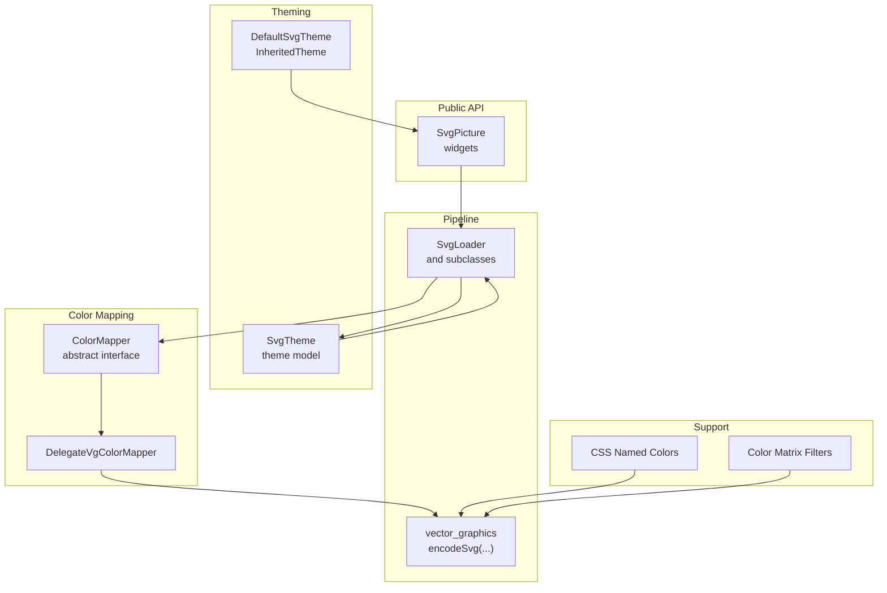
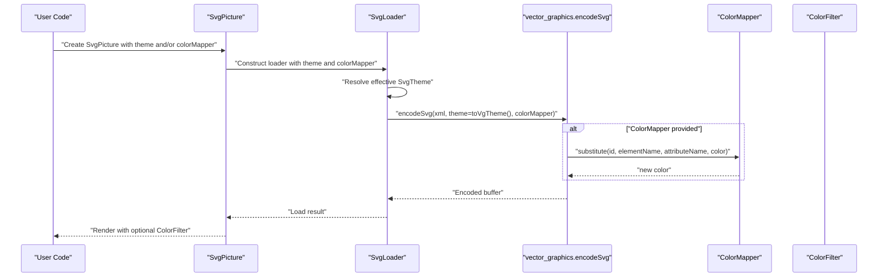
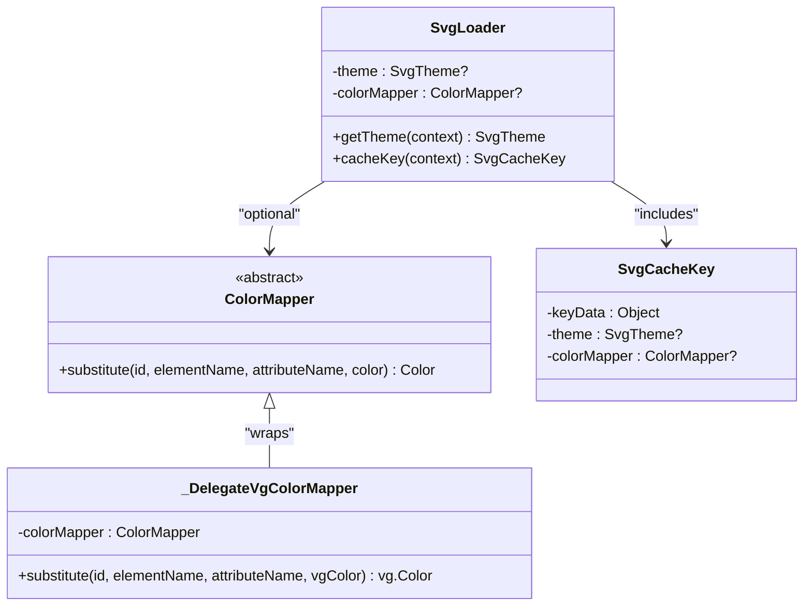
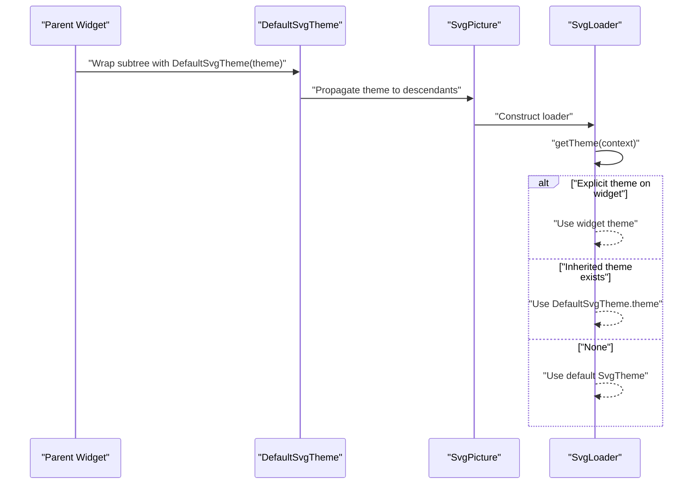
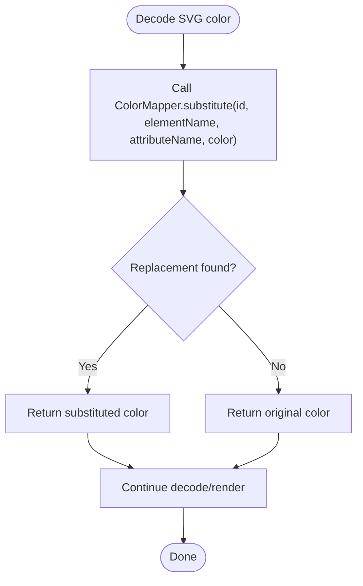
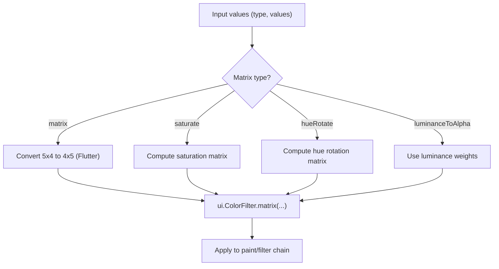
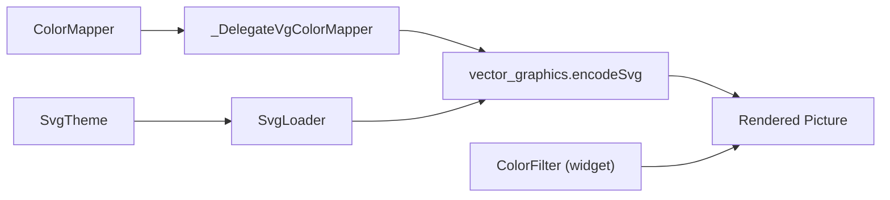

# Theming and Color Management

<cite>
**Referenced Files in This Document**
- [svg.dart](file://lib/svg.dart)
- [loaders.dart](file://lib/src/loaders.dart)
- [default_theme.dart](file://lib/src/default_theme.dart)
- [css_named_colors.dart](file://lib/src/animation/css_named_colors.dart)
- [svg_filters_color_matrix.dart](file://lib/src/animation/svg_filters_color_matrix.dart)
- [widget_svg_test.dart](file://test/widget_svg_test.dart)
- [default_theme_test.dart](file://test/default_theme_test.dart)
- [ColorDistance.cpp](file://blink-b87d44f-Source-core-svg/ColorDistance.cpp)
</cite>

## Table of Contents
1. [Introduction](#introduction)
2. [Project Structure](#project-structure)
3. [Core Components](#core-components)
4. [Architecture Overview](#architecture-overview)
5. [Detailed Component Analysis](#detailed-component-analysis)
6. [Dependency Analysis](#dependency-analysis)
7. [Performance Considerations](#performance-considerations)
8. [Troubleshooting Guide](#troubleshooting-guide)
9. [Conclusion](#conclusion)

## Introduction
This document explains the SVG theming and color management architecture in the project, focusing on the ColorMapper interface and color transformation systems. It covers how themes are applied, how colors are mapped and transformed during SVG parsing, and how dynamic color replacements are performed at runtime. It also provides guidance on implementing custom color mappers, creating dynamic themes, handling color transformations, accessibility considerations, performance optimization, and debugging color-related issues.

## Project Structure
The theming and color management system spans several modules:
- Public API and widgets: SvgPicture and related rendering utilities
- Theme propagation: DefaultSvgTheme and SvgTheme
- Color mapping: ColorMapper abstraction and integration with the vector graphics pipeline
- Named color support: CSS named color keyword resolution
- Filters and matrices: Color matrix transformations for advanced effects
- Tests: Behavioral verification of theme propagation and color mapping

**Diagram sources**
- [svg.dart:57-447](file://lib/svg.dart#L57-L447)
- [loaders.dart:121-194](file://lib/src/loaders.dart#L121-L194)
- [default_theme.dart:7-35](file://lib/src/default_theme.dart#L7-L35)
- [css_named_colors.dart:1-155](file://lib/src/animation/css_named_colors.dart#L1-L155)
- [svg_filters_color_matrix.dart:56-201](file://lib/src/animation/svg_filters_color_matrix.dart#L56-L201)

**Section sources**
- [svg.dart:57-447](file://lib/svg.dart#L57-L447)
- [loaders.dart:121-194](file://lib/src/loaders.dart#L121-L194)
- [default_theme.dart:7-35](file://lib/src/default_theme.dart#L7-L35)
- [css_named_colors.dart:1-155](file://lib/src/animation/css_named_colors.dart#L1-L155)
- [svg_filters_color_matrix.dart:56-201](file://lib/src/animation/svg_filters_color_matrix.dart#L56-L201)

## Core Components
- ColorMapper: An abstract interface that allows transforming parsed SVG colors into alternate colors during decoding. It is designed to be immutable to support caching.
- SvgTheme: A theme model containing currentColor, fontSize, and xHeight, which influence how SVG elements interpret values like currentColor and em/ex units.
- DefaultSvgTheme: An InheritedTheme that propagates a default SvgTheme to descendant SvgPicture widgets.
- SvgLoader family: Loaders that pass the theme and optional ColorMapper to the vector graphics encoder, enabling color substitution and theme-aware rendering.
- CssNamedColors: A registry of CSS/SVG named color keywords to their ui.Color values.
- Color matrix filters: Transformations such as saturation, hue rotation, and luminance-to-alpha via color matrices.

**Section sources**
- [loaders.dart:81-94](file://lib/src/loaders.dart#L81-L94)
- [loaders.dart:38-74](file://lib/src/loaders.dart#L38-L74)
- [default_theme.dart:7-35](file://lib/src/default_theme.dart#L7-L35)
- [loaders.dart:121-194](file://lib/src/loaders.dart#L121-L194)
- [css_named_colors.dart:1-155](file://lib/src/animation/css_named_colors.dart#L1-L155)
- [svg_filters_color_matrix.dart:56-201](file://lib/src/animation/svg_filters_color_matrix.dart#L56-L201)

## Architecture Overview
The theming and color pipeline integrates at the loader level:
- SvgPicture constructs a BytesLoader variant (asset/network/file/memory/string) with optional theme and ColorMapper.
- The loader resolves the effective SvgTheme (explicit, inherited, or default).
- The loader delegates to vector_graphics encodeSvg with the theme and an optional ColorMapper adapter.
- During decoding, the ColorMapper’s substitute method is invoked for each color, allowing dynamic replacement.
- Runtime color filters (e.g., ColorFilter.mode) can be applied at the widget level for additional transformations.

**Diagram sources**
- [svg.dart:57-447](file://lib/svg.dart#L57-L447)
- [loaders.dart:143-194](file://lib/src/loaders.dart#L143-L194)
- [loaders.dart:96-116](file://lib/src/loaders.dart#L96-L116)

## Detailed Component Analysis

### ColorMapper Interface and Implementation
ColorMapper defines a single method to transform colors during SVG parsing. It is designed to be immutable to support caching. The system wraps a user-provided ColorMapper into a delegate compatible with the vector graphics pipeline.

**Diagram sources**
- [loaders.dart:81-94](file://lib/src/loaders.dart#L81-L94)
- [loaders.dart:96-116](file://lib/src/loaders.dart#L96-L116)
- [loaders.dart:121-194](file://lib/src/loaders.dart#L121-L194)
- [loaders.dart:201-230](file://lib/src/loaders.dart#L201-L230)

**Section sources**
- [loaders.dart:81-94](file://lib/src/loaders.dart#L81-L94)
- [loaders.dart:96-116](file://lib/src/loaders.dart#L96-L116)
- [loaders.dart:121-194](file://lib/src/loaders.dart#L121-L194)
- [loaders.dart:201-230](file://lib/src/loaders.dart#L201-L230)

### Theme Propagation and Inheritance
DefaultSvgTheme is an InheritedTheme that supplies a default SvgTheme to descendants. SvgLoader resolves the effective theme by preferring an explicitly provided SvgTheme on the widget, then falling back to the inherited DefaultSvgTheme, and finally using a default theme if none is provided.

**Diagram sources**
- [default_theme.dart:7-35](file://lib/src/default_theme.dart#L7-L35)
- [loaders.dart:143-154](file://lib/src/loaders.dart#L143-L154)

**Section sources**
- [default_theme.dart:7-35](file://lib/src/default_theme.dart#L7-L35)
- [loaders.dart:143-154](file://lib/src/loaders.dart#L143-L154)
- [default_theme_test.dart:7-74](file://test/default_theme_test.dart#L7-L74)

### Color Mapping Algorithms and Dynamic Replacement
During decoding, the vector graphics encoder invokes the ColorMapper’s substitute method for each color. Tests demonstrate substituting specific colors for rendering verification. The delegate adapter bridges the Flutter ColorMapper to the vector graphics ColorMapper.

**Diagram sources**
- [loaders.dart:165-167](file://lib/src/loaders.dart#L165-L167)
- [loaders.dart:108-115](file://lib/src/loaders.dart#L108-L115)
- [widget_svg_test.dart:44-69](file://test/widget_svg_test.dart#L44-L69)

**Section sources**
- [loaders.dart:165-167](file://lib/src/loaders.dart#L165-L167)
- [loaders.dart:108-115](file://lib/src/loaders.dart#L108-L115)
- [widget_svg_test.dart:44-69](file://test/widget_svg_test.dart#L44-L69)

### Color Matrix Transformations
Color matrix filters enable advanced color adjustments such as saturation, hue rotation, and luminance-to-alpha conversions. The implementation converts SVG-format matrices to Flutter-compatible formats and applies them as ColorFilter.matrix.

**Diagram sources**
- [svg_filters_color_matrix.dart:74-103](file://lib/src/animation/svg_filters_color_matrix.dart#L74-L103)
- [svg_filters_color_matrix.dart:109-146](file://lib/src/animation/svg_filters_color_matrix.dart#L109-L146)
- [svg_filters_color_matrix.dart:149-161](file://lib/src/animation/svg_filters_color_matrix.dart#L149-L161)
- [svg_filters_color_matrix.dart:164-189](file://lib/src/animation/svg_filters_color_matrix.dart#L164-L189)
- [svg_filters_color_matrix.dart:192-200](file://lib/src/animation/svg_filters_color_matrix.dart#L192-L200)

**Section sources**
- [svg_filters_color_matrix.dart:56-201](file://lib/src/animation/svg_filters_color_matrix.dart#L56-L201)

### Named Color Keywords
CSS/SVG named color keywords are resolved to ui.Color values, enabling consistent color parsing across animations and static rendering.

**Section sources**
- [css_named_colors.dart:1-155](file://lib/src/animation/css_named_colors.dart#L1-L155)

### Accessibility Considerations
- Prefer semantic labeling for SvgPicture to improve accessibility.
- Use sufficient color contrast when applying theme-driven color substitutions.
- Consider dynamic theme switching and high contrast modes by adjusting SvgTheme.currentColor and using appropriate ColorFilter configurations.

**Section sources**
- [svg.dart:508-518](file://lib/svg.dart#L508-L518)
- [svg.dart:531-532](file://lib/svg.dart#L531-L532)

## Dependency Analysis
The loader-to-theme-to-color-mapping dependency chain ensures that:
- Theme resolution occurs early in the pipeline
- ColorMapper substitution happens during decoding
- Runtime ColorFilter can augment or override color transformations

**Diagram sources**
- [loaders.dart:143-194](file://lib/src/loaders.dart#L143-L194)
- [loaders.dart:96-116](file://lib/src/loaders.dart#L96-L116)
- [svg.dart:543-560](file://lib/svg.dart#L543-L560)

**Section sources**
- [loaders.dart:143-194](file://lib/src/loaders.dart#L143-L194)
- [svg.dart:543-560](file://lib/svg.dart#L543-L560)

## Performance Considerations
- Keep ColorMapper immutable to benefit from caching (the cache key includes theme and colorMapper).
- Prefer batched color operations and reuse ColorFilter instances when possible.
- Avoid excessive recomputation inside substitute; keep mappings constant and deterministic.
- Use vector graphics encoding optimizations and avoid unnecessary overdraw or clipping passes.
- For large SVGs, leverage the isolate-based loader to offload work from the UI thread.

**Section sources**
- [loaders.dart:201-230](file://lib/src/loaders.dart#L201-L230)
- [loaders.dart:156-180](file://lib/src/loaders.dart#L156-L180)

## Troubleshooting Guide
Common issues and resolutions:
- Colors not changing as expected:
  - Verify that a ColorMapper is provided and that substitute returns a different color for the targeted inputs.
  - Confirm that the loader receives the intended theme and that the effective theme matches expectations.
- Theme changes not taking effect:
  - Ensure DefaultSvgTheme wraps the subtree and that SvgPicture does not override the theme unintentionally.
  - Check that the loader’s cache key includes the theme and colorMapper to avoid stale caches.
- Contrast or accessibility problems:
  - Adjust SvgTheme.currentColor and use ColorFilter for additional tinting or desaturation.
  - Validate contrast ratios after color substitution and filter application.
- Debugging color operations:
  - Add logging around substitute to trace which colors are being replaced.
  - Compare pre/post color values and confirm matrix conversions when using color filters.

**Section sources**
- [widget_svg_test.dart:44-69](file://test/widget_svg_test.dart#L44-L69)
- [default_theme_test.dart:7-74](file://test/default_theme_test.dart#L7-L74)
- [loaders.dart:190-193](file://lib/src/loaders.dart#L190-L193)

## Conclusion
The project’s theming and color management system centers on an immutable ColorMapper interface, a robust SvgTheme propagation mechanism, and integration with the vector graphics pipeline. By combining theme-aware decoding, dynamic color substitution, and optional runtime color filters, applications can implement flexible, accessible, and performant SVG color strategies. Tests validate theme propagation and color mapping behavior, ensuring reliable operation across dynamic scenarios.