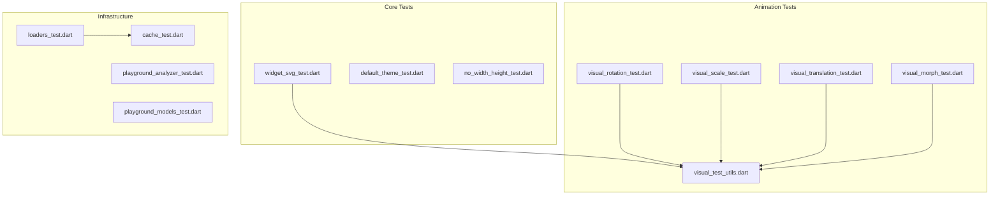
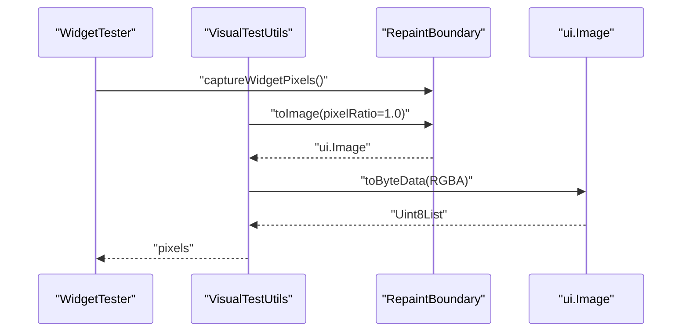
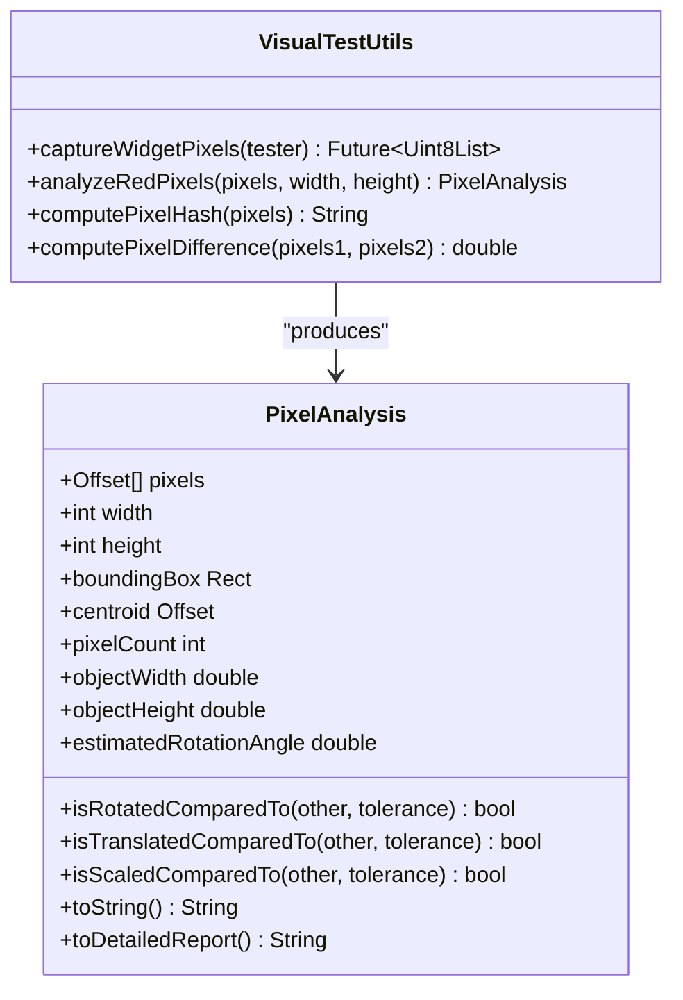
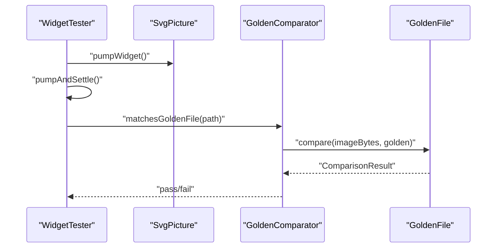
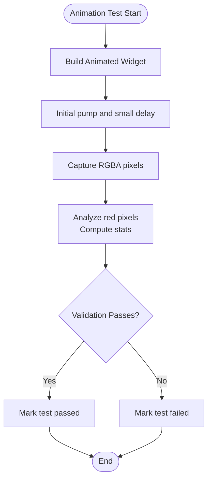
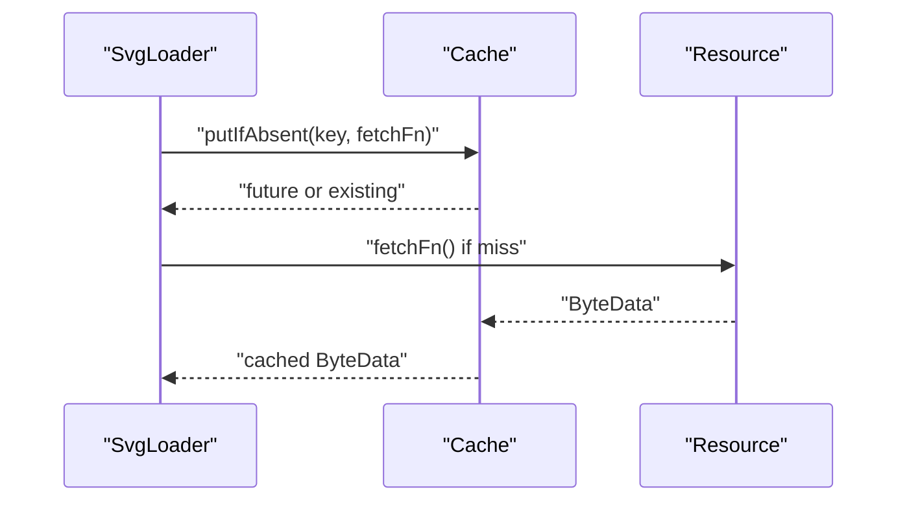
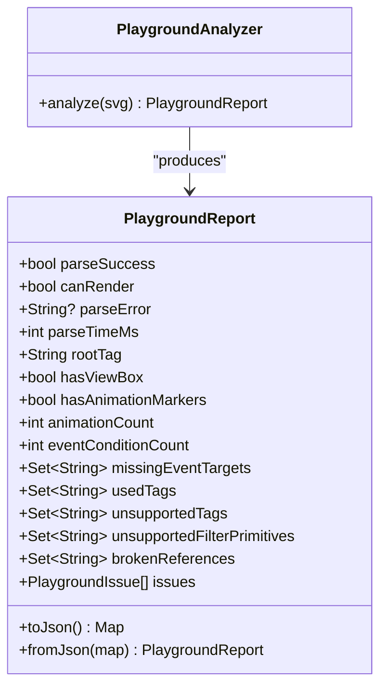
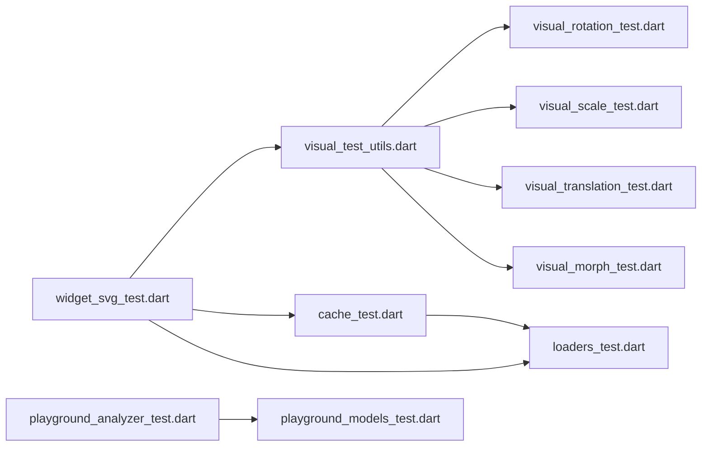

# Testing Suite Updates

<cite>
**Referenced Files in This Document**
- [dart_test.yaml](file://dart_test.yaml)
- [pubspec.yaml](file://pubspec.yaml)
- [visual_test_utils.dart](file://test/animation/visual_test_utils.dart)
- [widget_svg_test.dart](file://test/widget_svg_test.dart)
- [cache_test.dart](file://test/cache_test.dart)
- [loaders_test.dart](file://test/loaders_test.dart)
- [visual_rotation_test.dart](file://test/animation/visual_rotation_test.dart)
- [visual_scale_test.dart](file://test/animation/visual_scale_test.dart)
- [visual_translation_test.dart](file://test/animation/visual_translation_test.dart)
- [visual_morph_test.dart](file://test/animation/visual_morph_test.dart)
- [playground_analyzer_test.dart](file://test/playground/playground_analyzer_test.dart)
- [playground_models_test.dart](file://test/playground/playground_models_test.dart)
- [default_theme_test.dart](file://test/default_theme_test.dart)
- [no_width_height_test.dart](file://test/no_width_height_test.dart)
</cite>

## Table of Contents
1. [Introduction](#introduction)
2. [Project Structure](#project-structure)
3. [Core Components](#core-components)
4. [Architecture Overview](#architecture-overview)
5. [Detailed Component Analysis](#detailed-component-analysis)
6. [Dependency Analysis](#dependency-analysis)
7. [Performance Considerations](#performance-considerations)
8. [Troubleshooting Guide](#troubleshooting-guide)
9. [Conclusion](#conclusion)

## Introduction
This document provides a comprehensive overview of the testing suite updates for the Flutter SVG project. It focuses on the test framework architecture, visual regression testing utilities, animation-specific tests, caching and loader validations, and playground analysis capabilities. The goal is to help contributors understand how tests are structured, how to extend them, and how to maintain visual parity across rendering scenarios.

## Project Structure
The testing suite is organized into focused groups:
- Core widget and rendering tests
- Animation and visual transformation tests
- Caching and loader behavior tests
- Playground analyzer and model tests
- Theme propagation and layout tests

**Diagram sources**
- [widget_svg_test.dart:1-1157](file://test/widget_svg_test.dart#L1-L1157)
- [visual_test_utils.dart:1-231](file://test/animation/visual_test_utils.dart#L1-L231)
- [visual_rotation_test.dart:1-117](file://test/animation/visual_rotation_test.dart#L1-L117)
- [visual_scale_test.dart:1-114](file://test/animation/visual_scale_test.dart#L1-L114)
- [visual_translation_test.dart:1-115](file://test/animation/visual_translation_test.dart#L1-L115)
- [visual_morph_test.dart:1-70](file://test/animation/visual_morph_test.dart#L1-L70)
- [cache_test.dart:1-133](file://test/cache_test.dart#L1-L133)
- [loaders_test.dart:1-186](file://test/loaders_test.dart#L1-L186)
- [playground_analyzer_test.dart:1-90](file://test/playground/playground_analyzer_test.dart#L1-L90)
- [playground_models_test.dart:1-63](file://test/playground/playground_models_test.dart#L1-L63)

**Section sources**
- [widget_svg_test.dart:1-1157](file://test/widget_svg_test.dart#L1-L1157)
- [visual_test_utils.dart:1-231](file://test/animation/visual_test_utils.dart#L1-L231)
- [cache_test.dart:1-133](file://test/cache_test.dart#L1-L133)
- [loaders_test.dart:1-186](file://test/loaders_test.dart#L1-L186)
- [playground_analyzer_test.dart:1-90](file://test/playground/playground_analyzer_test.dart#L1-L90)
- [playground_models_test.dart:1-63](file://test/playground/playground_models_test.dart#L1-L63)
- [default_theme_test.dart:1-163](file://test/default_theme_test.dart#L1-L163)
- [no_width_height_test.dart:1-89](file://test/no_width_height_test.dart#L1-L89)

## Core Components
- Visual test utilities: Provide pixel capture, analysis, hashing, and difference computation for visual regression testing.
- Widget rendering tests: Validate SvgPicture across string, memory, asset, and network sources, including strategies and color mapping.
- Loader and cache tests: Verify caching behavior, loader key derivation, and resource lifecycle.
- Playground analyzer tests: Validate parsing, rendering feasibility, and reporting of unsupported constructs and broken references.
- Theme propagation tests: Confirm DefaultSvgTheme precedence and fallback behavior for currentColor, fontSize, and xHeight.

**Section sources**
- [visual_test_utils.dart:1-231](file://test/animation/visual_test_utils.dart#L1-L231)
- [widget_svg_test.dart:1-1157](file://test/widget_svg_test.dart#L1-L1157)
- [loaders_test.dart:1-186](file://test/loaders_test.dart#L1-L186)
- [cache_test.dart:1-133](file://test/cache_test.dart#L1-L133)
- [playground_analyzer_test.dart:1-90](file://test/playground/playground_analyzer_test.dart#L1-L90)
- [default_theme_test.dart:1-163](file://test/default_theme_test.dart#L1-L163)

## Architecture Overview
The testing suite leverages Flutter's widget testing framework with specialized utilities for visual comparisons and animation verification. Core patterns include:
- Golden file comparisons for rasterized widget outputs
- Pixel-level analysis for animation correctness
- Custom comparators with tolerance thresholds
- Isolated loader and cache behavior checks

**Diagram sources**
- [visual_test_utils.dart:11-37](file://test/animation/visual_test_utils.dart#L11-L37)

**Section sources**
- [visual_test_utils.dart:1-231](file://test/animation/visual_test_utils.dart#L1-L231)
- [widget_svg_test.dart:12-84](file://test/widget_svg_test.dart#L12-L84)

## Detailed Component Analysis

### Visual Test Utilities
The visual utilities module centralizes pixel capture, analysis, and comparison:
- Pixel capture without pumpAndSettle to avoid blocking infinite animations
- Red pixel detection with configurable tolerance
- Hash computation and per-channel difference calculation
- Statistical analysis: bounding box, centroid, estimated rotation angle
- Comparative analysis between frames for transformations

**Diagram sources**
- [visual_test_utils.dart:10-231](file://test/animation/visual_test_utils.dart#L10-L231)

**Section sources**
- [visual_test_utils.dart:1-231](file://test/animation/visual_test_utils.dart#L1-L231)

### Widget Rendering Tests
These tests validate SvgPicture across multiple loading strategies and rendering modes:
- String, memory, asset, and network sources
- Rendering strategies and color mappers
- Semantics labeling and exclusion
- Directionality and alignment handling
- Error handling for network failures

**Diagram sources**
- [widget_svg_test.dart:38-42](file://test/widget_svg_test.dart#L38-L42)

**Section sources**
- [widget_svg_test.dart:1-1157](file://test/widget_svg_test.dart#L1-L1157)

### Animation and Transformation Tests
Animation tests use visual utilities to verify transformations:
- Rotation animation: captures pixels, computes bounding box and centroid, validates rendering
- Scale animation: similar validation with expected scaling behavior
- Translation animation: verifies movement within canvas bounds
- Path morphing: validates path interpolation pipeline through a CustomPaint widget

**Diagram sources**
- [visual_rotation_test.dart:8-109](file://test/animation/visual_rotation_test.dart#L8-L109)
- [visual_scale_test.dart:8-107](file://test/animation/visual_scale_test.dart#L8-L107)
- [visual_translation_test.dart:8-108](file://test/animation/visual_translation_test.dart#L8-L108)
- [visual_morph_test.dart:8-45](file://test/animation/visual_morph_test.dart#L8-L45)

**Section sources**
- [visual_rotation_test.dart:1-117](file://test/animation/visual_rotation_test.dart#L1-L117)
- [visual_scale_test.dart:1-114](file://test/animation/visual_scale_test.dart#L1-L114)
- [visual_translation_test.dart:1-115](file://test/animation/visual_translation_test.dart#L1-L115)
- [visual_morph_test.dart:1-70](file://test/animation/visual_morph_test.dart#L1-L70)

### Loader and Cache Behavior
Loader tests validate caching and resource handling:
- Cache key derivation with theme and color mapper variations
- Cache hit/miss behavior under various conditions
- Asset loader package resolution and buffer slicing
- Network loader client lifecycle management

**Diagram sources**
- [loaders_test.dart:16-23](file://test/loaders_test.dart#L16-L23)
- [cache_test.dart:32-72](file://test/cache_test.dart#L32-L72)

**Section sources**
- [loaders_test.dart:1-186](file://test/loaders_test.dart#L1-L186)
- [cache_test.dart:1-133](file://test/cache_test.dart#L1-L133)

### Playground Analyzer and Models
Playground tests validate parsing and reporting:
- Basic SVG parsing and rendering feasibility
- Unsupported tag and filter primitive detection
- Broken reference reporting
- JSON serialization/deserialization for reports and log entries

**Diagram sources**
- [playground_analyzer_test.dart:9-69](file://test/playground/playground_analyzer_test.dart#L9-L69)
- [playground_models_test.dart:8-43](file://test/playground/playground_models_test.dart#L8-L43)

**Section sources**
- [playground_analyzer_test.dart:1-90](file://test/playground/playground_analyzer_test.dart#L1-L90)
- [playground_models_test.dart:1-63](file://test/playground/playground_models_test.dart#L1-L63)

### Theme Propagation and Layout
Theme tests verify DefaultSvgTheme precedence and defaults:
- Precedence of widget-level theme over DefaultSvgTheme
- Default font size and xHeight calculations
- CurrentColor and fontSize fallback behavior

**Section sources**
- [default_theme_test.dart:1-163](file://test/default_theme_test.dart#L1-L163)

### Environment and Golden File Configuration
- Test environment restricted to VM for compatibility with certain comparators
- Custom golden file comparator with tolerance threshold for minor differences

**Section sources**
- [dart_test.yaml:1-5](file://dart_test.yaml#L1-L5)
- [widget_svg_test.dart:12-36](file://test/widget_svg_test.dart#L12-L36)

## Dependency Analysis
The testing suite exhibits clear separation of concerns:
- Animation tests depend on visual utilities for pixel-level validation
- Loader tests depend on cache internals for behavior verification
- Playground tests depend on analyzer models for structured reporting
- Widget tests integrate with golden file comparators for rasterized output validation

**Diagram sources**
- [visual_test_utils.dart:1-231](file://test/animation/visual_test_utils.dart#L1-L231)
- [visual_rotation_test.dart:1-117](file://test/animation/visual_rotation_test.dart#L1-L117)
- [visual_scale_test.dart:1-114](file://test/animation/visual_scale_test.dart#L1-L114)
- [visual_translation_test.dart:1-115](file://test/animation/visual_translation_test.dart#L1-L115)
- [visual_morph_test.dart:1-70](file://test/animation/visual_morph_test.dart#L1-L70)
- [cache_test.dart:1-133](file://test/cache_test.dart#L1-L133)
- [loaders_test.dart:1-186](file://test/loaders_test.dart#L1-L186)
- [playground_analyzer_test.dart:1-90](file://test/playground/playground_analyzer_test.dart#L1-L90)
- [playground_models_test.dart:1-63](file://test/playground/playground_models_test.dart#L1-L63)
- [widget_svg_test.dart:1-1157](file://test/widget_svg_test.dart#L1-L1157)

**Section sources**
- [visual_test_utils.dart:1-231](file://test/animation/visual_test_utils.dart#L1-L231)
- [widget_svg_test.dart:1-1157](file://test/widget_svg_test.dart#L1-L1157)
- [loaders_test.dart:1-186](file://test/loaders_test.dart#L1-L186)
- [cache_test.dart:1-133](file://test/cache_test.dart#L1-L133)
- [playground_analyzer_test.dart:1-90](file://test/playground/playground_analyzer_test.dart#L1-L90)
- [playground_models_test.dart:1-63](file://test/playground/playground_models_test.dart#L1-L63)

## Performance Considerations
- Pixel capture uses a single-pixel ratio to balance fidelity and speed
- Visual analysis avoids heavy computations by focusing on red pixel detection and statistical summaries
- Golden file comparisons leverage tolerant thresholds to reduce false positives from minor rendering differences
- Animation tests limit pump durations to prevent indefinite waits while still capturing meaningful frames

## Troubleshooting Guide
Common issues and resolutions:
- Golden file mismatches below tolerance threshold: The custom comparator logs warnings and continues, allowing minor differences to pass
- Infinite animation stalls during pixel capture: Use the visual utilities method designed for non-blocking capture
- Cache misses despite identical inputs: Verify cache keys include theme and color mapper parameters
- Asset loader package resolution failures: Ensure package names and asset keys match expected patterns
- Network loader client lifecycle: When passing a client, ensure it is not closed prematurely by the loader

**Section sources**
- [widget_svg_test.dart:12-36](file://test/widget_svg_test.dart#L12-L36)
- [visual_test_utils.dart:11-37](file://test/animation/visual_test_utils.dart#L11-L37)
- [loaders_test.dart:93-124](file://test/loaders_test.dart#L93-L124)
- [cache_test.dart:32-72](file://test/cache_test.dart#L32-L72)

## Conclusion
The testing suite demonstrates a robust approach to validating SVG rendering across multiple sources, themes, and animation scenarios. By combining golden file comparisons, pixel-level analysis, and targeted loader/cache tests, the suite ensures visual parity and functional correctness. The playground analyzer adds valuable diagnostics for unsupported constructs and broken references, supporting ongoing quality assurance.