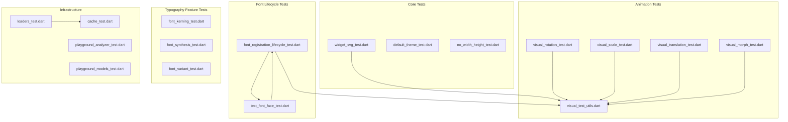
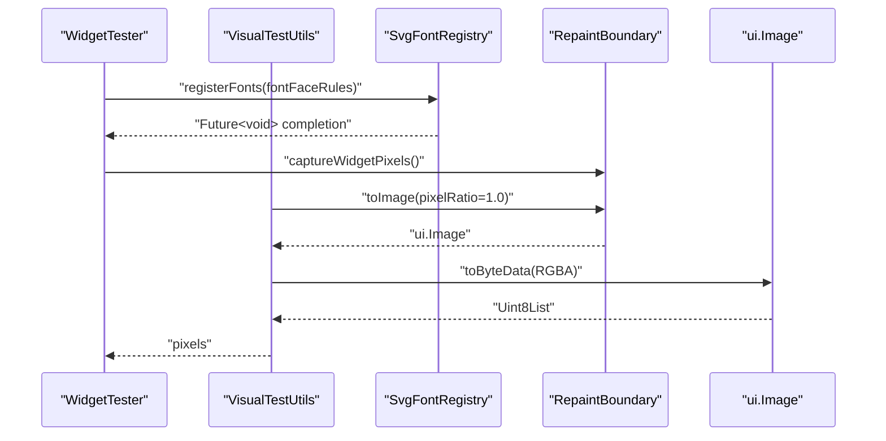
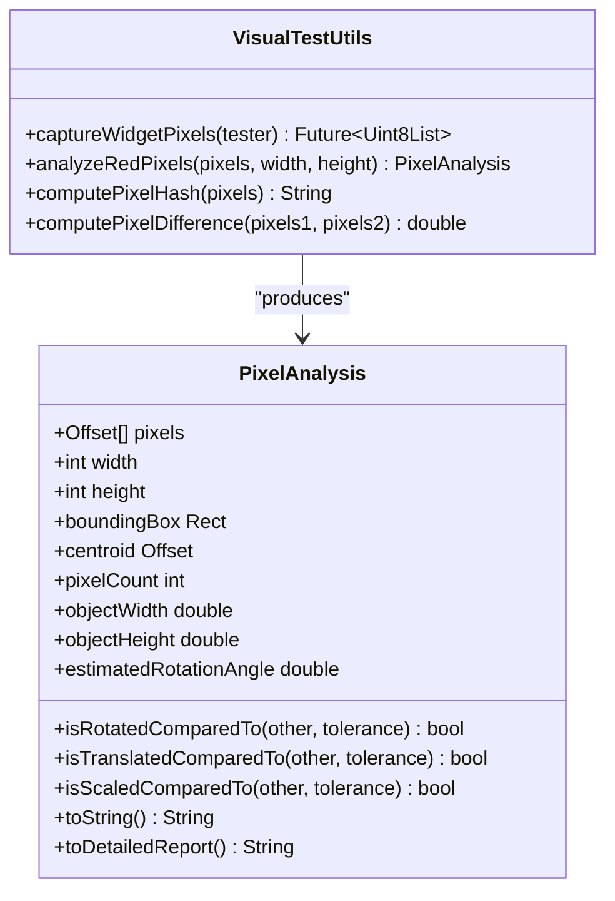
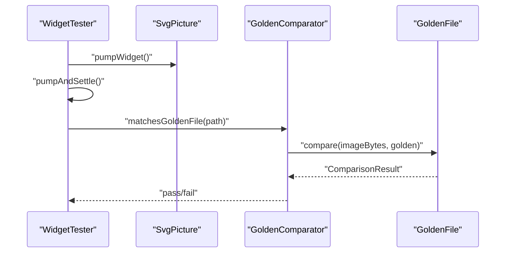
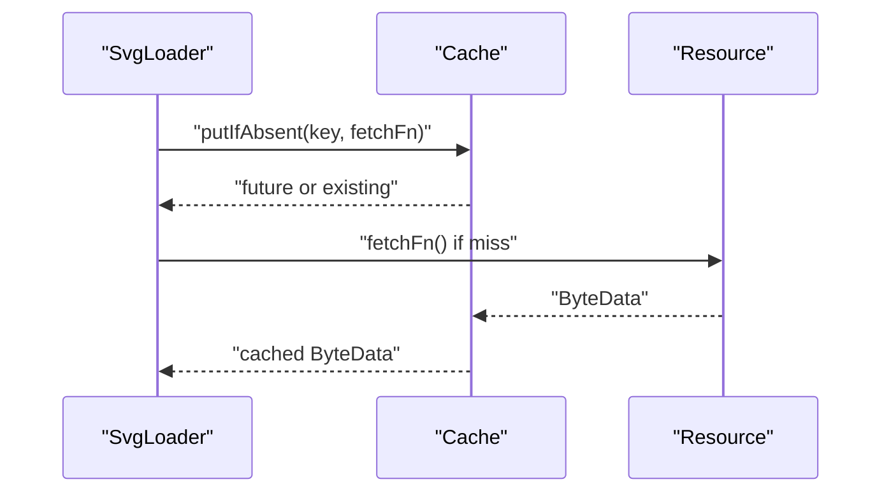
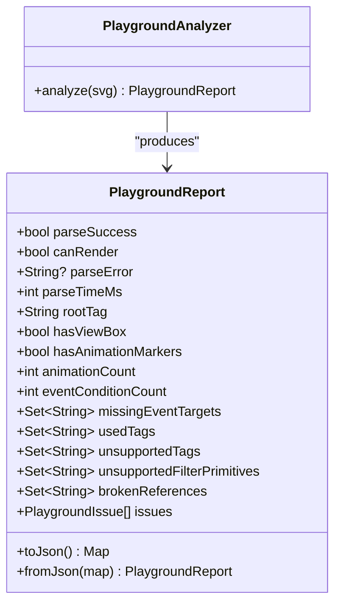
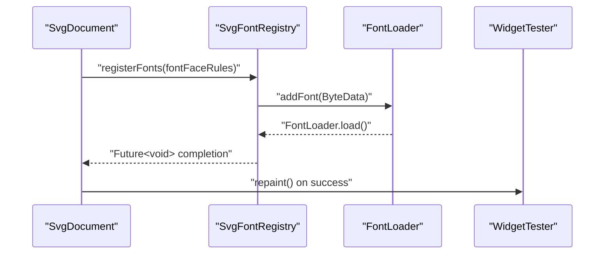
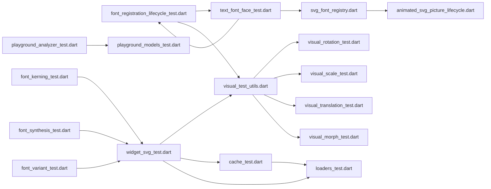

# Testing Suite Updates

<cite>
**Referenced Files in This Document**
- [dart_test.yaml](file://dart_test.yaml)
- [pubspec.yaml](file://pubspec.yaml)
- [font_registration_lifecycle_test.dart](file://test/animation/font_registration_lifecycle_test.dart)
- [text_font_face_test.dart](file://test/animation/text_font_face_test.dart)
- [svg_font_registry.dart](file://lib/src/animation/svg_font_registry.dart)
- [animated_svg_picture_lifecycle.dart](file://lib/src/animation/animated_svg_picture_lifecycle.dart)
- [VISUAL_TESTING_GUIDELINES.md](file://VISUAL_TESTING_GUIDELINES.md)
- [widget_svg_test.dart](file://test/widget_svg_test.dart)
- [cache_test.dart](file://test/cache_test.dart)
- [loaders_test.dart](file://test/loaders_test.dart)
- [visual_rotation_test.dart](file://test/animation/visual_rotation_test.dart)
- [visual_scale_test.dart](file://test/animation/visual_scale_test.dart)
- [visual_translation_test.dart](file://test/animation/visual_translation_test.dart)
- [visual_morph_test.dart](file://test/animation/visual_morph_test.dart)
- [playground_analyzer_test.dart](file://test/playground/playground_analyzer_test.dart)
- [playground_models_test.dart](file://test/playground/playground_models_test.dart)
- [default_theme_test.dart](file://test/default_theme_test.dart)
- [no_width_height_test.dart](file://test/no_width_height_test.dart)
- [font_kerning_test.dart](file://test/animation/font_kerning_test.dart)
- [font_synthesis_test.dart](file://test/animation/font_synthesis_test.dart)
- [font_variant_test.dart](file://test/animation/font_variant_test.dart)
- [visual_test_utils.dart](file://test/animation/visual_test_utils.dart)
</cite>

## Update Summary
**Changes Made**
- Added comprehensive font registration lifecycle testing documentation
- Enhanced visual regression testing capabilities section
- Expanded font-related test scenarios and error handling verification
- Added detailed documentation for embedded font scenarios
- Updated testing infrastructure to cover font parsing, registration, and lifecycle management

## Table of Contents
1. [Introduction](#introduction)
2. [Project Structure](#project-structure)
3. [Core Components](#core-components)
4. [Architecture Overview](#architecture-overview)
5. [Detailed Component Analysis](#detailed-component-analysis)
6. [Font Registration Lifecycle Testing](#font-registration-lifecycle-testing)
7. [Enhanced Visual Regression Testing](#enhanced-visual-regression-testing)
8. [Embedded Font Scenarios](#embedded-font-scenarios)
9. [Dependency Analysis](#dependency-analysis)
10. [Performance Considerations](#performance-considerations)
11. [Troubleshooting Guide](#troubleshooting-guide)
12. [Conclusion](#conclusion)

## Introduction
This document provides a comprehensive overview of the testing suite updates for the Flutter SVG project, with a focus on the expanded font registration lifecycle testing infrastructure, enhanced visual regression testing capabilities, and improved test coverage for embedded font scenarios. The testing suite now includes comprehensive font-related test scenarios, detailed error handling verification, and advanced visual analysis techniques for ensuring font rendering consistency across different platforms and configurations.

## Project Structure
The testing suite is organized into focused groups with expanded font testing capabilities:
- Core widget and rendering tests
- Animation and visual transformation tests
- Font registration lifecycle tests
- Embedded font parsing and validation tests
- Caching and loader behavior tests
- Playground analyzer and model tests
- Theme propagation and layout tests
- Typography feature tests (kerning, synthesis, variants)

**Diagram sources**
- [widget_svg_test.dart:1-1157](file://test/widget_svg_test.dart#L1-L1157)
- [visual_test_utils.dart:1-231](file://test/animation/visual_test_utils.dart#L1-L231)
- [font_registration_lifecycle_test.dart:1-345](file://test/animation/font_registration_lifecycle_test.dart#L1-L345)
- [text_font_face_test.dart:1-509](file://test/animation/text_font_face_test.dart#L1-L509)
- [font_kerning_test.dart:1-53](file://test/animation/font_kerning_test.dart#L1-L53)
- [font_synthesis_test.dart:1-53](file://test/animation/font_synthesis_test.dart#L1-L53)
- [font_variant_test.dart:1-196](file://test/animation/font_variant_test.dart#L1-L196)

**Section sources**
- [widget_svg_test.dart:1-1157](file://test/widget_svg_test.dart#L1-L1157)
- [visual_test_utils.dart:1-231](file://test/animation/visual_test_utils.dart#L1-L231)
- [font_registration_lifecycle_test.dart:1-345](file://test/animation/font_registration_lifecycle_test.dart#L1-L345)
- [text_font_face_test.dart:1-509](file://test/animation/text_font_face_test.dart#L1-L509)
- [font_kerning_test.dart:1-53](file://test/animation/font_kerning_test.dart#L1-L53)
- [font_synthesis_test.dart:1-53](file://test/animation/font_synthesis_test.dart#L1-L53)
- [font_variant_test.dart:1-196](file://test/animation/font_variant_test.dart#L1-L196)

## Core Components
- Visual test utilities: Provide pixel capture, analysis, hashing, and difference computation for visual regression testing.
- Widget rendering tests: Validate SvgPicture across string, memory, asset, and network sources, including strategies and color mapping.
- Font registration lifecycle tests: Comprehensive testing of @font-face parsing, registration, and lifecycle management.
- Embedded font parsing tests: Validate CSS font-face rule extraction, parsing, and validation.
- Loader and cache tests: Verify caching behavior, loader key derivation, and resource lifecycle.
- Playground analyzer tests: Validate parsing, rendering feasibility, and reporting of unsupported constructs and broken references.
- Theme propagation tests: Confirm DefaultSvgTheme precedence and fallback behavior for currentColor, fontSize, and xHeight.
- Typography feature tests: Comprehensive testing of font-kerning, font-synthesis, and font-variant CSS properties.

**Section sources**
- [visual_test_utils.dart:1-231](file://test/animation/visual_test_utils.dart#L1-L231)
- [widget_svg_test.dart:1-1157](file://test/widget_svg_test.dart#L1-L1157)
- [font_registration_lifecycle_test.dart:1-345](file://test/animation/font_registration_lifecycle_test.dart#L1-L345)
- [text_font_face_test.dart:1-509](file://test/animation/text_font_face_test.dart#L1-L509)
- [font_kerning_test.dart:1-53](file://test/animation/font_kerning_test.dart#L1-L53)
- [font_synthesis_test.dart:1-53](file://test/animation/font_synthesis_test.dart#L1-L53)
- [font_variant_test.dart:1-196](file://test/animation/font_variant_test.dart#L1-L196)

## Architecture Overview
The testing suite leverages Flutter's widget testing framework with specialized utilities for visual comparisons, animation verification, and comprehensive font lifecycle testing. Core patterns include:
- Golden file comparisons for rasterized widget outputs
- Pixel-level analysis for animation correctness
- Custom comparators with tolerance thresholds
- Isolated loader and cache behavior checks
- Comprehensive font registration lifecycle validation
- Embedded font parsing and validation testing
- Typography feature compliance verification

**Diagram sources**
- [visual_test_utils.dart:11-37](file://test/animation/visual_test_utils.dart#L11-L37)
- [svg_font_registry.dart:106-134](file://lib/src/animation/svg_font_registry.dart#L106-L134)

**Section sources**
- [visual_test_utils.dart:1-231](file://test/animation/visual_test_utils.dart#L1-L231)
- [widget_svg_test.dart:12-84](file://test/widget_svg_test.dart#L12-L84)
- [svg_font_registry.dart:106-134](file://lib/src/animation/svg_font_registry.dart#L106-L134)

## Detailed Component Analysis

### Visual Test Utilities
The visual utilities module centralizes pixel capture, analysis, and comparison:
- Pixel capture without pumpAndSettle to avoid blocking infinite animations
- Red pixel detection with configurable tolerance
- Hash computation and per-channel difference calculation
- Statistical analysis: bounding box, centroid, estimated rotation angle
- Comparative analysis between frames for transformations

**Diagram sources**
- [visual_test_utils.dart:10-231](file://test/animation/visual_test_utils.dart#L10-L231)

**Section sources**
- [visual_test_utils.dart:1-231](file://test/animation/visual_test_utils.dart#L1-L231)

### Widget Rendering Tests
These tests validate SvgPicture across multiple loading strategies and rendering modes:
- String, memory, asset, and network sources
- Rendering strategies and color mappers
- Semantics labeling and exclusion
- Directionality and alignment handling
- Error handling for network failures

**Diagram sources**
- [widget_svg_test.dart:38-42](file://test/widget_svg_test.dart#L38-L42)

**Section sources**
- [widget_svg_test.dart:1-1157](file://test/widget_svg_test.dart#L1-L1157)

### Animation and Transformation Tests
Animation tests use visual utilities to verify transformations:
- Rotation animation: captures pixels, computes bounding box and centroid, validates rendering
- Scale animation: similar validation with expected scaling behavior
- Translation animation: verifies movement within canvas bounds
- Path morphing: validates path interpolation pipeline through a CustomPaint widget

**Diagram sources**
- [visual_rotation_test.dart:8-109](file://test/animation/visual_rotation_test.dart#L8-L109)
- [visual_scale_test.dart:8-107](file://test/animation/visual_scale_test.dart#L8-L107)
- [visual_translation_test.dart:8-108](file://test/animation/visual_translation_test.dart#L8-L108)
- [visual_morph_test.dart:8-45](file://test/animation/visual_morph_test.dart#L8-L45)

**Section sources**
- [visual_rotation_test.dart:1-117](file://test/animation/visual_rotation_test.dart#L1-L117)
- [visual_scale_test.dart:1-114](file://test/animation/visual_scale_test.dart#L1-L114)
- [visual_translation_test.dart:1-115](file://test/animation/visual_translation_test.dart#L1-L115)
- [visual_morph_test.dart:1-70](file://test/animation/visual_morph_test.dart#L1-L70)

### Loader and Cache Behavior
Loader tests validate caching and resource handling:
- Cache key derivation with theme and color mapper variations
- Cache hit/miss behavior under various conditions
- Asset loader package resolution and buffer slicing
- Network loader client lifecycle management

**Diagram sources**
- [loaders_test.dart:16-23](file://test/loaders_test.dart#L16-L23)
- [cache_test.dart:32-72](file://test/cache_test.dart#L32-L72)

**Section sources**
- [loaders_test.dart:1-186](file://test/loaders_test.dart#L1-L186)
- [cache_test.dart:1-133](file://test/cache_test.dart#L1-L133)

### Playground Analyzer and Models
Playground tests validate parsing and reporting:
- Basic SVG parsing and rendering feasibility
- Unsupported tag and filter primitive detection
- Broken reference reporting
- JSON serialization/deserialization for reports and log entries

**Diagram sources**
- [playground_analyzer_test.dart:9-69](file://test/playground/playground_analyzer_test.dart#L9-L69)
- [playground_models_test.dart:8-43](file://test/playground/playground_models_test.dart#L8-L43)

**Section sources**
- [playground_analyzer_test.dart:1-90](file://test/playground/playground_analyzer_test.dart#L1-L90)
- [playground_models_test.dart:1-63](file://test/playground/playground_models_test.dart#L1-L63)

### Theme Propagation and Layout
Theme tests verify DefaultSvgTheme precedence and defaults:
- Precedence of widget-level theme over DefaultSvgTheme
- Default font size and xHeight calculations
- CurrentColor and fontSize fallback behavior

**Section sources**
- [default_theme_test.dart:1-163](file://test/default_theme_test.dart#L1-L163)

### Typography Feature Tests
Typography tests validate CSS font properties and their rendering:
- Font kerning property testing (auto, normal, none)
- Font synthesis property testing (none, weight, style, weight style)
- Font variant property testing (normal, small-caps, all-small-caps, petite-caps, titling-caps, oldstyle-nums, lining-nums, tabular-nums)
- Inheritance and combination of typography features
- Style attribute and group inheritance testing

**Section sources**
- [font_kerning_test.dart:1-53](file://test/animation/font_kerning_test.dart#L1-L53)
- [font_synthesis_test.dart:1-53](file://test/animation/font_synthesis_test.dart#L1-L53)
- [font_variant_test.dart:1-196](file://test/animation/font_variant_test.dart#L1-L196)

## Font Registration Lifecycle Testing

### Comprehensive Font Registration Testing
The testing suite now includes extensive font registration lifecycle testing that validates the complete font processing pipeline:

- **@font-face parsing validation**: Tests CSS font-face rule extraction from various CSS formats and styles
- **Font registry lifecycle management**: Validates registration, de-duplication, and error handling
- **Embedded font data validation**: Tests base64 decoding, format detection, and font loading
- **Async registration scheduling**: Ensures proper async font registration without blocking rendering
- **Error handling and graceful degradation**: Validates error reporting and partial font loading scenarios

**Diagram sources**
- [font_registration_lifecycle_test.dart:346-384](file://test/animation/font_registration_lifecycle_test.dart#L346-L384)
- [svg_font_registry.dart:137-185](file://lib/src/animation/svg_font_registry.dart#L137-L185)

### Font Parsing and Validation
Font parsing tests validate comprehensive CSS font-face rule extraction and validation:

- **CSS parsing robustness**: Handles quoted and unquoted font-family names, HTML-encoded quotes
- **Format detection**: Validates TTF, OTF, and WOFF format support and detection
- **Data URL extraction**: Tests base64 data URL parsing with various encodings and formats
- **Weight normalization**: Converts font-weight keywords to numeric values
- **Duplicate prevention**: Ensures proper handling of multiple font variants

**Section sources**
- [text_font_face_test.dart:1-509](file://test/animation/text_font_face_test.dart#L1-L509)
- [svg_font_registry.dart:12-75](file://lib/src/animation/svg_font_registry.dart#L12-L75)

### Embedded Font Scenario Testing
Embedded font testing covers comprehensive scenarios for font data handling:

- **Multiple @font-face rules**: Validates registration of multiple font families and variants
- **SVG string changes**: Tests font registration re-triggering on SVG content changes
- **Unregistered font handling**: Validates behavior when fonts are not yet registered
- **External URL rejection**: Ensures proper error handling for non-embedded fonts
- **Format compatibility**: Tests supported and unsupported font formats

**Section sources**
- [font_registration_lifecycle_test.dart:1-345](file://test/animation/font_registration_lifecycle_test.dart#L1-L345)

## Enhanced Visual Regression Testing

### Advanced Visual Analysis Capabilities
The visual testing framework has been enhanced with comprehensive analysis capabilities:

- **Pixel-level geometry analysis**: Detailed geometric analysis including centroid, bounding box, and rotation angle estimation
- **Multi-frame comparison**: Ability to compare animation frames and detect geometric changes
- **Statistical analysis**: Comprehensive statistical analysis of rendered content including pixel distribution and shape metrics
- **Platform-independent verification**: Geometry-based analysis that works consistently across different platforms
- **Debugging support**: Detailed reporting and logging for failed tests

### Visual Testing Best Practices
The enhanced visual testing guidelines provide comprehensive guidance:

- **Golden file limitations**: Understanding when golden tests fail and when pixel analysis is preferred
- **Animation testing patterns**: Deterministic animation testing using autoPlay false with initialTime
- **Headless rendering considerations**: Handling platform differences in headless environments
- **Debugging failed tests**: Systematic approaches to diagnosing visual test failures
- **Performance optimization**: Efficient testing strategies for complex animations

**Section sources**
- [VISUAL_TESTING_GUIDELINES.md:1-329](file://VISUAL_TESTING_GUIDELINES.md#L1-L329)

## Embedded Font Scenarios

### Comprehensive Font Data Handling
The testing suite validates comprehensive embedded font scenarios:

- **Base64 data URL handling**: Validates decoding of various base64 font formats with proper error handling
- **Format validation**: Tests supported formats (TTF, OTF) and proper rejection of unsupported formats (WOFF)
- **Font weight and style variants**: Validates handling of multiple font weights and styles within families
- **HTML entity handling**: Tests proper handling of HTML-encoded quotes in font-family names
- **Special character preservation**: Validates preservation of special characters in font family names

### Font Registration Error Handling
Comprehensive error handling testing ensures robust font processing:

- **External URL detection**: Proper identification and error reporting for non-embedded fonts
- **Format compatibility checking**: Validation of font format support and appropriate error messages
- **Base64 decoding validation**: Error handling for malformed or unsupported base64 data
- **Partial font loading**: Graceful handling when some fonts in a family load successfully
- **Registry state management**: Proper cleanup and state management after font registration attempts

**Section sources**
- [svg_font_registry.dart:140-185](file://lib/src/animation/svg_font_registry.dart#L140-L185)
- [text_font_face_test.dart:457-507](file://test/animation/text_font_face_test.dart#L457-L507)

## Dependency Analysis
The testing suite exhibits clear separation of concerns with expanded font testing dependencies:
- Animation tests depend on visual utilities for pixel-level validation
- Font lifecycle tests depend on font registry and parsing utilities
- Typography tests validate CSS property compliance
- Loader tests depend on cache internals for behavior verification
- Playground tests depend on analyzer models for structured reporting
- Widget tests integrate with golden file comparators for rasterized output validation

**Diagram sources**
- [visual_test_utils.dart:1-231](file://test/animation/visual_test_utils.dart#L1-L231)
- [font_registration_lifecycle_test.dart:1-345](file://test/animation/font_registration_lifecycle_test.dart#L1-L345)
- [text_font_face_test.dart:1-509](file://test/animation/text_font_face_test.dart#L1-L509)
- [svg_font_registry.dart:1-402](file://lib/src/animation/svg_font_registry.dart#L1-L402)
- [animated_svg_picture_lifecycle.dart:325-384](file://lib/src/animation/animated_svg_picture_lifecycle.dart#L325-L384)

**Section sources**
- [visual_test_utils.dart:1-231](file://test/animation/visual_test_utils.dart#L1-L231)
- [font_registration_lifecycle_test.dart:1-345](file://test/animation/font_registration_lifecycle_test.dart#L1-L345)
- [text_font_face_test.dart:1-509](file://test/animation/text_font_face_test.dart#L1-L509)
- [svg_font_registry.dart:1-402](file://lib/src/animation/svg_font_registry.dart#L1-L402)
- [animated_svg_picture_lifecycle.dart:325-384](file://lib/src/animation/animated_svg_picture_lifecycle.dart#L325-L384)

## Performance Considerations
- Pixel capture uses a single-pixel ratio to balance fidelity and speed
- Visual analysis avoids heavy computations by focusing on red pixel detection and statistical summaries
- Golden file comparisons leverage tolerant thresholds to reduce false positives from minor rendering differences
- Animation tests limit pump durations to prevent indefinite waits while still capturing meaningful frames
- Font registration uses async processing to avoid blocking widget initialization
- Font parsing utilizes efficient regex-based extraction for CSS font-face rules
- Typography tests use lightweight validation without full rendering

## Troubleshooting Guide
Common issues and resolutions:
- Golden file mismatches below tolerance threshold: The custom comparator logs warnings and continues, allowing minor differences to pass
- Infinite animation stalls during pixel capture: Use the visual utilities method designed for non-blocking capture
- Cache misses despite identical inputs: Verify cache keys include theme and color mapper parameters
- Asset loader package resolution failures: Ensure package names and asset keys match expected patterns
- Network loader client lifecycle: When passing a client, ensure it is not closed prematurely by the loader
- Font registration failures: Check base64 encoding, format support, and font data validity
- CSS parsing errors: Validate CSS syntax and ensure proper @font-face rule formatting
- Typography property rendering: Verify CSS property compatibility and inheritance behavior

**Section sources**
- [widget_svg_test.dart:12-36](file://test/widget_svg_test.dart#L12-L36)
- [visual_test_utils.dart:11-37](file://test/animation/visual_test_utils.dart#L11-L37)
- [font_registration_lifecycle_test.dart:241-279](file://test/animation/font_registration_lifecycle_test.dart#L241-L279)
- [text_font_face_test.dart:457-507](file://test/animation/text_font_face_test.dart#L457-L507)

## Conclusion
The testing suite demonstrates a robust approach to validating SVG rendering across multiple sources, themes, animations, and font scenarios. The expanded font registration lifecycle testing provides comprehensive coverage of font parsing, registration, and error handling. Enhanced visual regression testing capabilities ensure reliable animation verification through pixel-level analysis and geometric validation. Typography feature testing validates CSS font property compliance across various scenarios. The integration of font-related tests with the existing testing infrastructure ensures comprehensive quality assurance for the Flutter SVG project.