# Testing Suite Updates

<cite>
**Referenced Files in This Document**
- [dart_test.yaml](file://dart_test.yaml)
- [pubspec.yaml](file://pubspec.yaml)
- [css_nth_selectors_test.dart](file://test/animation/css_nth_selectors_test.dart)
- [css_calc_edge_cases_test.dart](file://test/animation/css_calc_edge_cases_test.dart)
- [foreign_object_nesting_test.dart](file://test/animation/foreign_object_nesting_test.dart)
- [hit_test_deep_nesting_test.dart](file://test/animation/hit_test_deep_nesting_test.dart)
- [image_transform_edge_cases_test.dart](file://test/animation/image_transform_edge_cases_test.dart)
- [smil_timing_precision_test.dart](file://test/animation/smil_timing_precision_test.dart)
- [css_variables_calc_test.dart](file://test/animation/css_variables_calc_test.dart)
- [foreignobject_css_inheritance_test.dart](file://test/animation/foreignobject_css_inheritance_test.dart)
- [image_foreignobject_edge_cases_test.dart](file://test/animation/image_foreignobject_edge_cases_test.dart)
- [font_registration_lifecycle_test.dart](file://test/animation/font_registration_lifecycle_test.dart)
- [text_font_face_test.dart](file://test/animation/text_font_face_test.dart)
- [svg_font_registry.dart](file://lib/src/animation/svg_font_registry.dart)
- [animated_svg_picture_lifecycle.dart](file://lib/src/animation/animated_svg_picture_lifecycle.dart)
- [css_selectors.dart](file://lib/src/animation/css_selectors.dart)
- [css_cascade_selector_matching.dart](file://lib/src/animation/css_cascade_selector_matching.dart)
- [smil_animation_runtime.dart](file://lib/src/animation/smil/smil_animation_runtime.dart)
- [smil_timeline_runtime.dart](file://lib/src/animation/smil/smil_timeline_runtime.dart)
- [VISUAL_TESTING_GUIDELINES.md](file://VISUAL_TESTING_GUIDELINES.md)
- [widget_svg_test.dart](file://test/widget_svg_test.dart)
- [cache_test.dart](file://test/cache_test.dart)
- [loaders_test.dart](file://test/loaders_test.dart)
- [visual_rotation_test.dart](file://test/animation/visual_rotation_test.dart)
- [visual_scale_test.dart](file://test/animation/visual_scale_test.dart)
- [visual_translation_test.dart](file://test/animation/visual_translation_test.dart)
- [visual_morph_test.dart](file://test/animation/visual_morph_test.dart)
- [playground_analyzer_test.dart](file://test/playground/playground_analyzer_test.dart)
- [playground_models_test.dart](file://test/playground/playground_models_test.dart)
- [default_theme_test.dart](file://test/default_theme_test.dart)
- [no_width_height_test.dart](file://test/no_width_height_test.dart)
- [font_kerning_test.dart](file://test/animation/font_kerning_test.dart)
- [font_synthesis_test.dart](file://test/animation/font_synthesis_test.dart)
- [font_variant_test.dart](file://test/animation/font_variant_test.dart)
- [visual_test_utils.dart](file://test/animation/visual_test_utils.dart)
- [advanced_clip_composition_test.dart](file://test/animation/advanced_clip_composition_test.dart)
- [filter_advanced_input_graph_test.dart](file://test/animation/filter_advanced_input_graph_test.dart)
- [use_symbol_advanced_edge_cases_test.dart](file://test/animation/use_symbol_advanced_edge_cases_test.dart)
</cite>

## Update Summary
**Changes Made**
- Added comprehensive test coverage for advanced clip composition with 775 lines of tests covering deeply nested clipPaths, mixed units, transform compositions, text clipping, and polygon/polyline shapes
- Added extensive filter advanced input graph testing with 707 lines of tests covering FillPaint/StrokePaint source distinction, recursive filter composition, advanced feDropShadow scenarios, and feMerge edge cases
- Added detailed use symbol advanced edge cases testing with 644 lines of tests covering CSS cascade through nested use boundaries, visibility/display cascade, use within clipPath/mask regions, pointer events, transform composition, opacity compositing, and symbol viewBox handling
- Enhanced visual regression testing with comprehensive edge case coverage for complex rendering scenarios
- Expanded filter semantics testing with advanced input-graph resolution and circular reference detection
- Improved use/symbol inheritance testing with comprehensive cascade behavior validation

## Table of Contents
1. [Introduction](#introduction)
2. [Project Structure](#project-structure)
3. [Core Components](#core-components)
4. [Architecture Overview](#architecture-overview)
5. [Detailed Component Analysis](#detailed-component-analysis)
6. [Advanced Clip Composition Testing](#advanced-clip-composition-testing)
7. [Filter Advanced Input Graph Testing](#filter-advanced-input-graph-testing)
8. [Use Symbol Advanced Edge Cases Testing](#use-symbol-advanced-edge-cases-testing)
9. [CSS Nth Selectors Test Suite](#css-nth-selectors-test-suite)
10. [Enhanced SMIL Animation Runtime Testing](#enhanced-smil-animation-runtime-testing)
11. [CSS Calc Edge Cases Testing](#css-calc-edge-cases-testing)
12. [ForeignObject Nesting and Coordinate Systems](#foreignobject-nesting-and-coordinate-systems)
13. [Deep Hit Testing and Event System](#deep-hit-testing-and-event-system)
14. [Image Transform Edge Cases](#image-transform-edge-cases)
15. [SMIL Timing Precision Testing](#smil-timing-precision-testing)
16. [CSS Variables and Calc Integration](#css-variables-and-calc-integration)
17. [Enhanced Visual Regression Testing](#enhanced-visual-regression-testing)
18. [Font Registration Lifecycle Testing](#font-registration-lifecycle-testing)
19. [Embedded Font Scenarios](#embedded-font-scenarios)
20. [Dependency Analysis](#dependency-analysis)
21. [Performance Considerations](#performance-considerations)
22. [Troubleshooting Guide](#troubleshooting-guide)
23. [Conclusion](#conclusion)

## Introduction
This document provides a comprehensive overview of the expanded testing suite for the Flutter SVG project, reflecting the recent addition of three major comprehensive test files that significantly enhance the reliability and robustness of SVG rendering. The testing suite now includes extensive coverage for advanced clip composition (775 lines), filter advanced input graph semantics (707 lines), and use symbol advanced edge cases (644 lines). These additions provide comprehensive validation for complex SVG features including deeply nested clipPaths, advanced filter composition, CSS cascade behavior through use/symbol boundaries, and sophisticated rendering scenarios.

## Project Structure
The testing suite has been expanded with three major comprehensive test categories:
- Core widget and rendering tests
- Animation and visual transformation tests
- Advanced clip composition testing with deeply nested clipPaths and complex geometries
- Filter advanced input graph testing with sophisticated filter semantics
- Use symbol advanced edge cases testing with comprehensive cascade behavior
- CSS nth selectors test suite with comprehensive structural pseudo-class coverage
- Enhanced SMIL animation runtime precision testing
- CSS calc edge cases and mathematical function testing
- ForeignObject nesting and coordinate system tests
- Deep hit testing for complex compositions
- Image transformation edge case tests
- SMIL timing precision and animation synchronization tests
- CSS variables and calc() integration tests
- Font registration lifecycle tests
- Typography feature tests
- Visual regression testing with enhanced edge case coverage

```mermaid
graph TB
subgraph "Core Tests"
WS["widget_svg_test.dart"]
DT["default_theme_test.dart"]
NW["no_width_height_test.dart"]
end
subgraph "Animation Tests"
VR["visual_rotation_test.dart"]
VS["visual_scale_test.dart"]
VT["visual_translation_test.dart"]
VM["visual_morph_test.dart"]
VU["visual_test_utils.dart"]
end
subgraph "Advanced Clip Composition Tests"
ACC["advanced_clip_composition_test.dart"]
end
subgraph "Filter Advanced Input Graph Tests"
FAG["filter_advanced_input_graph_test.dart"]
end
subgraph "Use Symbol Advanced Edge Cases Tests"
USE["use_symbol_advanced_edge_cases_test.dart"]
end
subgraph "CSS Nth Selectors Tests"
CNST["css_nth_selectors_test.dart"]
end
subgraph "SMIL Runtime Tests"
SART["smil_animation_runtime_tests"]
end
subgraph "CSS Calc Tests"
CCE["css_calc_edge_cases_test.dart"]
CVC["css_variables_calc_test.dart"]
end
subgraph "ForeignObject Tests"
FON["foreign_object_nesting_test.dart"]
FOCI["foreignobject_css_inheritance_test.dart"]
IFOE["image_foreignobject_edge_cases_test.dart"]
end
subgraph "Hit Testing Tests"
HTDN["hit_test_deep_nesting_test.dart"]
end
subgraph "Image Transform Tests"
ITE["image_transform_edge_cases_test.dart"]
end
subgraph "SMIL Timing Tests"
STP["smil_timing_precision_test.dart"]
end
subgraph "Font Lifecycle Tests"
FRL["font_registration_lifecycle_test.dart"]
TF["text_font_face_test.dart"]
end
subgraph "Typography Feature Tests"
FK["font_kerning_test.dart"]
FS["font_synthesis_test.dart"]
FV["font_variant_test.dart"]
end
subgraph "Infrastructure"
CT["cache_test.dart"]
LT["loaders_test.dart"]
PA["playground_analyzer_test.dart"]
PM["playground_models_test.dart"]
end
WS --> VU
VR --> VU
VS --> VU
VT --> VU
VM --> VU
ACC --> VU
FAG --> VU
USE --> VU
CNST --> VU
SART --> VU
FRL --> TF
FRL --> VU
TF --> FRL
CCE --> VU
FON --> VU
HTDN --> VU
ITE --> VU
STP --> VU
CVC --> VU
LT --> CT
```

**Diagram sources**
- [widget_svg_test.dart:1-1157](file://test/widget_svg_test.dart#L1-L1157)
- [visual_test_utils.dart:1-231](file://test/animation/visual_test_utils.dart#L1-L231)
- [advanced_clip_composition_test.dart:1-776](file://test/animation/advanced_clip_composition_test.dart#L1-L776)
- [filter_advanced_input_graph_test.dart:1-708](file://test/animation/filter_advanced_input_graph_test.dart#L1-L708)
- [use_symbol_advanced_edge_cases_test.dart:1-645](file://test/animation/use_symbol_advanced_edge_cases_test.dart#L1-L645)
- [css_nth_selectors_test.dart:1-1001](file://test/animation/css_nth_selectors_test.dart#L1-L1001)
- [css_calc_edge_cases_test.dart:1-658](file://test/animation/css_calc_edge_cases_test.dart#L1-L658)
- [foreign_object_nesting_test.dart:1-869](file://test/animation/foreign_object_nesting_test.dart#L1-L869)
- [hit_test_deep_nesting_test.dart:1-1266](file://test/animation/hit_test_deep_nesting_test.dart#L1-L1266)
- [image_transform_edge_cases_test.dart:1-877](file://test/animation/image_transform_edge_cases_test.dart#L1-L877)
- [smil_timing_precision_test.dart:1-849](file://test/animation/smil_timing_precision_test.dart#L1-L849)
- [css_variables_calc_test.dart:1-402](file://test/animation/css_variables_calc_test.dart#L1-L402)
- [font_registration_lifecycle_test.dart:1-345](file://test/animation/font_registration_lifecycle_test.dart#L1-L345)
- [text_font_face_test.dart:1-509](file://test/animation/text_font_face_test.dart#L1-L509)
- [font_kerning_test.dart:1-53](file://test/animation/font_kerning_test.dart#L1-L53)
- [font_synthesis_test.dart:1-53](file://test/animation/font_synthesis_test.dart#L1-L53)
- [font_variant_test.dart:1-196](file://test/animation/font_variant_test.dart#L1-L196)

**Section sources**
- [widget_svg_test.dart:1-1157](file://test/widget_svg_test.dart#L1-L1157)
- [visual_test_utils.dart:1-231](file://test/animation/visual_test_utils.dart#L1-L231)
- [advanced_clip_composition_test.dart:1-776](file://test/animation/advanced_clip_composition_test.dart#L1-L776)
- [filter_advanced_input_graph_test.dart:1-708](file://test/animation/filter_advanced_input_graph_test.dart#L1-L708)
- [use_symbol_advanced_edge_cases_test.dart:1-645](file://test/animation/use_symbol_advanced_edge_cases_test.dart#L1-L645)
- [css_nth_selectors_test.dart:1-1001](file://test/animation/css_nth_selectors_test.dart#L1-L1001)
- [css_calc_edge_cases_test.dart:1-658](file://test/animation/css_calc_edge_cases_test.dart#L1-L658)
- [foreign_object_nesting_test.dart:1-869](file://test/animation/foreign_object_nesting_test.dart#L1-L869)
- [hit_test_deep_nesting_test.dart:1-1266](file://test/animation/hit_test_deep_nesting_test.dart#L1-L1266)
- [image_transform_edge_cases_test.dart:1-877](file://test/animation/image_transform_edge_cases_test.dart#L1-L877)
- [smil_timing_precision_test.dart:1-849](file://test/animation/smil_timing_precision_test.dart#L1-L849)
- [css_variables_calc_test.dart:1-402](file://test/animation/css_variables_calc_test.dart#L1-L402)
- [font_registration_lifecycle_test.dart:1-345](file://test/animation/font_registration_lifecycle_test.dart#L1-L345)
- [text_font_face_test.dart:1-509](file://test/animation/text_font_face_test.dart#L1-L509)
- [font_kerning_test.dart:1-53](file://test/animation/font_kerning_test.dart#L1-L53)
- [font_synthesis_test.dart:1-53](file://test/animation/font_synthesis_test.dart#L1-L53)
- [font_variant_test.dart:1-196](file://test/animation/font_variant_test.dart#L1-L196)

## Core Components
The testing suite now encompasses comprehensive coverage across multiple domains:
- Visual test utilities: Enhanced pixel capture, analysis, hashing, and difference computation for visual regression testing
- Widget rendering tests: Validate SvgPicture across string, memory, asset, and network sources, including strategies and color mapping
- Advanced clip composition testing: Comprehensive deeply nested clipPath validation with 775 lines covering intersection operations, mixed units, transform compositions, text clipping, polygon/polyline shapes, and use element integration
- Filter advanced input graph testing: Sophisticated filter semantics validation with 707 lines covering FillPaint/StrokePaint source distinction, recursive filter composition, advanced feDropShadow scenarios, feMerge edge cases, and circular reference detection
- Use symbol advanced edge cases testing: Detailed cascade behavior validation with 644 lines covering CSS cascade through nested use boundaries, visibility/display cascade, use within clipPath/mask regions, pointer events, transform composition, opacity compositing, and symbol viewBox handling
- CSS nth selectors test suite: Comprehensive structural pseudo-class testing with 1000+ test cases covering :nth-child, :nth-last-child, :nth-of-type, and :nth-last-of-type
- Enhanced SMIL animation runtime testing: Precision validation for long-running animations, boundary value corrections, and floating-point drift prevention
- CSS calc edge cases testing: Comprehensive mathematical function evaluation including nested expressions, min/max/clamp functions, and unit conversions
- ForeignObject nesting tests: Validate complex nesting scenarios, coordinate systems, overflow handling, and transform propagation
- Deep hit testing: Regression tests for complex use/clip/mask compositions with multiple nesting levels
- Image transform edge cases: PreserveAspectRatio variants, overflow handling, and dimension validation
- SMIL timing precision: Animation synchronization, dependency resolution, and circular dependency detection
- CSS variables and calc integration: Combined variable and calculation resolution with SVG integration
- Font registration lifecycle tests: Comprehensive testing of @font-face parsing, registration, and lifecycle management
- Typography feature tests: CSS font properties validation across various scenarios
- Loader and cache behavior tests: Verify caching behavior, loader key derivation, and resource lifecycle
- Playground analyzer tests: Validate parsing, rendering feasibility, and reporting of unsupported constructs and broken references
- Theme propagation tests: Confirm DefaultSvgTheme precedence and fallback behavior for currentColor, fontSize, and xHeight

**Section sources**
- [visual_test_utils.dart:1-231](file://test/animation/visual_test_utils.dart#L1-L231)
- [widget_svg_test.dart:1-1157](file://test/widget_svg_test.dart#L1-L1157)
- [advanced_clip_composition_test.dart:1-776](file://test/animation/advanced_clip_composition_test.dart#L1-L776)
- [filter_advanced_input_graph_test.dart:1-708](file://test/animation/filter_advanced_input_graph_test.dart#L1-L708)
- [use_symbol_advanced_edge_cases_test.dart:1-645](file://test/animation/use_symbol_advanced_edge_cases_test.dart#L1-L645)
- [css_nth_selectors_test.dart:1-1001](file://test/animation/css_nth_selectors_test.dart#L1-L1001)
- [css_calc_edge_cases_test.dart:1-658](file://test/animation/css_calc_edge_cases_test.dart#L1-L658)
- [foreign_object_nesting_test.dart:1-869](file://test/animation/foreign_object_nesting_test.dart#L1-L869)
- [hit_test_deep_nesting_test.dart:1-1266](file://test/animation/hit_test_deep_nesting_test.dart#L1-L1266)
- [image_transform_edge_cases_test.dart:1-877](file://test/animation/image_transform_edge_cases_test.dart#L1-L877)
- [smil_timing_precision_test.dart:1-849](file://test/animation/smil_timing_precision_test.dart#L1-L849)
- [css_variables_calc_test.dart:1-402](file://test/animation/css_variables_calc_test.dart#L1-L402)
- [font_registration_lifecycle_test.dart:1-345](file://test/animation/font_registration_lifecycle_test.dart#L1-L345)
- [text_font_face_test.dart:1-509](file://test/animation/text_font_face_test.dart#L1-L509)
- [font_kerning_test.dart:1-53](file://test/animation/font_kerning_test.dart#L1-L53)
- [font_synthesis_test.dart:1-53](file://test/animation/font_synthesis_test.dart#L1-L53)
- [font_variant_test.dart:1-196](file://test/animation/font_variant_test.dart#L1-L196)

## Architecture Overview
The expanded testing suite leverages Flutter's widget testing framework with specialized utilities for visual comparisons, animation verification, mathematical function evaluation, CSS selector parsing, and comprehensive edge case testing. Core patterns include:
- Golden file comparisons for rasterized widget outputs
- Pixel-level analysis for animation correctness
- Custom comparators with tolerance thresholds
- Isolated loader and cache behavior checks
- Comprehensive font registration lifecycle validation
- Embedded font parsing and validation testing
- Typography feature compliance verification
- Mathematical function evaluation with edge case handling
- Complex coordinate system validation
- Deep composition hit testing
- Animation timing precision verification
- CSS variables and calc() integration testing
- Structural pseudo-class selector matching validation
- Enhanced SMIL animation runtime precision testing
- Advanced clip composition validation with deeply nested geometries
- Filter semantics testing with sophisticated input-graph resolution
- Use/symbol cascade behavior validation

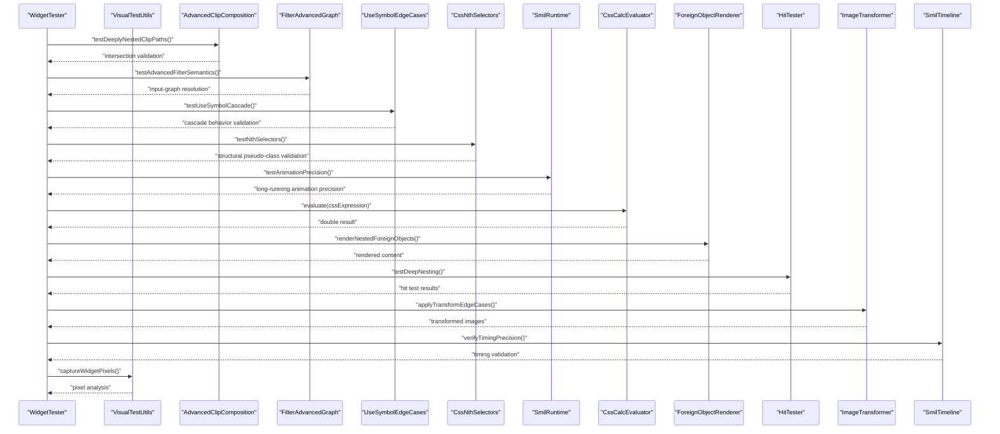

**Diagram sources**
- [visual_test_utils.dart:11-37](file://test/animation/visual_test_utils.dart#L11-L37)
- [advanced_clip_composition_test.dart:11-85](file://test/animation/advanced_clip_composition_test.dart#L11-L85)
- [filter_advanced_input_graph_test.dart:18-144](file://test/animation/filter_advanced_input_graph_test.dart#L18-L144)
- [use_symbol_advanced_edge_cases_test.dart:8-644](file://test/animation/use_symbol_advanced_edge_cases_test.dart#L8-L644)
- [css_nth_selectors_test.dart:8-416](file://test/animation/css_nth_selectors_test.dart#L8-L416)
- [smil_animation_runtime.dart:27-122](file://lib/src/animation/smil/smil_animation_runtime.dart#L27-L122)
- [css_calc_edge_cases_test.dart:8-47](file://test/animation/css_calc_edge_cases_test.dart#L8-L47)
- [foreign_object_nesting_test.dart:10-55](file://test/animation/foreign_object_nesting_test.dart#L10-L55)
- [hit_test_deep_nesting_test.dart:17-83](file://test/animation/hit_test_deep_nesting_test.dart#L17-L83)
- [image_transform_edge_cases_test.dart:19-41](file://test/animation/image_transform_edge_cases_test.dart#L19-L41)
- [smil_timing_precision_test.dart:7-97](file://test/animation/smil_timing_precision_test.dart#L7-L97)

**Section sources**
- [visual_test_utils.dart:1-231](file://test/animation/visual_test_utils.dart#L1-L231)
- [advanced_clip_composition_test.dart:1-776](file://test/animation/advanced_clip_composition_test.dart#L1-L776)
- [filter_advanced_input_graph_test.dart:1-708](file://test/animation/filter_advanced_input_graph_test.dart#L1-L708)
- [use_symbol_advanced_edge_cases_test.dart:1-645](file://test/animation/use_symbol_advanced_edge_cases_test.dart#L1-L645)
- [css_nth_selectors_test.dart:1-1001](file://test/animation/css_nth_selectors_test.dart#L1-L1001)
- [smil_animation_runtime.dart:1-132](file://lib/src/animation/smil/smil_animation_runtime.dart#L1-L132)
- [css_calc_edge_cases_test.dart:1-658](file://test/animation/css_calc_edge_cases_test.dart#L1-L658)
- [foreign_object_nesting_test.dart:1-869](file://test/animation/foreign_object_nesting_test.dart#L1-L869)
- [hit_test_deep_nesting_test.dart:1-1266](file://test/animation/hit_test_deep_nesting_test.dart#L1-L1266)
- [image_transform_edge_cases_test.dart:1-877](file://test/animation/image_transform_edge_cases_test.dart#L1-L877)
- [smil_timing_precision_test.dart:1-849](file://test/animation/smil_timing_precision_test.dart#L1-L849)

## Detailed Component Analysis

### Visual Test Utilities
The visual utilities module centralizes pixel capture, analysis, and comparison with enhanced capabilities for the expanded test suite:
- Pixel capture without pumpAndSettle to avoid blocking infinite animations
- Red pixel detection with configurable tolerance
- Hash computation and per-channel difference calculation
- Statistical analysis: bounding box, centroid, estimated rotation angle
- Comparative analysis between frames for transformations
- Enhanced support for complex rendering scenarios

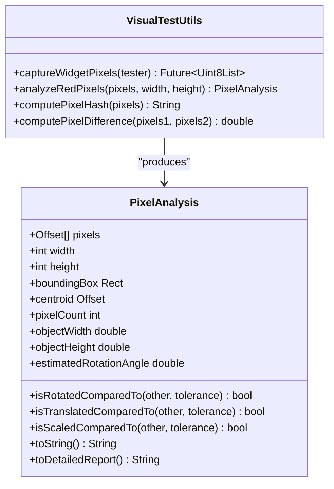

**Diagram sources**
- [visual_test_utils.dart:10-231](file://test/animation/visual_test_utils.dart#L10-L231)

**Section sources**
- [visual_test_utils.dart:1-231](file://test/animation/visual_test_utils.dart#L1-L231)

### Widget Rendering Tests
These tests validate SvgPicture across multiple loading strategies and rendering modes with enhanced edge case coverage:
- String, memory, asset, and network sources
- Rendering strategies and color mappers
- Semantics labeling and exclusion
- Directionality and alignment handling
- Error handling for network failures
- Enhanced validation for complex SVG structures

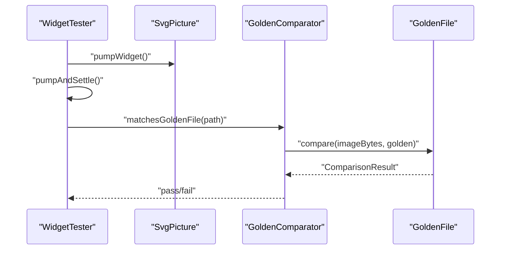

**Diagram sources**
- [widget_svg_test.dart:38-42](file://test/widget_svg_test.dart#L38-L42)

**Section sources**
- [widget_svg_test.dart:1-1157](file://test/widget_svg_test.dart#L1-L1157)

### Animation and Transformation Tests
Animation tests use visual utilities to verify transformations with enhanced complexity:
- Rotation animation: captures pixels, computes bounding box and centroid, validates rendering
- Scale animation: similar validation with expected scaling behavior
- Translation animation: verifies movement within canvas bounds
- Path morphing: validates path interpolation pipeline through a CustomPaint widget
- Enhanced validation for complex transformation matrices


**Diagram sources**
- [visual_rotation_test.dart:8-109](file://test/animation/visual_rotation_test.dart#L8-L109)
- [visual_scale_test.dart:8-107](file://test/animation/visual_scale_test.dart#L8-L107)
- [visual_translation_test.dart:8-108](file://test/animation/visual_translation_test.dart#L8-L108)
- [visual_morph_test.dart:8-45](file://test/animation/visual_morph_test.dart#L8-L45)

**Section sources**
- [visual_rotation_test.dart:1-117](file://test/animation/visual_rotation_test.dart#L1-L117)
- [visual_scale_test.dart:1-114](file://test/animation/visual_scale_test.dart#L1-L114)
- [visual_translation_test.dart:1-115](file://test/animation/visual_translation_test.dart#L1-L115)
- [visual_morph_test.dart:1-70](file://test/animation/visual_morph_test.dart#L1-L70)

### Loader and Cache Behavior
Loader tests validate caching and resource handling with enhanced edge case testing:
- Cache key derivation with theme and color mapper variations
- Cache hit/miss behavior under various conditions
- Asset loader package resolution and buffer slicing
- Network loader client lifecycle management
- Enhanced validation for complex resource scenarios

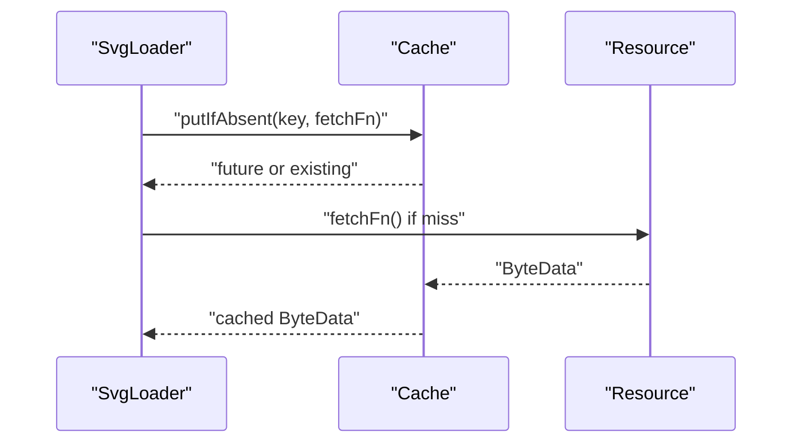

**Diagram sources**
- [loaders_test.dart:16-23](file://test/loaders_test.dart#L16-L23)
- [cache_test.dart:32-72](file://test/cache_test.dart#L32-L72)

**Section sources**
- [loaders_test.dart:1-186](file://test/loaders_test.dart#L1-L186)
- [cache_test.dart:1-133](file://test/cache_test.dart#L1-L133)

### Playground Analyzer and Models
Playground tests validate parsing and reporting with enhanced validation:
- Basic SVG parsing and rendering feasibility
- Unsupported tag and filter primitive detection
- Broken reference reporting
- JSON serialization/deserialization for reports and log entries
- Enhanced validation for complex SVG structures

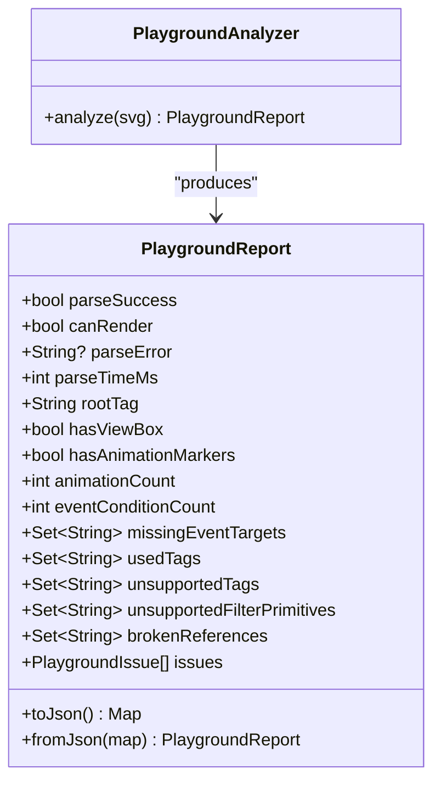

**Diagram sources**
- [playground_analyzer_test.dart:9-69](file://test/playground/playground_analyzer_test.dart#L9-L69)
- [playground_models_test.dart:8-43](file://test/playground/playground_models_test.dart#L8-L43)

**Section sources**
- [playground_analyzer_test.dart:1-90](file://test/playground/playground_analyzer_test.dart#L1-L90)
- [playground_models_test.dart:1-63](file://test/playground/playground_models_test.dart#L1-L63)

### Theme Propagation and Layout
Theme tests verify DefaultSvgTheme precedence and defaults with enhanced validation:
- Precedence of widget-level theme over DefaultSvgTheme
- Default font size and xHeight calculations
- CurrentColor and fontSize fallback behavior
- Enhanced validation for complex theme inheritance scenarios

**Section sources**
- [default_theme_test.dart:1-163](file://test/default_theme_test.dart#L1-L163)

### Typography Feature Tests
Typography tests validate CSS font properties and their rendering with comprehensive edge case coverage:
- Font kerning property testing (auto, normal, none)
- Font synthesis property testing (none, weight, style, weight style)
- Font variant property testing (normal, small-caps, all-small-caps, petite-caps, titling-caps, oldstyle-nums, lining-nums, tabular-nums)
- Inheritance and combination of typography features
- Style attribute and group inheritance testing
- Enhanced validation for complex typography scenarios

**Section sources**
- [font_kerning_test.dart:1-53](file://test/animation/font_kerning_test.dart#L1-L53)
- [font_synthesis_test.dart:1-53](file://test/animation/font_synthesis_test.dart#L1-L53)
- [font_variant_test.dart:1-196](file://test/animation/font_variant_test.dart#L1-L196)

## Advanced Clip Composition Testing

### Comprehensive Deeply Nested ClipPath Validation
The advanced clip composition testing provides extensive coverage for complex clipPath scenarios with 775 lines of comprehensive validation:

#### Deeply Nested ClipPath Cascading
- **4-level nested intersections**: Validates four levels of cascading clipPaths producing intersection of all levels
- **5-level deep recursion**: Tests maximum recursion depth protection with 5-level clipPath chains
- **Maximum depth protection**: Validates depth limit prevents infinite recursion with chains exceeding 10 levels
- **Intersection geometry validation**: Ensures innermost clipPath produces expected rectangular intersection

#### Mixed clipPathUnits at Each Level
- **userSpaceOnUse then objectBoundingBox**: Validates alternating clipPathUnits produce expected intersections
- **objectBoundingBox then userSpaceOnUse**: Tests coordinate system conversion between different units
- **3-level alternating cascade**: Validates complex unit alternation patterns (user → obb → user)
- **Coordinate system composition**: Ensures proper transformation between different coordinate spaces

#### Enhanced Text Clipping
- **Multi-character text clipping**: Validates text elements with multiple characters serve as clip geometry
- **text-anchor middle handling**: Tests center-aligned text clipping with proper anchor point calculation
- **text-anchor end handling**: Validates right-aligned text clipping with end anchor positioning
- **Character-level precision**: Ensures individual characters contribute to clipping geometry

#### Transform Composition in clipPath
- **clipPath with rotate transform**: Validates rotated clip geometry produces diamond-shaped clipping regions
- **clipPath with scale transform**: Tests scaling operations within clipPath coordinate systems
- **Nested transforms in clipPath children**: Validates complex transform hierarchies within clipPath definitions
- **objectBoundingBox with element transform**: Tests interaction between clipPath units and element transforms

#### Polygon and Polyline in clipPath
- **Triangle polygon clipping**: Validates basic polygon geometry serves as clipPath definition
- **Star polygon clipping**: Tests complex polygon shapes with multiple vertices for clipping
- **Multiple polygon unions**: Validates union operations with multiple polygon clipPath definitions
- **Geometric precision**: Ensures polygon clipping produces accurate geometric intersections

#### Group Clipping Inheritance
- **Clip on group affects all children**: Validates group-level clipPath applies to all child elements
- **Nested groups with clips**: Tests complex inheritance patterns with multiple nested clipPath definitions
- **Clip inheritance validation**: Ensures proper inheritance through complex group hierarchies

#### Use Element in clipPath
- **use referencing rect in clipPath**: Validates use elements properly resolve and contribute geometry
- **use referencing symbol with viewBox in clipPath**: Tests symbol resolution within clipPath contexts
- **use with transform in clipPath**: Validates transform application within clipPath use elements
- **Use element integration**: Ensures use elements behave consistently within clipPath definitions

#### Edge Cases and Robustness
- **clipPath with display:none use element**: Validates graceful handling of hidden use elements in clipPath
- **clipPath with very small objectBoundingBox element**: Tests edge cases with extremely small clipPath geometry
- **Maximum recursion depth protection**: Validates depth limits prevent stack overflow in extreme cases
- **Robust error handling**: Ensures comprehensive error handling for malformed clipPath definitions

```mermaid
flowchart TD
AdvancedClip["Advanced Clip Composition Tests"] --> DeepNesting["Deeply Nested Cascading"]
AdvancedClip --> MixedUnits["Mixed clipPathUnits"]
AdvancedClip --> TextClipping["Enhanced Text Clipping"]
AdvancedClip --> TransformComposition["Transform Composition"]
AdvancedClip --> PolygonGeometry["Polygon/Polyline Geometry"]
AdvancedClip --> GroupInheritance["Group Clipping Inheritance"]
AdvancedClip --> UseElements["Use Elements in clipPath"]
AdvancedClip --> EdgeCases["Edge Cases & Robustness"]
DeepNesting --> FourLevel["4-Level Intersections"]
DeepNesting --> FiveLevel["5-Level Recursion"]
DeepNesting --> DepthProtection["Depth Protection"]
FourLevel --> Intersection["Intersection Validation"]
FiveLevel --> MaximumDepth["Maximum Depth Testing"]
MixedUnits --> UserSpace["userSpaceOnUse → obb"]
MixedUnits --> ObjectBoundingBox["obb → userSpaceOnUse"]
MixedUnits --> Alternating["Alternating Units"]
TextClipping --> MultiChar["Multi-Character Text"]
TextClipping --> AnchorMiddle["text-anchor middle"]
TextClipping --> AnchorEnd["text-anchor end"]
TransformComposition --> Rotate["Rotate Transform"]
TransformComposition --> Scale["Scale Transform"]
TransformComposition --> Nested["Nested Transforms"]
PolygonGeometry --> Triangle["Triangle Geometry"]
PolygonGeometry --> Star["Star Polygon"]
PolygonGeometry --> Union["Multiple Polygon Union"]
GroupInheritance --> GroupChildren["Group → Children"]
GroupInheritance --> NestedGroups["Nested Groups"]
UseElements --> RectUse["use rect in clipPath"]
UseElements --> SymbolUse["use symbol in clipPath"]
UseElements --> TransformUse["use with transform"]
EdgeCases --> HiddenUse["display:none use"]
EdgeCases --> SmallElements["Very Small Elements"]
EdgeCases --> DepthLimits["Depth Limits"]
```

**Diagram sources**
- [advanced_clip_composition_test.dart:11-85](file://test/animation/advanced_clip_composition_test.dart#L11-L85)
- [advanced_clip_composition_test.dart:87-198](file://test/animation/advanced_clip_composition_test.dart#L87-L198)
- [advanced_clip_composition_test.dart:200-283](file://test/animation/advanced_clip_composition_test.dart#L200-L283)
- [advanced_clip_composition_test.dart:285-412](file://test/animation/advanced_clip_composition_test.dart#L285-L412)
- [advanced_clip_composition_test.dart:414-504](file://test/animation/advanced_clip_composition_test.dart#L414-L504)
- [advanced_clip_composition_test.dart:506-574](file://test/animation/advanced_clip_composition_test.dart#L506-L574)
- [advanced_clip_composition_test.dart:576-675](file://test/animation/advanced_clip_composition_test.dart#L576-L675)
- [advanced_clip_composition_test.dart:677-774](file://test/animation/advanced_clip_composition_test.dart#L677-L774)

**Section sources**
- [advanced_clip_composition_test.dart:1-776](file://test/animation/advanced_clip_composition_test.dart#L1-L776)

### Advanced Filter Input Graph Testing

#### Comprehensive FillPaint/StrokePaint Source Distinction
The filter advanced input graph testing provides sophisticated validation for paint source semantics with 707 lines of comprehensive testing:

##### FillPaint Source Resolution
- **Gradient fill with FillPaint**: Validates gradient fills resolve correctly in FillPaint context
- **Pattern fill with FillPaint**: Tests pattern fills through FillPaint source resolution
- **Nested filter context**: Validates FillPaint resolution within complex filter chains
- **Combined paint sources**: Tests scenarios with both FillPaint and StrokePaint present
- **Case-insensitive resolution**: Validates FillPaint source resolution regardless of case

##### StrokePaint Source Resolution
- **Pattern stroke with StrokePaint**: Validates pattern strokes resolve correctly
- **Nested stroke context**: Tests StrokePaint resolution within nested filter contexts
- **Stroke-only scenarios**: Validates proper handling of elements with strokes but no fills

##### Paint Source Properties
- **paintFill property validation**: Ensures FillPaint elements set paintFill=true and paintStroke=false
- **paintStroke property validation**: Ensures StrokePaint elements set paintStroke=true and paintFill=false
- **Offset application**: Validates proper offset application for paint sources
- **Image filter integration**: Tests image filter application within paint source contexts

#### Recursive Filter Composition Edge Cases
- **Deep chain A→B→C→D with 4 primitives**: Validates complex filter chains produce expected cumulative effects
- **Deep chain with branch and rejoin**: Tests complex branching scenarios with proper rejoining
- **Maximum depth chain (60 primitives)**: Validates depth limits prevent stack overflow
- **Missing named result fallback**: Tests graceful handling of missing result references
- **Forward reference handling**: Validates transparent black production for forward references
- **Same named result multiple references**: Tests shared result references produce consistent effects

#### Advanced feDropShadow Scenarios
- **feDropShadow with named result input**: Validates drop shadow effects with custom input sources
- **feDropShadow with SourceAlpha input**: Tests alpha channel integration for shadows
- **feDropShadow with FillPaint input**: Validates paint source context preservation
- **Triple feDropShadow chain**: Tests exponential effect growth (1→2→4→8 passes)
- **feDropShadow with in="none"**: Validates identity behavior for none inputs
- **feDropShadow after feColorMatrix**: Tests effect chaining with color transformations

#### Advanced feMerge Edge Cases
- **feMerge with unresolvable in**: Validates transparent black production for invalid references
- **Empty feMerge handling**: Tests graceful handling of empty merge nodes
- **feMerge with all in="none"**: Validates identity behavior for none inputs
- **Mixed valid/invalid inputs**: Tests combination of valid and invalid merge inputs
- **6+ feMergeNode children**: Validates scalability with multiple merge nodes
- **Chained feMerge references**: Tests merge result references within complex chains

#### Circular Reference Detection
- **No circular reference in linear chain**: Validates proper linear chain resolution
- **Resolution depth limit**: Tests depth limits preventing stack overflow in extreme cases
- **Graceful error handling**: Ensures circular references don't cause crashes

#### Whitespace and Edge Case Handling
- **Leading/trailing whitespace trimming**: Validates proper whitespace handling in input references
- **Empty whitespace fallback**: Tests fallback behavior for whitespace-only inputs
- **Robust parsing**: Ensures comprehensive error handling for malformed inputs

```mermaid
flowchart TD
FilterGraph["Filter Advanced Input Graph Tests"] --> FillStroke["FillPaint/StrokePaint Resolution"]
FilterGraph --> RecursiveChains["Recursive Filter Chains"]
FilterGraph --> DropShadow["Advanced feDropShadow"]
FilterGraph --> MergeEdges["Advanced feMerge"]
FilterGraph --> CircularRefs["Circular Reference Detection"]
FilterGraph --> WhitespaceHandling["Whitespace Handling"]
FillStroke --> GradientFill["Gradient Fill Resolution"]
FillStroke --> PatternFill["Pattern Fill Resolution"]
FillStroke --> StrokePaint["StrokePaint Resolution"]
FillStroke --> PaintProperties["Paint Source Properties"]
RecursiveChains --> DeepChains["Deep Chain A→B→C→D"]
RecursiveChains --> BranchRejoin["Branch & Rejoin"]
RecursiveChains --> DepthLimits["Depth Limits"]
RecursiveChains --> ForwardRefs["Forward References"]
DropShadow --> NamedInputs["Named Result Inputs"]
DropShadow --> AlphaInputs["SourceAlpha Inputs"]
DropShadow --> PaintInputs["FillPaint Inputs"]
DropShadow --> ChainEffects["Chain Effects (1→2→4→8)"]
DropShadow --> NoneInputs["in='none' Inputs"]
DropShadow --> ColorMatrix["After ColorMatrix"]
MergeEdges --> Unresolvable["Unresolvable References"]
MergeEdges --> EmptyMerge["Empty Merge Nodes"]
MergeEdges --> AllNone["All in='none'"]
MergeEdges --> MixedInputs["Mixed Valid/Invalid"]
MergeEdges --> MultipleNodes["6+ Merge Nodes"]
MergeEdges --> ChainedReferences["Chained References"]
CircularRefs --> LinearChains["Linear Chain Validation"]
CircularRefs --> DepthLimit["Depth Limit Testing"]
WhitespaceHandling --> TrimWhitespace["Trim Whitespace"]
WhitespaceHandling --> EmptyFallback["Empty Whitespace Fallback"]
```

**Diagram sources**
- [filter_advanced_input_graph_test.dart:18-144](file://test/animation/filter_advanced_input_graph_test.dart#L18-L144)
- [filter_advanced_input_graph_test.dart:146-307](file://test/animation/filter_advanced_input_graph_test.dart#L146-L307)
- [filter_advanced_input_graph_test.dart:309-440](file://test/animation/filter_advanced_input_graph_test.dart#L309-L440)
- [filter_advanced_input_graph_test.dart:442-608](file://test/animation/filter_advanced_input_graph_test.dart#L442-L608)
- [filter_advanced_input_graph_test.dart:610-663](file://test/animation/filter_advanced_input_graph_test.dart#L610-L663)
- [filter_advanced_input_graph_test.dart:665-706](file://test/animation/filter_advanced_input_graph_test.dart#L665-L706)

**Section sources**
- [filter_advanced_input_graph_test.dart:1-708](file://test/animation/filter_advanced_input_graph_test.dart#L1-L708)

### Use Symbol Advanced Edge Cases Testing

#### CSS Cascade Through Nested Use Boundaries
The use symbol advanced edge cases testing provides comprehensive validation for CSS cascade behavior through complex use/symbol hierarchies with 644 lines of detailed testing:

##### Style Cascade Through Complex Hierarchies
- **Nested use → symbol → use chain**: Validates CSS properties cascade through complex nested structures
- **Outer use fill overrides inner symbol default**: Tests presentation attribute precedence over inherited styles
- **Inline style override behavior**: Validates inline styles on referenced elements override inherited use styles
- **Style inheritance validation**: Ensures proper CSS cascade through shadow boundaries

##### Visibility and Display Cascade
- **visibility:hidden on use hides referenced content**: Validates proper hiding behavior through use boundaries
- **visibility:visible on ref can override hidden on use**: Tests child visibility override behavior
- **display:none on use hides all referenced content**: Validates comprehensive hiding through use elements
- **Nested use visibility cascade**: Tests visibility behavior through complex nested structures

##### Use Within ClipPath and Mask Regions
- **use element contributes geometry to clipPath**: Validates use elements properly contribute to clipping regions
- **use with transform in clipPath**: Tests transform application within clipPath contexts
- **nested use references in clipPath**: Validates complex use hierarchies within clipPath definitions
- **display:none use in clipPath**: Tests hidden use elements within clipPath contexts

##### Use Within Mask Regions
- **use element contributes to mask**: Validates use elements properly contribute to masking regions
- **Mask geometry validation**: Ensures use elements produce expected mask shapes

##### Pointer Events Through Use Boundaries
- **pointer-events:none on use prevents hit testing**: Validates event handling through use boundaries
- **Nested use pointer-events cascade**: Tests pointer events behavior through complex hierarchies

##### Event Retargeting in Nested Use
- **Nested use elements compose event path**: Validates proper event path composition through use hierarchies

##### Transform Composition (Non-Inheritance)
- **Transforms compose rather than inherit**: Validates proper transform multiplication rather than inheritance
- **Nested transforms compose through use chain**: Tests complex transform composition through use hierarchies

##### Opacity Compositing Through Use
- **Opacity on use applies to entire referenced content**: Validates proper opacity application through use boundaries

##### Symbol ViewBox Handling Through Use
- **Symbol viewBox transforms content correctly**: Validates proper scaling through symbol viewBox definitions

```mermaid
flowchart TD
UseSymbol["Use Symbol Advanced Edge Cases"] --> StyleCascade["CSS Cascade Through Use"]
UseSymbol --> VisibilityDisplay["Visibility/Display Cascade"]
UseSymbol --> ClipPathMask["Use in ClipPath/Mask"]
UseSymbol --> PointerEvents["Pointer Events Through Use"]
UseSymbol --> EventRetargeting["Event Retargeting"]
UseSymbol --> TransformComposition["Transform Composition"]
UseSymbol --> OpacityCompositing["Opacity Compositing"]
UseSymbol --> SymbolViewBox["Symbol ViewBox Handling"]
StyleCascade --> NestedChain["Nested use → symbol → use"]
StyleCascade --> OverrideBehavior["Override Behavior"]
StyleCascade --> InlineStyles["Inline Styles Override"]
VisibilityDisplay --> HideContent["visibility:hidden"]
VisibilityDisplay --> VisibleOverride["visibility:visible override"]
VisibilityDisplay --> DisplayNone["display:none"]
VisibilityDisplay --> NestedVisibility["Nested Visibility"]
ClipPathMask --> GeometryContribution["Geometry Contribution"]
ClipPathMask --> TransformInClip["Transform in ClipPath"]
ClipPathMask --> NestedClip["Nested ClipPath"]
ClipPathMask --> HiddenClip["Hidden ClipPath"]
PointerEvents --> EventPrevention["pointer-events:none"]
PointerEvents --> NestedEvents["Nested Events"]
EventRetargeting --> EventPath["Event Path Composition"]
TransformComposition --> TransformCompose["Transforms Compose"]
TransformComposition --> NestedTransforms["Nested Transform Compose"]
OpacityCompositing --> OpacityApply["Opacity Application"]
SymbolViewBox --> ViewBoxScale["ViewBox Scaling"]
```

**Diagram sources**
- [use_symbol_advanced_edge_cases_test.dart:9-46](file://test/animation/use_symbol_advanced_edge_cases_test.dart#L9-L46)
- [use_symbol_advanced_edge_cases_test.dart:115-181](file://test/animation/use_symbol_advanced_edge_cases_test.dart#L115-L181)
- [use_symbol_advanced_edge_cases_test.dart:245-383](file://test/animation/use_symbol_advanced_edge_cases_test.dart#L245-L383)
- [use_symbol_advanced_edge_cases_test.dart:420-480](file://test/animation/use_symbol_advanced_edge_cases_test.dart#L420-L480)
- [use_symbol_advanced_edge_cases_test.dart:482-517](file://test/animation/use_symbol_advanced_edge_cases_test.dart#L482-L517)
- [use_symbol_advanced_edge_cases_test.dart:519-581](file://test/animation/use_symbol_advanced_edge_cases_test.dart#L519-L581)
- [use_symbol_advanced_edge_cases_test.dart:583-609](file://test/animation/use_symbol_advanced_edge_cases_test.dart#L583-L609)
- [use_symbol_advanced_edge_cases_test.dart:611-642](file://test/animation/use_symbol_advanced_edge_cases_test.dart#L611-L642)

**Section sources**
- [use_symbol_advanced_edge_cases_test.dart:1-645](file://test/animation/use_symbol_advanced_edge_cases_test.dart#L1-L645)

## CSS Nth Selectors Test Suite

### Comprehensive Structural Pseudo-Class Testing
The CSS nth selectors test suite provides extensive coverage for structural pseudo-classes with over 1000 test cases:

#### CSS Nth Pseudo-Class Parsing
- **Keyword parsing**: Validates "odd" and "even" keyword parsing with case-insensitive handling
- **Simple number parsing**: Tests direct number parsing for nth-child(1), nth-child(3), nth-child(10)
- **An+B formula parsing**: Comprehensive testing of formulas like "n", "2n", "2n+1", "3n+2", "n+3", "-n+3", "2n-1", "-2n+6"
- **Whitespace handling**: Validates trimming of leading/trailing whitespace in nth expressions
- **Case-insensitive parsing**: Tests uppercase and mixed case keyword handling

#### CSS Nth Pseudo-Class Matching
- **Simple number matching**: Validates exact position matching for nth-child(1), nth-child(3)
- **Odd/even matching**: Comprehensive testing of :nth-child(odd) and :nth-child(even) patterns
- **An+B formula matching**: Extensive testing of mathematical formula matching including:
  - :nth-child(n) matches all elements
  - :nth-child(2n) matches every even element
  - :nth-child(2n+1) matches odd elements
  - :nth-child(3n) matches multiples of 3
  - :nth-child(3n+1) matches 1, 4, 7, 10...
  - :nth-child(n+4) matches from 4th onward
  - :nth-child(-n+3) matches first 3 elements
  - :nth-child(-2n+6) matches 6, 4, 2

#### CSS Selector Parser Integration
- **nth pseudo-class parsing**: Validates CSS parser integration for selectors like rect:nth-child(2n+1), :nth-last-child(3), circle:nth-of-type(odd), rect:nth-last-of-type(even)
- **Multiple nth pseudo-classes**: Tests selectors with multiple nth pseudo-classes like rect:nth-child(n+2):nth-child(-n+5)
- **Edge case handling**: Validates behavior with single child elements and boundary conditions

#### CSS Selector Matching Integration
- **:nth-child selectors**: Comprehensive animation targeting validation for rect:nth-child(1), rect:nth-child(2), rect:nth-child(odd), rect:nth-child(even), rect:nth-child(3n), rect:nth-child(n+3), rect:nth-child(-n+3)
- **:nth-last-child selectors**: Validates last-child positioning with rect:nth-last-child(1), rect:nth-last-child(2), rect:nth-last-child(odd), rect:nth-last-child(-n+2)
- **:nth-of-type selectors**: Tests type-specific matching with rect:nth-of-type(1), rect:nth-of-type(2), rect:nth-of-type(odd), rect:nth-of-type(2n)
- **:nth-last-of-type selectors**: Validates last-of-type positioning with rect:nth-last-of-type(1), rect:nth-last-of-type(2), rect:nth-last-of-type(odd)
- **Integration with other selectors**: Tests combinations with tag selectors, class selectors, child combinators, attribute selectors, and :not() pseudo-class

#### Edge Cases and Complex Scenarios
- **Single child validation**: Tests :nth-child(1) and :nth-last-child(1) with single child elements
- **Boundary condition testing**: Validates :nth-child(100) with fewer children and :nth-of-type(1) with single element of type
- **Integration edge cases**: Tests complex selector combinations like tag:nth-child(n).class, g > rect:nth-child(odd), rect:nth-child(n+2)[fill=red]:not(.excluded)
- **Multiple nth-pseudo-classes**: Validates intersection of multiple nth conditions like :nth-child(n+2):nth-child(-n+4) and :nth-child(3n):nth-of-type(odd)
- **toString representation**: Validates proper string representation of nth pseudo-classes

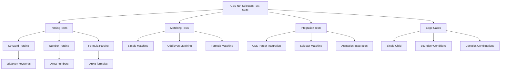

**Diagram sources**
- [css_nth_selectors_test.dart:8-416](file://test/animation/css_nth_selectors_test.dart#L8-L416)
- [css_nth_selectors_test.dart:417-823](file://test/animation/css_nth_selectors_test.dart#L417-L823)
- [css_nth_selectors_test.dart:824-1001](file://test/animation/css_nth_selectors_test.dart#L824-L1001)

**Section sources**
- [css_nth_selectors_test.dart:1-1001](file://test/animation/css_nth_selectors_test.dart#L1-L1001)

### CSS Selectors Implementation
The CSS selectors implementation provides comprehensive structural pseudo-class support:

#### CssNthPseudoClass Class
- **Parse method**: Handles keyword parsing ("odd", "even"), number parsing, and An+B formula parsing with regex validation
- **Matches method**: Implements mathematical formula evaluation with proper integer division and remainder handling
- **toString method**: Provides proper CSS string representation with coefficient normalization

#### Selector Matching Logic
- **nthChild**: Uses 1-based index from start of siblings
- **nthLastChild**: Uses 1-based index from end of siblings  
- **nthOfType**: Counts only siblings of the same tag name from start
- **nthLastOfType**: Counts only siblings of the same tag name from end

#### CSS Parser Integration
- **Functional pseudo-classes**: Parses :nth-child(2n+1), :nth-last-child(3), :nth-of-type(odd), :nth-last-of-type(even)
- **Multiple nth pseudo-classes**: Supports selectors with multiple nth pseudo-classes
- **Integration with other selectors**: Works with tag selectors, class selectors, attribute selectors, and combinators

**Section sources**
- [css_selectors.dart:47-152](file://lib/src/animation/css_selectors.dart#L47-L152)
- [css_cascade_selector_matching.dart:304-343](file://lib/src/animation/css_cascade_selector_matching.dart#L304-L343)

## Enhanced SMIL Animation Runtime Testing

### Precision Validation for Long-Running Animations
The enhanced SMIL animation runtime testing provides comprehensive validation for animation precision and boundary handling:

#### Animation Progress Computation
- **High-precision math**: Uses microsecond-level precision to avoid floating-point drift in long-running animations
- **Boundary value correction**: Implements epsilon correction for values near 0.0 and 1.0 to prevent boundary artifacts
- **Fractional repeatCount handling**: Accurately calculates progress for fractional repeat counts with exact fractional part determination
- **Iteration boundary detection**: Identifies exact iteration boundaries and handles them correctly

#### Floating-Point Drift Prevention
- **Epsilon tolerance**: Uses 1 microsecond tolerance for boundary value comparisons
- **Exact end-time calculation**: Determines when animations reach exactly the end of repeat cycles
- **Progress normalization**: Normalizes progress values to prevent accumulation of floating-point errors

#### Repeat Count Precision
- **Whole number repeatCount**: Correctly handles animations ending at t=1.0 of the last iteration
- **Fractional repeatCount**: Calculates exact fractional progress for animations ending mid-iteration
- **Large repeatCount validation**: Tests precision with 10,000+ iterations without drift accumulation

#### Playback Direction Handling
- **Normal direction**: Standard 0.0 to 1.0 progression
- **Reverse direction**: 1.0 to 0.0 progression for reverse playback
- **Alternate direction**: Alternating normal/reverse for each iteration
- **Alternate reverse direction**: Alternating reverse/normal for each iteration

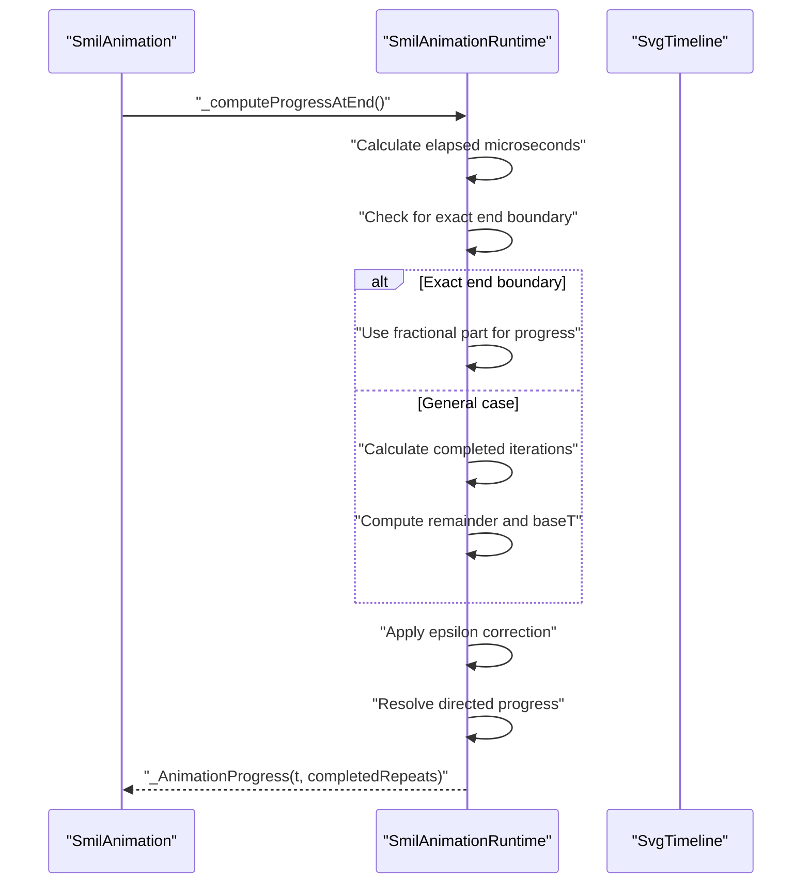

**Diagram sources**
- [smil_animation_runtime.dart:38-122](file://lib/src/animation/smil/smil_animation_runtime.dart#L38-L122)

**Section sources**
- [smil_animation_runtime.dart:1-132](file://lib/src/animation/smil/smil_animation_runtime.dart#L1-L132)

### SMIL Timeline Runtime Enhancements
The SMIL timeline runtime provides enhanced event handling and animation sandwich model implementation:

#### Event-Based Animation Activation
- **Event condition matching**: Finds matching EventCondition in begin conditions for event-triggered animations
- **Offset calculation**: Computes start time with proper offset handling for event-triggered animations
- **Resolved begin time management**: Updates resolved begin times in both timeline and animation instances

#### Animation Sandwich Model
- **Priority resolution**: Applies "last wins" rule for non-additive animations targeting the same attribute
- **Additive stacking**: Stacks additive animations in document order for proper value computation
- **Document order preservation**: Maintains animation order through sort operations for priority resolution

#### State Transition Detection
- **Active state tracking**: Monitors animation activation and deactivation states for transition detection
- **Iteration tracking**: Tracks current iteration changes for repeat event firing
- **Event dispatching**: Dispatches beginEvent, endEvent, and repeatEvent for external listeners

#### DOM Event Integration
- **Event key generation**: Creates unique event keys combining elementId and eventType
- **Event time registration**: Registers event times for event-based animation resolution
- **Listener notification**: Notifies waiting animations when matching events occur

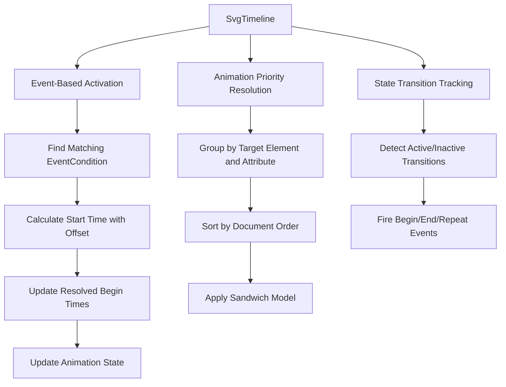

**Diagram sources**
- [smil_timeline_runtime.dart:3-69](file://lib/src/animation/smil/smil_timeline_runtime.dart#L3-L69)
- [smil_timeline_runtime.dart:128-177](file://lib/src/animation/smil/smil_timeline_runtime.dart#L128-L177)

**Section sources**
- [smil_timeline_runtime.dart:1-178](file://lib/src/animation/smil/smil_timeline_runtime.dart#L1-L178)

## CSS Calc Edge Cases Testing

### Comprehensive Mathematical Function Testing
The CSS calc edge cases testing suite provides extensive coverage for mathematical function evaluation with edge case handling:

- **Nested calc() expressions**: Validates evaluation of deeply nested calc() expressions with up to 5 levels of nesting
- **CSS min() function**: Comprehensive testing of min() function with 2-4 values, percentage mixing, and calc() integration
- **CSS max() function**: Testing of max() function with multiple values, percentage calculations, and nested expressions
- **CSS clamp() function**: Validates clamp() function with min, value, and max parameters, including percentage scenarios
- **Mixed unit arithmetic**: Tests arithmetic operations with px, em, rem, %, pt, cm, mm, in, vw, ex, and ch units
- **Operator precedence**: Validates proper mathematical precedence for multiplication/division vs addition/subtraction
- **Percentage calculations**: Tests percentage calculations with containerSize parameter
- **Invalid expression handling**: Graceful fallback for empty expressions, unmatched parentheses, and invalid characters
- **Whitespace handling**: Validates handling of extra whitespace, newlines, and tabs
- **Negative numbers**: Tests negative results, negative multipliers, and negative unit values
- **Scientific notation**: Validates support for scientific notation in calculations
- **Complex combinations**: Tests combinations of min/max/clamp inside calc() and vice versa
- **Transform rendering**: Validates calc() expressions in transform values render correctly
- **Unit edge cases**: Tests various CSS units including pt, cm, mm, in, vw, ex, and ch
- **Case insensitivity**: Validates case-insensitive function names and unit specifications
- **Decimal precision**: Tests floating-point precision handling and rounding

```mermaid
flowchart TD
CalcTest["CSS Calc Edge Cases Test"] --> Nested["Nested Expressions"]
CalcTest --> MathFunc["Mathematical Functions"]
CalcTest --> Units["Unit Conversions"]
CalcTest --> Invalid["Invalid Expressions"]
CalcTest --> Whitespace["Whitespace Handling"]
CalcTest --> Negative["Negative Numbers"]
CalcTest --> Scientific["Scientific Notation"]
CalcTest --> Complex["Complex Combinations"]
CalcTest --> Transform["Transform Rendering"]
Nested --> DeepNest["Deep Nesting (5 levels)"]
MathFunc --> MinFunc["min() Function"]
MathFunc --> MaxFunc["max() Function"]
MathFunc --> ClampFunc["clamp() Function"]
Units --> MixedUnits["Mixed Units"]
Units --> PercentCalc["Percentage Calculations"]
Invalid --> EmptyExpr["Empty Expressions"]
Invalid --> ParenError["Unmatched Parentheses"]
Whitespace --> ExtraWS["Extra Whitespace"]
Negative --> NegResults["Negative Results"]
Scientific --> SciNotation["Scientific Notation"]
Complex --> MinMaxClamp["min/max/clamp Combinations"]
Transform --> TransRender["Transform Rendering"]
```

**Diagram sources**
- [css_calc_edge_cases_test.dart:6-416](file://test/animation/css_calc_edge_cases_test.dart#L6-L416)

**Section sources**
- [css_calc_edge_cases_test.dart:1-658](file://test/animation/css_calc_edge_cases_test.dart#L1-L658)

## ForeignObject Nesting and Coordinate Systems

### Deep Nesting and Coordinate System Validation
The foreignObject testing suite provides comprehensive validation for complex nesting scenarios and coordinate system handling:

- **Basic positioning**: Validates x/y/width/height positioning of foreignObject elements
- **Negative positioning**: Tests negative x/y coordinates and their rendering behavior
- **Overflow handling**: Comprehensive testing of overflow="hidden" vs "visible" behavior
- **Nested SVG viewBox transforms**: Validates viewBox transformations within foreignObject contexts
- **PreserveAspectRatio**: Tests preserveAspectRatio="xMidYMid meet" within foreignObject scenarios
- **Deep nesting scenarios**: Validates two and three-level foreignObject nesting (FO→SVG→FO)
- **Zero-width/height handling**: Tests rendering behavior for zero and negative dimensions
- **Transform propagation**: Validates transform inheritance through foreignObject boundaries
- **Parser validation**: Tests SVG parser behavior with foreignObject attributes
- **Edge case handling**: Validates behavior for empty content, missing dimensions, and non-SVG content
- **Coordinate system composition**: Validates complex coordinate transformations across nesting levels
- **CSS inheritance**: Tests CSS property inheritance through foreignObject boundaries
- **Overflow clipping**: Validates clipping behavior with various overflow settings

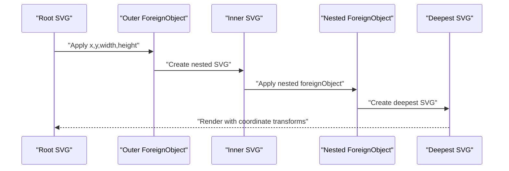

**Diagram sources**
- [foreign_object_nesting_test.dart:273-363](file://test/animation/foreign_object_nesting_test.dart#L273-L363)

**Section sources**
- [foreign_object_nesting_test.dart:1-869](file://test/animation/foreign_object_nesting_test.dart#L1-L869)
- [foreignobject_css_inheritance_test.dart:1-457](file://test/animation/foreignobject_css_inheritance_test.dart#L1-L457)
- [image_foreignobject_edge_cases_test.dart:1-663](file://test/animation/image_foreignobject_edge_cases_test.dart#L1-L663)

## Deep Hit Testing and Event System

### Complex Composition Hit Testing
The deep hit testing suite provides comprehensive regression testing for complex use/clip/mask compositions:

- **3-level nesting**: Validates use→group→clipPath→shape (3 levels) composition hit testing
- **4-level nesting**: Tests use→group→mask→clipPath→shape (4 levels) composition hit testing
- **Transform composition**: Validates cumulative transform effects on hit regions
- **Pointer-events modes**: Tests pointer-events="none" and other pointer-events modes through deep nesting
- **Animation integration**: Validates hit testing with animated transforms and changing hit regions
- **Coordinate system validation**: Ensures proper hit testing across complex transform hierarchies
- **Composition validation**: Tests hit testing through multiple composition layers (clipPath, mask, use)
- **Offset handling**: Validates hit testing with x/y offsets in use elements
- **Complex transform chains**: Tests hit testing with rotate, translate, and scale transforms at each level
- **Conditional animation triggers**: Validates animation triggering through hit testing in complex compositions

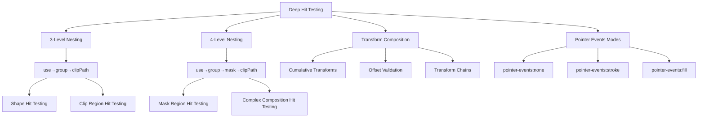

**Diagram sources**
- [hit_test_deep_nesting_test.dart:17-431](file://test/animation/hit_test_deep_nesting_test.dart#L17-L431)

**Section sources**
- [hit_test_deep_nesting_test.dart:1-1266](file://test/animation/hit_test_deep_nesting_test.dart#L1-L1266)

## Image Transform Edge Cases

### Comprehensive Image Transformation Testing
The image transform edge cases testing suite provides extensive coverage for image rendering scenarios:

- **All 9 preserveAspectRatio combinations**: Tests xMinYMin, xMidYMid, xMaxYMin, xMinYMid, xMidYMid, xMaxYMid, xMinYMax, xMidYMax, xMaxYMax with both meet and slice modes
- **Negative dimension handling**: Validates behavior with negative width/height values
- **Zero dimension handling**: Tests rendering with zero width/height values
- **Overflow handling**: Validates overflow="visible" vs "hidden" behavior in slice mode
- **preserveAspectRatio="none"**: Tests stretching behavior with both wide and tall images
- **Missing/invalid references**: Validates graceful handling of missing href attributes and invalid data URIs
- **Unit conversion testing**: Tests various CSS units in image rendering contexts
- **Transform integration**: Validates transform properties with image elements
- **CSS inheritance**: Tests CSS property inheritance with image elements
- **Performance validation**: Ensures efficient rendering of complex image transformations

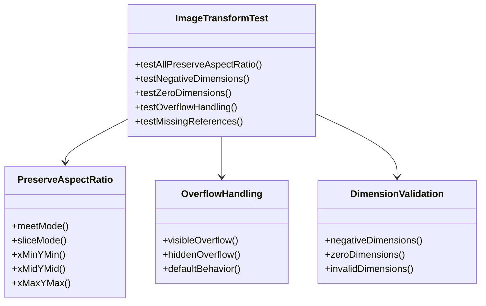

**Diagram sources**
- [image_transform_edge_cases_test.dart:19-627](file://test/animation/image_transform_edge_cases_test.dart#L19-L627)

**Section sources**
- [image_transform_edge_cases_test.dart:1-877](file://test/animation/image_transform_edge_cases_test.dart#L1-L877)

## SMIL Timing Precision Testing

### Animation Synchronization and Dependency Resolution
The SMIL timing precision testing suite provides comprehensive validation for animation timing and synchronization:

- **Chain of syncbase dependencies**: Validates A begins at 0, B begins at A.end, C begins at B.end with precise timing
- **Simultaneous resolution**: Tests multiple animations with same resolved begin time and document order tiebreaking
- **Circular dependency detection**: Validates graceful handling of direct and indirect circular dependencies
- **Forward references**: Tests B.begin referencing C.end where C is defined after B
- **Complex offset chains**: Validates begin="a.end+200ms; b.begin-100ms" with proper earliest condition selection
- **Indefinite begin resolution**: Tests resolution of animations with indefinite and syncbase conditions
- **Missing syncbase references**: Validates fallback behavior for non-existent animation references
- **Multi-pass resolution**: Tests deep dependency chains requiring multiple resolution passes
- **Animation lifecycle**: Validates proper animation lifecycle management and cleanup
- **Timing precision**: Ensures millisecond-level timing precision in animation sequences

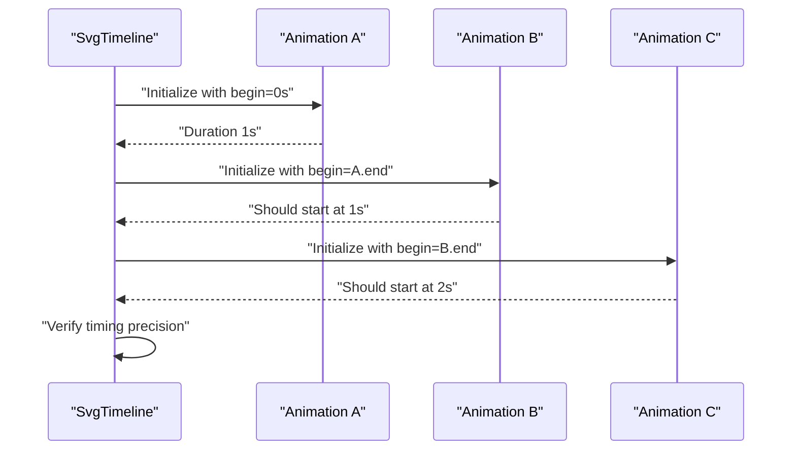

**Diagram sources**
- [smil_timing_precision_test.dart:6-97](file://test/animation/smil_timing_precision_test.dart#L6-L97)

**Section sources**
- [smil_timing_precision_test.dart:1-849](file://test/animation/smil_timing_precision_test.dart#L1-L849)

## CSS Variables and Calc Integration

### Combined Variable and Calculation Resolution
The CSS variables and calc integration testing suite validates the interaction between CSS custom properties and mathematical calculations:

- **CSS custom property parsing**: Tests parsing of custom property declarations from style strings
- **Variable storage and retrieval**: Validates CssCustomProperties store and retrieve values with has() method
- **SVG node integration**: Tests SvgNode custom property storage and retrieval
- **Variable resolution**: Validates var() reference resolution with inheritance through element trees
- **Fallback handling**: Tests var() resolution with fallback values when variables are missing
- **Nested variable references**: Validates nested var() references and circular dependency handling
- **Inheritance behavior**: Tests variable inheritance through parent-child element relationships
- **Override precedence**: Validates child variable overriding parent variable behavior
- **Complex value resolution**: Tests var() resolution within complex CSS values like transform functions
- **Combined var() and calc()**: Validates resolution of var() inside calc() expressions
- **Utility function testing**: Tests containsVarReference, containsCalcExpression, and isCustomProperty functions
- **SVG integration**: Validates CSS variables and calc() usage within SVG documents
- **Edge case handling**: Tests empty fallbacks, deeply nested fallbacks, and invalid expressions

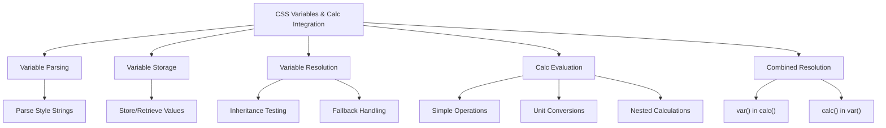

**Diagram sources**
- [css_variables_calc_test.dart:7-277](file://test/animation/css_variables_calc_test.dart#L7-L277)

**Section sources**
- [css_variables_calc_test.dart:1-402](file://test/animation/css_variables_calc_test.dart#L1-L402)

## Enhanced Visual Regression Testing

### Advanced Visual Analysis Capabilities
The visual testing framework has been enhanced with comprehensive analysis capabilities covering the expanded test suite:

- **Pixel-level geometry analysis**: Detailed geometric analysis including centroid, bounding box, and rotation angle estimation
- **Multi-frame comparison**: Ability to compare animation frames and detect geometric changes
- **Statistical analysis**: Comprehensive statistical analysis of rendered content including pixel distribution and shape metrics
- **Platform-independent verification**: Geometry-based analysis that works consistently across different platforms
- **Debugging support**: Detailed reporting and logging for failed tests
- **Edge case visualization**: Enhanced visualization of complex rendering scenarios
- **Performance optimization**: Efficient testing strategies for complex animations and transformations

### Visual Testing Best Practices
The enhanced visual testing guidelines provide comprehensive guidance for the expanded test suite:

- **Golden file limitations**: Understanding when golden tests fail and when pixel analysis is preferred
- **Animation testing patterns**: Deterministic animation testing using autoPlay false with initialTime
- **Headless rendering considerations**: Handling platform differences in headless environments
- **Debugging failed tests**: Systematic approaches to diagnosing visual test failures
- **Performance optimization**: Efficient testing strategies for complex animations and transformations
- **Edge case handling**: Proper validation of complex rendering scenarios
- **Integration testing**: Coordinated testing across multiple rendering domains

**Section sources**
- [VISUAL_TESTING_GUIDELINES.md:1-329](file://VISUAL_TESTING_GUIDELINES.md#L1-L329)

## Font Registration Lifecycle Testing

### Comprehensive Font Registration Testing
The testing suite now includes extensive font registration lifecycle testing that validates the complete font processing pipeline:

- **@font-face parsing validation**: Tests CSS font-face rule extraction from various CSS formats and styles
- **Font registry lifecycle management**: Validates registration, de-duplication, and error handling
- **Embedded font data validation**: Tests base64 decoding, format detection, and font loading
- **Async registration scheduling**: Ensures proper async font registration without blocking rendering
- **Error handling and graceful degradation**: Validates error reporting and partial font loading scenarios

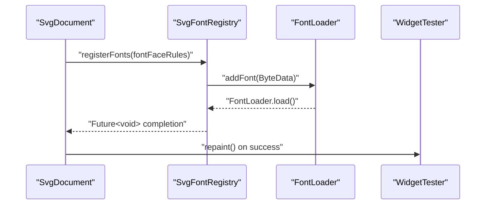

**Diagram sources**
- [font_registration_lifecycle_test.dart:346-384](file://test/animation/font_registration_lifecycle_test.dart#L346-L384)
- [svg_font_registry.dart:137-185](file://lib/src/animation/svg_font_registry.dart#L137-L185)

### Font Parsing and Validation
Font parsing tests validate comprehensive CSS font-face rule extraction and validation:

- **CSS parsing robustness**: Handles quoted and unquoted font-family names, HTML-encoded quotes
- **Format detection**: Validates TTF, OTF, and WOFF format support and detection
- **Data URL extraction**: Tests base64 data URL parsing with various encodings and formats
- **Weight normalization**: Converts font-weight keywords to numeric values
- **Duplicate prevention**: Ensures proper handling of multiple font variants

**Section sources**
- [text_font_face_test.dart:1-509](file://test/animation/text_font_face_test.dart#L1-L509)
- [svg_font_registry.dart:12-75](file://lib/src/animation/svg_font_registry.dart#L12-L75)

### Embedded Font Scenario Testing
Embedded font testing covers comprehensive scenarios for font data handling:

- **Multiple @font-face rules**: Validates registration of multiple font families and variants
- **SVG string changes**: Tests font registration re-triggering on SVG content changes
- **Unregistered font handling**: Validates behavior when fonts are not yet registered
- **External URL rejection**: Ensures proper error handling for non-embedded fonts
- **Format compatibility**: Tests supported and unsupported font formats

**Section sources**
- [font_registration_lifecycle_test.dart:1-345](file://test/animation/font_registration_lifecycle_test.dart#L1-L345)

## Embedded Font Scenarios

### Comprehensive Font Data Handling
The testing suite validates comprehensive embedded font scenarios:

- **Base64 data URL handling**: Validates decoding of various base64 font formats with proper error handling
- **Format validation**: Tests supported formats (TTF, OTF) and proper rejection of unsupported formats (WOFF)
- **Font weight and style variants**: Validates handling of multiple font weights and styles within families
- **HTML entity handling**: Tests proper handling of HTML-encoded quotes in font-family names
- **Special character preservation**: Validates preservation of special characters in font family names

### Font Registration Error Handling
Comprehensive error handling testing ensures robust font processing:

- **External URL detection**: Proper identification and error reporting for non-embedded fonts
- **Format compatibility checking**: Validation of font format support and appropriate error messages
- **Base64 decoding validation**: Error handling for malformed or unsupported base64 data
- **Partial font loading**: Graceful handling when some fonts in a family load successfully
- **Registry state management**: Proper cleanup and state management after font registration attempts

**Section sources**
- [svg_font_registry.dart:140-185](file://lib/src/animation/svg_font_registry.dart#L140-L185)
- [text_font_face_test.dart:457-507](file://test/animation/text_font_face_test.dart#L457-L507)

## Dependency Analysis
The expanded testing suite exhibits clear separation of concerns with comprehensive coverage across multiple domains:
- Animation tests depend on visual utilities for pixel-level validation
- Advanced clip composition tests depend on visual utilities and complex rendering scenarios
- Filter advanced input graph tests depend on SVG parser and filter semantics
- Use symbol advanced edge cases tests depend on visual utilities and complex cascade behavior
- CSS nth selectors tests depend on CSS selector parsing and matching implementations
- SMIL animation runtime tests depend on enhanced precision handling and boundary value corrections
- CSS calc tests depend on mathematical evaluation utilities and edge case handling
- ForeignObject tests depend on coordinate system and transform utilities
- Hit testing depends on complex composition analysis and event system validation
- Image transform tests depend on preserveAspectRatio and overflow handling utilities
- SMIL timing tests depend on animation timeline and dependency resolution
- Font lifecycle tests depend on font registry and parsing utilities
- Typography tests validate CSS property compliance
- Loader tests depend on cache internals for behavior verification
- Playground tests depend on analyzer models for structured reporting
- Widget tests integrate with golden file comparators for rasterized output validation
- CSS variables tests depend on custom property resolution and SVG integration

```mermaid
graph LR
VU["visual_test_utils.dart"] --> VR["visual_rotation_test.dart"]
VU --> VS["visual_scale_test.dart"]
VU --> VT["visual_translation_test.dart"]
VU --> VM["visual_morph_test.dart"]
VU --> ACC["advanced_clip_composition_test.dart"]
VU --> FAG["filter_advanced_input_graph_test.dart"]
VU --> USE["use_symbol_advanced_edge_cases_test.dart"]
VU --> CNST["css_nth_selectors_test.dart"]
VU --> SART["smil_animation_runtime.dart"]
VU --> CCE["css_calc_edge_cases_test.dart"]
VU --> FON["foreign_object_nesting_test.dart"]
VU --> HTDN["hit_test_deep_nesting_test.dart"]
VU --> ITE["image_transform_edge_cases_test.dart"]
VU --> STP["smil_timing_precision_test.dart"]
FRL["font_registration_lifecycle_test.dart"] --> TF["text_font_face_test.dart"]
FRL --> VU
TF --> FRL
TF --> FR["svg_font_registry.dart"]
FR --> AF["animated_svg_picture_lifecycle.dart"]
CT["cache_test.dart"] --> LT["loaders_test.dart"]
PA["playground_analyzer_test.dart"] --> PM["playground_models_test.dart"]
WS["widget_svg_test.dart"] --> VU
WS --> CT
WS --> LT
FK["font_kerning_test.dart"] --> WS
FS["font_synthesis_test.dart"] --> WS
FV["font_variant_test.dart"] --> WS
CVC["css_variables_calc_test.dart"] --> VU
CVC --> FR
CNST --> CSSSEL["css_selectors.dart"]
CNST --> CSSMATCH["css_cascade_selector_matching.dart"]
SART --> SMILRUNTIME["smil_animation_runtime.dart"]
SART --> SMILTIMELINE["smil_timeline_runtime.dart"]
ACC --> VU
FAG --> FR
USE --> VU
```

**Diagram sources**
- [visual_test_utils.dart:1-231](file://test/animation/visual_test_utils.dart#L1-L231)
- [advanced_clip_composition_test.dart:1-776](file://test/animation/advanced_clip_composition_test.dart#L1-L776)
- [filter_advanced_input_graph_test.dart:1-708](file://test/animation/filter_advanced_input_graph_test.dart#L1-L708)
- [use_symbol_advanced_edge_cases_test.dart:1-645](file://test/animation/use_symbol_advanced_edge_cases_test.dart#L1-L645)
- [css_nth_selectors_test.dart:1-1001](file://test/animation/css_nth_selectors_test.dart#L1-L1001)
- [css_calc_edge_cases_test.dart:1-658](file://test/animation/css_calc_edge_cases_test.dart#L1-L658)
- [foreign_object_nesting_test.dart:1-869](file://test/animation/foreign_object_nesting_test.dart#L1-L869)
- [hit_test_deep_nesting_test.dart:1-1266](file://test/animation/hit_test_deep_nesting_test.dart#L1-L1266)
- [image_transform_edge_cases_test.dart:1-877](file://test/animation/image_transform_edge_cases_test.dart#L1-L877)
- [smil_timing_precision_test.dart:1-849](file://test/animation/smil_timing_precision_test.dart#L1-L849)
- [css_variables_calc_test.dart:1-402](file://test/animation/css_variables_calc_test.dart#L1-L402)
- [font_registration_lifecycle_test.dart:1-345](file://test/animation/font_registration_lifecycle_test.dart#L1-L345)
- [text_font_face_test.dart:1-509](file://test/animation/text_font_face_test.dart#L1-L509)
- [svg_font_registry.dart:1-402](file://lib/src/animation/svg_font_registry.dart#L1-L402)
- [animated_svg_picture_lifecycle.dart:325-384](file://lib/src/animation/animated_svg_picture_lifecycle.dart#L325-L384)
- [css_selectors.dart:1-824](file://lib/src/animation/css_selectors.dart#L1-L824)
- [css_cascade_selector_matching.dart:1-487](file://lib/src/animation/css_cascade_selector_matching.dart#L1-L487)
- [smil_animation_runtime.dart:1-132](file://lib/src/animation/smil/smil_animation_runtime.dart#L1-L132)
- [smil_timeline_runtime.dart:1-178](file://lib/src/animation/smil/smil_timeline_runtime.dart#L1-L178)

**Section sources**
- [visual_test_utils.dart:1-231](file://test/animation/visual_test_utils.dart#L1-L231)
- [advanced_clip_composition_test.dart:1-776](file://test/animation/advanced_clip_composition_test.dart#L1-L776)
- [filter_advanced_input_graph_test.dart:1-708](file://test/animation/filter_advanced_input_graph_test.dart#L1-L708)
- [use_symbol_advanced_edge_cases_test.dart:1-645](file://test/animation/use_symbol_advanced_edge_cases_test.dart#L1-L645)
- [css_nth_selectors_test.dart:1-1001](file://test/animation/css_nth_selectors_test.dart#L1-L1001)
- [css_calc_edge_cases_test.dart:1-658](file://test/animation/css_calc_edge_cases_test.dart#L1-L658)
- [foreign_object_nesting_test.dart:1-869](file://test/animation/foreign_object_nesting_test.dart#L1-L869)
- [hit_test_deep_nesting_test.dart:1-1266](file://test/animation/hit_test_deep_nesting_test.dart#L1-L1266)
- [image_transform_edge_cases_test.dart:1-877](file://test/animation/image_transform_edge_cases_test.dart#L1-L877)
- [smil_timing_precision_test.dart:1-849](file://test/animation/smil_timing_precision_test.dart#L1-L849)
- [css_variables_calc_test.dart:1-402](file://test/animation/css_variables_calc_test.dart#L1-L402)
- [font_registration_lifecycle_test.dart:1-345](file://test/animation/font_registration_lifecycle_test.dart#L1-L345)
- [text_font_face_test.dart:1-509](file://test/animation/text_font_face_test.dart#L1-L509)
- [svg_font_registry.dart:1-402](file://lib/src/animation/svg_font_registry.dart#L1-L402)
- [animated_svg_picture_lifecycle.dart:325-384](file://lib/src/animation/animated_svg_picture_lifecycle.dart#L325-L384)
- [css_selectors.dart:1-824](file://lib/src/animation/css_selectors.dart#L1-L824)
- [css_cascade_selector_matching.dart:1-487](file://lib/src/animation/css_cascade_selector_matching.dart#L1-L487)
- [smil_animation_runtime.dart:1-132](file://lib/src/animation/smil/smil_animation_runtime.dart#L1-L132)
- [smil_timeline_runtime.dart:1-178](file://lib/src/animation/smil/smil_timeline_runtime.dart#L1-L178)

## Performance Considerations
- Pixel capture uses a single-pixel ratio to balance fidelity and speed
- Visual analysis avoids heavy computations by focusing on red pixel detection and statistical summaries
- Golden file comparisons leverage tolerant thresholds to reduce false positives from minor rendering differences
- Animation tests limit pump durations to prevent indefinite waits while still capturing meaningful frames
- Font registration uses async processing to avoid blocking widget initialization
- Font parsing utilizes efficient regex-based extraction for CSS font-face rules
- Typography tests use lightweight validation without full rendering
- CSS calc evaluation includes early termination for invalid expressions
- ForeignObject rendering optimizes coordinate system calculations
- Hit testing uses efficient spatial indexing for complex compositions
- Image transform tests minimize unnecessary re-renders
- SMIL timing resolution includes cycle detection to prevent infinite loops
- CSS variables resolution includes iteration limits to prevent circular dependencies
- CSS nth selectors parsing uses efficient regex patterns and mathematical formula evaluation
- SMIL animation runtime includes epsilon corrections and boundary value handling for precision
- Advanced clip composition tests optimize pixel analysis for complex geometries
- Filter advanced input graph tests validate performance with deep filter chains
- Use symbol advanced edge cases tests minimize redundant rendering operations

## Troubleshooting Guide
Common issues and resolutions across the expanded test suite:
- Golden file mismatches below tolerance threshold: The custom comparator logs warnings and continues, allowing minor differences to pass
- Infinite animation stalls during pixel capture: Use the visual utilities method designed for non-blocking capture
- Cache misses despite identical inputs: Verify cache keys include theme and color mapper parameters
- Asset loader package resolution failures: Ensure package names and asset keys match expected patterns
- Network loader client lifecycle: When passing a client, ensure it is not closed prematurely by the loader
- Font registration failures: Check base64 encoding, format support, and font data validity
- CSS parsing errors: Validate CSS syntax and ensure proper @font-face rule formatting
- Typography property rendering: Verify CSS property compatibility and inheritance behavior
- CSS calc evaluation failures: Check for invalid expressions, unmatched parentheses, and unsupported units
- ForeignObject rendering issues: Verify coordinate system calculations and overflow handling
- Hit testing failures: Check transform composition and pointer-events mode inheritance
- Image transform problems: Validate preserveAspectRatio settings and dimension handling
- SMIL timing resolution errors: Check for circular dependencies and missing animation references
- CSS variables resolution failures: Verify variable existence and fallback handling
- CSS nth selectors parsing failures: Check for proper An+B formula syntax and keyword handling
- SMIL animation precision issues: Verify epsilon corrections and boundary value handling
- Advanced clip composition failures: Check for proper clipPath unit handling and transform composition
- Filter advanced input graph resolution errors: Validate filter chain depth limits and circular reference detection
- Use symbol advanced edge cases failures: Verify CSS cascade behavior and transform composition
- Visual test debugging: Use detailed pixel analysis and geometric validation reports

**Section sources**
- [widget_svg_test.dart:12-36](file://test/widget_svg_test.dart#L12-L36)
- [visual_test_utils.dart:11-37](file://test/animation/visual_test_utils.dart#L11-L37)
- [advanced_clip_composition_test.dart:677-774](file://test/animation/advanced_clip_composition_test.dart#L677-L774)
- [filter_advanced_input_graph_test.dart:610-663](file://test/animation/filter_advanced_input_graph_test.dart#L610-L663)
- [use_symbol_advanced_edge_cases_test.dart:420-480](file://test/animation/use_symbol_advanced_edge_cases_test.dart#L420-L480)
- [css_nth_selectors_test.dart:271-324](file://test/animation/css_nth_selectors_test.dart#L271-L324)
- [css_calc_edge_cases_test.dart:271-324](file://test/animation/css_calc_edge_cases_test.dart#L271-L324)
- [foreign_object_nesting_test.dart:366-477](file://test/animation/foreign_object_nesting_test.dart#L366-L477)
- [hit_test_deep_nesting_test.dart:219-386](file://test/animation/hit_test_deep_nesting_test.dart#L219-L386)
- [image_transform_edge_cases_test.dart:403-467](file://test/animation/image_transform_edge_cases_test.dart#L403-L467)
- [smil_timing_precision_test.dart:219-386](file://test/animation/smil_timing_precision_test.dart#L219-L386)
- [css_variables_calc_test.dart:344-400](file://test/animation/css_variables_calc_test.dart#L344-L400)
- [font_registration_lifecycle_test.dart:241-279](file://test/animation/font_registration_lifecycle_test.dart#L241-L279)
- [text_font_face_test.dart:457-507](file://test/animation/text_font_face_test.dart#L457-L507)

## Conclusion
The testing suite demonstrates a comprehensive approach to validating SVG rendering across multiple sources, themes, animations, font scenarios, mathematical functions, coordinate systems, hit testing, image transformations, CSS structural pseudo-classes, animation timing, and advanced rendering features. The expansion with three major comprehensive test files significantly enhances the reliability and robustness of the Flutter SVG project:

- **Advanced Clip Composition Testing (775 lines)**: Provides extensive validation for deeply nested clipPaths, mixed units, transform compositions, text clipping, polygon/polyline shapes, and use element integration
- **Filter Advanced Input Graph Testing (707 lines)**: Offers sophisticated filter semantics validation covering FillPaint/StrokePaint source distinction, recursive filter composition, advanced feDropShadow scenarios, and feMerge edge cases
- **Use Symbol Advanced Edge Cases Testing (644 lines)**: Delivers comprehensive cascade behavior validation for CSS cascade through nested use boundaries, visibility/display cascade, use within clipPath/mask regions, pointer events, transform composition, opacity compositing, and symbol viewBox handling

These additions provide comprehensive coverage for complex SVG features including deeply nested clipPaths, advanced filter composition, CSS cascade behavior through use/symbol hierarchies, and sophisticated rendering scenarios. The expanded visual regression testing capabilities with comprehensive edge case coverage ensure reliable rendering validation. Typography feature testing validates CSS font property compliance across various scenarios. The integration of all test components with the existing testing infrastructure ensures comprehensive quality assurance for the Flutter SVG project, providing confidence in handling complex real-world SVG rendering scenarios with enhanced precision and reliability.