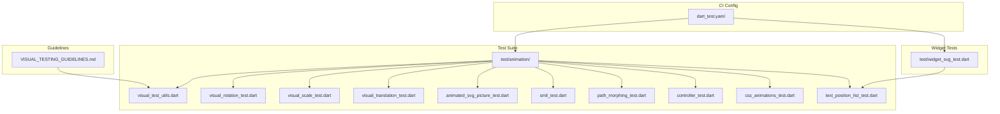
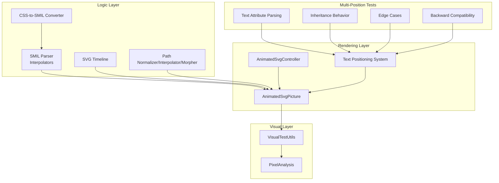
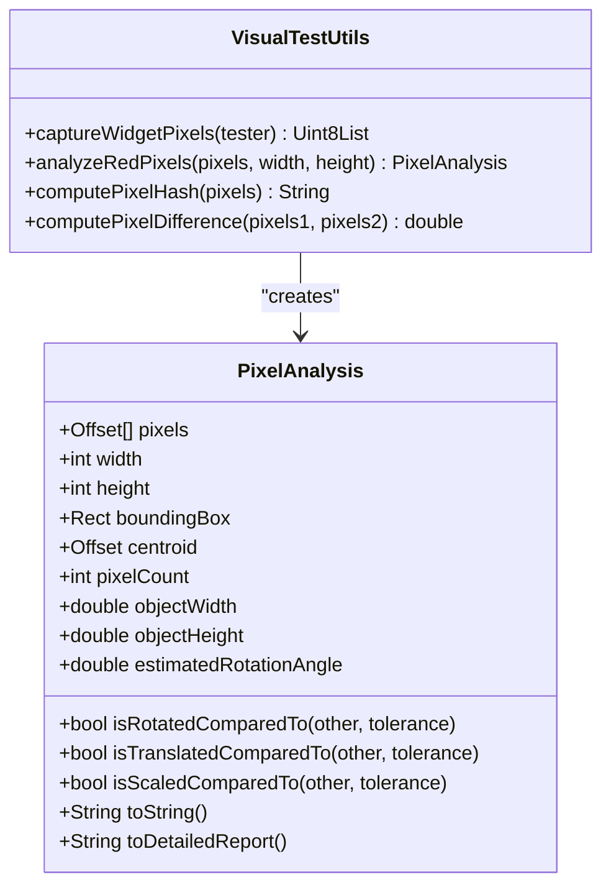
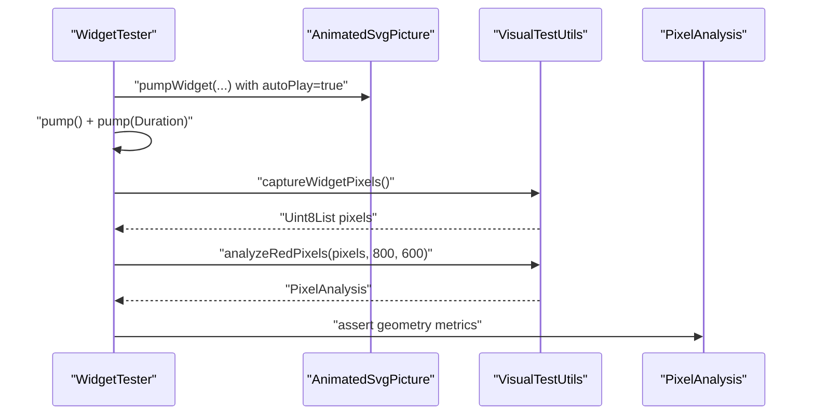
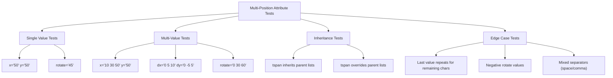
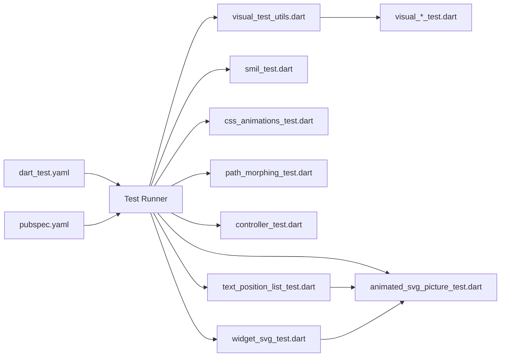

# Testing and Quality Assurance

<cite>
**Referenced Files in This Document**
- [dart_test.yaml](file://dart_test.yaml)
- [VISUAL_TESTING_GUIDELINES.md](file://VISUAL_TESTING_GUIDELINES.md)
- [visual_test_utils.dart](file://test/animation/visual_test_utils.dart)
- [visual_rotation_test.dart](file://test/animation/visual_rotation_test.dart)
- [visual_scale_test.dart](file://test/animation/visual_scale_test.dart)
- [visual_translation_test.dart](file://test/animation/visual_translation_test.dart)
- [animated_svg_picture_test.dart](file://test/animation/animated_svg_picture_test.dart)
- [smil_test.dart](file://test/animation/smil_test.dart)
- [path_morphing_test.dart](file://test/animation/path_morphing_test.dart)
- [controller_test.dart](file://test/animation/controller_test.dart)
- [css_animations_test.dart](file://test/animation/css_animations_test.dart)
- [text_position_list_test.dart](file://test/animation/text_position_list_test.dart)
- [widget_svg_test.dart](file://test/widget_svg_test.dart)
- [pubspec.yaml](file://pubspec.yaml)
</cite>

## Update Summary
**Changes Made**
- Added comprehensive coverage of the new 618-line widget test suite for multi-position attribute functionality
- Updated architecture overview to include text positioning and multi-position attribute testing
- Enhanced visual testing methodology with detailed examples of text rendering validation
- Added new sections covering text positioning attribute testing patterns
- Updated dependency analysis to reflect expanded test coverage

## Table of Contents
1. [Introduction](#introduction)
2. [Project Structure](#project-structure)
3. [Core Components](#core-components)
4. [Architecture Overview](#architecture-overview)
5. [Detailed Component Analysis](#detailed-component-analysis)
6. [Dependency Analysis](#dependency-analysis)
7. [Performance Considerations](#performance-considerations)
8. [Troubleshooting Guide](#troubleshooting-guide)
9. [Conclusion](#conclusion)
10. [Appendices](#appendices)

## Introduction
This document explains the comprehensive testing and quality assurance framework for the flutter_svg package with a focus on visual testing, automated animation testing, and validation approaches. The framework now includes extensive widget-level testing for multi-position attribute functionality, covering single values, multi-values, inheritance behavior, and edge cases across 618 lines of dedicated test coverage.

Key areas covered:
- Visual testing methodology for SMIL animations and text positioning
- Automated pixel-based verification of transforms, motion, and text rendering
- Comprehensive widget-level testing for multi-position attributes (x, y, dx, dy, rotate)
- Quality assurance processes, configuration, and CI considerations
- Relationships between the animation system, text rendering pipeline, and multi-position attributes
- Best practices, debugging techniques, and performance validation

The goal is to help developers implement robust tests, maintain the existing infrastructure, and extend it confidently with comprehensive multi-position attribute validation.

## Project Structure
The testing surface is primarily under the test/animation directory, with supporting utilities and cross-cutting guidelines. The framework now includes extensive widget-level tests for multi-position attributes alongside traditional animation and visual testing:

- Animation logic and parsing tests (SMIL, CSS-to-SMIL conversion, path morphing)
- Widget-level integration tests for AnimatedSvgPicture with comprehensive multi-position attribute coverage
- Visual testing utilities and golden-style pixel analysis
- Controller-level tests for playback control and seek/pause/forward/reverse
- Multi-position attribute tests covering inheritance, edge cases, and backward compatibility
- CI configuration and platform constraints

**Diagram sources**
- [VISUAL_TESTING_GUIDELINES.md](file://VISUAL_TESTING_GUIDELINES.md)
- [visual_test_utils.dart](file://test/animation/visual_test_utils.dart)
- [visual_rotation_test.dart](file://test/animation/visual_rotation_test.dart)
- [visual_scale_test.dart](file://test/animation/visual_scale_test.dart)
- [visual_translation_test.dart](file://test/animation/visual_translation_test.dart)
- [animated_svg_picture_test.dart](file://test/animation/animated_svg_picture_test.dart)
- [smil_test.dart](file://test/animation/smil_test.dart)
- [path_morphing_test.dart](file://test/animation/path_morphing_test.dart)
- [controller_test.dart](file://test/animation/controller_test.dart)
- [css_animations_test.dart](file://test/animation/css_animations_test.dart)
- [text_position_list_test.dart](file://test/animation/text_position_list_test.dart)
- [widget_svg_test.dart](file://test/widget_svg_test.dart)
- [dart_test.yaml](file://dart_test.yaml)

**Section sources**
- [VISUAL_TESTING_GUIDELINES.md](file://VISUAL_TESTING_GUIDELINES.md)
- [dart_test.yaml](file://dart_test.yaml)

## Core Components
- **VisualTestUtils**: Captures widget pixels, performs red-pixel analysis, computes hashes and differences, and exposes geometric metrics (centroid, bounding box, estimated rotation).
- **PixelAnalysis**: Encapsulates analysis results and comparison helpers (rotation/translation/scale detection).
- **Animation logic tests**: Validate SMIL parsing, interpolation, timeline progression, and CSS-to-SMIL conversion.
- **Widget integration tests**: Exercise AnimatedSvgPicture rendering and visual verification via pixel analysis.
- **Multi-position attribute tests**: Comprehensive coverage of text positioning attributes (x, y, dx, dy, rotate) with inheritance, edge cases, and backward compatibility.
- **Controller tests**: Validate AnimatedSvgController playback controls and seek behavior.
- **Path morphing tests**: Validate path normalization, interpolation, and morphing pipeline.

**Section sources**
- [visual_test_utils.dart](file://test/animation/visual_test_utils.dart)
- [smil_test.dart](file://test/animation/smil_test.dart)
- [path_morphing_test.dart](file://test/animation/path_morphing_test.dart)
- [controller_test.dart](file://test/animation/controller_test.dart)
- [animated_svg_picture_test.dart](file://test/animation/animated_svg_picture_test.dart)
- [text_position_list_test.dart](file://test/animation/text_position_list_test.dart)

## Architecture Overview
The testing architecture separates concerns across four layers with enhanced multi-position attribute coverage:
- **Logic tests**: Validate SMIL parsing, interpolation, and timeline mechanics.
- **Rendering tests**: Validate widget-level rendering and animation progression.
- **Visual tests**: Validate actual pixel output and geometric changes.
- **Multi-position attribute tests**: Validate text positioning, inheritance, and edge cases across 618 lines of comprehensive coverage.

**Diagram sources**
- [smil_test.dart](file://test/animation/smil_test.dart)
- [css_animations_test.dart](file://test/animation/css_animations_test.dart)
- [path_morphing_test.dart](file://test/animation/path_morphing_test.dart)
- [controller_test.dart](file://test/animation/controller_test.dart)
- [animated_svg_picture_test.dart](file://test/animation/animated_svg_picture_test.dart)
- [visual_test_utils.dart](file://test/animation/visual_test_utils.dart)
- [text_position_list_test.dart](file://test/animation/text_position_list_test.dart)

## Detailed Component Analysis

### Visual Testing Utilities
- **Purpose**: Capture RGBA pixels from a RepaintBoundary, analyze red pixels, compute hashes/differences, and extract geometry metrics.
- **Key capabilities**:
  - Safe capture without pumpAndSettle to avoid hangs on infinite animations.
  - Red-pixel extraction with configurable thresholds.
  - Geometric analysis: centroid, bounding box, object width/height, estimated rotation angle.
  - Comparison helpers: rotation/translation/scale detection between frames.
- **Usage pattern**: Build widget, pump once, capture pixels, analyze, assert on metrics.

**Diagram sources**
- [visual_test_utils.dart](file://test/animation/visual_test_utils.dart)

**Section sources**
- [visual_test_utils.dart](file://test/animation/visual_test_utils.dart)
- [VISUAL_TESTING_GUIDELINES.md](file://VISUAL_TESTING_GUIDELINES.md)

### Visual Rotation Test
- **Demonstrates** capturing and analyzing rotation via pixel geometry.
- **Validates** that rotation produces detectable geometric changes (centroid shift, bounding box, estimated angle).
- **Uses** deterministic setup with autoPlay and initialTime to ensure reproducibility.

**Diagram sources**
- [visual_rotation_test.dart](file://test/animation/visual_rotation_test.dart)
- [visual_test_utils.dart](file://test/animation/visual_test_utils.dart)

**Section sources**
- [visual_rotation_test.dart](file://test/animation/visual_rotation_test.dart)
- [VISUAL_TESTING_GUIDELINES.md](file://VISUAL_TESTING_GUIDELINES.md)

### Visual Scale and Translation Tests
- **Similar patterns** to rotation, validating scale and translation via geometric metrics.
- **Ensures** that transforms are visually verifiable even when headless rendering golden tests are limited.

**Section sources**
- [visual_scale_test.dart](file://test/animation/visual_scale_test.dart)
- [visual_translation_test.dart](file://test/animation/visual_translation_test.dart)
- [VISUAL_TESTING_GUIDELINES.md](file://VISUAL_TESTING_GUIDELINES.md)

### AnimatedSvgPicture Integration Tests
- **Validates** rendering of shapes, gradients, text, images, and complex SVG constructs.
- **Uses** VisualTestUtils to verify pixel counts and basic geometry.
- **Exercises** tracing and foreignObject rendering with clipping and viewport scaling.

**Section sources**
- [animated_svg_picture_test.dart](file://test/animation/animated_svg_picture_test.dart)
- [visual_test_utils.dart](file://test/animation/visual_test_utils.dart)

### SMIL Animation Logic Tests
- **Validates** interpolators, timing functions, SMIL parsing, and timeline progression.
- **Covers** from/to, values/keyTimes, discrete calc mode, by attribute, fill modes, repeat counts, and playback rates.
- **Ensures** correct activation/deactivation and effective value persistence.

**Section sources**
- [smil_test.dart](file://test/animation/smil_test.dart)

### CSS Animations to SMIL Conversion
- **Parses** @keyframes and CSS selector rules.
- **Converts** CSS animations to SMIL equivalents, mapping timing functions (cubic-bezier, steps), directions, and fill modes.
- **Validates** runtime behavior of converted animations.

**Section sources**
- [css_animations_test.dart](file://test/animation/css_animations_test.dart)

### Path Morphing Pipeline Tests
- **Validates** path normalization (relative to absolute, LineTo/HorizontalLineTo/VerticalLineTo/Q to C conversion).
- **Validates** interpolation and morphing between compatible paths.
- **Ensures** robust handling of ClosePath and mismatched lengths.

**Section sources**
- [path_morphing_test.dart](file://test/animation/path_morphing_test.dart)

### AnimatedSvgController Tests
- **Validates** controller state transitions (pause/resume, play/pause toggle, restart).
- **Tests** seek behavior, playback rate changes, reverse direction, and listener notifications.
- **Integrates** with AnimatedSvgPicture to verify visual changes after controller actions.

**Section sources**
- [controller_test.dart](file://test/animation/controller_test.dart)

### Multi-Position Attribute Tests
- **Comprehensive coverage** of text positioning attributes across 618 lines of widget tests.
- **Tests** single values, multi-values, inheritance behavior, and edge cases.
- **Validates** x, y, dx, dy, and rotate attributes with proper fallback mechanisms.
- **Ensures** backward compatibility with single-value attributes.

**Diagram sources**
- [text_position_list_test.dart](file://test/animation/text_position_list_test.dart)

**Section sources**
- [text_position_list_test.dart](file://test/animation/text_position_list_test.dart)

### Widget-Level SVG Rendering Tests
- **Extensive coverage** of SvgPicture rendering across multiple scenarios.
- **Tests** different loading methods (string, memory, asset, network).
- **Validates** rendering strategies, color mapping, and error handling.
- **Includes** unit tests for em/ex measurements and various SVG elements.

**Section sources**
- [widget_svg_test.dart](file://test/widget_svg_test.dart)

## Dependency Analysis
- **Test runtime and SDK constraints** are defined in pubspec.yaml.
- **dart_test.yaml restricts tests** to VM to avoid issues with certain comparators on web.
- **Visual tests depend** on VisualTestUtils and PixelAnalysis.
- **Widget tests depend** on AnimatedSvgPicture and AnimatedSvgController.
- **Logic tests depend** on SMIL, CSS, and path modules.
- **Multi-position tests depend** on text positioning system and attribute parsing utilities.

**Diagram sources**
- [dart_test.yaml](file://dart_test.yaml)
- [pubspec.yaml](file://pubspec.yaml)
- [visual_test_utils.dart](file://test/animation/visual_test_utils.dart)
- [smil_test.dart](file://test/animation/smil_test.dart)
- [css_animations_test.dart](file://test/animation/css_animations_test.dart)
- [path_morphing_test.dart](file://test/animation/path_morphing_test.dart)
- [controller_test.dart](file://test/animation/controller_test.dart)
- [animated_svg_picture_test.dart](file://test/animation/animated_svg_picture_test.dart)
- [text_position_list_test.dart](file://test/animation/text_position_list_test.dart)
- [widget_svg_test.dart](file://test/widget_svg_test.dart)

**Section sources**
- [dart_test.yaml](file://dart_test.yaml)
- [pubspec.yaml](file://pubspec.yaml)

## Performance Considerations
- **Pixel capture** uses RepaintBoundary.toImage with a single pass; avoid pumpAndSettle to prevent hangs on infinite animations.
- **Thresholds** in red-pixel extraction and geometric comparisons balance sensitivity and noise robustness.
- **Prefer deterministic timelines** (autoPlay false with initialTime or explicit pump durations) for reproducible assertions.
- **Use targeted pixel analysis** instead of full golden comparisons to reduce flakiness and improve debuggability.
- **Multi-position attribute tests** leverage efficient parsing and caching mechanisms for text positioning lists.

## Troubleshooting Guide
Common issues and resolutions:
- **No pixels captured** (pixelCount == 0):
  - Ensure initial pump() calls occur before capture.
  - Verify the test SVG uses a strong color (e.g., red) for detection.
  - Confirm image size logging matches analysis size.
- **Geometry not changing**:
  - Verify explicit pump() calls after seeking or advancing time.
  - Check that animations are progressing and transforms are applied.
  - Adjust tolerance thresholds for rotation/translation/scale comparisons.
- **pumpAndSettle hangs**:
  - Replace with explicit pump() calls and controlled time progression.
- **Cross-platform differences**:
  - Use geometry-based metrics (centroid/bbox/angle) which are more stable than golden hashes.
- **Multi-position attribute issues**:
  - Verify proper parsing of space/comma-separated values.
  - Check inheritance behavior for tspan elements.
  - Ensure backward compatibility with single-value attributes.

**Section sources**
- [VISUAL_TESTING_GUIDELINES.md](file://VISUAL_TESTING_GUIDELINES.md)
- [visual_test_utils.dart](file://test/animation/visual_test_utils.dart)
- [text_position_list_test.dart](file://test/animation/text_position_list_test.dart)

## Conclusion
The flutter_svg testing framework combines logic validation, widget integration, and robust visual verification to ensure accurate SMIL animation rendering and comprehensive multi-position attribute support. With the addition of 618 lines of widget tests covering text positioning attributes, the suite now provides complete coverage of single values, multi-values, inheritance behavior, and edge cases. By leveraging pixel-based geometry analysis, deterministic timelines, and careful controller-driven playback, the expanded suite provides reliable regression protection and clear debugging signals. The comprehensive multi-position attribute testing ensures backward compatibility while supporting modern SVG text positioning features. Adhering to the documented guidelines and patterns ensures maintainability and extensibility of the testing infrastructure.

## Appendices

### Configuration Options and CI Setup
- **Test platform restriction**: dart_test.yaml targets VM to avoid web-specific comparator issues.
- **Dependencies**: pubspec.yaml defines SDK and Flutter versions, plus vector graphics and XML packages used by the rendering pipeline.

**Section sources**
- [dart_test.yaml](file://dart_test.yaml)
- [pubspec.yaml](file://pubspec.yaml)

### Example Test Case Creation Patterns
- **Deterministic animation setup**:
  - Use autoPlay false with initialTime for fixed-frame assertions.
  - Or use autoPlay true with explicit pump(duration) for progression checks.
- **Visual verification**:
  - Capture pixels, analyze red pixels, assert on pixelCount > 0, centroid/bbox/angle changes.
  - Compare consecutive frames using isRotated/isTranslated/isScaled helpers.
- **Controller integration**:
  - Pause/resume, seek, setPlaybackRate, reverse, and assert centroid shifts.
- **Multi-position attribute testing**:
  - Test single values, multi-values, inheritance, and edge cases.
  - Validate parsing of space/comma-separated values.
  - Ensure backward compatibility with existing single-value attributes.

**Section sources**
- [VISUAL_TESTING_GUIDELINES.md](file://VISUAL_TESTING_GUIDELINES.md)
- [visual_rotation_test.dart](file://test/animation/visual_rotation_test.dart)
- [controller_test.dart](file://test/animation/controller_test.dart)
- [animated_svg_picture_test.dart](file://test/animation/animated_svg_picture_test.dart)
- [text_position_list_test.dart](file://test/animation/text_position_list_test.dart)