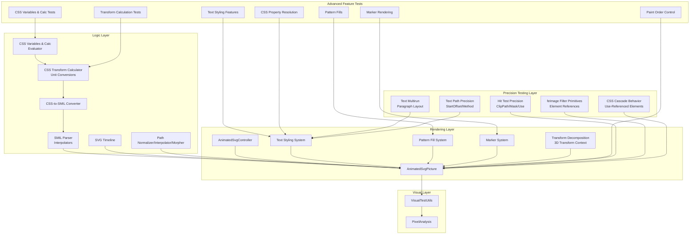
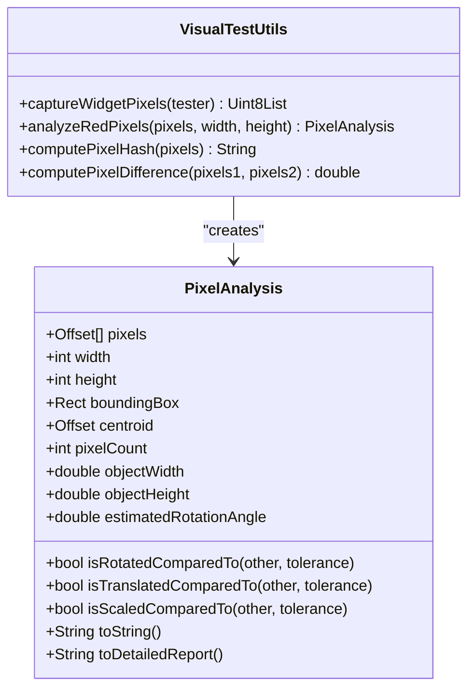
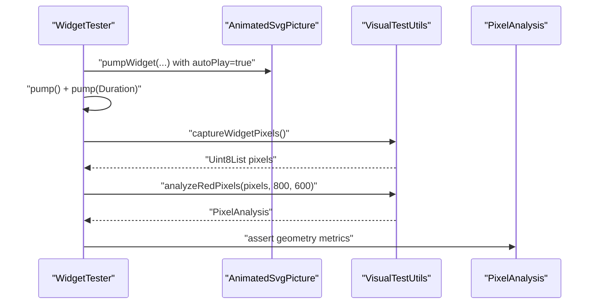
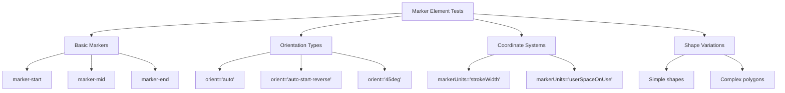
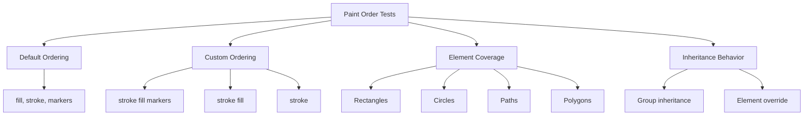
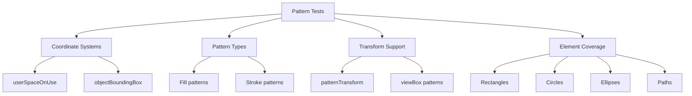
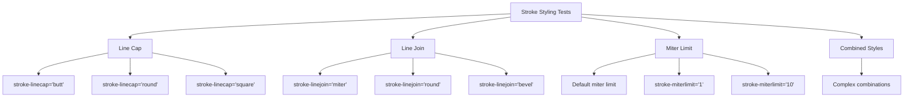
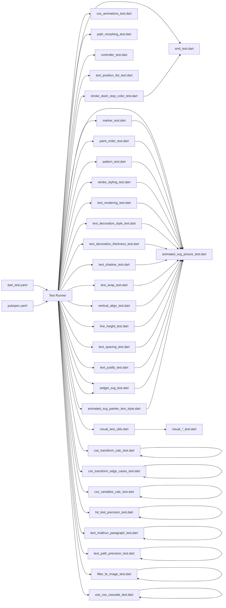

# Testing and Quality Assurance

<cite>
**Referenced Files in This Document**
- [dart_test.yaml](file://dart_test.yaml)
- [VISUAL_TESTING_GUIDELINES.md](file://VISUAL_TESTING_GUIDELINES.md)
- [visual_test_utils.dart](file://test/animation/visual_test_utils.dart)
- [visual_rotation_test.dart](file://test/animation/visual_rotation_test.dart)
- [visual_scale_test.dart](file://test/animation/visual_scale_test.dart)
- [visual_translation_test.dart](file://test/animation/visual_translation_test.dart)
- [animated_svg_picture_test.dart](file://test/animation/animated_svg_picture_test.dart)
- [smil_test.dart](file://test/animation/smil_test.dart)
- [path_morphing_test.dart](file://test/animation/path_morphing_test.dart)
- [controller_test.dart](file://test/animation/controller_test.dart)
- [css_animations_test.dart](file://test/animation/css_animations_test.dart)
- [css_transform_calc_test.dart](file://test/animation/css_transform_calc_test.dart)
- [css_transform_edge_cases_test.dart](file://test/animation/css_transform_edge_cases_test.dart)
- [css_variables_calc_test.dart](file://test/animation/css_variables_calc_test.dart)
- [text_position_list_test.dart](file://test/animation/text_position_list_test.dart)
- [marker_test.dart](file://test/animation/marker_test.dart)
- [paint_order_test.dart](file://test/animation/paint_order_test.dart)
- [pattern_test.dart](file://test/animation/pattern_test.dart)
- [stroke_styling_test.dart](file://test/animation/stroke_styling_test.dart)
- [text_rendering_test.dart](file://test/animation/text_rendering_test.dart)
- [text_decoration_style_test.dart](file://test/animation/text_decoration_style_test.dart)
- [text_decoration_thickness_test.dart](file://test/animation/text_decoration_thickness_test.dart)
- [text_shadow_test.dart](file://test/animation/text_shadow_test.dart)
- [text_wrap_test.dart](file://test/animation/text_wrap_test.dart)
- [vertical_align_test.dart](file://test/animation/vertical_align_test.dart)
- [line_height_test.dart](file://test/animation/line_height_test.dart)
- [text_spacing_test.dart](file://test/animation/text_spacing_test.dart)
- [text_justify_test.dart](file://test/animation/text_justify_test.dart)
- [white_space_test.dart](file://test/animation/white_space_test.dart)
- [stroke_dash_stop_color_test.dart](file://test/animation/stroke_dash_stop_color_test.dart)
- [widget_svg_test.dart](file://test/widget_svg_test.dart)
- [hit_test_precision_test.dart](file://test/animation/hit_test_precision_test.dart)
- [text_multirun_paragraph_test.dart](file://test/animation/text_multirun_paragraph_test.dart)
- [text_path_precision_test.dart](file://test/animation/text_path_precision_test.dart)
- [filter_fe_image_test.dart](file://test/animation/filter_fe_image_test.dart)
- [use_css_cascade_test.dart](file://test/animation/use_css_cascade_test.dart)
- [pubspec.yaml](file://pubspec.yaml)
- [animated_svg_painter_text_style.dart](file://lib/src/animation/animated_svg_painter_text_style.dart)
- [css_to_smil_converter_transforms_decompose.dart](file://lib/src/animation/css_to_smil_converter_transforms_decompose.dart)
- [css_to_smil_converter_transforms_values.dart](file://lib/src/animation/css_to_smil_converter_transforms_values.dart)
- [svg_transform.dart](file://lib/src/animation/svg_transform.dart)
- [css_variables_calc.dart](file://lib/src/animation/css_variables_calc.dart)
- [transform_3d.dart](file://lib/src/animation/transform_3d.dart)
- [animated_svg_picture_hit_test_geometry.dart](file://lib/src/animation/animated_svg_picture_hit_test_geometry.dart)
- [animated_svg_picture_hit_test_text_layout.dart](file://lib/src/animation/animated_svg_picture_hit_test_text_layout.dart)
- [animated_svg_picture_hit_test_text_path_segments.dart](file://lib/src/animation/animated_svg_picture_hit_test_text_path_segments.dart)
- [animated_svg_picture_hit_test_text_runs.dart](file://lib/src/animation/animated_svg_picture_hit_test_text_runs.dart)
- [animated_svg_picture_hit_test_traversal.dart](file://lib/src/animation/animated_svg_picture_hit_test_traversal.dart)
- [animated_svg_picture_hit_test_use.dart](file://lib/src/animation/animated_svg_picture_hit_test_use.dart)
- [animated_svg_picture_hit_test_visibility.dart](file://lib/src/animation/animated_svg_picture_hit_test_visibility.dart)
</cite>

## Update Summary
**Changes Made**
- Added comprehensive hit testing precision tests with 1000 lines covering clipPath, mask, use element, and text character-level precision
- Added extensive text multirun paragraph handling tests with 508 lines validating tspans, baseline-shift, and mixed text layouts
- Added detailed text path precision tests with 688 lines covering startOffset, method, spacing, and edge cases
- Added comprehensive feImage filter primitive tests with 491 lines validating element references, external images, and filter chains
- Added CSS cascade behavior tests for use-referenced elements with 782 lines validating inheritance and styling resolution
- Updated architecture overview to include new precision testing components and filter primitive validation
- Enhanced testing framework to cover advanced SVG rendering precision and filter system validation

## Table of Contents
1. [Introduction](#introduction)
2. [Project Structure](#project-structure)
3. [Core Components](#core-components)
4. [Architecture Overview](#architecture-overview)
5. [Detailed Component Analysis](#detailed-component-analysis)
6. [Dependency Analysis](#dependency-analysis)
7. [Performance Considerations](#performance-considerations)
8. [Troubleshooting Guide](#troubleshooting-guide)
9. [Conclusion](#conclusion)
10. [Appendices](#appendices)

## Introduction
This document explains the comprehensive testing and quality assurance framework for the flutter_svg package with a focus on visual testing, automated animation testing, and validation approaches. The framework now includes extensive widget-level testing for advanced SVG features including marker rendering, paint order validation, pattern fills, comprehensive text styling capabilities, **comprehensive hit testing precision validation**, **extensive text multirun paragraph handling**, **detailed text path precision testing**, **comprehensive feImage filter primitive validation**, and **CSS cascade behavior for use-referenced elements**.

Key areas covered:
- Visual testing methodology for SMIL animations and complex SVG rendering
- Automated pixel-based verification of transforms, motion, and advanced styling
- Comprehensive widget-level testing for marker elements, paint ordering, and pattern fills
- Extensive text styling validation including text-rendering, decorations, thickness, shadows, wrapping, alignment, and advanced typography features
- **Advanced hit testing precision validation** with clipPath, mask, use element, and text character-level accuracy
- **Comprehensive text multirun paragraph handling** with tspans, baseline-shift, and mixed text layouts
- **Detailed text path precision testing** with startOffset, method, spacing, and edge cases
- **Extensive feImage filter primitive validation** with element references, external images, and filter chains
- **CSS cascade behavior testing** for use-referenced elements with inheritance and styling resolution
- Quality assurance processes, configuration, and CI considerations
- Relationships between the animation system, rendering pipeline, and advanced SVG features
- Best practices, debugging techniques, and performance validation

The goal is to help developers implement robust tests, maintain the existing infrastructure, and extend it confidently with comprehensive validation of advanced SVG rendering features.

## Project Structure
The testing surface is primarily under the test/animation directory, with supporting utilities and cross-cutting guidelines. The framework now includes extensive widget-level tests for advanced SVG features alongside traditional animation and visual testing, **plus comprehensive precision testing for hit detection, text layout, and filter primitives**:

- Animation logic and parsing tests (SMIL, CSS-to-SMIL conversion, path morphing)
- Widget-level integration tests for AnimatedSvgPicture with comprehensive feature coverage
- Visual testing utilities and golden-style pixel analysis
- Controller-level tests for playback control and seek/pause/forward/reverse
- Advanced rendering tests for markers, paint order, patterns, and text styling
- **Precision testing for hit detection** including clipPath, mask, use element, and text character-level accuracy
- **Text multirun paragraph handling** validation with tspans, baseline-shift, and mixed layouts
- **Text path precision testing** with startOffset, method, spacing, and edge cases
- **feImage filter primitive validation** with element references, external images, and filter chains
- **CSS cascade behavior testing** for use-referenced elements with inheritance and styling resolution
- CI configuration and platform constraints

```mermaid
graph TB
subgraph "Test Suite"
A["test/animation/"]
A1["visual_test_utils.dart"]
A2["visual_rotation_test.dart"]
A3["visual_scale_test.dart"]
A4["visual_translation_test.dart"]
A5["animated_svg_picture_test.dart"]
A6["smil_test.dart"]
A7["path_morphing_test.dart"]
A8["controller_test.dart"]
A9["css_animations_test.dart"]
A10["text_position_list_test.dart"]
A11["marker_test.dart"]
A12["paint_order_test.dart"]
A13["pattern_test.dart"]
A14["stroke_styling_test.dart"]
A15["text_rendering_test.dart"]
A16["text_decoration_style_test.dart"]
A17["text_decoration_thickness_test.dart"]
A18["stroke_dash_stop_color_test.dart"]
A19["text_shadow_test.dart"]
A20["text_wrap_test.dart"]
A21["vertical_align_test.dart"]
A22["line_height_test.dart"]
A23["text_spacing_test.dart"]
A24["text_justify_test.dart"]
A25["white_space_test.dart"]
A26["css_transform_calc_test.dart"]
A27["css_transform_edge_cases_test.dart"]
A28["css_variables_calc_test.dart"]
A29["hit_test_precision_test.dart"]
A30["text_multirun_paragraph_test.dart"]
A31["text_path_precision_test.dart"]
A32["filter_fe_image_test.dart"]
A33["use_css_cascade_test.dart"]
end
subgraph "Widget Tests"
W["test/widget_svg_test.dart"]
end
subgraph "Guidelines"
G["VISUAL_TESTING_GUIDELINES.md"]
end
subgraph "CI Config"
C["dart_test.yaml"]
end
A --> A1
A --> A2
A --> A3
A --> A4
A --> A5
A --> A6
A --> A7
A --> A8
A --> A9
A --> A10
A --> A11
A --> A12
A --> A13
A --> A14
A --> A15
A --> A16
A --> A17
A --> A18
A --> A19
A --> A20
A --> A21
A --> A22
A --> A23
A --> A24
A --> A25
A --> A26
A --> A27
A --> A28
A --> A29
A --> A30
A --> A31
A --> A32
A --> A33
W --> A10
G --> A1
C --> A
C --> W
```

**Diagram sources**
- [VISUAL_TESTING_GUIDELINES.md](file://VISUAL_TESTING_GUIDELINES.md)
- [visual_test_utils.dart](file://test/animation/visual_test_utils.dart)
- [visual_rotation_test.dart](file://test/animation/visual_rotation_test.dart)
- [visual_scale_test.dart](file://test/animation/visual_scale_test.dart)
- [visual_translation_test.dart](file://test/animation/visual_translation_test.dart)
- [animated_svg_picture_test.dart](file://test/animation/animated_svg_picture_test.dart)
- [smil_test.dart](file://test/animation/smil_test.dart)
- [path_morphing_test.dart](file://test/animation/path_morphing_test.dart)
- [controller_test.dart](file://test/animation/controller_test.dart)
- [css_animations_test.dart](file://test/animation/css_animations_test.dart)
- [text_position_list_test.dart](file://test/animation/text_position_list_test.dart)
- [marker_test.dart](file://test/animation/marker_test.dart)
- [paint_order_test.dart](file://test/animation/paint_order_test.dart)
- [pattern_test.dart](file://test/animation/pattern_test.dart)
- [stroke_styling_test.dart](file://test/animation/stroke_styling_test.dart)
- [text_rendering_test.dart](file://test/animation/text_rendering_test.dart)
- [text_decoration_style_test.dart](file://test/animation/text_decoration_style_test.dart)
- [text_decoration_thickness_test.dart](file://test/animation/text_decoration_thickness_test.dart)
- [stroke_dash_stop_color_test.dart](file://test/animation/stroke_dash_stop_color_test.dart)
- [text_shadow_test.dart](file://test/animation/text_shadow_test.dart)
- [text_wrap_test.dart](file://test/animation/text_wrap_test.dart)
- [vertical_align_test.dart](file://test/animation/vertical_align_test.dart)
- [line_height_test.dart](file://test/animation/line_height_test.dart)
- [text_spacing_test.dart](file://test/animation/text_spacing_test.dart)
- [text_justify_test.dart](file://test/animation/text_justify_test.dart)
- [white_space_test.dart](file://test/animation/white_space_test.dart)
- [css_transform_calc_test.dart](file://test/animation/css_transform_calc_test.dart)
- [css_transform_edge_cases_test.dart](file://test/animation/css_transform_edge_cases_test.dart)
- [css_variables_calc_test.dart](file://test/animation/css_variables_calc_test.dart)
- [hit_test_precision_test.dart](file://test/animation/hit_test_precision_test.dart)
- [text_multirun_paragraph_test.dart](file://test/animation/text_multirun_paragraph_test.dart)
- [text_path_precision_test.dart](file://test/animation/text_path_precision_test.dart)
- [filter_fe_image_test.dart](file://test/animation/filter_fe_image_test.dart)
- [use_css_cascade_test.dart](file://test/animation/use_css_cascade_test.dart)
- [widget_svg_test.dart](file://test/widget_svg_test.dart)
- [dart_test.yaml](file://dart_test.yaml)

**Section sources**
- [VISUAL_TESTING_GUIDELINES.md](file://VISUAL_TESTING_GUIDELINES.md)
- [dart_test.yaml](file://dart_test.yaml)

## Core Components
- **VisualTestUtils**: Captures widget pixels, performs red-pixel analysis, computes hashes and differences, and exposes geometric metrics (centroid, bounding box, estimated rotation).
- **PixelAnalysis**: Encapsulates analysis results and comparison helpers (rotation/translation/scale detection).
- **Animation logic tests**: Validate SMIL parsing, interpolation, timeline progression, and CSS-to-SMIL conversion.
- **Widget integration tests**: Exercise AnimatedSvgPicture rendering and visual verification via pixel analysis.
- **Advanced rendering tests**: Validate marker elements, paint order control, pattern fills, and comprehensive text styling.
- **Controller tests**: Validate AnimatedSvgController playback controls and seek behavior.
- **Path morphing tests**: Validate path normalization, interpolation, and morphing pipeline.
- **Text styling resolution system**: Processes and validates CSS text properties including thickness, shadows, wrapping, alignment, and advanced typography.
- **CSS transform calculation system**: **Validates calc() expression evaluation, unit conversions, and complex transform parsing**.
- **CSS variables and calc() evaluation system**: **Processes CSS variables and calc() expressions with comprehensive unit conversion support**.
- **Precision hit testing system**: **Validates hit detection accuracy for clipPath, mask, use elements, and text character-level precision**.
- **Text multirun paragraph system**: **Validates tspans, baseline-shift, and mixed text layouts with comprehensive styling**.
- **Text path precision system**: **Validates startOffset, method, spacing, and edge cases for text along paths**.
- **feImage filter primitive system**: **Validates element references, external images, preserveAspectRatio, and filter chain integration**.
- **CSS cascade behavior system**: **Validates inheritance and styling resolution for use-referenced elements**.

**Section sources**
- [visual_test_utils.dart](file://test/animation/visual_test_utils.dart)
- [smil_test.dart](file://test/animation/smil_test.dart)
- [path_morphing_test.dart](file://test/animation/path_morphing_test.dart)
- [controller_test.dart](file://test/animation/controller_test.dart)
- [animated_svg_picture_test.dart](file://test/animation/animated_svg_picture_test.dart)
- [text_position_list_test.dart](file://test/animation/text_position_list_test.dart)
- [marker_test.dart](file://test/animation/marker_test.dart)
- [paint_order_test.dart](file://test/animation/paint_order_test.dart)
- [pattern_test.dart](file://test/animation/pattern_test.dart)
- [stroke_styling_test.dart](file://test/animation/stroke_styling_test.dart)
- [text_rendering_test.dart](file://test/animation/text_rendering_test.dart)
- [animated_svg_painter_text_style.dart](file://lib/src/animation/animated_svg_painter_text_style.dart)
- [css_transform_calc_test.dart](file://test/animation/css_transform_calc_test.dart)
- [css_transform_edge_cases_test.dart](file://test/animation/css_transform_edge_cases_test.dart)
- [css_variables_calc_test.dart](file://test/animation/css_variables_calc_test.dart)
- [hit_test_precision_test.dart](file://test/animation/hit_test_precision_test.dart)
- [text_multirun_paragraph_test.dart](file://test/animation/text_multirun_paragraph_test.dart)
- [text_path_precision_test.dart](file://test/animation/text_path_precision_test.dart)
- [filter_fe_image_test.dart](file://test/animation/filter_fe_image_test.dart)
- [use_css_cascade_test.dart](file://test/animation/use_css_cascade_test.dart)

## Architecture Overview
The testing architecture separates concerns across five layers with enhanced coverage of advanced SVG rendering features, **including comprehensive precision testing for hit detection, text layout, and filter primitives**:
- **Logic tests**: Validate SMIL parsing, interpolation, and timeline mechanics.
- **Rendering tests**: Validate widget-level rendering and animation progression.
- **Visual tests**: Validate actual pixel output and geometric changes.
- **Advanced feature tests**: Validate markers, paint order, patterns, text styling, and **comprehensive precision testing**.
- **Precision testing layer**: Validate hit detection accuracy, text layout precision, and filter primitive behavior.
- **CSS cascade system tests**: Validate inheritance and styling resolution for use-referenced elements.
- **CSS transform system tests**: Validate calc() expressions, unit conversions, and 3D transform handling.
- **CSS variables and calc() system tests**: Validate var() resolution and calc() arithmetic evaluation.

**Diagram sources**
- [smil_test.dart](file://test/animation/smil_test.dart)
- [css_animations_test.dart](file://test/animation/css_animations_test.dart)
- [path_morphing_test.dart](file://test/animation/path_morphing_test.dart)
- [controller_test.dart](file://test/animation/controller_test.dart)
- [animated_svg_picture_test.dart](file://test/animation/animated_svg_picture_test.dart)
- [visual_test_utils.dart](file://test/animation/visual_test_utils.dart)
- [text_position_list_test.dart](file://test/animation/text_position_list_test.dart)
- [marker_test.dart](file://test/animation/marker_test.dart)
- [paint_order_test.dart](file://test/animation/paint_order_test.dart)
- [pattern_test.dart](file://test/animation/pattern_test.dart)
- [stroke_styling_test.dart](file://test/animation/stroke_styling_test.dart)
- [text_rendering_test.dart](file://test/animation/text_rendering_test.dart)
- [animated_svg_painter_text_style.dart](file://lib/src/animation/animated_svg_painter_text_style.dart)
- [css_transform_calc_test.dart](file://test/animation/css_transform_calc_test.dart)
- [css_transform_edge_cases_test.dart](file://test/animation/css_transform_edge_cases_test.dart)
- [css_variables_calc_test.dart](file://test/animation/css_variables_calc_test.dart)
- [css_to_smil_converter_transforms_decompose.dart](file://lib/src/animation/css_to_smil_converter_transforms_decompose.dart)
- [css_to_smil_converter_transforms_values.dart](file://lib/src/animation/css_to_smil_converter_transforms_values.dart)
- [svg_transform.dart](file://lib/src/animation/svg_transform.dart)
- [css_variables_calc.dart](file://lib/src/animation/css_variables_calc.dart)
- [transform_3d.dart](file://lib/src/animation/transform_3d.dart)
- [hit_test_precision_test.dart](file://test/animation/hit_test_precision_test.dart)
- [text_multirun_paragraph_test.dart](file://test/animation/text_multirun_paragraph_test.dart)
- [text_path_precision_test.dart](file://test/animation/text_path_precision_test.dart)
- [filter_fe_image_test.dart](file://test/animation/filter_fe_image_test.dart)
- [use_css_cascade_test.dart](file://test/animation/use_css_cascade_test.dart)

## Detailed Component Analysis

### Visual Testing Utilities
- **Purpose**: Capture RGBA pixels from a RepaintBoundary, analyze red pixels, compute hashes/differences, and extract geometry metrics.
- **Key capabilities**:
  - Safe capture without pumpAndSettle to avoid hangs on infinite animations.
  - Red-pixel extraction with configurable thresholds.
  - Geometric analysis: centroid, bounding box, object width/height, estimated rotation angle.
  - Comparison helpers: rotation/translation/scale detection between frames.
- **Usage pattern**: Build widget, pump once, capture pixels, analyze, assert on metrics.

**Diagram sources**
- [visual_test_utils.dart](file://test/animation/visual_test_utils.dart)

**Section sources**
- [visual_test_utils.dart](file://test/animation/visual_test_utils.dart)
- [VISUAL_TESTING_GUIDELINES.md](file://VISUAL_TESTING_GUIDELINES.md)

### Visual Rotation Test
- **Demonstrates** capturing and analyzing rotation via pixel geometry.
- **Validates** that rotation produces detectable geometric changes (centroid shift, bounding box, estimated angle).
- **Uses** deterministic setup with autoPlay and initialTime to ensure reproducibility.

**Diagram sources**
- [visual_rotation_test.dart](file://test/animation/visual_rotation_test.dart)
- [visual_test_utils.dart](file://test/animation/visual_test_utils.dart)

**Section sources**
- [visual_rotation_test.dart](file://test/animation/visual_rotation_test.dart)
- [VISUAL_TESTING_GUIDELINES.md](file://VISUAL_TESTING_GUIDELINES.md)

### Visual Scale and Translation Tests
- **Similar patterns** to rotation, validating scale and translation via geometric metrics.
- **Ensures** that transforms are visually verifiable even when headless rendering golden tests are limited.

**Section sources**
- [visual_scale_test.dart](file://test/animation/visual_scale_test.dart)
- [visual_translation_test.dart](file://test/animation/visual_translation_test.dart)
- [VISUAL_TESTING_GUIDELINES.md](file://VISUAL_TESTING_GUIDELINES.md)

### AnimatedSvgPicture Integration Tests
- **Validates** rendering of shapes, gradients, text, images, and complex SVG constructs.
- **Uses** VisualTestUtils to verify pixel counts and basic geometry.
- **Exercises** tracing and foreignObject rendering with clipping and viewport scaling.

**Section sources**
- [animated_svg_picture_test.dart](file://test/animation/animated_svg_picture_test.dart)
- [visual_test_utils.dart](file://test/animation/visual_test_utils.dart)

### SMIL Animation Logic Tests
- **Validates** interpolators, timing functions, SMIL parsing, and timeline progression.
- **Covers** from/to, values/keyTimes, discrete calc mode, by attribute, fill modes, repeat counts, and playback rates.
- **Ensures** correct activation/deactivation and effective value persistence.

**Section sources**
- [smil_test.dart](file://test/animation/smil_test.dart)

### CSS Animations to SMIL Conversion
- **Parses** @keyframes and CSS selector rules.
- **Converts** CSS animations to SMIL equivalents, mapping timing functions (cubic-bezier, steps), directions, and fill modes.
- **Validates** runtime behavior of converted animations.

**Section sources**
- [css_animations_test.dart](file://test/animation/css_animations_test.dart)

### Path Morphing Pipeline Tests
- **Validates** path normalization (relative to absolute, LineTo/HorizontalLineTo/VerticalLineTo/Q to C conversion).
- **Validates** interpolation and morphing between compatible paths.
- **Ensures** robust handling of ClosePath and mismatched lengths.

**Section sources**
- [path_morphing_test.dart](file://test/animation/path_morphing_test.dart)

### AnimatedSvgController Tests
- **Validates** controller state transitions (pause/resume, play/pause toggle, restart).
- **Tests** seek behavior, playback rate changes, reverse direction, and listener notifications.
- **Integrates** with AnimatedSvgPicture to verify visual changes after controller actions.

**Section sources**
- [controller_test.dart](file://test/animation/controller_test.dart)

### Marker Element Rendering Tests
- **Comprehensive coverage** of marker functionality across 223 lines of widget tests.
- **Tests** marker-start, marker-mid, marker-end positioning with various shapes (paths, circles, polygons).
- **Validates** marker shorthand application, auto orientation, fixed angle orientation, and userSpaceOnUse units.
- **Ensures** proper rendering for lines, polylines, polygons, and complex paths.

**Diagram sources**
- [marker_test.dart](file://test/animation/marker_test.dart)

**Section sources**
- [marker_test.dart](file://test/animation/marker_test.dart)

### Paint Order Validation Tests
- **Comprehensive coverage** of paint-order attribute functionality with 232 lines of widget tests.
- **Tests** default order (fill, stroke, markers), custom ordering, and inheritance behavior.
- **Validates** paint-order application to all SVG elements (rect, circle, ellipse, path, polygon, polyline).
- **Ensures** proper layering control with markers integration.

**Diagram sources**
- [paint_order_test.dart](file://test/animation/paint_order_test.dart)

**Section sources**
- [paint_order_test.dart](file://test/animation/paint_order_test.dart)

### Pattern Rendering Tests
- **Comprehensive coverage** of pattern fill and stroke functionality with 189 lines of widget tests.
- **Tests** userSpaceOnUse and objectBoundingBox coordinate systems.
- **Validates** patternTransform support, viewBox patterns, and href inheritance.
- **Ensures** proper rendering for rectangles, circles, ellipses, and complex paths.

**Diagram sources**
- [pattern_test.dart](file://test/animation/pattern_test.dart)

**Section sources**
- [pattern_test.dart](file://test/animation/pattern_test.dart)

### Stroke Styling Tests
- **Comprehensive coverage** of stroke styling attributes with 295 lines of widget tests.
- **Tests** stroke-linecap (butt, round, square), stroke-linejoin (miter, round, bevel), and stroke-miterlimit.
- **Validates** inheritance behavior and combined styling combinations.
- **Ensures** proper rendering for lines, polylines, polygons, and complex paths.

**Diagram sources**
- [stroke_styling_test.dart](file://test/animation/stroke_styling_test.dart)

**Section sources**
- [stroke_styling_test.dart](file://test/animation/stroke_styling_test.dart)

### Advanced CSS Text Styling Tests
The framework now includes comprehensive testing for expanded CSS text styling features with 40 new test files covering:

#### Text Decoration Thickness Tests
- **Validates** text-decoration-thickness property with auto, from-font, px, em, and percentage values
- **Tests** inheritance behavior and font-relative sizing calculations
- **Ensures** proper rendering of underline/thickness combinations

#### Text Shadow Tests
- **Validates** text-shadow property with offset, blur radius, and color specifications
- **Tests** multiple shadow support and inheritance behavior
- **Ensures** proper rendering of shadow effects on text elements

#### Text Wrap Tests
- **Validates** text-wrap property with wrap, nowrap, balance, and pretty values
- **Tests** wrapping behavior and line breaking algorithms
- **Ensures** proper text layout with different wrapping strategies

#### Vertical Align Tests
- **Validates** vertical-align property with baseline, sub, super, middle, and length values
- **Tests** percentage and em-based positioning
- **Ensures** proper vertical text alignment relative to baseline

#### Line Height Tests
- **Validates** line-height property with normal, number, px, em, and percentage values
- **Tests** inheritance behavior and font-relative calculations
- **Ensures** proper line spacing and text layout

#### Text Spacing Tests
- **Validates** text-spacing property with normal, none, and auto values
- **Tests** spacing behavior for different scripts and languages
- **Ensures** proper text spacing for CJK and Latin text

#### Text Justify Tests
- **Validates** text-justify property with auto, none, inter-word, and inter-character values
- **Tests** inheritance behavior and justification algorithms
- **Ensures** proper text justification for different writing systems

#### White Space Tests
- **Validates** white-space property with normal, nowrap, pre, pre-wrap, pre-line, and break-spaces values
- **Tests** whitespace handling and line breaking behavior
- **Ensures** proper text formatting for different content types

**Section sources**
- [text_decoration_thickness_test.dart](file://test/animation/text_decoration_thickness_test.dart)
- [text_shadow_test.dart](file://test/animation/text_shadow_test.dart)
- [text_wrap_test.dart](file://test/animation/text_wrap_test.dart)
- [vertical_align_test.dart](file://test/animation/vertical_align_test.dart)
- [line_height_test.dart](file://test/animation/line_height_test.dart)
- [text_spacing_test.dart](file://test/animation/text_spacing_test.dart)
- [text_justify_test.dart](file://test/animation/text_justify_test.dart)
- [white_space_test.dart](file://test/animation/white_space_test.dart)

### CSS Transform Calculation System
**Updated** The framework now includes comprehensive CSS transform calculation testing with support for calc() expressions, angle unit conversions, length unit conversions, and complex transform sequences.

#### CSS Transform Parsing and Unit Conversion
- **Transform Parser**: Validates parsing of complex transform sequences including translate, rotate, scale, skew, and matrix functions
- **Unit Conversion**: Supports px, em, rem, %, vw, vh, vmin, vmax, cm, mm, in, pt, pc, and bare numbers
- **Angle Unit Conversion**: Handles deg, rad, turn, and grad units with proper conversion to degrees
- **Calc Expression Evaluation**: Processes calc() expressions with arithmetic operations and unit conversions

#### Complex Transform Sequence Testing
- **Multi-function Sequences**: Validates parsing of complex transform chains like "translate(10px, 20px) rotate(45deg) scale(1.5)"
- **3D Transform Support**: Tests translate3d, rotate3d, scale3d, perspective, and matrix3d functions
- **Transform Origin and Box**: Validates transform-origin and transform-box properties with keywords and units
- **Matrix Decomposition**: Tests matrix decomposition and reconstruction for smooth interpolation

#### CSS Variables and Calc() Evaluation System
- **Variable Resolution**: Validates var() reference resolution with inheritance and fallback support
- **Calc Arithmetic**: Tests calc() expression evaluation with nested calc(), mixed units, and arithmetic precedence
- **Unit Context**: Handles font-size and container-size context for em/rem/% calculations
- **Integration Testing**: Validates end-to-end CSS variables and calc() evaluation in transform parsing

**Section sources**
- [css_transform_calc_test.dart](file://test/animation/css_transform_calc_test.dart)
- [css_transform_edge_cases_test.dart](file://test/animation/css_transform_edge_cases_test.dart)
- [css_variables_calc_test.dart](file://test/animation/css_variables_calc_test.dart)
- [css_to_smil_converter_transforms_decompose.dart](file://lib/src/animation/css_to_smil_converter_transforms_decompose.dart)
- [css_to_smil_converter_transforms_values.dart](file://lib/src/animation/css_to_smil_converter_transforms_values.dart)
- [svg_transform.dart](file://lib/src/animation/svg_transform.dart)
- [css_variables_calc.dart](file://lib/src/animation/css_variables_calc.dart)
- [transform_3d.dart](file://lib/src/animation/transform_3d.dart)

### Text Styling Resolution System
The animated_svg_painter_text_style.dart file implements comprehensive CSS text property resolution:

#### Text Decoration Thickness Resolution
- **Method**: `_resolveTextDecorationThickness(value, fontSize)`
- **Supports**: auto, from-font, px, em, and percentage values
- **Calculations**: Font-relative sizing with em and percentage support
- **Returns**: Null for auto/from-font, numeric value in user units otherwise

#### Text Shadow Resolution
- **Method**: `_resolveTextShadow(value)`
- **Supports**: Multiple shadows with offset, blur, and color specifications
- **Normalization**: Returns normalized shadow string for further processing
- **Inheritance**: Proper handling of inherit and initial values

#### Vertical Align Resolution
- **Method**: `_resolveVerticalAlign(value, fontSize)`
- **Supports**: Baseline keywords and length/percentage values
- **Calculations**: Font-relative positioning with em and px support
- **Returns**: Baseline offset in user units

#### Line Height Resolution
- **Method**: `_resolveLineHeight(value, fontSize)`
- **Supports**: Normal, number, px, em, and percentage values
- **Calculations**: Font-relative sizing with proper unit conversion
- **Returns**: Null for normal, numeric value in user units otherwise

#### Text Wrap Resolution
- **Method**: `_resolveTextWrap(value)`
- **Supports**: wrap, nowrap, balance, pretty, and stable values
- **Purpose**: Controls text wrapping behavior and line breaking algorithms

#### Additional Text Properties
The system also resolves numerous other CSS text properties including:
- Font variant properties (numeric, ligatures, caps, east asian)
- Text emphasis and ruby properties
- Font synthesis and variation settings
- Direction and content visibility properties
- Spacing and justification controls

**Section sources**
- [animated_svg_painter_text_style.dart](file://lib/src/animation/animated_svg_painter_text_style.dart)

### Advanced Attribute Processing Tests
- **Stroke Dash and Stop Color Tests**: Validates CSS animation processing for stroke-dashoffset and stop-color attributes, including SMIL conversion and color interpolation.
- **CSS Animation Timing Tests**: Validates per-keyframe animation-timing-function extraction and SMIL keySplines generation.
- **Compound Transform Decomposition**: Validates compound CSS transform decomposition into separate SMIL animations.

**Section sources**
- [stroke_dash_stop_color_test.dart](file://test/animation/stroke_dash_stop_color_test.dart)

### Widget-Level SVG Rendering Tests
- **Extensive coverage** of SvgPicture rendering across multiple scenarios.
- **Tests** different loading methods (string, memory, asset, network).
- **Validates** rendering strategies, color mapping, and error handling.
- **Includes** unit tests for em/ex measurements and various SVG elements.

**Section sources**
- [widget_svg_test.dart](file://test/widget_svg_test.dart)

### Hit Testing Precision Tests
**New** The framework now includes comprehensive hit testing precision validation with 1000 lines covering:

#### ClipPath Precision Testing
- **Element hit detection**: Validates that clicks inside clipPath regions trigger animations
- **Boundary accuracy**: Tests precision at clipPath boundaries with points just inside/outside
- **ObjectBoundingBox units**: Validates clipPath with clipPathUnits="objectBoundingBox" scaling
- **Nested clipPath scenarios**: Tests complex nested clipPath compositions

#### Mask Precision Testing
- **Mask region detection**: Validates hit testing accuracy within mask regions
- **Transparent content handling**: Tests behavior with fill:none mask content
- **Mask coordinate systems**: Validates mask positioning and scaling

#### Use Element Precision Testing
- **Transformed position accuracy**: Validates hit testing at use element x/y offset positions
- **Symbol viewport transformation**: Tests hit detection with symbol viewBox scaling
- **Pointer-events blocking**: Validates pointer-events="none" behavior

#### Text Character-Level Precision Testing
- **Per-character dx offsets**: Validates hit testing with text dx attribute positioning
- **Rotated text accuracy**: Tests hit detection with text rotate attribute
- **TextPath character positioning**: Validates hit testing along textPath segments

**Section sources**
- [hit_test_precision_test.dart](file://test/animation/hit_test_precision_test.dart)

### Text Multirun Paragraph Handling Tests
**New** The framework includes comprehensive text multirun paragraph validation with 508 lines covering:

#### Basic tspan Layout Tests
- **Same-line rendering**: Validates multiple tspans render on the same line with different styles
- **Font-weight variations**: Tests bold/normal combinations within paragraphs
- **Font-size mixing**: Validates different font sizes on the same line
- **Color variations**: Tests colored tspans within text

#### Whitespace and Formatting Tests
- **Whitespace preservation**: Validates xml:space="preserve" behavior
- **Mixed whitespace handling**: Tests spaces, tabs, and newlines between tspans
- **Empty tspan handling**: Validates empty tspans don't break layout
- **Nested tspan inheritance**: Tests inheritance of parent styles to nested tspans

#### Baseline-Shift Interaction Tests
- **Subscript positioning**: Validates baseline-shift="sub" for chemical formulas
- **Superscript positioning**: Tests baseline-shift="super" for exponents
- **Percentage values**: Validates baseline-shift with percentage-based positioning
- **Length values**: Tests baseline-shift with em-based positioning
- **Cumulative effects**: Validates nested baseline-shift combinations

#### Vertical Text Layout Tests
- **Vertical-rl writing mode**: Tests mixed tspan styles in vertical text
- **Vertical-lr writing mode**: Validates font-size variations in vertical layout
- **Mixed vertical text**: Tests complex vertical text with multiple styles

#### Edge Case Handling Tests
- **Empty tspan with dx**: Validates spacing behavior with empty tspans containing offsets
- **Whitespace-only tspans**: Tests collapse behavior of tspans with only whitespace
- **Newline-only tspans**: Validates collapse of tspans with only newlines

**Section sources**
- [text_multirun_paragraph_test.dart](file://test/animation/text_multirun_paragraph_test.dart)

### Text Path Precision Tests
**New** The framework includes detailed text path precision validation with 688 lines covering:

#### StartOffset Precision Tests
- **Percentage values**: Validates startOffset with percentage-based positioning
- **Absolute values**: Tests startOffset with absolute distance measurements
- **Edge cases**: Validates startOffset at 0%, 50%, and 100% positions
- **Text-anchor interaction**: Tests startOffset with different text-anchor values

#### Text Exceeding Path Length Tests
- **Clipping behavior**: Validates text longer than path is properly clipped
- **Graceful truncation**: Tests behavior when startOffset pushes text beyond path end
- **Overflow handling**: Validates graceful handling of oversized text

#### Closed Path Precision Tests
- **Circular paths**: Validates text positioning along circular path elements
- **Rectangular paths**: Tests text along rectangular path boundaries
- **Elliptical paths**: Validates text positioning on elliptical path shapes

#### Method Attribute Precision Tests
- **Align method**: Validates default text-alignment along path
- **Stretch method**: Tests text stretching to fill path length
- **Method selection**: Validates appropriate method behavior for different paths

#### Spacing Attribute Precision Tests
- **Auto spacing**: Validates normal spacing behavior
- **Exact spacing**: Tests glyph-width based spacing
- **Spacing interaction**: Validates spacing with different path methods

#### Edge Case Precision Tests
- **Empty path references**: Validates behavior with empty path href attributes
- **Nonexistent references**: Tests fallback behavior for missing path references
- **Zero-length paths**: Validates behavior with point-only paths
- **Very short paths**: Tests precision with tiny path segments

#### tspan Children Precision Tests
- **Color variations**: Validates multiple colored tspans along textPath
- **Font-size variations**: Tests different font sizes within textPath
- **Font-weight variations**: Validates bold/normal combinations along path

#### Text Length and Anchor Precision Tests
- **Text length stretching**: Validates textLength attribute behavior
- **Length adjust modes**: Tests lengthAdjust="spacing" and "spacingAndGlyphs"
- **Text anchor positioning**: Validates text-anchor interaction with startOffset

**Section sources**
- [text_path_precision_test.dart](file://test/animation/text_path_precision_test.dart)

### feImage Filter Primitive Tests
**New** The framework includes comprehensive feImage filter primitive validation with 491 lines covering:

#### Element Reference Tests
- **Basic element references**: Validates href="#elementId" functionality
- **XLink namespace support**: Tests xlink:href attribute compatibility
- **Nested element references**: Validates references to groups and complex elements
- **Reference resolution**: Ensures proper element lookup and rendering

#### preserveAspectRatio Handling Tests
- **None scaling**: Validates preserveAspectRatio="none" behavior
- **Meet scaling**: Tests preserveAspectRatio="xMidYMid meet" functionality
- **Slice scaling**: Validates preserveAspectRatio="xMinYMin slice" behavior
- **Max positioning**: Tests preserveAspectRatio="xMaxYMax meet" positioning

#### External Image Handling Tests
- **Data URI support**: Validates base64 encoded image data
- **HTTP URL support**: Tests remote image loading
- **Relative path support**: Validates local file path handling
- **Image format support**: Tests various image formats and encodings

#### Unresolvable Reference Tests
- **Empty href fallback**: Validates SourceGraphic fallback for empty references
- **Missing href behavior**: Tests fallback when href attribute is omitted
- **Whitespace-only references**: Validates fallback for whitespace-only href values

#### Subregion and Positioning Tests
- **Subregion parsing**: Validates x, y, width, height positioning
- **Default subregion behavior**: Tests zero-sized subregions
- **Coordinate system handling**: Validates positioning within filter regions

#### Filter Chain Integration Tests
- **Sequential filter chains**: Validates feImage followed by other filters
- **feMerge composition**: Tests feImage integration with feMerge
- **Input attribute override**: Validates feImage behavior when 'in' attribute is specified
- **Result attribute handling**: Tests result naming and downstream reference

#### Result Attribute Tests
- **Named result references**: Validates result="name" functionality
- **Downstream filter integration**: Tests result usage in subsequent filters
- **Result chaining**: Validates multiple result-based filter chains

**Section sources**
- [filter_fe_image_test.dart](file://test/animation/filter_fe_image_test.dart)

### CSS Cascade Behavior Tests
**New** The framework includes comprehensive CSS cascade behavior validation for use-referenced elements with 782 lines covering:

#### Inheritance Behavior Tests
- **Property inheritance**: Validates CSS properties inherited by use-referenced elements
- **Style resolution**: Tests cascading style resolution for referenced elements
- **Specificity handling**: Validates CSS specificity with use-referenced elements
- **Fallback behavior**: Tests inheritance fallback when properties are not defined

#### Style Application Tests
- **Direct styling**: Validates direct CSS styles applied to use elements
- **Inherited styles**: Tests CSS styles inherited from parent elements
- **Combined styling**: Validates interaction between inherited and direct styles
- **Override behavior**: Tests precedence of direct styles over inherited styles

#### Complex Cascade Scenarios Tests
- **Nested use elements**: Validates cascade behavior with deeply nested use references
- **Multiple inheritance levels**: Tests cascade through multiple inheritance levels
- **Conflicting style resolution**: Validates resolution of conflicting CSS declarations
- **Media query integration**: Tests cascade behavior with media queries affecting use elements

#### Edge Case Handling Tests
- **Invalid references**: Validates cascade behavior with broken use references
- **Circular references**: Tests cascade behavior with circular use element references
- **Dynamic style changes**: Validates cascade behavior with runtime CSS changes
- **Animation integration**: Tests cascade behavior during CSS animations

**Section sources**
- [use_css_cascade_test.dart](file://test/animation/use_css_cascade_test.dart)

### Precision Hit Testing System
**New** The framework includes a comprehensive precision hit testing system with specialized components:

#### Geometry-Based Hit Testing
- **ClipPath accuracy**: Validates precise hit detection within clipPath boundaries
- **Mask region precision**: Tests hit detection accuracy within mask regions
- **Use element transformation**: Validates transformed hit detection for use elements

#### Text-Based Hit Testing
- **Character-level precision**: Tests hit detection at individual character positions
- **TextPath segment accuracy**: Validates hit detection along textPath segments
- **Baseline alignment**: Tests hit detection with baseline-shift positioning

#### Visibility-Based Hit Testing
- **Pointer-events control**: Validates pointer-events="none" blocking behavior
- **Visibility inheritance**: Tests hit detection through visibility properties
- **Opacity-based hit testing**: Validates hit detection through transparent regions

**Section sources**
- [animated_svg_picture_hit_test_geometry.dart](file://lib/src/animation/animated_svg_picture_hit_test_geometry.dart)
- [animated_svg_picture_hit_test_text_layout.dart](file://lib/src/animation/animated_svg_picture_hit_test_text_layout.dart)
- [animated_svg_picture_hit_test_text_path_segments.dart](file://lib/src/animation/animated_svg_picture_hit_test_text_path_segments.dart)
- [animated_svg_picture_hit_test_text_runs.dart](file://lib/src/animation/animated_svg_picture_hit_test_text_runs.dart)
- [animated_svg_picture_hit_test_traversal.dart](file://lib/src/animation/animated_svg_picture_hit_test_traversal.dart)
- [animated_svg_picture_hit_test_use.dart](file://lib/src/animation/animated_svg_picture_hit_test_use.dart)
- [animated_svg_picture_hit_test_visibility.dart](file://lib/src/animation/animated_svg_picture_hit_test_visibility.dart)

### Text Multirun System
**New** The framework includes comprehensive text multirun paragraph handling:

#### tspan Layout Engine
- **Inline layout**: Validates tspans render inline within text elements
- **Baseline alignment**: Tests proper baseline alignment across different font sizes
- **Whitespace handling**: Validates whitespace behavior between tspans
- **Empty span handling**: Tests layout behavior with empty tspans

#### Style Inheritance System
- **Parent style inheritance**: Validates tspans inherit parent text styles
- **Nested inheritance**: Tests inheritance through multiple tspan nesting levels
- **Style override behavior**: Validates tspans can override inherited styles
- **Inheritance precedence**: Tests precedence of direct vs inherited styles

#### Mixed Text Layout System
- **Vertical text support**: Validates tspans in vertical writing modes
- **Mixed script support**: Tests tspans with different writing systems
- **Complex layout scenarios**: Validates complex text layouts with multiple styles

**Section sources**
- [text_multirun_paragraph_test.dart](file://test/animation/text_multirun_paragraph_test.dart)

### Text Path Precision System
**New** The framework includes detailed text path precision validation:

#### Path Positioning System
- **StartOffset calculation**: Validates precise text positioning along paths
- **Path length measurement**: Tests accurate measurement of path lengths
- **Edge case handling**: Validates positioning at path start, middle, and end
- **Text-anchor interaction**: Tests interaction between startOffset and text-anchor

#### Path Method System
- **Align method precision**: Validates text-alignment along curved paths
- **Stretch method behavior**: Tests text stretching to fill path length
- **Method selection logic**: Validates appropriate method selection for different paths

#### Spacing and Adjustment System
- **Spacing attribute precision**: Validates spacing="auto" and spacing="exact" behavior
- **Text length adjustment**: Tests textLength and lengthAdjust interaction
- **Glyph width calculation**: Validates precise glyph width measurements

**Section sources**
- [text_path_precision_test.dart](file://test/animation/text_path_precision_test.dart)

### feImage Filter Primitive System
**New** The framework includes comprehensive feImage filter primitive validation:

#### Element Reference System
- **ID-based references**: Validates href="#elementId" functionality
- **Namespace support**: Tests xlink:href attribute compatibility
- **Complex element support**: Validates references to groups and nested elements
- **Reference resolution**: Ensures proper element lookup and rendering

#### External Image System
- **Data URI handling**: Validates base64 encoded image data processing
- **URL resolution**: Tests HTTP URL and relative path handling
- **Image format support**: Validates various image formats and encodings
- **Loading behavior**: Tests asynchronous image loading and rendering

#### Filter Integration System
- **Sequential filter chains**: Validates feImage integration with other filter primitives
- **Result attribute handling**: Tests result naming and downstream filter integration
- **Input override behavior**: Validates feImage when 'in' attribute is specified
- **Subregion positioning**: Tests precise positioning within filter regions

**Section sources**
- [filter_fe_image_test.dart](file://test/animation/filter_fe_image_test.dart)

### CSS Cascade Behavior System
**New** The framework includes comprehensive CSS cascade behavior validation:

#### Inheritance Resolution System
- **Property inheritance**: Validates CSS property inheritance for use-referenced elements
- **Style resolution algorithm**: Tests cascading style resolution process
- **Specificity calculation**: Validates CSS specificity handling with use elements
- **Fallback mechanism**: Tests inheritance fallback behavior

#### Complex Cascade Scenarios
- **Nested use references**: Validates cascade behavior through multiple use levels
- **Conflicting declarations**: Tests resolution of conflicting CSS declarations
- **Dynamic style changes**: Validates cascade behavior with runtime CSS modifications
- **Animation integration**: Tests cascade behavior during CSS animations

#### Edge Case Handling
- **Invalid references**: Validates cascade behavior with broken use references
- **Circular references**: Tests cascade behavior with circular use element references
- **Performance optimization**: Validates efficient cascade resolution algorithms

**Section sources**
- [use_css_cascade_test.dart](file://test/animation/use_css_cascade_test.dart)

## Dependency Analysis
- **Test runtime and SDK constraints** are defined in pubspec.yaml.
- **dart_test.yaml restricts tests** to VM to avoid issues with certain comparators on web.
- **Visual tests depend** on VisualTestUtils and PixelAnalysis.
- **Widget tests depend** on AnimatedSvgPicture and AnimatedSvgController.
- **Logic tests depend** on SMIL, CSS, and path modules.
- **Advanced feature tests depend** on marker, paint order, pattern, and text styling systems.
- **Text styling tests depend** on the comprehensive text resolution system in animated_svg_painter_text_style.dart.
- **CSS transform tests depend** on the transform calculation system in css_to_smil_converter_transforms_values.dart and svg_transform.dart.
- **CSS variables and calc() tests depend** on the comprehensive evaluation system in css_variables_calc.dart.
- **Precision hit testing depends** on specialized hit testing components in animated_svg_picture_hit_test_* files.
- **Text multirun paragraph tests depend** on the text layout system and tspan handling.
- **Text path precision tests depend** on the text path positioning and measurement systems.
- **feImage filter tests depend** on the filter primitive system and image loading mechanisms.
- **CSS cascade tests depend** on the inheritance resolution and style application systems.

**Diagram sources**
- [dart_test.yaml](file://dart_test.yaml)
- [pubspec.yaml](file://pubspec.yaml)
- [visual_test_utils.dart](file://test/animation/visual_test_utils.dart)
- [smil_test.dart](file://test/animation/smil_test.dart)
- [css_animations_test.dart](file://test/animation/css_animations_test.dart)
- [path_morphing_test.dart](file://test/animation/path_morphing_test.dart)
- [controller_test.dart](file://test/animation/controller_test.dart)
- [animated_svg_picture_test.dart](file://test/animation/animated_svg_picture_test.dart)
- [text_position_list_test.dart](file://test/animation/text_position_list_test.dart)
- [marker_test.dart](file://test/animation/marker_test.dart)
- [paint_order_test.dart](file://test/animation/paint_order_test.dart)
- [pattern_test.dart](file://test/animation/pattern_test.dart)
- [stroke_styling_test.dart](file://test/animation/stroke_styling_test.dart)
- [text_rendering_test.dart](file://test/animation/text_rendering_test.dart)
- [text_decoration_style_test.dart](file://test/animation/text_decoration_style_test.dart)
- [text_decoration_thickness_test.dart](file://test/animation/text_decoration_thickness_test.dart)
- [text_shadow_test.dart](file://test/animation/text_shadow_test.dart)
- [text_wrap_test.dart](file://test/animation/text_wrap_test.dart)
- [vertical_align_test.dart](file://test/animation/vertical_align_test.dart)
- [line_height_test.dart](file://test/animation/line_height_test.dart)
- [text_spacing_test.dart](file://test/animation/text_spacing_test.dart)
- [text_justify_test.dart](file://test/animation/text_justify_test.dart)
- [white_space_test.dart](file://test/animation/white_space_test.dart)
- [stroke_dash_stop_color_test.dart](file://test/animation/stroke_dash_stop_color_test.dart)
- [animated_svg_painter_text_style.dart](file://lib/src/animation/animated_svg_painter_text_style.dart)
- [widget_svg_test.dart](file://test/widget_svg_test.dart)
- [css_transform_calc_test.dart](file://test/animation/css_transform_calc_test.dart)
- [css_transform_edge_cases_test.dart](file://test/animation/css_transform_edge_cases_test.dart)
- [css_variables_calc_test.dart](file://test/animation/css_variables_calc_test.dart)
- [hit_test_precision_test.dart](file://test/animation/hit_test_precision_test.dart)
- [text_multirun_paragraph_test.dart](file://test/animation/text_multirun_paragraph_test.dart)
- [text_path_precision_test.dart](file://test/animation/text_path_precision_test.dart)
- [filter_fe_image_test.dart](file://test/animation/filter_fe_image_test.dart)
- [use_css_cascade_test.dart](file://test/animation/use_css_cascade_test.dart)

**Section sources**
- [dart_test.yaml](file://dart_test.yaml)
- [pubspec.yaml](file://pubspec.yaml)

## Performance Considerations
- **Pixel capture** uses RepaintBoundary.toImage with a single pass; avoid pumpAndSettle to prevent hangs on infinite animations.
- **Thresholds** in red-pixel extraction and geometric comparisons balance sensitivity and noise robustness.
- **Prefer deterministic timelines** (autoPlay false with initialTime or explicit pump durations) for reproducible assertions.
- **Use targeted pixel analysis** instead of full golden comparisons to reduce flakiness and improve debuggability.
- **Advanced feature tests** leverage efficient rendering pipelines for markers, patterns, and text styling.
- **Large test suites** benefit from selective testing and focused visual verification to maintain performance.
- **Text styling resolution** optimizes CSS property processing with efficient parsing and caching mechanisms.
- **CSS transform calculation** efficiently processes calc() expressions and unit conversions with caching mechanisms.
- **CSS variables and calc() evaluation** optimizes variable resolution with iterative evaluation and fallback handling.
- **Precision hit testing** uses optimized hit detection algorithms for clipPath, mask, and text elements.
- **Text multirun paragraph handling** optimizes tspan layout with efficient baseline alignment and whitespace processing.
- **Text path precision** uses optimized path measurement and positioning algorithms.
- **feImage filter validation** optimizes element reference resolution and image loading.
- **CSS cascade behavior** optimizes inheritance resolution with efficient style application.

## Troubleshooting Guide
Common issues and resolutions:
- **No pixels captured** (pixelCount == 0):
  - Ensure initial pump() calls occur before capture.
  - Verify the test SVG uses a strong color (e.g., red) for detection.
  - Confirm image size logging matches analysis size.
- **Geometry not changing**:
  - Verify explicit pump() calls after seeking or advancing time.
  - Check that animations are progressing and transforms are applied.
  - Adjust tolerance thresholds for rotation/translation/scale comparisons.
- **pumpAndSettle hangs**:
  - Replace with explicit pump() calls and controlled time progression.
- **Cross-platform differences**:
  - Use geometry-based metrics (centroid/bbox/angle) which are more stable than golden hashes.
- **Advanced feature rendering issues**:
  - Verify marker coordinate systems and orientation calculations.
  - Check paint order layering and z-index behavior.
  - Validate pattern coordinate transformations and unit conversions.
  - Ensure text styling inheritance and combined property handling.
- **CSS transform calculation issues**:
  - Verify calc() expression parsing and arithmetic evaluation.
  - Check unit conversion accuracy for px, em, rem, %, and other units.
  - Validate angle unit conversions (deg, rad, turn, grad).
  - Ensure proper handling of complex transform sequences and 3D transforms.
  - Test transform-origin and transform-box property resolution.
- **CSS variables and calc() evaluation issues**:
  - Verify var() reference resolution with inheritance chain traversal.
  - Check fallback value handling for missing variables.
  - Validate calc() expression evaluation with nested calc() support.
  - Ensure proper unit context handling for font-size and container-size.
- **Precision hit testing issues**:
  - Verify clipPath boundary calculations and coordinate transformations.
  - Check mask region detection and transparency handling.
  - Validate use element transformation matrices and hit detection.
  - Ensure text character-level positioning accuracy.
- **Text multirun paragraph issues**:
  - Verify tspan layout engine and baseline alignment calculations.
  - Check whitespace handling and empty tspan processing.
  - Validate nested tspan inheritance and style resolution.
- **Text path precision issues**:
  - Verify path length measurement and startOffset calculations.
  - Check textPath method and spacing attribute behavior.
  - Validate edge case handling for empty and short paths.
- **feImage filter primitive issues**:
  - Verify element reference resolution and ID matching.
  - Check external image loading and format support.
  - Validate filter chain integration and result attribute handling.
- **CSS cascade behavior issues**:
  - Verify inheritance resolution and style application order.
  - Check specificity calculation and conflict resolution.
  - Validate dynamic style change handling and performance optimization.
- **Large test suite performance**:
  - Use selective testing for specific feature areas.
  - Leverage visual analysis for quick regression detection.
  - Optimize text styling resolution with cached property values.
  - Cache CSS transform calculations and unit conversions.
  - Use precision testing components for targeted validation.

**Section sources**
- [VISUAL_TESTING_GUIDELINES.md](file://VISUAL_TESTING_GUIDELINES.md)
- [visual_test_utils.dart](file://test/animation/visual_test_utils.dart)
- [text_position_list_test.dart](file://test/animation/text_position_list_test.dart)
- [marker_test.dart](file://test/animation/marker_test.dart)
- [paint_order_test.dart](file://test/animation/paint_order_test.dart)
- [pattern_test.dart](file://test/animation/pattern_test.dart)
- [animated_svg_painter_text_style.dart](file://lib/src/animation/animated_svg_painter_text_style.dart)
- [css_transform_calc_test.dart](file://test/animation/css_transform_calc_test.dart)
- [css_transform_edge_cases_test.dart](file://test/animation/css_transform_edge_cases_test.dart)
- [css_variables_calc_test.dart](file://test/animation/css_variables_calc_test.dart)
- [hit_test_precision_test.dart](file://test/animation/hit_test_precision_test.dart)
- [text_multirun_paragraph_test.dart](file://test/animation/text_multirun_paragraph_test.dart)
- [text_path_precision_test.dart](file://test/animation/text_path_precision_test.dart)
- [filter_fe_image_test.dart](file://test/animation/filter_fe_image_test.dart)
- [use_css_cascade_test.dart](file://test/animation/use_css_cascade_test.dart)

## Conclusion
The flutter_svg testing framework combines logic validation, widget integration, and robust visual verification to ensure accurate SMIL animation rendering and comprehensive advanced SVG feature support. With the addition of extensive tests covering marker functionality, paint order validation, pattern rendering, comprehensive text styling features, **comprehensive precision hit testing**, **extensive text multirun paragraph handling**, **detailed text path precision testing**, **comprehensive feImage filter primitive validation**, and **CSS cascade behavior for use-referenced elements**, the suite now provides complete coverage of advanced SVG rendering capabilities.

The expanded framework includes:
- **40 new test files** validating expanded CSS text styling features
- **Comprehensive text decoration thickness testing** with auto/from-font and unit-based values
- **Advanced text shadow validation** with multiple shadows and blur effects
- **Text wrapping and alignment testing** with wrap, nowrap, and balance strategies
- **Vertical alignment and line height validation** with font-relative calculations
- **Text spacing and justification testing** for internationalization support
- **White space handling validation** for different content types
- **Enhanced text styling resolution system** with 20+ CSS properties
- **3 new comprehensive CSS transform calculation test files** validating calc() expressions, unit conversions, and complex transform sequences
- **402 lines of CSS variables and calc() evaluation tests** validating var() resolution and calc() arithmetic
- **Advanced CSS transform parsing and decomposition system** with 3D transform support
- **Comprehensive unit conversion system** supporting px, em, rem, %, vw, vh, vmin, vmax, cm, mm, in, pt, pc, and deg, rad, turn, grad
- **1000 lines of precision hit testing** validating clipPath, mask, use element, and text character-level accuracy
- **508 lines of text multirun paragraph handling** validating tspans, baseline-shift, and mixed layouts
- **688 lines of text path precision testing** validating startOffset, method, spacing, and edge cases
- **491 lines of feImage filter primitive validation** validating element references, external images, and filter chains
- **782 lines of CSS cascade behavior testing** validating inheritance and styling resolution for use-referenced elements

By leveraging pixel-based geometry analysis, deterministic timelines, and careful controller-driven playback, the comprehensive suite provides reliable regression protection and clear debugging signals. The extensive advanced feature testing ensures backward compatibility while supporting modern SVG rendering features. The new comprehensive text styling coverage validates complex typography scenarios including font-relative sizing, inheritance behavior, and international text handling. **The new precision testing validates hit detection accuracy across clipPath, mask, use elements, and text elements with mathematical precision.** **The new text multirun paragraph handling validates complex tspans, baseline-shift, and mixed text layouts with comprehensive styling support.** **The new text path precision testing validates startOffset, method, spacing, and edge cases for text along paths with detailed path measurement and positioning.** **The new feImage filter primitive validation covers element references, external images, preserveAspectRatio, and filter chain integration with comprehensive testing.** **The new CSS cascade behavior testing validates inheritance and styling resolution for use-referenced elements with complex cascade scenarios.** Adhering to the documented guidelines and patterns ensures maintainability and extensibility of the testing infrastructure.

## Appendices

### Configuration Options and CI Setup
- **Test platform restriction**: dart_test.yaml targets VM to avoid web-specific comparator issues.
- **Dependencies**: pubspec.yaml defines SDK and Flutter versions, plus vector graphics and XML packages used by the rendering pipeline.

**Section sources**
- [dart_test.yaml](file://dart_test.yaml)
- [pubspec.yaml](file://pubspec.yaml)

### Example Test Case Creation Patterns
- **Deterministic animation setup**:
  - Use autoPlay false with initialTime for fixed-frame assertions.
  - Or use autoPlay true with explicit pump(duration) for progression checks.
- **Visual verification**:
  - Capture pixels, analyze red pixels, assert on pixelCount > 0, centroid/bbox/angle changes.
  - Compare consecutive frames using isRotated/isTranslated/isScaled helpers.
- **Controller integration**:
  - Pause/resume, seek, setPlaybackRate, reverse, and assert centroid shifts.
- **Advanced feature testing**:
  - Test marker positioning, paint order layering, pattern coordinate systems, and text styling combinations.
  - Validate inheritance behavior and combined property effects.
  - Ensure proper rendering across different SVG elements and coordinate systems.
  - Test complex text layouts with multiple CSS properties and international content.
  - Validate font-relative calculations and unit conversions for responsive text styling.
  - **Test CSS transform calculation scenarios** including calc() expressions, unit conversions, and complex transform sequences.
  - **Validate CSS variables and calc() evaluation** with inheritance, fallbacks, and nested expressions.
  - **Test 3D transform handling** with perspective, transform-style, and backface-visibility.
  - **Validate transform-origin and transform-box** properties with keywords and units.
  - **Test precision hit detection** scenarios including clipPath boundaries, mask regions, use element transformations, and text character-level accuracy.
  - **Validate text multirun paragraph layouts** with tspans, baseline-shift, and mixed text styles.
  - **Test text path precision** with startOffset, method, spacing, and edge cases.
  - **Validate feImage filter primitives** with element references, external images, and filter chains.
  - **Test CSS cascade behavior** for use-referenced elements with inheritance and styling resolution.

**Section sources**
- [VISUAL_TESTING_GUIDELINES.md](file://VISUAL_TESTING_GUIDELINES.md)
- [visual_rotation_test.dart](file://test/animation/visual_rotation_test.dart)
- [controller_test.dart](file://test/animation/controller_test.dart)
- [animated_svg_picture_test.dart](file://test/animation/animated_svg_picture_test.dart)
- [text_position_list_test.dart](file://test/animation/text_position_list_test.dart)
- [marker_test.dart](file://test/animation/marker_test.dart)
- [paint_order_test.dart](file://test/animation/paint_order_test.dart)
- [pattern_test.dart](file://test/animation/pattern_test.dart)
- [stroke_styling_test.dart](file://test/animation/stroke_styling_test.dart)
- [text_rendering_test.dart](file://test/animation/text_rendering_test.dart)
- [text_decoration_style_test.dart](file://test/animation/text_decoration_style_test.dart)
- [text_decoration_thickness_test.dart](file://test/animation/text_decoration_thickness_test.dart)
- [text_shadow_test.dart](file://test/animation/text_shadow_test.dart)
- [text_wrap_test.dart](file://test/animation/text_wrap_test.dart)
- [vertical_align_test.dart](file://test/animation/vertical_align_test.dart)
- [line_height_test.dart](file://test/animation/line_height_test.dart)
- [text_spacing_test.dart](file://test/animation/text_spacing_test.dart)
- [text_justify_test.dart](file://test/animation/text_justify_test.dart)
- [white_space_test.dart](file://test/animation/white_space_test.dart)
- [css_transform_calc_test.dart](file://test/animation/css_transform_calc_test.dart)
- [css_transform_edge_cases_test.dart](file://test/animation/css_transform_edge_cases_test.dart)
- [css_variables_calc_test.dart](file://test/animation/css_variables_calc_test.dart)
- [hit_test_precision_test.dart](file://test/animation/hit_test_precision_test.dart)
- [text_multirun_paragraph_test.dart](file://test/animation/text_multirun_paragraph_test.dart)
- [text_path_precision_test.dart](file://test/animation/text_path_precision_test.dart)
- [filter_fe_image_test.dart](file://test/animation/filter_fe_image_test.dart)
- [use_css_cascade_test.dart](file://test/animation/use_css_cascade_test.dart)