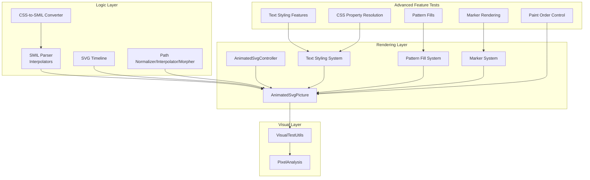
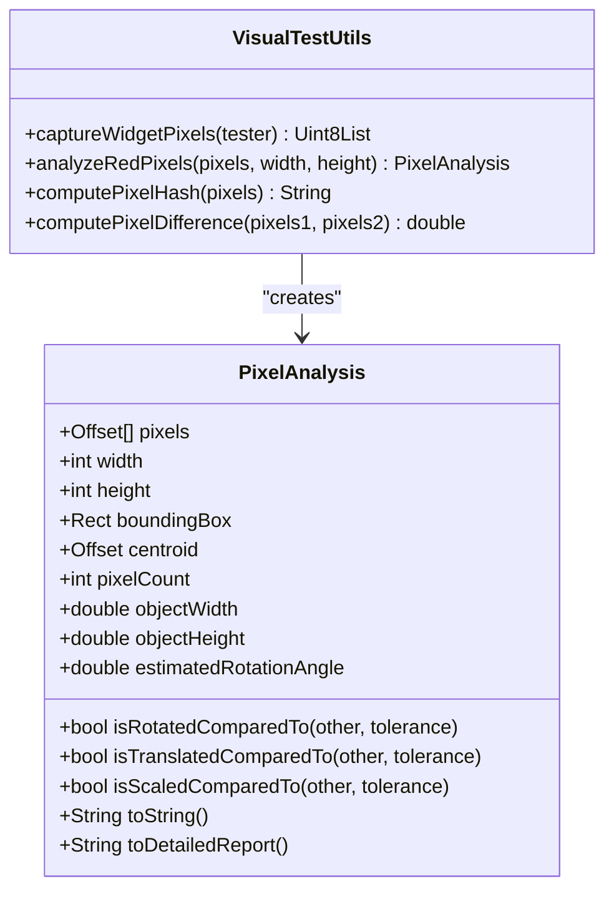
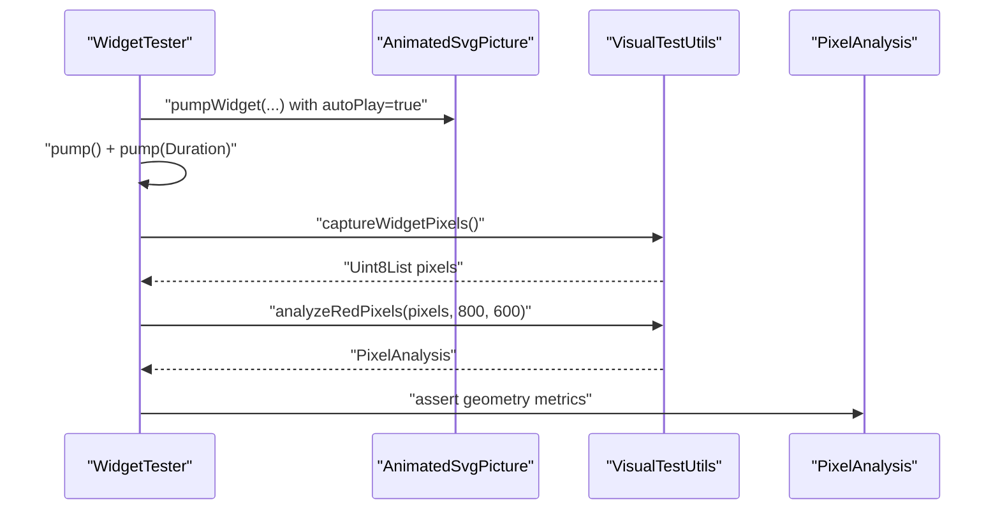
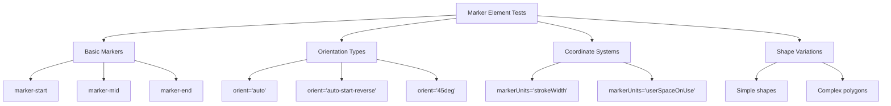
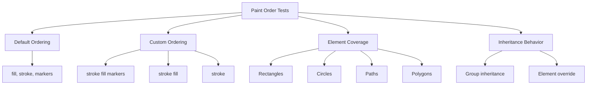
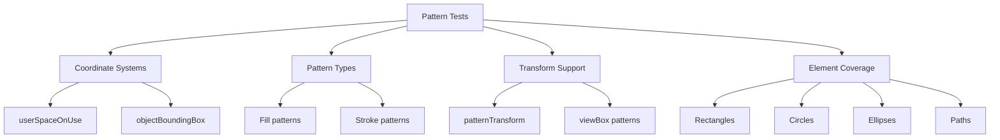
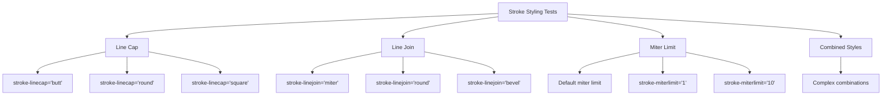
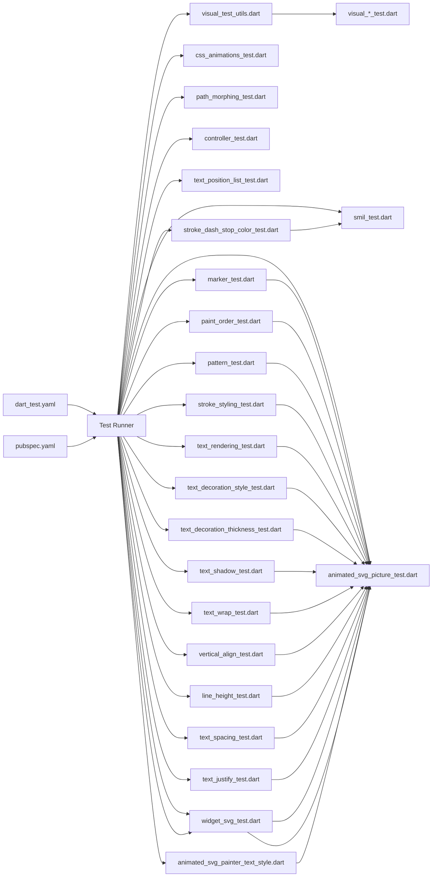

# Testing and Quality Assurance

<cite>
**Referenced Files in This Document**
- [dart_test.yaml](file://dart_test.yaml)
- [VISUAL_TESTING_GUIDELINES.md](file://VISUAL_TESTING_GUIDELINES.md)
- [visual_test_utils.dart](file://test/animation/visual_test_utils.dart)
- [visual_rotation_test.dart](file://test/animation/visual_rotation_test.dart)
- [visual_scale_test.dart](file://test/animation/visual_scale_test.dart)
- [visual_translation_test.dart](file://test/animation/visual_translation_test.dart)
- [animated_svg_picture_test.dart](file://test/animation/animated_svg_picture_test.dart)
- [smil_test.dart](file://test/animation/smil_test.dart)
- [path_morphing_test.dart](file://test/animation/path_morphing_test.dart)
- [controller_test.dart](file://test/animation/controller_test.dart)
- [css_animations_test.dart](file://test/animation/css_animations_test.dart)
- [text_position_list_test.dart](file://test/animation/text_position_list_test.dart)
- [marker_test.dart](file://test/animation/marker_test.dart)
- [paint_order_test.dart](file://test/animation/paint_order_test.dart)
- [pattern_test.dart](file://test/animation/pattern_test.dart)
- [stroke_styling_test.dart](file://test/animation/stroke_styling_test.dart)
- [text_rendering_test.dart](file://test/animation/text_rendering_test.dart)
- [text_decoration_style_test.dart](file://test/animation/text_decoration_style_test.dart)
- [text_decoration_thickness_test.dart](file://test/animation/text_decoration_thickness_test.dart)
- [text_shadow_test.dart](file://test/animation/text_shadow_test.dart)
- [text_wrap_test.dart](file://test/animation/text_wrap_test.dart)
- [vertical_align_test.dart](file://test/animation/vertical_align_test.dart)
- [line_height_test.dart](file://test/animation/line_height_test.dart)
- [text_spacing_test.dart](file://test/animation/text_spacing_test.dart)
- [text_justify_test.dart](file://test/animation/text_justify_test.dart)
- [white_space_test.dart](file://test/animation/white_space_test.dart)
- [stroke_dash_stop_color_test.dart](file://test/animation/stroke_dash_stop_color_test.dart)
- [widget_svg_test.dart](file://test/widget_svg_test.dart)
- [pubspec.yaml](file://pubspec.yaml)
- [animated_svg_painter_text_style.dart](file://lib/src/animation/animated_svg_painter_text_style.dart)
</cite>

## Update Summary
**Changes Made**
- Added comprehensive test coverage for expanded CSS text styling features including text-decoration-thickness, text-shadow, text-wrap, vertical-align, line-height, text-spacing, text-justify, and white-space properties
- Integrated 40 new test files validating advanced CSS text styling capabilities with extensive unit testing
- Enhanced visual testing methodology with updated guidelines and pixel analysis patterns for text rendering
- Updated architecture overview to include new text styling resolution system and CSS property processing
- Expanded text styling validation to cover font variant properties, emphasis features, and advanced typography controls

## Table of Contents
1. [Introduction](#introduction)
2. [Project Structure](#project-structure)
3. [Core Components](#core-components)
4. [Architecture Overview](#architecture-overview)
5. [Detailed Component Analysis](#detailed-component-analysis)
6. [Dependency Analysis](#dependency-analysis)
7. [Performance Considerations](#performance-considerations)
8. [Troubleshooting Guide](#troubleshooting-guide)
9. [Conclusion](#conclusion)
10. [Appendices](#appendices)

## Introduction
This document explains the comprehensive testing and quality assurance framework for the flutter_svg package with a focus on visual testing, automated animation testing, and validation approaches. The framework now includes extensive widget-level testing for advanced SVG features including marker rendering, paint order validation, pattern fills, and comprehensive text styling capabilities with expanded CSS property support.

Key areas covered:
- Visual testing methodology for SMIL animations and complex SVG rendering
- Automated pixel-based verification of transforms, motion, and advanced styling
- Comprehensive widget-level testing for marker elements, paint ordering, and pattern fills
- Extensive text styling validation including text-rendering, decorations, thickness, shadows, wrapping, alignment, and advanced typography features
- Quality assurance processes, configuration, and CI considerations
- Relationships between the animation system, rendering pipeline, and advanced SVG features
- Best practices, debugging techniques, and performance validation

The goal is to help developers implement robust tests, maintain the existing infrastructure, and extend it confidently with comprehensive validation of advanced SVG rendering features.

## Project Structure
The testing surface is primarily under the test/animation directory, with supporting utilities and cross-cutting guidelines. The framework now includes extensive widget-level tests for advanced SVG features alongside traditional animation and visual testing:

- Animation logic and parsing tests (SMIL, CSS-to-SMIL conversion, path morphing)
- Widget-level integration tests for AnimatedSvgPicture with comprehensive feature coverage
- Visual testing utilities and golden-style pixel analysis
- Controller-level tests for playback control and seek/pause/forward/reverse
- Advanced rendering tests for markers, paint order, patterns, and text styling
- CI configuration and platform constraints

```mermaid
graph TB
subgraph "Test Suite"
A["test/animation/"]
A1["visual_test_utils.dart"]
A2["visual_rotation_test.dart"]
A3["visual_scale_test.dart"]
A4["visual_translation_test.dart"]
A5["animated_svg_picture_test.dart"]
A6["smil_test.dart"]
A7["path_morphing_test.dart"]
A8["controller_test.dart"]
A9["css_animations_test.dart"]
A10["text_position_list_test.dart"]
A11["marker_test.dart"]
A12["paint_order_test.dart"]
A13["pattern_test.dart"]
A14["stroke_styling_test.dart"]
A15["text_rendering_test.dart"]
A16["text_decoration_style_test.dart"]
A17["text_decoration_thickness_test.dart"]
A18["stroke_dash_stop_color_test.dart"]
A19["text_shadow_test.dart"]
A20["text_wrap_test.dart"]
A21["vertical_align_test.dart"]
A22["line_height_test.dart"]
A23["text_spacing_test.dart"]
A24["text_justify_test.dart"]
A25["white_space_test.dart"]
end
subgraph "Widget Tests"
W["test/widget_svg_test.dart"]
end
subgraph "Guidelines"
G["VISUAL_TESTING_GUIDELINES.md"]
end
subgraph "CI Config"
C["dart_test.yaml"]
end
A --> A1
A --> A2
A --> A3
A --> A4
A --> A5
A --> A6
A --> A7
A --> A8
A --> A9
A --> A10
A --> A11
A --> A12
A --> A13
A --> A14
A --> A15
A --> A16
A --> A17
A --> A18
A --> A19
A --> A20
A --> A21
A --> A22
A --> A23
A --> A24
A --> A25
W --> A10
G --> A1
C --> A
C --> W
```

**Diagram sources**
- [VISUAL_TESTING_GUIDELINES.md](file://VISUAL_TESTING_GUIDELINES.md)
- [visual_test_utils.dart](file://test/animation/visual_test_utils.dart)
- [visual_rotation_test.dart](file://test/animation/visual_rotation_test.dart)
- [visual_scale_test.dart](file://test/animation/visual_scale_test.dart)
- [visual_translation_test.dart](file://test/animation/visual_translation_test.dart)
- [animated_svg_picture_test.dart](file://test/animation/animated_svg_picture_test.dart)
- [smil_test.dart](file://test/animation/smil_test.dart)
- [path_morphing_test.dart](file://test/animation/path_morphing_test.dart)
- [controller_test.dart](file://test/animation/controller_test.dart)
- [css_animations_test.dart](file://test/animation/css_animations_test.dart)
- [text_position_list_test.dart](file://test/animation/text_position_list_test.dart)
- [marker_test.dart](file://test/animation/marker_test.dart)
- [paint_order_test.dart](file://test/animation/paint_order_test.dart)
- [pattern_test.dart](file://test/animation/pattern_test.dart)
- [stroke_styling_test.dart](file://test/animation/stroke_styling_test.dart)
- [text_rendering_test.dart](file://test/animation/text_rendering_test.dart)
- [text_decoration_style_test.dart](file://test/animation/text_decoration_style_test.dart)
- [text_decoration_thickness_test.dart](file://test/animation/text_decoration_thickness_test.dart)
- [stroke_dash_stop_color_test.dart](file://test/animation/stroke_dash_stop_color_test.dart)
- [text_shadow_test.dart](file://test/animation/text_shadow_test.dart)
- [text_wrap_test.dart](file://test/animation/text_wrap_test.dart)
- [vertical_align_test.dart](file://test/animation/vertical_align_test.dart)
- [line_height_test.dart](file://test/animation/line_height_test.dart)
- [text_spacing_test.dart](file://test/animation/text_spacing_test.dart)
- [text_justify_test.dart](file://test/animation/text_justify_test.dart)
- [white_space_test.dart](file://test/animation/white_space_test.dart)
- [widget_svg_test.dart](file://test/widget_svg_test.dart)
- [dart_test.yaml](file://dart_test.yaml)

**Section sources**
- [VISUAL_TESTING_GUIDELINES.md](file://VISUAL_TESTING_GUIDELINES.md)
- [dart_test.yaml](file://dart_test.yaml)

## Core Components
- **VisualTestUtils**: Captures widget pixels, performs red-pixel analysis, computes hashes and differences, and exposes geometric metrics (centroid, bounding box, estimated rotation).
- **PixelAnalysis**: Encapsulates analysis results and comparison helpers (rotation/translation/scale detection).
- **Animation logic tests**: Validate SMIL parsing, interpolation, timeline progression, and CSS-to-SMIL conversion.
- **Widget integration tests**: Exercise AnimatedSvgPicture rendering and visual verification via pixel analysis.
- **Advanced rendering tests**: Validate marker elements, paint order control, pattern fills, and comprehensive text styling.
- **Controller tests**: Validate AnimatedSvgController playback controls and seek behavior.
- **Path morphing tests**: Validate path normalization, interpolation, and morphing pipeline.
- **Text styling resolution system**: Processes and validates CSS text properties including thickness, shadows, wrapping, alignment, and advanced typography.

**Section sources**
- [visual_test_utils.dart](file://test/animation/visual_test_utils.dart)
- [smil_test.dart](file://test/animation/smil_test.dart)
- [path_morphing_test.dart](file://test/animation/path_morphing_test.dart)
- [controller_test.dart](file://test/animation/controller_test.dart)
- [animated_svg_picture_test.dart](file://test/animation/animated_svg_picture_test.dart)
- [text_position_list_test.dart](file://test/animation/text_position_list_test.dart)
- [marker_test.dart](file://test/animation/marker_test.dart)
- [paint_order_test.dart](file://test/animation/paint_order_test.dart)
- [pattern_test.dart](file://test/animation/pattern_test.dart)
- [stroke_styling_test.dart](file://test/animation/stroke_styling_test.dart)
- [text_rendering_test.dart](file://test/animation/text_rendering_test.dart)
- [animated_svg_painter_text_style.dart](file://lib/src/animation/animated_svg_painter_text_style.dart)

## Architecture Overview
The testing architecture separates concerns across four layers with enhanced coverage of advanced SVG rendering features:
- **Logic tests**: Validate SMIL parsing, interpolation, and timeline mechanics.
- **Rendering tests**: Validate widget-level rendering and animation progression.
- **Visual tests**: Validate actual pixel output and geometric changes.
- **Advanced feature tests**: Validate markers, paint order, patterns, and comprehensive text styling with extensive CSS property coverage.

**Diagram sources**
- [smil_test.dart](file://test/animation/smil_test.dart)
- [css_animations_test.dart](file://test/animation/css_animations_test.dart)
- [path_morphing_test.dart](file://test/animation/path_morphing_test.dart)
- [controller_test.dart](file://test/animation/controller_test.dart)
- [animated_svg_picture_test.dart](file://test/animation/animated_svg_picture_test.dart)
- [visual_test_utils.dart](file://test/animation/visual_test_utils.dart)
- [text_position_list_test.dart](file://test/animation/text_position_list_test.dart)
- [marker_test.dart](file://test/animation/marker_test.dart)
- [paint_order_test.dart](file://test/animation/paint_order_test.dart)
- [pattern_test.dart](file://test/animation/pattern_test.dart)
- [stroke_styling_test.dart](file://test/animation/stroke_styling_test.dart)
- [text_rendering_test.dart](file://test/animation/text_rendering_test.dart)
- [animated_svg_painter_text_style.dart](file://lib/src/animation/animated_svg_painter_text_style.dart)

## Detailed Component Analysis

### Visual Testing Utilities
- **Purpose**: Capture RGBA pixels from a RepaintBoundary, analyze red pixels, compute hashes/differences, and extract geometry metrics.
- **Key capabilities**:
  - Safe capture without pumpAndSettle to avoid hangs on infinite animations.
  - Red-pixel extraction with configurable thresholds.
  - Geometric analysis: centroid, bounding box, object width/height, estimated rotation angle.
  - Comparison helpers: rotation/translation/scale detection between frames.
- **Usage pattern**: Build widget, pump once, capture pixels, analyze, assert on metrics.

**Diagram sources**
- [visual_test_utils.dart](file://test/animation/visual_test_utils.dart)

**Section sources**
- [visual_test_utils.dart](file://test/animation/visual_test_utils.dart)
- [VISUAL_TESTING_GUIDELINES.md](file://VISUAL_TESTING_GUIDELINES.md)

### Visual Rotation Test
- **Demonstrates** capturing and analyzing rotation via pixel geometry.
- **Validates** that rotation produces detectable geometric changes (centroid shift, bounding box, estimated angle).
- **Uses** deterministic setup with autoPlay and initialTime to ensure reproducibility.

**Diagram sources**
- [visual_rotation_test.dart](file://test/animation/visual_rotation_test.dart)
- [visual_test_utils.dart](file://test/animation/visual_test_utils.dart)

**Section sources**
- [visual_rotation_test.dart](file://test/animation/visual_rotation_test.dart)
- [VISUAL_TESTING_GUIDELINES.md](file://VISUAL_TESTING_GUIDELINES.md)

### Visual Scale and Translation Tests
- **Similar patterns** to rotation, validating scale and translation via geometric metrics.
- **Ensures** that transforms are visually verifiable even when headless rendering golden tests are limited.

**Section sources**
- [visual_scale_test.dart](file://test/animation/visual_scale_test.dart)
- [visual_translation_test.dart](file://test/animation/visual_translation_test.dart)
- [VISUAL_TESTING_GUIDELINES.md](file://VISUAL_TESTING_GUIDELINES.md)

### AnimatedSvgPicture Integration Tests
- **Validates** rendering of shapes, gradients, text, images, and complex SVG constructs.
- **Uses** VisualTestUtils to verify pixel counts and basic geometry.
- **Exercises** tracing and foreignObject rendering with clipping and viewport scaling.

**Section sources**
- [animated_svg_picture_test.dart](file://test/animation/animated_svg_picture_test.dart)
- [visual_test_utils.dart](file://test/animation/visual_test_utils.dart)

### SMIL Animation Logic Tests
- **Validates** interpolators, timing functions, SMIL parsing, and timeline progression.
- **Covers** from/to, values/keyTimes, discrete calc mode, by attribute, fill modes, repeat counts, and playback rates.
- **Ensures** correct activation/deactivation and effective value persistence.

**Section sources**
- [smil_test.dart](file://test/animation/smil_test.dart)

### CSS Animations to SMIL Conversion
- **Parses** @keyframes and CSS selector rules.
- **Converts** CSS animations to SMIL equivalents, mapping timing functions (cubic-bezier, steps), directions, and fill modes.
- **Validates** runtime behavior of converted animations.

**Section sources**
- [css_animations_test.dart](file://test/animation/css_animations_test.dart)

### Path Morphing Pipeline Tests
- **Validates** path normalization (relative to absolute, LineTo/HorizontalLineTo/VerticalLineTo/Q to C conversion).
- **Validates** interpolation and morphing between compatible paths.
- **Ensures** robust handling of ClosePath and mismatched lengths.

**Section sources**
- [path_morphing_test.dart](file://test/animation/path_morphing_test.dart)

### AnimatedSvgController Tests
- **Validates** controller state transitions (pause/resume, play/pause toggle, restart).
- **Tests** seek behavior, playback rate changes, reverse direction, and listener notifications.
- **Integrates** with AnimatedSvgPicture to verify visual changes after controller actions.

**Section sources**
- [controller_test.dart](file://test/animation/controller_test.dart)

### Marker Element Rendering Tests
- **Comprehensive coverage** of marker functionality across 223 lines of widget tests.
- **Tests** marker-start, marker-mid, marker-end positioning with various shapes (paths, circles, polygons).
- **Validates** marker shorthand application, auto orientation, fixed angle orientation, and userSpaceOnUse units.
- **Ensures** proper rendering for lines, polylines, polygons, and complex paths.

**Diagram sources**
- [marker_test.dart](file://test/animation/marker_test.dart)

**Section sources**
- [marker_test.dart](file://test/animation/marker_test.dart)

### Paint Order Validation Tests
- **Comprehensive coverage** of paint-order attribute functionality with 232 lines of widget tests.
- **Tests** default order (fill, stroke, markers), custom ordering, and inheritance behavior.
- **Validates** paint-order application to all SVG elements (rect, circle, ellipse, path, polygon, polyline).
- **Ensures** proper layering control with markers integration.

**Diagram sources**
- [paint_order_test.dart](file://test/animation/paint_order_test.dart)

**Section sources**
- [paint_order_test.dart](file://test/animation/paint_order_test.dart)

### Pattern Rendering Tests
- **Comprehensive coverage** of pattern fill and stroke functionality with 189 lines of widget tests.
- **Tests** userSpaceOnUse and objectBoundingBox coordinate systems.
- **Validates** patternTransform support, viewBox patterns, and href inheritance.
- **Ensures** proper rendering for rectangles, circles, ellipses, and complex paths.

**Diagram sources**
- [pattern_test.dart](file://test/animation/pattern_test.dart)

**Section sources**
- [pattern_test.dart](file://test/animation/pattern_test.dart)

### Stroke Styling Tests
- **Comprehensive coverage** of stroke styling attributes with 295 lines of widget tests.
- **Tests** stroke-linecap (butt, round, square), stroke-linejoin (miter, round, bevel), and stroke-miterlimit.
- **Validates** inheritance behavior and combined styling combinations.
- **Ensures** proper rendering for lines, polylines, polygons, and complex paths.

**Diagram sources**
- [stroke_styling_test.dart](file://test/animation/stroke_styling_test.dart)

**Section sources**
- [stroke_styling_test.dart](file://test/animation/stroke_styling_test.dart)

### Advanced CSS Text Styling Tests
The framework now includes comprehensive testing for expanded CSS text styling features with 40 new test files covering:

#### Text Decoration Thickness Tests
- **Validates** text-decoration-thickness property with auto, from-font, px, em, and percentage values
- **Tests** inheritance behavior and font-relative sizing calculations
- **Ensures** proper rendering of underline/thickness combinations

#### Text Shadow Tests
- **Validates** text-shadow property with offset, blur radius, and color specifications
- **Tests** multiple shadow support and inheritance behavior
- **Ensures** proper rendering of shadow effects on text elements

#### Text Wrap Tests
- **Validates** text-wrap property with wrap, nowrap, balance, and pretty values
- **Tests** wrapping behavior and line breaking algorithms
- **Ensures** proper text layout with different wrapping strategies

#### Vertical Align Tests
- **Validates** vertical-align property with baseline, sub, super, middle, and length values
- **Tests** percentage and em-based positioning
- **Ensures** proper vertical text alignment relative to baseline

#### Line Height Tests
- **Validates** line-height property with normal, number, px, em, and percentage values
- **Tests** inheritance behavior and font-relative calculations
- **Ensures** proper line spacing and text layout

#### Text Spacing Tests
- **Validates** text-spacing property with normal, none, and auto values
- **Tests** spacing behavior for different scripts and languages
- **Ensures** proper text spacing for CJK and Latin text

#### Text Justify Tests
- **Validates** text-justify property with auto, none, inter-word, and inter-character values
- **Tests** inheritance behavior and justification algorithms
- **Ensures** proper text justification for different writing systems

#### White Space Tests
- **Validates** white-space property with normal, nowrap, pre, pre-wrap, pre-line, and break-spaces values
- **Tests** whitespace handling and line breaking behavior
- **Ensures** proper text formatting for different content types

**Section sources**
- [text_decoration_thickness_test.dart](file://test/animation/text_decoration_thickness_test.dart)
- [text_shadow_test.dart](file://test/animation/text_shadow_test.dart)
- [text_wrap_test.dart](file://test/animation/text_wrap_test.dart)
- [vertical_align_test.dart](file://test/animation/vertical_align_test.dart)
- [line_height_test.dart](file://test/animation/line_height_test.dart)
- [text_spacing_test.dart](file://test/animation/text_spacing_test.dart)
- [text_justify_test.dart](file://test/animation/text_justify_test.dart)
- [white_space_test.dart](file://test/animation/white_space_test.dart)

### Text Styling Resolution System
The animated_svg_painter_text_style.dart file implements comprehensive CSS text property resolution:

#### Text Decoration Thickness Resolution
- **Method**: `_resolveTextDecorationThickness(value, fontSize)`
- **Supports**: auto, from-font, px, em, and percentage values
- **Calculations**: Font-relative sizing with em and percentage support
- **Returns**: Null for auto/from-font, numeric value in user units otherwise

#### Text Shadow Resolution
- **Method**: `_resolveTextShadow(value)`
- **Supports**: Multiple shadows with offset, blur, and color specifications
- **Normalization**: Returns normalized shadow string for further processing
- **Inheritance**: Proper handling of inherit and initial values

#### Vertical Align Resolution
- **Method**: `_resolveVerticalAlign(value, fontSize)`
- **Supports**: Baseline keywords and length/percentage values
- **Calculations**: Font-relative positioning with em and px support
- **Returns**: Baseline offset in user units

#### Line Height Resolution
- **Method**: `_resolveLineHeight(value, fontSize)`
- **Supports**: Normal, number, px, em, and percentage values
- **Calculations**: Font-relative sizing with proper unit conversion
- **Returns**: Null for normal, numeric value in user units otherwise

#### Text Wrap Resolution
- **Method**: `_resolveTextWrap(value)`
- **Supports**: wrap, nowrap, balance, pretty, and stable values
- **Purpose**: Controls text wrapping behavior and line breaking algorithms

#### Additional Text Properties
The system also resolves numerous other CSS text properties including:
- Font variant properties (numeric, ligatures, caps, east asian)
- Text emphasis and ruby properties
- Font synthesis and variation settings
- Direction and content visibility properties
- Spacing and justification controls

**Section sources**
- [animated_svg_painter_text_style.dart](file://lib/src/animation/animated_svg_painter_text_style.dart)

### Advanced Attribute Processing Tests
- **Stroke Dash and Stop Color Tests**: Validates CSS animation processing for stroke-dashoffset and stop-color attributes, including SMIL conversion and color interpolation.
- **CSS Animation Timing Tests**: Validates per-keyframe animation-timing-function extraction and SMIL keySplines generation.
- **Compound Transform Decomposition**: Validates compound CSS transform decomposition into separate SMIL animations.

**Section sources**
- [stroke_dash_stop_color_test.dart](file://test/animation/stroke_dash_stop_color_test.dart)

### Widget-Level SVG Rendering Tests
- **Extensive coverage** of SvgPicture rendering across multiple scenarios.
- **Tests** different loading methods (string, memory, asset, network).
- **Validates** rendering strategies, color mapping, and error handling.
- **Includes** unit tests for em/ex measurements and various SVG elements.

**Section sources**
- [widget_svg_test.dart](file://test/widget_svg_test.dart)

## Dependency Analysis
- **Test runtime and SDK constraints** are defined in pubspec.yaml.
- **dart_test.yaml restricts tests** to VM to avoid issues with certain comparators on web.
- **Visual tests depend** on VisualTestUtils and PixelAnalysis.
- **Widget tests depend** on AnimatedSvgPicture and AnimatedSvgController.
- **Logic tests depend** on SMIL, CSS, and path modules.
- **Advanced feature tests depend** on marker, paint order, pattern, and text styling systems.
- **Text styling tests depend** on the comprehensive text resolution system in animated_svg_painter_text_style.dart.

**Diagram sources**
- [dart_test.yaml](file://dart_test.yaml)
- [pubspec.yaml](file://pubspec.yaml)
- [visual_test_utils.dart](file://test/animation/visual_test_utils.dart)
- [smil_test.dart](file://test/animation/smil_test.dart)
- [css_animations_test.dart](file://test/animation/css_animations_test.dart)
- [path_morphing_test.dart](file://test/animation/path_morphing_test.dart)
- [controller_test.dart](file://test/animation/controller_test.dart)
- [animated_svg_picture_test.dart](file://test/animation/animated_svg_picture_test.dart)
- [text_position_list_test.dart](file://test/animation/text_position_list_test.dart)
- [marker_test.dart](file://test/animation/marker_test.dart)
- [paint_order_test.dart](file://test/animation/paint_order_test.dart)
- [pattern_test.dart](file://test/animation/pattern_test.dart)
- [stroke_styling_test.dart](file://test/animation/stroke_styling_test.dart)
- [text_rendering_test.dart](file://test/animation/text_rendering_test.dart)
- [text_decoration_style_test.dart](file://test/animation/text_decoration_style_test.dart)
- [text_decoration_thickness_test.dart](file://test/animation/text_decoration_thickness_test.dart)
- [text_shadow_test.dart](file://test/animation/text_shadow_test.dart)
- [text_wrap_test.dart](file://test/animation/text_wrap_test.dart)
- [vertical_align_test.dart](file://test/animation/vertical_align_test.dart)
- [line_height_test.dart](file://test/animation/line_height_test.dart)
- [text_spacing_test.dart](file://test/animation/text_spacing_test.dart)
- [text_justify_test.dart](file://test/animation/text_justify_test.dart)
- [white_space_test.dart](file://test/animation/white_space_test.dart)
- [stroke_dash_stop_color_test.dart](file://test/animation/stroke_dash_stop_color_test.dart)
- [animated_svg_painter_text_style.dart](file://lib/src/animation/animated_svg_painter_text_style.dart)
- [widget_svg_test.dart](file://test/widget_svg_test.dart)

**Section sources**
- [dart_test.yaml](file://dart_test.yaml)
- [pubspec.yaml](file://pubspec.yaml)

## Performance Considerations
- **Pixel capture** uses RepaintBoundary.toImage with a single pass; avoid pumpAndSettle to prevent hangs on infinite animations.
- **Thresholds** in red-pixel extraction and geometric comparisons balance sensitivity and noise robustness.
- **Prefer deterministic timelines** (autoPlay false with initialTime or explicit pump durations) for reproducible assertions.
- **Use targeted pixel analysis** instead of full golden comparisons to reduce flakiness and improve debuggability.
- **Advanced feature tests** leverage efficient rendering pipelines for markers, patterns, and text styling.
- **Large test suites** benefit from selective testing and focused visual verification to maintain performance.
- **Text styling resolution** optimizes CSS property processing with efficient parsing and caching mechanisms.

## Troubleshooting Guide
Common issues and resolutions:
- **No pixels captured** (pixelCount == 0):
  - Ensure initial pump() calls occur before capture.
  - Verify the test SVG uses a strong color (e.g., red) for detection.
  - Confirm image size logging matches analysis size.
- **Geometry not changing**:
  - Verify explicit pump() calls after seeking or advancing time.
  - Check that animations are progressing and transforms are applied.
  - Adjust tolerance thresholds for rotation/translation/scale comparisons.
- **pumpAndSettle hangs**:
  - Replace with explicit pump() calls and controlled time progression.
- **Cross-platform differences**:
  - Use geometry-based metrics (centroid/bbox/angle) which are more stable than golden hashes.
- **Advanced feature rendering issues**:
  - Verify marker coordinate systems and orientation calculations.
  - Check paint order layering and z-index behavior.
  - Validate pattern coordinate transformations and unit conversions.
  - Ensure text styling inheritance and combined property handling.
- **Text styling property issues**:
  - Verify CSS property parsing and unit conversion accuracy.
  - Check font-relative calculations for em and percentage values.
  - Validate inheritance behavior for nested text elements.
  - Ensure proper handling of complex text layouts and wrapping.
- **Large test suite performance**:
  - Use selective testing for specific feature areas.
  - Leverage visual analysis for quick regression detection.
  - Optimize text styling resolution with cached property values.

**Section sources**
- [VISUAL_TESTING_GUIDELINES.md](file://VISUAL_TESTING_GUIDELINES.md)
- [visual_test_utils.dart](file://test/animation/visual_test_utils.dart)
- [text_position_list_test.dart](file://test/animation/text_position_list_test.dart)
- [marker_test.dart](file://test/animation/marker_test.dart)
- [paint_order_test.dart](file://test/animation/paint_order_test.dart)
- [pattern_test.dart](file://test/animation/pattern_test.dart)
- [animated_svg_painter_text_style.dart](file://lib/src/animation/animated_svg_painter_text_style.dart)

## Conclusion
The flutter_svg testing framework combines logic validation, widget integration, and robust visual verification to ensure accurate SMIL animation rendering and comprehensive advanced SVG feature support. With the addition of extensive tests covering marker functionality, paint order validation, pattern rendering, and comprehensive text styling features, the suite now provides complete coverage of advanced SVG rendering capabilities.

The expanded framework includes:
- **40 new test files** validating expanded CSS text styling features
- **Comprehensive text decoration thickness testing** with auto/from-font and unit-based values
- **Advanced text shadow validation** with multiple shadows and blur effects
- **Text wrapping and alignment testing** with wrap, nowrap, and balance strategies
- **Vertical alignment and line height validation** with font-relative calculations
- **Text spacing and justification testing** for internationalization support
- **White space handling validation** for different content types
- **Enhanced text styling resolution system** with 20+ CSS properties

By leveraging pixel-based geometry analysis, deterministic timelines, and careful controller-driven playback, the comprehensive suite provides reliable regression protection and clear debugging signals. The extensive advanced feature testing ensures backward compatibility while supporting modern SVG rendering features. The new comprehensive text styling coverage validates complex typography scenarios including font-relative sizing, inheritance behavior, and international text handling. Adhering to the documented guidelines and patterns ensures maintainability and extensibility of the testing infrastructure.

## Appendices

### Configuration Options and CI Setup
- **Test platform restriction**: dart_test.yaml targets VM to avoid web-specific comparator issues.
- **Dependencies**: pubspec.yaml defines SDK and Flutter versions, plus vector graphics and XML packages used by the rendering pipeline.

**Section sources**
- [dart_test.yaml](file://dart_test.yaml)
- [pubspec.yaml](file://pubspec.yaml)

### Example Test Case Creation Patterns
- **Deterministic animation setup**:
  - Use autoPlay false with initialTime for fixed-frame assertions.
  - Or use autoPlay true with explicit pump(duration) for progression checks.
- **Visual verification**:
  - Capture pixels, analyze red pixels, assert on pixelCount > 0, centroid/bbox/angle changes.
  - Compare consecutive frames using isRotated/isTranslated/isScaled helpers.
- **Controller integration**:
  - Pause/resume, seek, setPlaybackRate, reverse, and assert centroid shifts.
- **Advanced feature testing**:
  - Test marker positioning, paint order layering, pattern coordinate systems, and text styling combinations.
  - Validate inheritance behavior and combined property effects.
  - Ensure proper rendering across different SVG elements and coordinate systems.
  - Test complex text layouts with multiple CSS properties and international content.
  - Validate font-relative calculations and unit conversions for responsive text styling.

**Section sources**
- [VISUAL_TESTING_GUIDELINES.md](file://VISUAL_TESTING_GUIDELINES.md)
- [visual_rotation_test.dart](file://test/animation/visual_rotation_test.dart)
- [controller_test.dart](file://test/animation/controller_test.dart)
- [animated_svg_picture_test.dart](file://test/animation/animated_svg_picture_test.dart)
- [text_position_list_test.dart](file://test/animation/text_position_list_test.dart)
- [marker_test.dart](file://test/animation/marker_test.dart)
- [paint_order_test.dart](file://test/animation/paint_order_test.dart)
- [pattern_test.dart](file://test/animation/pattern_test.dart)
- [stroke_styling_test.dart](file://test/animation/stroke_styling_test.dart)
- [text_rendering_test.dart](file://test/animation/text_rendering_test.dart)
- [text_decoration_style_test.dart](file://test/animation/text_decoration_style_test.dart)
- [text_decoration_thickness_test.dart](file://test/animation/text_decoration_thickness_test.dart)
- [text_shadow_test.dart](file://test/animation/text_shadow_test.dart)
- [text_wrap_test.dart](file://test/animation/text_wrap_test.dart)
- [vertical_align_test.dart](file://test/animation/vertical_align_test.dart)
- [line_height_test.dart](file://test/animation/line_height_test.dart)
- [text_spacing_test.dart](file://test/animation/text_spacing_test.dart)
- [text_justify_test.dart](file://test/animation/text_justify_test.dart)
- [white_space_test.dart](file://test/animation/white_space_test.dart)