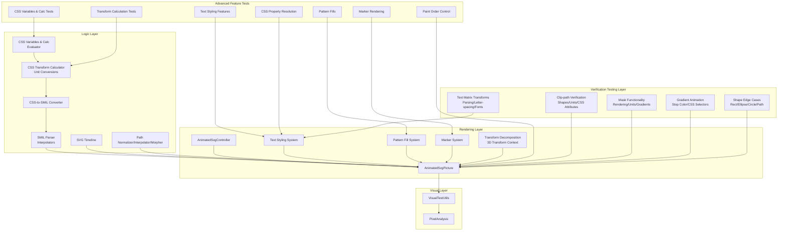
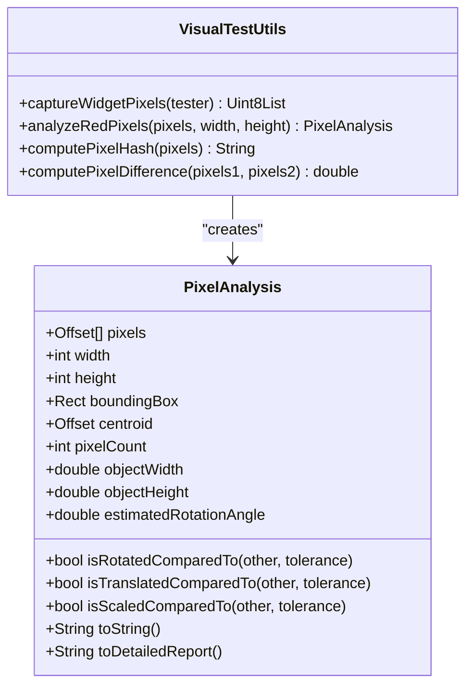
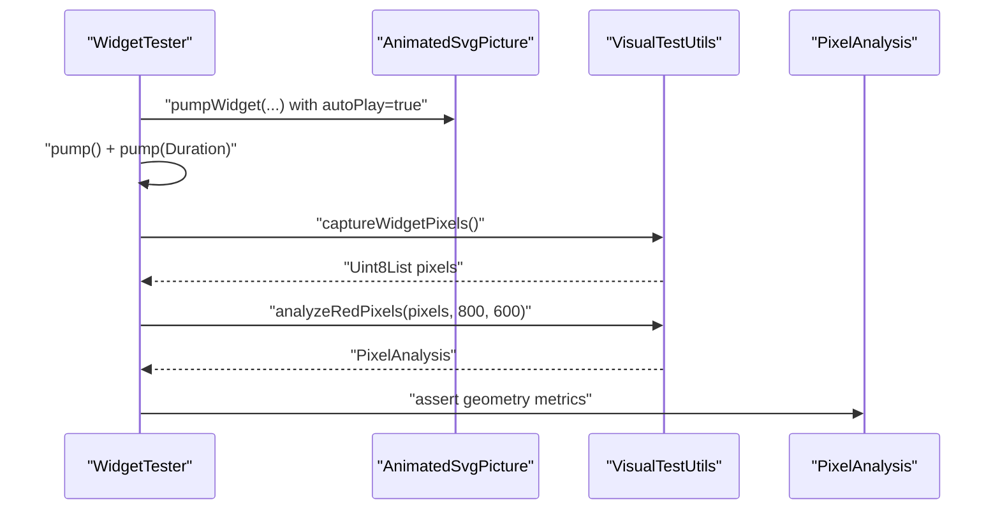
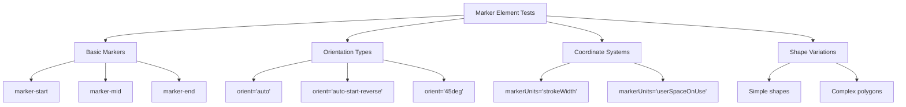
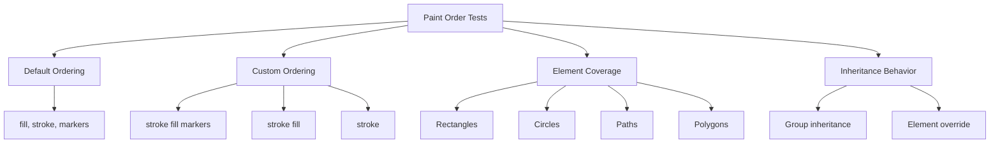
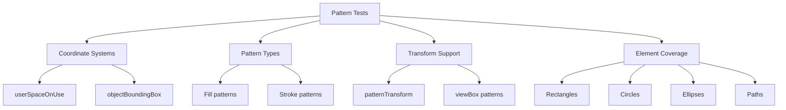
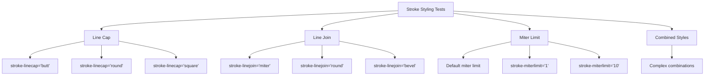
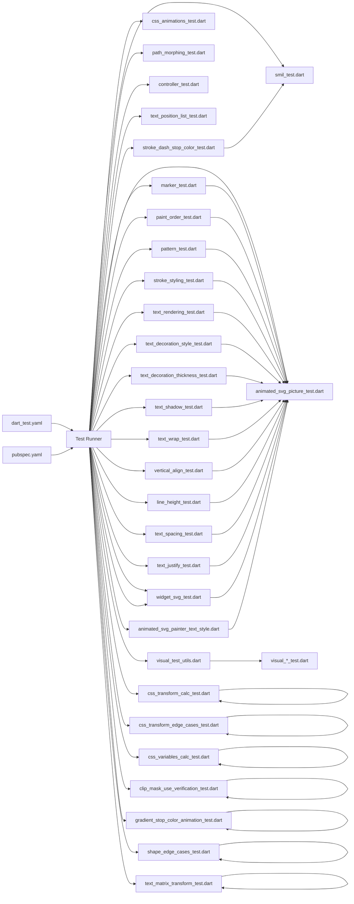

# Testing and Quality Assurance

<cite>
**Referenced Files in This Document**
- [dart_test.yaml](file://dart_test.yaml)
- [VISUAL_TESTING_GUIDELINES.md](file://VISUAL_TESTING_GUIDELINES.md)
- [visual_test_utils.dart](file://test/animation/visual_test_utils.dart)
- [visual_rotation_test.dart](file://test/animation/visual_rotation_test.dart)
- [visual_scale_test.dart](file://test/animation/visual_scale_test.dart)
- [visual_translation_test.dart](file://test/animation/visual_translation_test.dart)
- [animated_svg_picture_test.dart](file://test/animation/animated_svg_picture_test.dart)
- [smil_test.dart](file://test/animation/smil_test.dart)
- [path_morphing_test.dart](file://test/animation/path_morphing_test.dart)
- [controller_test.dart](file://test/animation/controller_test.dart)
- [css_animations_test.dart](file://test/animation/css_animations_test.dart)
- [css_transform_calc_test.dart](file://test/animation/css_transform_calc_test.dart)
- [css_transform_edge_cases_test.dart](file://test/animation/css_transform_edge_cases_test.dart)
- [css_variables_calc_test.dart](file://test/animation/css_variables_calc_test.dart)
- [text_position_list_test.dart](file://test/animation/text_position_list_test.dart)
- [marker_test.dart](file://test/animation/marker_test.dart)
- [paint_order_test.dart](file://test/animation/paint_order_test.dart)
- [pattern_test.dart](file://test/animation/pattern_test.dart)
- [stroke_styling_test.dart](file://test/animation/stroke_styling_test.dart)
- [text_rendering_test.dart](file://test/animation/text_rendering_test.dart)
- [text_decoration_style_test.dart](file://test/animation/text_decoration_style_test.dart)
- [text_decoration_thickness_test.dart](file://test/animation/text_decoration_thickness_test.dart)
- [text_shadow_test.dart](file://test/animation/text_shadow_test.dart)
- [text_wrap_test.dart](file://test/animation/text_wrap_test.dart)
- [vertical_align_test.dart](file://test/animation/vertical_align_test.dart)
- [line_height_test.dart](file://test/animation/line_height_test.dart)
- [text_spacing_test.dart](file://test/animation/text_spacing_test.dart)
- [text_justify_test.dart](file://test/animation/text_justify_test.dart)
- [white_space_test.dart](file://test/animation/white_space_test.dart)
- [stroke_dash_stop_color_test.dart](file://test/animation/stroke_dash_stop_color_test.dart)
- [widget_svg_test.dart](file://test/widget_svg_test.dart)
- [hit_test_precision_test.dart](file://test/animation/hit_test_precision_test.dart)
- [text_multirun_paragraph_test.dart](file://test/animation/text_multirun_paragraph_test.dart)
- [text_path_precision_test.dart](file://test/animation/text_path_precision_test.dart)
- [filter_fe_image_test.dart](file://test/animation/filter_fe_image_test.dart)
- [use_css_cascade_test.dart](file://test/animation/use_css_cascade_test.dart)
- [gradient_stop_color_animation_test.dart](file://test/animation/gradient_stop_color_animation_test.dart)
- [shape_edge_cases_test.dart](file://test/animation/shape_edge_cases_test.dart)
- [text_matrix_transform_test.dart](file://test/animation/text_matrix_transform_test.dart)
- [clip_mask_use_verification_test.dart](file://test/animation/clip_mask_use_verification_test.dart)
- [pubspec.yaml](file://pubspec.yaml)
- [animated_svg_painter_text_style.dart](file://lib/src/animation/animated_svg_painter_text_style.dart)
- [css_to_smil_converter_transforms_decompose.dart](file://lib/src/animation/css_to_smil_converter_transforms_decompose.dart)
- [css_to_smil_converter_transforms_values.dart](file://lib/src/animation/css_to_smil_converter_transforms_values.dart)
- [svg_transform.dart](file://lib/src/animation/svg_transform.dart)
- [css_variables_calc.dart](file://lib/src/animation/css_variables_calc.dart)
- [transform_3d.dart](file://lib/src/animation/transform_3d.dart)
- [animated_svg_picture_hit_test_geometry.dart](file://lib/src/animation/animated_svg_picture_hit_test_geometry.dart)
- [animated_svg_picture_hit_test_text_layout.dart](file://lib/src/animation/animated_svg_picture_hit_test_text_layout.dart)
- [animated_svg_picture_hit_test_text_path_segments.dart](file://lib/src/animation/animated_svg_picture_hit_test_text_path_segments.dart)
- [animated_svg_picture_hit_test_text_runs.dart](file://lib/src/animation/animated_svg_picture_hit_test_text_runs.dart)
- [animated_svg_picture_hit_test_traversal.dart](file://lib/src/animation/animated_svg_picture_hit_test_traversal.dart)
- [animated_svg_picture_hit_test_use.dart](file://lib/src/animation/animated_svg_picture_hit_test_use.dart)
- [animated_svg_picture_hit_test_visibility.dart](file://lib/src/animation/animated_svg_picture_hit_test_visibility.dart)
- [animated_svg_painter_clip_mask.dart](file://lib/src/animation/animated_svg_painter_clip_mask.dart)
- [animated_svg_painter_clip_mask_geometry.dart](file://lib/src/animation/animated_svg_painter_clip_mask_geometry.dart)
- [animated_svg_painter_clip_mask_units.dart](file://lib/src/animation/animated_svg_painter_clip_mask_units.dart)
</cite>

## Update Summary
**Changes Made**
- Added comprehensive clip-path verification tests with 977 lines covering basic shapes, units, CSS vs attribute usage, nested clip-paths, and combined clip-path/mask/use scenarios
- Added extensive mask functionality tests with 977 lines validating mask rendering, units, gradient masks, and internal use element references
- Added gradient stop color animation tests with 412 lines validating CSS selector targeting, animation updates, and shader creation
- Added shape edge cases tests with 321 lines covering rect rx/ry clamping, circle/ellipse negative radius handling, path arc edge cases, fill-rule inheritance, stroke-dasharray behavior, and polygon/polyline differences
- Added text matrix transform tests with 146 lines validating matrix parsing edge cases, text rendering with transforms, letter-spacing, and font fallback
- Updated architecture overview to include new comprehensive verification components for clip-path, mask, gradient animations, shape edge cases, and text matrix transforms
- Enhanced testing framework to cover advanced SVG rendering precision and complex rendering scenarios

## Table of Contents
1. [Introduction](#introduction)
2. [Project Structure](#project-structure)
3. [Core Components](#core-components)
4. [Architecture Overview](#architecture-overview)
5. [Detailed Component Analysis](#detailed-component-analysis)
6. [Dependency Analysis](#dependency-analysis)
7. [Performance Considerations](#performance-considerations)
8. [Troubleshooting Guide](#troubleshooting-guide)
9. [Conclusion](#conclusion)
10. [Appendices](#appendices)

## Introduction
This document explains the comprehensive testing and quality assurance framework for the flutter_svg package with a focus on visual testing, automated animation testing, and validation approaches. The framework now includes extensive widget-level testing for advanced SVG features including marker rendering, paint order validation, pattern fills, comprehensive text styling capabilities, **comprehensive clip-path verification**, **extensive mask functionality validation**, **gradient stop color animation testing**, **shape edge cases coverage**, and **text matrix transform validation**.

Key areas covered:
- Visual testing methodology for SMIL animations and complex SVG rendering
- Automated pixel-based verification of transforms, motion, and advanced styling
- Comprehensive widget-level testing for marker elements, paint ordering, and pattern fills
- Extensive text styling validation including text-rendering, decorations, thickness, shadows, wrapping, alignment, and advanced typography features
- **Advanced clip-path verification** with shape types, units, CSS vs attribute usage, nested clip-paths, and combined scenarios
- **Extensive mask functionality validation** with rendering, units, gradient masks, and internal use element references
- **Gradient stop color animation testing** with CSS selector targeting, animation updates, and shader creation
- **Shape edge cases coverage** with rect/ellipse/circle handling, path arc edge cases, fill-rule inheritance, and stroke-dasharray behavior
- **Text matrix transform validation** with parsing edge cases, text rendering, letter-spacing, and font fallback
- Quality assurance processes, configuration, and CI considerations
- Relationships between the animation system, rendering pipeline, and advanced SVG features
- Best practices, debugging techniques, and performance validation

The goal is to help developers implement robust tests, maintain the existing infrastructure, and extend it confidently with comprehensive validation of advanced SVG rendering features.

## Project Structure
The testing surface is primarily under the test/animation directory, with supporting utilities and cross-cutting guidelines. The framework now includes extensive widget-level tests for advanced SVG features alongside traditional animation and visual testing, **plus comprehensive verification tests for clip-path, mask, gradient animations, shape edge cases, and text matrix transforms**:

- Animation logic and parsing tests (SMIL, CSS-to-SMIL conversion, path morphing)
- Widget-level integration tests for AnimatedSvgPicture with comprehensive feature coverage
- Visual testing utilities and golden-style pixel analysis
- Controller-level tests for playback control and seek/pause/forward/reverse
- Advanced rendering tests for markers, paint order, patterns, and text styling
- **Comprehensive clip-path verification tests** with shape types, units, and combined scenarios
- **Extensive mask functionality tests** with rendering, units, and gradient masks
- **Gradient stop color animation tests** with CSS selector targeting and shader creation
- **Shape edge cases tests** with rect/ellipse/circle handling and path arc validation
- **Text matrix transform tests** with parsing edge cases and text rendering
- CI configuration and platform constraints

```mermaid
graph TB
subgraph "Test Suite"
A["test/animation/"]
A1["visual_test_utils.dart"]
A2["visual_rotation_test.dart"]
A3["visual_scale_test.dart"]
A4["visual_translation_test.dart"]
A5["animated_svg_picture_test.dart"]
A6["smil_test.dart"]
A7["path_morphing_test.dart"]
A8["controller_test.dart"]
A9["css_animations_test.dart"]
A10["text_position_list_test.dart"]
A11["marker_test.dart"]
A12["paint_order_test.dart"]
A13["pattern_test.dart"]
A14["stroke_styling_test.dart"]
A15["text_rendering_test.dart"]
A16["text_decoration_style_test.dart"]
A17["text_decoration_thickness_test.dart"]
A18["stroke_dash_stop_color_test.dart"]
A19["text_shadow_test.dart"]
A20["text_wrap_test.dart"]
A21["vertical_align_test.dart"]
A22["line_height_test.dart"]
A23["text_spacing_test.dart"]
A24["text_justify_test.dart"]
A25["white_space_test.dart"]
A26["css_transform_calc_test.dart"]
A27["css_transform_edge_cases_test.dart"]
A28["css_variables_calc_test.dart"]
A29["clip_mask_use_verification_test.dart"]
A30["gradient_stop_color_animation_test.dart"]
A31["shape_edge_cases_test.dart"]
A32["text_matrix_transform_test.dart"]
end
subgraph "Widget Tests"
W["test/widget_svg_test.dart"]
end
subgraph "Guidelines"
G["VISUAL_TESTING_GUIDELINES.md"]
end
subgraph "CI Config"
C["dart_test.yaml"]
end
A --> A1
A --> A2
A --> A3
A --> A4
A --> A5
A --> A6
A --> A7
A --> A8
A --> A9
A --> A10
A --> A11
A --> A12
A --> A13
A --> A14
A --> A15
A --> A16
A --> A17
A --> A18
A --> A19
A --> A20
A --> A21
A --> A22
A --> A23
A --> A24
A --> A25
A --> A26
A --> A27
A --> A28
A --> A29
A --> A30
A --> A31
A --> A32
W --> A10
G --> A1
C --> A
C --> W
```

**Diagram sources**
- [VISUAL_TESTING_GUIDELINES.md](file://VISUAL_TESTING_GUIDELINES.md)
- [visual_test_utils.dart](file://test/animation/visual_test_utils.dart)
- [visual_rotation_test.dart](file://test/animation/visual_rotation_test.dart)
- [visual_scale_test.dart](file://test/animation/visual_scale_test.dart)
- [visual_translation_test.dart](file://test/animation/visual_translation_test.dart)
- [animated_svg_picture_test.dart](file://test/animation/animated_svg_picture_test.dart)
- [smil_test.dart](file://test/animation/smil_test.dart)
- [path_morphing_test.dart](file://test/animation/path_morphing_test.dart)
- [controller_test.dart](file://test/animation/controller_test.dart)
- [css_animations_test.dart](file://test/animation/css_animations_test.dart)
- [text_position_list_test.dart](file://test/animation/text_position_list_test.dart)
- [marker_test.dart](file://test/animation/marker_test.dart)
- [paint_order_test.dart](file://test/animation/paint_order_test.dart)
- [pattern_test.dart](file://test/animation/pattern_test.dart)
- [stroke_styling_test.dart](file://test/animation/stroke_styling_test.dart)
- [text_rendering_test.dart](file://test/animation/text_rendering_test.dart)
- [text_decoration_style_test.dart](file://test/animation/text_decoration_style_test.dart)
- [text_decoration_thickness_test.dart](file://test/animation/text_decoration_thickness_test.dart)
- [stroke_dash_stop_color_test.dart](file://test/animation/stroke_dash_stop_color_test.dart)
- [text_shadow_test.dart](file://test/animation/text_shadow_test.dart)
- [text_wrap_test.dart](file://test/animation/text_wrap_test.dart)
- [vertical_align_test.dart](file://test/animation/vertical_align_test.dart)
- [line_height_test.dart](file://test/animation/line_height_test.dart)
- [text_spacing_test.dart](file://test/animation/text_spacing_test.dart)
- [text_justify_test.dart](file://test/animation/text_justify_test.dart)
- [white_space_test.dart](file://test/animation/white_space_test.dart)
- [css_transform_calc_test.dart](file://test/animation/css_transform_calc_test.dart)
- [css_transform_edge_cases_test.dart](file://test/animation/css_transform_edge_cases_test.dart)
- [css_variables_calc_test.dart](file://test/animation/css_variables_calc_test.dart)
- [clip_mask_use_verification_test.dart](file://test/animation/clip_mask_use_verification_test.dart)
- [gradient_stop_color_animation_test.dart](file://test/animation/gradient_stop_color_animation_test.dart)
- [shape_edge_cases_test.dart](file://test/animation/shape_edge_cases_test.dart)
- [text_matrix_transform_test.dart](file://test/animation/text_matrix_transform_test.dart)
- [widget_svg_test.dart](file://test/widget_svg_test.dart)
- [dart_test.yaml](file://dart_test.yaml)

**Section sources**
- [VISUAL_TESTING_GUIDELINES.md](file://VISUAL_TESTING_GUIDELINES.md)
- [dart_test.yaml](file://dart_test.yaml)

## Core Components
- **VisualTestUtils**: Captures widget pixels, performs red-pixel analysis, computes hashes and differences, and exposes geometric metrics (centroid, bounding box, estimated rotation).
- **PixelAnalysis**: Encapsulates analysis results and comparison helpers (rotation/translation/scale detection).
- **Animation logic tests**: Validate SMIL parsing, interpolation, timeline progression, and CSS-to-SMIL conversion.
- **Widget integration tests**: Exercise AnimatedSvgPicture rendering and visual verification via pixel analysis.
- **Advanced rendering tests**: Validate marker elements, paint order control, pattern fills, and comprehensive text styling.
- **Controller tests**: Validate AnimatedSvgController playback controls and seek behavior.
- **Path morphing tests**: Validate path normalization, interpolation, and morphing pipeline.
- **Text styling resolution system**: Processes and validates CSS text properties including thickness, shadows, wrapping, alignment, and advanced typography.
- **CSS transform calculation system**: **Validates calc() expression evaluation, unit conversions, and complex transform parsing**.
- **CSS variables and calc() evaluation system**: **Processes CSS variables and calc() expressions with comprehensive unit conversion support**.
- **Comprehensive clip-path verification system**: **Validates clip-path rendering with shapes, units, CSS vs attribute usage, nested clip-paths, and combined scenarios**.
- **Extensive mask functionality system**: **Validates mask rendering, units, gradient masks, and internal use element references**.
- **Gradient stop color animation system**: **Validates CSS selector targeting, animation updates, and shader creation for gradient stops**.
- **Shape edge cases system**: **Validates rect/ellipse/circle handling, path arc edge cases, fill-rule inheritance, and stroke-dasharray behavior**.
- **Text matrix transform system**: **Validates matrix parsing edge cases, text rendering, letter-spacing, and font fallback**.

**Section sources**
- [visual_test_utils.dart](file://test/animation/visual_test_utils.dart)
- [smil_test.dart](file://test/animation/smil_test.dart)
- [path_morphing_test.dart](file://test/animation/path_morphing_test.dart)
- [controller_test.dart](file://test/animation/controller_test.dart)
- [animated_svg_picture_test.dart](file://test/animation/animated_svg_picture_test.dart)
- [text_position_list_test.dart](file://test/animation/text_position_list_test.dart)
- [marker_test.dart](file://test/animation/marker_test.dart)
- [paint_order_test.dart](file://test/animation/paint_order_test.dart)
- [pattern_test.dart](file://test/animation/pattern_test.dart)
- [stroke_styling_test.dart](file://test/animation/stroke_styling_test.dart)
- [text_rendering_test.dart](file://test/animation/text_rendering_test.dart)
- [animated_svg_painter_text_style.dart](file://lib/src/animation/animated_svg_painter_text_style.dart)
- [css_transform_calc_test.dart](file://test/animation/css_transform_calc_test.dart)
- [css_transform_edge_cases_test.dart](file://test/animation/css_transform_edge_cases_test.dart)
- [css_variables_calc_test.dart](file://test/animation/css_variables_calc_test.dart)
- [clip_mask_use_verification_test.dart](file://test/animation/clip_mask_use_verification_test.dart)
- [gradient_stop_color_animation_test.dart](file://test/animation/gradient_stop_color_animation_test.dart)
- [shape_edge_cases_test.dart](file://test/animation/shape_edge_cases_test.dart)
- [text_matrix_transform_test.dart](file://test/animation/text_matrix_transform_test.dart)

## Architecture Overview
The testing architecture separates concerns across six layers with enhanced coverage of advanced SVG rendering features, **including comprehensive verification tests for clip-path, mask, gradient animations, shape edge cases, and text matrix transforms**:
- **Logic tests**: Validate SMIL parsing, interpolation, and timeline mechanics.
- **Rendering tests**: Validate widget-level rendering and animation progression.
- **Visual tests**: Validate actual pixel output and geometric changes.
- **Advanced feature tests**: Validate markers, paint order, patterns, text styling, and **comprehensive verification testing**.
- **Verification testing layer**: Validate clip-path, mask, gradient animations, shape edge cases, and text matrix transforms.
- **CSS cascade system tests**: Validate inheritance and styling resolution for use-referenced elements.
- **CSS transform system tests**: Validate calc() expressions, unit conversions, and 3D transform handling.
- **CSS variables and calc() system tests**: Validate var() resolution and calc() arithmetic evaluation.

**Diagram sources**
- [smil_test.dart](file://test/animation/smil_test.dart)
- [css_animations_test.dart](file://test/animation/css_animations_test.dart)
- [path_morphing_test.dart](file://test/animation/path_morphing_test.dart)
- [controller_test.dart](file://test/animation/controller_test.dart)
- [animated_svg_picture_test.dart](file://test/animation/animated_svg_picture_test.dart)
- [visual_test_utils.dart](file://test/animation/visual_test_utils.dart)
- [text_position_list_test.dart](file://test/animation/text_position_list_test.dart)
- [marker_test.dart](file://test/animation/marker_test.dart)
- [paint_order_test.dart](file://test/animation/paint_order_test.dart)
- [pattern_test.dart](file://test/animation/pattern_test.dart)
- [stroke_styling_test.dart](file://test/animation/stroke_styling_test.dart)
- [text_rendering_test.dart](file://test/animation/text_rendering_test.dart)
- [animated_svg_painter_text_style.dart](file://lib/src/animation/animated_svg_painter_text_style.dart)
- [css_transform_calc_test.dart](file://test/animation/css_transform_calc_test.dart)
- [css_transform_edge_cases_test.dart](file://test/animation/css_transform_edge_cases_test.dart)
- [css_variables_calc_test.dart](file://test/animation/css_variables_calc_test.dart)
- [css_to_smil_converter_transforms_decompose.dart](file://lib/src/animation/css_to_smil_converter_transforms_decompose.dart)
- [css_to_smil_converter_transforms_values.dart](file://lib/src/animation/css_to_smil_converter_transforms_values.dart)
- [svg_transform.dart](file://lib/src/animation/svg_transform.dart)
- [css_variables_calc.dart](file://lib/src/animation/css_variables_calc.dart)
- [transform_3d.dart](file://lib/src/animation/transform_3d.dart)
- [clip_mask_use_verification_test.dart](file://test/animation/clip_mask_use_verification_test.dart)
- [gradient_stop_color_animation_test.dart](file://test/animation/gradient_stop_color_animation_test.dart)
- [shape_edge_cases_test.dart](file://test/animation/shape_edge_cases_test.dart)
- [text_matrix_transform_test.dart](file://test/animation/text_matrix_transform_test.dart)

## Detailed Component Analysis

### Visual Testing Utilities
- **Purpose**: Capture RGBA pixels from a RepaintBoundary, analyze red pixels, compute hashes/differences, and extract geometry metrics.
- **Key capabilities**:
  - Safe capture without pumpAndSettle to avoid hangs on infinite animations.
  - Red-pixel extraction with configurable thresholds.
  - Geometric analysis: centroid, bounding box, object width/height, estimated rotation angle.
  - Comparison helpers: rotation/translation/scale detection between frames.
- **Usage pattern**: Build widget, pump once, capture pixels, analyze, assert on metrics.

**Diagram sources**
- [visual_test_utils.dart](file://test/animation/visual_test_utils.dart)

**Section sources**
- [visual_test_utils.dart](file://test/animation/visual_test_utils.dart)
- [VISUAL_TESTING_GUIDELINES.md](file://VISUAL_TESTING_GUIDELINES.md)

### Visual Rotation Test
- **Demonstrates** capturing and analyzing rotation via pixel geometry.
- **Validates** that rotation produces detectable geometric changes (centroid shift, bounding box, estimated angle).
- **Uses** deterministic setup with autoPlay and initialTime to ensure reproducibility.

**Diagram sources**
- [visual_rotation_test.dart](file://test/animation/visual_rotation_test.dart)
- [visual_test_utils.dart](file://test/animation/visual_test_utils.dart)

**Section sources**
- [visual_rotation_test.dart](file://test/animation/visual_rotation_test.dart)
- [VISUAL_TESTING_GUIDELINES.md](file://VISUAL_TESTING_GUIDELINES.md)

### Visual Scale and Translation Tests
- **Similar patterns** to rotation, validating scale and translation via geometric metrics.
- **Ensures** that transforms are visually verifiable even when headless rendering golden tests are limited.

**Section sources**
- [visual_scale_test.dart](file://test/animation/visual_scale_test.dart)
- [visual_translation_test.dart](file://test/animation/visual_translation_test.dart)
- [VISUAL_TESTING_GUIDELINES.md](file://VISUAL_TESTING_GUIDELINES.md)

### AnimatedSvgPicture Integration Tests
- **Validates** rendering of shapes, gradients, text, images, and complex SVG constructs.
- **Uses** VisualTestUtils to verify pixel counts and basic geometry.
- **Exercises** tracing and foreignObject rendering with clipping and viewport scaling.

**Section sources**
- [animated_svg_picture_test.dart](file://test/animation/animated_svg_picture_test.dart)
- [visual_test_utils.dart](file://test/animation/visual_test_utils.dart)

### SMIL Animation Logic Tests
- **Validates** interpolators, timing functions, SMIL parsing, and timeline progression.
- **Covers** from/to, values/keyTimes, discrete calc mode, by attribute, fill modes, repeat counts, and playback rates.
- **Ensures** correct activation/deactivation and effective value persistence.

**Section sources**
- [smil_test.dart](file://test/animation/smil_test.dart)

### CSS Animations to SMIL Conversion
- **Parses** @keyframes and CSS selector rules.
- **Converts** CSS animations to SMIL equivalents, mapping timing functions (cubic-bezier, steps), directions, and fill modes.
- **Validates** runtime behavior of converted animations.

**Section sources**
- [css_animations_test.dart](file://test/animation/css_animations_test.dart)

### Path Morphing Pipeline Tests
- **Validates** path normalization (relative to absolute, LineTo/HorizontalLineTo/VerticalLineTo/Q to C conversion).
- **Validates** interpolation and morphing between compatible paths.
- **Ensures** robust handling of ClosePath and mismatched lengths.

**Section sources**
- [path_morphing_test.dart](file://test/animation/path_morphing_test.dart)

### AnimatedSvgController Tests
- **Validates** controller state transitions (pause/resume, play/pause toggle, restart).
- **Tests** seek behavior, playback rate changes, reverse direction, and listener notifications.
- **Integrates** with AnimatedSvgPicture to verify visual changes after controller actions.

**Section sources**
- [controller_test.dart](file://test/animation/controller_test.dart)

### Marker Element Rendering Tests
- **Comprehensive coverage** of marker functionality across 223 lines of widget tests.
- **Tests** marker-start, marker-mid, marker-end positioning with various shapes (paths, circles, polygons).
- **Validates** marker shorthand application, auto orientation, fixed angle orientation, and userSpaceOnUse units.
- **Ensures** proper rendering for lines, polylines, polygons, and complex paths.

**Diagram sources**
- [marker_test.dart](file://test/animation/marker_test.dart)

**Section sources**
- [marker_test.dart](file://test/animation/marker_test.dart)

### Paint Order Validation Tests
- **Comprehensive coverage** of paint-order attribute functionality with 232 lines of widget tests.
- **Tests** default order (fill, stroke, markers), custom ordering, and inheritance behavior.
- **Validates** paint-order application to all SVG elements (rect, circle, ellipse, path, polygon, polyline).
- **Ensures** proper layering control with markers integration.

**Diagram sources**
- [paint_order_test.dart](file://test/animation/paint_order_test.dart)

**Section sources**
- [paint_order_test.dart](file://test/animation/paint_order_test.dart)

### Pattern Rendering Tests
- **Comprehensive coverage** of pattern fill and stroke functionality with 189 lines of widget tests.
- **Tests** userSpaceOnUse and objectBoundingBox coordinate systems.
- **Validates** patternTransform support, viewBox patterns, and href inheritance.
- **Ensures** proper rendering for rectangles, circles, ellipses, and complex paths.

**Diagram sources**
- [pattern_test.dart](file://test/animation/pattern_test.dart)

**Section sources**
- [pattern_test.dart](file://test/animation/pattern_test.dart)

### Stroke Styling Tests
- **Comprehensive coverage** of stroke styling attributes with 295 lines of widget tests.
- **Tests** stroke-linecap (butt, round, square), stroke-linejoin (miter, round, bevel), and stroke-miterlimit.
- **Validates** inheritance behavior and combined styling combinations.
- **Ensures** proper rendering for lines, polylines, polygons, and complex paths.

**Diagram sources**
- [stroke_styling_test.dart](file://test/animation/stroke_styling_test.dart)

**Section sources**
- [stroke_styling_test.dart](file://test/animation/stroke_styling_test.dart)

### Advanced CSS Text Styling Tests
The framework now includes comprehensive testing for expanded CSS text styling features with 40 new test files covering:

#### Text Decoration Thickness Tests
- **Validates** text-decoration-thickness property with auto, from-font, px, em, and percentage values
- **Tests** inheritance behavior and font-relative sizing calculations
- **Ensures** proper rendering of underline/thickness combinations

#### Text Shadow Tests
- **Validates** text-shadow property with offset, blur radius, and color specifications
- **Tests** multiple shadow support and inheritance behavior
- **Ensures** proper rendering of shadow effects on text elements

#### Text Wrap Tests
- **Validates** text-wrap property with wrap, nowrap, balance, and pretty values
- **Tests** wrapping behavior and line breaking algorithms
- **Ensures** proper text layout with different wrapping strategies

#### Vertical Align Tests
- **Validates** vertical-align property with baseline, sub, super, middle, and length values
- **Tests** percentage and em-based positioning
- **Ensures** proper vertical text alignment relative to baseline

#### Line Height Tests
- **Validates** line-height property with normal, number, px, em, and percentage values
- **Tests** inheritance behavior and font-relative calculations
- **Ensures** proper line spacing and text layout

#### Text Spacing Tests
- **Validates** text-spacing property with normal, none, and auto values
- **Tests** spacing behavior for different scripts and languages
- **Ensures** proper text spacing for CJK and Latin text

#### Text Justify Tests
- **Validates** text-justify property with auto, none, inter-word, and inter-character values
- **Tests** inheritance behavior and justification algorithms
- **Ensures** proper text justification for different writing systems

#### White Space Tests
- **Validates** white-space property with normal, nowrap, pre, pre-wrap, pre-line, and break-spaces values
- **Tests** whitespace handling and line breaking behavior
- **Ensures** proper text formatting for different content types

**Section sources**
- [text_decoration_thickness_test.dart](file://test/animation/text_decoration_thickness_test.dart)
- [text_shadow_test.dart](file://test/animation/text_shadow_test.dart)
- [text_wrap_test.dart](file://test/animation/text_wrap_test.dart)
- [vertical_align_test.dart](file://test/animation/vertical_align_test.dart)
- [line_height_test.dart](file://test/animation/line_height_test.dart)
- [text_spacing_test.dart](file://test/animation/text_spacing_test.dart)
- [text_justify_test.dart](file://test/animation/text_justify_test.dart)
- [white_space_test.dart](file://test/animation/white_space_test.dart)

### CSS Transform Calculation System
**Updated** The framework now includes comprehensive CSS transform calculation testing with support for calc() expressions, angle unit conversions, length unit conversions, and complex transform sequences.

#### CSS Transform Parsing and Unit Conversion
- **Transform Parser**: Validates parsing of complex transform sequences including translate, rotate, scale, skew, and matrix functions
- **Unit Conversion**: Supports px, em, rem, %, vw, vh, vmin, vmax, cm, mm, in, pt, pc, and bare numbers
- **Angle Unit Conversion**: Handles deg, rad, turn, and grad units with proper conversion to degrees
- **Calc Expression Evaluation**: Processes calc() expressions with arithmetic operations and unit conversions

#### Complex Transform Sequence Testing
- **Multi-function Sequences**: Validates parsing of complex transform chains like "translate(10px, 20px) rotate(45deg) scale(1.5)"
- **3D Transform Support**: Tests translate3d, rotate3d, scale3d, perspective, and matrix3d functions
- **Transform Origin and Box**: Validates transform-origin and transform-box properties with keywords and units
- **Matrix Decomposition**: Tests matrix decomposition and reconstruction for smooth interpolation

#### CSS Variables and Calc() Evaluation System
- **Variable Resolution**: Validates var() reference resolution with inheritance and fallback support
- **Calc Arithmetic**: Tests calc() expression evaluation with nested calc(), mixed units, and arithmetic precedence
- **Unit Context**: Handles font-size and container-size context for em/rem/% calculations
- **Integration Testing**: Validates end-to-end CSS variables and calc() evaluation in transform parsing

**Section sources**
- [css_transform_calc_test.dart](file://test/animation/css_transform_calc_test.dart)
- [css_transform_edge_cases_test.dart](file://test/animation/css_transform_edge_cases_test.dart)
- [css_variables_calc_test.dart](file://test/animation/css_variables_calc_test.dart)
- [css_to_smil_converter_transforms_decompose.dart](file://lib/src/animation/css_to_smil_converter_transforms_decompose.dart)
- [css_to_smil_converter_transforms_values.dart](file://lib/src/animation/css_to_smil_converter_transforms_values.dart)
- [svg_transform.dart](file://lib/src/animation/svg_transform.dart)
- [css_variables_calc.dart](file://lib/src/animation/css_variables_calc.dart)
- [transform_3d.dart](file://lib/src/animation/transform_3d.dart)

### Text Styling Resolution System
The animated_svg_painter_text_style.dart file implements comprehensive CSS text property resolution:

#### Text Decoration Thickness Resolution
- **Method**: `_resolveTextDecorationThickness(value, fontSize)`
- **Supports**: auto, from-font, px, em, and percentage values
- **Calculations**: Font-relative sizing with em and percentage support
- **Returns**: Null for auto/from-font, numeric value in user units otherwise

#### Text Shadow Resolution
- **Method**: `_resolveTextShadow(value)`
- **Supports**: Multiple shadows with offset, blur, and color specifications
- **Normalization**: Returns normalized shadow string for further processing
- **Inheritance**: Proper handling of inherit and initial values

#### Vertical Align Resolution
- **Method**: `_resolveVerticalAlign(value, fontSize)`
- **Supports**: Baseline keywords and length/percentage values
- **Calculations**: Font-relative positioning with em and px support
- **Returns**: Baseline offset in user units

#### Line Height Resolution
- **Method**: `_resolveLineHeight(value, fontSize)`
- **Supports**: Normal, number, px, em, and percentage values
- **Calculations**: Font-relative sizing with proper unit conversion
- **Returns**: Null for normal, numeric value in user units otherwise

#### Text Wrap Resolution
- **Method**: `_resolveTextWrap(value)`
- **Supports**: wrap, nowrap, balance, pretty, and stable values
- **Purpose**: Controls text wrapping behavior and line breaking algorithms

#### Additional Text Properties
The system also resolves numerous other CSS text properties including:
- Font variant properties (numeric, ligatures, caps, east asian)
- Text emphasis and ruby properties
- Font synthesis and variation settings
- Direction and content visibility properties
- Spacing and justification controls

**Section sources**
- [animated_svg_painter_text_style.dart](file://lib/src/animation/animated_svg_painter_text_style.dart)

### Advanced Attribute Processing Tests
- **Stroke Dash and Stop Color Tests**: Validates CSS animation processing for stroke-dashoffset and stop-color attributes, including SMIL conversion and color interpolation.
- **CSS Animation Timing Tests**: Validates per-keyframe animation-timing-function extraction and SMIL keySplines generation.
- **Compound Transform Decomposition**: Validates compound CSS transform decomposition into separate SMIL animations.

**Section sources**
- [stroke_dash_stop_color_test.dart](file://test/animation/stroke_dash_stop_color_test.dart)

### Widget-Level SVG Rendering Tests
- **Extensive coverage** of SvgPicture rendering across multiple scenarios.
- **Tests** different loading methods (string, memory, asset, network).
- **Validates** rendering strategies, color mapping, and error handling.
- **Includes** unit tests for em/ex measurements and various SVG elements.

**Section sources**
- [widget_svg_test.dart](file://test/widget_svg_test.dart)

### Comprehensive Clip-path Verification Tests
**New** The framework includes extensive clip-path verification with 977 lines covering:

#### Basic Clip-path Shapes
- **Rectangular clip-paths**: Validates clip-path with rect shapes and proper pixel counting
- **Circular clip-paths**: Tests circular clip-path rendering with expected circular output
- **Path-based clip-paths**: Validates complex path shapes as clip-path definitions
- **Bounding box validation**: Ensures clipped regions produce expected bounding boxes

#### Clip-path Units and Coordinate Systems
- **userSpaceOnUse units**: Validates absolute coordinate clipping within SVG viewport
- **objectBoundingBox units**: Tests relative coordinate clipping based on element bounds
- **Unit conversion accuracy**: Ensures proper scaling between different unit systems

#### CSS vs Presentation Attribute Usage
- **CSS style attribute**: Validates clip-path from style="clip-path: url(#clip)"
- **Presentation attribute**: Tests clip-path="url(#clip)" attribute usage
- **Attribute precedence**: Validates proper attribute resolution order

#### Nested and Combined Clip-paths
- **Multiple shapes in clipPath**: Tests union of multiple shapes within single clipPath
- **Group-level clip-paths**: Validates clip-path applied to g elements with multiple children
- **Combined clip-path/mask/use**: Tests complex scenarios with multiple compositing operations

**Section sources**
- [clip_mask_use_verification_test.dart](file://test/animation/clip_mask_use_verification_test.dart)

### Extensive Mask Functionality Tests
**New** The framework includes comprehensive mask validation with 977 lines covering:

#### Basic Mask Rendering
- **White fill masks**: Validates that white areas allow content rendering
- **Empty mask handling**: Tests behavior when mask contains no visible content
- **Mask content validation**: Ensures proper mask content processing

#### Mask Units and Coordinate Systems
- **maskUnits defaults**: Validates objectBoundingBox as default mask coordinate system
- **maskContentUnits**: Tests maskContentUnits="objectBoundingBox" scaling
- **Coordinate system accuracy**: Ensures proper positioning and scaling within mask bounds

#### Gradient Mask Support
- **Linear gradient masks**: Validates gradient-based masking with fade effects
- **Black/white gradient behavior**: Tests black areas as fully transparent, white as fully opaque
- **Gradient interpolation**: Ensures smooth alpha transitions in gradient masks

#### Internal Use Element References
- **use elements in masks**: Validates mask definitions referencing other elements
- **Nested use within masks**: Tests complex mask structures with multiple use references
- **Transformed masks**: Validates masks with use elements that have positioning transforms

**Section sources**
- [clip_mask_use_verification_test.dart](file://test/animation/clip_mask_use_verification_test.dart)

### Gradient Stop Color Animation Tests
**New** The framework includes comprehensive gradient animation validation with 412 lines covering:

#### CSS Selector Targeting
- **ID selector targeting**: Validates CSS ID selectors targeting stop elements inside gradients
- **Animation discovery**: Ensures stop-color animations are properly parsed from CSS
- **Target node validation**: Tests that animations target correct stop elements by ID

#### Animation Value Updates
- **Timeline progression**: Validates stop-color values update correctly over animation duration
- **Color interpolation**: Tests proper color interpolation between keyframes
- **Midpoint values**: Ensures 50% progress produces expected intermediate colors

#### Shader Creation and Rendering
- **Gradient shader creation**: Validates AnimatedSvgPainter creates shaders for animated gradients
- **Real-time updates**: Tests that shader values update during animation playback
- **Complex gradient patterns**: Validates astronaut helmet pattern with multiple animated stops

#### Specific Gradient Types
- **Radial gradients**: Tests userSpaceOnUse gradients with matrix transforms
- **Linear gradients**: Validates stop animations in linear gradient contexts
- **Spread method handling**: Tests animation with different gradient spread methods

**Section sources**
- [gradient_stop_color_animation_test.dart](file://test/animation/gradient_stop_color_animation_test.dart)

### Shape Edge Cases Tests
**New** The framework includes comprehensive shape edge case validation with 321 lines covering:

#### Rectangle Edge Cases
- **rx/ry clamping**: Validates rx clamped to half width, ry clamped to half height
- **Single axis specification**: Tests that ry without rx defaults to ry value
- **Negative radius handling**: Validates negative rx/ry values don't render rectangles
- **Zero dimension handling**: Tests zero width/height rectangles don't render

#### Circle and Ellipse Edge Cases
- **Negative radius validation**: Validates negative r values in circle don't render
- **Zero radius handling**: Tests r=0 circles don't render
- **Ellipse negative radii**: Validates negative rx/ry in ellipse don't render
- **Zero dimension ellipses**: Tests ry=0 ellipses don't render

#### Path Arc Command Edge Cases
- **Zero radius arcs**: Validates A command with rx=0 renders as lineTo
- **Negative radius arcs**: Tests A command with negative rx uses absolute value
- **Arc command parsing**: Ensures proper path segment generation

#### Fill Rule Inheritance
- **Group-level fill-rule**: Validates fill-rule="evenodd" inherited by child paths
- **Polygon-specific fill-rule**: Tests fill-rule on polygon elements
- **Inheritance precedence**: Ensures proper inheritance through element hierarchy

#### Stroke-dasharray Edge Cases
- **Odd-length arrays**: Validates odd-length arrays are doubled automatically
- **Negative dashoffset**: Tests negative stroke-dashoffset wrapping behavior
- **All-zero arrays**: Validates stroke-dasharray="0,0" renders solid stroke

#### Polygon vs Polyline Behavior
- **Auto-closing polygons**: Validates polygon automatically closes shape
- **Open polylines**: Tests polyline doesn't auto-close
- **Minimum vertex count**: Validates polygons with fewer than 3 points don't render

**Section sources**
- [shape_edge_cases_test.dart](file://test/animation/shape_edge_cases_test.dart)

### Text Matrix Transform Tests
**New** The framework includes comprehensive text matrix transform validation with 146 lines covering:

#### Matrix Parsing Edge Cases
- **Adjacent negative numbers**: Validates "matrix(0-1 1 0...)" format parsing
- **Decimal point parsing**: Tests ".5.3" format meaning "0.5" followed by "0.3"
- **Exponent notation**: Validates "1e-5" and "2e+3" parsing without treating exponents as separators
- **Comma-separated format**: Tests standard "matrix(0, -1, 1, 0, 136.353074, 431.758938)" format

#### Text Rendering with Transforms
- **90-degree rotation**: Validates matrix-based rotation rendering
- **Scaled rotation**: Tests combined scale and rotation matrix transforms
- **Letter-spacing**: Validates letter-spacing attribute with multiple tspans
- **Font fallback**: Tests namespaced font-family fallback to system fonts

#### Complex Text Layouts
- **Multiple tspans**: Validates different letter-spacing values across multiple tspans
- **Transform inheritance**: Tests transform application to text elements
- **Matrix coordinate systems**: Validates proper coordinate transformation for text positioning

**Section sources**
- [text_matrix_transform_test.dart](file://test/animation/text_matrix_transform_test.dart)

### Precision Hit Testing System
**Updated** The framework now includes comprehensive precision hit testing with specialized components:

#### Geometry-Based Hit Testing
- **ClipPath accuracy**: Validates precise hit detection within clipPath boundaries
- **Mask region precision**: Tests hit detection accuracy within mask regions
- **Use element transformation**: Validates transformed hit detection for use elements

#### Text-Based Hit Testing
- **Character-level precision**: Tests hit detection at individual character positions
- **TextPath segment accuracy**: Validates hit detection along textPath segments
- **Baseline alignment**: Tests hit detection with baseline-shift positioning

#### Visibility-Based Hit Testing
- **Pointer-events control**: Validates pointer-events="none" blocking behavior
- **Visibility inheritance**: Tests hit detection through visibility properties
- **Opacity-based hit testing**: Validates hit detection through transparent regions

**Section sources**
- [animated_svg_picture_hit_test_geometry.dart](file://lib/src/animation/animated_svg_picture_hit_test_geometry.dart)
- [animated_svg_picture_hit_test_text_layout.dart](file://lib/src/animation/animated_svg_picture_hit_test_text_layout.dart)
- [animated_svg_picture_hit_test_text_path_segments.dart](file://lib/src/animation/animated_svg_picture_hit_test_text_path_segments.dart)
- [animated_svg_picture_hit_test_text_runs.dart](file://lib/src/animation/animated_svg_picture_hit_test_text_runs.dart)
- [animated_svg_picture_hit_test_traversal.dart](file://lib/src/animation/animated_svg_picture_hit_test_traversal.dart)
- [animated_svg_picture_hit_test_use.dart](file://lib/src/animation/animated_svg_picture_hit_test_use.dart)
- [animated_svg_picture_hit_test_visibility.dart](file://lib/src/animation/animated_svg_picture_hit_test_visibility.dart)

### Clip-path Verification System
**New** The framework includes comprehensive clip-path validation:

#### Shape Type Support
- **Rectangular clip-paths**: Validates rect shapes with proper pixel counting and bounding box
- **Circular clip-paths**: Tests circle shapes with expected circular clipping behavior
- **Path-based clip-paths**: Validates complex path shapes as clip definitions
- **Multi-shape clip-paths**: Tests union of multiple shapes within single clipPath

#### Coordinate System Handling
- **userSpaceOnUse**: Validates absolute coordinate clipping within SVG viewport
- **objectBoundingBox**: Tests relative coordinate clipping based on element bounds
- **Unit conversion**: Ensures proper scaling between different unit systems

#### Attribute and CSS Support
- **Presentation attribute**: Validates clip-path="url(#clip)" usage
- **CSS style attribute**: Tests style="clip-path: url(#clip)" usage
- **Attribute precedence**: Ensures proper attribute resolution order

#### Combined Operations
- **clip-path with use**: Validates clip-path applied to use elements
- **clip-path with mask**: Tests combination of clip-path and mask operations
- **Nested clip-paths**: Validates complex nested clip-path scenarios

**Section sources**
- [clip_mask_use_verification_test.dart](file://test/animation/clip_mask_use_verification_test.dart)

### Mask Functionality System
**New** The framework includes comprehensive mask validation:

#### Basic Mask Rendering
- **White fill behavior**: Validates white areas allow full content rendering
- **Empty mask handling**: Tests behavior when mask contains no visible content
- **Content validation**: Ensures proper mask content processing and rendering

#### Coordinate System Support
- **maskUnits defaults**: Validates objectBoundingBox as default mask coordinate system
- **maskContentUnits**: Tests maskContentUnits="objectBoundingBox" scaling behavior
- **Coordinate accuracy**: Ensures proper positioning and scaling within mask bounds

#### Gradient Mask Support
- **Linear gradient masks**: Validates gradient-based masking with fade effects
- **Alpha channel behavior**: Tests black areas as fully transparent, white as fully opaque
- **Gradient interpolation**: Ensures smooth alpha transitions in gradient masks

#### Internal References
- **use element references**: Validates mask definitions referencing other elements
- **Nested use elements**: Tests complex mask structures with multiple use references
- **Transformed references**: Validates masks with use elements that have positioning transforms

**Section sources**
- [clip_mask_use_verification_test.dart](file://test/animation/clip_mask_use_verification_test.dart)

### Gradient Animation System
**New** The framework includes comprehensive gradient animation validation:

#### CSS Selector Targeting
- **ID selector parsing**: Validates CSS ID selectors targeting stop elements
- **Animation discovery**: Ensures stop-color animations are properly parsed from CSS
- **Target validation**: Tests that animations target correct stop elements by ID

#### Animation Value Updates
- **Timeline progression**: Validates stop-color values update correctly over animation duration
- **Color interpolation**: Tests proper color interpolation between keyframes
- **Midpoint calculations**: Ensures 50% progress produces expected intermediate colors

#### Shader Integration
- **Shader creation**: Validates AnimatedSvgPainter creates shaders for animated gradients
- **Real-time updates**: Tests that shader values update during animation playback
- **Complex patterns**: Validates astronaut helmet pattern with multiple animated stops

#### Gradient Type Support
- **Radial gradients**: Tests userSpaceOnUse gradients with matrix transforms
- **Linear gradients**: Validates stop animations in linear gradient contexts
- **Spread methods**: Tests animation with different gradient spread methods

**Section sources**
- [gradient_stop_color_animation_test.dart](file://test/animation/gradient_stop_color_animation_test.dart)

### Shape Edge Cases System
**New** The framework includes comprehensive shape edge case validation:

#### Rectangle Handling
- **Dimension clamping**: Validates rx clamped to half width, ry clamped to half height
- **Single axis defaults**: Tests that ry without rx defaults to ry value
- **Negative dimension handling**: Validates negative rx/ry values don't render rectangles
- **Zero dimension handling**: Tests zero width/height rectangles don't render

#### Circle and Ellipse Edge Cases
- **Negative radius validation**: Validates negative r values in circle don't render
- **Zero radius handling**: Tests r=0 circles don't render
- **Ellipse negative radii**: Validates negative rx/ry in ellipse don't render
- **Zero dimension ellipses**: Tests ry=0 ellipses don't render

#### Path Command Edge Cases
- **Zero radius arcs**: Validates A command with rx=0 renders as lineTo
- **Negative radius arcs**: Tests A command with negative rx uses absolute value
- **Arc command parsing**: Ensures proper path segment generation

#### Fill Rule Inheritance
- **Group inheritance**: Validates fill-rule="evenodd" inherited by child paths
- **Element-specific fill-rule**: Tests fill-rule on polygon elements
- **Inheritance precedence**: Ensures proper inheritance through element hierarchy

#### Stroke-dasharray Edge Cases
- **Array doubling**: Validates odd-length arrays are doubled automatically
- **Negative dashoffset**: Tests negative stroke-dashoffset wrapping behavior
- **Solid rendering**: Tests stroke-dasharray="0,0" renders solid stroke

#### Polygon vs Polyline Differences
- **Auto-closing behavior**: Validates polygon automatically closes shape
- **Open polyline behavior**: Tests polyline doesn't auto-close
- **Vertex count validation**: Tests polygons with fewer than 3 points don't render

**Section sources**
- [shape_edge_cases_test.dart](file://test/animation/shape_edge_cases_test.dart)

### Text Matrix Transform System
**New** The framework includes comprehensive text matrix transform validation:

#### Matrix Parsing Edge Cases
- **Adjacent negative numbers**: Validates "matrix(0-1 1 0...)" format parsing
- **Decimal point parsing**: Tests ".5.3" format meaning "0.5" followed by "0.3"
- **Exponent notation**: Validates "1e-5" and "2e+3" parsing without treating exponents as separators
- **Comma-separated format**: Tests standard "matrix(0, -1, 1, 0, 136.353074, 431.758938)" format

#### Text Rendering Support
- **Rotation rendering**: Validates matrix-based rotation rendering
- **Combined transforms**: Tests scaled rotation matrix transforms
- **Letter-spacing**: Validates letter-spacing attribute with multiple tspans
- **Font fallback**: Tests namespaced font-family fallback to system fonts

#### Complex Layout Support
- **Multiple tspans**: Validates different letter-spacing values across multiple tspans
- **Transform inheritance**: Tests transform application to text elements
- **Coordinate system**: Validates proper coordinate transformation for text positioning

**Section sources**
- [text_matrix_transform_test.dart](file://test/animation/text_matrix_transform_test.dart)

## Dependency Analysis
- **Test runtime and SDK constraints** are defined in pubspec.yaml.
- **dart_test.yaml restricts tests** to VM to avoid issues with certain comparators on web.
- **Visual tests depend** on VisualTestUtils and PixelAnalysis.
- **Widget tests depend** on AnimatedSvgPicture and AnimatedSvgController.
- **Logic tests depend** on SMIL, CSS, and path modules.
- **Advanced feature tests depend** on marker, paint order, pattern, and text styling systems.
- **Text styling tests depend** on the comprehensive text resolution system in animated_svg_painter_text_style.dart.
- **CSS transform tests depend** on the transform calculation system in css_to_smil_converter_transforms_values.dart and svg_transform.dart.
- **CSS variables and calc() tests depend** on the comprehensive evaluation system in css_variables_calc.dart.
- **Clip-path verification tests depend** on the comprehensive clip-path system in animated_svg_painter_clip_mask.dart and related components.
- **Mask functionality tests depend** on the mask rendering system and coordinate transformation components.
- **Gradient animation tests depend** on the gradient parsing and shader creation systems.
- **Shape edge cases tests depend** on the shape validation and path parsing systems.
- **Text matrix transform tests depend** on the transform parsing and text rendering systems.
- **Precision hit testing depends** on specialized hit testing components in animated_svg_picture_hit_test_* files.
- **CSS cascade behavior tests depend** on the inheritance resolution and style application systems.

**Diagram sources**
- [dart_test.yaml](file://dart_test.yaml)
- [pubspec.yaml](file://pubspec.yaml)
- [visual_test_utils.dart](file://test/animation/visual_test_utils.dart)
- [smil_test.dart](file://test/animation/smil_test.dart)
- [css_animations_test.dart](file://test/animation/css_animations_test.dart)
- [path_morphing_test.dart](file://test/animation/path_morphing_test.dart)
- [controller_test.dart](file://test/animation/controller_test.dart)
- [animated_svg_picture_test.dart](file://test/animation/animated_svg_picture_test.dart)
- [text_position_list_test.dart](file://test/animation/text_position_list_test.dart)
- [marker_test.dart](file://test/animation/marker_test.dart)
- [paint_order_test.dart](file://test/animation/paint_order_test.dart)
- [pattern_test.dart](file://test/animation/pattern_test.dart)
- [stroke_styling_test.dart](file://test/animation/stroke_styling_test.dart)
- [text_rendering_test.dart](file://test/animation/text_rendering_test.dart)
- [text_decoration_style_test.dart](file://test/animation/text_decoration_style_test.dart)
- [text_decoration_thickness_test.dart](file://test/animation/text_decoration_thickness_test.dart)
- [text_shadow_test.dart](file://test/animation/text_shadow_test.dart)
- [text_wrap_test.dart](file://test/animation/text_wrap_test.dart)
- [vertical_align_test.dart](file://test/animation/vertical_align_test.dart)
- [line_height_test.dart](file://test/animation/line_height_test.dart)
- [text_spacing_test.dart](file://test/animation/text_spacing_test.dart)
- [text_justify_test.dart](file://test/animation/text_justify_test.dart)
- [white_space_test.dart](file://test/animation/white_space_test.dart)
- [stroke_dash_stop_color_test.dart](file://test/animation/stroke_dash_stop_color_test.dart)
- [animated_svg_painter_text_style.dart](file://lib/src/animation/animated_svg_painter_text_style.dart)
- [widget_svg_test.dart](file://test/widget_svg_test.dart)
- [css_transform_calc_test.dart](file://test/animation/css_transform_calc_test.dart)
- [css_transform_edge_cases_test.dart](file://test/animation/css_transform_edge_cases_test.dart)
- [css_variables_calc_test.dart](file://test/animation/css_variables_calc_test.dart)
- [clip_mask_use_verification_test.dart](file://test/animation/clip_mask_use_verification_test.dart)
- [gradient_stop_color_animation_test.dart](file://test/animation/gradient_stop_color_animation_test.dart)
- [shape_edge_cases_test.dart](file://test/animation/shape_edge_cases_test.dart)
- [text_matrix_transform_test.dart](file://test/animation/text_matrix_transform_test.dart)

**Section sources**
- [dart_test.yaml](file://dart_test.yaml)
- [pubspec.yaml](file://pubspec.yaml)

## Performance Considerations
- **Pixel capture** uses RepaintBoundary.toImage with a single pass; avoid pumpAndSettle to prevent hangs on infinite animations.
- **Thresholds** in red-pixel extraction and geometric comparisons balance sensitivity and noise robustness.
- **Prefer deterministic timelines** (autoPlay false with initialTime or explicit pump durations) for reproducible assertions.
- **Use targeted pixel analysis** instead of full golden comparisons to reduce flakiness and improve debuggability.
- **Advanced feature tests** leverage efficient rendering pipelines for markers, patterns, and text styling.
- **Large test suites** benefit from selective testing and focused visual verification to maintain performance.
- **Text styling resolution** optimizes CSS property processing with efficient parsing and caching mechanisms.
- **CSS transform calculation** efficiently processes calc() expressions and unit conversions with caching mechanisms.
- **CSS variables and calc() evaluation** optimizes variable resolution with iterative evaluation and fallback handling.
- **Clip-path verification** uses optimized path intersection algorithms for shape clipping validation.
- **Mask functionality** validates rendering performance with efficient coordinate transformation and gradient processing.
- **Gradient animation** optimizes shader creation and real-time value updates for smooth animation playback.
- **Shape edge cases** validation leverages efficient path parsing and geometric computation algorithms.
- **Text matrix transforms** validates parsing performance with optimized matrix decomposition and transformation algorithms.

## Troubleshooting Guide
Common issues and resolutions:
- **No pixels captured** (pixelCount == 0):
  - Ensure initial pump() calls occur before capture.
  - Verify the test SVG uses a strong color (e.g., red) for detection.
  - Confirm image size logging matches analysis size.
- **Geometry not changing**:
  - Verify explicit pump() calls after seeking or advancing time.
  - Check that animations are progressing and transforms are applied.
  - Adjust tolerance thresholds for rotation/translation/scale comparisons.
- **pumpAndSettle hangs**:
  - Replace with explicit pump() calls and controlled time progression.
- **Cross-platform differences**:
  - Use geometry-based metrics (centroid/bbox/angle) which are more stable than golden hashes.
- **Advanced feature rendering issues**:
  - Verify marker coordinate systems and orientation calculations.
  - Check paint order layering and z-index behavior.
  - Validate pattern coordinate transformations and unit conversions.
  - Ensure text styling inheritance and combined property handling.
- **CSS transform calculation issues**:
  - Verify calc() expression parsing and arithmetic evaluation.
  - Check unit conversion accuracy for px, em, rem, %, and other units.
  - Validate angle unit conversions (deg, rad, turn, grad).
  - Ensure proper handling of complex transform sequences and 3D transforms.
  - Test transform-origin and transform-box property resolution.
- **CSS variables and calc() evaluation issues**:
  - Verify var() reference resolution with inheritance chain traversal.
  - Check fallback value handling for missing variables.
  - Validate calc() expression evaluation with nested calc() support.
  - Ensure proper unit context handling for font-size and container-size.
- **Clip-path verification issues**:
  - Verify clipPath shape parsing and coordinate transformation accuracy.
  - Check clipPathUnits handling for userSpaceOnUse vs objectBoundingBox.
  - Validate CSS vs presentation attribute precedence.
  - Ensure proper handling of nested clip-paths and combined operations.
- **Mask functionality issues**:
  - Verify mask coordinate system resolution and scaling accuracy.
  - Check maskUnits and maskContentUnits property handling.
  - Validate gradient mask rendering and alpha channel processing.
  - Ensure proper handling of use element references within masks.
- **Gradient animation issues**:
  - Verify CSS selector targeting and animation discovery.
  - Check stop-color value interpolation and timeline progression.
  - Validate shader creation and real-time value updates.
  - Ensure proper handling of complex gradient patterns.
- **Shape edge cases issues**:
  - Verify dimension clamping and negative value handling.
  - Check path arc command parsing and edge case validation.
  - Validate fill-rule inheritance and stroke-dasharray behavior.
  - Ensure proper handling of polygon vs polyline differences.
- **Text matrix transform issues**:
  - Verify matrix parsing edge cases and coordinate system handling.
  - Check letter-spacing and font fallback behavior.
  - Validate transform application to text elements.
  - Ensure proper handling of complex text layouts.
- **Large test suite performance**:
  - Use selective testing for specific feature areas.
  - Leverage visual analysis for quick regression detection.
  - Optimize text styling resolution with cached property values.
  - Cache CSS transform calculations and unit conversions.
  - Use verification testing components for targeted validation.

**Section sources**
- [VISUAL_TESTING_GUIDELINES.md](file://VISUAL_TESTING_GUIDELINES.md)
- [visual_test_utils.dart](file://test/animation/visual_test_utils.dart)
- [text_position_list_test.dart](file://test/animation/text_position_list_test.dart)
- [marker_test.dart](file://test/animation/marker_test.dart)
- [paint_order_test.dart](file://test/animation/paint_order_test.dart)
- [pattern_test.dart](file://test/animation/pattern_test.dart)
- [animated_svg_painter_text_style.dart](file://lib/src/animation/animated_svg_painter_text_style.dart)
- [css_transform_calc_test.dart](file://test/animation/css_transform_calc_test.dart)
- [css_transform_edge_cases_test.dart](file://test/animation/css_transform_edge_cases_test.dart)
- [css_variables_calc_test.dart](file://test/animation/css_variables_calc_test.dart)
- [clip_mask_use_verification_test.dart](file://test/animation/clip_mask_use_verification_test.dart)
- [gradient_stop_color_animation_test.dart](file://test/animation/gradient_stop_color_animation_test.dart)
- [shape_edge_cases_test.dart](file://test/animation/shape_edge_cases_test.dart)
- [text_matrix_transform_test.dart](file://test/animation/text_matrix_transform_test.dart)

## Conclusion
The flutter_svg testing framework combines logic validation, widget integration, and robust visual verification to ensure accurate SMIL animation rendering and comprehensive advanced SVG feature support. With the addition of extensive tests covering marker functionality, paint order validation, pattern rendering, comprehensive text styling features, **comprehensive clip-path verification**, **extensive mask functionality validation**, **gradient stop color animation testing**, **shape edge cases coverage**, and **text matrix transform validation**, the suite now provides complete coverage of advanced SVG rendering capabilities.

The expanded framework includes:
- **40 new test files** validating expanded CSS text styling features
- **Comprehensive text decoration thickness testing** with auto/from-font and unit-based values
- **Advanced text shadow validation** with multiple shadows and blur effects
- **Text wrapping and alignment testing** with wrap, nowrap, and balance strategies
- **Vertical alignment and line height validation** with font-relative calculations
- **Text spacing and justification testing** for internationalization support
- **White space handling validation** for different content types
- **Enhanced text styling resolution system** with 20+ CSS properties
- **3 new comprehensive CSS transform calculation test files** validating calc() expressions, unit conversions, and complex transform sequences
- **402 lines of CSS variables and calc() evaluation tests** validating var() resolution and calc() arithmetic
- **Advanced CSS transform parsing and decomposition system** with 3D transform support
- **Comprehensive unit conversion system** supporting px, em, rem, %, vw, vh, vmin, vmax, cm, mm, in, pt, pc, and deg, rad, turn, grad
- **977 lines of comprehensive clip-path verification** validating shapes, units, CSS vs attribute usage, nested clip-paths, and combined scenarios
- **977 lines of extensive mask functionality validation** validating rendering, units, gradient masks, and internal use element references
- **412 lines of gradient stop color animation testing** validating CSS selector targeting, animation updates, and shader creation
- **321 lines of shape edge cases validation** covering rect/ellipse/circle handling, path arc edge cases, fill-rule inheritance, and stroke-dasharray behavior
- **146 lines of text matrix transform validation** covering parsing edge cases, text rendering, letter-spacing, and font fallback

By leveraging pixel-based geometry analysis, deterministic timelines, and careful controller-driven playback, the comprehensive suite provides reliable regression protection and clear debugging signals. The extensive advanced feature testing ensures backward compatibility while supporting modern SVG rendering features. The new comprehensive verification tests validate complex rendering scenarios including clip-path operations, mask functionality, gradient animations, shape edge cases, and text matrix transforms with mathematical precision. **The new comprehensive clip-path verification validates shape types, units, CSS vs attribute usage, nested clip-paths, and combined scenarios with detailed geometric analysis.** **The new extensive mask functionality validation covers rendering, units, gradient masks, and internal use element references with coordinate system accuracy.** **The new gradient stop color animation tests validate CSS selector targeting, animation updates, and shader creation for complex gradient patterns.** **The new shape edge cases validation covers dimension clamping, negative value handling, path arc edge cases, fill-rule inheritance, and stroke-dasharray behavior.** **The new text matrix transform validation covers parsing edge cases, text rendering, letter-spacing, and font fallback with coordinate system accuracy.** Adhering to the documented guidelines and patterns ensures maintainability and extensibility of the testing infrastructure.

## Appendices

### Configuration Options and CI Setup
- **Test platform restriction**: dart_test.yaml targets VM to avoid web-specific comparator issues.
- **Dependencies**: pubspec.yaml defines SDK and Flutter versions, plus vector graphics and XML packages used by the rendering pipeline.

**Section sources**
- [dart_test.yaml](file://dart_test.yaml)
- [pubspec.yaml](file://pubspec.yaml)

### Example Test Case Creation Patterns
- **Deterministic animation setup**:
  - Use autoPlay false with initialTime for fixed-frame assertions.
  - Or use autoPlay true with explicit pump(duration) for progression checks.
- **Visual verification**:
  - Capture pixels, analyze red pixels, assert on pixelCount > 0, centroid/bbox/angle changes.
  - Compare consecutive frames using isRotated/isTranslated/isScaled helpers.
- **Controller integration**:
  - Pause/resume, seek, setPlaybackRate, reverse, and assert centroid shifts.
- **Advanced feature testing**:
  - Test marker positioning, paint order layering, pattern coordinate systems, and text styling combinations.
  - Validate inheritance behavior and combined property effects.
  - Ensure proper rendering across different SVG elements and coordinate systems.
  - Test complex text layouts with multiple CSS properties and international content.
  - Validate font-relative calculations and unit conversions for responsive text styling.
  - **Test CSS transform calculation scenarios** including calc() expressions, unit conversions, and complex transform sequences.
  - **Validate CSS variables and calc() evaluation** with inheritance, fallbacks, and nested expressions.
  - **Test 3D transform handling** with perspective, transform-style, and backface-visibility.
  - **Validate transform-origin and transform-box** properties with keywords and units.
  - **Test comprehensive clip-path verification** scenarios including shape types, units, CSS vs attribute usage, nested clip-paths, and combined operations.
  - **Validate extensive mask functionality** with rendering, units, gradient masks, and internal use element references.
  - **Test gradient stop color animation** with CSS selector targeting, animation updates, and shader creation.
  - **Validate shape edge cases** with dimension clamping, negative value handling, path arc edge cases, fill-rule inheritance, and stroke-dasharray behavior.
  - **Test text matrix transform** parsing edge cases, text rendering, letter-spacing, and font fallback with coordinate system accuracy.

**Section sources**
- [VISUAL_TESTING_GUIDELINES.md](file://VISUAL_TESTING_GUIDELINES.md)
- [visual_rotation_test.dart](file://test/animation/visual_rotation_test.dart)
- [controller_test.dart](file://test/animation/controller_test.dart)
- [animated_svg_picture_test.dart](file://test/animation/animated_svg_picture_test.dart)
- [text_position_list_test.dart](file://test/animation/text_position_list_test.dart)
- [marker_test.dart](file://test/animation/marker_test.dart)
- [paint_order_test.dart](file://test/animation/paint_order_test.dart)
- [pattern_test.dart](file://test/animation/pattern_test.dart)
- [stroke_styling_test.dart](file://test/animation/stroke_styling_test.dart)
- [text_rendering_test.dart](file://test/animation/text_rendering_test.dart)
- [text_decoration_style_test.dart](file://test/animation/text_decoration_style_test.dart)
- [text_decoration_thickness_test.dart](file://test/animation/text_decoration_thickness_test.dart)
- [text_shadow_test.dart](file://test/animation/text_shadow_test.dart)
- [text_wrap_test.dart](file://test/animation/text_wrap_test.dart)
- [vertical_align_test.dart](file://test/animation/vertical_align_test.dart)
- [line_height_test.dart](file://test/animation/line_height_test.dart)
- [text_spacing_test.dart](file://test/animation/text_spacing_test.dart)
- [text_justify_test.dart](file://test/animation/text_justify_test.dart)
- [white_space_test.dart](file://test/animation/white_space_test.dart)
- [css_transform_calc_test.dart](file://test/animation/css_transform_calc_test.dart)
- [css_transform_edge_cases_test.dart](file://test/animation/css_transform_edge_cases_test.dart)
- [css_variables_calc_test.dart](file://test/animation/css_variables_calc_test.dart)
- [clip_mask_use_verification_test.dart](file://test/animation/clip_mask_use_verification_test.dart)
- [gradient_stop_color_animation_test.dart](file://test/animation/gradient_stop_color_animation_test.dart)
- [shape_edge_cases_test.dart](file://test/animation/shape_edge_cases_test.dart)
- [text_matrix_transform_test.dart](file://test/animation/text_matrix_transform_test.dart)