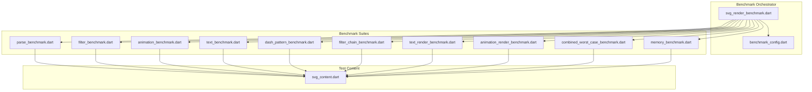
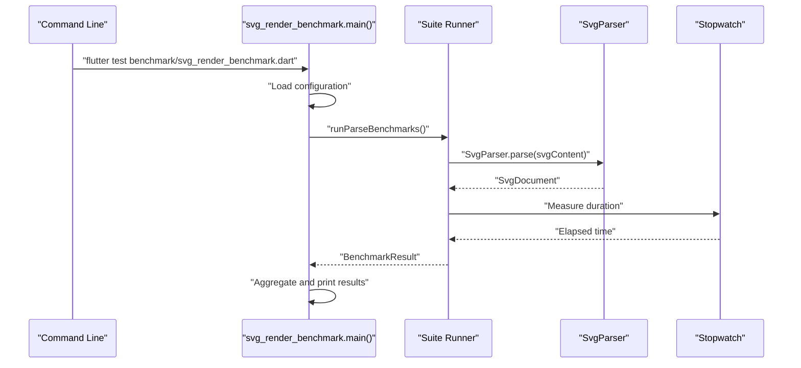
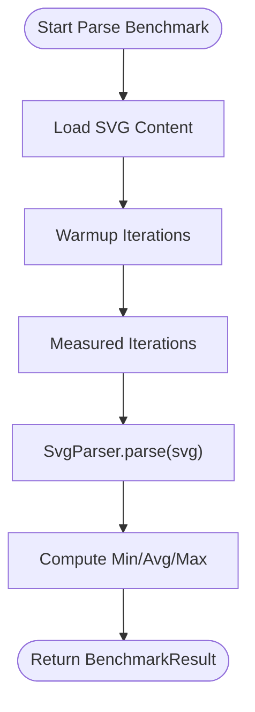
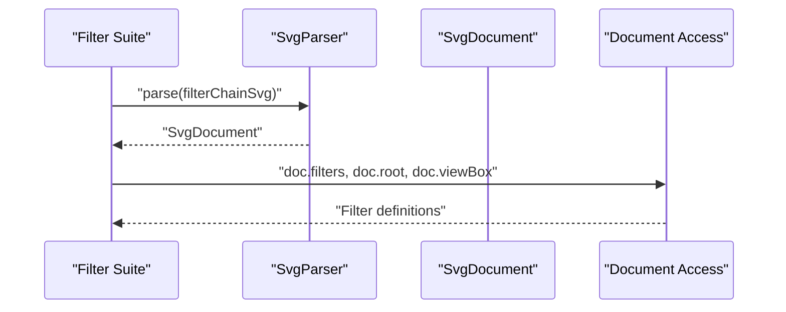
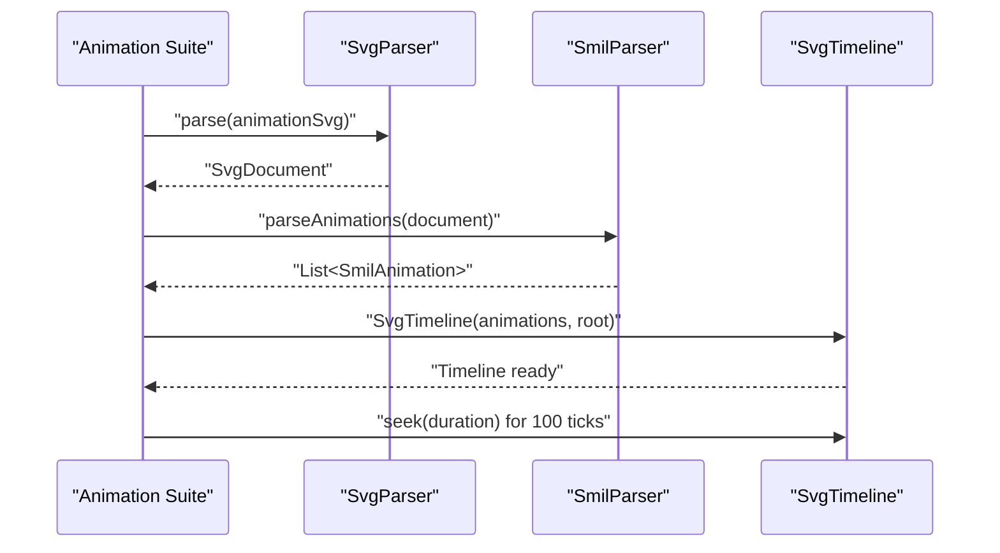
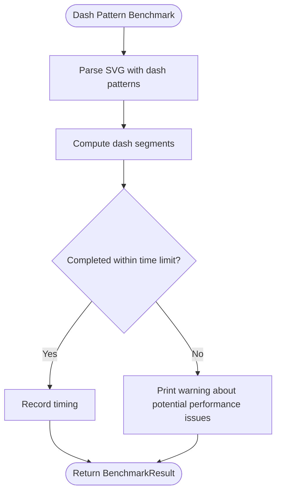
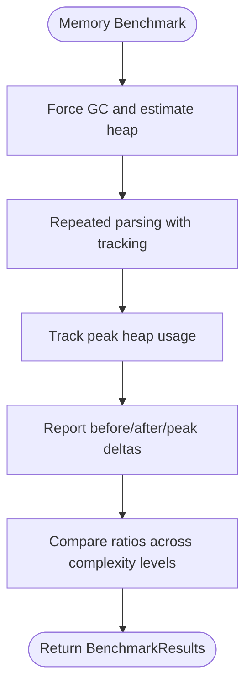
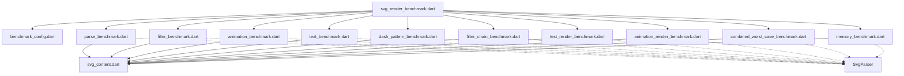

# Benchmark Performance Testing

<cite>
**Referenced Files in This Document**
- [benchmark_config.dart](file://benchmark/benchmark_config.dart)
- [svg_render_benchmark.dart](file://benchmark/svg_render_benchmark.dart)
- [svg_content.dart](file://benchmark/svg_content.dart)
- [parse_benchmark.dart](file://benchmark/benchmarks/parse_benchmark.dart)
- [filter_benchmark.dart](file://benchmark/benchmarks/filter_benchmark.dart)
- [animation_benchmark.dart](file://benchmark/benchmarks/animation_benchmark.dart)
- [text_benchmark.dart](file://benchmark/benchmarks/text_benchmark.dart)
- [dash_pattern_benchmark.dart](file://benchmark/benchmarks/dash_pattern_benchmark.dart)
- [filter_chain_benchmark.dart](file://benchmark/benchmarks/filter_chain_benchmark.dart)
- [text_render_benchmark.dart](file://benchmark/benchmarks/text_render_benchmark.dart)
- [animation_render_benchmark.dart](file://benchmark/benchmarks/animation_render_benchmark.dart)
- [combined_worst_case_benchmark.dart](file://benchmark/benchmarks/combined_worst_case_benchmark.dart)
- [memory_benchmark.dart](file://benchmark/benchmarks/memory_benchmark.dart)
</cite>

## Table of Contents
1. [Introduction](#introduction)
2. [Project Structure](#project-structure)
3. [Core Components](#core-components)
4. [Architecture Overview](#architecture-overview)
5. [Detailed Component Analysis](#detailed-component-analysis)
6. [Dependency Analysis](#dependency-analysis)
7. [Performance Considerations](#performance-considerations)
8. [Troubleshooting Guide](#troubleshooting-guide)
9. [Conclusion](#conclusion)

## Introduction
This document describes the comprehensive benchmark performance testing suite for the Flutter SVG rendering library. The suite measures parsing performance, filter processing, animation setup and playback, text layout, dash pattern computation, combined worst-case scenarios, and memory usage across a wide range of SVG features. The benchmarks are designed to establish baselines, detect regressions, and guide cache tuning and optimization efforts.

## Project Structure
The benchmark system is organized into a central orchestrator and specialized suites for different SVG feature areas:

- Central orchestrator: runs all benchmark suites, manages configuration, and aggregates results
- Configuration module: defines warmup iterations, measured iterations, and timeouts
- Content library: provides deterministic SVG test fixtures for each benchmark category
- Feature-specific suites: focused benchmarks for parsing, filters, animations, text, dash patterns, filter chains, text rendering, animation rendering, combined worst cases, and memory tracking

**Diagram sources**
- [svg_render_benchmark.dart:135-234](file://benchmark/svg_render_benchmark.dart#L135-L234)
- [benchmark_config.dart:6-17](file://benchmark/benchmark_config.dart#L6-L17)
- [svg_content.dart:8-235](file://benchmark/svg_content.dart#L8-L235)

**Section sources**
- [svg_render_benchmark.dart:135-234](file://benchmark/svg_render_benchmark.dart#L135-L234)
- [benchmark_config.dart:6-17](file://benchmark/benchmark_config.dart#L6-L17)
- [svg_content.dart:8-235](file://benchmark/svg_content.dart#L8-L235)

## Core Components
The benchmark system consists of three primary building blocks:

- BenchmarkResult: encapsulates timing statistics (min, avg, max) and optional memory deltas
- runBenchmark: executes a function multiple times, warms up, measures elapsed time, and computes statistics
- runBenchmarkWithMemory: extended runner for memory-aware scenarios (placeholder for future VM integration)

Key configuration constants:
- Warmup iterations: number of non-measured runs to stabilize JIT and caches
- Iterations: number of measured runs for statistical analysis
- TimeoutMs: per-benchmark timeout to prevent runaway tests

**Section sources**
- [svg_render_benchmark.dart:28-110](file://benchmark/svg_render_benchmark.dart#L28-L110)
- [benchmark_config.dart:9-16](file://benchmark/benchmark_config.dart#L9-L16)

## Architecture Overview
The benchmark orchestration follows a modular design where each suite focuses on a specific aspect of SVG processing:

**Diagram sources**
- [svg_render_benchmark.dart:135-234](file://benchmark/svg_render_benchmark.dart#L135-L234)
- [parse_benchmark.dart:80-89](file://benchmark/benchmarks/parse_benchmark.dart#L80-L89)

## Detailed Component Analysis

### Parsing Benchmarks
The parsing suite evaluates the cost of converting SVG markup into an internal document representation. It covers:
- Simple shapes and basic attributes
- Gradients and transforms
- Filter definitions
- SMIL animations
- Text-heavy documents
- Dash patterns
- Nested groups and transforms
- Clipping and masking
- Large-scale documents
- Repeated access to parsed structures (cache effectiveness)

**Diagram sources**
- [parse_benchmark.dart:13-78](file://benchmark/benchmarks/parse_benchmark.dart#L13-L78)
- [svg_render_benchmark.dart:66-110](file://benchmark/svg_render_benchmark.dart#L66-L110)

**Section sources**
- [parse_benchmark.dart:13-78](file://benchmark/benchmarks/parse_benchmark.dart#L13-L78)
- [svg_content.dart:12-233](file://benchmark/svg_content.dart#L12-L233)

### Filter Benchmarks
These benchmarks focus on filter definition parsing and access:
- Complex filter chain parsing (blur + color matrix + composite)
- Accessing filter definitions from parsed documents
- Multiple filter types (blur, color shift, saturation, inversion, composite)
- Turbulence filter parsing (computationally expensive)
- Lighting filter parsing (diffuse/specular lighting)

**Diagram sources**
- [filter_benchmark.dart:18-154](file://benchmark/benchmarks/filter_benchmark.dart#L18-L154)

**Section sources**
- [filter_benchmark.dart:18-154](file://benchmark/benchmarks/filter_benchmark.dart#L18-L154)

### Animation Benchmarks
Animation benchmarks measure SMIL parsing and timeline construction:
- SMIL animation parsing from SVG documents
- Timeline creation from parsed animations
- Complex animation sets with multiple properties and transforms
- Timeline tick simulation at ~60fps
- CSS keyframe parsing via the SVG parser

**Diagram sources**
- [animation_benchmark.dart:22-185](file://benchmark/benchmarks/animation_benchmark.dart#L22-L185)

**Section sources**
- [animation_benchmark.dart:22-185](file://benchmark/benchmarks/animation_benchmark.dart#L22-L185)

### Text Benchmarks
Text parsing benchmarks isolate text element processing:
- Heavy text content parsing
- Styled text elements (weights, styles, decorations)
- tspans and multi-line text
- textPath elements with curves and arcs
- Large text documents with many lines

**Section sources**
- [text_benchmark.dart:16-173](file://benchmark/benchmarks/text_benchmark.dart#L16-L173)

### Dash Pattern Benchmarks
Dash pattern computation is performance-critical and guarded against infinite loops:
- Various dash patterns and stroke-dasharray configurations
- Many dashed elements stress test
- Edge case patterns with very small values
- Stroke-dashoffset handling
- Long path dash computation
- Bounded-time verification (warning threshold for excessive durations)

**Diagram sources**
- [dash_pattern_benchmark.dart:168-197](file://benchmark/benchmarks/dash_pattern_benchmark.dart#L168-L197)

**Section sources**
- [dash_pattern_benchmark.dart:16-199](file://benchmark/benchmarks/dash_pattern_benchmark.dart#L16-L199)

### Filter Chain Benchmarks
Complex filter chain parsing and setup:
- Ultra-complex multi-stage chains (blur → color matrix → composite)
- Nested filter chains with multiple levels
- High filter count stress test (20+ filters applied to elements)

**Section sources**
- [filter_chain_benchmark.dart:167-211](file://benchmark/benchmarks/filter_chain_benchmark.dart#L167-L211)

### Text Render Benchmarks
Text layout parsing focusing on complex scenarios:
- Nested tspan elements with mixed styling
- textPath elements with various path types (quadratic, cubic, circular, zigzag)
- Per-character positioning (x, y, dx, dy, rotate)
- Large document simulations with many paragraphs

**Section sources**
- [text_render_benchmark.dart:206-263](file://benchmark/benchmarks/text_render_benchmark.dart#L206-L263)

### Animation Render Benchmarks
Multiple simultaneous animations and high-frequency updates:
- Simultaneous property animations on single elements
- Multiple animated elements with staggering
- Transform animations (translate, rotate, scale)
- Path morphing and stroke animations
- High animation count stress test (25+ elements)
- Complex timing synchronization (begin/end dependencies)
- High-frequency timeline ticks (120fps equivalent)

**Section sources**
- [animation_render_benchmark.dart:170-271](file://benchmark/benchmarks/animation_render_benchmark.dart#L170-L271)

### Combined Worst-Case Benchmarks
Comprehensive integration test combining all major features:
- Full combined SVG with filters, gradients, masks, clipping, text, and animations
- Timeline evaluation of the combined document
- Scaled stress tests (50, 100, 200 elements)
- Mixed content: rectangles, circles, text, and animated paths

**Section sources**
- [combined_worst_case_benchmark.dart:243-324](file://benchmark/benchmarks/combined_worst_case_benchmark.dart#L243-L324)

### Memory Benchmarks
Memory usage assessment across complexity levels:
- Minimal, low, medium, high, and very high complexity SVGs
- Heap usage estimation using developer service when available
- Peak heap tracking during repeated parsing
- Garbage collection encouragement through temporary allocations
- Baseline comparisons across complexity tiers

**Diagram sources**
- [memory_benchmark.dart:53-115](file://benchmark/benchmarks/memory_benchmark.dart#L53-L115)

**Section sources**
- [memory_benchmark.dart:234-320](file://benchmark/benchmarks/memory_benchmark.dart#L234-L320)

## Dependency Analysis
The benchmark suite exhibits clear modularity with explicit dependencies:

**Diagram sources**
- [svg_render_benchmark.dart:15-25](file://benchmark/svg_render_benchmark.dart#L15-L25)
- [parse_benchmark.dart:5-10](file://benchmark/benchmarks/parse_benchmark.dart#L5-L10)
- [filter_benchmark.dart:5-11](file://benchmark/benchmarks/filter_benchmark.dart#L5-L11)
- [animation_benchmark.dart:5-17](file://benchmark/benchmarks/animation_benchmark.dart#L5-L17)
- [text_benchmark.dart:5-9](file://benchmark/benchmarks/text_benchmark.dart#L5-L9)
- [dash_pattern_benchmark.dart:5-9](file://benchmark/benchmarks/dash_pattern_benchmark.dart#L5-L9)
- [filter_chain_benchmark.dart:5-8](file://benchmark/benchmarks/filter_chain_benchmark.dart#L5-L8)
- [text_render_benchmark.dart:5-8](file://benchmark/benchmarks/text_render_benchmark.dart#L5-L8)
- [animation_render_benchmark.dart:5-14](file://benchmark/benchmarks/animation_render_benchmark.dart#L5-L14)
- [combined_worst_case_benchmark.dart:5-12](file://benchmark/benchmarks/combined_worst_case_benchmark.dart#L5-L12)
- [memory_benchmark.dart:7-13](file://benchmark/benchmarks/memory_benchmark.dart#L7-L13)

**Section sources**
- [svg_render_benchmark.dart:15-25](file://benchmark/svg_render_benchmark.dart#L15-L25)

## Performance Considerations
- Warmup cycles: The suite uses warmup iterations to stabilize JIT compilation and cache states before measuring
- Statistical reporting: Results include min, average, and max timings to capture variability
- Timeout safety: Individual benchmarks enforce a timeout to prevent indefinite hangs
- Memory estimation: Current implementation provides estimations; accurate measurements require VM integration
- Regression detection: Baseline metrics enable early detection of performance regressions
- Cache tuning: Repeated access benchmarks help evaluate cache effectiveness for parsed documents

## Troubleshooting Guide
Common issues and remedies:
- Excessive dash pattern processing time: The dash pattern suite includes bounded-time verification and will warn if processing exceeds thresholds
- Memory measurement limitations: Standalone Dart lacks direct memory APIs; use DevTools or Observatory for accurate measurements
- Timeout violations: Increase timeoutMs in configuration if legitimate processing requires more time
- Garbage collection interference: Temporary allocations are used to encourage GC; avoid running memory benchmarks concurrently with other memory-intensive tasks

**Section sources**
- [dash_pattern_benchmark.dart:168-197](file://benchmark/benchmarks/dash_pattern_benchmark.dart#L168-L197)
- [memory_benchmark.dart:53-75](file://benchmark/benchmarks/memory_benchmark.dart#L53-L75)
- [benchmark_config.dart:15-16](file://benchmark/benchmark_config.dart#L15-L16)

## Conclusion
The benchmark suite provides comprehensive performance insights across all major SVG feature areas. By establishing baselines, detecting regressions, and guiding optimization efforts, it supports continued improvements in parsing speed, filter processing, animation performance, text layout, dash pattern computation, and memory usage. The modular design enables targeted investigations while the combined worst-case scenarios ensure readiness for complex real-world usage.