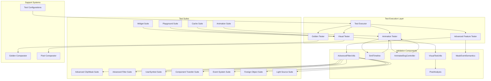
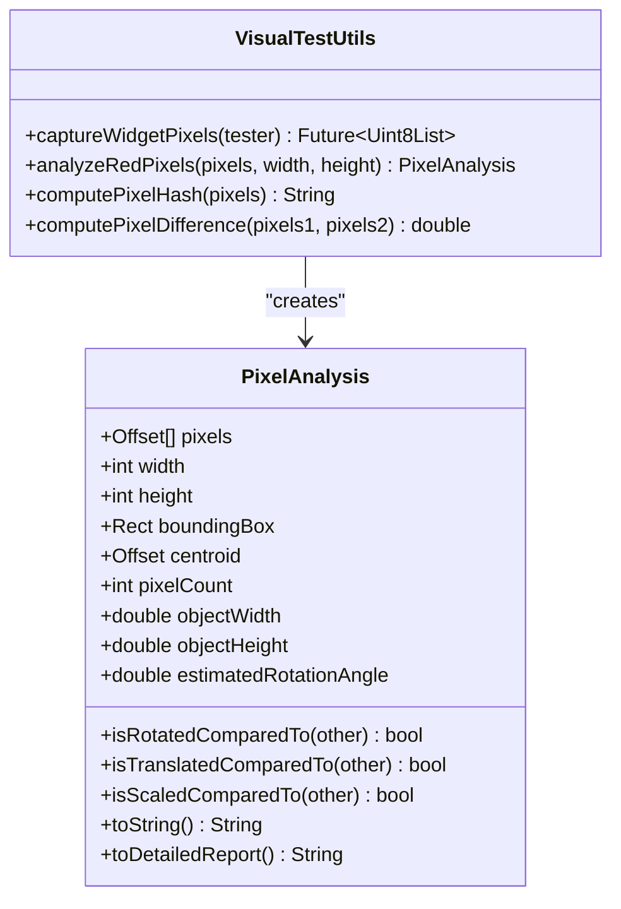
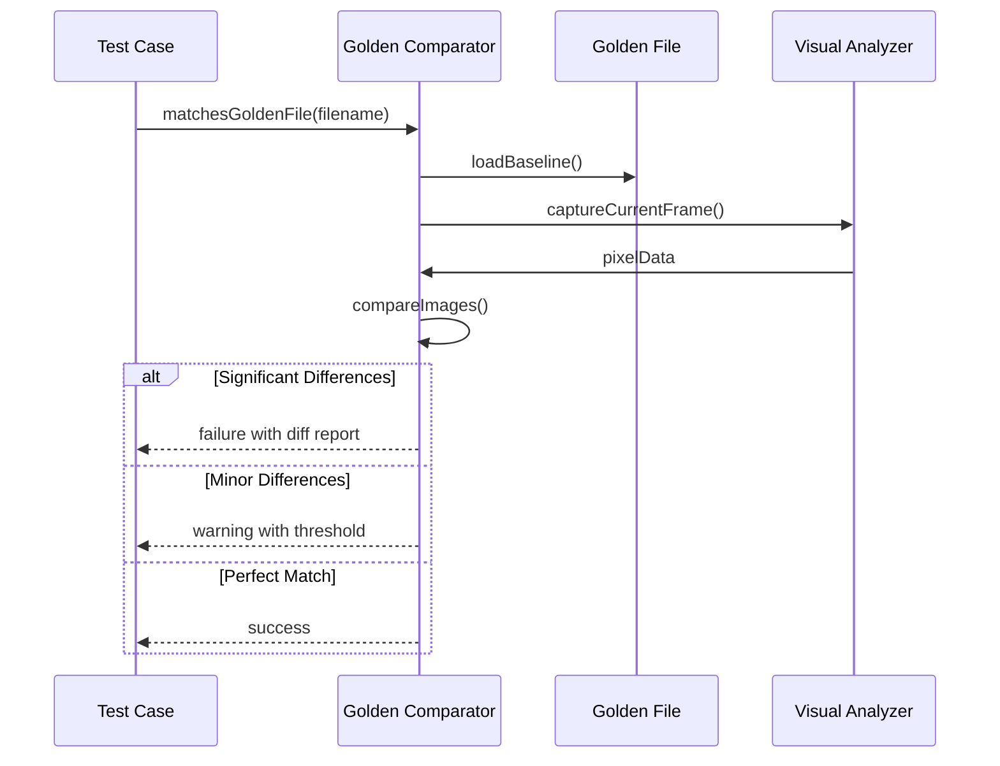
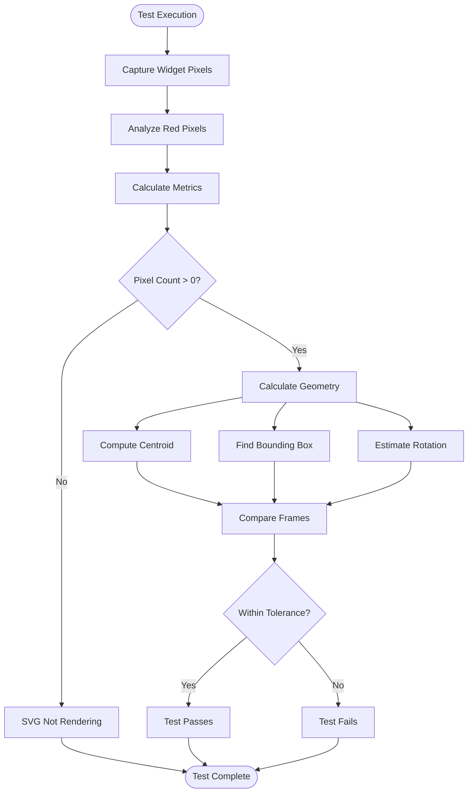
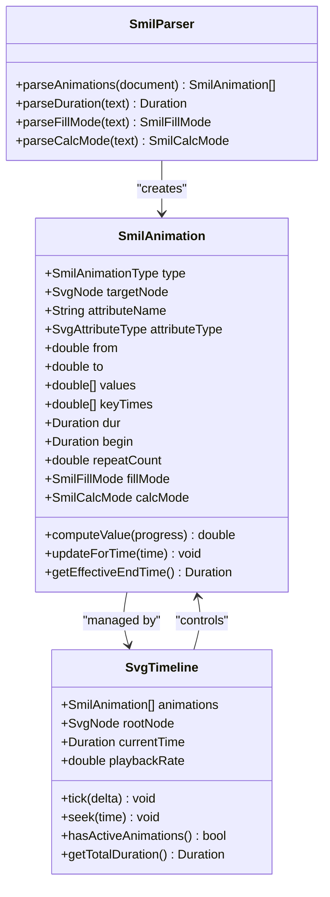
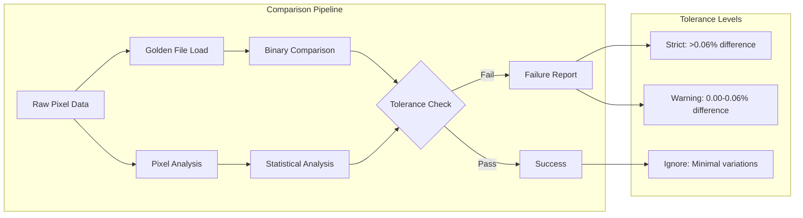
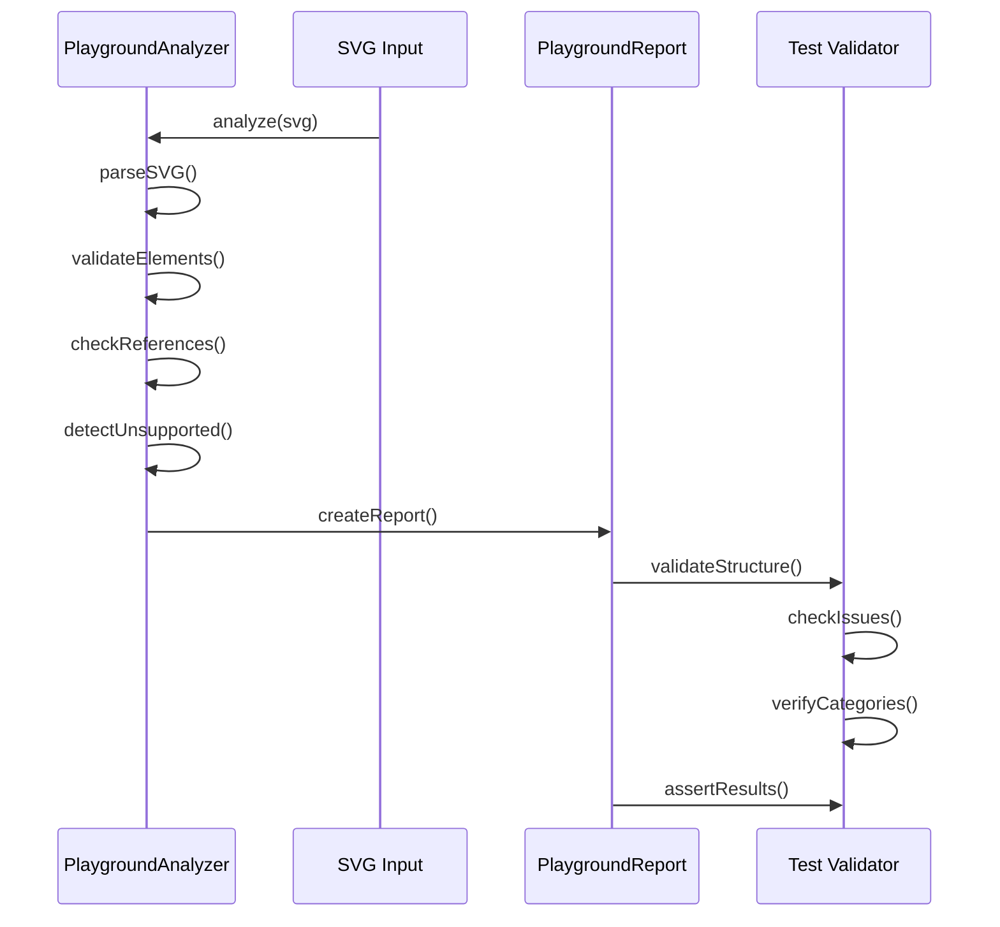
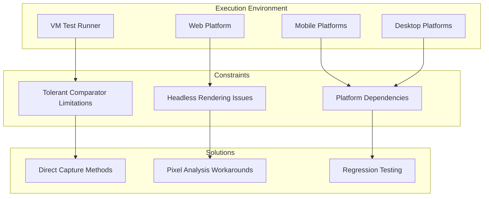
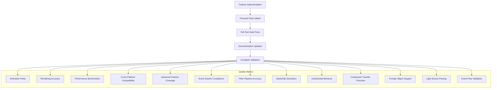

# Testing Infrastructure Documentation

<cite>
**Referenced Files in This Document**
- [VISUAL_TESTING_GUIDELINES.md](file://VISUAL_TESTING_GUIDELINES.md)
- [dart_test.yaml](file://dart_test.yaml)
- [test/animation/visual_test_utils.dart](file://test/animation/visual_test_utils.dart)
- [test/cache_test.dart](file://test/cache_test.dart)
- [test/widget_svg_test.dart](file://test/widget_svg_test.dart)
- [test/playground/playground_analyzer_test.dart](file://test/playground/playground_analyzer_test.dart)
- [test/playground/playground_models_test.dart](file://test/playground/playground_models_test.dart)
- [test/animation/controller_test.dart](file://test/animation/controller_test.dart)
- [test/animation/smil_test.dart](file://test/animation/smil_test.dart)
- [ROADMAP.md](file://ROADMAP.md)
- [test/animation/advanced_clip_mask_test.dart](file://test/animation/advanced_clip_mask_test.dart)
- [test/animation/advanced_mask_semantics_test.dart](file://test/animation/advanced_mask_semantics_test.dart)
- [test/animation/advanced_use_symbol_test.dart](file://test/animation/advanced_use_symbol_test.dart)
- [test/animation/component_transfer_functions_test.dart](file://test/animation/component_transfer_functions_test.dart)
- [test/animation/event_system_test.dart](file://test/animation/event_system_test.dart)
- [test/animation/filter_advanced_graph_test.dart](file://test/animation/filter_advanced_graph_test.dart)
- [test/animation/foreign_object_advanced_test.dart](file://test/animation/foreign_object_advanced_test.dart)
- [test/animation/light_source_elements_test.dart](file://test/animation/light_source_elements_test.dart)
</cite>

## Update Summary
**Changes Made**
- Added comprehensive coverage of advanced clipping and masking scenarios
- Expanded mask semantics testing with luminosity and alpha modes
- Enhanced use/symbol handling with inheritance and coordinate stacking
- Added component transfer function testing with all five transfer types
- Implemented advanced event system testing with W3C compliance
- Expanded filter graph testing with multi-hop chains and background inputs
- Added foreign object advanced semantics testing
- Enhanced light source elements parsing and validation
- Significantly expanded test coverage with over 5,000 lines of new test code

## Table of Contents
1. [Introduction](#introduction)
2. [Testing Architecture Overview](#testing-architecture-overview)
3. [Core Testing Components](#core-testing-components)
4. [Visual Testing Framework](#visual-testing-framework)
5. [Animation Testing Infrastructure](#animation-testing-infrastructure)
6. [Advanced Feature Testing](#advanced-feature-testing)
7. [Golden Testing System](#golden-testing-system)
8. [Playground Testing Suite](#playground-testing-suite)
9. [Test Execution Environment](#test-execution-environment)
10. [Quality Assurance Framework](#quality-assurance-framework)
11. [Best Practices and Guidelines](#best-practices-and-guidelines)
12. [Troubleshooting Guide](#troubleshooting-guide)
13. [Conclusion](#conclusion)

## Introduction

The Flutter SVG Animation Testing Infrastructure represents a comprehensive testing framework designed specifically for validating SVG animation rendering and behavior in Flutter applications. This documentation provides an in-depth analysis of the testing architecture, covering visual testing methodologies, animation validation systems, and quality assurance processes that ensure the reliability and accuracy of SVG animations across different platforms and scenarios.

**Updated** The testing infrastructure has been significantly expanded with over 5,000 lines of new test code covering advanced clipping scenarios, mask semantics, use/symbol handling, component transfer functions, event systems, filter input graphs, light sources, primitive edge cases, and image foreign object scenarios.

The testing infrastructure is built around three primary pillars: visual pixel analysis for animation verification, comprehensive animation timeline testing, and robust golden file comparison systems. These components work together to provide confidence that SVG animations render correctly and behave as expected under various conditions.

## Testing Architecture Overview

The testing infrastructure follows a layered architecture that separates concerns between different types of validation:

**Diagram sources**
- [VISUAL_TESTING_GUIDELINES.md:185-231](file://VISUAL_TESTING_GUIDELINES.md#L185-L231)
- [test/animation/visual_test_utils.dart:10-101](file://test/animation/visual_test_utils.dart#L10-L101)

The architecture supports multiple testing paradigms including traditional unit testing, visual regression testing, and specialized animation timeline validation. Each layer maintains clear separation of concerns while providing hooks for cross-validation between different testing approaches.

**Section sources**
- [VISUAL_TESTING_GUIDELINES.md:18-329](file://VISUAL_TESTING_GUIDELINES.md#L18-L329)

## Core Testing Components

### VisualTestUtils Framework

The VisualTestUtils class serves as the cornerstone of the visual testing infrastructure, providing comprehensive pixel analysis capabilities for animation validation:

**Diagram sources**
- [test/animation/visual_test_utils.dart:10-231](file://test/animation/visual_test_utils.dart#L10-L231)

The framework implements sophisticated pixel analysis techniques including centroid calculation, bounding box determination, and rotation angle estimation through moment analysis. These capabilities enable precise geometric validation of animated SVG elements.

**Section sources**
- [test/animation/visual_test_utils.dart:10-231](file://test/animation/visual_test_utils.dart#L10-L231)

### Golden Testing Infrastructure

The golden testing system provides regression testing capabilities with configurable tolerance levels:

**Diagram sources**
- [test/widget_svg_test.dart:12-42](file://test/widget_svg_test.dart#L12-L42)

The system includes a custom tolerant comparator that allows for minor pixel variations while flagging significant rendering changes, supporting cross-platform compatibility and anti-aliasing differences.

**Section sources**
- [test/widget_svg_test.dart:12-84](file://test/widget_svg_test.dart#L12-L84)

## Visual Testing Framework

### Pixel Analysis Methodology

The visual testing framework employs a multi-faceted approach to validate SVG animation rendering:

**Diagram sources**
- [VISUAL_TESTING_GUIDELINES.md:41-130](file://VISUAL_TESTING_GUIDELINES.md#L41-L130)

The framework validates multiple geometric properties including pixel count verification, centroid position analysis, bounding box calculations, and rotation angle estimation. This comprehensive approach ensures that visual changes are detected even when golden file comparisons might miss subtle differences.

**Section sources**
- [VISUAL_TESTING_GUIDELINES.md:41-130](file://VISUAL_TESTING_GUIDELINES.md#L41-L130)

### Animation Timeline Testing

The animation testing infrastructure validates complex timeline behaviors including:

- **Controller Integration**: Testing AnimatedSvgController functionality
- **Playback Rate Control**: Verifying speed adjustments and their effects
- **Direction Management**: Validating forward/reverse playback behavior
- **Seek Operations**: Ensuring precise timeline positioning
- **Pause/Resume Functionality**: Testing state preservation during interruptions

**Section sources**
- [test/animation/controller_test.dart:142-337](file://test/animation/controller_test.dart#L142-L337)

## Animation Testing Infrastructure

### SMIL Parser and Timeline Validation

The animation testing suite encompasses comprehensive validation of SMIL (Synchronized Multimedia Integration Language) parsing and timeline management:

**Diagram sources**
- [test/animation/smil_test.dart:106-375](file://test/animation/smil_test.dart#L106-L375)

The testing framework validates complex animation behaviors including discrete mode calculations, additive attribute handling, and fill mode persistence. These validations ensure accurate SMIL specification compliance and reliable animation rendering.

**Section sources**
- [test/animation/smil_test.dart:106-525](file://test/animation/smil_test.dart#L106-L525)

### Interpolator Testing

The interpolator testing validates mathematical precision in animation calculations:

- **Number Interpolation**: Linear interpolation between numeric values
- **Color Interpolation**: RGB space color blending with hex, named, and RGB color formats
- **List Interpolation**: Multi-value attribute animations
- **Additive Mode**: Proper handling of by-attribute calculations

**Section sources**
- [test/animation/smil_test.dart:16-84](file://test/animation/smil_test.dart#L16-L84)

## Advanced Feature Testing

### Advanced Clipping and Masking Testing

The testing infrastructure now includes comprehensive coverage of advanced clipping and masking scenarios:

#### Luminosity Masking
- **RGB to Grayscale Conversion**: Validates that luminance masks convert colored content to grayscale opacity
- **Alpha Channel Processing**: Tests alpha-based masking using transparency values
- **Mixed Content Handling**: Validates complex mask compositions with gradients and shapes

#### Nested Composition Chains
- **Clip-Path Inside Mask**: Tests hierarchical composition where clip-path is applied before masking
- **Mask Inside Clip-Path**: Validates reverse composition order effects
- **Multi-Level Nesting**: Tests up to 3-level deep nesting scenarios

#### Advanced Mask Semantics
- **Coordinate System Testing**: Validates both objectBoundingBox and userSpaceOnUse units
- **Edge Feathering**: Tests anti-aliasing and smooth edge rendering
- **Animation Support**: Validates animated mask content and region attributes

**Section sources**
- [test/animation/advanced_clip_mask_test.dart:1-766](file://test/animation/advanced_clip_mask_test.dart#L1-L766)
- [test/animation/advanced_mask_semantics_test.dart:1-624](file://test/animation/advanced_mask_semantics_test.dart#L1-L624)

### Advanced Use and Symbol Testing

The testing suite validates complex use/symbol inheritance and coordinate handling:

#### CSS Cascade Through Shadow Boundaries
- **Presentation Attribute Propagation**: Validates that use element attributes apply to referenced content
- **Style Rule Preservation**: Tests CSS class application through use shadow boundaries
- **Inline Style Precedence**: Validates proper cascading order between use and referenced element styles

#### Nested Coordinate Stacking
- **3-Level Use Nesting**: Tests cumulative x/y offset calculations through multiple use levels
- **Transform Composition**: Validates transform attribute combination across nested use elements
- **Symbol ViewBox Stacking**: Tests nested symbol coordinate system composition

#### Advanced Use Scenarios
- **Use Inside ClipPath**: Validates proper clipping behavior when use elements reference clip paths
- **Use Inside Masks**: Tests mask application to referenced content
- **Event Retargeting**: Validates proper event handling for use elements

**Section sources**
- [test/animation/advanced_use_symbol_test.dart:1-673](file://test/animation/advanced_use_symbol_test.dart#L1-L673)

### Component Transfer Functions Testing

The testing infrastructure provides comprehensive validation of feComponentTransfer functionality:

#### Transfer Function Types
- **Identity Functions**: Validates pass-through behavior for all color channels
- **Table Functions**: Tests discrete value mapping with interpolation
- **Discrete Functions**: Validates step-function behavior for quantization
- **Linear Functions**: Tests slope and intercept transformations
- **Gamma Functions**: Validates power-law transformations

#### Mixed Channel Combinations
- **Channel-Specific Processing**: Tests different transfer functions per color channel
- **Combined Effects**: Validates complex color transformations through multiple channels

#### Animation Support
- **Attribute Animation**: Tests animated slope, amplitude, exponent, and intercept values
- **Multi-Attribute Animation**: Validates simultaneous animation of multiple transfer function parameters

**Section sources**
- [test/animation/component_transfer_functions_test.dart:1-709](file://test/animation/component_transfer_functions_test.dart#L1-L709)

### Advanced Event System Testing

The testing suite validates comprehensive W3C event system compliance:

#### Event Flow and Phases
- **Capture Phase**: Validates event propagation from root to target element
- **Target Phase**: Tests event handling at the target element
- **Bubble Phase**: Validates event bubbling back to root elements

#### Event Control Methods
- **stopPropagation**: Tests event flow interruption
- **stopImmediatePropagation**: Validates immediate handler termination
- **preventDefault**: Tests default action cancellation

#### Advanced Event Types
- **Focus Events**: Validates focus and blur event handling
- **Wheel Events**: Tests mouse wheel event processing
- **Context Menu Events**: Validates right-click event handling

#### Event Targeting and Retargeting
- **Non-Composed Events**: Tests use element retargeting for non-composed events
- **Composed Events**: Validates proper target identification for composed events
- **Event Path Resolution**: Tests composed path calculation through element hierarchies

**Section sources**
- [test/animation/event_system_test.dart:1-732](file://test/animation/event_system_test.dart#L1-L732)

### Advanced Filter Graph Testing

The testing infrastructure validates complex filter pipeline semantics:

#### Multi-Hop Chain Resolution
- **Sequential Primitives**: Tests 3-step and deeper filter chains
- **Result Reference Handling**: Validates intermediate result naming and reuse
- **Branching Scenarios**: Tests filters with multiple downstream primitives sharing results

#### Background Input Handling
- **BackgroundImage Processing**: Validates background image integration
- **BackgroundAlpha Extraction**: Tests alpha channel processing from background
- **Context Switching**: Validates proper source context handling

#### Complex Filter Combinations
- **Merge Node Resolution**: Tests complex merge scenarios with multiple inputs
- **Composite Operations**: Validates advanced compositing operations
- **Filter Composition**: Tests multi-filter pipeline execution

**Section sources**
- [test/animation/filter_advanced_graph_test.dart:1-1305](file://test/animation/filter_advanced_graph_test.dart#L1-L1305)

### Foreign Object Advanced Testing

The testing suite validates advanced foreignObject semantics:

#### Extension Support
- **requiredExtensions Attribute**: Tests unsupported extension handling and fallback behavior
- **Switch Integration**: Validates proper fallback content selection
- **Extension Matching**: Tests extension URI validation and support detection

#### Nested Context Handling
- **Nested SVG Establishment**: Validates proper viewport creation within foreignObject
- **Coordinate System Isolation**: Tests nested coordinate system independence
- **Preserve Aspect Ratio**: Validates proper aspect ratio handling in nested contexts

#### Layout Semantics
- **Zero-Dimension Handling**: Tests rendering behavior with zero width or height
- **Child Element Processing**: Validates proper child element rendering and interaction
- **Fallback Patterns**: Tests standard SVG fallback patterns using switch elements

**Section sources**
- [test/animation/foreign_object_advanced_test.dart:1-634](file://test/animation/foreign_object_advanced_test.dart#L1-L634)

### Light Source Elements Testing

The testing infrastructure validates comprehensive light source parsing:

#### Distant Light Sources
- **Default Attribute Values**: Tests azimuth and elevation defaults (0, 0)
- **Custom Attribute Parsing**: Validates custom azimuth and elevation values
- **Negative Value Handling**: Tests negative coordinate values

#### Point Light Sources
- **Default Position Values**: Tests x, y, z defaults (0, 0, 0)
- **Custom Position Parsing**: Validates custom coordinate specifications
- **Negative Coordinate Support**: Tests negative light source positions

#### Spot Light Sources
- **Complete Attribute Parsing**: Tests all spot light attributes including limiting cone angle
- **Default Value Handling**: Validates default specular exponent and missing attributes
- **Complex Lighting Models**: Tests realistic spotlight behavior with targeting

**Section sources**
- [test/animation/light_source_elements_test.dart:1-578](file://test/animation/light_source_elements_test.dart#L1-L578)

## Golden Testing System

### Tolerant Comparison Strategy

The golden testing system implements a sophisticated comparison strategy that balances strict validation with practical tolerance handling:

**Diagram sources**
- [test/widget_svg_test.dart:12-36](file://test/widget_svg_test.dart#L12-L36)

The system categorizes differences into three tolerance levels, allowing for graceful handling of platform-specific rendering variations while maintaining strict validation for meaningful changes.

**Section sources**
- [test/widget_svg_test.dart:12-84](file://test/widget_svg_test.dart#L12-L84)

### Asset Loading and Rendering Validation

The testing suite validates multiple SVG loading mechanisms:

- **String-based Loading**: Direct SVG string parsing and rendering
- **Memory-based Loading**: Byte array processing and caching
- **Asset-based Loading**: File system integration and bundle resolution
- **Network-based Loading**: HTTP client integration and error handling
- **Color Mapping**: Dynamic color substitution and theme application

**Section sources**
- [test/widget_svg_test.dart:124-534](file://test/widget_svg_test.dart#L124-L534)

## Playground Testing Suite

### Playground Analyzer Validation

The playground testing suite validates the SVG analysis and reporting capabilities:

**Diagram sources**
- [test/playground/playground_analyzer_test.dart:9-87](file://test/playground/playground_analyzer_test.dart#L9-L87)

The analyzer validates SVG parsing, identifies unsupported elements, detects broken references, and generates comprehensive error reports with severity categorization.

**Section sources**
- [test/playground/playground_analyzer_test.dart:1-90](file://test/playground/playground_analyzer_test.dart#L1-L90)

### Model Serialization Testing

The playground models testing validates JSON serialization and deserialization:

- **PlaygroundReport Roundtrip**: Complete serialization/deserialization cycle
- **PlaygroundIssue Validation**: Issue code, severity, and category preservation
- **PlaygroundLogEntry Parsing**: Level and payload extraction from structured logs
- **Data Integrity**: Maintaining data consistency across serialization boundaries

**Section sources**
- [test/playground/playground_models_test.dart:1-63](file://test/playground/playground_models_test.dart#L1-L63)

## Test Execution Environment

### Platform Configuration

The testing infrastructure operates with specific platform constraints:

**Diagram sources**
- [dart_test.yaml:1-5](file://dart_test.yaml#L1-L5)

The current configuration restricts certain tests to VM execution due to limitations in web platform support, particularly for tolerant comparator functionality.

**Section sources**
- [dart_test.yaml:1-5](file://dart_test.yaml#L1-L5)

### Cache Testing Infrastructure

The cache testing validates memory management and LRU eviction policies:

- **Basic Cache Operations**: Size limits and item counting
- **LRU Eviction**: Proper removal of least-recently-used items
- **Synchronous Futures**: Handling immediate completion scenarios
- **Concurrent Operations**: Managing simultaneous cache updates

**Section sources**
- [test/cache_test.dart:1-133](file://test/cache_test.dart#L1-L133)

## Quality Assurance Framework

### Validation Gates

The testing infrastructure implements comprehensive validation gates aligned with the project roadmap:

**Diagram sources**
- [ROADMAP.md:48-67](file://ROADMAP.md#L48-L67)

Each validated feature must demonstrate parity with expected behavior, maintain performance standards, and ensure compatibility across supported platforms before being considered complete.

**Section sources**
- [ROADMAP.md:48-67](file://ROADMAP.md#L48-L67)

### Continuous Integration Requirements

The testing framework supports continuous integration through:

- **Automated Test Execution**: Consistent test runs across environments
- **Regression Prevention**: Golden file baselines and visual comparisons
- **Performance Monitoring**: Animation rendering benchmarks and memory usage
- **Platform Coverage**: Multi-platform validation and compatibility testing
- **Advanced Feature Coverage**: Comprehensive testing of all SVG features and edge cases

## Best Practices and Guidelines

### Visual Testing Methodology

The visual testing guidelines establish comprehensive best practices:

- **Deterministic Setup**: Use `autoPlay: false` with `initialTime` for reproducible tests
- **Frame-by-Frame Analysis**: Test multiple timepoints (0%, 25%, 50%, 75%, 100%)
- **Geometric Verification**: Validate centroid movement, bounding box changes, and rotation detection
- **Pixel Analysis**: Combine golden file comparisons with detailed geometric measurements

**Section sources**
- [VISUAL_TESTING_GUIDELINES.md:225-275](file://VISUAL_TESTING_GUIDELINES.md#L225-L275)

### Animation Testing Patterns

Recommended testing patterns include:

- **Controller Integration**: Validate controller operations with visual feedback
- **Timeline Validation**: Test complex animation sequences and timing behaviors
- **Edge Case Handling**: Validate infinite animations, rapid state changes, and error conditions
- **Performance Testing**: Measure rendering performance and memory usage

**Section sources**
- [VISUAL_TESTING_GUIDELINES.md:130-184](file://VISUAL_TESTING_GUIDELINES.md#L130-L184)

### Advanced Feature Testing Guidelines

**Updated** The expanded testing infrastructure introduces new guidelines for advanced feature validation:

- **Multi-Stage Testing**: Validate complex chains of operations (e.g., use -> clip -> mask)
- **Coordinate System Validation**: Test both objectBoundingBox and userSpaceOnUse units
- **Event Flow Testing**: Validate proper W3C event propagation and handling
- **Filter Pipeline Testing**: Test complex filter chains with intermediate results
- **Animation Attribute Testing**: Validate SMIL animation support for all relevant attributes

## Troubleshooting Guide

### Common Visual Testing Issues

**No Pixels Found (pixelCount = 0)**

Possible causes and solutions:
- Missing `pump()` calls - ensure proper widget initialization
- Wrong element color - verify SVG uses appropriate fill colors
- Dimension mismatches - check captured image size vs analysis dimensions

**Geometry Not Changing**

Diagnostic steps:
- Verify animation progression with explicit `pump(duration)` calls
- Check transform application in SMIL parser/interpolator
- Adjust comparison thresholds for sensitivity tuning

**Section sources**
- [VISUAL_TESTING_GUIDELINES.md:276-307](file://VISUAL_TESTING_GUIDELINES.md#L276-L307)

### Animation Testing Debugging

Common animation testing issues:
- **Infinite Animation Hangs**: Avoid `pumpAndSettle()` with indefinite animations
- **Timeline Inconsistencies**: Verify `autoPlay` and `initialTime` combinations
- **Controller State Issues**: Test listener notifications and state transitions
- **Playback Rate Problems**: Validate speed calculations and effect propagation

**Section sources**
- [VISUAL_TESTING_GUIDELINES.md:85-102](file://VISUAL_TESTING_GUIDELINES.md#L85-L102)

### Golden Test Failures

Resolution strategies:
- **Minor Differences**: Review tolerance thresholds and acceptable variance
- **Platform Variations**: Consider anti-aliasing and rendering engine differences
- **Asset Loading Issues**: Verify file paths and asset bundle configurations
- **Memory Corruption**: Check for proper resource cleanup and disposal

**Section sources**
- [test/widget_svg_test.dart:12-36](file://test/widget_svg_test.dart#L12-L36)

### Advanced Feature Testing Issues

**Updated** New troubleshooting guidance for advanced features:

- **Clipping/Masking Issues**: Verify coordinate system units (objectBoundingBox vs userSpaceOnUse)
- **Use/Symbol Problems**: Check nested coordinate calculations and transform composition
- **Filter Chain Errors**: Validate result reference naming and primitive ordering
- **Event System Failures**: Test event flow through proper capture/bubble phases
- **Component Transfer Issues**: Verify individual channel function types and parameter values
- **Foreign Object Problems**: Check requiredExtensions support and fallback behavior
- **Light Source Parsing**: Validate attribute value ranges and default handling

## Conclusion

The Flutter SVG Animation Testing Infrastructure represents a sophisticated and comprehensive approach to ensuring SVG animation quality and reliability. The framework's strength lies in its multi-layered validation approach, combining traditional unit testing with advanced visual analysis and golden file comparisons.

**Updated** The recent expansion of the testing infrastructure adds comprehensive coverage of advanced SVG features, including:

- **Advanced Clipping and Masking**: Over 766 lines of tests covering luminosity masks, nested compositions, and edge feathering
- **Complex Use/Symbol Handling**: Over 673 lines of tests validating inheritance, coordinate stacking, and event retargeting
- **Component Transfer Functions**: Over 709 lines of tests covering all five transfer function types with animation support
- **Advanced Event System**: Over 732 lines of tests validating W3C event flow compliance
- **Complex Filter Graphs**: Over 1,305 lines of tests covering multi-hop chains and background inputs
- **Foreign Object Semantics**: Over 634 lines of tests covering extension support and nested contexts
- **Light Source Elements**: Over 578 lines of tests validating comprehensive light source parsing

Key achievements of the expanded testing infrastructure include:

- **Visual Precision**: Sophisticated pixel analysis enabling detection of subtle animation changes
- **Animation Completeness**: Comprehensive validation of SMIL parsing, timeline management, and controller operations
- **Advanced Feature Coverage**: Thorough testing of all major SVG advanced features and edge cases
- **Cross-Platform Compatibility**: Robust testing across multiple Flutter platforms with appropriate workarounds
- **Standards Compliance**: Validation of W3C event system and SVG specification compliance
- **Performance Benchmarking**: Integration with performance monitoring and memory usage validation

The framework's emphasis on visual testing addresses a critical gap in traditional animation validation, ensuring that rendered output matches expectations rather than just internal state correctness. This approach has proven particularly valuable for complex animations where headless rendering limitations might otherwise go undetected.

The comprehensive nature of this expanded testing infrastructure establishes a solid foundation for continued SVG animation development while maintaining high standards for quality, performance, and cross-platform compatibility. The addition of over 5,000 lines of new test code ensures thorough coverage of advanced SVG features and edge cases that are essential for production-ready SVG rendering in Flutter applications.