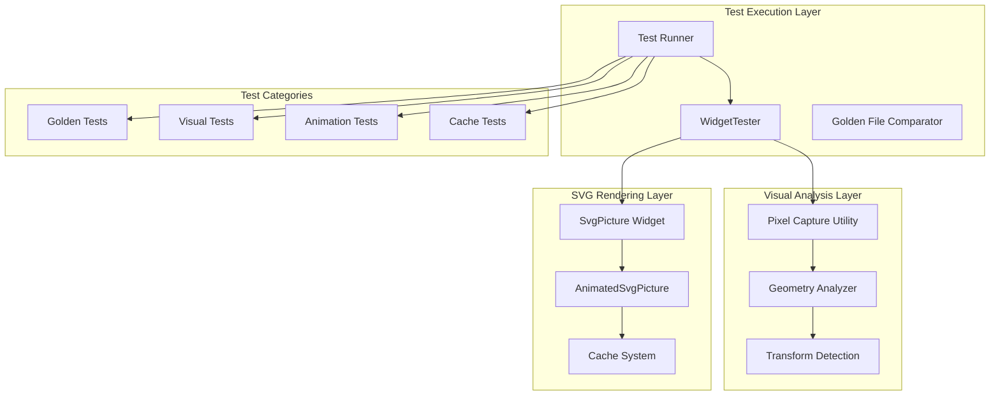
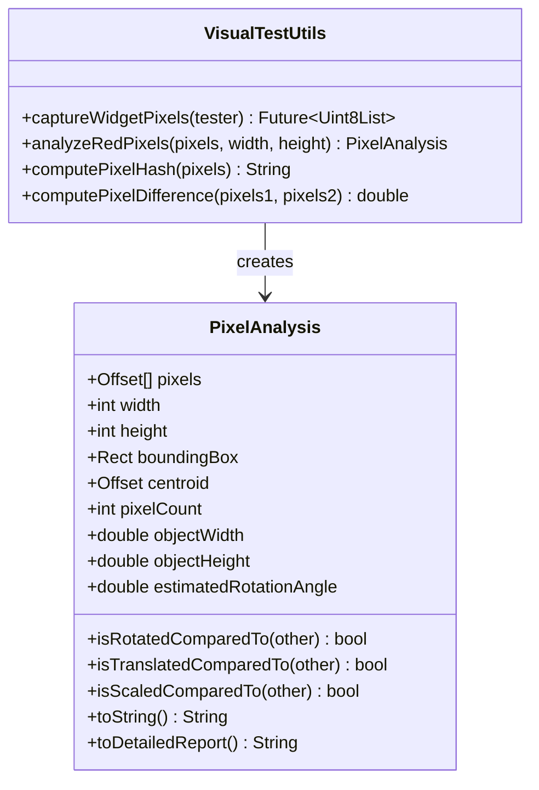
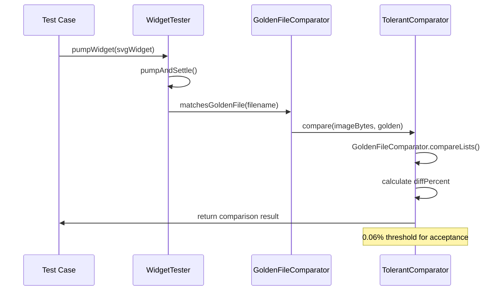
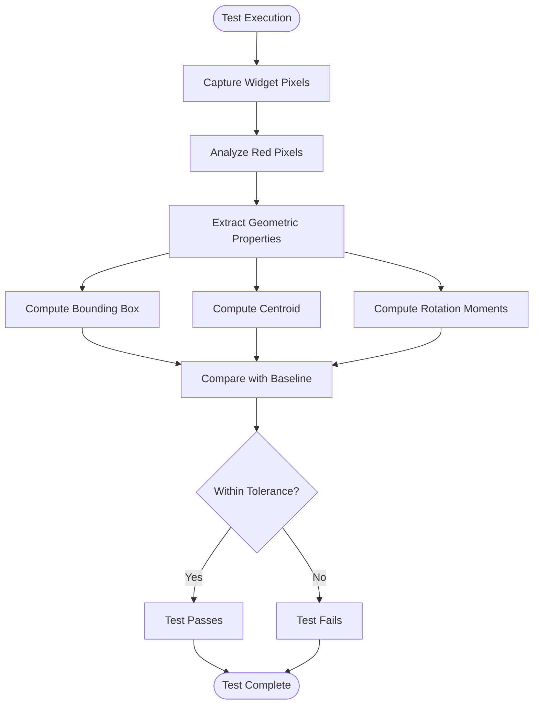
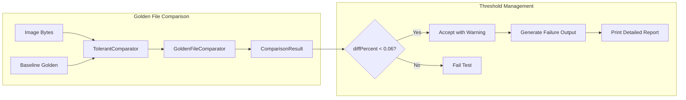
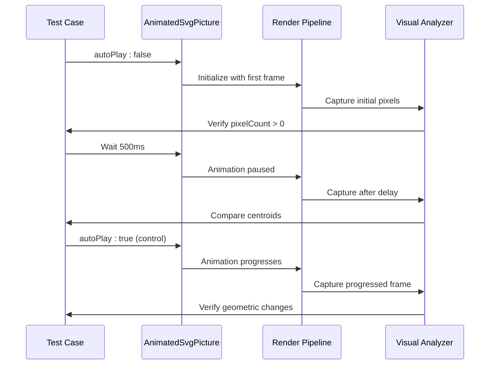
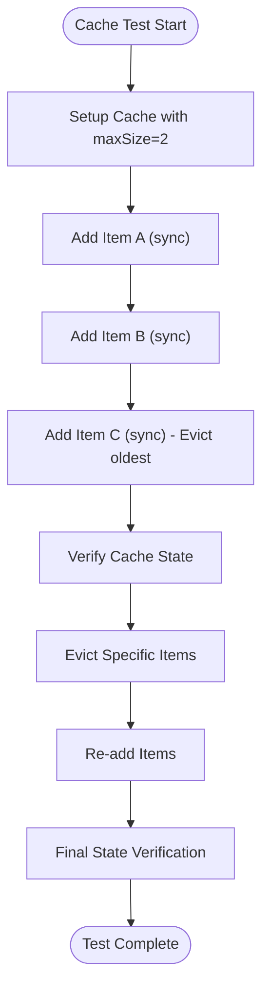
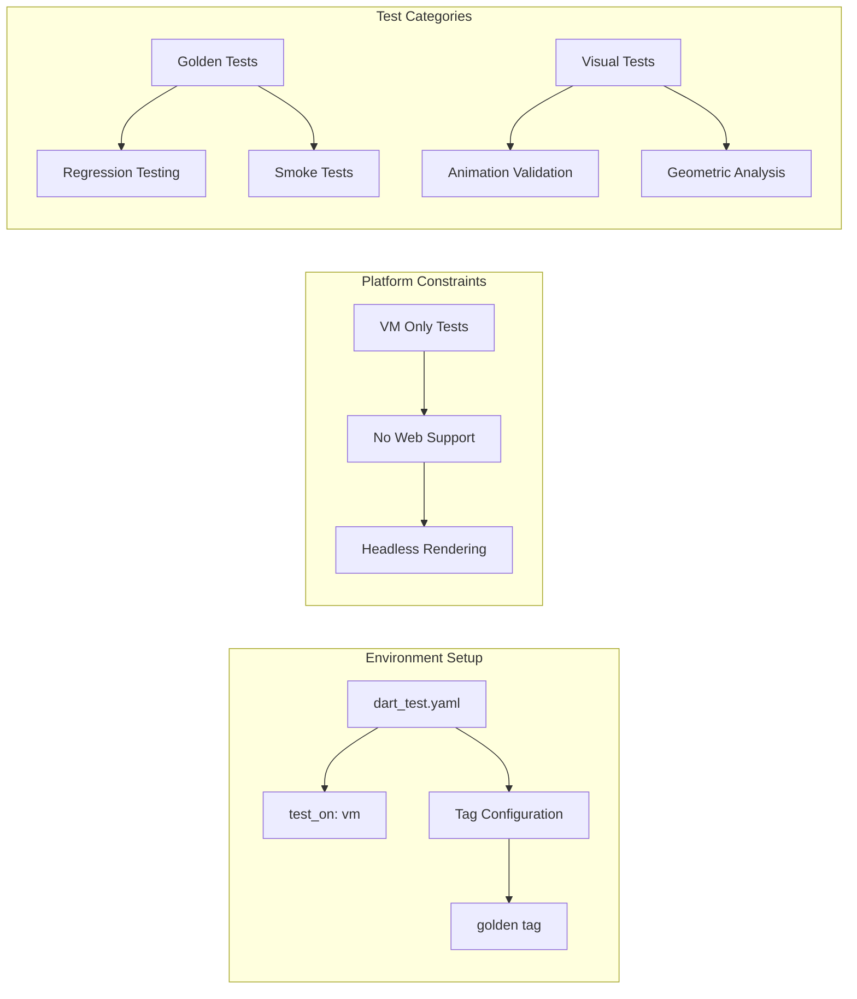

# Testing Infrastructure Documentation

<cite>
**Referenced Files in This Document**
- [dart_test.yaml](file://dart_test.yaml)
- [VISUAL_TESTING_GUIDELINES.md](file://VISUAL_TESTING_GUIDELINES.md)
- [visual_test_utils.dart](file://test/animation/visual_test_utils.dart)
- [cache_test.dart](file://test/cache_test.dart)
- [widget_svg_test.dart](file://test/widget_svg_test.dart)
- [autoplay_false_test.dart](file://test/animation/autoplay_false_test.dart)
- [rotation_golden_test.dart](file://test/animation/rotation_golden_test.dart)
- [pubspec.yaml](file://pubspec.yaml)
- [svg.dart](file://lib/svg.dart)
</cite>

## Table of Contents
1. [Introduction](#introduction)
2. [Testing Architecture Overview](#testing-architecture-overview)
3. [Core Testing Components](#core-testing-components)
4. [Visual Testing Framework](#visual-testing-framework)
5. [Golden Testing Infrastructure](#golden-testing-infrastructure)
6. [Animation Testing Suite](#animation-testing-suite)
7. [Cache Testing Implementation](#cache-testing-implementation)
8. [Test Configuration and Setup](#test-configuration-and-setup)
9. [Testing Best Practices](#testing-best-practices)
10. [Troubleshooting Guide](#troubleshooting-guide)
11. [Conclusion](#conclusion)

## Introduction

The Flutter SVG testing infrastructure represents a comprehensive approach to ensuring the reliability and correctness of SVG rendering capabilities in Flutter applications. This testing framework combines traditional golden file testing with advanced visual analysis techniques to validate both the logical correctness and visual accuracy of SVG animations and static renderings.

The testing infrastructure is designed to address the unique challenges of SVG animation testing, where traditional unit tests may pass while visual rendering fails. The framework employs sophisticated pixel analysis techniques to detect subtle animation changes that might be missed by conventional testing approaches.

## Testing Architecture Overview

The testing infrastructure follows a multi-layered approach that combines different testing methodologies to provide comprehensive coverage of SVG functionality.

**Diagram sources**
- [dart_test.yaml:1-10](file://dart_test.yaml#L1-L10)
- [VISUAL_TESTING_GUIDELINES.md:1-329](file://VISUAL_TESTING_GUIDELINES.md#L1-L329)
- [visual_test_utils.dart:1-231](file://test/animation/visual_test_utils.dart#L1-L231)

The architecture consists of four primary layers:

1. **Test Execution Layer**: Manages test execution, widget testing, and golden file comparisons
2. **Visual Analysis Layer**: Performs pixel-level analysis and geometric transformations detection
3. **SVG Rendering Layer**: Handles SVG parsing, animation, and caching mechanisms
4. **Test Categories**: Organizes tests by functionality type (golden, visual, animation, cache)

## Core Testing Components

### Visual Testing Utilities

The visual testing framework centers around the `VisualTestUtils` class, which provides comprehensive pixel analysis capabilities for SVG animation testing.

**Diagram sources**
- [visual_test_utils.dart:10-101](file://test/animation/visual_test_utils.dart#L10-L101)
- [visual_test_utils.dart:104-231](file://test/animation/visual_test_utils.dart#L104-L231)

The visual testing utilities provide several key capabilities:

- **Pixel Capture**: Direct pixel extraction from rendered widgets using `RepaintBoundary`
- **Color Analysis**: Red pixel detection with configurable thresholds
- **Geometric Analysis**: Bounding box calculation, centroid computation, and rotation estimation
- **Comparison Functions**: Hash-based comparison and difference percentage calculation

### Golden Testing Framework

The golden testing infrastructure uses Flutter's built-in golden file testing with custom comparators for enhanced tolerance handling.

**Diagram sources**
- [widget_svg_test.dart:12-36](file://test/widget_svg_test.dart#L12-L36)
- [widget_svg_test.dart:38-42](file://test/widget_svg_test.dart#L38-L42)

**Section sources**
- [widget_svg_test.dart:12-36](file://test/widget_svg_test.dart#L12-L36)
- [widget_svg_test.dart:38-42](file://test/widget_svg_test.dart#L38-L42)

## Visual Testing Framework

### Pixel Analysis Engine

The visual testing framework implements sophisticated pixel analysis techniques to detect geometric transformations in SVG animations.

**Diagram sources**
- [visual_test_utils.dart:40-63](file://test/animation/visual_test_utils.dart#L40-L63)
- [visual_test_utils.dart:115-183](file://test/animation/visual_test_utils.dart#L115-L183)

### Transform Detection Capabilities

The framework excels at detecting various types of geometric transformations:

- **Rotation Detection**: Uses second-order moments to estimate rotation angles
- **Translation Verification**: Compares centroid positions between frames
- **Scaling Analysis**: Measures changes in bounding box dimensions
- **Pixel Count Validation**: Ensures rendering occurred successfully

**Section sources**
- [VISUAL_TESTING_GUIDELINES.md:41-64](file://VISUAL_TESTING_GUIDELINES.md#L41-L64)
- [visual_test_utils.dart:185-203](file://test/animation/visual_test_utils.dart#L185-L203)

## Golden Testing Infrastructure

### Tolerant Comparison System

The golden testing system implements a sophisticated comparison mechanism that accounts for minor rendering variations while maintaining strict quality standards.

**Diagram sources**
- [widget_svg_test.dart:12-36](file://test/widget_svg_test.dart#L12-L36)

### Test Organization Structure

The golden testing infrastructure organizes tests by functionality and rendering strategy:

- **Basic Rendering Tests**: Validate fundamental SVG rendering capabilities
- **Color Mapping Tests**: Test color substitution and theme application
- **Layout Strategy Tests**: Verify different fitting and positioning approaches
- **Network Loading Tests**: Validate remote SVG loading and caching
- **Semantic Testing**: Ensure accessibility features work correctly

**Section sources**
- [widget_svg_test.dart:86-534](file://test/widget_svg_test.dart#L86-L534)

## Animation Testing Suite

### AutoPlay Control Testing

The animation testing suite focuses on validating the `autoPlay` parameter behavior and ensuring proper frame rendering under different animation states.

**Diagram sources**
- [autoplay_false_test.dart:9-60](file://test/animation/autoplay_false_test.dart#L9-L60)
- [autoplay_false_test.dart:62-115](file://test/animation/autoplay_false_test.dart#L62-L115)

### Rotation Animation Validation

The framework includes comprehensive testing for rotation animations, validating both static and dynamic rendering behaviors.

**Section sources**
- [autoplay_false_test.dart:1-162](file://test/animation/autoplay_false_test.dart#L1-L162)
- [rotation_golden_test.dart:1-261](file://test/animation/rotation_golden_test.dart#L1-L261)

## Cache Testing Implementation

### LRU Cache Validation

The cache testing implementation validates the Least Recently Used (LRU) eviction policy and concurrent access handling.

**Diagram sources**
- [cache_test.dart:32-72](file://test/cache_test.dart#L32-L72)

### Concurrent Access Testing

The cache system handles concurrent operations through completer-based futures, ensuring thread-safe access patterns.

**Section sources**
- [cache_test.dart:1-133](file://test/cache_test.dart#L1-L133)

## Test Configuration and Setup

### Test Environment Configuration

The testing infrastructure uses specific configuration to ensure consistent test execution across different platforms and environments.

**Diagram sources**
- [dart_test.yaml:1-10](file://dart_test.yaml#L1-L10)

### Dependency Management

The testing framework relies on specific Flutter and SVG-related dependencies for comprehensive testing coverage.

**Section sources**
- [pubspec.yaml:21-24](file://pubspec.yaml#L21-L24)
- [dart_test.yaml:1-10](file://dart_test.yaml#L1-L10)

## Testing Best Practices

### Visual Testing Guidelines

The visual testing framework establishes comprehensive guidelines for reliable animation testing:

1. **Deterministic Timeline Setup**: Use `autoPlay: false` with `initialTime` for fixed-frame assertions
2. **Pixel Analysis Over Golden Tests**: Prefer geometric analysis for transform validation
3. **Multiple Timepoint Testing**: Test at 0%, 25%, 50%, 75%, and 100% completion stages
4. **Avoid pumpAndSettle**: Never use `pumpAndSettle` with infinite animations

### Debugging and Troubleshooting

The framework provides extensive debugging capabilities through detailed reporting and analysis tools.

**Section sources**
- [VISUAL_TESTING_GUIDELINES.md:225-329](file://VISUAL_TESTING_GUIDELINES.md#L225-L329)

## Troubleshooting Guide

### Common Visual Testing Issues

| Issue | Symptoms | Solution |
|-------|----------|----------|
| Zero Pixel Count | `pixelCount = 0` | Verify `pump()` calls, check SVG fill color, confirm image size |
| Infinite Animation Hang | `pumpAndSettle()` blocks | Use explicit `pump(Duration)` instead of `pumpAndSettle()` |
| Platform Differences | Different rendering on macOS/Linux | Use pixel analysis instead of golden comparisons |
| Transform Detection Failure | Rotation not detected | Verify red pixel threshold, check SVG fill color |

### Cache Testing Problems

| Issue | Symptoms | Solution |
|-------|----------|----------|
| Cache Eviction Failure | Items not evicted | Verify `maximumSize` setting, check item keys |
| Concurrent Access Issues | Race conditions | Use `Completer` futures for async operations |
| Memory Leaks | Increasing cache count | Ensure proper cleanup and disposal |

**Section sources**
- [VISUAL_TESTING_GUIDELINES.md:276-307](file://VISUAL_TESTING_GUIDELINES.md#L276-L307)
- [cache_test.dart:105-131](file://test/cache_test.dart#L105-L131)

## Conclusion

The Flutter SVG testing infrastructure represents a sophisticated approach to ensuring the reliability and correctness of SVG rendering capabilities. By combining traditional golden file testing with advanced visual analysis techniques, the framework addresses the unique challenges of SVG animation validation.

The testing infrastructure successfully bridges the gap between logical correctness and visual accuracy, providing developers with confidence that their SVG animations render correctly across different platforms and configurations. The comprehensive visual testing framework, combined with robust cache validation and golden testing capabilities, ensures that the SVG rendering system maintains high quality standards.

The modular design of the testing infrastructure allows for easy maintenance and extension, supporting future enhancements such as widget-size capture, color-agnostic analysis, and platform-specific golden test management. This foundation provides a solid base for continued development and improvement of SVG animation capabilities in Flutter applications.