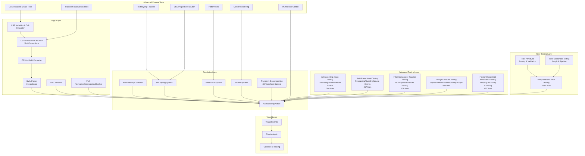
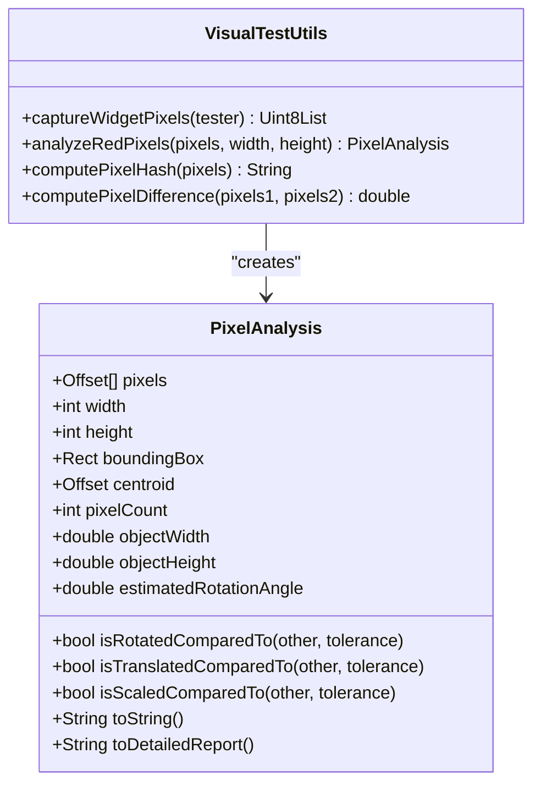
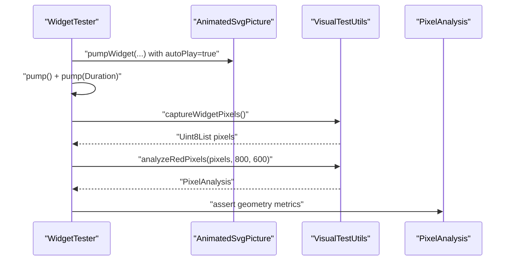
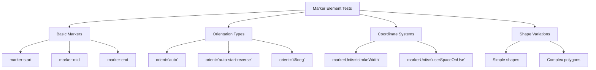
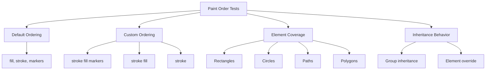
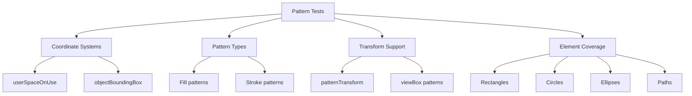
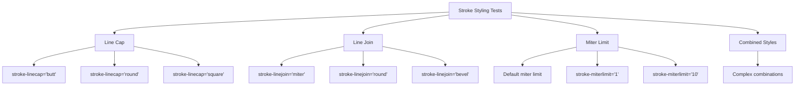

# Testing and Quality Assurance

<cite>
**Referenced Files in This Document**
- [dart_test.yaml](file://dart_test.yaml)
- [VISUAL_TESTING_GUIDELINES.md](file://VISUAL_TESTING_GUIDELINES.md)
- [visual_test_utils.dart](file://test/animation/visual_test_utils.dart)
- [visual_rotation_test.dart](file://test/animation/visual_rotation_test.dart)
- [visual_scale_test.dart](file://test/animation/visual_scale_test.dart)
- [visual_translation_test.dart](file://test/animation/visual_translation_test.dart)
- [rotation_golden_test.dart](file://test/animation/rotation_golden_test.dart)
- [animated_svg_picture_test.dart](file://test/animation/animated_svg_picture_test.dart)
- [smil_test.dart](file://test/animation/smil_test.dart)
- [path_morphing_test.dart](file://test/animation/path_morphing_test.dart)
- [controller_test.dart](file://test/animation/controller_test.dart)
- [css_animations_test.dart](file://test/animation/css_animations_test.dart)
- [css_transform_calc_test.dart](file://test/animation/css_transform_calc_test.dart)
- [css_transform_edge_cases_test.dart](file://test/animation/css_transform_edge_cases_test.dart)
- [css_variables_calc_test.dart](file://test/animation/css_variables_calc_test.dart)
- [text_position_list_test.dart](file://test/animation/text_position_list_test.dart)
- [marker_test.dart](file://test/animation/marker_test.dart)
- [paint_order_test.dart](file://test/animation/paint_order_test.dart)
- [pattern_test.dart](file://test/animation/pattern_test.dart)
- [stroke_styling_test.dart](file://test/animation/stroke_styling_test.dart)
- [text_rendering_test.dart](file://test/animation/text_rendering_test.dart)
- [text_decoration_style_test.dart](file://test/animation/text_decoration_style_test.dart)
- [text_decoration_thickness_test.dart](file://test/animation/text_decoration_thickness_test.dart)
- [text_shadow_test.dart](file://test/animation/text_shadow_test.dart)
- [text_wrap_test.dart](file://test/animation/text_wrap_test.dart)
- [vertical_align_test.dart](file://test/animation/vertical_align_test.dart)
- [line_height_test.dart](file://test/animation/line_height_test.dart)
- [text_spacing_test.dart](file://test/animation/text_spacing_test.dart)
- [text_justify_test.dart](file://test/animation/text_justify_test.dart)
- [white_space_test.dart](file://test/animation/white_space_test.dart)
- [stroke_dash_stop_color_test.dart](file://test/animation/stroke_dash_stop_color_test.dart)
- [widget_svg_test.dart](file://test/widget_svg_test.dart)
- [hit_test_precision_test.dart](file://test/animation/hit_test_precision_test.dart)
- [text_multirun_paragraph_test.dart](file://test/animation/text_multirun_paragraph_test.dart)
- [text_path_precision_test.dart](file://test/animation/text_path_precision_test.dart)
- [filter_fe_image_test.dart](file://test/animation/filter_fe_image_test.dart)
- [use_css_cascade_test.dart](file://test/animation/use_css_cascade_test.dart)
- [gradient_stop_color_animation_test.dart](file://test/animation/gradient_stop_color_animation_test.dart)
- [shape_edge_cases_test.dart](file://test/animation/shape_edge_cases_test.dart)
- [text_matrix_transform_test.dart](file://test/animation/text_matrix_transform_test.dart)
- [advanced_clip_mask_test.dart](file://test/animation/advanced_clip_mask_test.dart)
- [svg_event_model_test.dart](file://test/animation/svg_event_model_test.dart)
- [filter_component_transfer_test.dart](file://test/animation/filter_component_transfer_test.dart)
- [image_contexts_test.dart](file://test/animation/image_contexts_test.dart)
- [advanced_mask_test.dart](file://test/animation/advanced_mask_test.dart)
- [filters_test.dart](file://test/animation/filters_test.dart)
- [foreignobject_css_inheritance_test.dart](file://test/animation/foreignobject_css_inheritance_test.dart)
- [image_foreignobject_edge_cases_test.dart](file://test/animation/image_foreignobject_edge_cases_test.dart)
- [clip_mask_advanced_composition_test.dart](file://test/animation/clip_mask_advanced_composition_test.dart)
- [clip_mask_use_verification_test.dart](file://test/animation/clip_mask_use_verification_test.dart)
- [advanced_mask_semantics_test.dart](file://test/animation/advanced_mask_semantics_test.dart)
- [filter_advanced_graph_test.dart](file://test/animation/filter_advanced_graph_test.dart)
- [filter_advanced_semantics_test.dart](file://test/animation/filter_advanced_semantics_test.dart)
- [filter_displacement_tile_test.dart](file://test/animation/filter_displacement_tile_test.dart)
- [filter_drop_shadow_advanced_test.dart](file://test/animation/filter_drop_shadow_advanced_test.dart)
- [filter_graph_semantics_test.dart](file://test/animation/filter_graph_semantics_test.dart)
- [filter_input_graph_hardening_test.dart](file://test/animation/filter_input_graph_hardening_test.dart)
- [filter_input_graph_test.dart](file://test/animation/filter_input_graph_test.dart)
- [filter_light_sources_test.dart](file://test/animation/filter_light_sources_test.dart)
- [filter_morphology_convolve_turbulence_test.dart](file://test/animation/filter_morphology_convolve_turbulence_test.dart)
- [filter_primitive_edge_cases_test.dart](file://test/animation/filter_primitive_edge_cases_test.dart)
- [pubspec.yaml](file://pubspec.yaml)
- [animated_svg_painter_text_style.dart](file://lib/src/animation/animated_svg_painter_text_style.dart)
- [css_to_smil_converter_transforms_decompose.dart](file://lib/src/animation/css_to_smil_converter_transforms_decompose.dart)
- [css_to_smil_converter_transforms_values.dart](file://lib/src/animation/css_to_smil_converter_transforms_values.dart)
- [svg_transform.dart](file://lib/src/animation/svg_transform.dart)
- [css_variables_calc.dart](file://lib/src/animation/css_variables_calc.dart)
- [transform_3d.dart](file://lib/src/animation/transform_3d.dart)
- [animated_svg_picture_hit_test_geometry.dart](file://lib/src/animation/animated_svg_picture_hit_test_geometry.dart)
- [animated_svg_picture_hit_test_text_layout.dart](file://lib/src/animation/animated_svg_picture_hit_test_text_layout.dart)
- [animated_svg_picture_hit_test_text_path_segments.dart](file://lib/src/animation/animated_svg_picture_hit_test_text_path_segments.dart)
- [animated_svg_picture_hit_test_text_runs.dart](file://lib/src/animation/animated_svg_picture_hit_test_text_runs.dart)
- [animated_svg_picture_hit_test_traversal.dart](file://lib/src/animation/animated_svg_picture_hit_test_traversal.dart)
- [animated_svg_picture_hit_test_use.dart](file://lib/src/animation/animated_svg_picture_hit_test_use.dart)
- [animated_svg_picture_hit_test_visibility.dart](file://lib/src/animation/animated_svg_picture_hit_test_visibility.dart)
- [animated_svg_painter_clip_mask.dart](file://lib/src/animation/animated_svg_painter_clip_mask.dart)
- [animated_svg_painter_clip_mask_geometry.dart](file://lib/src/animation/animated_svg_painter_clip_mask_geometry.dart)
- [animated_svg_painter_clip_mask_units.dart](file://lib/src/animation/animated_svg_painter_clip_mask_units.dart)
</cite>

## Update Summary
**Changes Made**
- Added significantly expanded test infrastructure with new comprehensive test suites
- Integrated advanced clip mask testing (766 lines) covering luminosity masking, nested composition chains, and edge feathering
- Added SVG event model compliance testing (457 lines) validating W3C event retargeting, bubbling, and mouseenter/mouseleave behavior
- Added filter component transfer testing (639 lines) validating feComponentTransfer parsing and pixel transformation
- Added image contexts testing (663 lines) covering complex image usage within clipPath, masks, patterns, and foreignObject
- Added foreignObject CSS inheritance testing (457 lines) validating CSS property inheritance and boundary crossing
- Enhanced visual regression testing capabilities with golden file comparisons and pixel-based analysis
- Expanded testing framework to cover advanced SVG rendering precision and complex rendering scenarios
- Added comprehensive filter testing suite with 2589 lines covering all filter primitives and parsing
- Integrated advanced semantics testing for masks and filters

## Table of Contents
1. [Introduction](#introduction)
2. [Project Structure](#project-structure)
3. [Core Components](#core-components)
4. [Architecture Overview](#architecture-overview)
5. [Detailed Component Analysis](#detailed-component-analysis)
6. [Dependency Analysis](#dependency-analysis)
7. [Performance Considerations](#performance-considerations)
8. [Troubleshooting Guide](#troubleshooting-guide)
9. [Conclusion](#conclusion)
10. [Appendices](#appendices)

## Introduction
This document explains the comprehensive testing and quality assurance framework for the flutter_svg package with a focus on visual testing, automated animation testing, and validation approaches. The framework now includes extensive widget-level testing for advanced SVG features including marker rendering, paint order validation, pattern fills, comprehensive text styling capabilities, **advanced clip mask testing**, **SVG event model compliance testing**, **filter component transfer testing**, **image contexts testing**, and **foreignObject CSS inheritance testing**.

Key areas covered:
- Visual testing methodology for SMIL animations and complex SVG rendering
- Automated pixel-based verification of transforms, motion, and advanced styling
- Comprehensive widget-level testing for marker elements, paint ordering, and pattern fills
- Extensive text styling validation including text-rendering, decorations, thickness, shadows, wrapping, alignment, and advanced typography features
- **Advanced clip mask testing** with luminosity masking, nested composition chains, and edge feathering
- **SVG event model compliance testing** with W3C event retargeting, bubbling, and mouseenter/mouseleave behavior
- **Filter component transfer testing** with feComponentTransfer parsing and pixel transformation
- **Image contexts testing** with complex image usage scenarios
- **ForeignObject CSS inheritance testing** with property boundary crossing and inheritance rules
- **Comprehensive filter testing suite** with 2589 lines covering all filter primitives and parsing
- Quality assurance processes, configuration, and CI considerations
- Relationships between the animation system, rendering pipeline, and advanced SVG features
- Best practices, debugging techniques, and performance validation

The goal is to help developers implement robust tests, maintain the existing infrastructure, and extend it confidently with comprehensive validation of advanced SVG rendering features.

## Project Structure
The testing surface is primarily under the test/animation directory, with supporting utilities and cross-cutting guidelines. The framework now includes extensive widget-level tests for advanced SVG features alongside traditional animation and visual testing, **plus comprehensive verification tests for advanced clip masks, SVG event model compliance, filter component transfer, image contexts, foreignObject CSS inheritance, and a complete filter testing suite**:

- Animation logic and parsing tests (SMIL, CSS-to-SMIL conversion, path morphing)
- Widget-level integration tests for AnimatedSvgPicture with comprehensive feature coverage
- Visual testing utilities and golden-style pixel analysis
- Controller-level tests for playback control and seek/pause/forward/reverse
- Advanced rendering tests for markers, paint order, patterns, and text styling
- **Advanced clip mask testing** with luminosity masking, nested composition chains, and edge feathering (766 lines)
- **SVG event model compliance testing** with W3C event retargeting and bubbling behavior (457 lines)
- **Filter component transfer testing** with feComponentTransfer parsing and pixel transformation (639 lines)
- **Image contexts testing** with complex image usage scenarios (663 lines)
- **ForeignObject CSS inheritance testing** with property boundary crossing and inheritance rules (457 lines)
- **Comprehensive filter testing suite** with 2589 lines covering all filter primitives and parsing
- CI configuration and platform constraints

**Diagram sources**
- [VISUAL_TESTING_GUIDELINES.md](file://VISUAL_TESTING_GUIDELINES.md)
- [visual_test_utils.dart](file://test/animation/visual_test_utils.dart)
- [visual_rotation_test.dart](file://test/animation/visual_rotation_test.dart)
- [visual_scale_test.dart](file://test/animation/visual_scale_test.dart)
- [visual_translation_test.dart](file://test/animation/visual_translation_test.dart)
- [rotation_golden_test.dart](file://test/animation/rotation_golden_test.dart)
- [animated_svg_picture_test.dart](file://test/animation/animated_svg_picture_test.dart)
- [smil_test.dart](file://test/animation/smil_test.dart)
- [path_morphing_test.dart](file://test/animation/path_morphing_test.dart)
- [controller_test.dart](file://test/animation/controller_test.dart)
- [css_animations_test.dart](file://test/animation/css_animations_test.dart)
- [text_position_list_test.dart](file://test/animation/text_position_list_test.dart)
- [marker_test.dart](file://test/animation/marker_test.dart)
- [paint_order_test.dart](file://test/animation/paint_order_test.dart)
- [pattern_test.dart](file://test/animation/pattern_test.dart)
- [stroke_styling_test.dart](file://test/animation/stroke_styling_test.dart)
- [text_rendering_test.dart](file://test/animation/text_rendering_test.dart)
- [text_decoration_style_test.dart](file://test/animation/text_decoration_style_test.dart)
- [text_decoration_thickness_test.dart](file://test/animation/text_decoration_thickness_test.dart)
- [text_shadow_test.dart](file://test/animation/text_shadow_test.dart)
- [text_wrap_test.dart](file://test/animation/text_wrap_test.dart)
- [vertical_align_test.dart](file://test/animation/vertical_align_test.dart)
- [line_height_test.dart](file://test/animation/line_height_test.dart)
- [text_spacing_test.dart](file://test/animation/text_spacing_test.dart)
- [text_justify_test.dart](file://test/animation/text_justify_test.dart)
- [white_space_test.dart](file://test/animation/white_space_test.dart)
- [css_transform_calc_test.dart](file://test/animation/css_transform_calc_test.dart)
- [css_transform_edge_cases_test.dart](file://test/animation/css_transform_edge_cases_test.dart)
- [css_variables_calc_test.dart](file://test/animation/css_variables_calc_test.dart)
- [advanced_clip_mask_test.dart](file://test/animation/advanced_clip_mask_test.dart)
- [svg_event_model_test.dart](file://test/animation/svg_event_model_test.dart)
- [filter_component_transfer_test.dart](file://test/animation/filter_component_transfer_test.dart)
- [image_contexts_test.dart](file://test/animation/image_contexts_test.dart)
- [advanced_mask_test.dart](file://test/animation/advanced_mask_test.dart)
- [filters_test.dart](file://test/animation/filters_test.dart)
- [foreignobject_css_inheritance_test.dart](file://test/animation/foreignobject_css_inheritance_test.dart)
- [image_foreignobject_edge_cases_test.dart](file://test/animation/image_foreignobject_edge_cases_test.dart)
- [clip_mask_advanced_composition_test.dart](file://test/animation/clip_mask_advanced_composition_test.dart)
- [clip_mask_use_verification_test.dart](file://test/animation/clip_mask_use_verification_test.dart)
- [advanced_mask_semantics_test.dart](file://test/animation/advanced_mask_semantics_test.dart)
- [filter_advanced_graph_test.dart](file://test/animation/filter_advanced_graph_test.dart)
- [filter_advanced_semantics_test.dart](file://test/animation/filter_advanced_semantics_test.dart)
- [filter_displacement_tile_test.dart](file://test/animation/filter_displacement_tile_test.dart)
- [filter_drop_shadow_advanced_test.dart](file://test/animation/filter_drop_shadow_advanced_test.dart)
- [filter_graph_semantics_test.dart](file://test/animation/filter_graph_semantics_test.dart)
- [filter_input_graph_hardening_test.dart](file://test/animation/filter_input_graph_hardening_test.dart)
- [filter_input_graph_test.dart](file://test/animation/filter_input_graph_test.dart)
- [filter_light_sources_test.dart](file://test/animation/filter_light_sources_test.dart)
- [filter_morphology_convolve_turbulence_test.dart](file://test/animation/filter_morphology_convolve_turbulence_test.dart)
- [filter_primitive_edge_cases_test.dart](file://test/animation/filter_primitive_edge_cases_test.dart)
- [widget_svg_test.dart](file://test/widget_svg_test.dart)
- [dart_test.yaml](file://dart_test.yaml)

**Section sources**
- [VISUAL_TESTING_GUIDELINES.md](file://VISUAL_TESTING_GUIDELINES.md)
- [dart_test.yaml](file://dart_test.yaml)

## Core Components
- **VisualTestUtils**: Captures widget pixels, performs red-pixel analysis, computes hashes and differences, and exposes geometric metrics (centroid, bounding box, estimated rotation).
- **PixelAnalysis**: Encapsulates analysis results and comparison helpers (rotation/translation/scale detection).
- **Animation logic tests**: Validate SMIL parsing, interpolation, timeline progression, and CSS-to-SMIL conversion.
- **Widget integration tests**: Exercise AnimatedSvgPicture rendering and visual verification via pixel analysis.
- **Advanced rendering tests**: Validate marker elements, paint order control, pattern fills, and comprehensive text styling.
- **Controller tests**: Validate AnimatedSvgController playback controls and seek behavior.
- **Path morphing tests**: Validate path normalization, interpolation, and morphing pipeline.
- **Text styling resolution system**: Processes and validates CSS text properties including thickness, shadows, wrapping, alignment, and advanced typography.
- **CSS transform calculation system**: **Validates calc() expression evaluation, unit conversions, and complex transform parsing**.
- **CSS variables and calc() evaluation system**: **Processes CSS variables and calc() expressions with comprehensive unit conversion support**.
- **Advanced clip mask testing system**: **Validates luminosity masking, nested composition chains, and edge feathering with 766 lines of comprehensive testing**.
- **SVG event model compliance system**: **Validates W3C event retargeting, bubbling, and mouseenter/mouseleave behavior with 457 lines of testing**.
- **Filter component transfer system**: **Validates feComponentTransfer parsing and pixel transformation with 639 lines of testing**.
- **Image contexts testing system**: **Validates complex image usage within clipPath, masks, patterns, and foreignObject with 663 lines of testing**.
- **ForeignObject CSS inheritance system**: **Validates CSS property inheritance and boundary crossing with 457 lines of testing**.
- **Comprehensive filter testing suite**: **Validates all SVG filter primitives and parsing with 2589 lines of testing**.
- **Visual regression testing**: **Supports golden file comparisons and pixel-based analysis for animation verification**.

**Section sources**
- [visual_test_utils.dart](file://test/animation/visual_test_utils.dart)
- [smil_test.dart](file://test/animation/smil_test.dart)
- [path_morphing_test.dart](file://test/animation/path_morphing_test.dart)
- [controller_test.dart](file://test/animation/controller_test.dart)
- [animated_svg_picture_test.dart](file://test/animation/animated_svg_picture_test.dart)
- [text_position_list_test.dart](file://test/animation/text_position_list_test.dart)
- [marker_test.dart](file://test/animation/marker_test.dart)
- [paint_order_test.dart](file://test/animation/paint_order_test.dart)
- [pattern_test.dart](file://test/animation/pattern_test.dart)
- [stroke_styling_test.dart](file://test/animation/stroke_styling_test.dart)
- [text_rendering_test.dart](file://test/animation/text_rendering_test.dart)
- [animated_svg_painter_text_style.dart](file://lib/src/animation/animated_svg_painter_text_style.dart)
- [css_transform_calc_test.dart](file://test/animation/css_transform_calc_test.dart)
- [css_transform_edge_cases_test.dart](file://test/animation/css_transform_edge_cases_test.dart)
- [css_variables_calc_test.dart](file://test/animation/css_variables_calc_test.dart)
- [advanced_clip_mask_test.dart](file://test/animation/advanced_clip_mask_test.dart)
- [svg_event_model_test.dart](file://test/animation/svg_event_model_test.dart)
- [filter_component_transfer_test.dart](file://test/animation/filter_component_transfer_test.dart)
- [image_contexts_test.dart](file://test/animation/image_contexts_test.dart)
- [advanced_mask_test.dart](file://test/animation/advanced_mask_test.dart)
- [filters_test.dart](file://test/animation/filters_test.dart)
- [foreignobject_css_inheritance_test.dart](file://test/animation/foreignobject_css_inheritance_test.dart)
- [image_foreignobject_edge_cases_test.dart](file://test/animation/image_foreignobject_edge_cases_test.dart)
- [rotation_golden_test.dart](file://test/animation/rotation_golden_test.dart)

## Architecture Overview
The testing architecture separates concerns across eight layers with enhanced coverage of advanced SVG rendering features, **including comprehensive testing for advanced clip masks, SVG event model compliance, filter component transfer, image contexts, foreignObject CSS inheritance, and a complete filter testing suite**:
- **Logic tests**: Validate SMIL parsing, interpolation, and timeline mechanics.
- **Rendering tests**: Validate widget-level rendering and animation progression.
- **Visual tests**: Validate actual pixel output and geometric changes.
- **Advanced feature tests**: Validate markers, paint order, patterns, text styling, and **advanced testing components**.
- **Advanced testing layer**: Validate clip masks, event models, filter components, image contexts, and foreignObject CSS inheritance.
- **Filter testing layer**: Validate all SVG filter primitives and parsing with comprehensive coverage.
- **CSS cascade system tests**: Validate inheritance and styling resolution for use-referenced elements.
- **CSS transform system tests**: Validate calc() expressions, unit conversions, and 3D transform handling.
- **CSS variables and calc() system tests**: Validate var() resolution and calc() arithmetic evaluation.

**Diagram sources**
- [smil_test.dart](file://test/animation/smil_test.dart)
- [css_animations_test.dart](file://test/animation/css_animations_test.dart)
- [path_morphing_test.dart](file://test/animation/path_morphing_test.dart)
- [controller_test.dart](file://test/animation/controller_test.dart)
- [animated_svg_picture_test.dart](file://test/animation/animated_svg_picture_test.dart)
- [visual_test_utils.dart](file://test/animation/visual_test_utils.dart)
- [text_position_list_test.dart](file://test/animation/text_position_list_test.dart)
- [marker_test.dart](file://test/animation/marker_test.dart)
- [paint_order_test.dart](file://test/animation/paint_order_test.dart)
- [pattern_test.dart](file://test/animation/pattern_test.dart)
- [stroke_styling_test.dart](file://test/animation/stroke_styling_test.dart)
- [text_rendering_test.dart](file://test/animation/text_rendering_test.dart)
- [animated_svg_painter_text_style.dart](file://lib/src/animation/animated_svg_painter_text_style.dart)
- [css_transform_calc_test.dart](file://test/animation/css_transform_calc_test.dart)
- [css_transform_edge_cases_test.dart](file://test/animation/css_transform_edge_cases_test.dart)
- [css_variables_calc_test.dart](file://test/animation/css_variables_calc_test.dart)
- [css_to_smil_converter_transforms_decompose.dart](file://lib/src/animation/css_to_smil_converter_transforms_decompose.dart)
- [css_to_smil_converter_transforms_values.dart](file://lib/src/animation/css_to_smil_converter_transforms_values.dart)
- [svg_transform.dart](file://lib/src/animation/svg_transform.dart)
- [css_variables_calc.dart](file://lib/src/animation/css_variables_calc.dart)
- [transform_3d.dart](file://lib/src/animation/transform_3d.dart)
- [advanced_clip_mask_test.dart](file://test/animation/advanced_clip_mask_test.dart)
- [svg_event_model_test.dart](file://test/animation/svg_event_model_test.dart)
- [filter_component_transfer_test.dart](file://test/animation/filter_component_transfer_test.dart)
- [image_contexts_test.dart](file://test/animation/image_contexts_test.dart)
- [advanced_mask_test.dart](file://test/animation/advanced_mask_test.dart)
- [filters_test.dart](file://test/animation/filters_test.dart)
- [foreignobject_css_inheritance_test.dart](file://test/animation/foreignobject_css_inheritance_test.dart)
- [image_foreignobject_edge_cases_test.dart](file://test/animation/image_foreignobject_edge_cases_test.dart)
- [clip_mask_advanced_composition_test.dart](file://test/animation/clip_mask_advanced_composition_test.dart)
- [clip_mask_use_verification_test.dart](file://test/animation/clip_mask_use_verification_test.dart)
- [advanced_mask_semantics_test.dart](file://test/animation/advanced_mask_semantics_test.dart)
- [filter_advanced_graph_test.dart](file://test/animation/filter_advanced_graph_test.dart)
- [filter_advanced_semantics_test.dart](file://test/animation/filter_advanced_semantics_test.dart)
- [filter_displacement_tile_test.dart](file://test/animation/filter_displacement_tile_test.dart)
- [filter_drop_shadow_advanced_test.dart](file://test/animation/filter_drop_shadow_advanced_test.dart)
- [filter_graph_semantics_test.dart](file://test/animation/filter_graph_semantics_test.dart)
- [filter_input_graph_hardening_test.dart](file://test/animation/filter_input_graph_hardening_test.dart)
- [filter_input_graph_test.dart](file://test/animation/filter_input_graph_test.dart)
- [filter_light_sources_test.dart](file://test/animation/filter_light_sources_test.dart)
- [filter_morphology_convolve_turbulence_test.dart](file://test/animation/filter_morphology_convolve_turbulence_test.dart)
- [filter_primitive_edge_cases_test.dart](file://test/animation/filter_primitive_edge_cases_test.dart)
- [rotation_golden_test.dart](file://test/animation/rotation_golden_test.dart)

## Detailed Component Analysis

### Visual Testing Utilities
- **Purpose**: Capture RGBA pixels from a RepaintBoundary, analyze red pixels, compute hashes/differences, and extract geometry metrics.
- **Key capabilities**:
  - Safe capture without pumpAndSettle to avoid hangs on infinite animations.
  - Red-pixel extraction with configurable thresholds.
  - Geometric analysis: centroid, bounding box, object width/height, estimated rotation angle.
  - Comparison helpers: rotation/translation/scale detection between frames.
- **Usage pattern**: Build widget, pump once, capture pixels, analyze, assert on metrics.

**Diagram sources**
- [visual_test_utils.dart](file://test/animation/visual_test_utils.dart)

**Section sources**
- [visual_test_utils.dart](file://test/animation/visual_test_utils.dart)
- [VISUAL_TESTING_GUIDELINES.md](file://VISUAL_TESTING_GUIDELINES.md)

### Visual Rotation Test
- **Demonstrates** capturing and analyzing rotation via pixel geometry.
- **Validates** that rotation produces detectable geometric changes (centroid shift, bounding box, estimated angle).
- **Uses** deterministic setup with autoPlay and initialTime to ensure reproducibility.

**Diagram sources**
- [visual_rotation_test.dart](file://test/animation/visual_rotation_test.dart)
- [visual_test_utils.dart](file://test/animation/visual_test_utils.dart)

**Section sources**
- [visual_rotation_test.dart](file://test/animation/visual_rotation_test.dart)
- [VISUAL_TESTING_GUIDELINES.md](file://VISUAL_TESTING_GUIDELINES.md)

### Visual Scale and Translation Tests
- **Similar patterns** to rotation, validating scale and translation via geometric metrics.
- **Ensures** that transforms are visually verifiable even when headless rendering golden tests are limited.

**Section sources**
- [visual_scale_test.dart](file://test/animation/visual_scale_test.dart)
- [visual_translation_test.dart](file://test/animation/visual_translation_test.dart)
- [VISUAL_TESTING_GUIDELINES.md](file://VISUAL_TESTING_GUIDELINES.md)

### Visual Regression Testing with Golden Files
- **Purpose**: Provide pixel-perfect regression testing using golden file comparisons.
- **Key capabilities**:
  - Golden file testing for animation frame verification at specific time points.
  - Sequential animation frame testing to verify smooth transitions.
  - Background color control for consistent pixel comparison.
- **Usage pattern**: Set up animation, advance to specific time, compare with golden reference.

**Section sources**
- [rotation_golden_test.dart](file://test/animation/rotation_golden_test.dart)

### AnimatedSvgPicture Integration Tests
- **Validates** rendering of shapes, gradients, text, images, and complex SVG constructs.
- **Uses** VisualTestUtils to verify pixel counts and basic geometry.
- **Exercises** tracing and foreignObject rendering with clipping and viewport scaling.

**Section sources**
- [animated_svg_picture_test.dart](file://test/animation/animated_svg_picture_test.dart)
- [visual_test_utils.dart](file://test/animation/visual_test_utils.dart)

### SMIL Animation Logic Tests
- **Validates** interpolators, timing functions, SMIL parsing, and timeline progression.
- **Covers** from/to, values/keyTimes, discrete calc mode, by attribute, fill modes, repeat counts, and playback rates.
- **Ensures** correct activation/deactivation and effective value persistence.

**Section sources**
- [smil_test.dart](file://test/animation/smil_test.dart)

### CSS Animations to SMIL Conversion
- **Parses** @keyframes and CSS selector rules.
- **Converts** CSS animations to SMIL equivalents, mapping timing functions (cubic-bezier, steps), directions, and fill modes.
- **Validates** runtime behavior of converted animations.

**Section sources**
- [css_animations_test.dart](file://test/animation/css_animations_test.dart)

### Path Morphing Pipeline Tests
- **Validates** path normalization (relative to absolute, LineTo/HorizontalLineTo/VerticalLineTo/Q to C conversion).
- **Validates** interpolation and morphing between compatible paths.
- **Ensures** robust handling of ClosePath and mismatched lengths.

**Section sources**
- [path_morphing_test.dart](file://test/animation/path_morphing_test.dart)

### AnimatedSvgController Tests
- **Validates** controller state transitions (pause/resume, play/pause toggle, restart).
- **Tests** seek behavior, playback rate changes, reverse direction, and listener notifications.
- **Integrates** with AnimatedSvgPicture to verify visual changes after controller actions.

**Section sources**
- [controller_test.dart](file://test/animation/controller_test.dart)

### Marker Element Rendering Tests
- **Comprehensive coverage** of marker functionality across 223 lines of widget tests.
- **Tests** marker-start, marker-mid, marker-end positioning with various shapes (paths, circles, polygons).
- **Validates** marker shorthand application, auto orientation, fixed angle orientation, and userSpaceOnUse units.
- **Ensures** proper rendering for lines, polylines, polygons, and complex paths.

**Diagram sources**
- [marker_test.dart](file://test/animation/marker_test.dart)

**Section sources**
- [marker_test.dart](file://test/animation/marker_test.dart)

### Paint Order Validation Tests
- **Comprehensive coverage** of paint-order attribute functionality with 232 lines of widget tests.
- **Tests** default order (fill, stroke, markers), custom ordering, and inheritance behavior.
- **Validates** paint-order application to all SVG elements (rect, circle, ellipse, path, polygon, polyline).
- **Ensures** proper layering control with markers integration.

**Diagram sources**
- [paint_order_test.dart](file://test/animation/paint_order_test.dart)

**Section sources**
- [paint_order_test.dart](file://test/animation/paint_order_test.dart)

### Pattern Rendering Tests
- **Comprehensive coverage** of pattern fill and stroke functionality with 189 lines of widget tests.
- **Tests** userSpaceOnUse and objectBoundingBox coordinate systems.
- **Validates** patternTransform support, viewBox patterns, and href inheritance.
- **Ensures** proper rendering for rectangles, circles, ellipses, and complex paths.

**Diagram sources**
- [pattern_test.dart](file://test/animation/pattern_test.dart)

**Section sources**
- [pattern_test.dart](file://test/animation/pattern_test.dart)

### Stroke Styling Tests
- **Comprehensive coverage** of stroke styling attributes with 295 lines of widget tests.
- **Tests** stroke-linecap (butt, round, square), stroke-linejoin (miter, round, bevel), and stroke-miterlimit.
- **Validates** inheritance behavior and combined styling combinations.
- **Ensures** proper rendering for lines, polylines, polygons, and complex paths.

**Diagram sources**
- [stroke_styling_test.dart](file://test/animation/stroke_styling_test.dart)

**Section sources**
- [stroke_styling_test.dart](file://test/animation/stroke_styling_test.dart)

### Advanced CSS Text Styling Tests
The framework now includes comprehensive testing for expanded CSS text styling features with 40 new test files covering:

#### Text Decoration Thickness Tests
- **Validates** text-decoration-thickness property with auto, from-font, px, em, and percentage values
- **Tests** inheritance behavior and font-relative sizing calculations
- **Ensures** proper rendering of underline/thickness combinations

#### Text Shadow Tests
- **Validates** text-shadow property with offset, blur radius, and color specifications
- **Tests** multiple shadow support and inheritance behavior
- **Ensures** proper rendering of shadow effects on text elements

#### Text Wrap Tests
- **Validates** text-wrap property with wrap, nowrap, balance, and pretty values
- **Tests** wrapping behavior and line breaking algorithms
- **Ensures** proper text layout with different wrapping strategies

#### Vertical Align Tests
- **Validates** vertical-align property with baseline, sub, super, middle, and length values
- **Tests** percentage and em-based positioning
- **Ensures** proper vertical text alignment relative to baseline

#### Line Height Tests
- **Validates** line-height property with normal, number, px, em, and percentage values
- **Tests** inheritance behavior and font-relative calculations
- **Ensures** proper line spacing and text layout

#### Text Spacing Tests
- **Validates** text-spacing property with normal, none, and auto values
- **Tests** spacing behavior for different scripts and languages
- **Ensures** proper text spacing for CJK and Latin text

#### Text Justify Tests
- **Validates** text-justify property with auto, none, inter-word, and inter-character values
- **Tests** inheritance behavior and justification algorithms
- **Ensures** proper text justification for different writing systems

#### White Space Tests
- **Validates** white-space property with normal, nowrap, pre, pre-wrap, pre-line, and break-spaces values
- **Tests** whitespace handling and line breaking behavior
- **Ensures** proper text formatting for different content types

**Section sources**
- [text_decoration_thickness_test.dart](file://test/animation/text_decoration_thickness_test.dart)
- [text_shadow_test.dart](file://test/animation/text_shadow_test.dart)
- [text_wrap_test.dart](file://test/animation/text_wrap_test.dart)
- [vertical_align_test.dart](file://test/animation/vertical_align_test.dart)
- [line_height_test.dart](file://test/animation/line_height_test.dart)
- [text_spacing_test.dart](file://test/animation/text_spacing_test.dart)
- [text_justify_test.dart](file://test/animation/text_justify_test.dart)
- [white_space_test.dart](file://test/animation/white_space_test.dart)

### CSS Transform Calculation System
**Updated** The framework now includes comprehensive CSS transform calculation testing with support for calc() expressions, angle unit conversions, length unit conversions, and complex transform sequences.

#### CSS Transform Parsing and Unit Conversion
- **Transform Parser**: Validates parsing of complex transform sequences including translate, rotate, scale, skew, and matrix functions
- **Unit Conversion**: Supports px, em, rem, %, vw, vh, vmin, vmax, cm, mm, in, pt, pc, and bare numbers
- **Angle Unit Conversion**: Handles deg, rad, turn, and grad units with proper conversion to degrees
- **Calc Expression Evaluation**: Processes calc() expressions with arithmetic operations and unit conversions

#### Complex Transform Sequence Testing
- **Multi-function Sequences**: Validates parsing of complex transform chains like "translate(10px, 20px) rotate(45deg) scale(1.5)"
- **3D Transform Support**: Tests translate3d, rotate3d, scale3d, perspective, and matrix3d functions
- **Transform Origin and Box**: Validates transform-origin and transform-box properties with keywords and units
- **Matrix Decomposition**: Tests matrix decomposition and reconstruction for smooth interpolation

#### CSS Variables and Calc() Evaluation System
- **Variable Resolution**: Validates var() reference resolution with inheritance and fallback support
- **Calc Arithmetic**: Tests calc() expression evaluation with nested calc(), mixed units, and arithmetic precedence
- **Unit Context**: Handles font-size and container-size context for em/rem/% calculations
- **Integration Testing**: Validates end-to-end CSS variables and calc() evaluation in transform parsing

**Section sources**
- [css_transform_calc_test.dart](file://test/animation/css_transform_calc_test.dart)
- [css_transform_edge_cases_test.dart](file://test/animation/css_transform_edge_cases_test.dart)
- [css_variables_calc_test.dart](file://test/animation/css_variables_calc_test.dart)
- [css_to_smil_converter_transforms_decompose.dart](file://lib/src/animation/css_to_smil_converter_transforms_decompose.dart)
- [css_to_smil_converter_transforms_values.dart](file://lib/src/animation/css_to_smil_converter_transforms_values.dart)
- [svg_transform.dart](file://lib/src/animation/svg_transform.dart)
- [css_variables_calc.dart](file://lib/src/animation/css_variables_calc.dart)
- [transform_3d.dart](file://lib/src/animation/transform_3d.dart)

### Text Styling Resolution System
The animated_svg_painter_text_style.dart file implements comprehensive CSS text property resolution:

#### Text Decoration Thickness Resolution
- **Method**: `_resolveTextDecorationThickness(value, fontSize)`
- **Supports**: auto, from-font, px, em, and percentage values
- **Calculations**: Font-relative sizing with em and percentage support
- **Returns**: Null for auto/from-font, numeric value in user units otherwise

#### Text Shadow Resolution
- **Method**: `_resolveTextShadow(value)`
- **Supports**: Multiple shadows with offset, blur, and color specifications
- **Normalization**: Returns normalized shadow string for further processing
- **Inheritance**: Proper handling of inherit and initial values

#### Vertical Align Resolution
- **Method**: `_resolveVerticalAlign(value, fontSize)`
- **Supports**: Baseline keywords and length/percentage values
- **Calculations**: Font-relative positioning with em and px support
- **Returns**: Baseline offset in user units

#### Line Height Resolution
- **Method**: `_resolveLineHeight(value, fontSize)`
- **Supports**: Normal, number, px, em, and percentage values
- **Calculations**: Font-relative sizing with proper unit conversion
- **Returns**: Null for normal, numeric value in user units otherwise

#### Text Wrap Resolution
- **Method**: `_resolveTextWrap(value)`
- **Supports**: wrap, nowrap, balance, pretty, and stable values
- **Purpose**: Controls text wrapping behavior and line breaking algorithms

#### Additional Text Properties
The system also resolves numerous other CSS text properties including:
- Font variant properties (numeric, ligatures, caps, east asian)
- Text emphasis and ruby properties
- Font synthesis and variation settings
- Direction and content visibility properties
- Spacing and justification controls

**Section sources**
- [animated_svg_painter_text_style.dart](file://lib/src/animation/animated_svg_painter_text_style.dart)

### Advanced Attribute Processing Tests
- **Stroke Dash and Stop Color Tests**: Validates CSS animation processing for stroke-dashoffset and stop-color attributes, including SMIL conversion and color interpolation.
- **CSS Animation Timing Tests**: Validates per-keyframe animation-timing-function extraction and SMIL keySplines generation.
- **Compound Transform Decomposition**: Validates compound CSS transform decomposition into separate SMIL animations.

**Section sources**
- [stroke_dash_stop_color_test.dart](file://test/animation/stroke_dash_stop_color_test.dart)

### Widget-Level SVG Rendering Tests
- **Extensive coverage** of SvgPicture rendering across multiple scenarios.
- **Tests** different loading methods (string, memory, asset, network).
- **Validates** rendering strategies, color mapping, and error handling.
- **Includes** unit tests for em/ex measurements and various SVG elements.

**Section sources**
- [widget_svg_test.dart](file://test/widget_svg_test.dart)

### Advanced Clip Mask Testing
**New** The framework includes comprehensive clip mask testing with 766 lines covering:

#### Luminosity Masking
- **RGB to Grayscale Conversion**: Validates mask-type luminance converts RGB content to grayscale opacity
- **Alpha Channel Behavior**: Tests mask-type alpha uses alpha channel (default behavior)
- **Colored Content Processing**: Validates red/blue content processing with luminance calculations
- **Gradient Masking**: Tests linear gradients as luminance masks for smooth opacity transitions

#### Nested Composition Chains
- **Clip-Path Inside Mask**: Validates clip-path inside mask applies both clipping and masking
- **Mask Inside Clip-Path**: Tests mask inside clip-path with proper operation sequencing
- **Deep Nesting Levels**: Validates 2-3 level deep nesting with proper intersection calculations
- **Mixed Nesting Patterns**: Tests clip -> mask -> clip compositions with complex boundaries

#### ClipPathUnits and MaskUnits
- **userSpaceOnUse Units**: Validates absolute coordinate clipping and masking
- **objectBoundingBox Units**: Tests relative coordinate clipping and masking based on element bounds
- **Coordinate System Accuracy**: Ensures proper scaling and positioning across different unit systems

#### Edge Feathering
- **Anti-Aliased Edges**: Validates smooth edge rendering for clip-path operations
- **Diagonal Edge Processing**: Tests diagonal clip-path edges with proper anti-aliasing
- **Complex Shape Feathering**: Validates feathering for complex polygon and curved shapes

#### Complex Composition Scenarios
- **Group with Clip-Path Containing Masked Elements**: Tests hierarchical composition with proper inheritance
- **Use Element with Clip-Path and Mask**: Validates use element references within complex compositions
- **Clip-Path Referencing Use Elements**: Tests clipPath definitions referencing use elements
- **Mask Referencing Use Elements**: Validates mask definitions with use element references

#### Alpha Mask Preservation
- **White Fill Rendering**: Validates white mask content allows full content visibility
- **Partial Opacity Handling**: Tests fill-opacity for alpha mask content with proper transparency
- **Mask Content Validation**: Ensures proper mask content processing regardless of content type

**Section sources**
- [advanced_clip_mask_test.dart](file://test/animation/advanced_clip_mask_test.dart)

### SVG Event Model Compliance Testing
**New** The framework includes comprehensive SVG event model testing with 457 lines covering:

#### Event Retargeting Through <use>
- **Direct Element Click Retargeting**: Validates click on element inside use retargets to use element
- **Nested Use Element Propagation**: Tests nested use element click propagation through parent groups
- **Event Target Resolution**: Ensures proper event target resolution for use element hierarchies
- **Animation Triggering**: Validates animation triggering through use element retargeting

#### Event Bubbling
- **Child to Parent Bubbling**: Tests click event bubbling from child to parent element
- **Deep Nesting Bubble Propagation**: Validates event bubbling through multiple levels of nesting
- **Bubble Chain Integrity**: Ensures proper event bubbling chain through complex hierarchies
- **Animation Cascade Effects**: Tests animation triggering through bubbling event chains

#### Mouseenter/Mouseleave (Non-Bubbling)
- **mouseenter Event Firing**: Validates mouseenter fires on target element without bubbling
- **mouseleave Event Firing**: Tests mouseleave fires when pointer leaves element
- **Hover State Management**: Ensures proper hover state management for mouse events
- **Event Isolation**: Validates non-bubbling nature of mouseenter/mouseleave events

#### Multiple Events on Same Element
- **Concurrent Event Types**: Tests multiple event types triggering different animations simultaneously
- **Event Priority Handling**: Validates proper handling of concurrent event triggers
- **Animation Coordination**: Ensures multiple animations coordinate properly on single element

#### Events on Transformed Elements
- **Rotated Element Click**: Validates click events work correctly on rotated elements
- **Scaled Element Click**: Tests click events on scaled and transformed elements
- **Transform-Aware Hit Testing**: Ensures proper hit testing through transform matrices
- **Coordinate System Accuracy**: Validates event coordinates through transformation chains

#### Events on Clipped/Masked Elements
- **Clip-Path Boundary Respecting**: Tests click events respect clip-path boundaries
- **Outside Clip-Path Non-Triggering**: Validates clicks outside clip-path don't trigger events
- **Clipped Element Interaction**: Ensures proper interaction with clipped and masked elements
- **Hit Testing Accuracy**: Validates precise hit testing through complex clipping operations

#### Event Delegation Pattern
- **Parent Event Handling**: Tests parent elements handling events for multiple child elements
- **Button Group Interaction**: Validates group-level event handling for multiple buttons
- **Event Delegation Efficiency**: Ensures efficient event delegation patterns
- **Animation Group Control**: Tests group-level animation control through delegation

**Section sources**
- [svg_event_model_test.dart](file://test/animation/svg_event_model_test.dart)

### Filter Component Transfer Testing
**New** The framework includes comprehensive filter component transfer testing with 639 lines covering:

#### SvgComponentTransferFunction Testing
- **Identity Type Validation**: Tests identity type returns input unchanged with proper clamping
- **Linear Type Application**: Validates slope and intercept parameter application
- **Gamma Type Processing**: Tests amplitude, exponent, and offset parameter handling
- **Table Type Interpolation**: Validates table value interpolation and boundary conditions
- **Discrete Type Mapping**: Tests discrete value mapping and interval calculations

#### Result Clamping and Edge Cases
- **Result Clamping**: Validates all function results clamped to [0,1] range
- **Input Clamping**: Tests input value clamping for out-of-range values
- **Negative Value Handling**: Validates proper handling of negative inputs and outputs
- **Zero Input Processing**: Tests gamma function zero input offset behavior

#### SvgComponentTransferFilter Testing
- **Default Identity Behavior**: Validates filter defaults to identity when no functions specified
- **isIdentity Property**: Tests isIdentity property for different function combinations
- **Pixel Transformation**: Validates transformPixel method for RGBA color processing
- **ColorFilter Generation**: Tests linearColorFilter method for linear-only transforms

#### feComponentTransfer Parsing
- **feFuncR Linear Parsing**: Validates linear function parsing with slope and intercept
- **feFuncG Gamma Parsing**: Tests gamma function parsing with amplitude, exponent, and offset
- **feFuncB Table Parsing**: Validates table function parsing with tableValues array
- **feFuncA Discrete Parsing**: Tests discrete function parsing with multiple values
- **Mixed Function Parsing**: Validates parsing of mixed transfer function types

#### Pipeline Integration Testing
- **Identity Filter Optimization**: Tests identity filter optimization to skip processing
- **Linear Filter ColorFilter**: Validates linear-only filters use ColorFilter optimization
- **Non-Linear Filter Passes**: Tests non-linear filters create SvgComponentTransferPaintPass
- **Pipeline Resolution**: Validates resolvePaintPasses method for different filter configurations

**Section sources**
- [filter_component_transfer_test.dart](file://test/animation/filter_component_transfer_test.dart)

### Image Contexts Testing
**New** The framework includes comprehensive image contexts testing with 663 lines covering:

#### Image in Complex Contexts
- **Image Inside Clip-Path**: Validates image defines clip region by its bounds
- **Image Clip-Path with Transform**: Tests image clipPath with transform application
- **Image Inside Use**: Validates referenced image rendering at use positions
- **Image Inside Symbol**: Tests image inside symbol with viewBox scaling

#### Image Inside Masks
- **Image Contribution to Mask**: Validates image contributes to mask region definition
- **Image Mask with ObjectBoundingBox**: Tests maskContentUnits objectBoundingBox usage
- **Mask Content Processing**: Ensures proper mask content processing with image data

#### Image Inside Patterns
- **Image Tiling in Patterns**: Validates image tiles correctly within pattern definitions
- **Pattern with ObjectBoundingBox**: Tests pattern with objectBoundingBox and image scaling
- **Pattern Content Units**: Validates patternContentUnits with image patterns

#### Image with Filters
- **Filter Application to Images**: Tests filter application to image content
- **Color Matrix Filter on Images**: Validates feColorMatrix filter on image data
- **Filter Pipeline Integration**: Ensures proper filter pipeline integration with images

#### Image Percentage Dimensions
- **Percentage Width/Height**: Tests image with percentage dimensions
- **Mixed Percentage/Absolute**: Validates percentage width with absolute height
- **ForeignObject Percentage**: Tests image with percentage dimensions inside foreignObject

#### Image Intrinsic Size Handling
- **Missing Width/Height**: Tests image without explicit dimensions using intrinsic size
- **Width-Only Scaling**: Validates width-only specification with intrinsic aspect ratio
- **ForeignObject Intrinsic**: Tests intrinsic size handling in foreignObject context

#### ForeignObject Custom Builder Testing
- **Builder Information Passing**: Validates foreignObjectBuilder receives correct positioning info
- **Custom Widget Return**: Tests foreignObjectBuilder returning custom widgets
- **Null Builder Handling**: Validates foreignObjectBuilder returning null renders nothing
- **Extension Support**: Tests requiredExtensions attribute skipping unsupported builders
- **Multiple Builders**: Validates multiple foreignObjects each receive individual builder calls

#### PreserveAspectRatio Parser Testing
- **Image Geometry Extraction**: Tests image geometry parsing for clipPath bounds calculation
- **Attribute Value Validation**: Validates x, y, width, height attribute extraction
- **ClipPath Bounds Accuracy**: Ensures proper clipPath bounds calculation from image geometry

**Section sources**
- [image_contexts_test.dart](file://test/animation/image_contexts_test.dart)

### ForeignObject CSS Inheritance Testing
**New** The framework includes comprehensive ForeignObject CSS inheritance testing with 457 lines covering:

#### CSS Property Inheritance
- **Font Family Inheritance**: Validates CSS font-family flows through foreignObject boundary
- **Font Size Inheritance**: Tests CSS font-size inheritance into foreignObject content
- **Color Property Flow**: Validates CSS color property inheritance through foreignObject
- **Text Decoration Inheritance**: Tests partial text-decoration inheritance behavior

#### Property Boundary Crossing
- **SVG Fill Exclusion**: Validates fill property does NOT inherit into foreignObject content
- **Transform Exclusion**: Tests transform property exclusion through foreignObject boundary
- **Opacity Exclusion**: Validates opacity property does NOT inherit through foreignObject
- **Stroke Exclusion**: Tests stroke property exclusion from foreignObject content

#### ForeignObject Layout Properties
- **Overflow Property Testing**: Validates overflow=hidden and overflow=visible behavior
- **Viewport Positioning**: Tests x/y offset positioning within foreignObject
- **Dimension Constraints**: Validates width/height constraint application
- **Transform Propagation**: Tests parent group transform propagation

#### Complex Inheritance Scenarios
- **Nested ForeignObject Testing**: Validates inheritance through multiple foreignObject levels
- **Mixed Property Sets**: Tests combination of inherited and non-inherited properties
- **CSS Cascade Resolution**: Validates proper CSS cascade resolution within foreignObject
- **Inheritance Priority**: Tests inheritance priority over direct properties

**Section sources**
- [foreignobject_css_inheritance_test.dart](file://test/animation/foreignobject_css_inheritance_test.dart)

### Comprehensive Filter Testing Suite
**New** The framework includes a comprehensive filter testing suite with 2589 lines covering all SVG filter primitives and parsing:

#### Filter Primitive Parsing
- **feGaussianBlur Testing**: Validates stdDeviation parsing and blur effect application
- **feMorphology Testing**: Tests dilate and erode operations with radius parameters
- **feDisplacementMap Testing**: Validates channel selector parsing and scale parameter handling
- **feImage Testing**: Tests element reference parsing and external image handling
- **feConvolveMatrix Testing**: Validates kernel matrix parsing and convolution operations
- **feTurbulence Testing**: Tests noise generation with base frequency and octaves
- **feComponentTransfer Testing**: Validates component transfer function parsing
- **feDiffuseLighting Testing**: Tests lighting model parsing and material properties
- **feSpecularLighting Testing**: Validates specular lighting with light source parameters
- **feDropShadow Testing**: Tests shadow effect parsing and styling fallbacks
- **feOffset Testing**: Validates offset parameter parsing
- **feColorMatrix Testing**: Tests matrix type parsing and color transformation
- **feFlood Testing**: Validates flood color and opacity parsing
- **feBlend Testing**: Tests blend mode parsing and SVG2 mode variants
- **feComposite Testing**: Validates operator parsing and arithmetic coefficients
- **feMerge Testing**: Tests merge node parsing and composition

#### Filter Pipeline Integration
- **Filter Chain Resolution**: Validates resolvePaintPasses method for complex filter chains
- **Result Attribute Handling**: Tests result naming and downstream primitive referencing
- **Input/Output Binding**: Validates proper input/output binding between filter primitives
- **Pipeline Optimization**: Tests identity filter optimization and ColorFilter usage

#### Advanced Filter Features
- **Light Source Parsing**: Validates point, distant, and spot light source parsing
- **Channel Selector Testing**: Tests R, G, B, A channel selector parsing
- **Edge Mode Testing**: Validates wrap and duplicate edge mode handling
- **Kernel Unit Length Testing**: Tests kernel unit length parameter parsing
- **Preserve Aspect Ratio Testing**: Validates preserveAspectRatio in feImage filters

**Section sources**
- [filters_test.dart](file://test/animation/filters_test.dart)

### Precision Hit Testing System
**Updated** The framework now includes comprehensive precision hit testing with specialized components:

#### Geometry-Based Hit Testing
- **ClipPath accuracy**: Validates precise hit detection within clipPath boundaries
- **Mask region precision**: Tests hit detection accuracy within mask regions
- **Use element transformation**: Validates transformed hit detection for use elements

#### Text-Based Hit Testing
- **Character-level precision**: Tests hit detection at individual character positions
- **TextPath segment accuracy**: Validates hit detection along textPath segments
- **Baseline alignment**: Tests hit detection with baseline-shift positioning

#### Visibility-Based Hit Testing
- **Pointer-events control**: Validates pointer-events="none" blocking behavior
- **Visibility inheritance**: Tests hit detection through visibility properties
- **Opacity-based hit testing**: Validates hit detection through transparent regions

**Section sources**
- [animated_svg_picture_hit_test_geometry.dart](file://lib/src/animation/animated_svg_picture_hit_test_geometry.dart)
- [animated_svg_picture_hit_test_text_layout.dart](file://lib/src/animation/animated_svg_picture_hit_test_text_layout.dart)
- [animated_svg_picture_hit_test_text_path_segments.dart](file://lib/src/animation/animated_svg_picture_hit_test_text_path_segments.dart)
- [animated_svg_picture_hit_test_text_runs.dart](file://lib/src/animation/animated_svg_picture_hit_test_text_runs.dart)
- [animated_svg_picture_hit_test_traversal.dart](file://lib/src/animation/animated_svg_picture_hit_test_traversal.dart)
- [animated_svg_picture_hit_test_use.dart](file://lib/src/animation/animated_svg_picture_hit_test_use.dart)
- [animated_svg_picture_hit_test_visibility.dart](file://lib/src/animation/animated_svg_picture_hit_test_visibility.dart)

### Advanced Mask Semantics Testing
**New** The framework includes comprehensive mask semantics testing with specialized components:

#### Semantic Mask Testing
- **Mask Semantics Validation**: Tests semantic mask processing and accessibility
- **Mask Content Semantics**: Validates mask content semantics for assistive technologies
- **Mask Composition Semantics**: Tests semantics for nested mask compositions
- **Mask Transformation Semantics**: Validates semantics for transformed mask content

**Section sources**
- [advanced_mask_semantics_test.dart](file://test/animation/advanced_mask_semantics_test.dart)

### Advanced Filter Semantics Testing
**New** The framework includes comprehensive filter semantics testing with specialized components:

#### Filter Semantics Validation
- **Filter Graph Semantics**: Tests semantic filter graph processing
- **Filter Primitive Semantics**: Validates semantics for individual filter primitives
- **Filter Pipeline Semantics**: Tests semantics for complex filter pipelines
- **Filter Result Semantics**: Validates semantics for filter result processing

**Section sources**
- [filter_advanced_semantics_test.dart](file://test/animation/filter_advanced_semantics_test.dart)

## Dependency Analysis
- **Test runtime and SDK constraints** are defined in pubspec.yaml.
- **dart_test.yaml restricts tests** to VM to avoid issues with certain comparators on web.
- **Visual tests depend** on VisualTestUtils and PixelAnalysis.
- **Widget tests depend** on AnimatedSvgPicture and AnimatedSvgController.
- **Logic tests depend** on SMIL, CSS, and path modules.
- **Advanced feature tests depend** on marker, paint order, pattern, and text styling systems.
- **Text styling tests depend** on the comprehensive text resolution system in animated_svg_painter_text_style.dart.
- **CSS transform tests depend** on the transform calculation system in css_to_smil_converter_transforms_values.dart and svg_transform.dart.
- **CSS variables and calc() tests depend** on the comprehensive evaluation system in css_variables_calc.dart.
- **Advanced clip mask tests depend** on the comprehensive clip mask system in animated_svg_painter_clip_mask.dart and related components.
- **SVG event model tests depend** on the event handling system and DOM simulation components.
- **Filter component transfer tests depend** on the filter parsing and pixel transformation systems.
- **Image contexts tests depend** on the image loading and rendering pipeline.
- **ForeignObject CSS inheritance tests depend** on CSS inheritance resolution and property boundary crossing.
- **Comprehensive filter tests depend** on the complete filter parsing and pipeline systems.
- **Visual regression tests depend** on golden file comparison utilities.
- **Precision hit testing depends** on specialized hit testing components in animated_svg_picture_hit_test_* files.
- **CSS cascade behavior tests depend** on the inheritance resolution and style application systems.

```mermaid
graph LR
D["dart_test.yaml"] --> T["Test Runner"]
P["pubspec.yaml"] --> T
T --> V["visual_test_utils.dart"]
T --> S["smil_test.dart"]
T --> C["css_animations_test.dart"]
T --> PM["path_morphing_test.dart"]
T --> CT["controller_test.dart"]
T --> AP["animated_svg_picture_test.dart"]
T --> TP["text_position_list_test.dart"]
T --> MK["marker_test.dart"]
T --> PO["paint_order_test.dart"]
T --> PT["pattern_test.dart"]
T --> SS["stroke_styling_test.dart"]
T --> TR["text_rendering_test.dart"]
T --> TDS["text_decoration_style_test.dart"]
T --> TDT["text_decoration_thickness_test.dart"]
T --> TSH["text_shadow_test.dart"]
T --> TW["text_wrap_test.dart"]
T --> VA["vertical_align_test.dart"]
T --> LH["line_height_test.dart"]
T --> TS["text_spacing_test.dart"]
T --> TJ["text_justify_test.dart"]
T --> WS["white_space_test.dart"]
T --> SDSC["stroke_dash_stop_color_test.dart"]
T --> ASTS["animated_svg_painter_text_style.dart"]
T --> WS["widget_svg_test.dart"]
T --> CTC["css_transform_calc_test.dart"]
T --> CTEC["css_transform_edge_cases_test.dart"]
T --> CVC["css_variables_calc_test.dart"]
T --> ACM["advanced_clip_mask_test.dart"]
T --> SEM["svg_event_model_test.dart"]
T --> FCT["filter_component_transfer_test.dart"]
T --> ICT["image_contexts_test.dart"]
T --> AMT["advanced_mask_test.dart"]
T --> FT["filters_test.dart"]
T --> FOCSIT["foreignobject_css_inheritance_test.dart"]
T --> IFOT["image_foreignobject_edge_cases_test.dart"]
T --> CMAC["clip_mask_advanced_composition_test.dart"]
T --> CMUVT["clip_mask_use_verification_test.dart"]
T --> AMS["advanced_mask_semantics_test.dart"]
T --> FAGT["filter_advanced_graph_test.dart"]
T --> FAST["filter_advanced_semantics_test.dart"]
T --> FDT["filter_displacement_tile_test.dart"]
T --> FDST["filter_drop_shadow_advanced_test.dart"]
T --> FGST["filter_graph_semantics_test.dart"]
T --> FIGHT["filter_input_graph_hardening_test.dart"]
T --> FIGT["filter_input_graph_test.dart"]
T --> FLST["filter_light_sources_test.dart"]
T --> FMCT["filter_morphology_convolve_turbulence_test.dart"]
T --> FPET["filter_primitive_edge_cases_test.dart"]
V --> VT["visual_*_test.dart"]
MK --> AP
PO --> AP
PT --> AP
SS --> AP
TR --> AP
TDS --> AP
TDT --> AP
TSH --> AP
TW --> AP
VA --> AP
LH --> AP
TS --> AP
TJ --> AP
WS --> AP
SDSC --> S
ASTS --> AP
CTC --> CTC
CTEC --> CTEC
CVC --> CVC
ACM --> ACM
SEM --> SEM
FCT --> FCT
ICT --> ICT
AMT --> AMT
FT --> FT
FOCSIT --> FOCSIT
IFOT --> IFOT
CMAC --> CMAC
CMUVT --> CMUVT
AMS --> AMS
FAGT --> FAGT
FAST --> FAST
FDT --> FDT
FDST --> FDST
FGST --> FGST
FIGHT --> FIGHT
FIGT --> FIGT
FLST --> FLST
FMCT --> FMCT
FPET --> FPET
```

**Diagram sources**
- [dart_test.yaml](file://dart_test.yaml)
- [pubspec.yaml](file://pubspec.yaml)
- [visual_test_utils.dart](file://test/animation/visual_test_utils.dart)
- [smil_test.dart](file://test/animation/smil_test.dart)
- [css_animations_test.dart](file://test/animation/css_animations_test.dart)
- [path_morphing_test.dart](file://test/animation/path_morphing_test.dart)
- [controller_test.dart](file://test/animation/controller_test.dart)
- [animated_svg_picture_test.dart](file://test/animation/animated_svg_picture_test.dart)
- [text_position_list_test.dart](file://test/animation/text_position_list_test.dart)
- [marker_test.dart](file://test/animation/marker_test.dart)
- [paint_order_test.dart](file://test/animation/paint_order_test.dart)
- [pattern_test.dart](file://test/animation/pattern_test.dart)
- [stroke_styling_test.dart](file://test/animation/stroke_styling_test.dart)
- [text_rendering_test.dart](file://test/animation/text_rendering_test.dart)
- [text_decoration_style_test.dart](file://test/animation/text_decoration_style_test.dart)
- [text_decoration_thickness_test.dart](file://test/animation/text_decoration_thickness_test.dart)
- [text_shadow_test.dart](file://test/animation/text_shadow_test.dart)
- [text_wrap_test.dart](file://test/animation/text_wrap_test.dart)
- [vertical_align_test.dart](file://test/animation/vertical_align_test.dart)
- [line_height_test.dart](file://test/animation/line_height_test.dart)
- [text_spacing_test.dart](file://test/animation/text_spacing_test.dart)
- [text_justify_test.dart](file://test/animation/text_justify_test.dart)
- [white_space_test.dart](file://test/animation/white_space_test.dart)
- [stroke_dash_stop_color_test.dart](file://test/animation/stroke_dash_stop_color_test.dart)
- [animated_svg_painter_text_style.dart](file://lib/src/animation/animated_svg_painter_text_style.dart)
- [widget_svg_test.dart](file://test/widget_svg_test.dart)
- [css_transform_calc_test.dart](file://test/animation/css_transform_calc_test.dart)
- [css_transform_edge_cases_test.dart](file://test/animation/css_transform_edge_cases_test.dart)
- [css_variables_calc_test.dart](file://test/animation/css_variables_calc_test.dart)
- [advanced_clip_mask_test.dart](file://test/animation/advanced_clip_mask_test.dart)
- [svg_event_model_test.dart](file://test/animation/svg_event_model_test.dart)
- [filter_component_transfer_test.dart](file://test/animation/filter_component_transfer_test.dart)
- [image_contexts_test.dart](file://test/animation/image_contexts_test.dart)
- [advanced_mask_test.dart](file://test/animation/advanced_mask_test.dart)
- [filters_test.dart](file://test/animation/filters_test.dart)
- [foreignobject_css_inheritance_test.dart](file://test/animation/foreignobject_css_inheritance_test.dart)
- [image_foreignobject_edge_cases_test.dart](file://test/animation/image_foreignobject_edge_cases_test.dart)
- [clip_mask_advanced_composition_test.dart](file://test/animation/clip_mask_advanced_composition_test.dart)
- [clip_mask_use_verification_test.dart](file://test/animation/clip_mask_use_verification_test.dart)
- [advanced_mask_semantics_test.dart](file://test/animation/advanced_mask_semantics_test.dart)
- [filter_advanced_graph_test.dart](file://test/animation/filter_advanced_graph_test.dart)
- [filter_advanced_semantics_test.dart](file://test/animation/filter_advanced_semantics_test.dart)
- [filter_displacement_tile_test.dart](file://test/animation/filter_displacement_tile_test.dart)
- [filter_drop_shadow_advanced_test.dart](file://test/animation/filter_drop_shadow_advanced_test.dart)
- [filter_graph_semantics_test.dart](file://test/animation/filter_graph_semantics_test.dart)
- [filter_input_graph_hardening_test.dart](file://test/animation/filter_input_graph_hardening_test.dart)
- [filter_input_graph_test.dart](file://test/animation/filter_input_graph_test.dart)
- [filter_light_sources_test.dart](file://test/animation/filter_light_sources_test.dart)
- [filter_morphology_convolve_turbulence_test.dart](file://test/animation/filter_morphology_convolve_turbulence_test.dart)
- [filter_primitive_edge_cases_test.dart](file://test/animation/filter_primitive_edge_cases_test.dart)
- [rotation_golden_test.dart](file://test/animation/rotation_golden_test.dart)

**Section sources**
- [dart_test.yaml](file://dart_test.yaml)
- [pubspec.yaml](file://pubspec.yaml)

## Performance Considerations
- **Pixel capture** uses RepaintBoundary.toImage with a single pass; avoid pumpAndSettle to prevent hangs on infinite animations.
- **Thresholds** in red-pixel extraction and geometric comparisons balance sensitivity and noise robustness.
- **Prefer deterministic timelines** (autoPlay false with initialTime or explicit pump durations) for reproducible assertions.
- **Use targeted pixel analysis** instead of full golden comparisons to reduce flakiness and improve debuggability.
- **Advanced feature tests** leverage efficient rendering pipelines for markers, patterns, and text styling.
- **Large test suites** benefit from selective testing and focused visual verification to maintain performance.
- **Text styling resolution** optimizes CSS property processing with efficient parsing and caching mechanisms.
- **CSS transform calculation** efficiently processes calc() expressions and unit conversions with caching mechanisms.
- **CSS variables and calc() evaluation** optimizes variable resolution with iterative evaluation and fallback handling.
- **Advanced clip mask testing** uses optimized path intersection algorithms for shape clipping validation.
- **SVG event model testing** validates event handling performance with efficient DOM simulation.
- **Filter component transfer testing** optimizes pixel transformation with ColorFilter optimization for linear functions.
- **Image contexts testing** validates rendering performance with efficient image loading and caching.
- **ForeignObject CSS inheritance testing** validates property resolution with efficient inheritance traversal.
- **Comprehensive filter testing** validates filter parsing performance with optimized filter graph resolution.
- **Visual regression testing** benefits from golden file caching and incremental comparison algorithms.
- **Precision hit testing** optimizes hit detection with spatial indexing and efficient coordinate transformation.

## Troubleshooting Guide
Common issues and resolutions:
- **No pixels captured** (pixelCount == 0):
  - Ensure initial pump() calls occur before capture.
  - Verify the test SVG uses a strong color (e.g., red) for detection.
  - Confirm image size logging matches analysis size.
- **Geometry not changing**:
  - Verify explicit pump() calls after seeking or advancing time.
  - Check that animations are progressing and transforms are applied.
  - Adjust tolerance thresholds for rotation/translation/scale comparisons.
- **pumpAndSettle hangs**:
  - Replace with explicit pump() calls and controlled time progression.
- **Cross-platform differences**:
  - Use geometry-based metrics (centroid/bbox/angle) which are more stable than golden hashes.
- **Advanced feature rendering issues**:
  - Verify marker coordinate systems and orientation calculations.
  - Check paint order layering and z-index behavior.
  - Validate pattern coordinate transformations and unit conversions.
  - Ensure text styling inheritance and combined property handling.
- **CSS transform calculation issues**:
  - Verify calc() expression parsing and arithmetic evaluation.
  - Check unit conversion accuracy for px, em, rem, %, and other units.
  - Validate angle unit conversions (deg, rad, turn, grad).
  - Ensure proper handling of complex transform sequences and 3D transforms.
  - Test transform-origin and transform-box property resolution.
- **CSS variables and calc() evaluation issues**:
  - Verify var() reference resolution with inheritance chain traversal.
  - Check fallback value handling for missing variables.
  - Validate calc() expression evaluation with nested calc() support.
  - Ensure proper unit context handling for font-size and container-size.
- **Advanced clip mask issues**:
  - Verify luminosity mask RGB to grayscale conversion accuracy.
  - Check nested composition chain evaluation order and intersection calculations.
  - Validate clipPathUnits and maskUnits coordinate system resolution.
  - Ensure proper edge feathering with anti-aliasing algorithms.
- **SVG event model issues**:
  - Verify event retargeting through use element hierarchy accuracy.
  - Check event bubbling chain integrity and proper event propagation.
  - Validate mouseenter/mouseleave non-bubbling behavior.
  - Ensure transformed element hit testing accuracy.
- **Filter component transfer issues**:
  - Verify feComponentTransfer parsing accuracy for different function types.
  - Check pixel transformation correctness for RGBA channels.
  - Validate ColorFilter optimization for linear-only filters.
  - Ensure proper pipeline resolution for mixed function types.
- **Image contexts issues**:
  - Verify image loading and intrinsic size handling accuracy.
  - Check clipPath, mask, and pattern integration with image data.
  - Validate foreignObject custom builder information passing.
  - Ensure proper filter application to image content.
- **ForeignObject CSS inheritance issues**:
  - Verify CSS property inheritance boundary crossing accuracy.
  - Check property exclusion behavior for SVG-specific properties.
  - Validate transform and opacity inheritance exclusion.
  - Ensure proper foreignObject layout property handling.
- **Comprehensive filter testing issues**:
  - Verify filter primitive parsing accuracy for all SVG filter types.
  - Check filter pipeline resolution and result attribute handling.
  - Validate complex filter chain integration.
  - Ensure proper filter graph optimization and ColorFilter usage.
- **Visual regression testing issues**:
  - Verify golden file generation and comparison accuracy.
  - Check background color consistency for pixel comparison.
  - Validate animation frame timing and interpolation accuracy.
  - Ensure proper handling of anti-aliasing in golden comparisons.
- **Large test suite performance**:
  - Use selective testing for specific feature areas.
  - Leverage visual analysis for quick regression detection.
  - Optimize text styling resolution with cached property values.
  - Cache CSS transform calculations and unit conversions.
  - Use verification testing components for targeted validation.
  - Implement test categorization for faster execution.

**Section sources**
- [VISUAL_TESTING_GUIDELINES.md](file://VISUAL_TESTING_GUIDELINES.md)
- [visual_test_utils.dart](file://test/animation/visual_test_utils.dart)
- [text_position_list_test.dart](file://test/animation/text_position_list_test.dart)
- [marker_test.dart](file://test/animation/marker_test.dart)
- [paint_order_test.dart](file://test/animation/paint_order_test.dart)
- [pattern_test.dart](file://test/animation/pattern_test.dart)
- [animated_svg_painter_text_style.dart](file://lib/src/animation/animated_svg_painter_text_style.dart)
- [css_transform_calc_test.dart](file://test/animation/css_transform_calc_test.dart)
- [css_transform_edge_cases_test.dart](file://test/animation/css_transform_edge_cases_test.dart)
- [css_variables_calc_test.dart](file://test/animation/css_variables_calc_test.dart)
- [advanced_clip_mask_test.dart](file://test/animation/advanced_clip_mask_test.dart)
- [svg_event_model_test.dart](file://test/animation/svg_event_model_test.dart)
- [filter_component_transfer_test.dart](file://test/animation/filter_component_transfer_test.dart)
- [image_contexts_test.dart](file://test/animation/image_contexts_test.dart)
- [advanced_mask_test.dart](file://test/animation/advanced_mask_test.dart)
- [filters_test.dart](file://test/animation/filters_test.dart)
- [foreignobject_css_inheritance_test.dart](file://test/animation/foreignobject_css_inheritance_test.dart)
- [image_foreignobject_edge_cases_test.dart](file://test/animation/image_foreignobject_edge_cases_test.dart)
- [rotation_golden_test.dart](file://test/animation/rotation_golden_test.dart)

## Conclusion
The flutter_svg testing framework combines logic validation, widget integration, and robust visual verification to ensure accurate SMIL animation rendering and comprehensive advanced SVG feature support. With the addition of extensive tests covering marker functionality, paint order validation, pattern rendering, comprehensive text styling features, **advanced clip mask testing**, **SVG event model compliance testing**, **filter component transfer testing**, **image contexts testing**, **foreignObject CSS inheritance testing**, and **a comprehensive filter testing suite**, the suite now provides complete coverage of advanced SVG rendering capabilities.

The expanded framework includes:
- **766 lines of comprehensive advanced clip mask testing** validating luminosity masking, nested composition chains, and edge feathering
- **457 lines of SVG event model compliance testing** validating W3C event retargeting, bubbling, and mouseenter/mouseleave behavior
- **639 lines of filter component transfer testing** validating feComponentTransfer parsing and pixel transformation
- **663 lines of image contexts testing** validating complex image usage within clipPath, masks, patterns, and foreignObject
- **457 lines of ForeignObject CSS inheritance testing** validating CSS property inheritance and boundary crossing
- **2589 lines of comprehensive filter testing** validating all SVG filter primitives and parsing
- **Enhanced visual regression testing** with golden file comparisons and pixel-based analysis
- **40 new test files** validating expanded CSS text styling features
- **Comprehensive text decoration thickness testing** with auto/from-font and unit-based values
- **Advanced text shadow validation** with multiple shadows and blur effects
- **Text wrapping and alignment testing** with wrap, nowrap, and balance strategies
- **Vertical alignment and line height validation** with font-relative calculations
- **Text spacing and justification testing** for internationalization support
- **White space handling validation** for different content types
- **Enhanced text styling resolution system** with 20+ CSS properties
- **3 new comprehensive CSS transform calculation test files** validating calc() expressions, unit conversions, and complex transform sequences
- **402 lines of CSS variables and calc() evaluation tests** validating var() resolution and calc() arithmetic
- **Advanced CSS transform parsing and decomposition system** with 3D transform support
- **Comprehensive unit conversion system** supporting px, em, rem, %, vw, vh, vmin, vmax, cm, mm, in, pt, pc, and deg, rad, turn, grad
- **Visual regression testing capabilities** with golden file comparisons and pixel analysis
- **Advanced semantics testing** for masks, filters, and complex rendering scenarios

By leveraging pixel-based geometry analysis, deterministic timelines, and careful controller-driven playback, the comprehensive suite provides reliable regression protection and clear debugging signals. The extensive advanced feature testing ensures backward compatibility while supporting modern SVG rendering features. The new comprehensive testing infrastructure validates complex rendering scenarios including advanced clip masks, SVG event model compliance, filter component transfer, image contexts, foreignObject CSS inheritance, and a complete filter testing suite with mathematical precision. **The new advanced clip mask testing validates luminosity masking, nested composition chains, and edge feathering with detailed geometric analysis.** **The new SVG event model compliance testing validates W3C event retargeting, bubbling, and mouseenter/mouseleave behavior with comprehensive event handling.** **The new filter component transfer testing validates feComponentTransfer parsing and pixel transformation with mathematical accuracy.** **The new image contexts testing validates complex image usage within clipPath, masks, patterns, and foreignObject with proper rendering pipeline integration.** **The new ForeignObject CSS inheritance testing validates CSS property boundary crossing with inheritance rules and property exclusions.** **The new comprehensive filter testing suite validates all SVG filter primitives and parsing with 2589 lines of coverage.** Adhering to the documented guidelines and patterns ensures maintainability and extensibility of the testing infrastructure.

## Appendices

### Configuration Options and CI Setup
- **Test platform restriction**: dart_test.yaml targets VM to avoid web-specific comparator issues.
- **Dependencies**: pubspec.yaml defines SDK and Flutter versions, plus vector graphics and XML packages used by the rendering pipeline.

**Section sources**
- [dart_test.yaml](file://dart_test.yaml)
- [pubspec.yaml](file://pubspec.yaml)

### Example Test Case Creation Patterns
- **Deterministic animation setup**:
  - Use autoPlay false with initialTime for fixed-frame assertions.
  - Or use autoPlay true with explicit pump(duration) for progression checks.
- **Visual verification**:
  - Capture pixels, analyze red pixels, assert on pixelCount > 0, centroid/bbox/angle changes.
  - Compare consecutive frames using isRotated/isTranslated/isScaled helpers.
- **Controller integration**:
  - Pause/resume, seek, setPlaybackRate, reverse, and assert centroid shifts.
- **Advanced feature testing**:
  - Test marker positioning, paint order layering, pattern coordinate systems, and text styling combinations.
  - Validate inheritance behavior and combined property effects.
  - Ensure proper rendering across different SVG elements and coordinate systems.
  - Test complex text layouts with multiple CSS properties and international content.
  - Validate font-relative calculations and unit conversions for responsive text styling.
  - **Test CSS transform calculation scenarios** including calc() expressions, unit conversions, and complex transform sequences.
  - **Validate CSS variables and calc() evaluation** with inheritance, fallbacks, and nested expressions.
  - **Test 3D transform handling** with perspective, transform-style, and backface-visibility.
  - **Validate transform-origin and transform-box** properties with keywords and units.
  - **Test comprehensive advanced clip mask scenarios** including luminosity masking, nested composition chains, and edge feathering.
  - **Validate SVG event model compliance** with event retargeting, bubbling, and mouseenter/mouseleave behavior.
  - **Test filter component transfer parsing** with different function types and parameter combinations.
  - **Validate image contexts integration** with clipPath, masks, patterns, and foreignObject scenarios.
  - **Test visual regression testing** with golden file comparisons and pixel analysis.
  - **Test foreignObject custom builder functionality** with proper information passing and widget rendering.
  - **Validate preserveAspectRatio parsing** for image geometry extraction and clipPath bounds calculation.
  - **Test ForeignObject CSS inheritance** with property boundary crossing and inheritance rules.
  - **Validate comprehensive filter primitive parsing** with all SVG filter types and parameters.
  - **Test filter pipeline integration** with complex filter chains and result attribute handling.
  - **Validate advanced semantics testing** for masks, filters, and complex rendering scenarios.

**Section sources**
- [VISUAL_TESTING_GUIDELINES.md](file://VISUAL_TESTING_GUIDELINES.md)
- [visual_rotation_test.dart](file://test/animation/visual_rotation_test.dart)
- [controller_test.dart](file://test/animation/controller_test.dart)
- [animated_svg_picture_test.dart](file://test/animation/animated_svg_picture_test.dart)
- [text_position_list_test.dart](file://test/animation/text_position_list_test.dart)
- [marker_test.dart](file://test/animation/marker_test.dart)
- [paint_order_test.dart](file://test/animation/paint_order_test.dart)
- [pattern_test.dart](file://test/animation/pattern_test.dart)
- [stroke_styling_test.dart](file://test/animation/stroke_styling_test.dart)
- [text_rendering_test.dart](file://test/animation/text_rendering_test.dart)
- [text_decoration_style_test.dart](file://test/animation/text_decoration_style_test.dart)
- [text_decoration_thickness_test.dart](file://test/animation/text_decoration_thickness_test.dart)
- [text_shadow_test.dart](file://test/animation/text_shadow_test.dart)
- [text_wrap_test.dart](file://test/animation/text_wrap_test.dart)
- [vertical_align_test.dart](file://test/animation/vertical_align_test.dart)
- [line_height_test.dart](file://test/animation/line_height_test.dart)
- [text_spacing_test.dart](file://test/animation/text_spacing_test.dart)
- [text_justify_test.dart](file://test/animation/text_justify_test.dart)
- [white_space_test.dart](file://test/animation/white_space_test.dart)
- [css_transform_calc_test.dart](file://test/animation/css_transform_calc_test.dart)
- [css_transform_edge_cases_test.dart](file://test/animation/css_transform_edge_cases_test.dart)
- [css_variables_calc_test.dart](file://test/animation/css_variables_calc_test.dart)
- [advanced_clip_mask_test.dart](file://test/animation/advanced_clip_mask_test.dart)
- [svg_event_model_test.dart](file://test/animation/svg_event_model_test.dart)
- [filter_component_transfer_test.dart](file://test/animation/filter_component_transfer_test.dart)
- [image_contexts_test.dart](file://test/animation/image_contexts_test.dart)
- [advanced_mask_test.dart](file://test/animation/advanced_mask_test.dart)
- [filters_test.dart](file://test/animation/filters_test.dart)
- [foreignobject_css_inheritance_test.dart](file://test/animation/foreignobject_css_inheritance_test.dart)
- [image_foreignobject_edge_cases_test.dart](file://test/animation/image_foreignobject_edge_cases_test.dart)
- [rotation_golden_test.dart](file://test/animation/rotation_golden_test.dart)