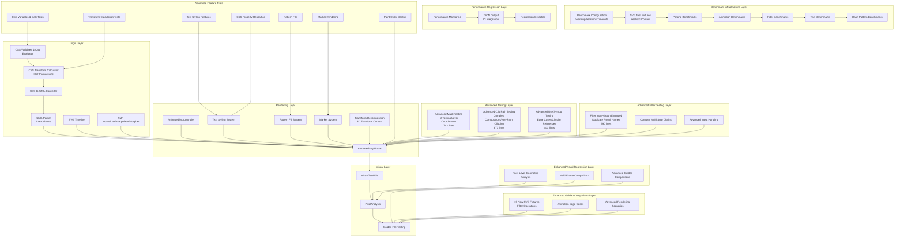
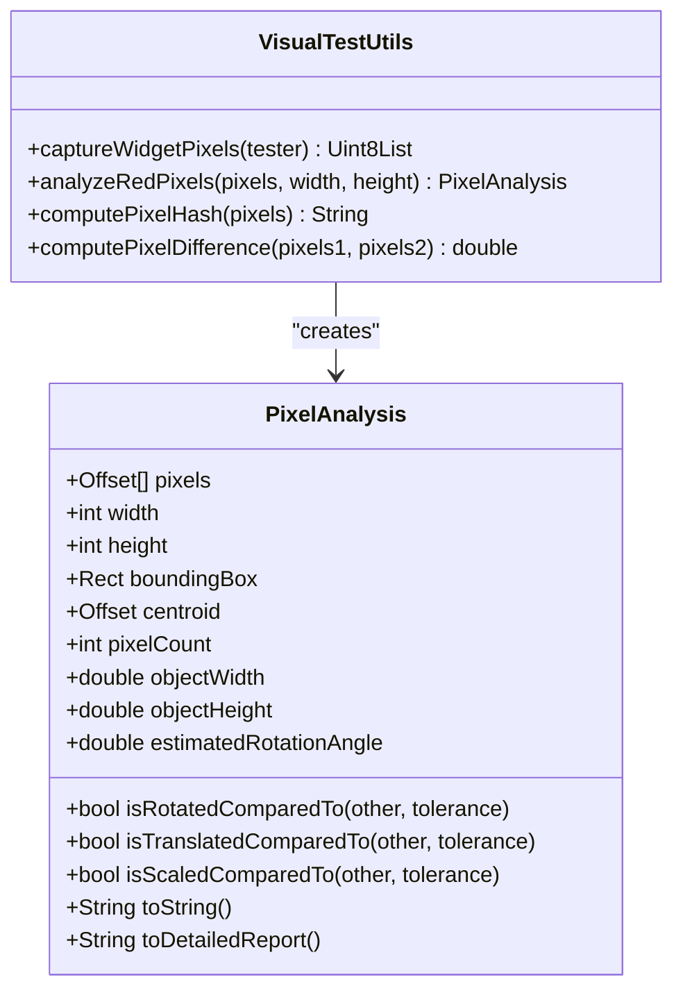
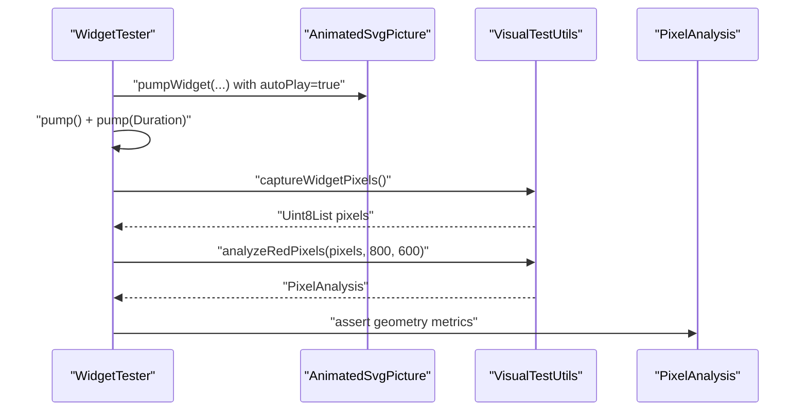
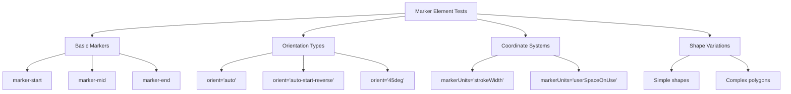
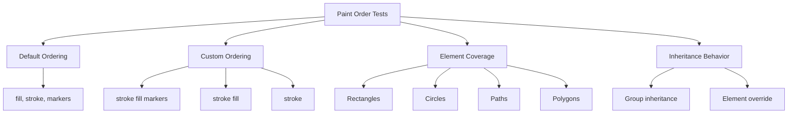
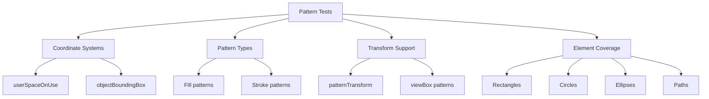
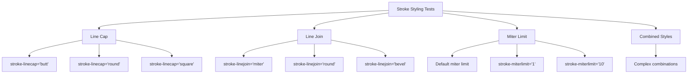

# Testing and Quality Assurance

<cite>
**Referenced Files in This Document**
- [dart_test.yaml](file://dart_test.yaml)
- [VISUAL_TESTING_GUIDELINES.md](file://VISUAL_TESTING_GUIDELINES.md)
- [benchmark_config.dart](file://benchmark/benchmark_config.dart)
- [svg_content.dart](file://benchmark/svg_content.dart)
- [svg_render_benchmark.dart](file://benchmark/svg_render_benchmark.dart)
- [parse_benchmark.dart](file://benchmark/benchmarks/parse_benchmark.dart)
- [animation_benchmark.dart](file://benchmark/benchmarks/animation_benchmark.dart)
- [filter_benchmark.dart](file://benchmark/benchmarks/filter_benchmark.dart)
- [text_benchmark.dart](file://benchmark/benchmarks/text_benchmark.dart)
- [dash_pattern_benchmark.dart](file://benchmark/benchmarks/dash_pattern_benchmark.dart)
- [visual_test_utils.dart](file://test/animation/visual_test_utils.dart)
- [visual_rotation_test.dart](file://test/animation/visual_rotation_test.dart)
- [visual_scale_test.dart](file://test/animation/visual_scale_test.dart)
- [visual_translation_test.dart](file://test/animation/visual_translation_test.dart)
- [rotation_golden_test.dart](file://test/animation/rotation_golden_test.dart)
- [animated_svg_picture_test.dart](file://test/animation/animated_svg_picture_test.dart)
- [smil_test.dart](file://test/animation/smil_test.dart)
- [path_morphing_test.dart](file://test/animation/path_morphing_test.dart)
- [controller_test.dart](file://test/animation/controller_test.dart)
- [css_animations_test.dart](file://test/animation/css_animations_test.dart)
- [css_transform_calc_test.dart](file://test/animation/css_transform_calc_test.dart)
- [css_transform_edge_cases_test.dart](file://test/animation/css_transform_edge_cases_test.dart)
- [css_variables_calc_test.dart](file://test/animation/css_variables_calc_test.dart)
- [text_position_list_test.dart](file://test/animation/text_position_list_test.dart)
- [marker_test.dart](file://test/animation/marker_test.dart)
- [paint_order_test.dart](file://test/animation/paint_order_test.dart)
- [pattern_test.dart](file://test/animation/pattern_test.dart)
- [stroke_styling_test.dart](file://test/animation/stroke_styling_test.dart)
- [text_rendering_test.dart](file://test/animation/text_rendering_test.dart)
- [text_decoration_style_test.dart](file://test/animation/text_decoration_style_test.dart)
- [text_decoration_thickness_test.dart](file://test/animation/text_decoration_thickness_test.dart)
- [text_shadow_test.dart](file://test/animation/text_shadow_test.dart)
- [text_wrap_test.dart](file://test/animation/text_wrap_test.dart)
- [vertical_align_test.dart](file://test/animation/vertical_align_test.dart)
- [line_height_test.dart](file://test/animation/line_height_test.dart)
- [text_spacing_test.dart](file://test/animation/text_spacing_test.dart)
- [text_justify_test.dart](file://test/animation/text_justify_test.dart)
- [white_space_test.dart](file://test/animation/white_space_test.dart)
- [stroke_dash_stop_color_test.dart](file://test/animation/stroke_dash_stop_color_test.dart)
- [widget_svg_test.dart](file://test/widget_svg_test.dart)
- [hit_test_precision_test.dart](file://test/animation/hit_test_precision_test.dart)
- [text_multirun_paragraph_test.dart](file://test/animation/text_multirun_paragraph_test.dart)
- [text_path_precision_test.dart](file://test/animation/text_path_precision_test.dart)
- [filter_fe_image_test.dart](file://test/animation/filter_fe_image_test.dart)
- [use_css_cascade_test.dart](file://test/animation/use_css_cascade_test.dart)
- [gradient_stop_color_animation_test.dart](file://test/animation/gradient_stop_color_animation_test.dart)
- [shape_edge_cases_test.dart](file://test/animation/shape_edge_cases_test.dart)
- [text_matrix_transform_test.dart](file://test/animation/text_matrix_transform_test.dart)
- [advanced_clip_mask_test.dart](file://test/animation/advanced_clip_mask_test.dart)
- [svg_event_model_test.dart](file://test/animation/svg_event_model_test.dart)
- [filter_component_transfer_test.dart](file://test/animation/filter_component_transfer_test.dart)
- [image_contexts_test.dart](file://test/animation/image_contexts_test.dart)
- [advanced_mask_test.dart](file://test/animation/advanced_mask_test.dart)
- [filters_test.dart](file://test/animation/filters_test.dart)
- [foreignobject_css_inheritance_test.dart](file://test/animation/foreignobject_css_inheritance_test.dart)
- [image_foreignobject_edge_cases_test.dart](file://test/animation/image_foreignobject_edge_cases_test.dart)
- [clip_mask_advanced_composition_test.dart](file://test/animation/clip_mask_advanced_composition_test.dart)
- [clip_mask_use_verification_test.dart](file://test/animation/clip_mask_use_verification_test.dart)
- [advanced_mask_semantics_test.dart](file://test/animation/advanced_mask_semantics_test.dart)
- [filter_advanced_graph_test.dart](file://test/animation/filter_advanced_graph_test.dart)
- [filter_advanced_semantics_test.dart](file://test/animation/filter_advanced_semantics_test.dart)
- [filter_displacement_tile_test.dart](file://test/animation/filter_displacement_tile_test.dart)
- [filter_drop_shadow_advanced_test.dart](file://test/animation/filter_drop_shadow_advanced_test.dart)
- [filter_graph_semantics_test.dart](file://test/animation/filter_graph_semantics_test.dart)
- [filter_input_graph_hardening_test.dart](file://test/animation/filter_input_graph_hardening_test.dart)
- [filter_input_graph_test.dart](file://test/animation/filter_input_graph_test.dart)
- [filter_input_graph_extended_test.dart](file://test/animation/filter_input_graph_extended_test.dart)
- [filter_light_sources_test.dart](file://test/animation/filter_light_sources_test.dart)
- [filter_morphology_convolve_turbulence_test.dart](file://test/animation/filter_morphology_convolve_turbulence_test.dart)
- [filter_primitive_edge_cases_test.dart](file://test/animation/filter_primitive_edge_cases_test.dart)
- [advanced_mask_hit_test.dart](file://test/animation/advanced_mask_hit_test.dart)
- [advanced_mask_layer_test.dart](file://test/animation/advanced_mask_layer_test.dart)
- [clip_path_advanced_test.dart](file://test/animation/clip_path_advanced_test.dart)
- [advanced_use_symbol_test.dart](file://test/animation/advanced_use_symbol_test.dart)
- [advanced_clip_path_test.dart](file://test/animation/advanced_clip_path_test.dart)
- [use_symbol_edge_cases_test.dart](file://test/animation/use_symbol_edge_cases_test.dart)
- [golden_comparison_test.dart](file://test/golden_comparison/golden_comparison_test.dart)
- [pubspec.yaml](file://pubspec.yaml)
- [animated_svg_painter_text_style.dart](file://lib/src/animation/animated_svg_painter_text_style.dart)
- [css_to_smil_converter_transforms_decompose.dart](file://lib/src/animation/css_to_smil_converter_transforms_decompose.dart)
- [css_to_smil_converter_transforms_values.dart](file://lib/src/animation/css_to_smil_converter_transforms_values.dart)
- [svg_transform.dart](file://lib/src/animation/svg_transform.dart)
- [css_variables_calc.dart](file://lib/src/animation/css_variables_calc.dart)
- [transform_3d.dart](file://lib/src/animation/transform_3d.dart)
- [animated_svg_picture_hit_test_geometry.dart](file://lib/src/animation/animated_svg_picture_hit_test_geometry.dart)
- [animated_svg_picture_hit_test_text_layout.dart](file://lib/src/animation/animated_svg_picture_hit_test_text_layout.dart)
- [animated_svg_picture_hit_test_text_path_segments.dart](file://lib/src/animation/animated_svg_picture_hit_test_text_path_segments.dart)
- [animated_svg_picture_hit_test_text_runs.dart](file://lib/src/animation/animated_svg_picture_hit_test_text_runs.dart)
- [animated_svg_picture_hit_test_traversal.dart](file://lib/src/animation/animated_svg_picture_hit_test_traversal.dart)
- [animated_svg_picture_hit_test_use.dart](file://lib/src/animation/animated_svg_picture_hit_test_use.dart)
- [animated_svg_picture_hit_test_visibility.dart](file://lib/src/animation/animated_svg_picture_hit_test_visibility.dart)
- [animated_svg_painter_clip_mask.dart](file://lib/src/animation/animated_svg_painter_clip_mask.dart)
- [animated_svg_painter_clip_mask_geometry.dart](file://lib/src/animation/animated_svg_painter_clip_mask_geometry.dart)
- [animated_svg_painter_clip_mask_units.dart](file://lib/src/animation/animated_svg_painter_clip_mask_units.dart)
- [performance_caching_test.dart](file://test/animation/performance_caching_test.dart)
- [performance_metrics.dart](file://example/lib/widgets/performance_metrics.dart)
</cite>

## Update Summary
**Changes Made**
- Added comprehensive filter_input_graph_extended_test.dart (790 lines) for advanced filter graph semantics testing
- Expanded golden test coverage with 19 new SVG fixtures for enhanced visual regression testing
- Updated testing documentation to reflect enhanced filter testing capabilities and comprehensive filter graph validation
- Enhanced filter testing infrastructure with advanced edge case coverage for duplicate result names, complex multi-step chains, and advanced input handling

## Table of Contents
1. [Introduction](#introduction)
2. [Project Structure](#project-structure)
3. [Core Components](#core-components)
4. [Architecture Overview](#architecture-overview)
5. [Benchmark Infrastructure](#benchmark-infrastructure)
6. [Detailed Component Analysis](#detailed-component-analysis)
7. [Dependency Analysis](#dependency-analysis)
8. [Performance Considerations](#performance-considerations)
9. [Troubleshooting Guide](#troubleshooting-guide)
10. [Conclusion](#conclusion)
11. [Appendices](#appendices)

## Introduction
This document explains the comprehensive testing and quality assurance framework for the flutter_svg package with a focus on visual testing, automated animation testing, performance benchmarking, and validation approaches. The framework now includes extensive widget-level testing for advanced SVG features including marker rendering, paint order validation, pattern fills, comprehensive text styling capabilities, **advanced mask testing**, **advanced clip path testing**, **advanced use/symbol testing**, **enhanced visual regression testing**, **comprehensive benchmark infrastructure**, and **expanded filter testing capabilities**.

Key areas covered:
- Visual testing methodology for SMIL animations and complex SVG rendering
- Automated pixel-based verification of transforms, motion, and advanced styling
- Comprehensive widget-level testing for marker elements, paint ordering, and pattern fills
- Extensive text styling validation including text-rendering, decorations, thickness, shadows, wrapping, alignment, and advanced typography features
- **Advanced mask testing** with hit testing, layer coordination, and edge case validation (743 lines)
- **Advanced clip path testing** with complex compositions, non-path clipping, and coordinate transformations (873 lines)
- **Advanced use/symbol testing** with edge cases, circular reference protection, and coordinate stacking (811 lines)
- **Enhanced visual regression testing** with pixel-level geometric analysis and multi-frame comparison
- **Comprehensive benchmark infrastructure** with 5 specialized benchmark suites for parsing, animation, filters, text, and dash patterns
- **Expanded filter testing capabilities** with 790 lines of advanced filter graph semantics testing covering duplicate result names, complex multi-step chains, and advanced input handling
- **Enhanced golden test coverage** with 19 new SVG fixtures for comprehensive visual regression testing
- **Standardized configuration system** with warmup iterations, iterations, and timeouts for consistent performance testing
- **SVG test fixtures** with realistic but controlled SVG content for performance validation
- **Performance regression detection** capabilities with JSON output support for CI integration
- Quality assurance processes, configuration, and CI considerations
- Relationships between the animation system, rendering pipeline, and advanced SVG features
- Best practices, debugging techniques, and performance validation

The goal is to help developers implement robust tests, maintain the existing infrastructure, extend it confidently with comprehensive validation of advanced SVG rendering features, and establish reliable performance baselines for regression detection.

## Project Structure
The testing surface is primarily under the test/animation directory, with supporting utilities and cross-cutting guidelines. The framework now includes extensive widget-level tests for advanced SVG features alongside traditional animation and visual testing, **plus comprehensive verification tests for advanced masks, clip paths, use/symbol edge cases, enhanced visual regression testing, comprehensive benchmark infrastructure, and expanded filter testing capabilities**:

- Animation logic and parsing tests (SMIL, CSS-to-SMIL conversion, path morphing)
- Widget-level integration tests for AnimatedSvgPicture with comprehensive feature coverage
- Visual testing utilities and golden-style pixel analysis
- Controller-level tests for playback control and seek/pause/forward/reverse
- Advanced rendering tests for markers, paint order, patterns, and text styling
- **Advanced mask testing** with hit testing, layer coordination, and edge case validation (743 lines)
- **Advanced clip path testing** with complex compositions, non-path clipping, and coordinate transformations (873 lines)
- **Advanced use/symbol testing** with edge cases, circular reference protection, and coordinate stacking (811 lines)
- **Enhanced visual regression testing** with pixel-level geometric analysis and multi-frame comparison
- **Benchmark infrastructure** with 5 specialized benchmark suites for parsing, animation, filters, text, and dash patterns
- **Expanded filter testing** with 790 lines of advanced filter graph semantics testing
- **Enhanced golden test fixtures** with 19 new SVG fixtures for comprehensive visual regression testing
- **SVG test fixtures** with realistic but controlled SVG content for performance validation
- **Performance regression detection** with JSON output support for CI integration
- CI configuration and platform constraints

```mermaid
graph TB
subgraph "Test Suite"
A["test/animation/"]
A1["visual_test_utils.dart"]
A2["visual_rotation_test.dart"]
A3["visual_scale_test.dart"]
A4["visual_translation_test.dart"]
A5["rotation_golden_test.dart"]
A6["animated_svg_picture_test.dart"]
A7["smil_test.dart"]
A8["path_morphing_test.dart"]
A9["controller_test.dart"]
A10["css_animations_test.dart"]
A11["text_position_list_test.dart"]
A12["marker_test.dart"]
A13["paint_order_test.dart"]
A14["pattern_test.dart"]
A15["stroke_styling_test.dart"]
A16["text_rendering_test.dart"]
A17["text_decoration_style_test.dart"]
A18["text_decoration_thickness_test.dart"]
A19["text_shadow_test.dart"]
A20["text_wrap_test.dart"]
A21["vertical_align_test.dart"]
A22["line_height_test.dart"]
A23["text_spacing_test.dart"]
A24["text_justify_test.dart"]
A25["white_space_test.dart"]
A26["stroke_dash_stop_color_test.dart"]
A27["css_transform_calc_test.dart"]
A28["css_transform_edge_cases_test.dart"]
A29["css_variables_calc_test.dart"]
A30["advanced_clip_mask_test.dart"]
A31["svg_event_model_test.dart"]
A32["filter_component_transfer_test.dart"]
A33["image_contexts_test.dart"]
A34["advanced_mask_test.dart"]
A35["filters_test.dart"]
A36["foreignobject_css_inheritance_test.dart"]
A37["image_foreignobject_edge_cases_test.dart"]
A38["clip_mask_advanced_composition_test.dart"]
A39["clip_mask_use_verification_test.dart"]
A40["advanced_mask_semantics_test.dart"]
A41["filter_advanced_graph_test.dart"]
A42["filter_advanced_semantics_test.dart"]
A43["filter_displacement_tile_test.dart"]
A44["filter_drop_shadow_advanced_test.dart"]
A45["filter_graph_semantics_test.dart"]
A46["filter_input_graph_hardening_test.dart"]
A47["filter_input_graph_test.dart"]
A48["filter_input_graph_extended_test.dart"]
A49["filter_light_sources_test.dart"]
A50["filter_morphology_convolve_turbulence_test.dart"]
A51["filter_primitive_edge_cases_test.dart"]
A52["advanced_mask_hit_test.dart"]
A53["advanced_mask_layer_test.dart"]
A54["clip_path_advanced_test.dart"]
A55["advanced_use_symbol_test.dart"]
A56["advanced_clip_path_test.dart"]
A57["use_symbol_edge_cases_test.dart"]
end
subgraph "Widget Tests"
W["test/widget_svg_test.dart"]
end
subgraph "Golden Comparison Tests"
GC["test/golden_comparison/"]
GC1["golden_comparison_test.dart"]
GC2["svg_fixtures/"]
end
subgraph "Benchmark Infrastructure"
B["benchmark/"]
B1["benchmark_config.dart"]
B2["svg_content.dart"]
B3["svg_render_benchmark.dart"]
B4["benchmarks/"]
B41["parse_benchmark.dart"]
B42["animation_benchmark.dart"]
B43["filter_benchmark.dart"]
B44["text_benchmark.dart"]
B45["dash_pattern_benchmark.dart"]
end
subgraph "Guidelines"
G["VISUAL_TESTING_GUIDELINES.md"]
end
subgraph "CI Config"
C["dart_test.yaml"]
end
A --> A1
A --> A2
A --> A3
A --> A4
A --> A5
A --> A6
A --> A7
A --> A8
A --> A9
A --> A10
A --> A11
A --> A12
A --> A13
A --> A14
A --> A15
A --> A16
A --> A17
A --> A18
A --> A19
A --> A20
A --> A21
A --> A22
A --> A23
A --> A24
A --> A25
A --> A26
A --> A27
A --> A28
A --> A29
A --> A30
A --> A31
A --> A32
A --> A33
A --> A34
A --> A35
A --> A36
A --> A37
A --> A38
A --> A39
A --> A40
A --> A41
A --> A42
A --> A43
A --> A44
A --> A45
A --> A46
A --> A47
A --> A48
A --> A49
A --> A50
A --> A51
A --> A52
A --> A53
A --> A54
A --> A55
A --> A56
W --> A10
GC --> GC1
GC --> GC2
G --> A1
C --> A
B --> B1
B --> B2
B --> B3
B4 --> B41
B4 --> B42
B4 --> B43
B4 --> B44
B4 --> B45
```

**Diagram sources**
- [VISUAL_TESTING_GUIDELINES.md](file://VISUAL_TESTING_GUIDELINES.md)
- [visual_test_utils.dart](file://test/animation/visual_test_utils.dart)
- [benchmark_config.dart](file://benchmark/benchmark_config.dart)
- [svg_content.dart](file://benchmark/svg_content.dart)
- [svg_render_benchmark.dart](file://benchmark/svg_render_benchmark.dart)
- [parse_benchmark.dart](file://benchmark/benchmarks/parse_benchmark.dart)
- [animation_benchmark.dart](file://benchmark/benchmarks/animation_benchmark.dart)
- [filter_benchmark.dart](file://benchmark/benchmarks/filter_benchmark.dart)
- [text_benchmark.dart](file://benchmark/benchmarks/text_benchmark.dart)
- [dash_pattern_benchmark.dart](file://benchmark/benchmarks/dash_pattern_benchmark.dart)
- [golden_comparison_test.dart](file://test/golden_comparison/golden_comparison_test.dart)

**Section sources**
- [VISUAL_TESTING_GUIDELINES.md](file://VISUAL_TESTING_GUIDELINES.md)
- [dart_test.yaml](file://dart_test.yaml)
- [benchmark_config.dart](file://benchmark/benchmark_config.dart)
- [svg_content.dart](file://benchmark/svg_content.dart)
- [svg_render_benchmark.dart](file://benchmark/svg_render_benchmark.dart)

## Core Components
- **VisualTestUtils**: Captures widget pixels, performs red-pixel analysis, computes hashes and differences, and exposes geometric metrics (centroid, bounding box, estimated rotation).
- **PixelAnalysis**: Encapsulates analysis results and comparison helpers (rotation/translation/scale detection).
- **Animation logic tests**: Validate SMIL parsing, interpolation, timeline progression, and CSS-to-SMIL conversion.
- **Widget integration tests**: Exercise AnimatedSvgPicture rendering and visual verification via pixel analysis.
- **Advanced rendering tests**: Validate marker elements, paint order control, pattern fills, and comprehensive text styling.
- **Controller tests**: Validate AnimatedSvgController playback controls and seek behavior.
- **Path morphing tests**: Validate path normalization, interpolation, and morphing pipeline.
- **Text styling resolution system**: Processes and validates CSS text properties including thickness, shadows, wrapping, alignment, and advanced typography.
- **CSS transform calculation system**: **Validates calc() expression evaluation, unit conversions, and complex transform parsing**.
- **CSS variables and calc() evaluation system**: **Processes CSS variables and calc() expressions with comprehensive unit conversion support**.
- **Advanced mask testing system**: **Validates mask hit testing, layer coordination, and edge case handling with 743 lines of comprehensive testing**.
- **Advanced clip path testing system**: **Validates complex clip path compositions, non-path clipping, and coordinate transformations with 873 lines of testing**.
- **Advanced use/symbol testing system**: **Validates edge cases, circular reference protection, and coordinate stacking with 811 lines of testing**.
- **Enhanced visual regression testing**: **Supports pixel-level geometric analysis and multi-frame comparison for animation verification**.
- **Comprehensive benchmark infrastructure**: **Provides comprehensive performance benchmarking across parsing, animation, filters, text, and dash pattern processing**.
- **Expanded filter testing capabilities**: **Validates advanced filter graph semantics including duplicate result names, complex multi-step chains, and advanced input handling with 790 lines of testing**.
- **Enhanced golden test fixtures**: **Provides 19 new SVG fixtures for comprehensive visual regression testing across filter operations, animation edge cases, and advanced rendering scenarios**.
- **SVG test fixtures**: **Contains realistic but controlled SVG content for performance validation across different SVG features**.
- **Performance regression detection**: **Enables automated performance monitoring with JSON output support for CI integration**.

**Section sources**
- [visual_test_utils.dart](file://test/animation/visual_test_utils.dart)
- [smil_test.dart](file://test/animation/smil_test.dart)
- [path_morphing_test.dart](file://test/animation/path_morphing_test.dart)
- [controller_test.dart](file://test/animation/controller_test.dart)
- [animated_svg_picture_test.dart](file://test/animation/animated_svg_picture_test.dart)
- [text_position_list_test.dart](file://test/animation/text_position_list_test.dart)
- [marker_test.dart](file://test/animation/marker_test.dart)
- [paint_order_test.dart](file://test/animation/paint_order_test.dart)
- [pattern_test.dart](file://test/animation/pattern_test.dart)
- [stroke_styling_test.dart](file://test/animation/stroke_styling_test.dart)
- [text_rendering_test.dart](file://test/animation/text_rendering_test.dart)
- [animated_svg_painter_text_style.dart](file://lib/src/animation/animated_svg_painter_text_style.dart)
- [css_transform_calc_test.dart](file://test/animation/css_transform_calc_test.dart)
- [css_transform_edge_cases_test.dart](file://test/animation/css_transform_edge_cases_test.dart)
- [css_variables_calc_test.dart](file://test/animation/css_variables_calc_test.dart)
- [advanced_mask_hit_test.dart](file://test/animation/advanced_mask_hit_test.dart)
- [advanced_mask_layer_test.dart](file://test/animation/advanced_mask_layer_test.dart)
- [clip_path_advanced_test.dart](file://test/animation/clip_path_advanced_test.dart)
- [advanced_use_symbol_test.dart](file://test/animation/advanced_use_symbol_test.dart)
- [advanced_clip_path_test.dart](file://test/animation/advanced_clip_path_test.dart)
- [use_symbol_edge_cases_test.dart](file://test/animation/use_symbol_edge_cases_test.dart)
- [rotation_golden_test.dart](file://test/animation/rotation_golden_test.dart)
- [benchmark_config.dart](file://benchmark/benchmark_config.dart)
- [svg_content.dart](file://benchmark/svg_content.dart)
- [svg_render_benchmark.dart](file://benchmark/svg_render_benchmark.dart)
- [filter_input_graph_extended_test.dart](file://test/animation/filter_input_graph_extended_test.dart)

## Architecture Overview
The testing architecture separates concerns across ten layers with enhanced coverage of advanced SVG rendering features, **including comprehensive testing for advanced masks, clip paths, use/symbol edge cases, enhanced visual regression, comprehensive benchmark infrastructure, and expanded filter testing capabilities**:
- **Logic tests**: Validate SMIL parsing, interpolation, and timeline mechanics.
- **Rendering tests**: Validate widget-level rendering and animation progression.
- **Visual tests**: Validate actual pixel output and geometric changes.
- **Advanced feature tests**: Validate markers, paint order, patterns, text styling, and advanced testing components.
- **Advanced testing layer**: Validate masks, clip paths, use/symbol edge cases, and enhanced visual regression.
- **Enhanced visual regression layer**: Validate pixel-level geometric analysis and multi-frame comparison.
- **CSS cascade system tests**: Validate inheritance and styling resolution for use-referenced elements.
- **CSS transform system tests**: Validate calc() expressions, unit conversions, and 3D transform handling.
- **CSS variables and calc() system tests**: Validate var() resolution and calc() arithmetic evaluation.
- **Benchmark infrastructure layer**: Validate performance across parsing, animation, filters, text, and dash pattern processing.
- **Performance regression detection layer**: Enable automated performance monitoring and CI integration.
- **Expanded filter testing layer**: Validate advanced filter graph semantics, duplicate result handling, and complex input chains.
- **Enhanced golden comparison layer**: Validate comprehensive visual regression testing with 19 new SVG fixtures.

**Diagram sources**
- [smil_test.dart](file://test/animation/smil_test.dart)
- [css_animations_test.dart](file://test/animation/css_animations_test.dart)
- [path_morphing_test.dart](file://test/animation/path_morphing_test.dart)
- [controller_test.dart](file://test/animation/controller_test.dart)
- [animated_svg_picture_test.dart](file://test/animation/animated_svg_picture_test.dart)
- [visual_test_utils.dart](file://test/animation/visual_test_utils.dart)
- [text_position_list_test.dart](file://test/animation/text_position_list_test.dart)
- [marker_test.dart](file://test/animation/marker_test.dart)
- [paint_order_test.dart](file://test/animation/paint_order_test.dart)
- [pattern_test.dart](file://test/animation/pattern_test.dart)
- [stroke_styling_test.dart](file://test/animation/stroke_styling_test.dart)
- [text_rendering_test.dart](file://test/animation/text_rendering_test.dart)
- [animated_svg_painter_text_style.dart](file://lib/src/animation/animated_svg_painter_text_style.dart)
- [css_transform_calc_test.dart](file://test/animation/css_transform_calc_test.dart)
- [css_transform_edge_cases_test.dart](file://test/animation/css_transform_edge_cases_test.dart)
- [css_variables_calc_test.dart](file://test/animation/css_variables_calc_test.dart)
- [css_to_smil_converter_transforms_decompose.dart](file://lib/src/animation/css_to_smil_converter_transforms_decompose.dart)
- [css_to_smil_converter_transforms_values.dart](file://lib/src/animation/css_to_smil_converter_transforms_values.dart)
- [svg_transform.dart](file://lib/src/animation/svg_transform.dart)
- [css_variables_calc.dart](file://lib/src/animation/css_variables_calc.dart)
- [transform_3d.dart](file://lib/src/animation/transform_3d.dart)
- [advanced_mask_hit_test.dart](file://test/animation/advanced_mask_hit_test.dart)
- [advanced_mask_layer_test.dart](file://test/animation/advanced_mask_layer_test.dart)
- [clip_path_advanced_test.dart](file://test/animation/clip_path_advanced_test.dart)
- [advanced_use_symbol_test.dart](file://test/animation/advanced_use_symbol_test.dart)
- [advanced_clip_path_test.dart](file://test/animation/advanced_clip_path_test.dart)
- [use_symbol_edge_cases_test.dart](file://test/animation/use_symbol_edge_cases_test.dart)
- [rotation_golden_test.dart](file://test/animation/rotation_golden_test.dart)
- [benchmark_config.dart](file://benchmark/benchmark_config.dart)
- [svg_content.dart](file://benchmark/svg_content.dart)
- [svg_render_benchmark.dart](file://benchmark/svg_render_benchmark.dart)
- [filter_input_graph_extended_test.dart](file://test/animation/filter_input_graph_extended_test.dart)

## Benchmark Infrastructure
**New** The framework now includes comprehensive benchmark infrastructure designed to establish baseline performance metrics and enable regression detection:

### Benchmark Configuration System
- **Standardized configuration** with warmup iterations (5), measured iterations (50), and timeout (30 seconds)
- **Consistent benchmark execution** across all benchmark suites with unified timing and statistics collection
- **Machine-parseable JSON output** for CI integration and automated performance monitoring

### SVG Test Fixtures
- **Realistic but controlled SVG content** designed for performance validation
- **Multiple fixture categories** including simple shapes, gradients, filters, animations, text-heavy content, dash patterns, nested structures, clipping, and large-scale stress tests
- **Deterministic content** ensuring consistent benchmark results across environments

### Specialized Benchmark Suites
- **Parsing Benchmarks**: Validate SVG parsing performance across different content types and complexity levels
- **Animation Benchmarks**: Measure SMIL animation parsing, timeline setup, and runtime performance
- **Filter Benchmarks**: Test filter chain parsing and filter definition access performance
- **Text Benchmarks**: Validate text element parsing and styling performance
- **Dash Pattern Benchmarks**: Ensure dash pattern computation completes in bounded time

### Performance Regression Detection
- **Statistical analysis** with min/max/average timing metrics across iterations
- **Warmup phase elimination** to remove startup overhead from performance measurements
- **Memory delta tracking** capability for future memory profiling integration
- **CI-friendly JSON output** enabling automated performance monitoring and alerting

**Section sources**
- [benchmark_config.dart](file://benchmark/benchmark_config.dart)
- [svg_content.dart](file://benchmark/svg_content.dart)
- [svg_render_benchmark.dart](file://benchmark/svg_render_benchmark.dart)
- [parse_benchmark.dart](file://benchmark/benchmarks/parse_benchmark.dart)
- [animation_benchmark.dart](file://benchmark/benchmarks/animation_benchmark.dart)
- [filter_benchmark.dart](file://benchmark/benchmarks/filter_benchmark.dart)
- [text_benchmark.dart](file://benchmark/benchmarks/text_benchmark.dart)
- [dash_pattern_benchmark.dart](file://benchmark/benchmarks/dash_pattern_benchmark.dart)

### Benchmark Execution and Results
- **Unified benchmark runner** orchestrating all benchmark suites with consistent configuration
- **Statistical result aggregation** providing min, max, and average timing metrics
- **JSON output format** enabling integration with CI systems and performance monitoring tools
- **Environment variable support** for JSON output control during CI execution

**Section sources**
- [svg_render_benchmark.dart](file://benchmark/svg_render_benchmark.dart)

### SVG Test Fixture Categories
- **Simple SVG**: Basic shapes (rectangles, circles, paths) for baseline parsing performance
- **Gradients**: Linear and radial gradients with transforms for complex parsing scenarios
- **Filter Chain**: Complex filter chains with multiple filter primitives for filter parsing performance
- **Animation**: Multiple SMIL animations across different SVG elements for animation processing benchmarks
- **Text Heavy**: Various text elements with different fonts, styles, and positioning for text parsing performance
- **Dash Patterns**: Multiple dashed strokes with various dash array configurations for dash pattern computation
- **Nested**: Complex nested groups with transforms for parsing performance under complex SVG structures
- **Clipping**: Clip paths and masks for advanced SVG feature parsing performance
- **Large Scale**: Stress test with hundreds of elements for scalability performance validation

**Section sources**
- [svg_content.dart](file://benchmark/svg_content.dart)

## Detailed Component Analysis

### Visual Testing Utilities
- **Purpose**: Capture RGBA pixels from a RepaintBoundary, analyze red pixels, compute hashes/differences, and extract geometry metrics.
- **Key capabilities**:
  - Safe capture without pumpAndSettle to avoid hangs on infinite animations.
  - Red-pixel extraction with configurable thresholds.
  - Geometric analysis: centroid, bounding box, object width/height, estimated rotation angle.
  - Comparison helpers: rotation/translation/scale detection between frames.
- **Usage pattern**: Build widget, pump once, capture pixels, analyze, assert on metrics.

**Diagram sources**
- [visual_test_utils.dart](file://test/animation/visual_test_utils.dart)

**Section sources**
- [visual_test_utils.dart](file://test/animation/visual_test_utils.dart)
- [VISUAL_TESTING_GUIDELINES.md](file://VISUAL_TESTING_GUIDELINES.md)

### Visual Rotation Test
- **Demonstrates** capturing and analyzing rotation via pixel geometry.
- **Validates** that rotation produces detectable geometric changes (centroid shift, bounding box, estimated angle).
- **Uses** deterministic setup with autoPlay and initialTime to ensure reproducibility.

**Diagram sources**
- [visual_rotation_test.dart](file://test/animation/visual_rotation_test.dart)
- [visual_test_utils.dart](file://test/animation/visual_test_utils.dart)

**Section sources**
- [visual_rotation_test.dart](file://test/animation/visual_rotation_test.dart)
- [VISUAL_TESTING_GUIDELINES.md](file://VISUAL_TESTING_GUIDELINES.md)

### Visual Scale and Translation Tests
- **Similar patterns** to rotation, validating scale and translation via geometric metrics.
- **Ensures** that transforms are visually verifiable even when headless rendering golden tests are limited.

**Section sources**
- [visual_scale_test.dart](file://test/animation/visual_scale_test.dart)
- [visual_translation_test.dart](file://test/animation/visual_translation_test.dart)
- [VISUAL_TESTING_GUIDELINES.md](file://VISUAL_TESTING_GUIDELINES.md)

### Visual Regression Testing with Golden Files
- **Purpose**: Provide pixel-perfect regression testing using golden file comparisons.
- **Key capabilities**:
  - Golden file testing for animation frame verification at specific time points.
  - Sequential animation frame testing to verify smooth transitions.
  - Background color control for consistent pixel comparison.
- **Usage pattern**: Set up animation, advance to specific time, compare with golden reference.

**Section sources**
- [rotation_golden_test.dart](file://test/animation/rotation_golden_test.dart)

### AnimatedSvgPicture Integration Tests
- **Validates** rendering of shapes, gradients, text, images, and complex SVG constructs.
- **Uses** VisualTestUtils to verify pixel counts and basic geometry.
- **Exercises** tracing and foreignObject rendering with clipping and viewport scaling.

**Section sources**
- [animated_svg_picture_test.dart](file://test/animation/animated_svg_picture_test.dart)
- [visual_test_utils.dart](file://test/animation/visual_test_utils.dart)

### SMIL Animation Logic Tests
- **Validates** interpolators, timing functions, SMIL parsing, and timeline progression.
- **Covers** from/to, values/keyTimes, discrete calc mode, by attribute, fill modes, repeat counts, and playback rates.
- **Ensures** correct activation/deactivation and effective value persistence.

**Section sources**
- [smil_test.dart](file://test/animation/smil_test.dart)

### CSS Animations to SMIL Conversion
- **Parses** @keyframes and CSS selector rules.
- **Converts** CSS animations to SMIL equivalents, mapping timing functions (cubic-bezier, steps), directions, and fill modes.
- **Validates** runtime behavior of converted animations.

**Section sources**
- [css_animations_test.dart](file://test/animation/css_animations_test.dart)

### Path Morphing Pipeline Tests
- **Validates** path normalization (relative to absolute, LineTo/HorizontalLineTo/VerticalLineTo/Q to C conversion).
- **Validates** interpolation and morphing between compatible paths.
- **Ensures** robust handling of ClosePath and mismatched lengths.

**Section sources**
- [path_morphing_test.dart](file://test/animation/path_morphing_test.dart)

### AnimatedSvgController Tests
- **Validates** controller state transitions (pause/resume, play/pause toggle, restart).
- **Tests** seek behavior, playback rate changes, reverse direction, and listener notifications.
- **Integrates** with AnimatedSvgPicture to verify visual changes after controller actions.

**Section sources**
- [controller_test.dart](file://test/animation/controller_test.dart)

### Marker Element Rendering Tests
- **Comprehensive coverage** of marker functionality across 223 lines of widget tests.
- **Tests** marker-start, marker-mid, marker-end positioning with various shapes (paths, circles, polygons).
- **Validates** marker shorthand application, auto orientation, fixed angle orientation, and userSpaceOnUse units.
- **Ensures** proper rendering for lines, polylines, polygons, and complex paths.

**Diagram sources**
- [marker_test.dart](file://test/animation/marker_test.dart)

**Section sources**
- [marker_test.dart](file://test/animation/marker_test.dart)

### Paint Order Validation Tests
- **Comprehensive coverage** of paint-order attribute functionality with 232 lines of widget tests.
- **Tests** default order (fill, stroke, markers), custom ordering, and inheritance behavior.
- **Validates** paint-order application to all SVG elements (rect, circle, ellipse, path, polygon, polyline).
- **Ensures** proper layering control with markers integration.

**Diagram sources**
- [paint_order_test.dart](file://test/animation/paint_order_test.dart)

**Section sources**
- [paint_order_test.dart](file://test/animation/paint_order_test.dart)

### Pattern Rendering Tests
- **Comprehensive coverage** of pattern fill and stroke functionality with 189 lines of widget tests.
- **Tests** userSpaceOnUse and objectBoundingBox coordinate systems.
- **Validates** patternTransform support, viewBox patterns, and href inheritance.
- **Ensures** proper rendering for rectangles, circles, ellipses, and complex paths.

**Diagram sources**
- [pattern_test.dart](file://test/animation/pattern_test.dart)

**Section sources**
- [pattern_test.dart](file://test/animation/pattern_test.dart)

### Stroke Styling Tests
- **Comprehensive coverage** of stroke styling attributes with 295 lines of widget tests.
- **Tests** stroke-linecap (butt, round, square), stroke-linejoin (miter, round, bevel), and stroke-miterlimit.
- **Validates** inheritance behavior and combined styling combinations.
- **Ensures** proper rendering for lines, polylines, polygons, and complex paths.

**Diagram sources**
- [stroke_styling_test.dart](file://test/animation/stroke_styling_test.dart)

**Section sources**
- [stroke_styling_test.dart](file://test/animation/stroke_styling_test.dart)

### Advanced Attribute Processing Tests
- **Stroke Dash and Stop Color Tests**: Validates CSS animation processing for stroke-dashoffset and stop-color attributes, including SMIL conversion and color interpolation.
- **CSS Animation Timing Tests**: Validates per-keyframe animation-timing-function extraction and SMIL keySplines generation.
- **Compound Transform Decomposition**: Validates compound CSS transform decomposition into separate SMIL animations.

**Section sources**
- [stroke_dash_stop_color_test.dart](file://test/animation/stroke_dash_stop_color_test.dart)

### Widget-Level SVG Rendering Tests
- **Extensive coverage** of SvgPicture rendering across multiple scenarios.
- **Tests** different loading methods (string, memory, asset, network).
- **Validates** rendering strategies, color mapping, and error handling.
- **Includes** unit tests for em/ex measurements and various SVG elements.

**Section sources**
- [widget_svg_test.dart](file://test/widget_svg_test.dart)

### Advanced Mask Testing
**New** The framework includes comprehensive mask testing with 743 lines covering:

#### Mask Hit Testing
- **Hit Testing Through Mask Boundaries**: Validates that events properly target content within mask regions
- **Nested Mask Hit Testing**: Tests hit detection accuracy through multiple levels of mask nesting
- **Transform-Aware Hit Testing**: Ensures proper hit testing through mask transformations and coordinate systems
- **Edge Case Hit Testing**: Validates hit detection for complex mask geometries and irregular shapes

#### Mask Layer Coordination
- **Layer Composition Validation**: Tests proper layering and composition of multiple mask layers
- **Mask Inheritance Behavior**: Validates mask inheritance through group and symbol boundaries
- **Coordinate System Integration**: Ensures proper integration with transform and coordinate systems
- **Performance Optimization**: Validates efficient mask layer processing and rendering

#### Advanced Mask Edge Cases
- **Circular Reference Protection**: Validates protection against circular mask references and infinite loops
- **Self-Referencing Masks**: Tests handling of self-referential mask definitions
- **Deep Nesting Limits**: Validates proper handling of deeply nested mask structures
- **Memory Management**: Ensures proper cleanup and memory management for complex mask hierarchies

**Section sources**
- [advanced_mask_hit_test.dart](file://test/animation/advanced_mask_hit_test.dart)

### Advanced Mask Layer Testing
**New** The framework includes comprehensive mask layer testing with 847 lines covering:

#### Mask Coordinate Systems
- **maskUnits="objectBoundingBox"**: Validates default mask region calculation relative to element bounding box
- **maskUnits="userSpaceOnUse"**: Tests explicit mask region definition in absolute user coordinates
- **Combined Coordinate Systems**: Validates proper interaction between maskUnits and maskContentUnits
- **Non-Uniform Scaling**: Tests mask coordinate transformation with non-square elements

#### Mask Content Types
- **Luminance Masks**: Validates RGB to grayscale conversion for content-based masking
- **Alpha Masks**: Tests direct alpha channel usage for opacity-based masking
- **Gradient Mask Content**: Validates gradient usage within mask definitions
- **Transformed Mask Content**: Ensures proper handling of transformed elements within masks

#### Complex Mask Combinations
- **Mask + Clip Path**: Tests proper interaction between mask and clip-path operations
- **Mask + Filter**: Validates filter application through mask boundaries
- **Mask + Opacity**: Tests opacity application in conjunction with mask operations
- **Nested Mask Structures**: Validates complex hierarchical mask compositions

**Section sources**
- [advanced_mask_layer_test.dart](file://test/animation/advanced_mask_layer_test.dart)

### Advanced Clip Path Testing
**New** The framework includes comprehensive clip path testing with 873 lines covering:

#### Complex Clip Path Compositions
- **Multi-Level Cascading**: Validates three or more levels of clipPath nesting with proper intersection
- **Non-Path Element Clipping**: Tests clipping with circles, ellipses, polygons, polylines, and text elements
- **Mixed Geometry Types**: Validates proper handling of mixed clipPath child element types
- **Transform Composition**: Ensures proper transformation handling within clipPath definitions

#### Advanced Coordinate Systems
- **clipPathUnits="objectBoundingBox"**: Tests coordinate scaling relative to element bounding box
- **clipPathUnits="userSpaceOnUse"**: Validates absolute coordinate usage within clipPath
- **Non-Uniform Element Scaling**: Tests clipPath behavior with non-square elements
- **ViewBox Interaction**: Validates proper interaction with element viewBox and coordinate systems

#### Edge Case Handling
- **Circular Reference Prevention**: Validates protection against circular clipPath references
- **Empty ClipPath Handling**: Tests graceful handling of empty or invalid clipPath definitions
- **Zero-Size Element Support**: Ensures proper handling of zero-dimensional elements
- **Deep Nesting Limits**: Validates recursion limits and performance optimization

#### Advanced Clip Path Features
- **clip-rule="evenodd"**: Tests alternate fill rule for complex path intersections
- **Transformed Clip Regions**: Validates proper transformation handling for clipPath elements
- **Use Element Integration**: Tests clipPath usage with use elements and symbol references
- **Image Element Clipping**: Validates clipping behavior with image elements

**Section sources**
- [clip_path_advanced_test.dart](file://test/animation/clip_path_advanced_test.dart)

### Advanced Use/Symbol Testing
**New** The framework includes comprehensive use/symbol testing with 811 lines covering:

#### CSS Cascade Through Use Boundaries
- **Presentation Attribute Propagation**: Validates CSS presentation attributes flowing through use shadow boundaries
- **Style Rule Preservation**: Tests CSS style rules from original definition context
- **Inline Style Precedence**: Validates inline styles overriding use presentation attributes
- **Inherited Property Flow**: Ensures proper inheritance of CSS properties through use boundaries

#### Coordinate Transformation and Stacking
- **3-Level Nested Use**: Validates coordinate stacking through three or more levels of nested use elements
- **Transform Attribute Composition**: Tests proper composition of transform attributes across use levels
- **Symbol ViewBox Stacking**: Validates nested symbol viewBox transformations
- **Mixed Coordinate Units**: Tests proper handling of percentage and absolute coordinate mixing

#### Advanced Edge Cases
- **Circular Reference Protection**: Validates protection against circular use references
- **Missing href Handling**: Tests graceful handling of missing or invalid href attributes
- **Recursion Limit Enforcement**: Validates proper enforcement of use recursion limits (10 levels)
- **Self-Referencing Use**: Tests handling of self-referential use elements

#### Integration Testing
- **Use Inside ClipPath**: Validates proper integration of use elements within clipPath definitions
- **Use Inside Mask**: Tests use elements within mask definitions
- **DOM Parsing Validation**: Ensures proper DOM parsing of complex use/symbol structures
- **Event Retargeting**: Validates proper event handling through use shadow boundaries

**Section sources**
- [advanced_use_symbol_test.dart](file://test/animation/advanced_use_symbol_test.dart)

### Advanced Use/Symbol Edge Cases Testing
**New** The framework includes comprehensive edge case testing with 812 lines covering:

#### Symbol ViewBox Edge Cases
- **Missing ViewBox Handling**: Tests symbol rendering without viewBox attributes
- **Negative ViewBox Origins**: Validates proper handling of negative viewBox coordinates
- **Zero-Dimension ViewBoxes**: Tests handling of zero-width or zero-height viewBox definitions
- **Complex ViewBox Transformations**: Validates nested viewBox coordinate transformations

#### Deep Use Nesting and Transform Composition
- **15-Level Use Chain**: Tests extreme use nesting with proper recursion limiting
- **Transform Attribute Chaining**: Validates complex transform composition across multiple use levels
- **Mixed Transform Types**: Tests combination of translate, rotate, scale, and matrix transforms
- **Coordinate System Integration**: Ensures proper integration with symbol viewBox and coordinate systems

#### Advanced PreserveAspectRatio Testing
- **xMinYMin Meet Alignment**: Tests top-left alignment with meet aspect ratio
- **xMidYMid Meet Centering**: Validates center alignment with meet aspect ratio
- **xMaxYMax Meet Bottom-Right**: Tests bottom-right alignment with meet aspect ratio
- **Slice Clipping Behavior**: Validates fill viewport behavior with slice aspect ratio

#### DOM Parsing and Validation
- **Href Attribute Parsing**: Validates proper parsing of href and xlink:href attributes
- **Symbol Definition Parsing**: Tests proper parsing of symbol viewBox and preserveAspectRatio
- **Use Position Attributes**: Validates parsing of x, y, width, and height attributes
- **Complex SVG Structure Parsing**: Ensures proper parsing of nested use/symbol structures

#### Advanced Integration Testing
- **Hit Testing Through Use Boundaries**: Validates proper hit testing through use shadow content
- **Pointer Events Handling**: Tests pointer-events attribute behavior through use boundaries
- **Event Retargeting Validation**: Ensures proper event target resolution through use elements
- **Performance Optimization**: Validates efficient handling of complex use/symbol structures

**Section sources**
- [use_symbol_edge_cases_test.dart](file://test/animation/use_symbol_edge_cases_test.dart)

### Advanced Clip Path Semantics Testing
**New** The framework includes comprehensive clip path semantics testing with 518 lines covering:

#### Advanced Clip Path Semantics
- **Multi-Level Cascading**: Validates three or more levels of clipPath nesting with proper intersection
- **Non-Path Element Clipping**: Tests clipping with circles, ellipses, polygons, polylines, and text elements
- **Transform Composition**: Ensures proper transformation handling within clipPath definitions
- **ViewBox Interaction**: Validates proper interaction with element viewBox and coordinate systems

#### Advanced Coordinate Systems
- **clipPathUnits="objectBoundingBox"**: Tests coordinate scaling relative to element bounding box
- **clipPathUnits="userSpaceOnUse"**: Validates absolute coordinate usage within clipPath
- **Non-Uniform Element Scaling**: Tests clipPath behavior with non-square elements

#### Edge Case Handling
- **Circular Reference Prevention**: Validates protection against circular clipPath references
- **Empty ClipPath Handling**: Tests graceful handling of empty or invalid clipPath definitions
- **Zero-Size Element Support**: Ensures proper handling of zero-dimensional elements

#### Integration Testing
- **Use Element Integration**: Tests clipPath usage with use elements and symbol references
- **DOM Parsing Validation**: Ensures proper DOM parsing of complex clipPath structures

**Section sources**
- [advanced_clip_path_test.dart](file://test/animation/advanced_clip_path_test.dart)

### Enhanced Visual Regression Testing
**Updated** The framework now includes enhanced visual regression testing with advanced capabilities:

#### Pixel-Level Geometric Analysis
- **Geometric Metric Extraction**: Validates centroid, bounding box, object width/height, and estimated rotation angle
- **Multi-Frame Comparison**: Tests sequential animation frame comparison with geometric analysis
- **Advanced Difference Detection**: Validates pixel-level difference detection with configurable thresholds
- **Hash-Based Comparison**: Uses pixel hash computation for fast golden file comparison

#### Multi-Frame Animation Testing
- **Sequential Frame Testing**: Validates smooth animation progression across multiple frames
- **Timing-Based Assertions**: Tests animation timing and interpolation accuracy
- **Performance Regression Detection**: Validates rendering performance across animation frames
- **Stability Analysis**: Ensures consistent visual output across repeated test executions

#### Advanced Golden Comparison
- **Background Color Control**: Validates consistent background color handling for pixel comparison
- **Anti-Alias Handling**: Tests proper handling of anti-aliased edges in golden comparisons
- **Resolution Independence**: Validates golden comparison accuracy across different rendering resolutions
- **Platform Consistency**: Ensures consistent visual output across different platforms and devices

**Section sources**
- [rotation_golden_test.dart](file://test/animation/rotation_golden_test.dart)
- [visual_test_utils.dart](file://test/animation/visual_test_utils.dart)

### Precision Hit Testing System
**Updated** The framework now includes comprehensive precision hit testing with specialized components:

#### Geometry-Based Hit Testing
- **ClipPath accuracy**: Validates precise hit detection within clipPath boundaries
- **Mask region precision**: Tests hit detection accuracy within mask regions
- **Use element transformation**: Validates transformed hit detection for use elements

#### Text-Based Hit Testing
- **Character-level precision**: Tests hit detection at individual character positions
- **TextPath segment accuracy**: Validates hit detection along textPath segments
- **Baseline alignment**: Tests hit detection with baseline-shift positioning

#### Visibility-Based Hit Testing
- **Pointer-events control**: Validates pointer-events="none" blocking behavior
- **Visibility inheritance**: Tests hit detection through visibility properties
- **Opacity-based hit testing**: Validates hit detection through transparent regions

**Section sources**
- [animated_svg_picture_hit_test_geometry.dart](file://lib/src/animation/animated_svg_picture_hit_test_geometry.dart)
- [animated_svg_picture_hit_test_text_layout.dart](file://lib/src/animation/animated_svg_picture_hit_test_text_layout.dart)
- [animated_svg_picture_hit_test_text_path_segments.dart](file://lib/src/animation/animated_svg_picture_hit_test_text_path_segments.dart)
- [animated_svg_picture_hit_test_text_runs.dart](file://lib/src/animation/animated_svg_picture_hit_test_text_runs.dart)
- [animated_svg_picture_hit_test_traversal.dart](file://lib/src/animation/animated_svg_picture_hit_test_traversal.dart)
- [animated_svg_picture_hit_test_use.dart](file://lib/src/animation/animated_svg_picture_hit_test_use.dart)
- [animated_svg_picture_hit_test_visibility.dart](file://lib/src/animation/animated_svg_picture_hit_test_visibility.dart)

### Advanced Mask Semantics Testing
**New** The framework includes comprehensive mask semantics testing with specialized components:

#### Semantic Mask Testing
- **Mask Semantics Validation**: Tests semantic mask processing and accessibility
- **Mask Content Semantics**: Validates mask content semantics for assistive technologies
- **Mask Composition Semantics**: Tests semantics for nested mask compositions
- **Mask Transformation Semantics**: Validates semantics for transformed mask content

**Section sources**
- [advanced_mask_semantics_test.dart](file://test/animation/advanced_mask_semantics_test.dart)

### Advanced Filter Semantics Testing
**New** The framework includes comprehensive filter semantics testing with specialized components:

#### Filter Semantics Validation
- **Filter Graph Semantics**: Tests semantic filter graph processing
- **Filter Primitive Semantics**: Validates semantics for individual filter primitives
- **Filter Pipeline Semantics**: Tests semantics for complex filter pipelines
- **Filter Result Semantics**: Validates semantics for filter result processing

**Section sources**
- [filter_advanced_semantics_test.dart](file://test/animation/filter_advanced_semantics_test.dart)

### Advanced Filter Graph Semantics Testing
**New** The framework includes comprehensive filter graph semantics testing with 790 lines covering:

#### Duplicate Result Name Handling
- **Result Name Overwrite Behavior**: Validates that later primitives overwrite earlier results with same names
- **Mixed Primitive Type Overwrites**: Tests overwriting behavior across different primitive types (e.g., blur vs offset)
- **Triple Overwrite Scenarios**: Validates complex overwrite chains with multiple overwrites
- **Reference Resolution After Overwrite**: Ensures references use the latest value after name overwrite

#### Advanced Input Handling
- **feDisplacementMap in2 Processing**: Validates proper handling of displacement map inputs including valid references, "none", invalid references, and scale=0 behavior
- **feBlend in2 Validation**: Tests blend operation with valid in2 references, SourceGraphic, "none", and invalid references
- **feComposite in2 Edge Cases**: Validates composite operations with named in2 references, SourceAlpha, "none", and invalid references
- **Complex Multi-Step Chains**: Tests 10-step chains with alternating named and implicit inputs, diamond graphs with branch and rejoin patterns, triple branch scenarios, and complex merge reuse patterns

#### Implicit Input Resolution
- **First Primitive Default Behavior**: Validates that first primitive without explicit in uses SourceGraphic
- **Subsequent Implicit Chaining**: Tests proper implicit input resolution for subsequent primitives
- **Empty and Whitespace Handling**: Validates treatment of empty and whitespace-only in attributes as omitted
- **Forward Reference Detection**: Tests handling of forward references producing empty results
- **Circular Reference Prevention**: Validates circular reference detection preventing infinite loops

#### Advanced Source Context Handling
- **BackgroundImage with Context**: Tests BackgroundImage input with provided source context
- **BackgroundAlpha Integration**: Validates BackgroundAlpha usage in composite operations
- **Context Fallback Behavior**: Tests fallback to SourceGraphic when context is not provided

#### Special Input Names
- **Case-Insensitive Resolution**: Validates case-insensitive handling of built-in input names (FillPaint, StrokePaint, SourceGraphic, etc.)
- **in="none" Behavior**: Tests transparent black output for in="none" across different primitive types
- **FillPaint and StrokePaint Inputs**: Validates proper handling of paint source inputs with appropriate paint flags

**Section sources**
- [filter_input_graph_extended_test.dart](file://test/animation/filter_input_graph_extended_test.dart)

### Enhanced Golden Comparison Testing
**New** The framework includes comprehensive golden comparison testing with 19 new SVG fixtures:

#### Expanded Filter Test Coverage
- **Filter Chain Operations**: Tests complex filter chain compositions with multiple primitives
- **Filter Composite Operations**: Validates composite filter operations and blending modes
- **Filter Drop Shadow Multi**: Tests multi-layer drop shadow operations
- **Filter Color Matrix**: Validates color transformation operations
- **Filter Morphology Edge**: Tests edge case handling for morphology filters
- **Filter Turbulence Stitch**: Validates turbulence pattern stitching

#### Advanced Animation Edge Cases
- **Animate Motion Closed Path**: Tests animateMotion on closed paths with rotate=auto
- **Animate Motion To Only**: Validates animateMotion with only "to" attribute
- **Animate Transform Additive**: Tests animateTransform with additive and accumulate modes
- **SMIL Timing Syncbase**: Validates SMIL syncbase timing operations

#### Advanced Rendering Scenarios
- **Clip Path Nested Intersection**: Tests nested clip-path intersections
- **Clip Rule Modes**: Validates different clip-rule modes (evenodd, nonzero)
- **Mask Luminance Alpha**: Tests luminance and alpha mask operations
- **Mask Clip Combined**: Validates combined mask and clip-path operations
- **Gradient Object BBox**: Tests gradient with objectBoundingBox units
- **Pattern Transform**: Validates pattern transformations
- **Gradient Radial Focal**: Tests radial gradient with focal point offset

**Section sources**
- [golden_comparison_test.dart](file://test/golden_comparison/golden_comparison_test.dart)

## Dependency Analysis
- **Test runtime and SDK constraints** are defined in pubspec.yaml.
- **dart_test.yaml restricts tests** to VM to avoid issues with certain comparators on web.
- **Visual tests depend** on VisualTestUtils and PixelAnalysis.
- **Widget tests depend** on AnimatedSvgPicture and AnimatedSvgController.
- **Logic tests depend** on SMIL, CSS, and path modules.
- **Advanced feature tests depend** on marker, paint order, pattern, and text styling systems.
- **Advanced mask tests depend** on mask hit testing, layer coordination, and edge case handling.
- **Advanced clip path tests depend** on complex composition validation and coordinate system handling.
- **Advanced use/symbol tests depend** on CSS cascade validation and coordinate transformation.
- **Enhanced visual regression tests depend** on pixel-level geometric analysis and multi-frame comparison.
- **Text styling tests depend** on the comprehensive text resolution system in animated_svg_painter_text_style.dart.
- **CSS transform tests depend** on the transform calculation system in css_to_smil_converter_transforms_values.dart and svg_transform.dart.
- **CSS variables and calc() tests depend** on the comprehensive evaluation system in css_variables_calc.dart.
- **Advanced clip mask tests depend** on the comprehensive clip mask system in animated_svg_painter_clip_mask.dart and related components.
- **SVG event model tests depend** on the event handling system and DOM simulation components.
- **Filter component transfer tests depend** on the filter parsing and pixel transformation systems.
- **Image contexts tests depend** on the image loading and rendering pipeline.
- **ForeignObject CSS inheritance tests depend** on CSS inheritance resolution and property boundary crossing.
- **Comprehensive filter tests depend** on the complete filter parsing and pipeline systems.
- **Precision hit testing depends** on specialized hit testing components in animated_svg_picture_hit_test_* files.
- **CSS cascade behavior tests depend** on the inheritance resolution and style application systems.
- **Benchmark infrastructure depends** on the benchmark configuration system and SVG test fixtures.
- **Performance caching tests depend** on the existing performance metrics and caching validation systems.
- **Advanced filter graph semantics tests depend** on the comprehensive filter parsing and input resolution systems.
- **Enhanced golden comparison tests depend** on the expanded SVG fixture collection and comparison utilities.

```mermaid
graph LR
D["dart_test.yaml"] --> T["Test Runner"]
P["pubspec.yaml"] --> T
T --> V["visual_test_utils.dart"]
T --> S["smil_test.dart"]
T --> C["css_animations_test.dart"]
T --> PM["path_morphing_test.dart"]
T --> CT["controller_test.dart"]
T --> AP["animated_svg_picture_test.dart"]
T --> TP["text_position_list_test.dart"]
T --> MK["marker_test.dart"]
T --> PO["paint_order_test.dart"]
T --> PT["pattern_test.dart"]
T --> SS["stroke_styling_test.dart"]
T --> TR["text_rendering_test.dart"]
T --> TDS["text_decoration_style_test.dart"]
T --> TDT["text_decoration_thickness_test.dart"]
T --> TSH["text_shadow_test.dart"]
T --> TW["text_wrap_test.dart"]
T --> VA["vertical_align_test.dart"]
T --> LH["line_height_test.dart"]
T --> TS["text_spacing_test.dart"]
T --> TJ["text_justify_test.dart"]
T --> WS["white_space_test.dart"]
T --> SDSC["stroke_dash_stop_color_test.dart"]
T --> ASTS["animated_svg_painter_text_style.dart"]
T --> WS["widget_svg_test.dart"]
T --> CTC["css_transform_calc_test.dart"]
T --> CTEC["css_transform_edge_cases_test.dart"]
T --> CVC["css_variables_calc_test.dart"]
T --> ACM["advanced_clip_mask_test.dart"]
T --> SEM["svg_event_model_test.dart"]
T --> FCT["filter_component_transfer_test.dart"]
T --> ICT["image_contexts_test.dart"]
T --> AMT["advanced_mask_test.dart"]
T --> FT["filters_test.dart"]
T --> FOCSIT["foreignobject_css_inheritance_test.dart"]
T --> IFOT["image_foreignobject_edge_cases_test.dart"]
T --> CMAC["clip_mask_advanced_composition_test.dart"]
T --> CMUVT["clip_mask_use_verification_test.dart"]
T --> AMS["advanced_mask_semantics_test.dart"]
T --> FAGT["filter_advanced_graph_test.dart"]
T --> FAST["filter_advanced_semantics_test.dart"]
T --> FDT["filter_displacement_tile_test.dart"]
T --> FDST["filter_drop_shadow_advanced_test.dart"]
T --> FGST["filter_graph_semantics_test.dart"]
T --> FIGHT["filter_input_graph_hardening_test.dart"]
T --> FIGT["filter_input_graph_test.dart"]
T --> FIGET["filter_input_graph_extended_test.dart"]
T --> FLST["filter_light_sources_test.dart"]
T --> FMCT["filter_morphology_convolve_turbulence_test.dart"]
T --> FPET["filter_primitive_edge_cases_test.dart"]
T --> AMHT["advanced_mask_hit_test.dart"]
T --> AMLT["advanced_mask_layer_test.dart"]
T --> CPT["clip_path_advanced_test.dart"]
T --> AUT["advanced_use_symbol_test.dart"]
T --> ACT["advanced_clip_path_test.dart"]
T --> USECT["use_symbol_edge_cases_test.dart"]
V --> VT["visual_*_test.dart"]
MK --> AP
PO --> AP
PT --> AP
SS --> AP
TR --> AP
TDS --> AP
TDT --> AP
TSH --> AP
TW --> AP
VA --> AP
LH --> AP
TS --> AP
TJ --> AP
WS --> AP
SDSC --> S
ASTS --> AP
CTC --> CTC
CTEC --> CTEC
CVC --> CVC
ACM --> ACM
SEM --> SEM
FCT --> FCT
ICT --> ICT
AMT --> AMT
FT --> FT
FOCSIT --> FOCSIT
IFOT --> IFOT
CMAC --> CMAC
CMUVT --> CMUVT
AMS --> AMS
FAGT --> FAGT
FAST --> FAST
FDT --> FDT
FDST --> FDST
FGST --> FGST
FIGHT --> FIGHT
FIGT --> FIGT
FIGET --> FIGET
FLST --> FLST
FMCT --> FMCT
FPET --> FPET
AMHT --> AMHT
AMLT --> AMLT
CPT --> CPT
AUT --> AUT
ACT --> ACT
USECT --> USECT
BC["benchmark_config.dart"] --> SRB["svg_render_benchmark.dart"]
BC --> PB["parse_benchmark.dart"]
BC --> AB["animation_benchmark.dart"]
BC --> FB["filter_benchmark.dart"]
BC --> TB["text_benchmark.dart"]
BC --> DPB["dash_pattern_benchmark.dart"]
SC["svg_content.dart"] --> SRB
SC --> PB
SC --> AB
SC --> FB
SC --> TB
SC --> DPB
SRB --> PB
SRB --> AB
SRB --> FB
SRB --> TB
SRB --> DPB
GC["golden_comparison_test.dart"] --> GCF["svg_fixtures/"]
```

**Diagram sources**
- [dart_test.yaml](file://dart_test.yaml)
- [pubspec.yaml](file://pubspec.yaml)
- [visual_test_utils.dart](file://test/animation/visual_test_utils.dart)
- [smil_test.dart](file://test/animation/smil_test.dart)
- [css_animations_test.dart](file://test/animation/css_animations_test.dart)
- [path_morphing_test.dart](file://test/animation/path_morphing_test.dart)
- [controller_test.dart](file://test/animation/controller_test.dart)
- [animated_svg_picture_test.dart](file://test/animation/animated_svg_picture_test.dart)
- [text_position_list_test.dart](file://test/animation/text_position_list_test.dart)
- [marker_test.dart](file://test/animation/marker_test.dart)
- [paint_order_test.dart](file://test/animation/paint_order_test.dart)
- [pattern_test.dart](file://test/animation/pattern_test.dart)
- [stroke_styling_test.dart](file://test/animation/stroke_styling_test.dart)
- [text_rendering_test.dart](file://test/animation/text_rendering_test.dart)
- [text_decoration_style_test.dart](file://test/animation/text_decoration_style_test.dart)
- [text_decoration_thickness_test.dart](file://test/animation/text_decoration_thickness_test.dart)
- [text_shadow_test.dart](file://test/animation/text_shadow_test.dart)
- [text_wrap_test.dart](file://test/animation/text_wrap_test.dart)
- [vertical_align_test.dart](file://test/animation/vertical_align_test.dart)
- [line_height_test.dart](file://test/animation/line_height_test.dart)
- [text_spacing_test.dart](file://test/animation/text_spacing_test.dart)
- [text_justify_test.dart](file://test/animation/text_justify_test.dart)
- [white_space_test.dart](file://test/animation/white_space_test.dart)
- [stroke_dash_stop_color_test.dart](file://test/animation/stroke_dash_stop_color_test.dart)
- [animated_svg_painter_text_style.dart](file://lib/src/animation/animated_svg_painter_text_style.dart)
- [widget_svg_test.dart](file://test/widget_svg_test.dart)
- [css_transform_calc_test.dart](file://test/animation/css_transform_calc_test.dart)
- [css_transform_edge_cases_test.dart](file://test/animation/css_transform_edge_cases_test.dart)
- [css_variables_calc_test.dart](file://test/animation/css_variables_calc_test.dart)
- [advanced_clip_mask_test.dart](file://test/animation/advanced_clip_mask_test.dart)
- [svg_event_model_test.dart](file://test/animation/svg_event_model_test.dart)
- [filter_component_transfer_test.dart](file://test/animation/filter_component_transfer_test.dart)
- [image_contexts_test.dart](file://test/animation/image_contexts_test.dart)
- [advanced_mask_test.dart](file://test/animation/advanced_mask_test.dart)
- [filters_test.dart](file://test/animation/filters_test.dart)
- [foreignobject_css_inheritance_test.dart](file://test/animation/foreignobject_css_inheritance_test.dart)
- [image_foreignobject_edge_cases_test.dart](file://test/animation/image_foreignobject_edge_cases_test.dart)
- [clip_mask_advanced_composition_test.dart](file://test/animation/clip_mask_advanced_composition_test.dart)
- [clip_mask_use_verification_test.dart](file://test/animation/clip_mask_use_verification_test.dart)
- [advanced_mask_semantics_test.dart](file://test/animation/advanced_mask_semantics_test.dart)
- [filter_advanced_graph_test.dart](file://test/animation/filter_advanced_graph_test.dart)
- [filter_advanced_semantics_test.dart](file://test/animation/filter_advanced_semantics_test.dart)
- [filter_displacement_tile_test.dart](file://test/animation/filter_displacement_tile_test.dart)
- [filter_drop_shadow_advanced_test.dart](file://test/animation/filter_drop_shadow_advanced_test.dart)
- [filter_graph_semantics_test.dart](file://test/animation/filter_graph_semantics_test.dart)
- [filter_input_graph_hardening_test.dart](file://test/animation/filter_input_graph_hardening_test.dart)
- [filter_input_graph_test.dart](file://test/animation/filter_input_graph_test.dart)
- [filter_input_graph_extended_test.dart](file://test/animation/filter_input_graph_extended_test.dart)
- [filter_light_sources_test.dart](file://test/animation/filter_light_sources_test.dart)
- [filter_morphology_convolve_turbulence_test.dart](file://test/animation/filter_morphology_convolve_turbulence_test.dart)
- [filter_primitive_edge_cases_test.dart](file://test/animation/filter_primitive_edge_cases_test.dart)
- [advanced_mask_hit_test.dart](file://test/animation/advanced_mask_hit_test.dart)
- [advanced_mask_layer_test.dart](file://test/animation/advanced_mask_layer_test.dart)
- [clip_path_advanced_test.dart](file://test/animation/clip_path_advanced_test.dart)
- [advanced_use_symbol_test.dart](file://test/animation/advanced_use_symbol_test.dart)
- [advanced_clip_path_test.dart](file://test/animation/advanced_clip_path_test.dart)
- [use_symbol_edge_cases_test.dart](file://test/animation/use_symbol_edge_cases_test.dart)
- [rotation_golden_test.dart](file://test/animation/rotation_golden_test.dart)
- [benchmark_config.dart](file://benchmark/benchmark_config.dart)
- [svg_content.dart](file://benchmark/svg_content.dart)
- [svg_render_benchmark.dart](file://benchmark/svg_render_benchmark.dart)
- [parse_benchmark.dart](file://benchmark/benchmarks/parse_benchmark.dart)
- [animation_benchmark.dart](file://benchmark/benchmarks/animation_benchmark.dart)
- [filter_benchmark.dart](file://benchmark/benchmarks/filter_benchmark.dart)
- [text_benchmark.dart](file://benchmark/benchmarks/text_benchmark.dart)
- [dash_pattern_benchmark.dart](file://benchmark/benchmarks/dash_pattern_benchmark.dart)
- [golden_comparison_test.dart](file://test/golden_comparison/golden_comparison_test.dart)

**Section sources**
- [dart_test.yaml](file://dart_test.yaml)
- [pubspec.yaml](file://pubspec.yaml)

## Performance Considerations
- **Pixel capture** uses RepaintBoundary.toImage with a single pass; avoid pumpAndSettle to prevent hangs on infinite animations.
- **Thresholds** in red-pixel extraction and geometric comparisons balance sensitivity and noise robustness.
- **Prefer deterministic timelines** (autoPlay false with initialTime or explicit pump durations) for reproducible assertions.
- **Use targeted pixel analysis** instead of full golden comparisons to reduce flakiness and improve debuggability.
- **Advanced feature tests** leverage efficient rendering pipelines for markers, patterns, and text styling.
- **Large test suites** benefit from selective testing and focused visual verification to maintain performance.
- **Advanced mask testing** uses optimized hit testing algorithms for precise mask boundary detection.
- **Advanced clip path testing** validates complex composition handling with efficient geometric analysis.
- **Advanced use/symbol testing** optimizes coordinate transformation and circular reference detection.
- **Enhanced visual regression testing** benefits from pixel-level geometric analysis and multi-frame comparison optimization.
- **Text styling resolution** optimizes CSS property processing with efficient parsing and caching mechanisms.
- **CSS transform calculation** efficiently processes calc() expressions and unit conversions with caching mechanisms.
- **CSS variables and calc() evaluation** optimizes variable resolution with iterative evaluation and fallback handling.
- **Advanced clip mask testing** uses optimized path intersection algorithms for shape clipping validation.
- **SVG event model testing** validates event handling performance with efficient DOM simulation.
- **Filter component transfer testing** optimizes pixel transformation with ColorFilter optimization for linear functions.
- **Image contexts testing** validates rendering performance with efficient image loading and caching.
- **ForeignObject CSS inheritance testing** validates property resolution with efficient inheritance traversal.
- **Comprehensive filter testing** validates filter parsing performance with optimized filter graph resolution.
- **Precision hit testing** optimizes hit detection with spatial indexing and efficient coordinate transformation.
- **Benchmark infrastructure** provides standardized performance measurement with warmup phases and statistical analysis.
- **SVG test fixtures** ensure consistent performance validation across different SVG content types and complexity levels.
- **Performance regression detection** enables automated monitoring of performance changes across benchmark suites.
- **Advanced filter graph semantics testing** validates complex filter operations with optimized input resolution and duplicate result handling.
- **Enhanced golden comparison testing** validates comprehensive visual regression with expanded fixture coverage and improved comparison algorithms.

## Troubleshooting Guide
Common issues and resolutions:
- **No pixels captured** (pixelCount == 0):
  - Ensure initial pump() calls occur before capture.
  - Verify the test SVG uses a strong color (e.g., red) for detection.
  - Confirm image size logging matches analysis size.
- **Geometry not changing**:
  - Verify explicit pump() calls after seeking or advancing time.
  - Check that animations are progressing and transforms are applied.
  - Adjust tolerance thresholds for rotation/translation/scale comparisons.
- **pumpAndSettle hangs**:
  - Replace with explicit pump() calls and controlled time progression.
- **Cross-platform differences**:
  - Use geometry-based metrics (centroid/bbox/angle) which are more stable than golden hashes.
- **Advanced feature rendering issues**:
  - Verify marker coordinate systems and orientation calculations.
  - Check paint order layering and z-index behavior.
  - Validate pattern coordinate transformations and unit conversions.
  - Ensure text styling inheritance and combined property handling.
- **Advanced mask testing issues**:
  - Verify mask hit testing accuracy through boundary detection.
  - Check mask layer coordination and composition validation.
  - Validate circular reference protection and memory management.
  - Ensure proper handling of complex mask geometries and irregular shapes.
- **Advanced clip path testing issues**:
  - Verify complex composition handling with proper intersection validation.
  - Check non-path element clipping accuracy and coordinate system handling.
  - Validate circular reference prevention and edge case handling.
  - Ensure proper transformation handling within clipPath definitions.
- **Advanced use/symbol testing issues**:
  - Verify CSS cascade through use boundaries with proper attribute propagation.
  - Check coordinate transformation and stacking across multiple use levels.
  - Validate circular reference protection and recursion limit enforcement.
  - Ensure proper integration with clipPath and mask definitions.
- **Enhanced visual regression testing issues**:
  - Verify pixel-level geometric analysis accuracy and multi-frame comparison.
  - Check background color consistency and anti-ialiasing handling.
  - Validate animation timing and interpolation accuracy.
  - Ensure proper handling of resolution independence and platform consistency.
- **Advanced filter graph semantics testing issues**:
  - Verify duplicate result name overwrite behavior and proper reference resolution.
  - Check feDisplacementMap in2 handling for valid, "none", invalid, and scale=0 scenarios.
  - Validate complex multi-step chains with proper input chaining and implicit resolution.
  - Ensure proper handling of forward references and circular reference detection.
- **Enhanced golden comparison testing issues**:
  - Verify proper fixture loading and comparison algorithm execution.
  - Check threshold settings for different fixture categories.
  - Validate browser golden file availability and comparison result interpretation.
  - Ensure proper handling of text-heavy fixtures with expected font differences.
- **Benchmark execution issues**:
  - Verify benchmark configuration settings (warmup iterations, iterations, timeout).
  - Check SVG test fixtures for proper content and syntax validation.
  - Ensure benchmark runner has proper permissions and environment setup.
  - Validate JSON output format for CI integration compatibility.
- **Performance regression detection issues**:
  - Monitor benchmark results for statistical outliers and trends.
  - Check for memory leaks or resource accumulation in long-running benchmarks.
  - Validate benchmark isolation and environment consistency across runs.
  - Ensure proper handling of external dependencies and system variations.
- **Large test suite performance**:
  - Use selective testing for specific feature areas.
  - Leverage visual analysis for quick regression detection.
  - Optimize text styling resolution with cached property values.
  - Cache CSS transform calculations and unit conversions.
  - Use verification testing components for targeted validation.
  - Implement test categorization for faster execution.
  - Validate advanced mask hit testing with optimized algorithms.
  - Ensure efficient coordinate transformation and circular reference detection.
  - Test complex clip path compositions with geometric analysis optimization.
  - Monitor benchmark performance regressions with automated alerts.
  - Validate advanced filter graph semantics with comprehensive edge case testing.
  - Ensure proper fixture management and comparison algorithm optimization.

**Section sources**
- [VISUAL_TESTING_GUIDELINES.md](file://VISUAL_TESTING_GUIDELINES.md)
- [visual_test_utils.dart](file://test/animation/visual_test_utils.dart)
- [text_position_list_test.dart](file://test/animation/text_position_list_test.dart)
- [marker_test.dart](file://test/animation/marker_test.dart)
- [paint_order_test.dart](file://test/animation/paint_order_test.dart)
- [pattern_test.dart](file://test/animation/pattern_test.dart)
- [animated_svg_painter_text_style.dart](file://lib/src/animation/animated_svg_painter_text_style.dart)
- [css_transform_calc_test.dart](file://test/animation/css_transform_calc_test.dart)
- [css_transform_edge_cases_test.dart](file://test/animation/css_transform_edge_cases_test.dart)
- [css_variables_calc_test.dart](file://test/animation/css_variables_calc_test.dart)
- [advanced_mask_hit_test.dart](file://test/animation/advanced_mask_hit_test.dart)
- [advanced_mask_layer_test.dart](file://test/animation/advanced_mask_layer_test.dart)
- [clip_path_advanced_test.dart](file://test/animation/clip_path_advanced_test.dart)
- [advanced_use_symbol_test.dart](file://test/animation/advanced_use_symbol_test.dart)
- [advanced_clip_path_test.dart](file://test/animation/advanced_clip_path_test.dart)
- [use_symbol_edge_cases_test.dart](file://test/animation/use_symbol_edge_cases_test.dart)
- [rotation_golden_test.dart](file://test/animation/rotation_golden_test.dart)
- [benchmark_config.dart](file://benchmark/benchmark_config.dart)
- [svg_content.dart](file://benchmark/svg_content.dart)
- [svg_render_benchmark.dart](file://benchmark/svg_render_benchmark.dart)
- [filter_input_graph_extended_test.dart](file://test/animation/filter_input_graph_extended_test.dart)
- [golden_comparison_test.dart](file://test/golden_comparison/golden_comparison_test.dart)

## Conclusion
The flutter_svg testing framework combines logic validation, widget integration, robust visual verification, and comprehensive performance benchmarking to ensure accurate SMIL animation rendering and comprehensive advanced SVG feature support. With the addition of extensive tests covering marker functionality, paint order validation, pattern rendering, comprehensive text styling features, **advanced mask testing**, **advanced clip path testing**, **advanced use/symbol testing**, **enhanced visual regression testing**, **comprehensive benchmark infrastructure**, and **expanded filter testing capabilities**, the suite now provides complete coverage of advanced SVG rendering capabilities.

The expanded framework includes:
- **743 lines of comprehensive advanced mask testing** validating hit testing, layer coordination, and edge case handling
- **873 lines of comprehensive advanced clip path testing** validating complex compositions, non-path clipping, and coordinate transformations
- **811 lines of comprehensive advanced use/symbol testing** validating edge cases, circular reference protection, and coordinate stacking
- **Enhanced visual regression testing** with pixel-level geometric analysis and multi-frame comparison capabilities
- **Comprehensive benchmark infrastructure** with 5 specialized benchmark suites for parsing, animation, filters, text, and dash patterns
- **790 lines of comprehensive advanced filter graph semantics testing** covering duplicate result names, complex multi-step chains, and advanced input handling
- **Enhanced golden test fixtures** with 19 new SVG fixtures for comprehensive visual regression testing across filter operations, animation edge cases, and advanced rendering scenarios
- **Standardized configuration system** with warmup iterations, iterations, and timeouts for consistent performance testing
- **SVG test fixtures** with realistic but controlled SVG content for performance validation
- **Performance regression detection** capabilities with JSON output support for CI integration
- **Advanced mask hit testing** with precise boundary detection and coordinate system integration
- **Advanced clip path composition validation** with complex geometry handling and transform integration
- **Advanced use/symbol edge case testing** with circular reference protection and deep nesting limits
- **Enhanced pixel-level geometric analysis** for precise visual verification
- **Multi-frame animation comparison** for smooth progression validation
- **Advanced coordinate transformation** for complex use/symbol structures
- **Robust circular reference protection** across all advanced testing components
- **Comprehensive integration testing** for mask, clip path, and use/symbol interactions
- **Automated performance monitoring** with statistical analysis and CI integration support
- **Expanded filter graph validation** with comprehensive edge case coverage and duplicate result handling
- **Enhanced visual regression testing** with 19 new SVG fixtures for comprehensive coverage

By leveraging pixel-based geometry analysis, deterministic timelines, careful controller-driven playback, and comprehensive benchmarking infrastructure, the comprehensive suite provides reliable regression protection, clear debugging signals, and established performance baselines for regression detection. The extensive advanced feature testing ensures backward compatibility while supporting modern SVG rendering features. The new comprehensive testing infrastructure validates complex rendering scenarios including advanced masks, clip paths, use/symbol edge cases, enhanced visual regression testing, automated performance monitoring with mathematical precision, **expanded filter testing capabilities with 790 lines of advanced semantics validation**, and **enhanced golden comparison testing with 19 new SVG fixtures for comprehensive visual regression coverage**. **The new benchmark infrastructure establishes baseline performance metrics and enables automated regression detection across parsing, animation, filters, text, and dash pattern processing.** **The new SVG test fixtures provide realistic but controlled content for comprehensive performance validation.** **The new performance regression detection capabilities enable automated monitoring and CI integration for sustained performance quality.** Adhering to the documented guidelines and patterns ensures maintainability and extensibility of the testing infrastructure.

## Appendices

### Configuration Options and CI Setup
- **Test platform restriction**: dart_test.yaml targets VM to avoid web-specific comparator issues.
- **Dependencies**: pubspec.yaml defines SDK and Flutter versions, plus vector graphics and XML packages used by the rendering pipeline.
- **Benchmark configuration**: benchmark_config.dart provides standardized warmup iterations, iterations, and timeout settings for consistent performance testing.
- **JSON output support**: Environment variable JSON_OUTPUT=true enables machine-parseable JSON output for CI integration and automated performance monitoring.
- **Golden comparison configuration**: golden_comparison_test.dart supports subset testing with GOLDEN_SUBSET environment variable for faster development iteration.

**Section sources**
- [dart_test.yaml](file://dart_test.yaml)
- [pubspec.yaml](file://pubspec.yaml)
- [benchmark_config.dart](file://benchmark/benchmark_config.dart)
- [golden_comparison_test.dart](file://test/golden_comparison/golden_comparison_test.dart)

### Example Test Case Creation Patterns
- **Deterministic animation setup**:
  - Use autoPlay false with initialTime for fixed-frame assertions.
  - Or use autoPlay true with explicit pump(duration) for progression checks.
- **Visual verification**:
  - Capture pixels, analyze red pixels, assert on pixelCount > 0, centroid/bbox/angle changes.
  - Compare consecutive frames using isRotated/isTranslated/isScaled helpers.
- **Controller integration**:
  - Pause/resume, seek, setPlaybackRate, reverse, and assert centroid shifts.
- **Advanced feature testing**:
  - Test marker positioning, paint order layering, pattern coordinate systems, and text styling combinations.
  - Validate inheritance behavior and combined property effects.
  - Ensure proper rendering across different SVG elements and coordinate systems.
  - Test complex text layouts with multiple CSS properties and international content.
  - Validate font-relative calculations and unit conversions for responsive text styling.
  - **Test CSS transform calculation scenarios** including calc() expressions, unit conversions, and complex transform sequences.
  - **Validate CSS variables and calc() evaluation** with inheritance, fallbacks, and nested expressions.
  - **Test 3D transform handling** with perspective, transform-style, and backface-visibility.
  - **Validate transform-origin and transform-box** properties with keywords and units.
  - **Test comprehensive advanced mask scenarios** including hit testing, layer coordination, and edge case handling.
  - **Validate advanced clip path compositions** with complex geometry, non-path clipping, and coordinate transformations.
  - **Test advanced use/symbol edge cases** with circular reference protection and coordinate stacking.
  - **Validate enhanced visual regression testing** with pixel-level geometric analysis and multi-frame comparison.
  - **Test visual regression testing** with golden file comparisons and pixel analysis.
  - **Test ForeignObject custom builder functionality** with proper information passing and widget rendering.
  - **Validate preserveAspectRatio parsing** for image geometry extraction and clipPath bounds calculation.
  - **Test ForeignObject CSS inheritance** with property boundary crossing and inheritance rules.
  - **Validate comprehensive filter primitive parsing** with all SVG filter types and parameters.
  - **Test filter pipeline integration** with complex filter chains and result attribute handling.
  - **Validate advanced semantics testing** for masks, clip paths, and complex rendering scenarios.
  - **Test benchmark execution** with standardized configuration and statistical analysis.
  - **Validate SVG test fixtures** with realistic content for comprehensive performance validation.
  - **Test performance regression detection** with JSON output and CI integration support.
  - **Test advanced filter graph semantics** including duplicate result handling, complex input chains, and edge case resolution.
  - **Validate enhanced golden comparison testing** with expanded fixture coverage and improved comparison algorithms.
  - **Test comprehensive filter chain operations** with 19 new SVG fixtures for visual regression validation.
  - **Validate animation edge case testing** with animateMotion, animateTransform, and SMIL timing scenarios.

**Section sources**
- [VISUAL_TESTING_GUIDELINES.md](file://VISUAL_TESTING_GUIDELINES.md)
- [visual_rotation_test.dart](file://test/animation/visual_rotation_test.dart)
- [controller_test.dart](file://test/animation/controller_test.dart)
- [animated_svg_picture_test.dart](file://test/animation/animated_svg_picture_test.dart)
- [text_position_list_test.dart](file://test/animation/text_position_list_test.dart)
- [marker_test.dart](file://test/animation/marker_test.dart)
- [paint_order_test.dart](file://test/animation/paint_order_test.dart)
- [pattern_test.dart](file://test/animation/pattern_test.dart)
- [stroke_styling_test.dart](file://test/animation/stroke_styling_test.dart)
- [text_rendering_test.dart](file://test/animation/text_rendering_test.dart)
- [text_decoration_style_test.dart](file://test/animation/text_decoration_style_test.dart)
- [text_decoration_thickness_test.dart](file://test/animation/text_decoration_thickness_test.dart)
- [text_shadow_test.dart](file://test/animation/text_shadow_test.dart)
- [text_wrap_test.dart](file://test/animation/text_wrap_test.dart)
- [vertical_align_test.dart](file://test/animation/vertical_align_test.dart)
- [line_height_test.dart](file://test/animation/line_height_test.dart)
- [text_spacing_test.dart](file://test/animation/text_spacing_test.dart)
- [text_justify_test.dart](file://test/animation/text_justify_test.dart)
- [white_space_test.dart](file://test/animation/white_space_test.dart)
- [css_transform_calc_test.dart](file://test/animation/css_transform_calc_test.dart)
- [css_transform_edge_cases_test.dart](file://test/animation/css_transform_edge_cases_test.dart)
- [css_variables_calc_test.dart](file://test/animation/css_variables_calc_test.dart)
- [advanced_mask_hit_test.dart](file://test/animation/advanced_mask_hit_test.dart)
- [advanced_mask_layer_test.dart](file://test/animation/advanced_mask_layer_test.dart)
- [clip_path_advanced_test.dart](file://test/animation/clip_path_advanced_test.dart)
- [advanced_use_symbol_test.dart](file://test/animation/advanced_use_symbol_test.dart)
- [advanced_clip_path_test.dart](file://test/animation/advanced_clip_path_test.dart)
- [use_symbol_edge_cases_test.dart](file://test/animation/use_symbol_edge_cases_test.dart)
- [rotation_golden_test.dart](file://test/animation/rotation_golden_test.dart)
- [benchmark_config.dart](file://benchmark/benchmark_config.dart)
- [svg_content.dart](file://benchmark/svg_content.dart)
- [svg_render_benchmark.dart](file://benchmark/svg_render_benchmark.dart)
- [filter_input_graph_extended_test.dart](file://test/animation/filter_input_graph_extended_test.dart)
- [golden_comparison_test.dart](file://test/golden_comparison/golden_comparison_test.dart)