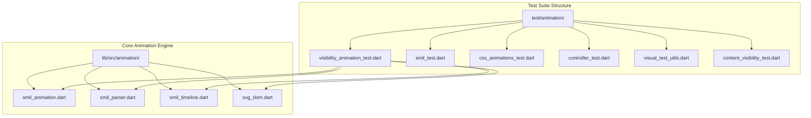
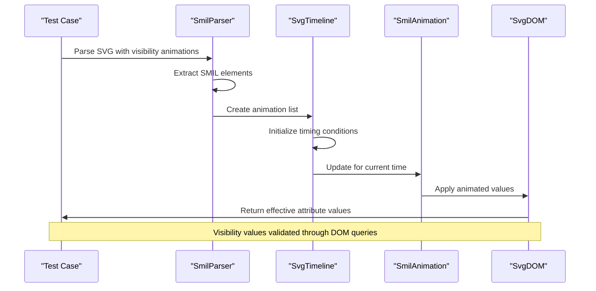
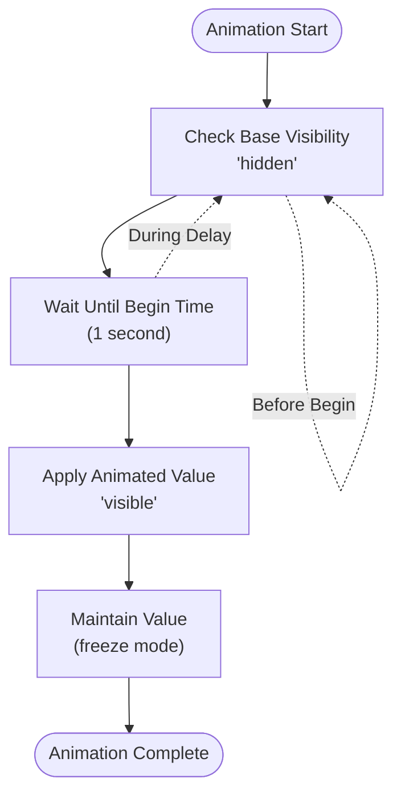
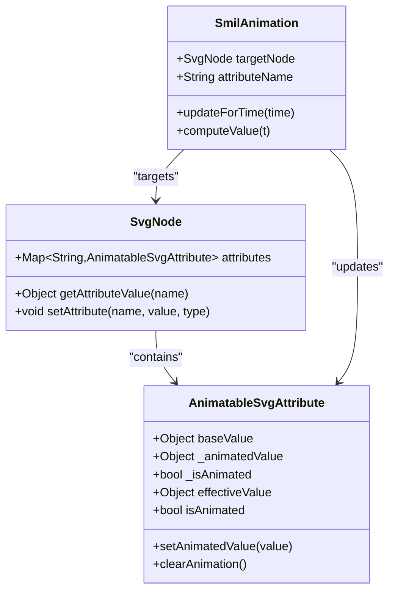
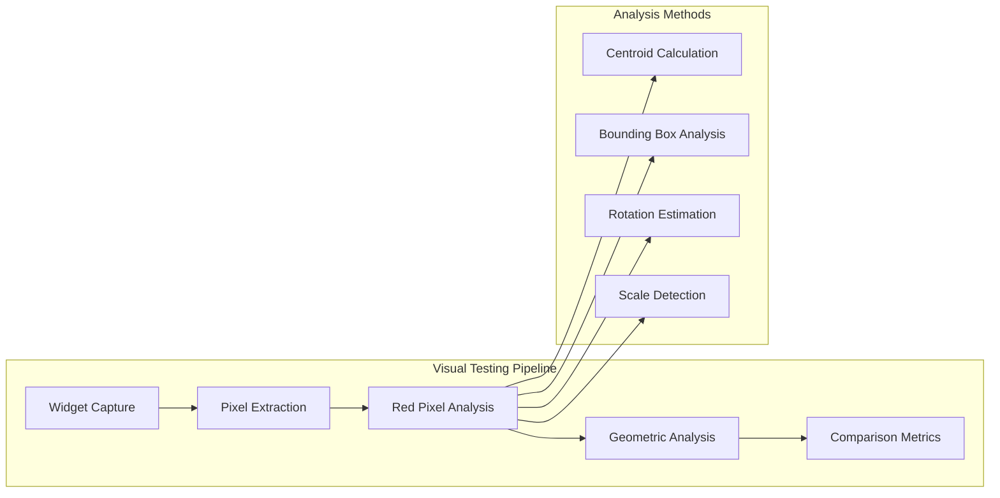
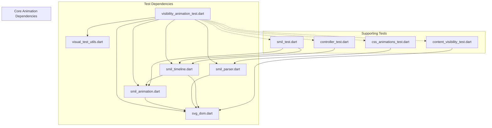

# Visibility Animation Test Suite

<cite>
**Referenced Files in This Document**
- [visibility_animation_test.dart](file://test/animation/visibility_animation_test.dart)
- [smil_animation.dart](file://lib/src/animation/smil/smil_animation.dart)
- [smil_parser.dart](file://lib/src/animation/smil/smil_parser.dart)
- [smil_timeline.dart](file://lib/src/animation/smil/smil_timeline.dart)
- [svg_dom.dart](file://lib/src/animation/svg_dom.dart)
- [visual_test_utils.dart](file://test/animation/visual_test_utils.dart)
- [ANIMATION.md](file://ANIMATION.md)
- [ARCHITECTURE.md](file://ARCHITECTURE.md)
- [smil_test.dart](file://test/animation/smil_test.dart)
- [css_animations_test.dart](file://test/animation/css_animations_test.dart)
- [controller_test.dart](file://test/animation/controller_test.dart)
- [content_visibility_test.dart](file://test/animation/content_visibility_test.dart)
</cite>

## Table of Contents
1. [Introduction](#introduction)
2. [Project Structure](#project-structure)
3. [Core Components](#core-components)
4. [Architecture Overview](#architecture-overview)
5. [Detailed Component Analysis](#detailed-component-analysis)
6. [Dependency Analysis](#dependency-analysis)
7. [Performance Considerations](#performance-considerations)
8. [Troubleshooting Guide](#troubleshooting-guide)
9. [Conclusion](#conclusion)

## Introduction

The Visibility Animation Test Suite is a comprehensive testing framework designed to validate the SMIL (Synchronized Multimedia Integration Language) animation capabilities of the flutter_svg package, with a specific focus on visibility and display attribute animations. This test suite ensures that SVG elements can be dynamically shown, hidden, and controlled through various animation techniques while maintaining full compatibility with the underlying animation engine.

The test suite covers critical animation scenarios including basic visibility transitions, discrete animation modes, fill modes (freeze and remove), and the integration between SMIL animations and the DOM attribute system. It serves as both a functional verification system and a reference implementation for developers working with animated SVG content in Flutter applications.

## Project Structure

The visibility animation test suite is organized within the broader flutter_svg project structure, specifically located in the `test/animation/` directory. The suite follows a modular approach with dedicated test files for different animation aspects, ensuring comprehensive coverage of the animation system.

**Diagram sources**
- [visibility_animation_test.dart:1-301](file://test/animation/visibility_animation_test.dart#L1-L301)
- [smil_animation.dart:1-501](file://lib/src/animation/smil/smil_animation.dart#L1-L501)
- [smil_parser.dart:1-43](file://lib/src/animation/smil/smil_parser.dart#L1-L43)

**Section sources**
- [visibility_animation_test.dart:1-301](file://test/animation/visibility_animation_test.dart#L1-L301)
- [ANIMATION.md:1-229](file://ANIMATION.md#L1-L229)

## Core Components

The visibility animation test suite is built upon several core components that work together to provide comprehensive animation validation:

### SMIL Animation Engine
The foundation of the test suite is the SMIL animation system, which provides the core animation capabilities. The `SmilAnimation` class handles animation parsing, timing calculations, and value interpolation. It supports multiple animation types including `<set>` for instant value changes and `<animate>` for interpolated animations.

### DOM Attribute System
The SVG DOM provides a robust attribute system that tracks both base values and animated values. The `AnimatableSvgAttribute` class manages the effective value calculation, ensuring that animated values override base values during active animation periods.

### Timeline Management
The `SvgTimeline` class coordinates animation timing across multiple elements, handling synchronization, fill modes, and playback control. It provides both incremental ticking and direct seeking capabilities for precise animation control.

### Parser Integration
The `SmilParser` extracts animation definitions from SVG documents, converting SMIL elements into executable animation objects. This parser handles both native SMIL elements and CSS animations converted to SMIL format.

**Section sources**
- [smil_animation.dart:86-501](file://lib/src/animation/smil/smil_animation.dart#L86-L501)
- [svg_dom.dart:76-121](file://lib/src/animation/svg_dom.dart#L76-L121)
- [smil_timeline.dart:20-262](file://lib/src/animation/smil/smil_timeline.dart#L20-L262)
- [smil_parser.dart:17-43](file://lib/src/animation/smil/smil_parser.dart#L17-L43)

## Architecture Overview

The visibility animation test suite operates within a sophisticated animation architecture that separates concerns between parsing, timing, and rendering. The system follows a pipeline approach where SVG documents are parsed into DOM trees, animations are extracted and managed by timelines, and the resulting values are applied to attributes for rendering.

**Diagram sources**
- [visibility_animation_test.dart:20-37](file://test/animation/visibility_animation_test.dart#L20-L37)
- [smil_parser.dart:21-41](file://lib/src/animation/smil/smil_parser.dart#L21-L41)
- [smil_timeline.dart:390-479](file://lib/src/animation/smil/smil_timeline.dart#L390-L479)
- [svg_dom.dart:211-216](file://lib/src/animation/svg_dom.dart#L211-L216)

The architecture ensures that visibility animations are processed consistently across different animation types and timing conditions, providing reliable behavior for production applications.

**Section sources**
- [ARCHITECTURE.md:146-154](file://ARCHITECTURE.md#L146-L154)
- [ANIMATION.md:1-229](file://ANIMATION.md#L1-L229)

## Detailed Component Analysis

### Visibility Animation Tests

The visibility animation test suite provides comprehensive coverage of visibility-related animation scenarios, validating both basic and advanced animation patterns.

#### Basic Visibility Control
The simplest form of visibility animation uses the `<set>` element to instantly change an element's visibility state. The test validates that elements start with their base visibility value and transition to the animated value at the specified begin time.

**Diagram sources**
- [visibility_animation_test.dart:10-38](file://test/animation/visibility_animation_test.dart#L10-L38)

#### Discrete Animation Mode
The discrete animation mode provides step-wise visibility transitions without interpolation. This is particularly useful for creating toggle-like effects where visibility switches between predefined states at specific time intervals.

#### Fill Mode Behavior
The test suite validates two critical fill modes: freeze and remove. The freeze mode preserves the final animation value after the animation completes, while the remove mode restores the element to its base value.

**Section sources**
- [visibility_animation_test.dart:40-146](file://test/animation/visibility_animation_test.dart#L40-L146)

### Display Attribute Testing

While primarily focused on visibility, the test suite also validates display attribute animations, which control element rendering at a higher level than visibility.

#### Display vs Visibility Distinction
The tests demonstrate the difference between `display` and `visibility` attributes. Display controls whether an element participates in layout and rendering, while visibility only controls visual appearance while maintaining layout space.

#### Animation Integration
Both display and visibility animations integrate seamlessly with the SMIL animation system, sharing the same timing and interpolation mechanisms.

**Section sources**
- [visibility_animation_test.dart:149-212](file://test/animation/visibility_animation_test.dart#L149-L212)

### DOM Attribute Effective Value System

The test suite extensively validates the DOM attribute system's effective value calculation, which is crucial for understanding how animated values override base values.

**Diagram sources**
- [svg_dom.dart:76-121](file://lib/src/animation/svg_dom.dart#L76-L121)
- [svg_dom.dart:124-297](file://lib/src/animation/svg_dom.dart#L124-L297)
- [smil_animation.dart:390-479](file://lib/src/animation/smil/smil_animation.dart#L390-L479)

The effective value system ensures that animated values take precedence during active animation periods while reverting to base values when animations are inactive.

**Section sources**
- [visibility_animation_test.dart:214-247](file://test/animation/visibility_animation_test.dart#L214-L247)

### SMIL Animation Integration

The test suite validates deep integration between SMIL animations and the DOM attribute system, ensuring that animation updates are properly applied to target elements.

#### Animation Lifecycle Management
The integration tests verify that animations properly manage their lifecycle, activating when appropriate and deactivating when finished, while correctly applying fill modes.

#### Value Application Mechanisms
The tests confirm that animated values are correctly applied to DOM attributes, with proper handling of different attribute types and value formats.

**Section sources**
- [visibility_animation_test.dart:249-299](file://test/animation/visibility_animation_test.dart#L249-L299)

### Visual Testing Infrastructure

The test suite incorporates sophisticated visual testing capabilities through the `VisualTestUtils` class, enabling pixel-level validation of animation effects.

**Diagram sources**
- [visual_test_utils.dart:10-101](file://test/animation/visual_test_utils.dart#L10-L101)
- [visual_test_utils.dart:104-231](file://test/animation/visual_test_utils.dart#L104-L231)

The visual testing infrastructure provides quantitative metrics for animation validation, including geometric transformations and positional analysis.

**Section sources**
- [visual_test_utils.dart:1-231](file://test/animation/visual_test_utils.dart#L1-L231)

## Dependency Analysis

The visibility animation test suite exhibits well-managed dependencies that reflect the modular architecture of the animation system.

**Diagram sources**
- [visibility_animation_test.dart:1-6](file://test/animation/visibility_animation_test.dart#L1-L6)
- [smil_animation.dart:1-9](file://lib/src/animation/smil/smil_animation.dart#L1-L9)
- [smil_parser.dart:1-10](file://lib/src/animation/smil/smil_parser.dart#L1-L10)
- [smil_timeline.dart:1-5](file://lib/src/animation/smil/smil_timeline.dart#L1-L5)
- [svg_dom.dart:1-6](file://lib/src/animation/svg_dom.dart#L1-L6)

The dependency graph reveals a clean separation of concerns, with test files depending on core animation components while maintaining loose coupling between different test suites.

**Section sources**
- [ARCHITECTURE.md:236-282](file://ARCHITECTURE.md#L236-L282)

## Performance Considerations

The visibility animation test suite is designed with performance optimization in mind, leveraging several strategies to ensure efficient testing while maintaining comprehensive coverage.

### Efficient Attribute Access
The DOM attribute system minimizes overhead through lazy evaluation and caching mechanisms. Animated values are computed only when needed and cached for subsequent access during the same frame.

### Minimal Memory Footprint
Test fixtures use concise SVG definitions that exercise animation logic without unnecessary complexity, reducing memory usage during test execution.

### Optimized Timing Calculations
The timeline system employs efficient algorithms for time progression and animation activation, minimizing computational overhead during animation validation.

## Troubleshooting Guide

Common issues encountered when working with visibility animations and their solutions:

### Animation Not Triggering
**Symptoms**: Visibility remains unchanged despite animation definitions
**Causes**: Incorrect begin time, missing target element, or incorrect attribute names
**Solutions**: Verify element IDs, check attribute names match DOM structure, and validate timing specifications

### Fill Mode Issues
**Symptoms**: Values don't persist after animation completion or don't revert to base values
**Causes**: Incorrect fill mode specification or timing conflicts
**Solutions**: Ensure proper fill mode syntax ("freeze" or "remove") and verify timing relationships

### Attribute Type Mismatches
**Symptoms**: Animations fail or produce unexpected results
**Causes**: Incorrect attribute type specification in animation definitions
**Solutions**: Verify attribute types match the DOM attribute system and use appropriate value formats

### Performance Bottlenecks
**Symptoms**: Slow test execution or animation stuttering
**Causes**: Complex animation graphs or inefficient DOM structures
**Solutions**: Simplify animation definitions, optimize SVG structure, and leverage caching mechanisms

**Section sources**
- [smil_test.dart:183-230](file://test/animation/smil_test.dart#L183-L230)
- [css_animations_test.dart:217-260](file://test/animation/css_animations_test.dart#L217-L260)

## Conclusion

The Visibility Animation Test Suite represents a comprehensive validation framework for SMIL animation capabilities in the flutter_svg package. Through rigorous testing of visibility and display attribute animations, the suite ensures reliable behavior across various animation scenarios while maintaining integration with the broader animation ecosystem.

The test suite's modular design, extensive coverage of animation edge cases, and sophisticated visual validation capabilities make it an invaluable resource for developers working with animated SVG content. Its integration with the DOM attribute system and SMIL animation engine demonstrates the maturity and robustness of the underlying animation infrastructure.

Future enhancements to the test suite should continue focusing on edge case validation, performance optimization, and expanded coverage of advanced animation features while maintaining the balance between comprehensiveness and efficiency that makes this testing framework effective for production use.