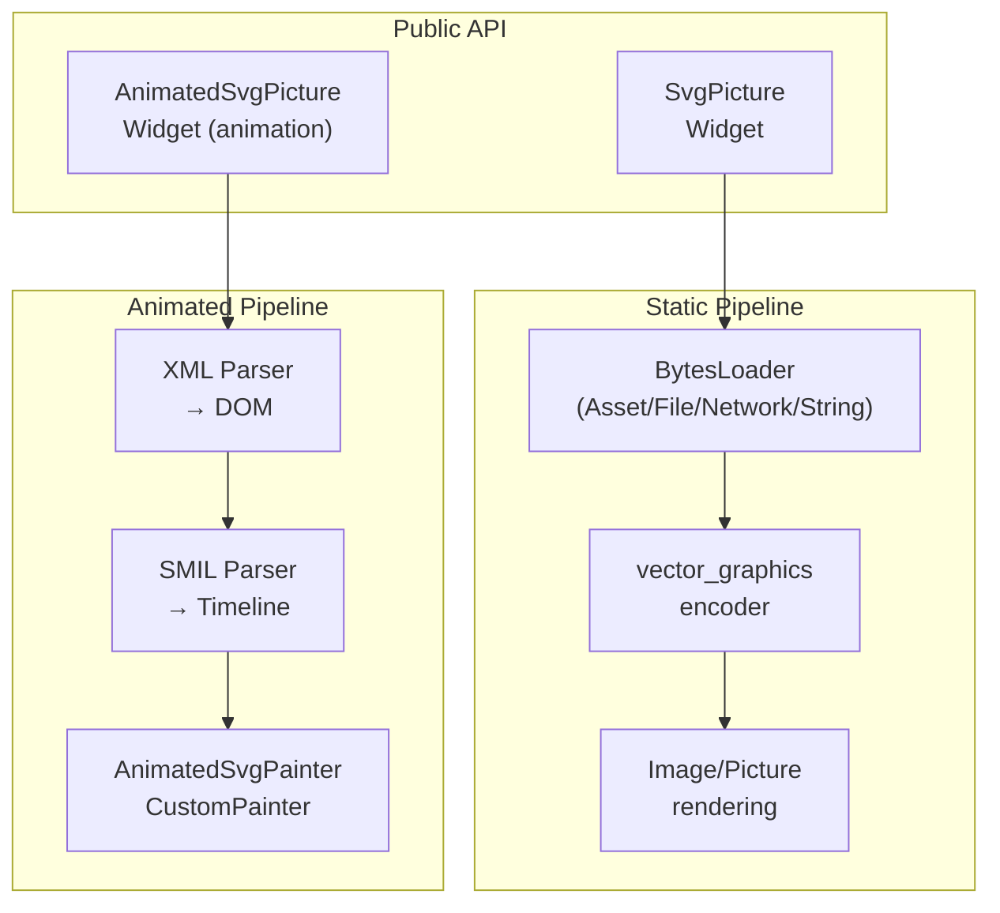
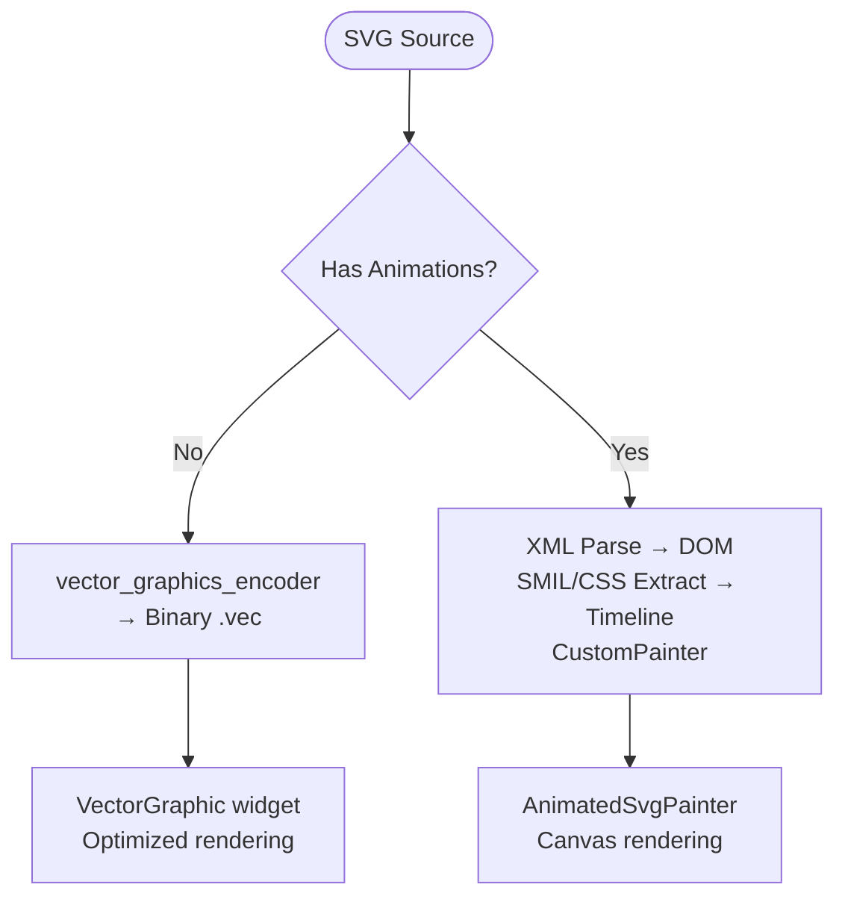
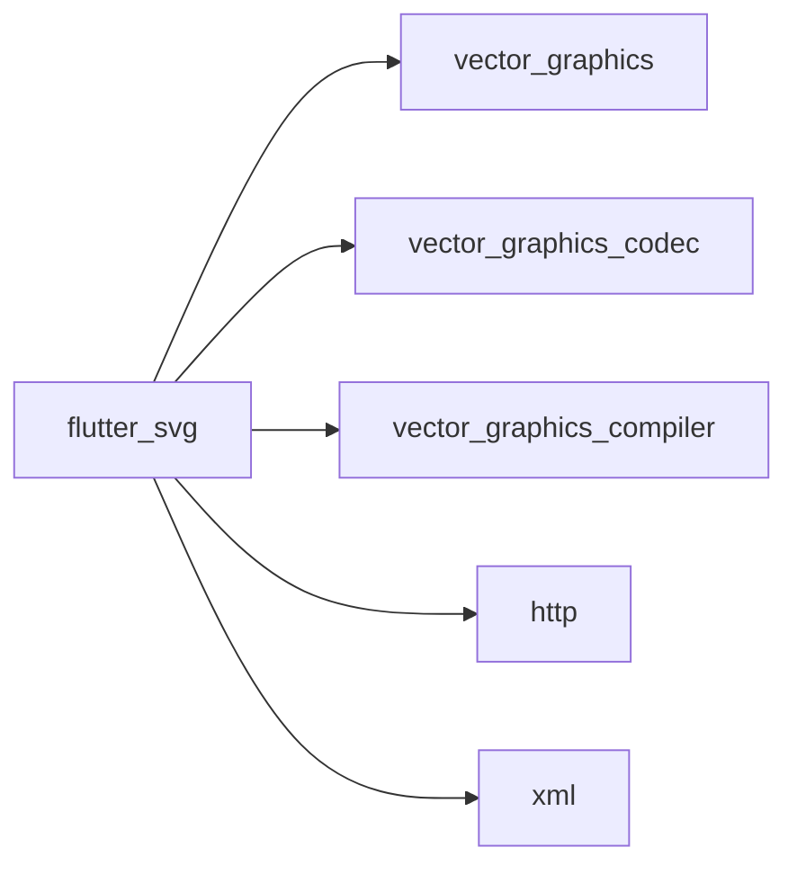

# Troubleshooting and FAQ

<cite>
**Referenced Files in This Document**
- [README.md](file://README.md)
- [pubspec.yaml](file://pubspec.yaml)
- [lib/svg.dart](file://lib/svg.dart)
- [lib/src/loaders.dart](file://lib/src/loaders.dart)
- [lib/src/cache.dart](file://lib/src/cache.dart)
- [lib/src/animation.dart](file://lib/src/animation.dart)
- [ANIMATION.md](file://ANIMATION.md)
- [ARCHITECTURE.md](file://ARCHITECTURE.md)
- [docs/RESOLVED_ISSUES.md](file://docs/RESOLVED_ISSLES.md)
- [test/animation/autoplay_false_test.dart](file://test/animation/autoplay_false_test.dart)
- [test/animation/smil_test.dart](file://test/animation/smil_test.dart)
- [test/cache_test.dart](file://test/cache_test.dart)
- [example/lib/pages/custom_svg_viewer_page.dart](file://example/lib/pages/custom_svg_viewer_page.dart)
- [example/lib/playground/playground_trace_store.dart](file://example/lib/playground/playground_trace_store.dart)
</cite>

## Table of Contents
1. [Introduction](#introduction)
2. [Project Structure](#project-structure)
3. [Core Components](#core-components)
4. [Architecture Overview](#architecture-overview)
5. [Detailed Component Analysis](#detailed-component-analysis)
6. [Dependency Analysis](#dependency-analysis)
7. [Performance Considerations](#performance-considerations)
8. [Troubleshooting Guide](#troubleshooting-guide)
9. [Conclusion](#conclusion)
10. [Appendices](#appendices)

## Introduction
This document provides a comprehensive troubleshooting and FAQ guide for the flutter_svg package. It focuses on diagnosing and resolving SVG rendering issues, animation problems, and performance bottlenecks. It also documents known limitations, resolved issues, compatibility considerations, platform-specific notes, and migration guidance. The content is grounded in the repository’s code, tests, and documentation to ensure accuracy and actionable solutions.

## Project Structure
The flutter_svg package exposes a primary widget for rendering SVGs and optional animation support. The rendering pipeline is split into two modes:
- Static SVG pipeline: vector_graphics-backed binary format for fast production rendering.
- Animated SVG pipeline: DOM-preserving pipeline for SMIL/CSS animations.

**Diagram sources**
- [lib/svg.dart:57-626](file://lib/svg.dart#L57-L626)
- [lib/src/loaders.dart:118-194](file://lib/src/loaders.dart#L118-L194)
- [lib/src/animation.dart:1-31](file://lib/src/animation.dart#L1-L31)
- [ANIMATION.md:195-229](file://ANIMATION.md#L195-L229)
- [ARCHITECTURE.md:6-58](file://ARCHITECTURE.md#L6-L58)

**Section sources**
- [lib/svg.dart:57-626](file://lib/svg.dart#L57-L626)
- [lib/src/loaders.dart:118-194](file://lib/src/loaders.dart#L118-L194)
- [lib/src/animation.dart:1-31](file://lib/src/animation.dart#L1-L31)
- [ANIMATION.md:195-229](file://ANIMATION.md#L195-L229)
- [ARCHITECTURE.md:6-58](file://ARCHITECTURE.md#L6-L58)

## Core Components
- SvgPicture: The primary widget for rendering SVGs from assets, files, network, memory, or strings. Supports placeholders, color filtering, semantics, clipping, and rendering strategy selection.
- BytesLoader family: Encapsulates loading and encoding SVGs into vector_graphics binary format. Includes asset, file, network, and string loaders.
- Cache: LRU cache keyed by loader plus theme and color mapper to avoid redundant decoding.
- AnimatedSvgPicture: Widget for animated SVGs using SMIL/CSS animations with timeline control and runtime interpolation.

Key capabilities and parameters:
- Rendering strategy: picture vs raster trade-offs between flexibility and performance.
- Placeholder/error handling: placeholderBuilder and errorBuilder hooks.
- Theming and color mapping: SvgTheme and ColorMapper for dynamic color substitution.
- Layout constraints: width/height and BoxFit to prevent layout shifts during load.

**Section sources**
- [lib/svg.dart:57-626](file://lib/svg.dart#L57-L626)
- [lib/src/loaders.dart:15-74](file://lib/src/loaders.dart#L15-L74)
- [lib/src/loaders.dart:118-194](file://lib/src/loaders.dart#L118-L194)
- [lib/src/cache.dart:1-110](file://lib/src/cache.dart#L1-L110)

## Architecture Overview
The dual-pipeline design balances performance and feature completeness:
- Static pipeline: Compiles SVG to optimized drawing commands; no DOM or animations.
- Animated pipeline: Preserves DOM, extracts SMIL/CSS animations, and renders via CustomPainter.

**Diagram sources**
- [ARCHITECTURE.md:6-58](file://ARCHITECTURE.md#L6-L58)
- [ANIMATION.md:195-229](file://ANIMATION.md#L195-L229)

**Section sources**
- [ARCHITECTURE.md:6-58](file://ARCHITECTURE.md#L6-L58)
- [ANIMATION.md:195-229](file://ANIMATION.md#L195-L229)

## Detailed Component Analysis

### Rendering Strategy and Performance
- RenderingStrategy.picture: Retains full vector scaling and is the default.
- RenderingStrategy.raster: Renders to Image then draws via drawImage, sacrificing some scaling flexibility for potential performance gains in specific scenarios.

Recommendations:
- Prefer picture mode for scalable UIs and crisp rendering at any zoom.
- Consider raster mode when rendering many large, static SVGs concurrently and memory usage is acceptable.

**Section sources**
- [lib/svg.dart:534-540](file://lib/svg.dart#L534-L540)
- [README.md:133-139](file://README.md#L133-L139)

### Cache Behavior and Memory Management
- Cache keys include the loader, SvgTheme, and ColorMapper to ensure correctness across themes and color substitutions.
- LRU eviction applies when exceeding maximumSize; clearing the cache evicts all entries.
- Pending loads are tracked to avoid duplicate work.

Practical tips:
- Tune maximumSize for your app’s memory budget.
- Clear cache when asset bundles or themes change to avoid stale entries.
- Monitor count to detect leaks or unexpected growth.

**Section sources**
- [lib/src/cache.dart:1-110](file://lib/src/cache.dart#L1-L110)
- [test/cache_test.dart:1-132](file://test/cache_test.dart#L1-L132)

### Animation Pipeline and Diagnostics
- The animated pipeline parses XML to a DOM, extracts SMIL/CSS animations, manages timelines, and renders via CustomPainter.
- Tests validate critical behaviors like autoPlay=false rendering the initial frame and playbackRate affecting time advancement.

Common animation issues and checks:
- autoPlay: false should render the initial frame and not advance; tests confirm this behavior.
- Playback rate multipliers should proportionally advance time.
- Fill modes and repeat counts should behave per SMIL semantics.

**Section sources**
- [ANIMATION.md:1-229](file://ANIMATION.md#L1-L229)
- [ARCHITECTURE.md:102-144](file://ARCHITECTURE.md#L102-L144)
- [test/animation/autoplay_false_test.dart:1-162](file://test/animation/autoplay_false_test.dart#L1-L162)
- [test/animation/smil_test.dart:1-525](file://test/animation/smil_test.dart#L1-L525)

### Loader Family and Encoding
- SvgLoader subclasses encapsulate theme-aware encoding using vector_graphics encoder.
- ColorMapper is delegated to the vector_graphics encoder via an internal adapter.
- Asset loaders resolve bundles dynamically and include bundle identity in cache keys.

**Section sources**
- [lib/src/loaders.dart:118-194](file://lib/src/loaders.dart#L118-L194)
- [lib/src/loaders.dart:234-255](file://lib/src/loaders.dart#L234-L255)
- [lib/src/loaders.dart:343-413](file://lib/src/loaders.dart#L343-L413)
- [lib/src/loaders.dart:417-466](file://lib/src/loaders.dart#L417-L466)

## Dependency Analysis
External dependencies:
- vector_graphics, vector_graphics_codec, vector_graphics_compiler: Core rendering and compilation backend.
- http: Network loading for remote SVGs.
- xml: Parsing for animated pipeline.

Version constraints:
- Flutter SDK and minimum Flutter version are defined in pubspec.yaml.

**Diagram sources**
- [pubspec.yaml:12-19](file://pubspec.yaml#L12-L19)

**Section sources**
- [pubspec.yaml:12-19](file://pubspec.yaml#L12-L19)

## Performance Considerations
- Prefer precompiled vector_graphics (.vec) assets for static SVGs to avoid runtime parsing and encoding overhead.
- Use RenderingStrategy.raster for scenarios where the static pipeline’s picture mode is too CPU-intensive for large, static assets.
- Keep animations simple and avoid excessive nested groups or heavy filters in animated SVGs.
- Monitor cache size and clear when appropriate to prevent memory pressure.
- Use placeholderBuilder to avoid blocking UI during network loads.

[No sources needed since this section provides general guidance]

## Troubleshooting Guide

### 1) SVG renders as an empty box or disappears during load
Symptoms:
- Widget appears empty initially and later fills in.
- Or remains empty with no visible error.

Diagnostic steps:
- Ensure explicit width/height or tight layout constraints to prevent layout shifts.
- Provide placeholderBuilder for network-heavy assets.
- Verify asset path/package name and bundle resolution for asset loaders.

Resolution:
- Set width/height or wrap in constrained layout.
- Add placeholderBuilder to improve UX.
- Confirm assetExists and correct package scoping.

**Section sources**
- [lib/svg.dart:60-63](file://lib/svg.dart#L60-L63)
- [lib/svg.dart:73-75](file://lib/svg.dart#L73-L75)
- [lib/src/loaders.dart:343-413](file://lib/src/loaders.dart#L343-L413)
- [README.md:86-106](file://README.md#L86-L106)

### 2) Network SVG fails to load or shows no error
Symptoms:
- Network requests silently fail or timeout.
- No visible error widget.

Diagnostic steps:
- Inspect errorBuilder usage and network headers.
- Check HTTP client lifecycle and headers.
- Validate URL and connectivity.

Resolution:
- Provide errorBuilder to surface errors.
- Pass custom http.Client via SvgNetworkLoader if needed.
- Add headers if required by server.

**Section sources**
- [lib/svg.dart:245-276](file://lib/svg.dart#L245-L276)
- [lib/src/loaders.dart:417-466](file://lib/src/loaders.dart#L417-L466)

### 3) Color tinting or color mapping not applied
Symptoms:
- Colors remain unchanged despite colorFilter or colorMapper.
- Dynamic color substitution not working.

Diagnostic steps:
- Verify ColorMapper is immutable and passed to the loader.
- Confirm SvgTheme currentColor and fontSize are set appropriately.
- Check that the color attribute being targeted is supported.

Resolution:
- Use ColorFilter.mode for simple tinting.
- Provide a const ColorMapper and ensure immutability.
- Adjust SvgTheme if relying on currentColor or em/ex units.

**Section sources**
- [lib/svg.dart:19-22](file://lib/svg.dart#L19-L22)
- [lib/src/loaders.dart:76-94](file://lib/src/loaders.dart#L76-L94)
- [lib/src/loaders.dart:15-74](file://lib/src/loaders.dart#L15-L74)

### 4) Animation does not start or freezes
Symptoms:
- autoPlay: false prevents any movement.
- Playback rate changes do not affect animation speed.

Diagnostic steps:
- Confirm autoPlay parameter and initialTime usage.
- Validate playbackRate and timeline tick behavior.
- Check fill mode and repeat count semantics.

Resolution:
- For autoPlay: false, expect initial frame rendering; animations do not advance.
- For playbackRate changes, ensure timeline is receiving ticks and rates are applied.
- Review SMIL semantics and attribute types.

**Section sources**
- [test/animation/autoplay_false_test.dart:1-162](file://test/animation/autoplay_false_test.dart#L1-L162)
- [test/animation/smil_test.dart:248-375](file://test/animation/smil_test.dart#L248-L375)
- [ANIMATION.md:150-178](file://ANIMATION.md#L150-L178)

### 5) Performance regressions or high CPU usage
Symptoms:
- Jank during animation or frequent rebuilds.
- Excessive memory consumption.

Diagnostic steps:
- Switch to RenderingStrategy.raster for static assets if picture mode is too expensive.
- Precompile SVGs to .vec format using vector_graphics_compiler.
- Monitor cache size and clear when asset/theme changes occur.

Resolution:
- Use .vec assets for static SVGs.
- Tune cache maximumSize and clear on theme changes.
- Simplify animations and avoid deep hierarchies.

**Section sources**
- [README.md:141-160](file://README.md#L141-L160)
- [lib/svg.dart:534-540](file://lib/svg.dart#L534-L540)
- [lib/src/cache.dart:1-110](file://lib/src/cache.dart#L1-L110)

### 6) Layout shifts during load
Symptoms:
- Widget size changes after initial load completes.

Diagnostic steps:
- Ensure width/height are specified or layout constraints are tight.
- Avoid relying solely on intrinsic SVG dimensions.

Resolution:
- Provide explicit sizing or constrain the parent.

**Section sources**
- [lib/svg.dart:60-63](file://lib/svg.dart#L60-L63)

### 7) Accessibility and semantics issues
Symptoms:
- Screen reader does not announce the image content.

Diagnostic steps:
- Provide semanticsLabel and ensure excludeFromSemantics is false.
- Validate semanticsLabel content.

Resolution:
- Set semanticsLabel to a concise description.
- Keep excludeFromSemantics false for meaningful content.

**Section sources**
- [lib/svg.dart:508-518](file://lib/svg.dart#L508-L518)

### 8) Debugging and logging
Use the example playground diagnostics:
- Trace logs capture events, levels, categories, and stack traces.
- Runtime issues are deduplicated and grouped for easy triage.
- Search and filter logs by category, level, and free-text queries.

**Section sources**
- [example/lib/playground/playground_trace_store.dart:43-109](file://example/lib/playground/playground_trace_store.dart#L43-L109)
- [example/lib/pages/custom_svg_viewer_page.dart:597-1107](file://example/lib/pages/custom_svg_viewer_page.dart#L597-L1107)

## Conclusion
This guide consolidates practical troubleshooting strategies for flutter_svg, covering rendering, animation, performance, and diagnostics. Use the dual-pipeline architecture to choose the optimal rendering mode, leverage precompiled assets for static content, and employ robust error and logging patterns. For animation issues, rely on the documented test behaviors and SMIL semantics to validate expectations.

[No sources needed since this section summarizes without analyzing specific files]

## Appendices

### A) Compatibility and Platform Notes
- Minimum Flutter and SDK versions are defined in pubspec.yaml.
- Network loading depends on the http package; ensure proper permissions for file-based loaders on Android.

**Section sources**
- [pubspec.yaml:8-10](file://pubspec.yaml#L8-L10)
- [lib/svg.dart:308-334](file://lib/svg.dart#L308-L334)

### B) Migration Guidance
- Migrate from deprecated color parameters to ColorFilter.
- Replace PictureProvider and cacheColorFilterOverride with svg.cache usage.
- Prefer vector_graphics .vec assets for static SVGs to reduce runtime cost.

**Section sources**
- [lib/svg.dart:19-22](file://lib/svg.dart#L19-L22)
- [lib/svg.dart:40-54](file://lib/svg.dart#L40-L54)
- [README.md:141-160](file://README.md#L141-L160)

### C) Known Limitations and Resolved Issues
- autoPlay: false rendering empty frame: resolved and covered by tests.
- calcMode="paced" distance computation for path/transform: addressed with dedicated tests.
- SMIL API visibility after refactors: restored via public class members.

**Section sources**
- [docs/RESOLVED_ISSUES.md:1-55](file://docs/RESOLVED_ISSUES.md#L1-L55)
- [test/animation/autoplay_false_test.dart:1-162](file://test/animation/autoplay_false_test.dart#L1-L162)
- [test/animation/smil_test.dart:1-525](file://test/animation/smil_test.dart#L1-L525)