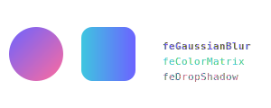

# full_svg_flutter

[](https://pub.dev/packages/full_svg_flutter)
[](https://pub.dev/packages/full_svg_flutter/score)
[](LICENSE)
[](https://flutter.dev)
[](https://pub.dev/packages/full_svg_flutter)

**Animated SVG renderer for Flutter** — SMIL, CSS keyframes, path morphing, filters, masks, text, and playback control.

Use animated SVG files directly in Flutter without converting them to Lottie, Rive, GIF, WebP, or rendering them inside a WebView.

`full_svg_flutter` is designed as a full SVG runtime for Flutter and a migration path from `flutter_svg`: keep the familiar `SvgPicture`-style API while gaining support for animated SVG content through `FSvgPicture`.

> **🆕 New in 1.1.0 — JavaScript runtime + SVGator export support.**
> Animated SVGs that drive their animation via inline `<script>` (the
> JS-export mode in [SVGator][svgator-site], hand-written JS animations,
> custom CSS-keyframe controllers) now render correctly. A modern QuickJS
> engine ([quickjs_engine][qjs-engine-pkg]) is bundled into the app and
> runs the SVG's JavaScript with a polyfilled SVG DOM — no WebView, no
> conversion step. See the [JavaScript runtime](#javascript-runtime--svgator-runtime) section below.

[svgator-site]: https://www.svgator.com/
[qjs-engine-pkg]: https://pub.dev/packages/quickjs_engine

---

<div align="center">

| Spinner (SMIL) | Heartbeat (dash animation) | Path morphing | Filter stack |
|:-:|:-:|:-:|:-:|
|  |  |  |  |

*All four are live SVG files — no GIFs, no Lottie, no third-party runtimes.*

</div>

---

## Animated SVG in Flutter

Flutter's standard SVG packages are excellent for static vector graphics, but animated SVG is a different rendering problem. Animated SVG files may contain SMIL elements, CSS `@keyframes`, animated transforms, opacity transitions, stroke-dash animations, path morphing, masks, gradients, filters, and timeline-based sequencing.

`full_svg_flutter` focuses on rendering SVG **as SVG** inside Flutter. You can use animated SVG assets directly — the ones exported from design tools, downloaded from icon libraries, or crafted by hand — without an additional conversion step.

There are several ways to use animated vector graphics in Flutter: static SVG packages, Lottie/Rive conversion, WebView rendering, and SVG-focused animation renderers. `full_svg_flutter` focuses on keeping SVG as SVG.

---

## Quick start

```yaml
# pubspec.yaml
dependencies:
  full_svg_flutter: ^1.0.3
```

```dart
import 'package:full_svg_flutter/full_svg_flutter.dart';

// static or animated — same widget, zero config
FSvgPicture.asset('assets/logo.svg')
FSvgPicture.asset('assets/spinner.svg')        // auto-detects and plays animations
FSvgPicture.network('https://example.com/animated.svg')
FSvgPicture.string(rawSvgString)
FSvgPicture.file(file)
FSvgPicture.memory(bytes)
```

---

## Comparison

| Feature | full_svg_flutter | flutter_svg | Lottie / Rive |
|---|:---:|:---:|:---:|
| Static SVG rendering | ✅ | ✅ | ❌ needs conversion |
| Animated SVG (SMIL) | ✅ | ❌ | ❌ needs conversion |
| CSS `@keyframes` in SVG | ✅ | ❌ | ❌ needs conversion |
| **Inline `<script>` / JS-driven SVG** | ✅ **(new)** | ❌ | n/a |
| **SVGator JS-export files** | ✅ **(new)** | ❌ | ❌ needs conversion |
| Path morphing | ✅ | ❌ | ❌ needs conversion |
| SVG filters (all 17 primitives) | ✅ | ⚠️ partial | varies |
| Clipping & masking | ✅ | ✅ | varies |
| Gradients | ✅ | ✅ | varies |
| Text rendering | ✅ | ⚠️ partial | varies |
| Playback control (play/pause/seek) | ✅ | ❌ | ✅ |
| No asset conversion required | ✅ | ✅ | ❌ |
| No WebView | ✅ | ✅ | ✅ |
| flutter_svg drop-in migration | ✅ | — | ❌ |
| Desktop (macOS / Windows / Linux) | ✅ | ✅ | varies |

> "⚠️ partial" means the feature exists but coverage or fidelity may be limited.

---

## Why not just use flutter_svg?

`flutter_svg` is a solid choice for static SVG icons and illustrations. If your SVG files are static, `flutter_svg` works well and is widely used.

However, animated SVG is a broader rendering problem. Animated SVG files rely on:

- SMIL `<animate>`, `<animateTransform>`, `<animateMotion>`, `<set>` elements
- CSS `@keyframes` and `animation-*` properties
- Path interpolation (path morphing between shapes)
- Timeline control (begin/end/dur/repeatCount)
- Filter primitives that change over time
- Opacity, transform, and stroke animations

`flutter_svg` does not implement these features. `full_svg_flutter` is built for cases where SVG animation should remain SVG animation.

---

## Why not convert animated SVG to Lottie or Rive?

Converting SVG animations to Lottie or Rive can work well for many projects, but it adds an authoring step and may not preserve all SVG-specific behavior.

`full_svg_flutter` is useful when you want to:

- keep SVG as the source of truth
- load existing SVG assets directly from disk or network
- preserve SMIL/CSS animation semantics where supported
- avoid a WebView for rendering
- avoid GIF/WebP fallbacks
- use one Flutter widget for both static and animated SVG content

---

## Migration from flutter_svg

For static SVGs, migration is a one-line import change:

```dart
// Before
import 'package:flutter_svg/flutter_svg.dart';
SvgPicture.asset('assets/icon.svg');

// After
import 'package:full_svg_flutter/full_svg_flutter.dart';
SvgPicture.asset('assets/icon.svg');   // identical signature, works as-is
```

`SvgPicture` is re-exported with the same API as `flutter_svg`. `ColorMapper`, all loaders, and all constructor signatures are unchanged.

For animated SVGs, switch to `FSvgPicture`:

```dart
// Works for both static and animated SVG — same widget, no manual switching
FSvgPicture.asset('assets/spinner.svg', width: 48, height: 48)
FSvgPicture.asset('assets/hero.svg', colorFilter: ColorFilter.mode(color, BlendMode.srcIn))
```

See [`doc/migration_from_flutter_svg.md`](doc/migration_from_flutter_svg.md) for a detailed migration guide.

---

## The main widget: `FSvgPicture`

`FSvgPicture` detects animation markers at parse time (`<animate>`, `<animateTransform>`, CSS `animation`, `@keyframes`, etc.) and automatically routes to the correct renderer. No manual switching required.

```dart
FSvgPicture.asset(
  'assets/hero.svg',
  autoPlay: false,
  playbackRate: 0.5,
  initialTime: const Duration(milliseconds: 300),
  width: 200,
  height: 200,
  fit: BoxFit.contain,
  colorFilter: const ColorFilter.mode(Colors.white, BlendMode.srcIn),
  semanticsLabel: 'Hero illustration',
  placeholderBuilder: (context) => const CircularProgressIndicator(),
)
```

Animation control parameters are always available and are no-ops when the SVG has no animations.

---

## Playback control: `AnimatedSvgController`

For programmatic animation control, use `AnimatedSvgPicture` directly and attach a controller.

```dart
final controller = AnimatedSvgController();

@override
void dispose() {
  controller.dispose(); // extends ChangeNotifier
  super.dispose();
}
```

```dart
AnimatedSvgPicture.asset(
  'assets/loader.svg',
  controller: controller,
  autoPlay: false,
)
```

### Play / pause

```dart
controller.pause();
controller.resume();
controller.togglePlayPause();

bool isPaused = controller.isPaused;
```

### Seek

```dart
controller.seek(const Duration(seconds: 2));
controller.restart();   // seek to zero + unpause
```

### Speed

```dart
controller.setPlaybackRate(2.0);    // 2× speed
controller.setPlaybackRate(0.25);   // slow motion
double rate = controller.playbackRate;
```

### Direction

```dart
controller.reverse();
controller.forward();
controller.toggleDirection();
bool isReversed = controller.isReversed;
```

### SVG `<view>` navigation

```dart
print(controller.availableViews);   // ['intro', 'loop', 'outro']
controller.switchToView('loop');
controller.switchToView(null);      // back to root viewBox
```

### State changes

```dart
controller.addListener(() {
  setState(() {});
});
```

---

## Supported SVG features

| SVG feature | Status |
|---|---|
| Basic shapes (rect, circle, ellipse, line, polyline, polygon) | ✅ Supported |
| Paths (`<path d="...">`) | ✅ Supported |
| Groups (`<g>`) and `<use>` / `<symbol>` / `<defs>` | ✅ Supported |
| Transforms (translate, rotate, scale, skew, matrix) | ✅ Supported |
| Linear & radial gradients (focal point, gradientUnits) | ✅ Supported |
| Patterns | ✅ Supported |
| Clip paths (`clipPathUnits`, nested, `clip-rule`) | ✅ Supported |
| Masks (`maskUnits`, `maskContentUnits`, luminance/alpha) | ✅ Supported |
| SMIL `<animate>` | ✅ Supported |
| SMIL `<animateTransform>` | ✅ Supported |
| SMIL `<animateMotion>` + `<mpath>` | ✅ Supported |
| SMIL `<set>` and `<animateColor>` | ✅ Supported |
| SMIL timing (begin/end/dur/repeatCount, syncbase, events) | ✅ Supported |
| SMIL calcMode (linear, discrete, spline, paced) | ✅ Supported |
| SMIL additive / accumulate | ✅ Supported |
| CSS `@keyframes` | ✅ Supported |
| CSS `animation-*` properties | ✅ Supported |
| CSS transitions | ✅ Supported |
| CSS 3D transforms (`translate3d`, `rotate3d`, `matrix3d`) | ✅ Supported |
| CSS `calc()` and `var()` | ✅ Supported |
| CSS `@media` queries | ✅ Supported |
| CSS selectors (combinators, attribute, `:nth-child`, `:not()`) | ✅ Supported |
| Path morphing (shape interpolation) | ✅ Supported |
| SVG filters — all 17 FE primitives | ✅ Supported |
| Text (`<text>`, `<tspan>`, `textPath`, multi-position) | ✅ Supported |
| Bidi / RTL text | ✅ Supported |
| Text decorations, writing-mode, emphasis | ✅ Supported |
| Markers | ✅ Supported |
| `<image>` (asset, http/https, data URI, file://) | ✅ Supported |
| `<foreignObject>` | ⚠️ Partial |
| `<switch>` and `systemLanguage` | ✅ Supported |
| Hit-testing across 12 element types | ✅ Supported |
| `<a>` with `onLinkTap` | ✅ Supported |
| Accessibility (`<title>`, `<desc>`, ARIA) | ✅ Supported |
| JavaScript inside SVG | ❌ Not supported |
| External cross-origin resources | ❌ Restricted by platform policy |

---

## SVGator and exported animated SVG files

Animated SVG files exported from [SVGator][svgator-site] and similar tools fall into two broad categories — and `full_svg_flutter` supports **both**:

1. **SMIL / CSS export** — pure declarative animation (no JavaScript). These run on the package's built-in SMIL/CSS animation engine.
2. **JavaScript export** — the SVG ships with an inline `<script>` that drives the animation by writing to the DOM on every `requestAnimationFrame` tick. This is the default mode for most SVGator templates because it produces smaller files and gives the tool more expressive animation primitives. **As of 1.1.0 these run too**, via the bundled JavaScript runtime — see below.

If a JS-export SVGator file does not render correctly on your end, open an issue with the original `.svg` attached — the JS runtime is new and the SVG-DOM polyfill is still growing.

## JavaScript runtime & SVGator runtime

`full_svg_flutter` ships with a real JavaScript engine — [quickjs_engine][qjs-engine-pkg], a [QuickJS-NG][qjsng] 0.14.0 fork bundled into your app on every platform (Android, iOS, macOS, Linux, Windows). When an SVG contains inline `<script>` blocks or `<script src="...">` references, they are executed against a polyfilled SVG DOM — `document.getElementById`, `Element.setAttribute`, `requestAnimationFrame`, `addEventListener`, `getTotalLength` / `getPointAtLength` on virtual `<path>` elements, `style` proxies, timers, fetch, and the rest of the surface most player scripts touch.

What this means concretely:

- **SVGator JS-export files render natively.** Coffee Match Cut, Glowing Gummies, Basketball Boy, Skating Girls, Dog Character, Ramen Raccoon — all play correctly with their original SVGator player script, with no manual conversion to SMIL.
- **Bezier-path arc-length interpolation is honored.** SVGator's player uses `path.getPointAtLength(d)` for arc-length-parameterized bezier animation between keyframes; the polyfill computes real arc-length tables (not zero stubs).
- **Cross-platform parity.** The same JS engine runs on every platform — no more "works on Android, broken on iOS" because of JSC-vs-QuickJS divergence.
- **No WebView.** No platform channels for animation, no HTML/CSS layout engine pulled in. Pure native Skia/Impeller painting.

The JS engine starts on demand — SVGs with no `<script>` element pay zero cost. When the engine does start, it runs in a sandboxed context (no real DOM, no network access beyond what the bridge intercepts via Dart `http`).

[qjsng]: https://github.com/quickjs-ng/quickjs

### Custom JavaScript animations

You're not limited to SVGator-exported files. Any inline `<script>` that walks the SVG via `getElementById` / `setAttribute` will work — write your own animations, or use third-party JS animation runtimes that don't require a full browser.

```xml
<!-- example.svg -->
<svg viewBox="0 0 100 100" xmlns="http://www.w3.org/2000/svg">
  <circle id="dot" cx="50" cy="50" r="10" fill="hotpink"/>
  <script><![CDATA[
    let t = 0;
    function tick() {
      t += 0.05;
      document.getElementById('dot')
        .setAttribute('cx', 50 + Math.cos(t) * 30);
      requestAnimationFrame(tick);
    }
    tick();
  ]]></script>
</svg>
```

```dart
FSvgPicture.asset('assets/example.svg'); // animation just runs.
```

---

## Limitations

`full_svg_flutter` aims to cover a broad subset of browser-style SVG rendering, but it is not a full browser engine.

Known limitations:

- JavaScript inside SVGs runs against a polyfilled SVG DOM (see the [JavaScript runtime](#javascript-runtime--svgator-runtime) section), not a real browser DOM — pages that rely on the full HTML DOM, `window.location`, layout APIs, or third-party JS frameworks that expect a browser environment will not work
- External cross-origin resources follow Flutter's platform security policy
- Some advanced SVG filter combinations may render differently from browsers
- Complex text layout (especially RTL mixed with LTR in a single `<text>`) may differ from browser engines in edge cases
- `<foreignObject>` content is not rendered (the element is parsed but its content is ignored)
- Malformed SVG files may need preprocessing before use

---

## Installation

```yaml
dependencies:
  full_svg_flutter: ^1.0.3
```

```bash
flutter pub add full_svg_flutter
```

---

## Render to canvas / image

```dart
import 'dart:ui' as ui;

final PictureInfo info = await vg.loadPicture(
  const SvgStringLoader('<svg>...</svg>'),
  null,
);

canvas.drawPicture(info.picture);

final ui.Image image = await info.picture.toImage(width, height);
info.picture.dispose();
```

---

## Performance

Gradient shaders, pattern images, text paragraphs, and hit-test geometry are cached with smart invalidation tied to animation frame changes.

Optional raster render strategy for `drawImage` performance on complex static content:

```dart
FSvgPicture.asset('assets/icon.svg', renderingStrategy: RenderingStrategy.raster)
```

---

## Precompiled SVGs (optional)

The `vector_graphics` backend supports binary compilation for faster first-frame parsing:

```sh
dart run vector_graphics_compiler -i assets/foo.svg -o assets/foo.svg.vec
```

```dart
import 'package:vector_graphics/vector_graphics.dart';

const Widget svg = SvgPicture(AssetBytesLoader('assets/foo.svg.vec'));
```

---

## ColorMapper

Fine-grained color substitution for theming and dynamic branding:

```dart
class ThemeColorMapper extends ColorMapper {
  const ThemeColorMapper(this.primary);
  final Color primary;

  @override
  Color substitute(String? id, String elementName, String attributeName, Color color) {
    if (color == const Color(0xFF0057FF)) return primary;
    return color;
  }
}

FSvgPicture.asset('assets/logo.svg', colorMapper: ThemeColorMapper(Theme.of(context).primaryColor))
```

---

## SVG feature coverage

| Category | Parity | What's covered |
|---|---|---|
| Geometry | ~95% | All 8 shapes, markers, patterns, gradients (linear/radial, focal point) |
| Text & Typography | **~99%** | Multi-position x/y/dx/dy, per-char rotate, textPath, writing-mode, decorations, bidi, emphasis, shadow, font-variant, paint-order stroke, NFC, grapheme clusters, hanging punctuation, baseline alignment, ligature shaping |
| SMIL Animation | ~95% | `<animate>` `<animateTransform>` `<animateMotion>` `<set>` `<animateColor>`, full timing/interpolation, event-based sync, calcMode (linear/discrete/spline/paced), additive/accumulate, `<mpath>` |
| CSS Animation | ~90% | `@keyframes`, `animation-*`, transitions, 3D transforms (`translate3d`, `rotate3d`, `matrix3d`, `perspective`), `calc()`, `var()`, `@media` |
| CSS Selectors | ~90% | Combinators, attribute selectors, `:hover :active :not() :nth-child() :nth-of-type() :empty :root`, specificity, `!important`, shorthand expansion |
| SVG Filters | **~97%** | All 17/17 FE primitives with actual math — Lambertian lighting, Blinn-Phong specular, bilinear displacement, full convolution kernel, turbulence noise |
| Clipping & Masking | **~100%** | Full Blink parity: clipPathUnits, nested clip-paths, clip-rule, maskUnits, maskContentUnits, luminance/alpha, layer compositing |
| Interaction | ~85% | Hit-testing across 12 element types, pointer-events, `<a>` with onLinkTap, `<view>` fragment identifiers, per-character text hit regions |
| Accessibility | ~80% | `<title>`/`<desc>` → Semantics label/hint, ARIA attributes, Flutter Semantics flags |
| Structural | ~85% | `use`/`symbol`/`defs`/`view`/`a`/`switch`/`foreignObject` with full CSS cascade |

### 17/17 SVG filter primitives

`feGaussianBlur` · `feColorMatrix` · `feBlend` (all SVG2 modes) · `feComposite` (arithmetic) · `feMorphology` · `feDisplacementMap` (bilinear) · `feDiffuseLighting` (Lambertian per-pixel) · `feSpecularLighting` (Blinn-Phong per-pixel) · `feConvolveMatrix` (actual kernel math) · `feTurbulence` · `feComponentTransfer` (5 function types) · `feOffset` · `feFlood` · `feMerge` · `feTile` · `feDropShadow` · `feImage`

---

## Test suite

> **250+ test files. W3C SVG 1.1 conformance suite. Visual golden regression. Animation integration tests.**

| Layer | What it covers |
|---|---|
| **Unit** | Every parser, interpolator, filter primitive, CSS property, text layout algorithm, hit-test geometry — individually |
| **W3C conformance** | Official W3C SVG 1.1 test suite golden comparisons — the same tests browsers run |
| **Visual goldens** | Pixel-level regression for complex renders: filters, blend modes, clipping, text on path |
| **Animation integration** | Full SMIL timing engine: syncbase, event offsets, calcMode, accumulate, `<mpath>` path follow |

Selected test coverage (from `test/`):

- **SMIL**: `smil_test.dart`, `smil_timing_precision_test.dart`, `smil_keypoints_timing_test.dart`, `smil_path_morphing_integration_test.dart`, `animate_motion_advanced_test.dart`
- **CSS**: `css_animations_test.dart`, `css_3d_transforms_test.dart`, `css_variables_calc_test.dart`, `css_cascade_specificity_test.dart`, `css_nth_selectors_test.dart`
- **Filters**: `filters_test.dart`, `fe_lighting_test.dart`, `fe_convolve_matrix_test.dart`, `filter_displacement_tile_test.dart`, `turbulence_edge_cases_test.dart`
- **Text**: `text_typography_parity_test.dart`, `text_bidi_complex_scripts_test.dart`, `text_ligature_shaping_test.dart`, `text_path_precision_test.dart`
- **Clipping/Masking**: `advanced_clip_mask_composition_test.dart`, `mask_pipeline_test.dart`, `clip_path_advanced_test.dart`
- **Geometry**: `path_morphing_correctness_test.dart`, `geometry_edge_cases_test.dart`, `gradient_pattern_units_test.dart`, `marker_test.dart`
- **Hit-testing**: `hit_test_advanced_features_test.dart`, `hit_test_precision_test.dart`, `hit_test_deep_nesting_test.dart`
- **Regression**: `regression_animation_edge_cases_test.dart`, `regression_filter_edge_cases_test.dart`, `regression_text_edge_cases_test.dart`

---

## Performance benchmarks

A reproducible benchmark suite in [`benchmark/`](benchmark/) measures frame stability, parse speed, memory usage, and SVG feature compatibility.

Benchmarks cover:

- Cold SVG parse / warm cached render
- Static icon grids (100–500 items)
- Scroll stress tests (200 SVG items)
- SMIL / CSS animation frame stability
- Filter-heavy SVGs
- `picture` vs `raster` rendering strategy

```bash
# macOS — no device needed
./benchmark/scripts/run_macos.sh

# Android
./benchmark/scripts/run_android.sh

# Pure Dart parser microbenchmarks (no Flutter required)
./benchmark/scripts/run_parser_benchmarks.sh

# Generate HTML + Markdown report from collected results
dart run benchmark/scripts/generate_report.dart
```

See [`benchmark/README.md`](benchmark/README.md) for full methodology and how to interpret UI-thread vs raster-thread numbers.

---

## FAQ

### Does Flutter support animated SVG natively?

Flutter can render vector graphics, but animated SVG requires runtime support for SMIL, CSS `@keyframes`, animated transforms, and path interpolation. `full_svg_flutter` is built specifically for this use case.

### Does flutter_svg support SVG animations?

`flutter_svg` is focused on static SVG rendering. If your SVG contains SMIL or CSS animations, you need a package like `full_svg_flutter`, a Lottie/Rive conversion workflow, or a WebView.

### Can I use animated SVG in Flutter without Lottie?

Yes. `full_svg_flutter` renders SVG animation directly inside Flutter where the used SVG features are supported — no conversion step needed.

### Can I use animated SVG in Flutter without Rive?

Yes. Rive is a great animation tool, but if your asset is already SVG, `full_svg_flutter` lets you keep SVG as the source format without a roundtrip conversion.

### Can I use animated SVG in Flutter without a WebView?

Yes. `full_svg_flutter` renders inside Flutter's own painting layer. No `webview_flutter`, no platform views.

### Does this package work with SVGator exports?

It depends on the SVGator export mode. SMIL and CSS export modes generally work. JavaScript-driven animations are not supported. Use SMIL or CSS export if available.

### Is this a drop-in replacement for flutter_svg?

For static SVGs — yes, `SvgPicture` is re-exported with the same API. For animated SVGs, use `FSvgPicture` or `AnimatedSvgPicture` instead.

### Does this package use a WebView?

No. Rendering happens entirely inside Flutter's painting infrastructure.

### What platforms are supported?

Android, iOS, macOS, Windows, Linux, and Web (file:// URIs are web-only disabled; everything else works).

---

## More documentation

- [`doc/migration_from_flutter_svg.md`](doc/migration_from_flutter_svg.md) — Step-by-step migration guide
- [`doc/supported_features.md`](doc/supported_features.md) — Detailed SVG feature compatibility matrix
- [`doc/limitations.md`](doc/limitations.md) — Known limitations and workarounds
- [`benchmark/README.md`](benchmark/README.md) — Benchmark methodology and results

---

## SVG attribution

SVGs in `/assets/w3samples` — [W3 sample files](https://dev.w3.org/SVG/tools/svgweb/samples/svg-files/)

SVGs in `/assets/wikimedia` — [Wikimedia Commons](https://commons.wikimedia.org/wiki/Main_Page)

Android Drawables in `/assets/android_vd` — Android Documentation

The Flutter Logo is based on the Flutter Logo Widget © Google.

The Dart logo — [dartlang.org](https://github.com/dart-lang/site-shared/blob/master/src/_assets/images/dart/logo%2Btext/horizontal/original.svg) © Google

SVGs in `/assets/noto-emoji` — [Google i18n noto-emoji](https://github.com/googlei18n/noto-emoji), Apache license.
