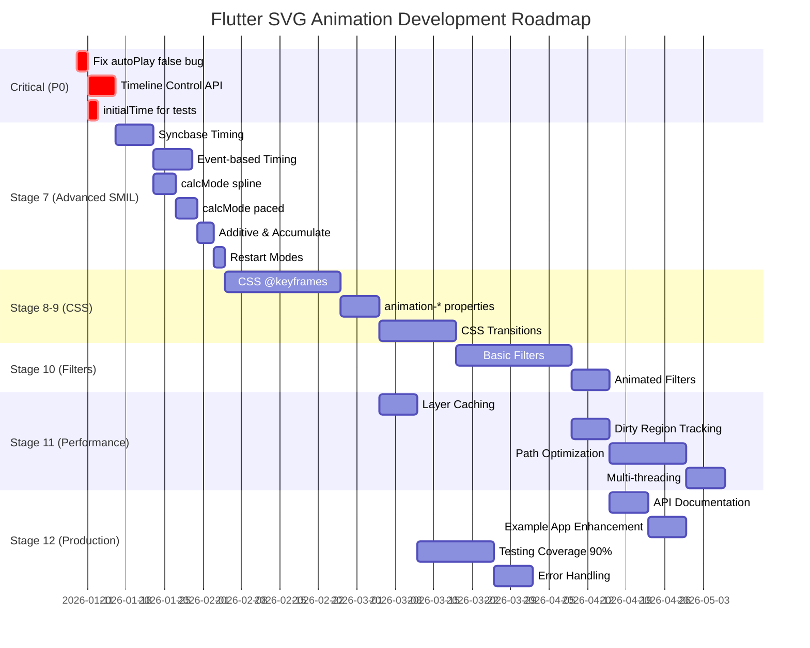
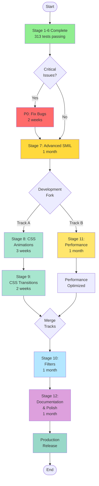
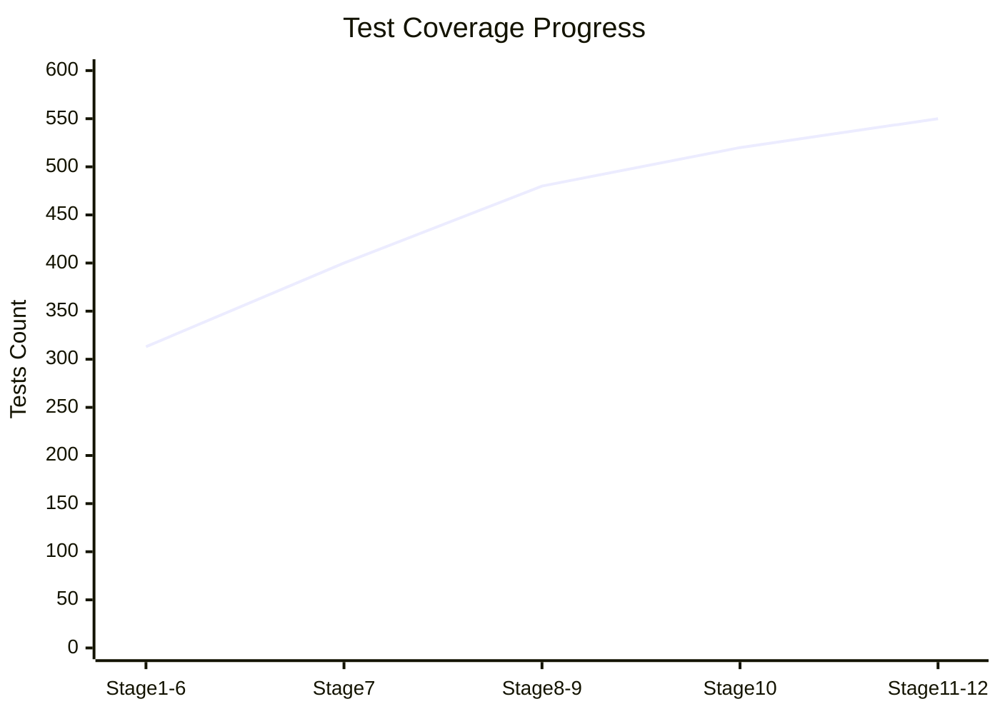
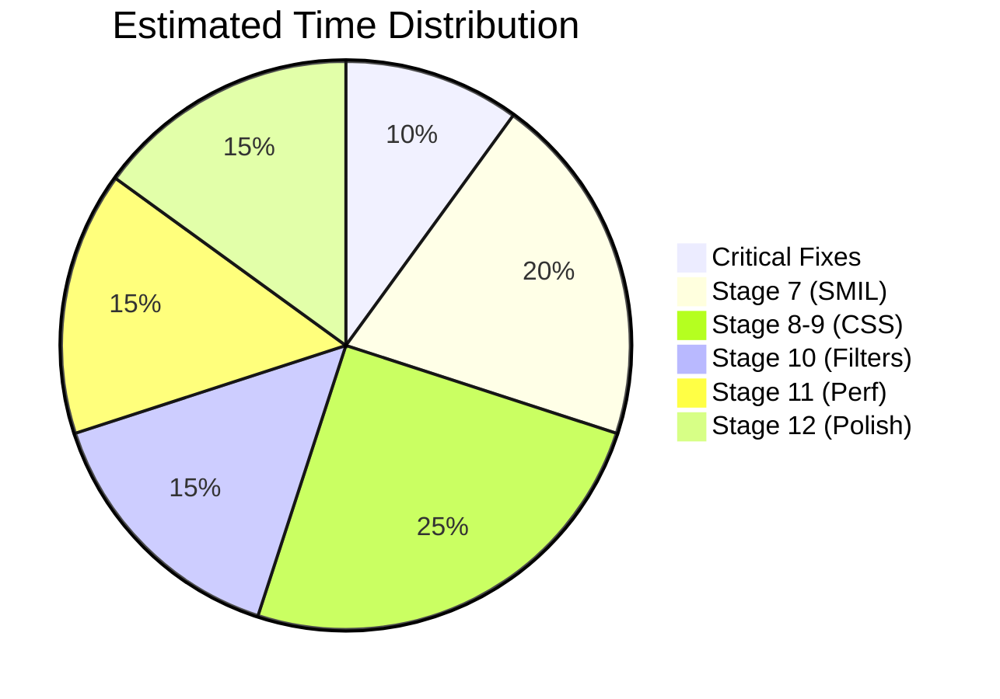
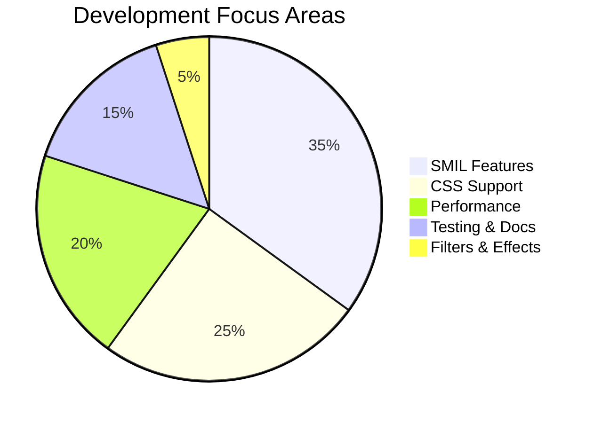

# Development Roadmap - Visual Overview



## Roadmap Timeline Summary

### 🔴 Phase 1: Critical Fixes (Week 1-2)
**Duration:** ~2 weeks  
**Goal:** Core functionality stable
- Fix autoPlay: false bug
- Timeline Control API
- initialTime for tests

### 🟠 Phase 2: Stage 7 - Advanced SMIL (Week 3-6)
**Duration:** ~1 month  
**Goal:** 80% SMIL specification coverage
- Syncbase timing
- Event-based timing
- Advanced calcMode (spline, paced)
- Additive/Accumulate
- Restart modes

### 🟡 Phase 3: CSS & Performance (Week 7-18)
**Duration:** ~3 months  
**Goal:** CSS animations + optimized rendering
- CSS @keyframes
- CSS transitions
- Layer caching
- Performance optimizations

### 🟢 Phase 4: Advanced Features (Week 19-30)
**Duration:** ~3 months  
**Goal:** Production-ready package
- SVG Filters
- Full performance optimization
- Comprehensive documentation
- 90%+ test coverage

## Feature Priority Matrix

```mermaid
quadrantChart
    title Feature Priority vs Complexity
    x-axis Low Complexity --> High Complexity
    y-axis Low Priority --> High Priority
    quadrant-1 Quick Wins
    quadrant-2 Major Projects
    quadrant-3 Fill-ins
    quadrant-4 Hard Problems
    
    Timeline API: [0.3, 0.9]
    autoPlay fix: [0.2, 0.95]
    Syncbase: [0.6, 0.8]
    Events: [0.5, 0.75]
    calcMode spline: [0.4, 0.6]
    CSS @keyframes: [0.8, 0.7]
    CSS Transitions: [0.7, 0.5]
    Filters: [0.9, 0.4]
    Layer Cache: [0.5, 0.6]
    Multi-thread: [0.8, 0.5]
```

## Development Stages Flow



## Feature Dependency Graph

```mermaid
graph TD
    subgraph "Stage 1-6 ✅"
        A[Infrastructure]
        B[SMIL Core]
        C[Rendering]
        D[Colors]
        E[Transforms]
        F[Paths]
    end
    
    subgraph "Critical P0"
        G[autoPlay fix]
        H[Timeline API]
        I[initialTime]
    end
    
    subgraph "Stage 7"
        J[Syncbase]
        K[Events]
        L[Spline]
        M[Paced]
    end
    
    subgraph "Stage 8-9"
        N[CSS Parser]
        O[@keyframes]
        P[Transitions]
    end
    
    subgraph "Stage 10"
        Q[Basic Filters]
        R[Animated Filters]
    end
    
    subgraph "Stage 11"
        S[Caching]
        T[Optimization]
    end
    
    F --> G
    F --> H
    H --> I
    
    B --> J
    H --> K
    B --> L
    L --> M
    
    C --> N
    N --> O
    O --> P
    
    C --> Q
    J --> R
    Q --> R
    
    C --> S
    S --> T
    
    style A fill:#90EE90
    style B fill:#90EE90
    style C fill:#90EE90
    style D fill:#90EE90
    style E fill:#90EE90
    style F fill:#90EE90
```

## Test Coverage Growth



## Time to Production



---

## Key Milestones

| Milestone | Week | Description | Status |
|-----------|------|-------------|--------|
| 🎯 M0 | 0 | Stage 1-6 Complete | ✅ Done |
| 🎯 M1 | 2 | Critical Issues Fixed | 🔄 In Progress |
| 🎯 M2 | 6 | Stage 7 Complete (80% SMIL) | ⏳ Planned |
| 🎯 M3 | 12 | CSS Animations Working | ⏳ Planned |
| 🎯 M4 | 18 | Performance Optimized | ⏳ Planned |
| 🎯 M5 | 24 | Filters Working | ⏳ Planned |
| 🎯 M6 | 30 | Production Release | ⏳ Planned |

---

## Resource Allocation



---

**Legend:**
- 🔴 Critical Priority
- 🟠 High Priority
- 🟡 Medium Priority
- 🟢 Low Priority
- ✅ Complete
- 🔄 In Progress
- ⏳ Planned

**Total Duration:** ~6-7 months to full production
**Current Progress:** ~40% complete (Stage 1-6)
**Next Milestone:** Critical fixes (2 weeks)
