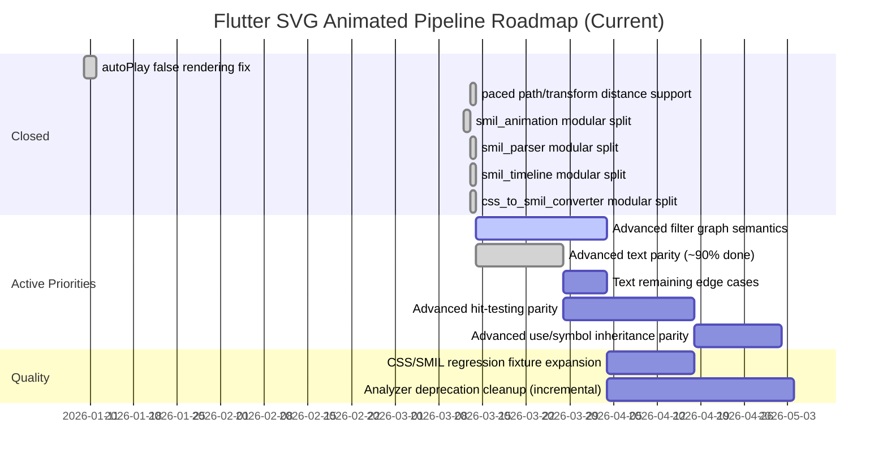

# Development Roadmap - Visual Overview (Living)

## Status Legend

- `Closed`: completed and regression-covered.
- `Active Priorities`: current delivery queue.
- `Quality`: ongoing hardening tasks.

## Source of Truth

- [CURRENT_STATUS.md](CURRENT_STATUS.md)
- [TODO.md](TODO.md)
- [NEXT_STEPS.md](NEXT_STEPS.md)
- [docs/RESOLVED_ISSUES.md](docs/RESOLVED_ISSUES.md)
